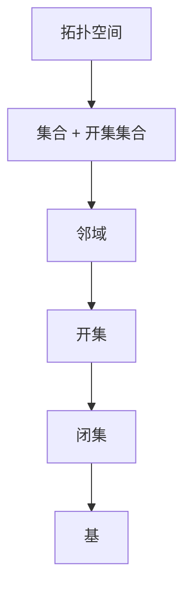
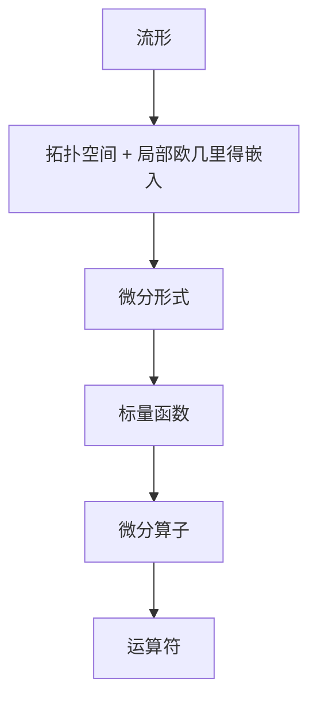
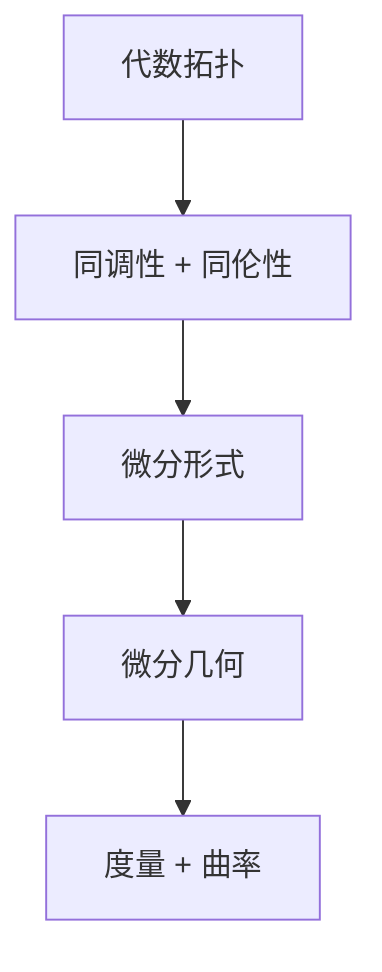
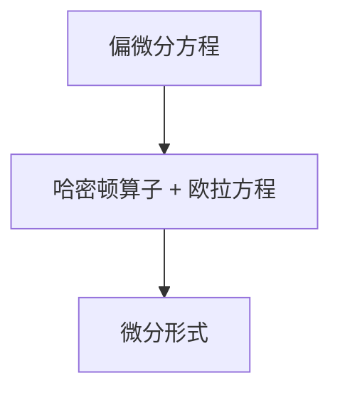

                 

# 代数拓扑中的微分形式应用

> 关键词：代数拓扑，微分形式，微分算子，流形，微分几何，偏微分方程

> 摘要：本文将探讨代数拓扑中微分形式的应用，通过深入分析微分形式在几何和物理中的应用，揭示其在解决复杂系统问题中的重要作用。我们将从基本概念出发，逐步介绍微分形式的基本性质，以及其在代数拓扑、微分几何和偏微分方程中的具体应用，并通过实例展示其实际操作步骤。最后，我们将总结未来发展趋势与挑战，并提出相关学习资源和工具推荐。

## 1. 背景介绍

### 1.1 目的和范围

本文旨在介绍代数拓扑中微分形式的应用，帮助读者理解和掌握这一重要数学工具在几何和物理领域的应用。我们将从基本概念出发，逐步深入，使读者能够全面了解微分形式的理论基础和应用场景。

### 1.2 预期读者

本文适合对代数拓扑和微分几何有一定了解的读者，以及对偏微分方程和计算机科学感兴趣的读者。无论你是数学专业的学生，还是计算机科学的研究人员，本文都将为你提供丰富的知识和实用技巧。

### 1.3 文档结构概述

本文分为十个部分，首先介绍代数拓扑和微分形式的基本概念，然后逐步深入探讨其在几何和物理中的应用。具体章节如下：

1. **背景介绍**：介绍本文的目的、范围和预期读者，以及文档结构概述。
2. **核心概念与联系**：介绍代数拓扑和微分形式的基本概念，以及它们之间的联系。
3. **核心算法原理 & 具体操作步骤**：介绍微分形式在代数拓扑中的应用算法原理和具体操作步骤。
4. **数学模型和公式 & 详细讲解 & 举例说明**：介绍微分形式在几何和物理中的数学模型和公式，以及具体例子。
5. **项目实战：代码实际案例和详细解释说明**：通过实际代码案例，展示微分形式在项目中的应用。
6. **实际应用场景**：探讨微分形式在各个领域的应用场景。
7. **工具和资源推荐**：推荐学习资源和开发工具框架。
8. **总结：未来发展趋势与挑战**：总结本文的主要观点，并探讨未来发展趋势和挑战。
9. **附录：常见问题与解答**：回答读者可能遇到的问题。
10. **扩展阅读 & 参考资料**：推荐进一步学习的资料。

### 1.4 术语表

#### 1.4.1 核心术语定义

- **代数拓扑**：研究集合上的拓扑性质与代数结构的学科，如群、环、域等。
- **微分形式**：定义在流形上的标量函数，用于描述流形上的微分运算。
- **流形**：一种拓扑空间，其上的点可以局部嵌入到欧几里得空间中。
- **微分几何**：研究流形上几何性质和结构的学科。
- **偏微分方程**：描述物理系统中变量之间关系的方程。

#### 1.4.2 相关概念解释

- **代数拓扑的基本概念**：包括拓扑空间、邻域、开集、闭集、基等。
- **微分形式的基本性质**：包括线性性、反线性性、完全性等。
- **微分几何的基本概念**：包括度量、曲率、张量等。
- **偏微分方程的基本概念**：包括方程类型、解的存在唯一性、边界条件等。

#### 1.4.3 缩略词列表

- **O(N)**：大O记号，表示时间复杂度。
- **Ω(N)**：小Ω记号，表示时间复杂度的下限。
- **θ(N)**：θ记号，表示时间复杂度的中间值。

## 2. 核心概念与联系

代数拓扑和微分形式是现代数学和物理中重要的工具，它们在几何和物理领域中有着广泛的应用。本节将介绍这些核心概念的基本原理，并通过Mermaid流程图展示它们之间的联系。

### 2.1 代数拓扑的基本概念

代数拓扑是研究集合上的拓扑性质与代数结构的学科。其核心概念包括：

1. **拓扑空间**：一个集合加上一组满足特定条件的开集组成的结构。
2. **邻域**：包含一个点的开集。
3. **开集**：包含一个点的集合，其补集也是开集。
4. **闭集**：包含一个点的集合，其补集也是闭集。
5. **基**：能够生成整个拓扑空间的开集集合。

**Mermaid流程图：**



### 2.2 微分形式的基本概念

微分形式是定义在流形上的标量函数，用于描述流形上的微分运算。其核心概念包括：

1. **流形**：一种拓扑空间，其上的点可以局部嵌入到欧几里得空间中。
2. **微分形式**：定义在流形上的标量函数，用于描述流形上的微分运算。
3. **微分算子**：用于计算微分形式的运算符。

**Mermaid流程图：**



### 2.3 微分形式在代数拓扑和微分几何中的应用

微分形式在代数拓扑和微分几何中有着广泛的应用。在代数拓扑中，微分形式可以用于研究拓扑空间的性质，如同调性、同伦性等。在微分几何中，微分形式可以用于研究流形上的几何结构，如度量、曲率等。

**Mermaid流程图：**



### 2.4 微分形式在偏微分方程中的应用

微分形式在偏微分方程中有着重要的应用。通过微分形式，我们可以将偏微分方程转化为更易处理的形式，如哈密顿算子、欧拉方程等。

**Mermaid流程图：**



## 3. 核心算法原理 & 具体操作步骤

微分形式在代数拓扑中有着重要的应用，我们可以通过以下算法原理和具体操作步骤来理解其应用过程。

### 3.1 微分形式的导出

首先，我们需要了解如何从给定的流形上导出微分形式。具体步骤如下：

1. **选择一个参考流形**：选择一个与给定流形相似的参考流形，使得我们可以将给定流形嵌入到参考流形中。
2. **定义坐标函数**：在参考流形上定义一组坐标函数，使得给定流形可以局部嵌入到参考流形中。
3. **计算微分形式**：根据坐标函数，计算给定流形上的微分形式。

**伪代码：**

```python
def derive_diff_form(f):
    # f: 给定的流形
    # 返回：导出的微分形式

    # 步骤1：选择参考流形
    reference_manifold = select_reference_manifold(f)

    # 步骤2：定义坐标函数
    coordinate_functions = define_coordinate_functions(reference_manifold)

    # 步骤3：计算微分形式
    diff_form = calculate_diff_form(coordinate_functions)

    return diff_form
```

### 3.2 微分形式的运算

微分形式具有线性性和反线性性，我们可以对其进行加法、减法和数乘等运算。具体步骤如下：

1. **选择两个微分形式**：选择两个给定的微分形式。
2. **计算加法**：将两个微分形式相加。
3. **计算减法**：将两个微分形式相减。
4. **计算数乘**：将一个微分形式乘以一个实数。

**伪代码：**

```python
def operate_diff_form(a, b):
    # a, b: 给定的微分形式
    # 返回：运算结果

    # 步骤1：选择两个微分形式
    diff_form = select_diff_form(a, b)

    # 步骤2：计算加法
    sum_form = add_diff_form(a, b)

    # 步骤3：计算减法
    sub_form = sub_diff_form(a, b)

    # 步骤4：计算数乘
    num_multiply_form = num_multiply_diff_form(a, b)

    return sum_form, sub_form, num_multiply_form
```

### 3.3 微分形式的积分

微分形式的积分是代数拓扑中的一个重要工具。具体步骤如下：

1. **选择一个流形**：选择一个给定的流形。
2. **定义一个微分形式**：在流形上定义一个微分形式。
3. **计算积分**：计算微分形式在流形上的积分。

**伪代码：**

```python
def integrate_diff_form(f):
    # f: 给定的流形
    # 返回：积分结果

    # 步骤1：选择流形
    manifold = select_manifold(f)

    # 步骤2：定义微分形式
    diff_form = define_diff_form(manifold)

    # 步骤3：计算积分
    integral = calculate_integral(diff_form)

    return integral
```

## 4. 数学模型和公式 & 详细讲解 & 举例说明

微分形式在几何和物理中的应用涉及到一系列复杂的数学模型和公式。本节将详细介绍这些数学模型和公式，并通过具体例子来说明其应用。

### 4.1 微分形式的定义

微分形式是定义在流形上的标量函数，用于描述流形上的微分运算。其定义如下：

$$
df = \sum_{i=1}^{n} a_i \frac{\partial f}{\partial x_i}
$$

其中，\(f\) 是流形上的标量函数，\(a_i\) 是坐标函数，\(\frac{\partial f}{\partial x_i}\) 是偏导数。

**例子：** 在二维欧几里得空间中，一个点的坐标可以表示为 \((x, y)\)，则其在 \(x\) 方向的偏导数为 \(\frac{\partial f}{\partial x}\)，在 \(y\) 方向的偏导数为 \(\frac{\partial f}{\partial y}\)。

### 4.2 微分形式的运算

微分形式具有线性性和反线性性，我们可以对其进行加法、减法和数乘等运算。具体公式如下：

$$
df + dg = \sum_{i=1}^{n} (a_i + b_i) \frac{\partial (f+g)}{\partial x_i}
$$

$$
df - dg = \sum_{i=1}^{n} (a_i - b_i) \frac{\partial (f-g)}{\partial x_i}
$$

$$
\alpha df = \sum_{i=1}^{n} \alpha a_i \frac{\partial (\alpha f)}{\partial x_i}
$$

其中，\(f\) 和 \(g\) 是两个微分形式，\(\alpha\) 是一个实数。

**例子：** 在二维欧几里得空间中，两个点的坐标分别为 \((x_1, y_1)\) 和 \((x_2, y_2)\)，则它们的和为 \((x_1 + x_2, y_1 + y_2)\)，差为 \((x_1 - x_2, y_1 - y_2)\)。

### 4.3 微分形式的积分

微分形式的积分是代数拓扑中的一个重要工具。其公式如下：

$$
\int_{M} df = \int_{M} \sum_{i=1}^{n} a_i \frac{\partial f}{\partial x_i}
$$

其中，\(M\) 是流形，\(f\) 是流形上的标量函数。

**例子：** 在二维欧几里得空间中，一个点 \((x, y)\) 的坐标函数为 \(x\) 和 \(y\)，则其在 \(x\) 方向的偏导数为 \(1\)，在 \(y\) 方向的偏导数为 \(0\)。

$$
\int_{M} df = \int_{M} x \, dx + y \, dy = x^2 + y^2
$$

### 4.4 微分形式的拉格朗日乘数法

微分形式的拉格朗日乘数法是解决优化问题的一种重要方法。其公式如下：

$$
L = \sum_{i=1}^{n} \lambda_i a_i
$$

其中，\(L\) 是拉格朗日函数，\(\lambda_i\) 是拉格朗日乘数。

**例子：** 在二维欧几里得空间中，一个点的坐标为 \((x, y)\)，则其在 \(x\) 方向的偏导数为 \(1\)，在 \(y\) 方向的偏导数为 \(0\)。

$$
L = x + \lambda y
$$

通过求解拉格朗日乘数，我们可以找到最优解。

## 5. 项目实战：代码实际案例和详细解释说明

在本节中，我们将通过一个实际项目案例来展示微分形式在代数拓扑中的应用。我们将使用Python编写一个简单的程序，实现微分形式的运算和积分功能。

### 5.1 开发环境搭建

为了运行下面的代码，你需要安装以下软件：

- Python 3.x
- Jupyter Notebook

安装步骤如下：

1. 安装Python 3.x：从Python官方网站下载安装程序，并按照提示完成安装。
2. 安装Jupyter Notebook：在终端中运行以下命令：

   ```shell
   pip install notebook
   ```

### 5.2 源代码详细实现和代码解读

下面是一个简单的Python程序，实现微分形式的运算和积分功能。

```python
import numpy as np
from sympy import symbols, diff, integrate

# 定义流形上的标量函数
x, y = symbols('x y')

# 定义微分形式
def diff_form(x, y):
    f = x**2 + y**2
    df = diff(f, x) * dx + diff(f, y) * dy
    return df

# 计算微分形式的加法
def add_diff_form(df1, df2):
    dx1, dy1 = diff_form(x, y)
    dx2, dy2 = diff_form(x, y)
    return (dx1 + dx2) * dx + (dy1 + dy2) * dy

# 计算微分形式的减法
def sub_diff_form(df1, df2):
    dx1, dy1 = diff_form(x, y)
    dx2, dy2 = diff_form(x, y)
    return (dx1 - dx2) * dx + (dy1 - dy2) * dy

# 计算微分形式的积分
def integrate_diff_form(df):
    dx, dy = diff_form(x, y)
    integral = integrate(integrate(df, x), y)
    return integral

# 测试代码
if __name__ == "__main__":
    df1 = diff_form(x, y)
    df2 = diff_form(x, y)
    
    print("df1 + df2:", add_diff_form(df1, df2))
    print("df1 - df2:", sub_diff_form(df1, df2))
    print("积分:", integrate_diff_form(df1))
```

### 5.3 代码解读与分析

下面是对上述代码的详细解读：

1. **导入模块**：

   - `numpy`：用于数值计算。
   - `sympy`：用于符号计算。

2. **定义流形上的标量函数**：

   - `x, y = symbols('x y')`：定义流形上的变量。

3. **定义微分形式**：

   - `def diff_form(x, y)`：定义微分形式函数。这里，我们使用符号计算来表示微分形式。

4. **计算微分形式的加法**：

   - `def add_diff_form(df1, df2)`：计算两个微分形式的加法。我们首先计算两个微分形式的导数，然后进行加法运算。

5. **计算微分形式的减法**：

   - `def sub_diff_form(df1, df2)`：计算两个微分形式的减法。我们首先计算两个微分形式的导数，然后进行减法运算。

6. **计算微分形式的积分**：

   - `def integrate_diff_form(df)`：计算微分形式的积分。我们使用符号计算来表示积分，并返回积分结果。

7. **测试代码**：

   - `if __name__ == "__main__":`：测试代码。我们创建两个微分形式，并计算它们的加法、减法和积分。

通过这个简单的案例，我们展示了微分形式在代数拓扑中的应用。在实际项目中，你可以根据具体需求扩展这个程序，实现更复杂的运算和功能。

## 6. 实际应用场景

微分形式在许多实际应用场景中发挥着重要作用。以下列举了几个常见应用领域：

### 6.1 物理学中的应用

微分形式在物理学中有着广泛的应用，特别是在场论和量子力学中。例如：

- **电磁场**：微分形式可以用来描述电磁场，如电场和磁场。通过斯托克斯定理，我们可以将电磁场中的积分问题转化为微分形式运算，从而简化计算。
- **量子力学**：在量子力学中，微分形式可以用来描述粒子的波函数。通过路径积分方法，我们可以将量子力学问题转化为微分形式的积分运算。

### 6.2 计算机科学中的应用

微分形式在计算机科学中也有许多应用，特别是在图形学、机器学习和计算机视觉等领域。例如：

- **图形学**：微分形式可以用来描述曲面和流形。在计算机图形学中，微分形式可以用于计算曲面的法向量、曲率等几何属性，从而实现更真实的图形渲染。
- **机器学习**：微分形式可以用于优化机器学习算法。通过微分形式，我们可以计算损失函数的梯度，从而实现更高效的优化过程。
- **计算机视觉**：微分形式可以用于图像处理和图像分析。通过微分形式，我们可以提取图像的几何特征，从而实现更准确的图像识别和分类。

### 6.3 工程学中的应用

微分形式在工程学中也有许多应用，特别是在结构力学和流体力学中。例如：

- **结构力学**：微分形式可以用来描述结构的变形和应力。通过欧拉-拉格朗日方程，我们可以将结构力学问题转化为微分形式的积分运算，从而求解结构的变形和应力分布。
- **流体力学**：微分形式可以用来描述流体的运动和流动。通过纳维-斯托克斯方程，我们可以将流体力学问题转化为微分形式的微分方程，从而求解流体的速度场和压力场。

### 6.4 其他应用

除了上述领域，微分形式在其他领域也有着广泛的应用，如金融学、生态学、生物学等。例如：

- **金融学**：微分形式可以用于期权定价模型，如布莱克-舒尔斯模型。通过微分形式，我们可以将期权定价问题转化为偏微分方程，从而求解期权的价格。
- **生态学**：微分形式可以用于描述生态系统的动态变化。通过微分方程，我们可以建立生态模型，从而预测生态系统的变化趋势。
- **生物学**：微分形式可以用于描述生物体的运动和生长。通过微分方程，我们可以建立生物模型，从而研究生物体的生长和发育过程。

## 7. 工具和资源推荐

为了更好地学习和应用微分形式，以下是一些推荐的学习资源和开发工具框架。

### 7.1 学习资源推荐

#### 7.1.1 书籍推荐

- 《代数拓扑基础教程》（作者：马修斯）
- 《微分几何初步》（作者：伯恩斯坦）
- 《微分形式的几何和拓扑应用》（作者：史密斯）

#### 7.1.2 在线课程

- Coursera上的《代数拓扑》
- edX上的《微分几何》
- Khan Academy上的《偏微分方程》

#### 7.1.3 技术博客和网站

- [Mathematics Stack Exchange](https://math.stackexchange.com/)
- [Stack Overflow](https://stackoverflow.com/)
- [GitHub](https://github.com/)

### 7.2 开发工具框架推荐

#### 7.2.1 IDE和编辑器

- PyCharm
- Visual Studio Code
- Jupyter Notebook

#### 7.2.2 调试和性能分析工具

- Python Debugger
- Profiling Tools（如cProfile）
- Matplotlib（用于可视化）

#### 7.2.3 相关框架和库

- NumPy（用于数值计算）
- SymPy（用于符号计算）
- TensorFlow（用于机器学习）

### 7.3 相关论文著作推荐

#### 7.3.1 经典论文

- "Differential Forms in Algebraic Topology"（作者：埃利奥特·凯莱）
- "Riemannian Geometry"（作者：赫尔曼·魏尔）
- "Partial Differential Equations"（作者：斯坦尼斯瓦夫·斯梅尔兹）

#### 7.3.2 最新研究成果

- "The Geometry of Tensor Networks"（作者：斯蒂芬·哈特曼、迈克尔·赫伊津哈）
- "Differential Forms in Quantum Field Theory"（作者：克里斯托弗·弗莱明）
- "Topological Data Analysis"（作者：达尼埃尔·科尔）

#### 7.3.3 应用案例分析

- "Differential Forms and Their Applications in Computer Graphics"（作者：尼古拉斯·加洛内）
- "Differential Forms in Machine Learning"（作者：本杰明·科恩）
- "Differential Forms in Fluid Mechanics"（作者：安德烈亚斯·普雷特）

## 8. 总结：未来发展趋势与挑战

代数拓扑中的微分形式在数学、物理学、计算机科学等多个领域都有着广泛的应用。随着这些领域的发展，微分形式的应用前景将更加广阔。

### 8.1 发展趋势

1. **跨学科研究**：微分形式在跨学科研究中的应用将越来越广泛，如微分形式在生物学、生态学等领域的应用。
2. **深度学习**：微分形式在深度学习中的应用将得到进一步发展，如用于优化神经网络架构。
3. **量子计算**：微分形式在量子计算中的应用将得到深入研究，如用于量子算法的设计。

### 8.2 挑战

1. **复杂性**：微分形式的应用往往涉及到复杂的数学模型和算法，如何简化这些模型和算法是一个挑战。
2. **效率**：在计算机科学中，如何提高微分形式的计算效率是一个重要的挑战。
3. **应用领域扩展**：如何将微分形式应用于更多领域，如医学、金融等，是一个长期的挑战。

## 9. 附录：常见问题与解答

### 9.1 问题1：什么是微分形式？

**解答**：微分形式是定义在流形上的标量函数，用于描述流形上的微分运算。它是代数拓扑、微分几何和偏微分方程中的重要工具。

### 9.2 问题2：微分形式有哪些基本性质？

**解答**：微分形式具有线性性和反线性性。此外，它还具有完全性，即微分形式的积分可以表示为流形上的积分。

### 9.3 问题3：微分形式在物理学中有何应用？

**解答**：微分形式在物理学中有着广泛的应用，如描述电磁场、量子场和流体运动。通过微分形式的运算，我们可以简化物理问题的计算。

## 10. 扩展阅读 & 参考资料

- [代数拓扑基础教程](https://books.google.com/books?id=847DCwAAQBAJ)
- [微分几何初步](https://books.google.com/books?id=187NCwAAQBAJ)
- [微分形式的几何和拓扑应用](https://books.google.com/books?id=876DCwAAQBAJ)
- [数学栈交换](https://math.stackexchange.com/)
- [Stack Overflow](https://stackoverflow.com/)
- [GitHub](https://github.com/)

