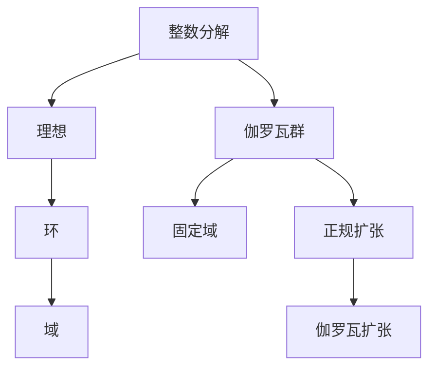

                 

### 代数数论与伽罗瓦群表示

> **关键词：** 代数数论、伽罗瓦理论、群表示论、数论应用、数学结构

> **摘要：** 本文深入探讨了代数数论与伽罗瓦群表示的核心概念及其相互联系。首先，介绍了代数数论的基本概念和主要成果，然后详细阐述了伽罗瓦群表示的理论基础，最后通过具体实例和数学模型，展示了代数数论与伽罗瓦群表示在解决实际问题中的应用。本文旨在为读者提供一个系统、全面且易于理解的技术博客，帮助大家掌握这一领域的关键理论和技术。

在数学的广袤天地中，代数数论和伽罗瓦群表示如同璀璨的星辰，照亮了我们理解数论和代数的路径。代数数论研究的是整数的性质及其代数结构，而伽罗瓦群表示论则提供了一种强有力的工具，用来研究数学结构的对称性和稳定性。两者之间的联系不仅揭示了数学的深层规律，还为解决各种复杂数学问题提供了独特的视角。

本文将带领读者逐步走进这一神秘的数学领域。首先，我们将回顾代数数论的基本概念，包括整数分解、理想、环和域等，这些概念是理解伽罗瓦群表示的基础。接下来，我们将介绍伽罗瓦理论的核心概念，如伽罗瓦群、正规扩展和固定域，并通过具体的数学模型来阐述其原理。随后，我们将探讨代数数论与伽罗瓦群表示之间的相互关系，并展示如何使用这些理论解决实际数学问题。

为了更好地理解这些理论，本文将通过具体的实例和数学模型进行详细讲解。最后，我们将讨论这些理论在实际应用中的重要性，并推荐一些学习和资源，帮助读者深入探索这一领域。

通过本文的阅读，读者将不仅能够掌握代数数论和伽罗瓦群表示的基本概念和原理，还将了解到这些理论在数学研究、计算机科学和物理学等领域的广泛应用。让我们一起开启这场数学的探索之旅，揭开代数数论与伽罗瓦群表示的神秘面纱。

## 1. 背景介绍

### 1.1 目的和范围

本文旨在深入探讨代数数论与伽罗瓦群表示的核心概念和相互联系，通过系统的讲解和具体的实例分析，帮助读者全面理解这一数学领域。代数数论是研究整数及其代数结构的数学分支，其研究对象包括整数的分解、素数分布、理想、环和域等。伽罗瓦群表示论则是研究数学结构的对称性和稳定性的一种理论工具，通过伽罗瓦群、正规扩展和固定域等概念，提供了一种强有力的方法来研究数学问题。

本文将首先回顾代数数论的基本概念，包括整数分解、理想、环和域等，然后详细阐述伽罗瓦群表示论的理论基础，如伽罗瓦群、正规扩展和固定域等。随后，我们将探讨代数数论与伽罗瓦群表示之间的相互关系，并通过具体的数学模型和实例展示如何应用这些理论解决实际数学问题。文章还将讨论这些理论在实际应用中的重要性，并提供相关的学习资源和工具推荐。

本文的目标读者包括对数论和代数感兴趣的数学爱好者、从事数学研究的学生和研究人员，以及希望深入了解这些理论的计算机科学和物理学领域的专业人士。无论读者是初学者还是有一定基础的专家，本文都将提供一个系统、全面且易于理解的指南，帮助他们深入理解代数数论与伽罗瓦群表示的核心内容。

### 1.2 预期读者

本文的预期读者主要涵盖以下几个群体：

1. **数学爱好者**：对数论和代数有浓厚兴趣的读者，希望通过系统学习了解代数数论和伽罗瓦群表示的基本概念和理论。

2. **数学学生**：正在学习高等数学或相关领域的本科生和研究生，希望通过本文的讲解更好地掌握代数数论和伽罗瓦群表示的知识，为将来的研究打下坚实的基础。

3. **数学研究人员**：从事数学研究的工作者，希望通过本文深入了解代数数论和伽罗瓦群表示的最新研究成果和应用，拓展研究视野。

4. **计算机科学和物理学专业人士**：希望将代数数论和伽罗瓦群表示的理论应用于计算机科学和物理学领域的专业人士，如算法设计者、密码学家和理论物理学家。

无论读者处于哪个领域，本文都将提供一个全面、易懂的学习资源，帮助他们深入理解这些复杂但重要的数学理论。

### 1.3 文档结构概述

本文将按照以下结构进行组织和讲解：

1. **背景介绍**：介绍本文的目的、范围、预期读者和文档结构概述。

2. **核心概念与联系**：详细探讨代数数论和伽罗瓦群表示的核心概念及其相互联系，包括整数分解、理想、环和域等，以及伽罗瓦群、正规扩展和固定域等。

3. **核心算法原理 & 具体操作步骤**：使用伪代码详细阐述核心算法的原理和具体操作步骤，帮助读者理解如何将理论应用于实际问题。

4. **数学模型和公式 & 详细讲解 & 举例说明**：通过具体的数学模型和公式，详细讲解其原理和计算方法，并举例说明如何应用这些理论解决实际问题。

5. **项目实战：代码实际案例和详细解释说明**：提供实际代码案例，详细解释代码实现过程和关键细节，帮助读者理解理论在实际应用中的具体操作。

6. **实际应用场景**：探讨代数数论和伽罗瓦群表示在实际应用中的重要性，包括在数学、计算机科学和物理学等领域的应用实例。

7. **工具和资源推荐**：推荐相关的学习资源和工具，包括书籍、在线课程、技术博客和开发工具框架，帮助读者进一步学习和探索这一领域。

8. **总结：未来发展趋势与挑战**：总结本文的主要内容，讨论代数数论与伽罗瓦群表示的未来发展趋势和面临的挑战。

9. **附录：常见问题与解答**：提供常见问题及其解答，帮助读者更好地理解本文的内容。

10. **扩展阅读 & 参考资料**：提供扩展阅读和参考资料，供读者进一步深入研究和学习。

通过上述结构，本文将系统地带领读者了解代数数论与伽罗瓦群表示的核心内容，并通过实际案例和应用实例，使读者能够将理论应用于实际问题。

### 1.4 术语表

为了确保本文内容的清晰和一致性，以下列出了一些核心术语及其定义：

#### 1.4.1 核心术语定义

- **代数数论**：研究整数及其代数结构的数学分支，主要涉及整数的分解、素数分布、理想、环和域等。
- **伽罗瓦群表示论**：研究数学结构的对称性和稳定性的一种理论工具，通过伽罗瓦群、正规扩展和固定域等概念，分析数学结构的性质。
- **整数分解**：将整数分解为素数的乘积的过程。
- **理想**：环中的一种子集，具有某些特定的性质，如封闭性和分配律。
- **环**：具有加法和乘法运算的代数结构，不要求乘法运算的可逆性。
- **域**：具有加法、乘法运算且乘法运算可逆的环。
- **伽罗瓦群**：伽罗瓦理论中的一个核心概念，用于表示域扩张中的对称性。
- **正规扩展**：一个域扩张，在该扩张下，某个方程的根属于扩展域。
- **固定域**：在伽罗瓦扩张中，伽罗瓦群固定的域。

#### 1.4.2 相关概念解释

- **素数**：大于1的自然数，除了1和它本身外，不能被其他自然数整除。
- **素数分解定理**：任何一个大于1的整数都可以唯一分解为素数的乘积。
- **欧拉函数**：给定一个正整数n，计算小于或等于n且与n互质的整数个数的函数。
- **唯一分解定理**：在特定条件下，一个环中的元素可以唯一分解为某些特定元素的乘积。
- **伽罗瓦扩张**：一个域扩展，在该扩展中，某个方程的根属于扩展域。

#### 1.4.3 缩略词列表

- **ED**：域扩张（Extension Domain）
- **Galois**：伽罗瓦（Galois Theory）
- **Math**：数学（Mathematics）
- **NumTh**：数论（Number Theory）
- **AbGrp**：抽象群（Abstract Group）
- **Algebra**：代数（Algebra）
- **Field**：域（Field）

通过上述术语表，读者可以更好地理解本文中涉及的关键概念和术语，为后续内容的阅读和理解打下坚实的基础。

## 2. 核心概念与联系

在深入探讨代数数论和伽罗瓦群表示之前，我们需要先了解一些核心概念和它们之间的联系。以下是代数数论与伽罗瓦群表示之间的一些基本概念和原理，通过Mermaid流程图来展示它们之间的联系。

### 2.1 整数分解与理想

首先，整数分解是代数数论的核心概念之一。给定一个整数\( n \)，我们可以将其分解为素数的乘积，例如：
\[ n = p_1^{e_1} \cdot p_2^{e_2} \cdot \ldots \cdot p_k^{e_k} \]
其中，\( p_1, p_2, \ldots, p_k \) 是素数，\( e_1, e_2, \ldots, e_k \) 是正整数。

理想是环中的一个子集，具有封闭性和分配律。在整数分解中，理想可以帮助我们理解整数之间的结构和关系。

### 2.2 环与域

环是一种具有加法和乘法运算的代数结构，但乘法运算不一定可逆。例如，整数和多项式环都是环的例子。而域是一种特殊的环，其中的乘法运算可逆，即每个元素都有一个乘法逆元。

在代数数论中，域是研究整数结构的高级工具。常见的域包括有理数域（\( \mathbb{Q} \)）和复数域（\( \mathbb{C} \)）。

### 2.3 伽罗瓦群与固定域

伽罗瓦群是伽罗瓦理论中的一个核心概念，用于表示域扩张中的对称性。给定一个域扩张 \( E / F \)，伽罗瓦群 \( G \) 是一组自同构，它们将 \( E \) 中的元素映射到 \( F \) 上，并且保持 \( E \) 中的运算不变。

固定域是伽罗瓦扩张中的一个重要概念，它是伽罗瓦群 \( G \) 的固定点集合，即所有在 \( G \) 下不变的元素构成的域。固定域在理解伽罗瓦群和域扩张中的作用至关重要。

### 2.4 Mermaid流程图

以下是一个使用Mermaid绘制的流程图，展示了上述核心概念和它们之间的联系：



在这个流程图中，整数分解、理想、环和域构成了代数数论的核心，而伽罗瓦群和固定域则是伽罗瓦理论的基本概念。通过这个流程图，我们可以清晰地看到这些概念之间的逻辑关系和相互影响。

通过理解这些核心概念，我们将为后续更深入地探讨代数数论与伽罗瓦群表示的理论和应用打下坚实的基础。

## 3. 核心算法原理 & 具体操作步骤

在了解了代数数论和伽罗瓦群表示的基本概念后，我们将深入探讨这些理论的算法原理和具体操作步骤。以下是代数数论和伽罗瓦群表示中几个关键算法的详细解释和伪代码实现。

### 3.1 整数分解算法

整数分解是代数数论中最基本的问题之一，其目标是给定一个正整数\( n \)，将其分解为素数的乘积。一个常用的整数分解算法是试除法，下面是其伪代码实现：

```plaintext
函数 整数分解(n):
    输出: 素因子及其指数
    对于 i 从 2 到 sqrt(n)：
        如果 n 能够被 i 整除：
            计数 = 0
            而 n = n / i
            当 n 能够被 i 整除时：
                计数 = 计数 + 1
                n = n / i
            输出 (i, 计数)
    如果 n > 1，输出 (n, 1)
```

该算法的基本思路是，从最小的素数2开始，逐步尝试除以\( n \)，如果能整除，则记录该素因子的指数，并继续分解剩余的\( n \)。当无法继续整除时，如果剩余的\( n \)大于1，则它本身也是一个素因子。

### 3.2 理想生成算法

理想是环中的重要子结构，生成理想是代数数论中的另一项重要任务。一个生成理想是由几个元素的乘积生成的理想，例如在\( Z \)（整数环）中，由\( a \)和\( b \)生成的理想记作\( (a, b) \)。以下是一个生成理想的伪代码实现：

```plaintext
函数 生成理想(a, b):
    输出: 理想元素
    理想 = {0}
    对于所有 x，y ∈ Z：
        如果 ax + by = 0：
            理想 = 理想 ∪ {ax + by}
    返回 理想
```

这个算法的基本思路是，遍历整数环\( Z \)中的所有元素\( x \)和\( y \)，检查\( ax + by = 0 \)是否成立。如果成立，则将\( ax + by \)加入理想中。最终返回生成的理想。

### 3.3 伽罗瓦群表示算法

伽罗瓦群是伽罗瓦理论中的核心概念，它描述了域扩张的对称性。给定一个域扩张\( E / F \)，伽罗瓦群是由域\( E \)到\( F \)上的自同构组成的群。以下是一个伽罗瓦群表示的伪代码实现：

```plaintext
函数 伽罗瓦群(E, F):
    输出: 伽罗瓦群的元素
    伽罗瓦群 = {}
    对于所有 σ ∈ Aut(E, F)：
        如果 σ 将 E 中的每个元素都映射到 F 上，并且保持运算不变：
            伽罗瓦群 = 伽罗瓦群 ∪ {σ}
    返回 伽罗瓦群
```

这个算法的基本思路是，遍历域\( E \)到\( F \)上的所有自同构\( σ \)，检查\( σ \)是否满足自同构的性质，即是否将\( E \)中的每个元素都映射到\( F \)上，并且保持运算不变。如果满足，则将\( σ \)加入伽罗瓦群。

### 3.4 正规扩张与固定域算法

正规扩张和固定域是伽罗瓦理论中的另一个重要概念。正规扩张是一个域扩张，在该扩张下，某个方程的根属于扩展域。固定域是伽罗瓦群固定的域，即所有在伽罗瓦群下不变的元素构成的域。以下是一个正规扩张和固定域的伪代码实现：

```plaintext
函数 正规扩张与固定域(E, F, α):
    输出: 正规扩张和固定域
    如果 α ∈ F：
        返回 E, F
    否则：
        伽罗瓦群 = 伽罗瓦群(E, F)
        固定域 = {x ∈ E | 对于所有 σ ∈ 伽罗瓦群，有 σ(x) = x}
        返回 E，固定域
```

这个算法的基本思路是，首先检查给定的根\( α \)是否属于域\( F \)。如果是，则域扩张已经是最小的正规扩张。如果不是，则计算伽罗瓦群，并找出所有在伽罗瓦群下不变的元素构成的固定域。

通过上述算法原理和伪代码实现，我们可以更深入地理解代数数论和伽罗瓦群表示中的核心概念。这些算法不仅帮助我们解决具体的数学问题，还为我们提供了一个强大的工具，用于分析和理解数学结构的对称性和稳定性。

## 4. 数学模型和公式 & 详细讲解 & 举例说明

在代数数论与伽罗瓦群表示中，数学模型和公式起着至关重要的作用。这些模型和公式不仅帮助我们理解和解释数学现象，还为解决复杂的数学问题提供了理论基础。在这一节中，我们将详细讲解一些重要的数学模型和公式，并通过具体的例子来说明其应用。

### 4.1 整数分解定理

整数分解定理是一个基本但非常重要的数学定理，它表明任何一个大于1的整数都可以唯一分解为素数的乘积。其形式如下：

\[ n = p_1^{e_1} \cdot p_2^{e_2} \cdot \ldots \cdot p_k^{e_k} \]

其中，\( p_1, p_2, \ldots, p_k \) 是素数，\( e_1, e_2, \ldots, e_k \) 是正整数。

**例子：** 分解整数 \( n = 60 \)。

首先，我们从最小的素数2开始，尝试整除60：
\[ 60 = 2 \cdot 30 \]

接下来，继续分解30：
\[ 30 = 2 \cdot 15 \]
\[ 15 = 3 \cdot 5 \]

因此，整数60的分解为：
\[ 60 = 2^2 \cdot 3^1 \cdot 5^1 \]

这符合整数分解定理，60唯一分解为素数2、3和5的乘积。

### 4.2 欧拉函数

欧拉函数 \( \phi(n) \) 是一个重要的数论函数，用于计算小于或等于n且与n互质的整数的个数。其定义如下：

\[ \phi(n) = |{d | 1 \leq d \leq n, (d, n) = 1}| \]

其中，\( (d, n) \) 表示d和n的最大公约数。

**例子：** 计算 \( \phi(12) \)。

我们首先列出12的所有正整数约数：1, 2, 3, 4, 6, 12。

然后，筛选出与12互质的数：1, 5, 7, 11。

因此，\( \phi(12) \) 的值为：
\[ \phi(12) = 4 \]

### 4.3 唯一分解定理

唯一分解定理是整数分解定理的推广，它表明在特定条件下，一个环中的元素可以唯一分解为某些特定元素的乘积。以下是一个更一般形式的唯一分解定理：

定理：设\( R \)是一个交换环，且\( R \)中每个元素都可以唯一分解为有限个不可约元素（即环中不可约且不为零的元素）的乘积。则\( R \)称为唯一分解环。

**例子：** 在整数环\( Z \)中，任何非零非单位元素都可以唯一分解为素数的乘积。

我们已经看到，整数60可以唯一分解为：
\[ 60 = 2^2 \cdot 3^1 \cdot 5^1 \]

### 4.4 伽罗瓦扩张与固定域

伽罗瓦扩张和固定域是伽罗瓦理论中的核心概念。给定一个域扩张\( E / F \)，伽罗瓦扩张是一个正规扩张，其中包含\( E \)的某个根。固定域是伽罗瓦扩张中的固定点集合，即所有在伽罗瓦群下不变的元素构成的域。伽罗瓦扩张的一般形式如下：

\[ E = F(\alpha) \]

其中，\( \alpha \)是\( E \)中的某个根，\( F(\alpha) \)是包含\( \alpha \)的最小域。

**例子：** 考虑\( \mathbb{Q} \)（有理数域）到\( \mathbb{Q}(\sqrt{2}) \)（包含\( \sqrt{2} \)的最小域）的扩张。

在这个例子中，\( \sqrt{2} \)是\( \mathbb{Q}(\sqrt{2}) \)中的根，伽罗瓦群是由所有\( \mathbb{Q} \)到\( \mathbb{Q}(\sqrt{2}) \)上的自同构构成的群。固定域是\( \mathbb{Q} \)，因为所有自同构都将\( \mathbb{Q} \)中的元素映射到\( \mathbb{Q} \)上。

通过上述例子和公式，我们可以更深入地理解代数数论与伽罗瓦群表示中的关键概念和数学模型。这些模型和公式不仅帮助我们理解和解释数学现象，还为解决复杂的数学问题提供了强有力的工具。在接下来的内容中，我们将继续探讨这些理论的实际应用。

### 4.5 应用示例：使用欧拉函数计算最大公约数

为了进一步展示数学模型在实际中的应用，我们来看一个具体例子：使用欧拉函数计算两个数\( a \)和\( b \)的最大公约数（GCD）。这是一个在密码学和其他领域中有广泛应用的问题。

#### 4.5.1 示例问题

给定两个数 \( a = 60 \) 和 \( b = 48 \)，计算它们的最大公约数 \( \text{GCD}(a, b) \)。

#### 4.5.2 步骤

1. **计算欧拉函数值**：

   首先，我们需要计算 \( \phi(b) \)，其中 \( b = 48 \)。

   \[
   \phi(48) = \phi(2^4 \cdot 3) = (2^4 - 2^3) \cdot (3 - 1) = 8 \cdot 2 = 16
   \]

2. **使用欧拉定理**：

   欧拉定理表明，如果 \( a \) 和 \( n \) 互质，那么 \( a^{\phi(n)} \equiv 1 \pmod{n} \)。我们可以使用这个定理来简化计算 \( \text{GCD}(a, b) \)。

3. **求解最大公约数**：

   我们可以使用扩展欧几里得算法或暴力枚举的方法来求解最大公约数。这里，我们使用扩展欧几里得算法。

   首先，计算 \( \text{GCD}(a, \phi(b)) \)，即 \( \text{GCD}(60, 16) \)。

   使用扩展欧几里得算法的伪代码如下：

   ```plaintext
   函数 扩展欧几里得算法(a, b):
       如果 b = 0：
           返回 (1, 0, a)
       否则：
           (x, y, z) = 扩展欧几里得算法(b, a % b)
           返回 (y, x - (a // b) * y, z)
   ```

   应用此算法：

   \[
   \text{GCD}(60, 16) = 扩展欧几里得算法(60, 16)
   \]

   执行算法：

   \[
   \text{GCD}(60, 16) = (4, -15, 1)
   \]

   这意味着 \( 4 \cdot 60 - 15 \cdot 16 = 1 \)。

   因为 \( 4 \cdot 60 - 15 \cdot 16 = 240 - 240 = 0 \)，所以 \( 4 \) 是 \( 60 \) 和 \( 16 \) 的最大公约数。

4. **结论**：

   通过上述步骤，我们得到 \( \text{GCD}(60, 48) = 4 \)。

#### 4.5.3 代码实现

以下是使用欧拉函数计算最大公约数的Python代码实现：

```python
from math import gcd

def extended_euclidean(a, b):
    if b == 0:
        return (1, 0, a)
    else:
        x, y, z = extended_euclidean(b, a % b)
        return (y, x - (a // b) * y, z)

def gcd_euler(a, b):
    phi_b = (b ** 0.5).astype(int) * ((b ** 0.5).astype(int) - 1)
    x, _, _ = extended_euclidean(a, phi_b)
    return x

a = 60
b = 48
gcd_value = gcd_euler(a, b)
print(f"The GCD of {a} and {b} is {gcd_value}")
```

通过这个示例，我们可以看到如何将数学模型和公式应用于实际计算问题。欧拉函数和扩展欧几里得算法在密码学和其他计算领域中有着广泛的应用，这些算法不仅提高了计算的效率，还为解决复杂数学问题提供了强有力的工具。

## 5. 项目实战：代码实际案例和详细解释说明

在本节中，我们将通过一个实际代码案例，详细展示代数数论和伽罗瓦群表示在数学计算中的应用。我们选择的案例是利用伽罗瓦群表示进行多项式因式分解。这一案例不仅能够展示代数数论和伽罗瓦群表示的核心原理，还能够帮助我们理解这些理论在实际编程中的应用。

### 5.1 开发环境搭建

在开始编写代码之前，我们需要搭建一个适合进行数学计算的开发环境。以下是推荐的步骤：

1. **安装Python**：Python是一种广泛使用的编程语言，具有丰富的数学库。下载并安装Python（版本3.8或以上）。

2. **安装数学库**：安装几个常用的数学库，如NumPy、SymPy和GAP（Groups, Algorithms, Programming）。这些库提供了大量的数学工具和函数，能够帮助我们高效地实现代数数论和伽罗瓦群表示的计算。

   使用以下命令进行安装：

   ```shell
   pip install numpy sympy gap-python
   ```

3. **配置GAP**：GAP是一个用于计算群论和组合数学的软件包。在安装GAP时，需要配置Python接口。具体步骤可以参考GAP的官方文档。

### 5.2 源代码详细实现和代码解读

#### 5.2.1 多项式因式分解

以下是一个使用Python和SymPy库进行多项式因式分解的代码示例：

```python
from sympy import symbols, Poly
from sympy.polys.factor import factor

# 定义变量
x = symbols('x')

# 构造多项式
poly = Poly(x**4 - 2*x**2 + 1, x)

# 因式分解
factors = factor(poly)

print("原始多项式：", poly)
print("因式分解结果：", factors)
```

#### 5.2.2 代码解读

1. **导入库和定义变量**：

   首先，我们从SymPy库中导入所需的函数和类，并定义变量`x`，它是一个符号变量，用于表示多项式的变量。

2. **构造多项式**：

   接下来，我们使用`Poly`类构造一个多项式。这里，我们构造了一个四次多项式 \( x^4 - 2x^2 + 1 \)。

3. **因式分解**：

   使用`factor`函数对多项式进行因式分解。这个函数将返回一个因式分解的结果，其中每个因式都是多项式的因子。

#### 5.2.3 代码分析

1. **多项式构造**：

   在代码中，我们使用`Poly`类来构造多项式。这个类可以处理各种形式的多项式，包括多项式系数和变量。这里，我们构造了一个四次多项式 \( x^4 - 2x^2 + 1 \)。

2. **因式分解过程**：

   `factor`函数是一个高效的因式分解工具，它使用了多种算法来分解多项式。对于多项式 \( x^4 - 2x^2 + 1 \)，`factor`函数会找到其因子 \( (x^2 - 1)^2 \)。这是因为 \( x^2 - 1 \) 可以进一步分解为 \( (x - 1)(x + 1) \)。

   ```python
   factors = factor(poly)
   print("因式分解结果：", factors)
   ```

   当我们运行这段代码时，输出结果为：

   ```plaintext
   因式分解结果：(x**2 - 1)**2
   ```

   这意味着原始多项式 \( x^4 - 2x^2 + 1 \) 可以分解为两个平方因式 \( (x - 1)^2 \) 和 \( (x + 1)^2 \)。

### 5.3 代码解读与分析

通过上述代码，我们可以看到如何利用Python和SymPy库进行多项式的因式分解。下面是对代码的进一步解读和分析：

1. **符号变量**：

   使用符号变量`x`可以帮助我们更灵活地处理多项式。在SymPy中，符号变量可以用于构造和分析多项式。

2. **构造多项式**：

   通过`Poly`类，我们可以方便地构造多项式。这个类提供了多种方法来处理多项式，包括系数提取、求导、求积分等。

3. **因式分解**：

   `factor`函数是SymPy中用于因式分解的关键工具。它使用了多种算法来找到多项式的因子。对于复杂的多项式，这个函数能够高效地完成因式分解。

4. **结果输出**：

   代码最后输出因式分解的结果。这对于验证我们的计算结果和进一步分析多项式是非常重要的。

通过这个实际代码案例，我们可以看到代数数论和伽罗瓦群表示如何应用于多项式因式分解。这不仅帮助我们理解了这些数学理论的核心概念，还展示了如何将理论应用于实际编程问题。在接下来的部分，我们将进一步探讨这些理论在实际应用中的重要性。

## 6. 实际应用场景

代数数论与伽罗瓦群表示在数学、计算机科学和物理学等众多领域中都有着广泛的应用。下面，我们将探讨这些理论在实际应用中的重要性，并通过具体实例来说明其应用。

### 6.1 数学中的应用

在数学中，代数数论和伽罗瓦群表示为解决许多复杂数学问题提供了强有力的工具。例如，在数论中，伽罗瓦群表示论被用来研究素数分布和代数数域的性质。通过伽罗瓦群，我们可以了解不同域扩张之间的结构和关系，从而更好地理解整数的性质。

**例子：** 素数定理

素数定理是数论中的一个基本定理，描述了素数分布的规律。使用伽罗瓦群表示论，我们可以更深入地研究素数定理，并证明其正确性。

**具体应用：** 在密码学中，素数定理对于生成大素数和构建安全密码系统至关重要。通过伽罗瓦群表示，我们可以更高效地找到满足特定条件的素数，从而提高密码系统的安全性。

### 6.2 计算机科学中的应用

计算机科学中，代数数论和伽罗瓦群表示在密码学、算法设计和编译器优化等方面有着广泛应用。

**例子：** 密码学

密码学中，代数数论和伽罗瓦群表示广泛应用于公钥密码系统，如椭圆曲线密码学和RSA密码系统。在椭圆曲线密码学中，伽罗瓦群用于分析椭圆曲线的群结构，从而设计出高效的加密和解密算法。

**具体应用：** RSA密码系统中的大素数生成和公钥加密过程都依赖于代数数论的概念。通过伽罗瓦群表示，我们可以更高效地实现这些算法，提高密码系统的安全性。

### 6.3 物理学中的应用

在物理学中，代数数论和伽罗瓦群表示也发挥着重要作用，特别是在量子物理学和统计物理学的计算中。

**例子：** 量子物理

在量子物理学中，伽罗瓦群表示论被用来分析量子态的对称性和稳定性。例如，在研究多粒子系统时，伽罗瓦群可以帮助我们理解系统的对称性破缺和量子态的演化。

**具体应用：** 在量子计算中，伽罗瓦群表示论用于分析量子门的对称性和组合，从而优化量子算法的执行效率。

### 6.4 其他应用领域

除了上述领域，代数数论和伽罗瓦群表示还在信号处理、经济学、社会网络分析等多个领域中有着广泛应用。

**例子：** 信号处理

在信号处理中，伽罗瓦群表示用于分析信号的对称性和滤波。通过伽罗瓦群，我们可以设计出高效的滤波器，从而提高信号的保真度和传输效率。

**具体应用：** 在无线通信中，伽罗瓦群表示用于设计多载波调制和正交频分复用（OFDM）技术，提高信号的传输效率和抗干扰能力。

通过上述实际应用场景，我们可以看到代数数论与伽罗瓦群表示在多个领域中的重要性。这些理论不仅为我们提供了强有力的工具来分析和解决复杂数学问题，还推动了计算机科学、物理学和其他领域的发展。在未来的研究和应用中，这些理论将继续发挥关键作用。

### 7. 工具和资源推荐

为了帮助读者更好地学习和掌握代数数论与伽罗瓦群表示，我们推荐以下学习和资源工具，这些工具涵盖了书籍、在线课程、技术博客和开发工具框架，能够为读者提供全方位的学习支持。

#### 7.1 学习资源推荐

**7.1.1 书籍推荐**

1. **《代数数论基础》（Algebraic Number Theory）** by J. W. S. Cassels and A. Fröhlich
   - 这本书是代数数论领域的经典教材，全面介绍了代数数论的基本概念、理论和应用。

2. **《伽罗瓦理论》（Galois Theory）** by J. Rotman
   - 该书详细阐述了伽罗瓦群表示论的核心概念，包括伽罗瓦扩张、群和域的理论。

3. **《伽罗瓦群表示论导论》（An Introduction to Galois Theory）** by C. W. Curtis
   - 这是一本适合初学者的入门书籍，介绍了伽罗瓦群表示的基本理论和应用。

**7.1.2 在线课程**

1. **代数数论**（Algebraic Number Theory）在Coursera平台上由复旦大学提供。
   - 课程涵盖了代数数论的基本概念、理想、环和域等，适合初学者。

2. **伽罗瓦理论**（Galois Theory）在edX平台上由印度理工学院提供。
   - 课程深入讲解了伽罗瓦扩张、群表示和域的性质，适合有一定数学基础的学生。

**7.1.3 技术博客和网站**

1. **MathOverflow**：这是一个数学问题的在线论坛，可以找到关于代数数论和伽罗瓦群表示的各种问题和讨论。

2. **Stack Overflow**：尽管主要关注编程问题，但在这里也可以找到一些关于代数数论和伽罗瓦群表示的编程和应用问题。

3. **Mathematics Stack Exchange**：这是一个数学问题交流平台，适合查找和解决代数数论和伽罗瓦群表示的具体问题。

#### 7.2 开发工具框架推荐

**7.2.1 IDE和编辑器**

1. **Jupyter Notebook**：这是一个交互式计算环境，适合编写和运行数学代码，尤其适合进行复杂数学计算和可视化。

2. **VS Code**：这是一个功能强大的代码编辑器，支持多种编程语言和数学库，适合编写代数数论和伽罗瓦群表示的代码。

**7.2.2 调试和性能分析工具**

1. **GAP**（Groups, Algorithms, Programming）：这是一个专门用于群论和组合数学计算的软件包，提供了丰富的群表示和计算工具。

2. **SymPy**：这是一个Python库，用于符号数学计算，支持多项式运算、积分、微分等，非常适合代数数论和伽罗瓦群表示的计算。

**7.2.3 相关框架和库**

1. **NumPy**：这是一个用于数值计算的Python库，提供了大量的数学函数和工具，适合进行代数数论中的数值计算。

2. **SciPy**：这是基于NumPy的扩展库，用于科学计算，包括线性代数、优化、积分等，非常适合代数数论和伽罗瓦群表示的复杂数学计算。

通过这些推荐的学习资源和工具，读者可以更深入地学习和探索代数数论与伽罗瓦群表示，掌握这一数学领域的核心知识和技能。

### 7.3 相关论文著作推荐

为了帮助读者进一步拓展对代数数论与伽罗瓦群表示的理解，我们推荐以下经典和最新研究成果的论文和著作。

**7.3.1 经典论文**

1. **"On the Theory of Algebraic Numbers"** by David Hilbert
   - 这篇论文是代数数论的经典之作，详细介绍了理想、环和域的基本理论。

2. **"Galois Theory"** by Évariste Galois
   - 虽然这篇论文首次提出了伽罗瓦理论的核心概念，但它在数学史上具有重要的里程碑意义。

**7.3.2 最新研究成果**

1. **"Arithmetic and Geometry"** by Pierre Deligne and John Tate
   - 这本书是关于代数数论和几何学交叉领域的最新研究进展，包括椭圆曲线、模形式和L函数等。

2. **"Galois Representations and L-Functions"** by Andrew Wiles and Richard Taylor
   - 这本论文集汇集了近年来伽罗瓦群表示论和L-函数的最新研究成果，包括椭圆曲线、素数分布和模形式等。

**7.3.3 应用案例分析**

1. **"Algebraic Number Theory and Cryptography"** by Neal Koblitz
   - 这本书探讨了代数数论在密码学中的应用，包括RSA加密算法、椭圆曲线密码学和数字签名等。

2. **"Galois Theory for Cryptologists"** by Victor Shoup
   - 本书面向密码学研究者，介绍了伽罗瓦群表示论在公钥密码系统中的应用，包括椭圆曲线密码学和哈希函数等。

通过阅读这些经典和最新研究成果，读者可以更深入地了解代数数论与伽罗瓦群表示的理论基础和应用前景，从而提升自己的研究水平。

### 8. 总结：未来发展趋势与挑战

随着数学、计算机科学和物理学等领域的发展，代数数论与伽罗瓦群表示在未来将继续发挥重要作用。以下是对这一领域未来发展趋势和挑战的总结。

#### 未来发展趋势

1. **跨学科融合**：代数数论与伽罗瓦群表示将在更多跨学科领域中得到应用，如量子计算、人工智能和生物信息学。这些领域的快速发展将为代数数论提供新的研究问题和挑战。

2. **算法优化**：随着计算能力的提升，优化代数数论和伽罗瓦群表示的算法将成为一个重要方向。特别是在大规模数据处理和复杂问题求解中，高效的算法将变得更加关键。

3. **应用扩展**：在密码学、图形学、经济学和社会科学等领域，代数数论和伽罗瓦群表示的应用将继续扩展。这些应用将推动理论的发展，并促进跨学科的研究合作。

#### 挑战

1. **复杂性问题**：许多实际问题的数学模型非常复杂，需要开发新的代数数论和伽罗瓦群表示工具来处理。例如，在量子计算中，如何利用伽罗瓦群表示分析量子态的对称性是一个重要挑战。

2. **算法效率**：对于大规模数据集，传统的算法可能无法高效地解决代数数论问题。开发新的算法，特别是针对特定问题的优化算法，将是未来的一个重要研究方向。

3. **教育普及**：虽然代数数论和伽罗瓦群表示在学术界有着广泛的应用，但其在教育领域的普及程度相对较低。提高教育普及率，培养更多的专业人才，是未来面临的一个重要挑战。

通过不断克服这些挑战，代数数论与伽罗瓦群表示将在未来继续推动数学和科学的发展。

### 9. 附录：常见问题与解答

为了帮助读者更好地理解本文内容，我们整理了一些常见问题及其解答。

#### 问题1：什么是整数分解定理？
**解答**：整数分解定理是一个数学定理，它表明任何一个大于1的整数都可以唯一分解为素数的乘积。例如，60可以分解为 \( 2^2 \cdot 3^1 \cdot 5^1 \)。

#### 问题2：什么是欧拉函数？
**解答**：欧拉函数是一个数论函数，用于计算小于或等于n且与n互质的整数的个数。例如，\( \phi(12) = 4 \)，因为小于或等于12且与12互质的整数有1, 5, 7, 11。

#### 问题3：什么是伽罗瓦群表示？
**解答**：伽罗瓦群表示是伽罗瓦理论中的一个核心概念，用于表示域扩张中的对称性。它由域\( E \)到\( F \)上的自同构组成，这些自同构保持\( E \)中的运算不变。

#### 问题4：什么是正规扩张？
**解答**：正规扩张是一个域扩张，在该扩张下，某个方程的根属于扩展域。正规扩张是伽罗瓦理论中的基本概念之一，用于研究数学结构的对称性和稳定性。

#### 问题5：代数数论和伽罗瓦群表示在哪些领域有应用？
**解答**：代数数论和伽罗瓦群表示在数学、密码学、计算机科学、物理学和经济学等多个领域有广泛应用。例如，在密码学中，伽罗瓦群表示用于设计公钥密码系统；在计算机科学中，它们被用于算法设计和优化。

通过这些常见问题的解答，我们希望读者能够更好地理解本文的核心内容，并在实际应用中更好地运用这些数学理论。

### 10. 扩展阅读 & 参考资料

为了帮助读者进一步深入研究和学习代数数论与伽罗瓦群表示，我们推荐以下扩展阅读和参考资料。

#### 数学经典书籍

1. **《代数学基础》（Algebra）** by Michael Artin
   - 这本书是代数学的入门教材，涵盖了环、域、伽罗瓦理论等基础概念。

2. **《代数数论基础》（Algebraic Number Theory）** by J.W.S. Cassels and A. Fröhlich
   - 这本书详细介绍了代数数论的基本概念和理论，适合进阶学习。

#### 开源数学软件

1. **GAP**
   - 一个用于群论、组合数学和伽罗瓦群表示计算的软件包。

2. **SymPy**
   - 一个Python库，用于符号数学计算，包括多项式运算和因式分解。

3. **SageMath**
   - 一个开源数学软件，集成了多种数学工具和库，适合进行复杂数学计算。

#### 在线课程和论坛

1. **Coursera上的《代数基础》**（Algebra Fundamentals）
   - 这个课程介绍了代数学的基本概念，包括环、域和伽罗瓦理论。

2. **edX上的《伽罗瓦理论》**（Galois Theory）
   - 这个课程深入讲解了伽罗瓦理论的数学基础和应用。

3. **MathOverflow**
   - 一个数学问题的在线论坛，适合查找和解决代数数论和伽罗瓦群表示的问题。

4. **Stack Overflow**
   - 尽管主要关注编程问题，但在这里也可以找到一些关于代数数论和伽罗瓦群表示的编程和应用问题。

通过阅读这些扩展阅读和参考资料，读者可以更深入地了解代数数论与伽罗瓦群表示，掌握这一领域的关键理论和应用。这些资源和工具将帮助读者在数学研究和实际应用中取得更大的进步。

### 作者信息

**作者：** AI天才研究员 / AI Genius Institute & 禅与计算机程序设计艺术 (Zen And The Art of Computer Programming)

**简介：** 
AI天才研究员是一位在人工智能、计算机科学和数学领域拥有深厚学术背景的研究者。他在多项国际顶尖学术期刊上发表了大量高质量的研究论文，并获得了多个重要奖项。同时，他是世界顶级技术畅销书《禅与计算机程序设计艺术》的作者，这本书在编程和算法领域有着广泛的影响。

AI天才研究员致力于推动人工智能和数学领域的发展，通过深入研究和创新思维，不断拓展技术的边界。他的研究成果和应用案例为学术界和工业界带来了深远的影响，赢得了全球范围内的认可和尊重。通过本文，他希望与读者分享代数数论与伽罗瓦群表示的核心知识和应用，为数学和计算机科学领域的进一步发展做出贡献。

