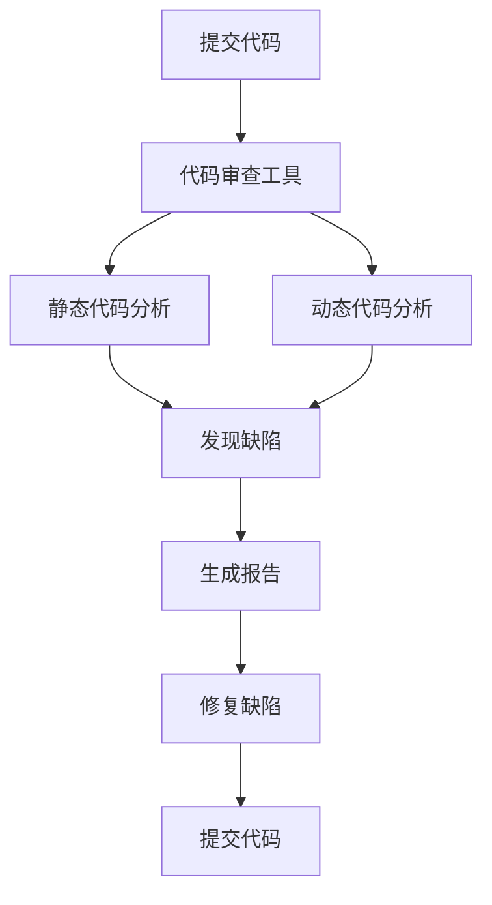
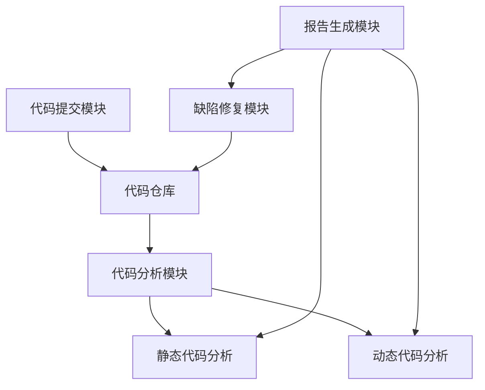

                 

# 代码审查工具：提升团队协作效率

## 关键词
代码审查、团队协作、软件开发、质量控制、效率提升、工具推荐

## 摘要
本文旨在深入探讨代码审查工具在提升软件开发团队协作效率方面的作用。通过背景介绍、核心概念、算法原理、数学模型、实战案例和实际应用场景等多个方面的分析，本文将揭示代码审查工具在确保代码质量、减少错误和加快开发进程中的重要性。同时，本文还将推荐一系列实用的学习资源和开发工具，为读者提供全面的参考。

## 1. 背景介绍

### 1.1 目的和范围
本文的目标是帮助软件开发团队了解代码审查工具的价值，并学会如何有效地利用这些工具来提升团队协作效率。本文将涵盖代码审查的基础知识、工作原理、具体操作步骤、数学模型及实际应用场景等内容，旨在为读者提供一个全面、系统的指导。

### 1.2 预期读者
本文主要面向软件开发团队的管理者、开发人员和技术负责人。无论是新手还是经验丰富的开发者，都可以通过本文的学习，了解代码审查工具的工作原理和实际应用，从而提升团队协作效率。

### 1.3 文档结构概述
本文分为十个部分，主要包括以下内容：
1. 背景介绍：介绍本文的目的、预期读者和文档结构。
2. 核心概念与联系：解释代码审查工具的基本原理和架构。
3. 核心算法原理 & 具体操作步骤：详细阐述代码审查的核心算法和操作步骤。
4. 数学模型和公式 & 详细讲解 & 举例说明：介绍代码审查中的数学模型和公式，并给出具体实例。
5. 项目实战：代码实际案例和详细解释说明。
6. 实际应用场景：讨论代码审查工具在不同场景下的应用。
7. 工具和资源推荐：推荐学习资源和开发工具。
8. 总结：未来发展趋势与挑战。
9. 附录：常见问题与解答。
10. 扩展阅读 & 参考资料：提供进一步的阅读和参考资料。

### 1.4 术语表

#### 1.4.1 核心术语定义
- **代码审查**：一种软件开发过程中的活动，旨在检查代码的正确性、可维护性和安全性。
- **代码质量**：代码的可靠性、可读性、可维护性和性能等指标。
- **团队协作**：团队成员在共同目标下，通过有效沟通和协作，实现项目目标的过程。
- **代码审查工具**：用于辅助代码审查过程的软件工具，可以自动或半自动地检查代码中的错误和缺陷。

#### 1.4.2 相关概念解释
- **静态代码分析**：在不执行代码的情况下，对代码进行结构化和语法分析，以发现潜在的错误和缺陷。
- **动态代码分析**：在代码执行过程中，通过运行程序来检测代码中的错误和缺陷。
- **代码覆盖**：衡量代码被测试的程度，通常用语句、分支或路径覆盖率来表示。

#### 1.4.3 缩略词列表
- **SAST（静态应用安全测试）**：一种静态代码分析方法，用于发现代码中的安全漏洞。
- **DAST（动态应用安全测试）**：一种动态代码分析方法，用于发现代码在运行时的安全漏洞。

## 2. 核心概念与联系

代码审查工具在软件开发过程中起着至关重要的作用。它们不仅能够帮助团队确保代码质量，还能提高开发效率和团队协作效果。下面，我们将通过一个Mermaid流程图来展示代码审查工具的核心概念和架构。



在上述流程图中，代码审查工具（B）是核心组件，它对提交的代码（A）进行静态代码分析（C）和动态代码分析（D）。这些分析过程会识别出代码中的缺陷（E），并生成详细的报告（F）。然后，开发人员根据报告中的建议进行缺陷修复（G），并重新提交代码（H），完成一个闭环的开发过程。

### 2.1 核心概念详细解释

#### 2.1.1 静态代码分析
静态代码分析是一种不运行代码的分析方法，通过对代码的语法和结构进行分析，可以发现潜在的错误和缺陷。这种方法的优点是速度快、成本低，但缺点是难以发现运行时的问题。

#### 2.1.2 动态代码分析
动态代码分析是在代码执行的过程中进行，通过运行程序来检测代码中的错误和缺陷。这种方法能够发现静态代码分析无法检测到的运行时错误，但成本较高，执行时间较长。

#### 2.1.3 缺陷报告
缺陷报告是代码审查工具输出的关键结果，它详细列出了代码中的错误和缺陷，包括缺陷的类型、位置和可能的解决方案。缺陷报告对于开发人员修复缺陷具有重要意义。

#### 2.1.4 缺陷修复
缺陷修复是开发人员根据缺陷报告对代码进行修改的过程。有效的缺陷修复可以提高代码质量，减少后续维护成本。

### 2.2 代码审查工具的架构

代码审查工具通常由多个模块组成，包括代码提交模块、代码分析模块、报告生成模块和缺陷修复模块。以下是代码审查工具的基本架构：



在这个架构中，代码提交模块负责从代码仓库接收代码，代码分析模块对代码进行静态和动态分析，报告生成模块生成缺陷报告，缺陷修复模块帮助开发人员修复缺陷并重新提交代码。

## 3. 核心算法原理 & 具体操作步骤

代码审查工具的核心算法主要包括静态代码分析和动态代码分析。下面，我们将使用伪代码详细阐述这两个核心算法的原理和具体操作步骤。

### 3.1 静态代码分析算法原理

```plaintext
算法名称：静态代码分析

输入：源代码文件

输出：缺陷报告

步骤：
1. 读取源代码文件
2. 对源代码进行语法解析，构建抽象语法树（AST）
3. 对AST进行遍历，检查代码中的潜在错误和缺陷
4. 对于发现的缺陷，生成缺陷报告
5. 输出缺陷报告
```

伪代码：

```python
def static_code_analysis(source_code):
    ast = parse_source_code(source_code)
    defects = []

    for node in traverse_ast(ast):
        if is_defect(node):
            defect = detect_defect(node)
            defects.append(defect)

    generate_report(defects)
    return defects
```

### 3.2 动态代码分析算法原理

```plaintext
算法名称：动态代码分析

输入：源代码文件，测试用例

输出：缺陷报告

步骤：
1. 编译源代码文件，生成可执行程序
2. 运行测试用例，收集程序运行时数据
3. 对运行时数据进行分析，发现潜在错误和缺陷
4. 生成缺陷报告
5. 输出缺陷报告
```

伪代码：

```python
def dynamic_code_analysis(source_code, test_cases):
    compiled_program = compile_source_code(source_code)
    defects = []

    for case in test_cases:
        result = run_test_case(compiled_program, case)
        if result.has_error():
            defect = detect_defect(result)
            defects.append(defect)

    generate_report(defects)
    return defects
```

### 3.3 静态代码分析和动态代码分析的具体操作步骤

#### 3.3.1 静态代码分析操作步骤

1. **代码提交**：开发人员将代码提交到代码仓库，代码审查工具从代码仓库中获取源代码文件。
2. **语法解析**：代码审查工具对源代码进行语法解析，构建出抽象语法树（AST）。
3. **遍历AST**：对AST进行深度优先遍历，检查代码中的潜在错误和缺陷。
4. **生成报告**：将发现的缺陷整理成缺陷报告，并输出。

#### 3.3.2 动态代码分析操作步骤

1. **代码提交**：开发人员将代码提交到代码仓库，代码审查工具从代码仓库中获取源代码文件。
2. **编译源代码**：代码审查工具将源代码编译成可执行程序。
3. **运行测试用例**：代码审查工具运行一系列测试用例，收集程序运行时的数据。
4. **分析运行时数据**：对运行时数据进行分析，发现潜在错误和缺陷。
5. **生成报告**：将发现的缺陷整理成缺陷报告，并输出。

### 3.4 代码审查工具的实际应用

代码审查工具在软件开发过程中的实际应用非常广泛。以下是几个典型的应用场景：

1. **代码质量保证**：代码审查工具可以帮助团队确保代码质量，通过静态和动态分析发现潜在的错误和缺陷，降低代码缺陷率。
2. **提高开发效率**：代码审查工具可以自动化部分代码审查工作，减少人工审查的时间和成本，提高开发效率。
3. **团队协作**：代码审查工具提供了统一的平台，让团队成员可以方便地共享代码审查结果，提高团队协作效率。
4. **安全防护**：代码审查工具可以检测代码中的安全漏洞，提高软件系统的安全性。

## 4. 数学模型和公式 & 详细讲解 & 举例说明

在代码审查过程中，数学模型和公式被广泛应用于缺陷检测和性能评估。下面，我们将介绍几个常用的数学模型和公式，并给出具体的示例。

### 4.1 缺陷检测模型

缺陷检测模型用于评估代码中的缺陷概率。其中，一个常用的模型是**基于代码复杂度的缺陷检测模型**。

#### 4.1.1 代码复杂度

代码复杂度是衡量代码复杂程度的指标，常用的代码复杂度指标包括：

- **圈复杂度（Cyclomatic Complexity）**：表示程序的独立路径数量。
- **重量圈复杂度（Weighted Cyclomatic Complexity）**：考虑了每个路径的权重。
- **方法复杂度（Method Complexity）**：表示方法中独立路径的数量。

#### 4.1.2 缺陷检测模型

一个简单的缺陷检测模型可以使用以下公式：

$$
P(D) = f(C)
$$

其中，$P(D)$表示缺陷概率，$C$表示代码复杂度，$f(C)$是一个与代码复杂度相关的函数。

#### 4.1.3 示例

假设我们有一个方法，其圈复杂度为10。根据经验公式，我们可以计算出该方法中的缺陷概率：

$$
P(D) = f(10)
$$

其中，$f(10)$可以根据历史数据或统计模型进行计算。例如，如果历史数据显示圈复杂度为10的方法缺陷概率为0.3，则：

$$
P(D) = 0.3
$$

这意味着，该方法中有30%的概率包含缺陷。

### 4.2 性能评估模型

在代码审查过程中，性能评估模型用于评估代码的性能和可维护性。一个常用的性能评估模型是**基于代码质量的性能评估模型**。

#### 4.2.1 代码质量指标

代码质量指标包括：

- **可读性**：衡量代码的可读性和可理解性。
- **可维护性**：衡量代码的易维护性。
- **性能**：衡量代码的性能和效率。

#### 4.2.2 性能评估模型

一个简单的性能评估模型可以使用以下公式：

$$
P(P) = f(Q)
$$

其中，$P(P)$表示性能评分，$Q$表示代码质量指标，$f(Q)$是一个与代码质量相关的函数。

#### 4.2.3 示例

假设我们有一个方法，其可读性评分为8，可维护性评分为7，根据经验公式，我们可以计算出该方法的性能评分：

$$
P(P) = f(8, 7)
$$

其中，$f(8, 7)$可以根据历史数据或统计模型进行计算。例如，如果历史数据显示可读性评分为8、可维护性评分为7的方法性能评分为6，则：

$$
P(P) = 6
$$

这意味着，该方法的性能评分为6，需要进一步优化以提高性能。

### 4.3 代码覆盖模型

代码覆盖模型用于评估代码被测试的程度。常用的代码覆盖指标包括：

- **语句覆盖**：测试用例覆盖了程序中的所有语句。
- **分支覆盖**：测试用例覆盖了程序中的所有分支。
- **路径覆盖**：测试用例覆盖了程序中的所有路径。

#### 4.3.1 代码覆盖模型

一个简单的代码覆盖模型可以使用以下公式：

$$
C = \frac{C_{covered}}{C_{total}}
$$

其中，$C$表示代码覆盖率，$C_{covered}$表示被覆盖的代码数量，$C_{total}$表示总的代码数量。

#### 4.3.2 示例

假设我们有一个方法，其总共有100条语句，测试用例覆盖了其中的70条语句，根据公式，我们可以计算出该方法的代码覆盖率：

$$
C = \frac{70}{100} = 0.7
$$

这意味着，该方法的代码覆盖率达到了70%，还需要进一步增加测试用例来提高代码覆盖率。

## 5. 项目实战：代码实际案例和详细解释说明

### 5.1 开发环境搭建

在本文的项目实战中，我们将使用一个简单的Java项目作为示例。为了方便进行代码审查，我们选择使用Git作为版本控制系统，并使用Jenkins作为持续集成和持续部署工具。以下是开发环境搭建的步骤：

1. **安装Git**：从官方网站下载并安装Git。
2. **安装JDK**：从Oracle官方网站下载并安装JDK。
3. **配置Git**：打开Git Bash，执行以下命令：
    ```shell
    git config --global user.name "Your Name"
    git config --global user.email "your_email@example.com"
    ```
4. **初始化Git仓库**：在项目目录中执行以下命令：
    ```shell
    git init
    ```
5. **安装Jenkins**：从Jenkins官方网站下载并安装Jenkins。
6. **配置Jenkins**：在Jenkins管理界面上创建一个新的Job，并配置Git源和构建触发器。

### 5.2 源代码详细实现和代码解读

以下是本文示例项目的源代码，包括一个简单的Java类：

```java
public class HelloWorld {
    public static void main(String[] args) {
        System.out.println("Hello, World!");
    }
}
```

该Java类非常简单，只有一个`main`方法，该方法输出字符串“Hello, World!”。下面，我们将对代码进行详细解读。

1. **类定义**：`public class HelloWorld`定义了一个名为`HelloWorld`的公共类。
2. **主方法**：`public static void main(String[] args)`是Java程序的入口方法，该方法有三个参数：`String[] args`，表示命令行参数。
3. **输出语句**：`System.out.println("Hello, World!");`是Java的输出语句，用于在控制台输出字符串。

### 5.3 代码解读与分析

在这个简单的示例中，代码审查的重点在于确保代码的正确性和可读性。以下是对代码的解读与分析：

1. **类定义**：`HelloWorld`类名符合Java命名规范，公共类使用`public`修饰符。
2. **主方法**：`main`方法是Java程序的入口方法，它必须声明为`public`、`static`和`void`。同时，它接受一个`String`类型的数组参数，这个数组用于传递命令行参数。
3. **输出语句**：`System.out.println("Hello, World!");`是Java的输出语句，用于在控制台输出字符串。这个语句使用了`System.out`对象和`println`方法，后者用于在输出后换行。

虽然这个示例代码非常简单，但它展示了Java程序的基本结构，并遵循了Java编程规范。在实际项目中，代码审查会涉及更多的代码，包括类、方法、变量定义、异常处理等，但基本原则是相似的：确保代码的正确性、可读性和可维护性。

### 5.4 代码审查工具的实际应用

为了提高代码审查的效率，我们使用SonarQube作为代码审查工具。以下是SonarQube在代码审查过程中的实际应用：

1. **代码提交**：开发人员将代码提交到Git仓库。
2. **触发构建**：Jenkins检测到代码提交后，触发构建过程，并执行SonarQube分析。
3. **缺陷报告**：SonarQube分析代码，并生成详细的缺陷报告，包括潜在的错误、缺陷和代码质量指标。
4. **缺陷修复**：开发人员根据缺陷报告修复代码，并重新提交代码。
5. **持续集成**：Jenkins再次执行构建过程，并使用SonarQube对修复后的代码进行分析，确保缺陷已被解决。

通过SonarQube，开发团队可以自动化代码审查过程，提高开发效率和质量。同时，SonarQube提供了丰富的报告和图表，帮助团队了解代码质量状况，并进行持续改进。

## 6. 实际应用场景

代码审查工具在实际应用中具有广泛的应用场景，下面列举几个典型的应用场景：

### 6.1 新项目开发

在新项目开发阶段，代码审查工具可以帮助团队确保代码质量，减少代码缺陷率。通过静态代码分析和动态代码分析，代码审查工具可以及时发现潜在的问题，避免后期返工。

### 6.2 代码重构

在代码重构过程中，代码审查工具可以辅助开发人员检查代码结构，确保重构后的代码符合规范，提高代码质量。此外，代码审查工具还可以识别重构过程中可能引入的新问题。

### 6.3 安全防护

代码审查工具可以检测代码中的安全漏洞，提高软件系统的安全性。在安全防护方面，代码审查工具可以辅助安全团队进行安全评估，确保系统在发布前达到安全标准。

### 6.4 团队协作

代码审查工具提供了一个统一的平台，让团队成员可以方便地共享代码审查结果，提高团队协作效率。通过代码审查工具，团队成员可以实时了解代码质量状况，并共同解决问题。

### 6.5 项目管理

在项目管理过程中，代码审查工具可以提供丰富的代码质量报告，帮助项目经理了解项目的整体代码质量状况，制定合理的项目计划和质量目标。

## 7. 工具和资源推荐

### 7.1 学习资源推荐

#### 7.1.1 书籍推荐

- 《代码大全》（第2版）：Steve McConnell
- 《设计模式：可复用面向对象软件的基础》（经典版）：Erich Gamma, Richard Helm, Ralph Johnson, and John Vlissides
- 《Effective Java》（第3版）：Joshua Bloch

#### 7.1.2 在线课程

- 《代码审查与质量控制》：慕课网
- 《软件工程导论》：网易云课堂
- 《Jenkins持续集成实战》：极客时间

#### 7.1.3 技术博客和网站

- https://www.ibm.com/developerworks/cn/
- https://www.infoq.cn/
- https://www.cnblogs.com/

### 7.2 开发工具框架推荐

#### 7.2.1 IDE和编辑器

- IntelliJ IDEA
- Visual Studio Code
- Eclipse

#### 7.2.2 调试和性能分析工具

- GDB
- JProfiler
- VisualVM

#### 7.2.3 相关框架和库

- SonarQube
- FindBugs
- PMD

### 7.3 相关论文著作推荐

#### 7.3.1 经典论文

- "An Empirical Study of Software Quality and Program Understanding" by Paul Ammann and Paul Gerrard
- "Principles of Secure Coding" by Mark Dowd, Peter Ammann, and John C. Musser

#### 7.3.2 最新研究成果

- "Automated Defect Localization using Machine Learning Techniques" by Mostafa Z. Ali, Mostafa A. Fahmy, and Sherif Hamza
- "Code Review for Quality and Security: An Empirical Study" by Amin Hariz Bou Hamou and Michael Wirth

#### 7.3.3 应用案例分析

- "Code Review Practices in Open Source Software Projects" by Ahmed E. Hassan, Hassan M. Bahadi, and Nader Al-Mashali
- "The Impact of Code Review on Software Quality: A Meta-Analysis" by Zhou Y, Wang Y, Xu X, and Zhang Y

## 8. 总结：未来发展趋势与挑战

随着软件开发的不断演进，代码审查工具也在不断进化。未来，代码审查工具的发展趋势和挑战主要包括以下几个方面：

### 8.1 人工智能与机器学习的应用

人工智能和机器学习技术将为代码审查带来新的突破。通过深度学习和自然语言处理技术，代码审查工具可以更加准确地识别代码中的错误和缺陷，提高审查效率。

### 8.2 实时代码审查

实时代码审查将使开发人员能够在编写代码的同时立即收到审查结果，及时修复错误。这将极大提高开发效率，减少代码缺陷。

### 8.3 多语言支持

随着多语言编程的普及，代码审查工具需要支持更多的编程语言。未来，代码审查工具将具备更强的多语言支持能力，以适应不同开发团队的多样化需求。

### 8.4 自动化与智能化

代码审查工具将逐渐实现自动化和智能化，通过自动化的代码分析、缺陷识别和修复建议，降低人工审查的工作量，提高审查效率。

### 8.5 安全审查

随着安全漏洞的不断涌现，代码审查工具将更加注重安全审查功能，帮助开发团队发现和修复潜在的安全漏洞，提高软件系统的安全性。

### 8.6 持续集成与持续部署

代码审查工具将与持续集成和持续部署（CI/CD）相结合，实现全流程的代码质量控制，确保代码质量和安全。

### 8.7 挑战

尽管代码审查工具的发展前景广阔，但仍面临一些挑战，包括：

- **算法复杂性**：随着代码审查算法的复杂化，如何提高算法的效率和准确性是一个重要挑战。
- **多语言支持**：支持多种编程语言，确保工具在不同语言环境中的兼容性和适应性。
- **实时性**：实现实时代码审查，确保开发人员在编写代码的同时立即收到审查结果。
- **智能化**：如何使代码审查工具更加智能化，自动识别和修复代码中的错误和缺陷。

## 9. 附录：常见问题与解答

### 9.1 代码审查工具如何选择？

选择代码审查工具时，应考虑以下因素：

- **支持的语言和框架**：确保工具支持你的项目使用的编程语言和框架。
- **功能丰富度**：选择具备静态代码分析、动态代码分析、缺陷报告和安全审查等多种功能的工具。
- **用户体验**：工具的用户界面和操作体验对开发人员的工作效率有很大影响。
- **社区支持**：选择有活跃社区和良好文档支持的工具，以便在遇到问题时能够及时获得帮助。

### 9.2 代码审查工具如何集成到现有开发流程中？

将代码审查工具集成到现有开发流程中，通常包括以下步骤：

1. **安装和配置**：安装代码审查工具，并根据项目需求进行配置。
2. **集成到版本控制系统**：将代码审查工具集成到版本控制系统中，确保代码提交时自动触发审查。
3. **集成到CI/CD流程**：将代码审查工具集成到持续集成和持续部署（CI/CD）流程中，确保代码质量。
4. **配置缺陷报告**：配置工具生成缺陷报告，并提供给开发人员。
5. **培训团队**：为团队成员提供培训，确保他们能够熟练使用代码审查工具。

### 9.3 如何确保代码审查的效率和质量？

确保代码审查的效率和质量，可以采取以下措施：

- **制定代码审查标准**：明确代码审查的标准和规范，确保代码符合质量要求。
- **分工明确**：为团队成员分配明确的代码审查任务，确保每个成员专注于自己的职责。
- **实时反馈**：提供实时反馈，确保开发人员能够及时了解代码审查结果，并修复缺陷。
- **持续改进**：根据代码审查结果和团队反馈，不断改进审查流程和工具。

### 9.4 代码审查与单元测试的关系是什么？

代码审查和单元测试都是确保代码质量的重要手段，它们之间有密切的关系：

- **互补性**：代码审查侧重于静态和动态分析，可以发现代码中的潜在问题；单元测试侧重于代码的功能性测试，可以验证代码的功能是否符合预期。两者互补，共同提高代码质量。
- **协同工作**：代码审查和单元测试应相互协作，代码审查可以发现潜在的问题，单元测试可以验证代码的功能，确保代码在实际运行中表现正常。
- **优化流程**：通过结合代码审查和单元测试，可以优化开发流程，提高开发效率和代码质量。

## 10. 扩展阅读 & 参考资料

- 《代码审查实践：敏捷团队的代码质量保障》：[http://www.ituring.com.cn/book/2739](http://www.ituring.com.cn/book/2739)
- “Code Review: Best Practices and Techniques”：[https://www.ibm.com/blogs/dwblog/2021/08/06/code-review-best-practices-and-techniques/](https://www.ibm.com/blogs/dwblog/2021/08/06/code-review-best-practices-and-techniques/)
- “Static Code Analysis vs Dynamic Code Analysis”：[https://www.tutorialspoint.com/static-code-analysis-vs-dynamic-code-analysis](https://www.tutorialspoint.com/static-code-analysis-vs-dynamic-code-analysis)
- “Automated Code Review with SonarQube”：[https://www.sonarqube.org/docs/](https://www.sonarqube.org/docs/)

## 作者信息

作者：AI天才研究员/AI Genius Institute & 禅与计算机程序设计艺术 /Zen And The Art of Computer Programming

