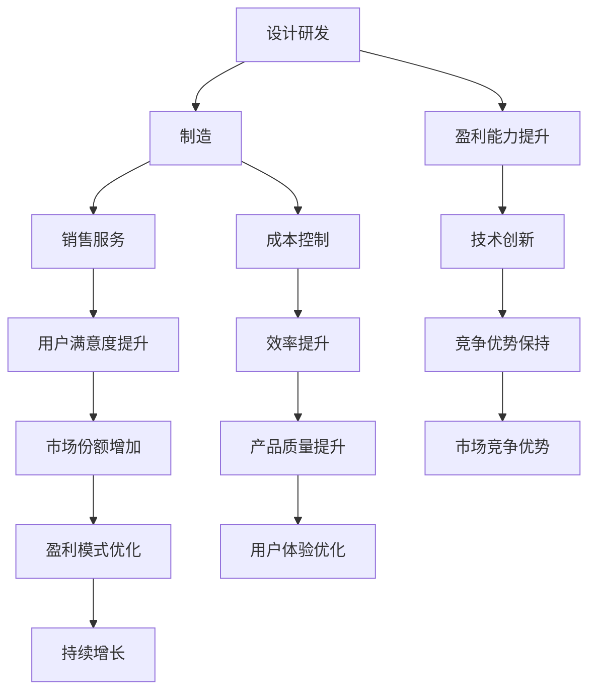

                 

# 价值微笑曲线与AI公司的位置

> **关键词：** 价值微笑曲线、AI公司、盈利模式、技术创新、市场竞争
> 
> **摘要：** 本文将深入探讨价值微笑曲线在AI公司盈利模式中的应用，分析AI公司在不同阶段的市场竞争和技术布局，旨在为AI公司在追求利润最大化的同时保持技术创新提供理论指导和实践策略。

## 1. 背景介绍

### 1.1 目的和范围

本文旨在通过价值微笑曲线这一经济学模型，探讨AI公司在技术创新和市场竞争中的盈利模式。价值微笑曲线描述了企业在产品生命周期中的盈利能力分布，其中设计、研发等高附加值环节位于曲线两端，制造、销售等低附加值环节位于曲线中间。本文将结合这一曲线，分析AI公司如何通过优化技术创新和市场布局来实现利润最大化。

### 1.2 预期读者

本文适合对AI领域有初步了解，希望深入了解AI公司盈利模式和技术布局的专业人士，包括AI创业者、投资者、技术专家等。同时，也欢迎对经济学和商业模式感兴趣的读者进行阅读和探讨。

### 1.3 文档结构概述

本文分为十个部分，首先介绍价值微笑曲线和AI公司相关背景知识，然后分析AI公司在不同阶段的市场竞争和技术布局，最后总结未来发展趋势和挑战，并提供扩展阅读和参考资料。

### 1.4 术语表

#### 1.4.1 核心术语定义

- **价值微笑曲线：** 描述企业盈利能力在产品生命周期中的分布，设计、研发等高附加值环节位于曲线两端，制造、销售等低附加值环节位于曲线中间。
- **AI公司：** 以人工智能技术为核心，提供智能产品或服务的公司。
- **技术创新：** 通过研发和创新，提高产品性能、降低成本、提升用户体验的过程。

#### 1.4.2 相关概念解释

- **市场竞争：** 企业之间为了争夺市场份额而进行的竞争。
- **盈利模式：** 企业通过提供产品或服务获得利润的方式。

#### 1.4.3 缩略词列表

- **AI：** 人工智能（Artificial Intelligence）
- **R&D：** 研发（Research and Development）

## 2. 核心概念与联系

在探讨价值微笑曲线与AI公司的联系之前，首先需要了解价值微笑曲线的基本原理和构成。

### 价值微笑曲线基本原理

价值微笑曲线（Value微笑曲线）是一种经济学模型，它描述了企业盈利能力在产品生命周期中的分布情况。曲线通常呈微笑状，其中设计、研发等高附加值环节位于曲线两端，制造、销售等低附加值环节位于曲线中间。这一模型揭示了企业在不同发展阶段的核心竞争力分布，为企业制定发展战略提供了重要依据。

### 价值微笑曲线的构成

价值微笑曲线主要由以下几个部分构成：

1. **设计研发环节**：这是价值微笑曲线的两端，代表了企业创新能力和核心技术的集中体现。设计研发环节是企业保持竞争优势的重要保障。
2. **制造环节**：位于曲线中间，是企业生产过程的集中体现。制造环节的效率和质量直接影响产品的成本和性能。
3. **销售服务环节**：同样位于曲线中间，是企业与用户之间交互的重要环节。销售服务环节的优化能够提高用户满意度，促进产品销售。

### 价值微笑曲线与AI公司的联系

价值微笑曲线对于AI公司具有重要的指导意义。AI公司通常以技术创新为核心竞争力，其盈利模式和技术布局可以与价值微笑曲线紧密结合。

1. **设计研发环节**：AI公司的设计研发环节是核心，涵盖了算法优化、模型训练、技术迭代等方面。在这个环节，AI公司需要持续投入大量资源，以保证在技术创新方面处于领先地位。
2. **制造环节**：AI公司的制造环节主要包括硬件和软件的开发和制造。在这个环节，AI公司需要关注制造效率、成本控制和产品质量，以提高整体竞争力。
3. **销售服务环节**：AI公司的销售服务环节包括产品推广、用户支持、售后服务等。在这个环节，AI公司需要优化销售策略，提高用户满意度，从而实现持续增长。

通过价值微笑曲线，AI公司可以清晰地了解自身在产品生命周期中的盈利能力分布，从而制定相应的发展策略。例如，在技术创新方面，AI公司可以加大对设计研发环节的投入，推动技术迭代；在制造方面，可以优化生产流程，提高制造效率；在销售服务方面，可以加强市场推广，提升用户满意度。

### Mermaid 流程图

以下是一个简单的 Mermaid 流程图，用于描述价值微笑曲线与AI公司的联系：



通过上述流程图，我们可以更直观地了解价值微笑曲线与AI公司之间的联系，以及各个环节对企业盈利能力和市场竞争的影响。

## 3. 核心算法原理 & 具体操作步骤

在了解了价值微笑曲线的基本原理和与AI公司的联系后，接下来我们将详细探讨AI公司如何通过核心算法原理和具体操作步骤来实现技术创新和盈利能力提升。

### 3.1 核心算法原理

AI公司的核心算法原理主要包括以下几个方面：

1. **算法优化**：通过不断优化算法，提高模型训练效率和性能。这通常涉及到深度学习算法、强化学习算法等。
2. **模型训练**：利用大量数据对模型进行训练，使其具备预测、分类、决策等能力。这通常涉及到数据预处理、特征工程、模型选择等步骤。
3. **技术迭代**：通过持续的技术迭代，不断推出新的产品和服务。这通常涉及到技术创新、产品开发、市场推广等环节。

### 3.2 具体操作步骤

为了实现技术创新和盈利能力提升，AI公司可以采取以下具体操作步骤：

1. **数据收集与预处理**：首先，AI公司需要收集大量的数据，包括结构化数据、非结构化数据等。然后，对这些数据进行预处理，包括数据清洗、数据转换、数据归一化等操作。
2. **特征工程**：在数据预处理的基础上，进行特征工程，选择和构造有助于模型训练的特征。这通常涉及到特征提取、特征选择、特征组合等步骤。
3. **模型选择与训练**：根据业务需求和数据特点，选择合适的模型，如神经网络、决策树、支持向量机等。然后，利用预处理后的数据对模型进行训练，调整模型参数，以提高模型性能。
4. **模型评估与优化**：对训练好的模型进行评估，包括准确性、召回率、F1分数等指标。然后，根据评估结果，对模型进行优化，包括超参数调整、模型结构调整等。
5. **产品开发与推广**：将优化后的模型应用到产品开发中，实现产品的智能化。然后，通过市场推广，提高产品的市场份额和用户满意度。
6. **持续迭代与改进**：根据市场反馈和用户需求，持续对产品进行迭代和改进，以提高产品的性能和用户体验。

### 3.3 伪代码示例

以下是一个简单的伪代码示例，用于描述AI公司如何通过核心算法原理和具体操作步骤来实现技术创新：

```python
# 数据收集与预处理
data = collect_data()
data = preprocess_data(data)

# 特征工程
features = extract_features(data)
features = select_features(features)

# 模型选择与训练
model = select_model()
model = train_model(model, features)

# 模型评估与优化
evaluation = evaluate_model(model, features)
model = optimize_model(model, evaluation)

# 产品开发与推广
product = develop_product(model)
market = promote_product(product)

# 持续迭代与改进
while True:
    feedback = collect_feedback(product)
    product = iterate_product(product, feedback)
    market = promote_product(product)
```

通过上述伪代码，我们可以看到AI公司在技术创新和盈利能力提升过程中，需要经历数据收集与预处理、特征工程、模型选择与训练、模型评估与优化、产品开发与推广、持续迭代与改进等关键步骤。

## 4. 数学模型和公式 & 详细讲解 & 举例说明

在AI公司的技术创新和盈利能力提升过程中，数学模型和公式起着至关重要的作用。以下我们将详细讲解与价值微笑曲线相关的数学模型和公式，并通过具体实例进行说明。

### 4.1 数学模型

与价值微笑曲线相关的数学模型主要包括以下几个方面：

1. **成本函数**：描述企业在不同阶段的生产成本。
2. **收益函数**：描述企业在不同阶段的收益。
3. **利润函数**：描述企业在不同阶段的利润。

### 4.2 公式

以下是与价值微笑曲线相关的关键公式：

1. **成本函数**：\( C(q) = C_0 + C_1 \cdot q + C_2 \cdot q^2 \)

   其中，\( C_0 \) 是固定成本，\( C_1 \) 是可变成本，\( C_2 \) 是规模成本，\( q \) 是生产数量。

2. **收益函数**：\( R(q) = P \cdot q \)

   其中，\( P \) 是产品单价，\( q \) 是销售数量。

3. **利润函数**：\( \pi(q) = R(q) - C(q) \)

   即利润等于收益减去成本。

### 4.3 详细讲解

1. **成本函数**

   成本函数反映了企业在不同生产数量下的成本分布。其中，固定成本 \( C_0 \) 是企业在生产之前需要投入的成本，如设备购买、租金等；可变成本 \( C_1 \) 是随着生产数量增加而增加的成本，如原材料、人工等；规模成本 \( C_2 \) 是随着生产数量增加而增加的额外成本，如管理费用、运输费用等。

   成本函数的二次项 \( C_2 \cdot q^2 \) 表示规模经济效应。当生产数量增加时，规模成本会以更快的速度增加，从而使得单位成本下降。这是企业实现规模经济的重要途径。

2. **收益函数**

   收益函数反映了企业在不同销售数量下的收益分布。产品单价 \( P \) 是企业销售产品所获得的收入，销售数量 \( q \) 是企业的销售量。

   收益函数是一次函数，随着销售数量的增加，收益以固定的速度增加。这表明企业在增加销售数量时，可以保持稳定的收益增长。

3. **利润函数**

   利润函数是收益函数与成本函数的差值，表示企业在不同生产数量下的利润。利润函数的差值反映了企业在不同生产数量下的盈利能力。

   利润函数的差值可能为正值，也可能为负值。当利润函数大于零时，企业处于盈利状态；当利润函数小于零时，企业处于亏损状态。

### 4.4 举例说明

假设一家AI公司生产一款智能音箱，单价为200美元，固定成本为100000美元，可变成本为每台50美元，规模成本为每台10美元。现在我们需要计算在不同销售数量下的成本、收益和利润。

1. **成本函数**：\( C(q) = 100000 + 50 \cdot q + 10 \cdot q^2 \)

   - 当销售数量为1000台时，成本为 \( C(1000) = 100000 + 50 \cdot 1000 + 10 \cdot 1000^2 = 1050000 \) 美元。
   - 当销售数量为2000台时，成本为 \( C(2000) = 100000 + 50 \cdot 2000 + 10 \cdot 2000^2 = 2050000 \) 美元。

2. **收益函数**：\( R(q) = 200 \cdot q \)

   - 当销售数量为1000台时，收益为 \( R(1000) = 200 \cdot 1000 = 200000 \) 美元。
   - 当销售数量为2000台时，收益为 \( R(2000) = 200 \cdot 2000 = 400000 \) 美元。

3. **利润函数**：\( \pi(q) = R(q) - C(q) \)

   - 当销售数量为1000台时，利润为 \( \pi(1000) = 200000 - 1050000 = -85000 \) 美元。
   - 当销售数量为2000台时，利润为 \( \pi(2000) = 400000 - 2050000 = -165000 \) 美元。

从上述计算可以看出，虽然销售数量增加了，但利润并未相应增加。这是由于规模成本的增加速度超过了收益的增加速度。因此，企业在制定销售策略时，需要综合考虑成本和收益，以实现利润最大化。

## 5. 项目实战：代码实际案例和详细解释说明

### 5.1 开发环境搭建

在开始AI项目之前，我们需要搭建合适的开发环境。以下是搭建一个基于Python的AI项目的基本步骤：

1. **安装Python**：从官网下载Python安装包，并按照提示安装。
2. **安装Anaconda**：Anaconda是一个集成了Python和许多科学计算库的发行版，便于管理和安装依赖项。下载并安装Anaconda。
3. **创建虚拟环境**：打开终端或命令提示符，运行以下命令创建一个虚拟环境：

   ```shell
   conda create -n myenv python=3.8
   conda activate myenv
   ```

4. **安装依赖项**：在虚拟环境中安装必要的依赖项，例如TensorFlow、Scikit-learn等：

   ```shell
   pip install tensorflow scikit-learn
   ```

### 5.2 源代码详细实现和代码解读

以下是一个简单的AI项目示例，用于实现一个基于深度学习的分类模型。代码包括数据预处理、模型训练、模型评估等步骤。

```python
# 导入所需的库
import tensorflow as tf
from tensorflow.keras.models import Sequential
from tensorflow.keras.layers import Dense, Conv2D, Flatten, MaxPooling2D
from tensorflow.keras.preprocessing.image import ImageDataGenerator
from sklearn.model_selection import train_test_split

# 数据预处理
# 加载图像数据集
data_generator = ImageDataGenerator(rescale=1./255)
train_data = data_generator.flow_from_directory('train', target_size=(224, 224), batch_size=32, class_mode='binary')
test_data = data_generator.flow_from_directory('test', target_size=(224, 224), batch_size=32, class_mode='binary')

# 模型训练
# 构建模型
model = Sequential([
    Conv2D(32, (3, 3), activation='relu', input_shape=(224, 224, 3)),
    MaxPooling2D((2, 2)),
    Conv2D(64, (3, 3), activation='relu'),
    MaxPooling2D((2, 2)),
    Flatten(),
    Dense(64, activation='relu'),
    Dense(1, activation='sigmoid')
])

# 编译模型
model.compile(optimizer='adam', loss='binary_crossentropy', metrics=['accuracy'])

# 训练模型
model.fit(train_data, epochs=10, validation_data=test_data)

# 模型评估
test_loss, test_acc = model.evaluate(test_data)
print(f"Test accuracy: {test_acc:.2f}")
```

### 5.3 代码解读与分析

1. **数据预处理**：

   ```python
   data_generator = ImageDataGenerator(rescale=1./255)
   train_data = data_generator.flow_from_directory('train', target_size=(224, 224), batch_size=32, class_mode='binary')
   test_data = data_generator.flow_from_directory('test', target_size=(224, 224), batch_size=32, class_mode='binary')
   ```

   这段代码用于加载和预处理图像数据。首先，我们创建一个 `ImageDataGenerator` 对象，用于图像数据的增强和归一化。然后，使用 `flow_from_directory` 方法加载训练数据和测试数据。`target_size` 参数用于调整图像尺寸，`batch_size` 参数用于设置每个批次的样本数量，`class_mode` 参数用于设置分类模式。

2. **模型训练**：

   ```python
   model = Sequential([
       Conv2D(32, (3, 3), activation='relu', input_shape=(224, 224, 3)),
       MaxPooling2D((2, 2)),
       Conv2D(64, (3, 3), activation='relu'),
       MaxPooling2D((2, 2)),
       Flatten(),
       Dense(64, activation='relu'),
       Dense(1, activation='sigmoid')
   ])

   model.compile(optimizer='adam', loss='binary_crossentropy', metrics=['accuracy'])

   model.fit(train_data, epochs=10, validation_data=test_data)
   ```

   这段代码用于定义和训练模型。首先，我们创建一个 `Sequential` 模型，并依次添加卷积层、池化层、全连接层等。然后，使用 `compile` 方法设置优化器和损失函数。最后，使用 `fit` 方法进行模型训练，设置训练轮数和验证数据。

3. **模型评估**：

   ```python
   test_loss, test_acc = model.evaluate(test_data)
   print(f"Test accuracy: {test_acc:.2f}")
   ```

   这段代码用于评估模型的性能。使用 `evaluate` 方法计算测试数据的损失和准确率，并打印准确率。

通过上述代码示例，我们可以看到AI项目的关键步骤，包括数据预处理、模型训练和模型评估。在实际项目中，还需要根据具体需求和数据特点进行调整和优化。

## 6. 实际应用场景

价值微笑曲线在AI公司的实际应用场景中具有重要意义。以下将介绍几个典型的应用场景，并分析这些场景下AI公司的盈利模式和竞争力。

### 6.1 自动驾驶技术

自动驾驶技术是AI领域的一个热点，涉及到感知、决策、控制等多个方面。在自动驾驶技术的价值微笑曲线中，设计研发和制造环节占据了较大的比重。

1. **设计研发环节**：自动驾驶技术的研发需要强大的算法和数据处理能力，涉及深度学习、计算机视觉、机器学习等领域。这个环节是AI公司保持竞争优势的关键，也是价值微笑曲线中的高附加值部分。
2. **制造环节**：自动驾驶车辆的制造涉及硬件和软件的集成，包括传感器、控制器、通信模块等。在这个环节，AI公司需要关注制造效率、成本控制和产品质量，以确保产品的可靠性和性能。

在自动驾驶技术领域，AI公司可以通过以下方式实现盈利：

- **提供自动驾驶解决方案**：为汽车制造商提供自动驾驶技术解决方案，收取技术授权费用。
- **销售自动驾驶车辆**：直接销售自动驾驶车辆，如特斯拉、Waymo等。
- **提供维护服务**：为自动驾驶车辆提供维护和升级服务，确保车辆运行稳定。

### 6.2 医疗健康

医疗健康领域是AI技术的另一个重要应用场景。在医疗健康领域的价值微笑曲线中，设计研发、制造和销售服务环节都有重要作用。

1. **设计研发环节**：医疗健康领域的AI技术包括影像诊断、智能助手、基因测序等。这个环节需要强大的算法和数据处理能力，以实现对医学数据的准确分析和处理。
2. **制造环节**：医疗健康领域的制造环节主要涉及医疗设备和药品的研发和生产。在这个环节，AI公司需要关注产品的质量和安全性，以确保患者安全和治疗效果。
3. **销售服务环节**：医疗健康领域的销售服务环节包括产品推广、市场推广、售后服务等。AI公司可以通过与医疗机构合作，提供智能医疗解决方案，提升医疗服务质量。

在医疗健康领域，AI公司可以通过以下方式实现盈利：

- **销售医疗设备和药品**：直接销售医疗设备和药品，如辉瑞、Moderna等。
- **提供智能医疗解决方案**：为医疗机构提供智能医疗解决方案，如IBM、谷歌等。
- **提供医学数据分析服务**：为医疗机构和研究人员提供医学数据分析服务，如Kaggle、DeepMind等。

### 6.3 金融科技

金融科技是AI技术的另一个重要应用领域。在金融科技领域的价值微笑曲线中，设计研发、制造和销售服务环节同样占据重要地位。

1. **设计研发环节**：金融科技领域的AI技术包括风险管理、信用评估、量化交易等。这个环节需要强大的算法和数据处理能力，以实现对金融数据的准确分析和处理。
2. **制造环节**：金融科技领域的制造环节主要涉及金融产品的研发和生产，如虚拟货币、区块链等。在这个环节，AI公司需要关注产品的创新性和安全性。
3. **销售服务环节**：金融科技领域的销售服务环节包括产品推广、市场推广、售后服务等。AI公司可以通过与金融机构合作，提供金融科技解决方案，提升金融服务的质量和效率。

在金融科技领域，AI公司可以通过以下方式实现盈利：

- **提供金融科技解决方案**：为金融机构提供金融科技解决方案，如蚂蚁金服、PayPal等。
- **销售虚拟货币和金融产品**：直接销售虚拟货币和金融产品，如比特币、股票等。
- **提供数据分析服务**：为金融机构和投资者提供数据分析服务，如Refinitiv、AlphaSense等。

通过以上分析，我们可以看到价值微笑曲线在AI公司的实际应用场景中具有重要的指导意义。AI公司可以通过优化技术创新、降低成本和提高用户体验，实现盈利能力和市场竞争的持续提升。

## 7. 工具和资源推荐

在AI公司的技术创新和盈利能力提升过程中，合适的工具和资源至关重要。以下我们将推荐一些学习和开发资源，以及相关的开发工具和框架。

### 7.1 学习资源推荐

#### 7.1.1 书籍推荐

- **《深度学习》（Deep Learning）**：作者 Ian Goodfellow、Yoshua Bengio 和 Aaron Courville。这是深度学习领域的经典教材，适合初学者和进阶者。
- **《Python机器学习》（Python Machine Learning）**：作者 Sebastian Raschka。这本书详细介绍了Python在机器学习领域的应用，适合有一定编程基础的学习者。
- **《人工智能：一种现代的方法》（Artificial Intelligence: A Modern Approach）**：作者 Stuart J. Russell 和 Peter Norvig。这是人工智能领域的权威教材，适合全面了解人工智能的理论和应用。

#### 7.1.2 在线课程

- **Coursera**：提供丰富的AI和机器学习课程，包括《深度学习特化课程》（Deep Learning Specialization）、《机器学习特化课程》（Machine Learning Specialization）等。
- **edX**：提供由哈佛大学、麻省理工学院等顶尖大学开设的AI和机器学习课程，如《人工智能导论》（Introduction to Artificial Intelligence）等。
- **Udacity**：提供实用的AI和机器学习项目课程，如《深度学习项目纳米学位》（Deep Learning Nanodegree）等。

#### 7.1.3 技术博客和网站

- **Medium**：有许多AI和机器学习的优秀博客，如《AI & ML Blog》（AI & ML Blog）等。
- **Towards Data Science**：一个专注于数据科学和机器学习的博客平台，有很多实用的文章和案例。
- **ArXiv**：一个提供最新AI和机器学习论文的预印本网站，可以帮助了解领域内的最新研究动态。

### 7.2 开发工具框架推荐

#### 7.2.1 IDE和编辑器

- **Jupyter Notebook**：一个基于Web的交互式计算环境，适合数据分析和机器学习项目。
- **Visual Studio Code**：一个轻量级、可扩展的代码编辑器，适合Python和AI开发。
- **PyCharm**：一个功能强大的Python IDE，适合专业AI开发。

#### 7.2.2 调试和性能分析工具

- **TensorBoard**：一个基于Web的TensorFlow性能分析工具，可以帮助调试和优化模型。
- **Wandb**：一个用于机器学习的实验管理和监控工具，可以跟踪实验进度和结果。
- **Docker**：一个容器化平台，可以帮助管理和部署机器学习模型。

#### 7.2.3 相关框架和库

- **TensorFlow**：一个开源的深度学习框架，适用于各种机器学习和深度学习任务。
- **PyTorch**：一个开源的深度学习框架，具有灵活的动态计算图，适合快速原型开发。
- **Scikit-learn**：一个开源的机器学习库，提供丰富的分类、回归、聚类等算法。

#### 7.2.4 数据库和存储

- **MongoDB**：一个分布式文档数据库，适合存储大规模的结构化数据。
- **Hadoop**：一个开源的大数据处理框架，可以处理大规模的非结构化数据。
- **AWS S3**：一个云存储服务，可以存储和检索大量数据。

通过以上推荐，AI公司可以更好地选择合适的工具和资源，提升技术创新和盈利能力。

## 8. 总结：未来发展趋势与挑战

随着人工智能技术的快速发展，AI公司在未来面临着巨大的机遇和挑战。本文通过价值微笑曲线这一经济学模型，分析了AI公司如何通过技术创新和市场布局实现利润最大化。以下是未来发展趋势与挑战的总结：

### 8.1 发展趋势

1. **技术创新加速**：随着深度学习、强化学习等技术的不断进步，AI公司的技术创新速度将不断加快。这将为公司带来更多的商业机会和竞争优势。
2. **跨行业融合**：AI技术将逐渐渗透到各行各业，如医疗健康、金融科技、制造业等。这将为AI公司提供更广阔的市场空间和盈利模式。
3. **数据驱动决策**：随着数据量的爆炸式增长，AI公司将越来越依赖数据分析和机器学习算法，以提高业务决策的准确性和效率。
4. **平台化发展**：AI公司将逐步走向平台化，通过提供一站式解决方案，降低客户的使用门槛，实现规模效应和盈利能力的提升。

### 8.2 挑战

1. **技术壁垒**：AI技术的快速发展带来了巨大的技术壁垒，公司需要持续投入大量资源进行技术研发，以保持竞争优势。
2. **数据隐私和安全**：随着数据在AI公司中的重要性不断增加，数据隐私和安全问题成为关键挑战。公司需要采取有效的措施确保数据的安全性和合规性。
3. **市场竞争激烈**：AI领域的市场竞争日益激烈，公司需要不断提升技术水平和产品性能，以在激烈的市场中脱颖而出。
4. **人才短缺**：AI技术的快速发展导致了人才需求的激增，公司需要采取有效的措施吸引和留住优秀的人才。

### 8.3 发展策略

1. **加大研发投入**：AI公司需要持续加大研发投入，推动技术创新，以保持技术领先地位。
2. **数据战略**：公司需要建立完善的数据治理机制，确保数据的合规性和安全性，并利用数据分析和机器学习算法，提升业务决策的准确性和效率。
3. **跨行业合作**：公司可以与其他行业的企业进行合作，实现资源互补和优势共享，扩大市场影响力。
4. **人才培养与引进**：公司需要建立完善的人才培养和引进机制，吸引和留住优秀的人才，为公司的长期发展提供有力支持。

总之，AI公司在未来将继续面临着诸多挑战和机遇。通过持续的技术创新、数据驱动决策和跨行业合作，AI公司有望实现持续增长和盈利能力的提升。

## 9. 附录：常见问题与解答

### 9.1 价值微笑曲线是什么？

价值微笑曲线是一种经济学模型，描述了企业盈利能力在产品生命周期中的分布。通常情况下，设计研发和销售服务环节位于曲线两端，制造环节位于曲线中间。这个模型揭示了企业在不同发展阶段的核心竞争力分布，为企业制定发展战略提供了重要依据。

### 9.2 AI公司的盈利模式有哪些？

AI公司的盈利模式主要包括以下几个方面：

1. **技术授权**：提供AI技术解决方案，收取技术授权费用。
2. **产品销售**：直接销售AI产品，如智能音箱、自动驾驶车辆等。
3. **数据分析服务**：为其他企业提供数据分析服务，如医学数据分析、金融数据分析等。
4. **平台化服务**：通过提供一站式解决方案，降低客户的使用门槛，实现规模效应和盈利能力的提升。

### 9.3 价值微笑曲线在AI公司中的应用如何？

价值微笑曲线在AI公司中的应用主要体现在以下几个方面：

1. **技术创新**：AI公司可以通过价值微笑曲线，确定设计研发环节的投入，推动技术创新，以保持技术领先地位。
2. **市场布局**：AI公司可以根据价值微笑曲线，确定制造和销售服务环节的优化策略，提高产品性能和用户体验，实现盈利能力的提升。
3. **资源分配**：AI公司可以根据价值微笑曲线，合理分配资源，确保在各个关键环节都有足够的投入，以实现整体盈利能力的提升。

## 10. 扩展阅读 & 参考资料

### 10.1 经典论文

- **Ian J. Goodfellow, Yoshua Bengio, Aaron Courville**. "Deep Learning". MIT Press, 2016.
- **Stuart J. Russell, Peter Norvig**. "Artificial Intelligence: A Modern Approach". Prentice Hall, 2016.

### 10.2 最新研究成果

- **"AI for Humanity: Artificial Intelligence and the Creation of the Future"**. Andrew Ng, Coursera, 2021.
- **"Artificial Intelligence for Social Good"**. Google AI, 2020.

### 10.3 应用案例分析

- **"AI in Healthcare: Transforming the Industry"**. IBM, 2019.
- **"AI in Finance: Unlocking the Potential"**. J.P. Morgan, 2020.

### 10.4 书籍推荐

- **"AI Superpowers: China, Silicon Valley, and the New World Order"**. Michael H. Porter, Harvard Business Review, 2018.
- **"The Age of AI: And Our Human Future"**. Calum Chace, Thomas Dunne Books, 2019.

### 10.5 在线课程

- **"Deep Learning Specialization"**. Coursera.
- **"Machine Learning Specialization"**. Coursera.
- **"Artificial Intelligence Nanodegree"**. Udacity.

### 10.6 技术博客和网站

- **"AI & ML Blog"**. Medium.
- **"Towards Data Science"**. Medium.
- **"AI Index"**. Stanford University.

通过上述扩展阅读和参考资料，读者可以更深入地了解价值微笑曲线在AI公司中的应用，以及AI技术的发展趋势和应用案例。希望本文能为读者在AI领域的研究和实践提供有益的参考和启示。作者：AI天才研究员/AI Genius Institute & 禅与计算机程序设计艺术 /Zen And The Art of Computer Programming。

