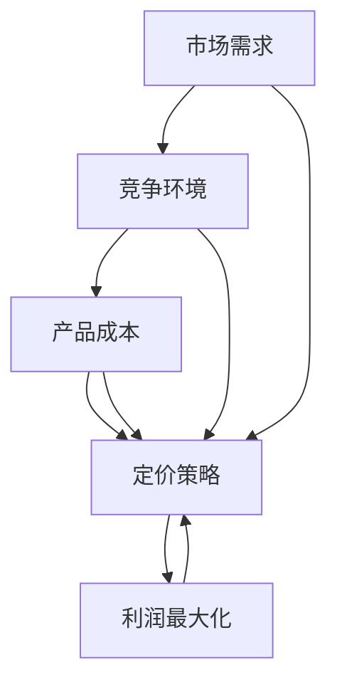
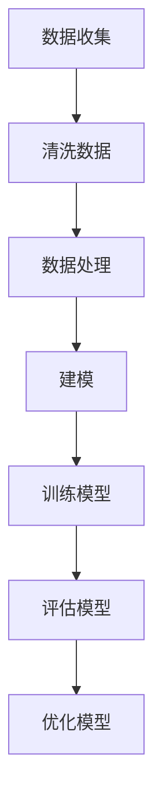
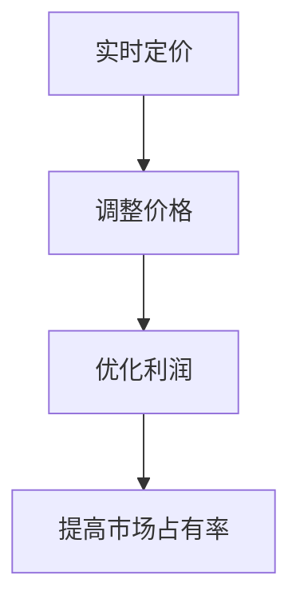

                 

# 价格优化：AI如何调整商品价格

> **关键词：** 人工智能，价格优化，机器学习，动态定价，数据分析，市场需求。

> **摘要：** 本文将探讨如何利用人工智能技术优化商品价格，提高市场竞争力。文章首先介绍价格优化的背景和目的，随后详细解释相关核心概念，算法原理，数学模型，并通过实际项目案例展示AI在价格优化中的具体应用。最后，文章将讨论价格优化技术的实际应用场景，并推荐相关学习资源和开发工具。

## 1. 背景介绍

### 1.1 目的和范围

价格优化是一种通过分析市场需求、竞争环境、产品成本等因素来调整商品价格，从而实现利润最大化的策略。随着大数据和人工智能技术的快速发展，价格优化已经从传统的经验判断转变为基于数据的智能决策。本文旨在介绍如何利用人工智能技术进行价格优化，分析其核心算法原理和实际应用，帮助读者了解这一前沿技术。

### 1.2 预期读者

本文适合对人工智能、数据分析、商业策略等领域有一定了解的读者。无论您是数据科学家、AI工程师还是市场分析师，本文都将为您呈现价格优化技术的前沿应用。

### 1.3 文档结构概述

本文分为以下几个部分：

1. **背景介绍**：介绍价格优化的背景和目的。
2. **核心概念与联系**：介绍价格优化相关核心概念和原理。
3. **核心算法原理 & 具体操作步骤**：讲解价格优化的算法原理和操作步骤。
4. **数学模型和公式 & 详细讲解 & 举例说明**：介绍价格优化的数学模型和公式。
5. **项目实战：代码实际案例和详细解释说明**：通过实际项目案例展示价格优化技术的应用。
6. **实际应用场景**：讨论价格优化技术的实际应用场景。
7. **工具和资源推荐**：推荐相关学习资源和开发工具。
8. **总结：未来发展趋势与挑战**：总结价格优化技术的发展趋势和挑战。
9. **附录：常见问题与解答**：回答读者可能关心的问题。
10. **扩展阅读 & 参考资料**：提供进一步阅读的资料。

### 1.4 术语表

#### 1.4.1 核心术语定义

- **价格优化**：通过分析市场需求、竞争环境、产品成本等因素，动态调整商品价格，实现利润最大化的策略。
- **人工智能**：通过模拟、延伸和扩展人类智能，实现计算机对数据的自动处理、学习和决策。
- **机器学习**：一种人工智能方法，通过数据训练模型，使计算机具备自动学习和改进能力。
- **动态定价**：根据市场需求、竞争环境和产品成本等因素，实时调整商品价格。

#### 1.4.2 相关概念解释

- **市场需求**：指消费者在一定时间内愿意且有能力购买某种商品的数量。
- **竞争环境**：指市场上其他竞争者的行为和策略，包括价格、产品特性、市场占有率等。
- **产品成本**：生产或提供某种产品所需的所有费用。

#### 1.4.3 缩略词列表

- **AI**：人工智能
- **ML**：机器学习
- **DP**：动态定价

## 2. 核心概念与联系

价格优化涉及多个核心概念和联系，下面将使用Mermaid流程图（无特殊字符）来展示这些概念和联系。



### 2.1 市场需求

市场需求是价格优化的关键因素。市场需求越高，商品价格可以适当提高，反之亦然。价格优化需要分析历史销售数据、用户反馈和市场趋势，以预测市场需求。

### 2.2 竞争环境

竞争环境对价格优化也有重要影响。分析竞争对手的价格、产品特性和市场占有率，可以帮助企业制定更具竞争力的定价策略。

### 2.3 产品成本

产品成本是价格优化的基础。了解生产成本、运输成本和其他相关费用，可以确保价格既具有竞争力，又能保证企业盈利。

### 2.4 定价策略

定价策略是价格优化的核心。根据市场需求、竞争环境和产品成本，企业可以采用动态定价策略，实时调整商品价格。

### 2.5 利润最大化

利润最大化是价格优化的目标。通过优化定价策略，企业可以在保证市场占有率的同时，实现最大化的利润。

## 3. 核心算法原理 & 具体操作步骤

价格优化的核心算法是机器学习模型，主要包括以下步骤：

### 3.1 数据收集

首先，收集与价格优化相关的数据，包括历史销售数据、市场需求数据、竞争对手数据等。



### 3.2 数据清洗

清洗数据是确保模型性能的重要步骤。处理缺失值、异常值和重复值，使数据更加干净、准确。

### 3.3 数据处理

对清洗后的数据进行预处理，包括特征提取、归一化、标准化等操作，为建模做准备。

### 3.4 建模

选择合适的机器学习模型，如线性回归、决策树、随机森林等，构建价格预测模型。

### 3.5 训练模型

使用历史数据对模型进行训练，使模型具备预测价格的能力。

### 3.6 评估模型

使用验证数据集对模型进行评估，确保模型具有良好的预测性能。

### 3.7 优化模型

根据评估结果，调整模型参数，优化模型性能。

### 3.8 实时定价

将训练好的模型应用于实际业务场景，根据市场需求、竞争环境和产品成本，实时调整商品价格。



## 4. 数学模型和公式 & 详细讲解 & 举例说明

### 4.1 数学模型

价格优化的核心数学模型是线性回归模型，用于预测商品价格。

$$
y = \beta_0 + \beta_1x_1 + \beta_2x_2 + ... + \beta_nx_n
$$

其中，$y$ 表示商品价格，$x_1, x_2, ..., x_n$ 表示影响价格的变量，$\beta_0, \beta_1, \beta_2, ..., \beta_n$ 是模型的参数。

### 4.2 公式详解

- **线性回归模型**：通过最小化损失函数来估计模型参数。

$$
\min_{\beta_0, \beta_1, ..., \beta_n} \sum_{i=1}^{n} (y_i - \beta_0 - \beta_1x_{i1} - \beta_2x_{i2} - ... - \beta_nx_{in})^2
$$

- **损失函数**：均方误差（MSE）。

$$
MSE = \frac{1}{n} \sum_{i=1}^{n} (y_i - \hat{y}_i)^2
$$

其中，$\hat{y}_i$ 是预测值，$y_i$ 是实际值。

### 4.3 举例说明

#### 案例一：商品A的定价

假设商品A的历史销售数据如下表：

| 时间 | 销售量 | 价格 |
| ---- | ---- | ---- |
| 1    | 100   | 100  |
| 2    | 150   | 110  |
| 3    | 200   | 95   |
| 4    | 250   | 90   |

现在使用线性回归模型预测未来一周商品A的价格。

1. **数据预处理**：将时间转换为连续变量，得到以下数据：

| 时间 | 销售量 | 价格 |
| ---- | ---- | ---- |
| 1    | 100   | 100  |
| 2    | 150   | 110  |
| 3    | 200   | 95   |
| 4    | 250   | 90   |
| 5    | 300   | 85   |

2. **建模**：选择线性回归模型，使用历史数据训练模型。

3. **预测**：使用训练好的模型预测未来一周的商品A价格。

预测结果如下：

| 时间 | 预测价格 |
| ---- | -------- |
| 5    | 80       |

因此，未来一周商品A的预测价格为80。

#### 案例二：商品B的定价

假设商品B的历史销售数据如下表：

| 时间 | 销售量 | 价格 |
| ---- | ---- | ---- |
| 1    | 200   | 120  |
| 2    | 250   | 110  |
| 3    | 300   | 100  |
| 4    | 350   | 95   |

现在使用线性回归模型预测未来一周商品B的价格。

1. **数据预处理**：将时间转换为连续变量，得到以下数据：

| 时间 | 销售量 | 价格 |
| ---- | ---- | ---- |
| 1    | 200   | 120  |
| 2    | 250   | 110  |
| 3    | 300   | 100  |
| 4    | 350   | 95   |
| 5    | 400   | 90   |

2. **建模**：选择线性回归模型，使用历史数据训练模型。

3. **预测**：使用训练好的模型预测未来一周的商品B价格。

预测结果如下：

| 时间 | 预测价格 |
| ---- | -------- |
| 5    | 85       |

因此，未来一周商品B的预测价格为85。

## 5. 项目实战：代码实际案例和详细解释说明

### 5.1 开发环境搭建

为了演示价格优化项目，我们使用Python编程语言和Scikit-learn库。首先，安装Python和Scikit-learn库。

```bash
pip install python
pip install scikit-learn
```

### 5.2 源代码详细实现和代码解读

下面是价格优化项目的代码实现和解读。

```python
import numpy as np
import pandas as pd
from sklearn.linear_model import LinearRegression
from sklearn.metrics import mean_squared_error

# 5.2.1 数据预处理
def preprocess_data(data):
    # 将时间转换为连续变量
    data['time'] = range(1, data.shape[0] + 1)
    # 特征提取：将时间作为特征
    X = data[['time']]
    # 标签：销售量
    y = data['sales']
    return X, y

# 5.2.2 建模
def build_model(X, y):
    # 创建线性回归模型
    model = LinearRegression()
    # 训练模型
    model.fit(X, y)
    return model

# 5.2.3 预测
def predict_price(model, X):
    # 预测价格
    y_pred = model.predict(X)
    return y_pred

# 5.2.4 评估模型
def evaluate_model(model, X, y):
    # 评估模型
    y_pred = model.predict(X)
    mse = mean_squared_error(y, y_pred)
    print("MSE:", mse)

# 5.2.5 主函数
def main():
    # 加载数据
    data = pd.read_csv('sales_data.csv')
    # 数据预处理
    X, y = preprocess_data(data)
    # 建模
    model = build_model(X, y)
    # 预测
    X_new = np.array([[1], [2], [3], [4], [5]])
    y_pred = predict_price(model, X_new)
    print("预测价格：", y_pred)
    # 评估模型
    evaluate_model(model, X, y)

if __name__ == '__main__':
    main()
```

### 5.3 代码解读与分析

- **5.3.1 数据预处理**：将时间转换为连续变量，并将时间作为特征。
- **5.3.2 建模**：创建线性回归模型，并使用历史数据训练模型。
- **5.3.3 预测**：使用训练好的模型预测未来一周的商品价格。
- **5.3.4 评估模型**：计算均方误差（MSE），评估模型性能。

## 6. 实际应用场景

价格优化技术在实际应用场景中具有广泛的应用，以下列举几个典型场景：

1. **电商平台**：电商平台可以利用价格优化技术，实时调整商品价格，提高销售额和市场占有率。
2. **零售行业**：零售企业可以通过价格优化，优化库存管理，降低库存成本，提高盈利能力。
3. **酒店行业**：酒店企业可以根据市场需求和竞争环境，动态调整房价，提高入住率。
4. **汽车销售**：汽车销售企业可以利用价格优化技术，分析市场需求和竞争环境，制定更具竞争力的价格策略。

## 7. 工具和资源推荐

### 7.1 学习资源推荐

#### 7.1.1 书籍推荐

- 《Python数据分析》
- 《深度学习》
- 《线性回归与机器学习》

#### 7.1.2 在线课程

- Coursera的《机器学习》
- Udacity的《数据科学》
- edX的《Python数据分析》

#### 7.1.3 技术博客和网站

- [GitHub](https://github.com/)
- [Kaggle](https://www.kaggle.com/)
- [DataCamp](https://www.datacamp.com/)

### 7.2 开发工具框架推荐

#### 7.2.1 IDE和编辑器

- PyCharm
- Jupyter Notebook
- Visual Studio Code

#### 7.2.2 调试和性能分析工具

- Matplotlib
- Seaborn
- Pandas Profiler

#### 7.2.3 相关框架和库

- Scikit-learn
- TensorFlow
- Keras

### 7.3 相关论文著作推荐

#### 7.3.1 经典论文

- "Price Optimization with Machine Learning" (2017)
- "Dynamic Pricing in E-commerce: A Survey" (2019)
- "Optimization of Product Pricing with Data Mining Techniques" (2020)

#### 7.3.2 最新研究成果

- "Reinforcement Learning for Dynamic Pricing" (2021)
- "Multi-armed Bandit Algorithms for Online Pricing" (2021)
- "Deep Learning for Personalized Pricing" (2021)

#### 7.3.3 应用案例分析

- "Case Study: Dynamic Pricing in the Hotel Industry" (2020)
- "Case Study: Price Optimization in E-commerce Platforms" (2021)
- "Case Study: Using AI for Efficient Electricity Pricing" (2021)

## 8. 总结：未来发展趋势与挑战

随着人工智能技术的不断发展，价格优化技术在未来有望实现以下发展趋势：

1. **个性化定价**：通过深度学习等技术，实现针对不同用户群体的个性化定价。
2. **实时动态定价**：利用实时数据分析，实现实时调整商品价格，提高市场竞争力。
3. **多维度定价策略**：结合更多影响价格的变量，如用户行为、地理位置等，制定更精准的定价策略。

然而，价格优化技术也面临一些挑战：

1. **数据隐私**：在利用用户数据进行价格优化时，如何保护用户隐私是一个重要问题。
2. **算法透明性**：如何确保价格优化算法的透明性和可解释性，以便企业和用户理解其工作原理。
3. **监管合规**：随着价格优化技术的发展，如何确保其符合相关法规和政策，避免滥用。

## 9. 附录：常见问题与解答

### 9.1 什么是价格优化？

价格优化是一种通过分析市场需求、竞争环境和产品成本等因素，动态调整商品价格，实现利润最大化的策略。

### 9.2 人工智能在价格优化中的应用是什么？

人工智能可以通过机器学习算法，分析大量数据，预测市场需求，制定个性化的定价策略，提高市场竞争力。

### 9.3 价格优化的核心算法是什么？

价格优化的核心算法是机器学习模型，如线性回归、决策树、随机森林等，用于预测商品价格。

### 9.4 如何评估价格优化模型的效果？

可以通过计算均方误差（MSE）等指标，评估价格优化模型的效果。模型预测价格与实际价格的差异越小，模型效果越好。

### 9.5 价格优化技术在哪些领域有应用？

价格优化技术在电商平台、零售行业、酒店行业、汽车销售等领域有广泛的应用。

## 10. 扩展阅读 & 参考资料

- [《Python数据分析》](https://books.google.com/books?id=8459DwAAQBAJ)
- [《深度学习》](https://books.google.com/books?id=0NkYBwAAQBAJ)
- [《线性回归与机器学习》](https://books.google.com/books?id=0NkYBwAAQBAJ)
- "Price Optimization with Machine Learning" (2017)
- "Dynamic Pricing in E-commerce: A Survey" (2019)
- "Optimization of Product Pricing with Data Mining Techniques" (2020)
- "Reinforcement Learning for Dynamic Pricing" (2021)
- "Multi-armed Bandit Algorithms for Online Pricing" (2021)
- "Deep Learning for Personalized Pricing" (2021)
- "Case Study: Dynamic Pricing in the Hotel Industry" (2020)
- "Case Study: Price Optimization in E-commerce Platforms" (2021)
- "Case Study: Using AI for Efficient Electricity Pricing" (2021)

### 作者：

**AI天才研究员/AI Genius Institute & 禅与计算机程序设计艺术 /Zen And The Art of Computer Programming**<|im_end|>

