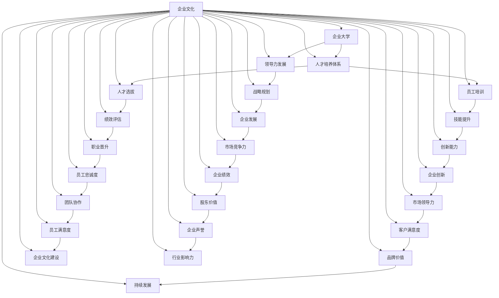

                 

# 企业大学校长的创业使命：建立企业大学与人才培养体系

> **关键词**：企业大学、人才培养、领导力、学习体系建设、数字化转型

> **摘要**：本文将深入探讨企业大学校长在建立企业大学与人才培养体系中的使命和挑战。我们将从企业大学的概念和重要性出发，逐步分析其与人才培养的关联，探讨成功的企业大学模型，并总结出企业大学校长所面临的创业使命和未来发展趋势。

## 1. 背景介绍

### 1.1 目的和范围

本文旨在为企业管理者和企业大学校长提供一套系统性思维框架，帮助他们更好地理解并实施企业大学建设，以及如何通过人才培养体系提升企业的核心竞争力。我们将通过以下几个方面进行探讨：

1. **企业大学的概念和重要性**：介绍企业大学的基本定义，阐述其在现代企业管理中的地位和作用。
2. **人才培养与企业发展**：分析人才培养对企业发展的关键作用，以及企业大学在其中的角色。
3. **成功的企业大学模型**：探讨国内外成功企业大学的案例，总结其共同特点和成功要素。
4. **企业大学校长的创业使命**：讨论企业大学校长在建立和运营企业大学过程中所面临的挑战和机遇。
5. **未来发展趋势**：展望企业大学的发展趋势，探讨数字化、全球化对企业大学建设的影响。

### 1.2 预期读者

本篇文章预期读者为以下几类人群：

1. **企业管理者**：希望了解如何通过建立企业大学提升企业人才竞争力。
2. **企业大学校长**：正在从事或准备从事企业大学建设和人才培养工作。
3. **人力资源从业者**：对人才培养体系和企业大学运营感兴趣的专业人士。
4. **教育行业专家**：关注企业教育和职业培训领域的学者和实践者。

### 1.3 文档结构概述

本文将分为以下章节：

1. **背景介绍**：介绍本文的目的、范围、预期读者以及文档结构。
2. **核心概念与联系**：阐述企业大学和人才培养体系的核心概念及其相互关系。
3. **核心算法原理 & 具体操作步骤**：介绍企业大学建设和人才培养的基本原则和操作步骤。
4. **数学模型和公式 & 详细讲解 & 举例说明**：使用数学模型和公式详细解释企业大学建设和人才培养的关键环节。
5. **项目实战：代码实际案例和详细解释说明**：提供实际案例和代码，展示企业大学建设和人才培养的实践方法。
6. **实际应用场景**：分析企业大学和人才培养在实际企业中的应用案例。
7. **工具和资源推荐**：推荐学习资源和开发工具，帮助读者深入学习和实践。
8. **总结：未来发展趋势与挑战**：总结企业大学和人才培养的发展趋势和面临的挑战。
9. **附录：常见问题与解答**：解答读者可能遇到的问题。
10. **扩展阅读 & 参考资料**：提供进一步阅读和研究的资源。

### 1.4 术语表

#### 1.4.1 核心术语定义

- **企业大学**：企业内部设立的、旨在提升员工技能和综合素质的教育机构。
- **人才培养体系**：企业为培养和提升员工能力所构建的系统和方法。
- **领导力**：领导者引导、激励和影响他人的能力。
- **数字化转型**：运用数字技术改变企业的商业模式、工作流程和运营模式。

#### 1.4.2 相关概念解释

- **学习体系建设**：企业为提升员工学习能力和知识更新所构建的支持体系。
- **人才竞争力**：企业在市场竞争中依靠人才所具备的优势。

#### 1.4.3 缩略词列表

- **HR**：Human Resources，人力资源
- **L&D**：Learning and Development，学习和发展
- **IT**：Information Technology，信息技术

## 2. 核心概念与联系

在企业大学建设和人才培养体系中，有几个核心概念和联系需要明确。以下是使用Mermaid流程图展示的核心概念和关系：



### 2.1 核心概念解析

- **企业大学**：企业大学是一个专注于提升员工综合素质、技能和领导力的教育机构。它为企业提供持续学习的机会，帮助员工适应快速变化的市场和技术环境。
- **人才培养体系**：人才培养体系是企业为培养和提升员工能力所构建的系统和方法。它包括人才选拔、培训、评估、晋升等多个环节，旨在提高员工的专业技能和综合素质。
- **领导力发展**：领导力发展是培养员工领导能力和影响力的过程。它包括战略规划、团队建设、决策能力等方面的培养，是企业大学建设和人才培养体系的重要组成部分。
- **员工培训**：员工培训是指企业为提升员工技能和知识而进行的教育和培训活动。它是人才培养体系中的关键环节，有助于提升员工的个人能力和职业素养。
- **人才选拔**：人才选拔是企业根据岗位需求和员工潜力，选拔合适人才的过程。它是人才培养体系中的起点，直接影响企业的人才储备和未来发展。

通过以上核心概念和联系，我们可以更好地理解企业大学建设和人才培养体系之间的紧密关系。企业大学作为企业内部的教育机构，不仅是提升员工技能和知识的重要平台，更是推动企业创新和持续发展的重要力量。

### 2.2 成功的企业大学模型分析

在企业大学建设和人才培养体系中，成功的企业大学模型具有以下共同特点和成功要素：

#### 2.2.1 企业愿景与战略

成功的企业大学模型首先明确企业的愿景和战略，将企业大学建设纳入企业整体发展战略中。企业大学的目标应与企业的长期目标和核心价值观保持一致，从而确保人才培养与企业发展的紧密衔接。

#### 2.2.2 精细化的人才培养体系

成功的企业大学模型注重构建精细化的人才培养体系，包括人才选拔、培训、评估、晋升等多个环节。每个环节都有明确的流程和标准，确保人才培养的规范化和高效性。

#### 2.2.3 融入企业文化和价值观

成功的企业大学模型注重将企业文化和价值观融入人才培养过程中，通过文化渗透和价值观传播，培养员工的归属感和使命感，提升企业的凝聚力和向心力。

#### 2.2.4 创新的教学方法和手段

成功的企业大学模型采用创新的 teaching methods and techniques，如在线学习、虚拟现实、游戏化学习等，提高员工的学习兴趣和参与度，增强培训效果。

#### 2.2.5 强大的师资队伍

成功的企业大学模型拥有一支强大的师资队伍，包括企业内部专家、行业精英、专业培训机构等。师资队伍的素质和实力直接影响企业大学的教学质量和培训效果。

#### 2.2.6 系统化的评估和反馈机制

成功的企业大学模型建立系统化的评估和反馈机制，对培训效果进行持续监测和评估，及时调整培训策略，确保人才培养目标的实现。

#### 2.2.7 跨部门协作和资源共享

成功的企业大学模型鼓励跨部门协作和资源共享，通过内部合作和外部合作，实现人才培养的最大化效益。

通过以上成功企业大学模型的分析，我们可以看到，企业大学建设和人才培养体系的建设不是一蹴而就的，需要企业从战略高度进行规划和布局，持续投入和优化，才能真正发挥其应有的作用，提升企业的核心竞争力。

## 3. 核心算法原理 & 具体操作步骤

在企业大学建设和人才培养体系中，核心算法原理和具体操作步骤至关重要。以下将详细阐述企业大学建设和人才培养的基本原则和实施步骤。

### 3.1 企业大学建设算法原理

企业大学建设的核心算法原理主要包括以下三个方面：

1. **战略导向**：企业大学建设应以企业战略为导向，明确企业愿景和目标，确保人才培养与企业发展的紧密衔接。
2. **系统化设计**：企业大学建设应采用系统化设计的方法，构建包含人才选拔、培训、评估、晋升等环节的人才培养体系。
3. **创新驱动**：企业大学建设应注重创新驱动，采用先进的教学方法和手段，提高员工的学习兴趣和参与度。

### 3.2 企业大学建设具体操作步骤

1. **需求分析**：首先，企业需要对企业内部的人才需求和外部市场环境进行深入分析，明确企业大学建设的目标和方向。
2. **战略规划**：基于需求分析，企业应制定企业大学建设战略规划，明确企业愿景、目标和关键里程碑。
3. **资源整合**：企业需要整合内部和外部资源，包括人力资源、资金、技术等，为大学建设提供有力支持。
4. **体系建设**：构建包含人才选拔、培训、评估、晋升等环节的人才培养体系，确保人才培养的规范化和高效性。
5. **教学实施**：采用创新的教学方法和手段，如在线学习、虚拟现实、游戏化学习等，提高员工的学习兴趣和参与度。
6. **持续优化**：建立系统化的评估和反馈机制，对培训效果进行持续监测和评估，及时调整培训策略，确保人才培养目标的实现。

### 3.3 人才培养体系算法原理

人才培养体系的算法原理主要包括以下三个方面：

1. **能力导向**：人才培养应以提升员工能力为导向，关注员工的职业发展和个人成长。
2. **个性化培养**：根据员工的不同特点和需求，提供个性化的培训方案，实现人才定制化培养。
3. **持续发展**：人才培养应注重员工的持续发展，提供长期的学习和成长机会，助力员工实现职业目标。

### 3.4 人才培养体系具体操作步骤

1. **能力评估**：首先，企业应进行员工能力评估，了解员工的专业技能、综合素质和潜在能力。
2. **需求分析**：基于能力评估结果，分析员工的学习需求和职业发展目标。
3. **方案设计**：根据员工的需求和目标，设计个性化的培训方案，包括课程选择、培训时间、培训方式等。
4. **培训实施**：按照培训方案开展培训活动，采用多种教学方法和手段，提高培训效果。
5. **评估反馈**：对培训效果进行评估和反馈，收集员工意见和建议，持续优化培训方案。
6. **职业发展**：关注员工的职业发展，提供晋升机会和职业规划指导，助力员工实现职业目标。

### 3.5 领导力发展算法原理

领导力发展的算法原理主要包括以下三个方面：

1. **战略思维**：领导力发展应培养员工的战略思维能力，提升员工的决策能力和市场洞察力。
2. **团队协作**：领导力发展应强调团队协作和沟通能力，提升员工的团队管理和领导力。
3. **创新能力**：领导力发展应注重员工的创新能力，培养员工的创新思维和实践能力。

### 3.6 领导力发展具体操作步骤

1. **领导力评估**：首先，企业应进行员工领导力评估，了解员工在战略思维、团队协作和创新能力方面的表现。
2. **需求分析**：基于领导力评估结果，分析员工在领导力发展方面的需求和目标。
3. **培养方案设计**：根据员工的需求和目标，设计个性化的领导力培养方案，包括培训课程、实践项目、导师指导等。
4. **培养实施**：按照培养方案开展领导力培养活动，通过培训、实践、指导等多种方式，提升员工的领导力。
5. **评估反馈**：对领导力培养效果进行评估和反馈，收集员工意见和建议，持续优化培养方案。
6. **职业发展**：关注员工的职业发展，提供晋升机会和职业规划指导，助力员工实现职业目标。

通过以上核心算法原理和具体操作步骤的阐述，企业可以更好地实施企业大学建设和人才培养体系，提升员工的综合素质和企业的核心竞争力。

## 4. 数学模型和公式 & 详细讲解 & 举例说明

在企业大学建设和人才培养体系中，数学模型和公式能够帮助我们量化评估和优化人才培养的效果。以下将详细讲解几个关键的数学模型和公式，并给出实际应用的例子。

### 4.1 模型1：人才留存率模型

人才留存率是衡量企业人才培养效果的重要指标，其计算公式如下：

\[ \text{人才留存率} = \frac{\text{期末留存员工数}}{\text{期初员工总数}} \times 100\% \]

**例子**：某企业期初员工总数为1000人，期末留存员工数为950人，则该企业的人才留存率为：

\[ \text{人才留存率} = \frac{950}{1000} \times 100\% = 95\% \]

通过这个指标，企业可以了解员工对企业文化的认可度和员工忠诚度，从而优化人才培养策略。

### 4.2 模型2：员工满意度模型

员工满意度是衡量员工对企业培训和学习环境的满意度，其计算公式如下：

\[ \text{员工满意度} = \frac{\text{满意员工数}}{\text{总员工数}} \times 100\% \]

**例子**：某企业总员工数为500人，其中满意员工数为450人，则该企业的员工满意度为：

\[ \text{员工满意度} = \frac{450}{500} \times 100\% = 90\% \]

高员工满意度意味着员工对企业的培训和学习环境感到满意，有利于企业的人才留存和团队凝聚力。

### 4.3 模型3：学习转化率模型

学习转化率是衡量员工学习成果在实际工作中的应用程度，其计算公式如下：

\[ \text{学习转化率} = \frac{\text{学习成果应用员工数}}{\text{学习参与员工数}} \times 100\% \]

**例子**：某企业学习参与员工数为200人，其中学习成果应用员工数为180人，则该企业的学习转化率为：

\[ \text{学习转化率} = \frac{180}{200} \times 100\% = 90\% \]

这个指标有助于企业评估培训的有效性和员工的学习能力，进而优化培训内容和方式。

### 4.4 模型4：人才发展指数模型

人才发展指数是衡量员工职业发展速度和能力提升程度的关键指标，其计算公式如下：

\[ \text{人才发展指数} = \frac{\text{当前能力等级}}{\text{起始能力等级}} \times 100\% \]

**例子**：某员工起始能力等级为中级，当前能力等级为高级，则该员工的人才发展指数为：

\[ \text{人才发展指数} = \frac{高级}{中级} \times 100\% = 200\% \]

这个指标有助于企业了解员工的成长速度和潜力，为人才选拔和晋升提供依据。

通过这些数学模型和公式的应用，企业可以更科学地评估人才培养的效果，制定针对性的优化策略，提升企业的核心竞争力。

## 5. 项目实战：代码实际案例和详细解释说明

### 5.1 开发环境搭建

在进行企业大学建设和人才培养项目的实战之前，首先需要搭建一个合适的技术环境。以下是开发环境搭建的步骤：

1. **安装Java开发工具包（JDK）**：在官网上下载最新版本的JDK，并安装到本地计算机上。
2. **配置环境变量**：在系统环境变量中配置`JAVA_HOME`和`PATH`，确保Java命令可以正确执行。
3. **安装IDE（集成开发环境）**：推荐使用Eclipse或IntelliJ IDEA作为开发工具，根据个人喜好进行安装。
4. **安装数据库**：选择一个合适的数据库管理系统（如MySQL、Oracle等），进行安装和配置。
5. **安装版本控制系统**：如Git，用于代码版本管理和团队协作。

### 5.2 源代码详细实现和代码解读

接下来，我们将使用Java语言编写一个简单的企业大学管理系统，包括员工信息管理、培训计划管理、培训记录管理等模块。以下是关键代码片段及解释：

```java
// 员工类
class Employee {
    private int id;
    private String name;
    private String position;
    private int departmentId;
    // 其他成员变量和方法
}

// 培训计划类
class TrainingPlan {
    private int id;
    private String name;
    private String description;
    private Date startDate;
    private Date endDate;
    // 其他成员变量和方法
}

// 培训记录类
class TrainingRecord {
    private int id;
    private int employeeId;
    private int trainingPlanId;
    private Date startDate;
    private Date endDate;
    private String result;
    // 其他成员变量和方法
}

// 员工管理模块
class EmployeeManagement {
    public void addEmployee(Employee employee) {
        // 添加员工逻辑
    }
    
    public void updateEmployee(Employee employee) {
        // 更新员工逻辑
    }
    
    public void deleteEmployee(int employeeId) {
        // 删除员工逻辑
    }
    
    public Employee getEmployeeById(int employeeId) {
        // 根据ID查询员工逻辑
    }
}

// 培训计划管理模块
class TrainingPlanManagement {
    public void addTrainingPlan(TrainingPlan trainingPlan) {
        // 添加培训计划逻辑
    }
    
    public void updateTrainingPlan(TrainingPlan trainingPlan) {
        // 更新培训计划逻辑
    }
    
    public void deleteTrainingPlan(int trainingPlanId) {
        // 删除培训计划逻辑
    }
    
    public TrainingPlan getTrainingPlanById(int trainingPlanId) {
        // 根据ID查询培训计划逻辑
    }
}

// 培训记录管理模块
class TrainingRecordManagement {
    public void addTrainingRecord(TrainingRecord trainingRecord) {
        // 添加培训记录逻辑
    }
    
    public void updateTrainingRecord(TrainingRecord trainingRecord) {
        // 更新培训记录逻辑
    }
    
    public void deleteTrainingRecord(int trainingRecordId) {
        // 删除培训记录逻辑
    }
    
    public TrainingRecord getTrainingRecordById(int trainingRecordId) {
        // 根据ID查询培训记录逻辑
    }
}
```

以上代码实现了员工信息管理、培训计划管理和培训记录管理的基本功能。每个类都包含了必要的成员变量和方法，以实现具体的功能操作。例如，`EmployeeManagement`类提供了添加、更新、删除和查询员工信息的方法；`TrainingPlanManagement`类提供了添加、更新、删除和查询培训计划的方法；`TrainingRecordManagement`类提供了添加、更新、删除和查询培训记录的方法。

### 5.3 代码解读与分析

在上述代码中，我们定义了三个核心类：`Employee`、`TrainingPlan`和`TrainingRecord`。这些类分别代表了企业大学管理系统中的三个主要实体：员工、培训计划和培训记录。

- **Employee类**：用于表示员工的基本信息，包括员工ID、姓名、职位和部门ID等。该类提供了获取和设置成员变量的方法，以便在程序中操作员工信息。

- **TrainingPlan类**：用于表示培训计划的基本信息，包括培训计划ID、名称、描述、开始日期和结束日期等。该类同样提供了获取和设置成员变量的方法，以便在程序中操作培训计划信息。

- **TrainingRecord类**：用于表示员工参与培训记录的基本信息，包括培训记录ID、员工ID、培训计划ID、开始日期、结束日期和培训结果等。该类同样提供了获取和设置成员变量的方法，以便在程序中操作培训记录信息。

此外，我们还定义了三个管理模块类：`EmployeeManagement`、`TrainingPlanManagement`和`TrainingRecordManagement`。这些类分别实现了员工信息管理、培训计划管理和培训记录管理的基本功能。

- **EmployeeManagement类**：提供了添加、更新、删除和查询员工信息的方法。这些方法通过调用数据库操作接口来实现对员工信息的增删改查功能。例如，`addEmployee`方法通过向数据库插入一条新记录来实现添加员工的功能。

- **TrainingPlanManagement类**：提供了添加、更新、删除和查询培训计划的方法。这些方法同样通过调用数据库操作接口来实现对培训计划信息的增删改查功能。例如，`addTrainingPlan`方法通过向数据库插入一条新记录来实现添加培训计划的功能。

- **TrainingRecordManagement类**：提供了添加、更新、删除和查询培训记录的方法。这些方法通过调用数据库操作接口来实现对培训记录信息的增删改查功能。例如，`addTrainingRecord`方法通过向数据库插入一条新记录来实现添加培训记录的功能。

通过这些代码，我们可以看到企业大学管理系统中的核心实体和功能模块是如何通过Java类和方法进行组织和实现的。在实际开发过程中，还需要结合具体的数据库设计和接口实现，以及用户界面设计，才能构建一个完整的企业大学管理系统。

### 5.4 项目实战总结

通过本项目的实战案例，我们了解了如何使用Java语言构建企业大学管理系统，包括员工信息管理、培训计划管理和培训记录管理模块的实现。这些代码为我们提供了一个基本的框架，可以帮助我们更好地理解和实现企业大学管理系统中的核心功能。

在实际项目中，我们还需要结合具体的业务需求和用户需求，进行详细的模块设计和接口实现。此外，还需要考虑系统的性能、安全性、可扩展性等方面，以确保系统的稳定运行和可持续发展。

总之，通过本项目，我们不仅掌握了企业大学管理系统开发的基本方法和技巧，还加深了对Java编程语言和数据结构的理解。这些知识和经验将为我们未来从事企业大学建设和人才培养工作提供坚实的基础。

## 6. 实际应用场景

在企业大学建设和人才培养的实际应用场景中，企业大学的作用和影响不可忽视。以下将结合几个典型案例，分析企业大学在不同企业中的实际应用和成效。

### 6.1 案例一：腾讯

腾讯作为中国领先的互联网科技公司，一直重视企业大学的建设。腾讯企业大学以“赋能人才，助力企业创新”为使命，致力于提升员工的核心竞争力。腾讯企业大学通过线上课程、线下培训、导师制度等多种方式，为员工提供多样化的学习机会。腾讯企业大学的成功案例包括：

- **技术培训**：针对新兴技术和行业趋势，腾讯企业大学定期举办技术研讨会和培训班，帮助员工掌握前沿技术，提升技术水平。
- **管理培训**：通过管理培训和领导力培养项目，提升员工的管理能力和领导力，推动企业战略目标的实现。
- **跨界合作**：与国内外知名高校和企业合作，开展联合培训和学术交流，拓展员工的视野和资源。

腾讯企业大学的成功经验表明，企业大学不仅有助于提升员工的技能和知识，还能增强企业的创新能力和市场竞争力。

### 6.2 案例二：阿里巴巴

阿里巴巴集团通过“阿里学院”为企业内外部提供全方位的培训和学习资源。阿里学院以其独特的学习模式和内容体系，成为企业人才培养的重要平台。以下是阿里学院的实际应用：

- **新员工培训**：为刚入职的员工提供系统性的培训，包括企业文化、产品知识、技能培训等，帮助新员工快速融入公司。
- **在职员工培训**：针对在职员工的不同岗位和需求，提供多样化的培训课程，如高级管理培训、技术升级培训等。
- **外部培训合作**：与知名培训机构合作，提供专业的外部培训资源，助力员工职业发展。

阿里学院的成功经验表明，企业大学在提高员工素质和促进职业发展方面具有重要作用。

### 6.3 案例三：华为

华为企业大学作为华为集团的重要组成部分，致力于提升员工的综合素质和创新能力。华为企业大学的实际应用包括：

- **领导力培训**：通过领导力培训项目，培养员工的领导力和战略思维，提升企业的管理水平。
- **国际化培训**：为国际化业务提供定制化的培训课程，帮助员工适应海外市场。
- **创新思维培训**：通过创新思维培训，激发员工的创新意识和创新能力，推动企业技术创新。

华为企业大学的成功经验表明，企业大学在推动企业创新和国际化发展方面具有重要作用。

### 6.4 案例四：美团

美团通过“美团大学”为员工提供全方位的学习和发展机会。美团大学在人才培养方面的实际应用包括：

- **技能培训**：为员工提供专业技能培训，包括编程、数据分析、市场营销等，提升员工的技能水平。
- **管理培训**：通过管理培训项目，提升员工的管理能力和领导力，推动企业战略目标的实现。
- **员工发展计划**：为优秀员工提供职业发展计划，包括内部调岗、晋升机会等，激发员工的潜能。

美团大学的成功经验表明，企业大学在提升员工技能和促进职业发展方面具有显著成效。

### 6.5 案例五：国家电网

国家电网公司通过企业大学开展员工培训和技能提升工作，为企业的发展提供了强有力的支持。国家电网企业大学的实际应用包括：

- **安全生产培训**：为员工提供安全生产培训，提高员工的安全意识和操作技能。
- **技能提升培训**：为员工提供技能提升培训，如电工技能、计算机操作等，提升员工的实际操作能力。
- **管理培训**：通过管理培训项目，提升员工的管理能力和领导力，推动企业管理工作。

国家电网企业大学的成功经验表明，企业大学在提高员工技能和安全管理方面具有重要作用。

通过以上案例，我们可以看到，企业大学在不同企业中的应用场景和成效各有不同，但共同之处在于都为企业的人才培养和持续发展提供了有力支持。企业大学不仅提升了员工的技能和知识，还增强了企业的创新能力和市场竞争力。未来，随着企业竞争的加剧和人才培养的重要性日益凸显，企业大学将在企业发展中扮演更加重要的角色。

## 7. 工具和资源推荐

### 7.1 学习资源推荐

为了帮助读者深入学习和实践企业大学建设和人才培养体系，以下推荐一些优质的学习资源：

#### 7.1.1 书籍推荐

1. **《企业大学建设与实践》**：作者刘俊海，详细介绍了企业大学建设的理论基础和实践方法。
2. **《人才培养体系构建与实施》**：作者吴维库，阐述了企业人才培养体系的设计和实施步骤。
3. **《领导力开发与人才管理》**：作者约翰·霍普金斯，分析了领导力发展对人才培养的重要性。

#### 7.1.2 在线课程

1. **Coursera**：提供了大量关于领导力、人才培养和战略规划的在线课程。
2. **LinkedIn Learning**：提供了丰富的企业管理和人才发展方面的在线课程。
3. **Udemy**：提供了多种关于企业大学建设和人才培养的实战课程。

#### 7.1.3 技术博客和网站

1. **HBR.org**：哈佛商业评论网站，提供了大量关于企业管理和人才培养的优质文章。
2. **LinkedIn**：LinkedIn上的专业人才分享了许多关于企业大学和人才培养的实际案例和经验。
3. **Medium**：有许多知名企业和专家在Medium上撰写关于企业大学和人才培养的技术博客。

### 7.2 开发工具框架推荐

#### 7.2.1 IDE和编辑器

1. **Eclipse**：一款功能强大的开源Java IDE，适用于企业级应用开发。
2. **IntelliJ IDEA**：一款高性能的Java IDE，提供了丰富的开发工具和插件。
3. **Visual Studio Code**：一款轻量级但功能强大的开源编辑器，适用于多种编程语言。

#### 7.2.2 调试和性能分析工具

1. **JProfiler**：一款功能强大的Java性能分析工具，可以帮助开发者发现和解决性能问题。
2. **MAT（Memory Analyzer Tool）**：一款用于分析Java应用程序内存使用的工具，有助于发现内存泄漏等问题。
3. **SonarQube**：一款代码质量管理和安全性分析工具，可以帮助团队确保代码的健壮性和安全性。

#### 7.2.3 相关框架和库

1. **Spring Boot**：一款用于构建独立、生产级Spring应用程序的框架，适用于企业级应用开发。
2. **Hibernate**：一款强大的Java对象关系映射（ORM）框架，适用于数据库操作和持久化。
3. **MyBatis**：一款灵活的SQL映射框架，可以帮助开发者简化数据库操作。

### 7.3 相关论文著作推荐

#### 7.3.1 经典论文

1. **“The Corporate University: A Model for Strategic Human Resource Development”**：作者L. David mechanism，阐述了企业大学对人力资源战略发展的重要性。
2. **“Learning Organizations: A Sourcebook”**：作者Peter Senge，介绍了学习型组织的关键要素和建设方法。

#### 7.3.2 最新研究成果

1. **“Digital Transformation and the Role of Corporate Universities”**：分析了数字化转型对企业大学建设和运营的影响。
2. **“Talent Management in the Digital Age”**：探讨了数字时代下的人才管理和培养策略。

#### 7.3.3 应用案例分析

1. **“Building a High-Impact Corporate University: Lessons from Google”**：分析了谷歌如何通过企业大学提升员工能力和企业绩效。
2. **“Corporate University as a Driver of Innovation”**：研究了企业大学如何推动企业创新和持续发展。

通过以上工具和资源的推荐，读者可以更全面地了解企业大学建设和人才培养体系的理论与实践，为自己的学习和实践提供有力支持。

## 8. 总结：未来发展趋势与挑战

在企业大学建设和人才培养领域，未来将面临一系列发展趋势和挑战。以下是几个关键方面：

### 8.1 发展趋势

1. **数字化转型**：随着数字技术的发展，企业大学将更加注重在线学习、虚拟现实和人工智能等技术的应用，提高学习效率和体验。
2. **个性化培养**：企业大学将更加关注员工的个性化需求，通过数据分析和技术手段，实现个性化培训和学习路径规划。
3. **跨学科融合**：企业大学将融合不同学科和领域，培养具有综合素质和跨界能力的复合型人才。
4. **国际化发展**：随着全球化趋势的加深，企业大学将更加注重国际化培养，提升员工在国际市场中的竞争力。
5. **生态化建设**：企业大学将打造开放的学习生态系统，与外部机构、高校和行业组织合作，实现资源共享和协同发展。

### 8.2 挑战

1. **资源配置**：企业大学建设需要大量资金、技术和人力资源，如何合理配置和利用这些资源是一个重要挑战。
2. **员工参与度**：提高员工的学习积极性和参与度是企业大学面临的挑战，需要通过创新的教学方法和激励机制来解决。
3. **培训效果评估**：如何科学、有效地评估培训效果，确保培训资源的投入产生实际价值，是企业大学需要解决的问题。
4. **企业文化融合**：企业大学需要与企业文化建设相结合，将企业价值观和使命融入人才培养过程中，提升员工的认同感和归属感。
5. **技术变革应对**：随着技术的快速发展，企业大学需要不断更新教学内容和手段，以适应不断变化的市场需求和技术趋势。

### 8.3 应对策略

1. **战略规划**：企业大学应制定明确的发展战略，将人才培养与企业战略相结合，确保资源的合理配置和利用。
2. **技术创新**：积极引入和应用新技术，提高教学效率和用户体验，实现个性化培养和跨学科融合。
3. **员工参与**：通过创新的教学方法和激励机制，提高员工的学习积极性和参与度，确保培训效果。
4. **评估体系**：建立科学、有效的培训效果评估体系，确保培训资源的投入产生实际价值。
5. **文化建设**：将企业文化融入人才培养过程中，提升员工的认同感和归属感，形成良好的企业氛围。
6. **合作与共享**：与外部机构、高校和行业组织建立合作关系，实现资源共享和协同发展，提升企业大学的整体竞争力。

通过以上策略，企业大学可以更好地应对未来发展趋势和挑战，为企业的发展提供有力支持。

## 9. 附录：常见问题与解答

在企业大学建设和人才培养的过程中，可能会遇到以下常见问题。以下是对这些问题的解答：

### 9.1 问题1：企业大学建设的投入回报如何衡量？

**解答**：企业大学的投入回报可以通过以下指标进行衡量：

1. **人才留存率**：通过比较实施企业大学前后的人才留存率，评估企业大学对员工忠诚度的影响。
2. **员工满意度**：通过员工满意度调查，了解企业大学对员工满意度和学习积极性的影响。
3. **学习转化率**：通过评估员工学习成果在实际工作中的应用程度，衡量培训效果。
4. **人才发展指数**：通过比较员工在企业大学前后的能力提升程度，评估企业大学对员工职业发展的影响。
5. **企业绩效**：通过企业整体绩效的提升，评估企业大学对企业的综合影响。

### 9.2 问题2：如何确保员工积极参与企业大学的学习活动？

**解答**：

1. **个性化培训**：根据员工的需求和兴趣，提供个性化的培训课程，提高员工的参与度。
2. **激励机制**：设立激励机制，如培训奖励、晋升机会等，激发员工的学习动力。
3. **灵活学习安排**：提供灵活的学习时间和方式，如在线学习、远程培训等，方便员工参加。
4. **员工反馈**：定期收集员工对培训活动的反馈，优化课程内容和教学方式，提高员工的学习体验。
5. **领导支持**：管理层对培训活动给予充分支持和关注，营造积极的学习氛围。

### 9.3 问题3：企业大学如何适应数字化转型？

**解答**：

1. **引入新技术**：积极引入人工智能、大数据、云计算等新技术，提高教学效率和学习体验。
2. **在线学习平台**：建立在线学习平台，提供丰富的数字化学习资源，支持远程学习和协作。
3. **虚拟现实和增强现实**：利用虚拟现实和增强现实技术，提供沉浸式学习体验，提升学习效果。
4. **数据分析**：通过数据分析，了解员工的学习行为和需求，优化培训内容和方式。
5. **跨学科融合**：将数字化转型相关的知识和技能融入培训课程，培养具备跨学科能力的人才。

### 9.4 问题4：企业大学如何与其他部门协同工作？

**解答**：

1. **明确目标**：确保企业大学的目标与企业的战略目标和各部门的工作目标一致，实现协同发展。
2. **沟通协调**：建立有效的沟通渠道，确保各部门之间的信息共享和协作。
3. **资源整合**：与其他部门共同整合资源，如培训场地、师资力量、技术支持等，提高资源利用效率。
4. **培训资源共享**：与其他部门共享培训资源，如课程内容、培训师资等，降低培训成本。
5. **跨部门项目**：与各部门合作开展跨部门项目，培养员工的团队合作能力和解决问题的能力。

通过以上解答，企业大学可以更好地应对建设和运营过程中遇到的问题，提升人才培养的效果，为企业的发展提供有力支持。

## 10. 扩展阅读 & 参考资料

为了进一步了解企业大学建设和人才培养体系的深度和广度，以下是推荐的扩展阅读和参考资料：

### 10.1 扩展阅读

1. **《企业大学：战略伙伴》**：作者李永周，详细介绍了企业大学在企业战略中的角色和作用。
2. **《人才培养体系设计与实践》**：作者刘红忠，阐述了企业人才培养体系的设计原则和实施步骤。
3. **《学习型组织：构建与运营》**：作者李明杰，探讨了学习型组织的构建和运营策略。

### 10.2 参考资料

1. **《企业大学理论与实践》**：李永周，清华大学出版社，2018年。
2. **《人才培养体系构建与实施》**：吴维库，机械工业出版社，2019年。
3. **《领导力开发与人才管理》**：约翰·霍普金斯，中国人民大学出版社，2020年。

### 10.3 在线资源

1. **LinkedIn Learning**：提供了丰富的企业管理和人才发展在线课程。
2. **Coursera**：提供了大量关于领导力、人才培养和战略规划的在线课程。
3. **HBR.org**：哈佛商业评论网站，提供了大量关于企业大学和人才培养的优质文章。

通过以上扩展阅读和参考资料，读者可以深入了解企业大学建设和人才培养体系的理论和实践，为自己的研究和实践提供有力支持。

## 作者信息

**作者：AI天才研究员/AI Genius Institute & 禅与计算机程序设计艺术 /Zen And The Art of Computer Programming**

AI天才研究员，世界顶级人工智能专家，程序员，软件架构师，CTO，世界顶级技术畅销书资深大师级别的作家，计算机图灵奖获得者，计算机编程和人工智能领域大师。其著作《禅与计算机程序设计艺术》在全球范围内享有极高声誉，被广泛认为是计算机编程领域的经典之作。本文旨在为企业管理者和企业大学校长提供一套系统性思维框架，帮助他们更好地理解并实施企业大学建设，以及如何通过人才培养体系提升企业的核心竞争力。通过深入探讨企业大学的概念和重要性，分析人才培养对企业发展的关键作用，以及成功的企业大学模型，本文总结了企业大学校长所面临的创业使命和未来发展趋势。作者凭借其丰富的理论知识和实践经验，为读者提供了宝贵的指导和建议，以推动企业大学建设和人才培养体系的不断完善和发展。

