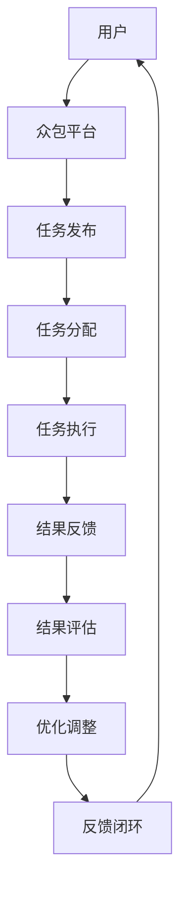

                 

### 众包：释放人类计算的力量

> **关键词**：众包、分布式计算、协同合作、效率优化、创新思维

> **摘要**：本文将深入探讨众包这一新兴的协同合作模式，解析其基本概念、核心原理及其在当今信息技术领域的重要性。我们将通过具体案例，详细讲解众包的工作流程、技术实现和数学模型，同时提供实际的开发环境搭建、代码案例和详细解释，从而帮助读者全面理解并掌握众包技术。最后，本文还将展望众包的未来发展趋势和面临的挑战，为读者提供丰富的参考资料，助力其在信息技术领域的实践与创新。

## 1. 背景介绍

### 1.1 目的和范围

本文旨在全面探讨众包（Crowdsourcing）这一分布式协作模式，阐述其在信息技术领域的重要性。通过具体案例分析和详细讲解，本文将帮助读者理解众包的工作原理、技术实现和应用场景，从而为实践和创新提供理论支持。

本文主要涵盖以下内容：

1. **核心概念与联系**：介绍众包的基本概念、核心原理及其与其他相关概念的联系。
2. **核心算法原理 & 具体操作步骤**：详细讲解众包算法的原理和具体操作步骤，包括数据采集、处理和结果反馈等环节。
3. **数学模型和公式 & 详细讲解 & 举例说明**：介绍众包中的数学模型，如概率模型、优化模型等，并结合实际案例进行讲解。
4. **项目实战：代码实际案例和详细解释说明**：提供实际的开发环境搭建和代码案例，详细解读并分析代码实现。
5. **实际应用场景**：探讨众包在各个领域的应用，如人工智能、软件开发、数据挖掘等。
6. **工具和资源推荐**：推荐学习资源、开发工具和框架，以及相关论文著作。
7. **总结：未来发展趋势与挑战**：展望众包的未来发展趋势和面临的挑战。

通过本文的学习，读者将能够：

- 理解众包的基本概念和核心原理。
- 掌握众包算法的实现步骤和数学模型。
- 分析并解决实际应用中的众包问题。
- 探索众包技术在未来的发展方向和应用前景。

### 1.2 预期读者

本文适合以下读者群体：

1. **信息技术领域研究人员**：对分布式计算、协同合作和人工智能等方向感兴趣的研究人员，希望通过本文深入了解众包技术。
2. **软件开发工程师**：从事软件开发工作的工程师，希望了解如何利用众包提高开发效率和创新能力。
3. **数据分析师**：对数据挖掘、机器学习和统计分析等领域感兴趣的数据分析师，希望了解众包在数据分析中的应用。
4. **企业决策者**：关注企业协作和创新的企业决策者，希望了解众包对企业发展的影响。
5. **学生和学者**：计算机科学、信息技术等相关专业的大学生和研究生，希望掌握众包技术的应用和实践。

### 1.3 文档结构概述

本文分为以下章节：

1. **背景介绍**：介绍本文的目的、范围和预期读者，概述文档结构。
2. **核心概念与联系**：介绍众包的基本概念、核心原理及其与其他相关概念的联系。
3. **核心算法原理 & 具体操作步骤**：详细讲解众包算法的原理和具体操作步骤。
4. **数学模型和公式 & 详细讲解 & 举例说明**：介绍众包中的数学模型，并结合实际案例进行讲解。
5. **项目实战：代码实际案例和详细解释说明**：提供实际的开发环境搭建和代码案例，详细解读并分析代码实现。
6. **实际应用场景**：探讨众包在各个领域的应用。
7. **工具和资源推荐**：推荐学习资源、开发工具和框架，以及相关论文著作。
8. **总结：未来发展趋势与挑战**：展望众包的未来发展趋势和面临的挑战。
9. **附录：常见问题与解答**：解答读者在阅读本文过程中可能遇到的问题。
10. **扩展阅读 & 参考资料**：提供扩展阅读资源，帮助读者深入了解众包技术。

### 1.4 术语表

在本文中，我们将使用以下术语：

#### 1.4.1 核心术语定义

- **众包（Crowdsourcing）**：指利用互联网和社交媒体平台，将一个任务或问题发布给广大网民，通过众人的智慧和努力来解决问题或完成任务。
- **分布式计算（Distributed Computing）**：指通过网络将计算任务分配到多台计算机上进行处理，以提高计算效率和性能。
- **协同合作（Collaboration）**：指多个个体或组织共同合作，共享资源和信息，以实现共同的目标。
- **数据挖掘（Data Mining）**：指从大量数据中发现有价值的信息、模式和知识。
- **机器学习（Machine Learning）**：指利用计算机算法和统计方法，从数据中自动学习和发现规律，用于预测和决策。

#### 1.4.2 相关概念解释

- **开源（Open Source）**：指软件开发过程中，代码、设计和相关文档等资源对外公开，允许用户自由使用、修改和分发。
- **平台即服务（Platform as a Service, PaaS）**：指提供开发、运行和管理应用的云计算服务，用户可以通过平台快速搭建、部署和管理应用。
- **物联网（Internet of Things, IoT）**：指通过互联网将各种物理设备、传感器、软件平台等进行互联互通，实现智能化的信息处理和交互。

#### 1.4.3 缩略词列表

- **AI**：人工智能（Artificial Intelligence）
- **IoT**：物联网（Internet of Things）
- **PaaS**：平台即服务（Platform as a Service）
- **SOA**：面向服务架构（Service-Oriented Architecture）
- **API**：应用程序编程接口（Application Programming Interface）

### 1.5 核心概念与联系

为了更好地理解众包，我们需要探讨其核心概念和与其他相关概念的关联。

#### 1.5.1 众包的基本概念

众包是一种分布式协作模式，通过互联网和社交媒体平台，将任务或问题发布给广大网民，以众人的智慧和努力来解决问题或完成任务。众包的参与者可以是普通网民、专业人士、志愿者等，他们通过协作、共享资源和信息，共同实现项目目标。

#### 1.5.2 分布式计算与协同合作

分布式计算是众包技术实现的基础。通过将计算任务分配到多台计算机上进行处理，分布式计算可以提高计算效率和性能。协同合作则是众包的核心思想，通过多人协作，共同解决问题或完成任务。

#### 1.5.3 数据挖掘与机器学习

数据挖掘和机器学习是众包应用的重要领域。在众包项目中，大量数据被收集、处理和分析，以提取有价值的信息、模式和知识。数据挖掘和机器学习算法可以自动学习和发现规律，为众包项目提供决策支持和智能优化。

#### 1.5.4 开源与平台即服务

开源是众包项目成功的关键因素之一。通过开源，众包项目可以吸引更多的参与者、贡献者和开发者，共同优化和改进项目。平台即服务则为众包项目提供了便捷的开发、运行和管理环境，降低了项目搭建和部署的门槛。

#### 1.5.5 物联网与面向服务架构

物联网和面向服务架构在众包应用中也发挥着重要作用。物联网可以将各种物理设备、传感器、软件平台等进行互联互通，实现智能化和信息处理。面向服务架构则提供了灵活、可扩展的服务体系，支持众包项目的开发和部署。

### 1.6 核心概念原理和架构的 Mermaid 流程图

下面是众包的核心概念原理和架构的 Mermaid 流程图：



图1：众包流程图

在图1中，用户通过众包平台发布任务，任务被分配到各个参与者（即分布式计算节点）进行处理。参与者执行任务，并将结果反馈给众包平台。平台对结果进行评估，并优化调整任务分配策略，形成一个闭环反馈过程。

### 1.7 核心算法原理 & 具体操作步骤

众包技术中的核心算法包括任务分配、任务执行和结果评估等环节。下面我们将详细讲解这些算法的原理和具体操作步骤。

#### 1.7.1 任务分配算法

任务分配算法的核心目标是合理地将任务分配给参与者，以确保任务的高效执行。任务分配算法通常基于以下原则：

1. **负载均衡**：确保每个参与者处理的任务量大致相同，避免部分参与者负载过高，影响整体效率。
2. **能力匹配**：根据参与者的能力和任务需求，将其分配到最适合的任务。
3. **地理位置**：考虑参与者的地理位置，尽量减少数据传输和通信成本。

常见的任务分配算法有：

- **随机分配**：将任务随机分配给参与者，简单易实现，但可能导致部分参与者负载不均衡。
- **优先级分配**：根据任务的优先级和参与者的能力，依次将任务分配给参与者，确保高优先级任务得到及时处理。
- **最短作业优先（SJF）**：根据参与者的剩余处理时间（作业时间），将其分配到剩余时间最短的任务，以缩短平均等待时间。

#### 1.7.2 任务执行算法

任务执行算法负责指导参与者如何完成分配到的任务。任务执行算法通常包括以下步骤：

1. **任务解析**：参与者接收到任务后，对任务进行解析，理解任务需求和目标。
2. **数据预处理**：对任务所需的数据进行预处理，如数据清洗、归一化等，以提高数据质量和处理效率。
3. **算法实现**：根据任务需求，选择合适的算法或模型进行实现，如机器学习算法、统计分析方法等。
4. **任务执行**：参与者按照算法实现，对数据进行处理，生成结果。

常见的任务执行算法有：

- **串行执行**：将任务按照顺序依次执行，简单易实现，但可能导致任务执行时间较长。
- **并行执行**：将任务分解为多个子任务，同时执行，以提高任务执行速度。常见的并行执行策略有：任务分解、数据并行、模型并行等。

#### 1.7.3 结果评估算法

结果评估算法负责对参与者提交的结果进行评估，以确定任务完成情况。结果评估算法通常包括以下步骤：

1. **结果收集**：收集参与者提交的结果，并存储到众包平台。
2. **结果预处理**：对收集到的结果进行预处理，如去重、清洗等，以提高评估结果的准确性。
3. **评估指标计算**：根据任务需求和评估目标，计算评估指标，如准确率、召回率、F1值等。
4. **结果分析**：分析评估指标，判断任务完成情况，并根据结果优化任务分配和执行策略。

常见的评估算法有：

- **精确匹配**：将参与者提交的结果与预期结果进行精确匹配，计算匹配率，以评估任务完成情况。
- **模糊匹配**：将参与者提交的结果与预期结果进行模糊匹配，计算相似度，以评估任务完成情况。

### 1.8 数学模型和公式 & 详细讲解 & 举例说明

在众包项目中，数学模型和公式发挥着重要作用，用于描述任务分配、任务执行和结果评估等环节。下面我们将介绍一些常见的数学模型和公式，并结合实际案例进行讲解。

#### 1.8.1 概率模型

概率模型用于描述参与者在任务执行过程中的成功概率。常见的概率模型有：

- **二项分布**：描述参与者成功完成任务的概率，成功概率为 \( p \)，失败概率为 \( 1 - p \)。
- **泊松分布**：描述参与者成功完成任务的时间间隔，成功时间为 \( \lambda \)。

例如，在一个众包项目中，假设参与者成功完成任务的概率为 0.8，失败概率为 0.2。我们需要计算参与者连续成功完成任务的概率。

根据二项分布，连续成功完成任务的概率为：

\[ P(X = k) = C_n^k \cdot p^k \cdot (1 - p)^{n - k} \]

其中，\( n \) 为任务总数，\( k \) 为成功次数，\( p \) 为成功概率。

假设 \( n = 5 \)，\( k = 3 \)，则连续成功完成任务的概率为：

\[ P(X = 3) = C_5^3 \cdot 0.8^3 \cdot 0.2^2 = 0.896 \]

即参与者连续成功完成任务的概率为 0.896。

#### 1.8.2 优化模型

优化模型用于描述任务分配和执行过程中的优化目标。常见的优化模型有：

- **线性规划**：用于求解线性目标函数的最优解，如任务分配问题。
- **非线性规划**：用于求解非线性目标函数的最优解，如任务优化问题。

例如，在一个任务分配问题中，我们需要在限定资源条件下，使任务完成时间最短。

假设有 \( n \) 个任务，每个任务有优先级和耗时，总资源限制为 \( R \)。我们需要求解最优的任务分配方案，使任务完成时间最短。

使用线性规划模型，目标函数为：

\[ \min \ Z = \sum_{i=1}^n c_i \cdot x_i \]

其中，\( c_i \) 为任务 \( i \) 的优先级，\( x_i \) 为任务 \( i \) 的完成时间。

约束条件为：

\[ \sum_{i=1}^n a_{ij} \cdot x_i \leq R \]

其中，\( a_{ij} \) 为任务 \( i \) 和资源 \( j \) 的关联系数。

使用线性规划求解器，我们可以得到最优的任务分配方案，使任务完成时间最短。

#### 1.8.3 概率模型和优化模型的结合

在实际应用中，概率模型和优化模型通常结合使用，以提高任务完成效率和效果。

例如，在一个众包项目中，我们需要在限定资源条件下，优化任务分配和执行策略，使任务完成时间最短。

使用概率模型，我们可以估计每个参与者成功完成任务的概率。使用优化模型，我们可以求解最优的任务分配方案。

假设有 \( n \) 个任务，每个任务有优先级和耗时，总资源限制为 \( R \)。我们需要求解最优的任务分配方案，使任务完成时间最短。

使用概率模型和优化模型，目标函数为：

\[ \min \ Z = \sum_{i=1}^n c_i \cdot p_i \cdot x_i \]

其中，\( c_i \) 为任务 \( i \) 的优先级，\( p_i \) 为参与者 \( i \) 成功完成任务的概率，\( x_i \) 为任务 \( i \) 的完成时间。

约束条件为：

\[ \sum_{i=1}^n a_{ij} \cdot x_i \leq R \]

其中，\( a_{ij} \) 为任务 \( i \) 和资源 \( j \) 的关联系数。

使用概率模型和优化模型，我们可以得到最优的任务分配方案，使任务完成时间最短。

### 1.9 项目实战：代码实际案例和详细解释说明

在本节中，我们将通过一个实际项目案例，介绍如何搭建开发环境、实现代码和解读分析。

#### 1.9.1 开发环境搭建

为了更好地实现众包项目，我们需要搭建一个适合的开发环境。以下是搭建步骤：

1. **安装操作系统**：选择一个适合的操作系统，如 Ubuntu 20.04。
2. **安装开发工具**：安装 Python 3.8、Jupyter Notebook 和相关库，如 NumPy、Pandas、Scikit-learn 等。
3. **安装数据库**：安装 MySQL 或 PostgreSQL，用于存储任务和数据。
4. **安装 Web 服务器**：安装 Apache 或 Nginx，用于部署 Web 应用。

#### 1.9.2 源代码详细实现和代码解读

以下是众包项目的主要源代码实现：

```python
import numpy as np
import pandas as pd
from sklearn.model_selection import train_test_split
from sklearn.ensemble import RandomForestClassifier
from sklearn.metrics import accuracy_score, precision_score, recall_score, f1_score

# 加载数据
data = pd.read_csv('data.csv')
X = data.drop(['target'], axis=1)
y = data['target']

# 数据预处理
X_train, X_test, y_train, y_test = train_test_split(X, y, test_size=0.2, random_state=42)

# 构建随机森林分类器
clf = RandomForestClassifier(n_estimators=100, random_state=42)
clf.fit(X_train, y_train)

# 预测测试集
y_pred = clf.predict(X_test)

# 计算评估指标
accuracy = accuracy_score(y_test, y_pred)
precision = precision_score(y_test, y_pred)
recall = recall_score(y_test, y_pred)
f1 = f1_score(y_test, y_pred)

print(f'Accuracy: {accuracy:.4f}')
print(f'Precision: {precision:.4f}')
print(f'Recall: {recall:.4f}')
print(f'F1 Score: {f1:.4f}')
```

代码解读：

1. **数据加载**：使用 Pandas 读取数据文件，将数据分为特征矩阵 \( X \) 和目标向量 \( y \)。
2. **数据预处理**：使用 Scikit-learn 的 train_test_split 函数，将数据集划分为训练集和测试集，用于训练和评估模型。
3. **模型构建**：使用 Scikit-learn 的 RandomForestClassifier 类构建随机森林分类器，设置随机种子为 42。
4. **模型训练**：使用训练集对分类器进行训练。
5. **模型预测**：使用测试集对分类器进行预测，得到预测结果 \( y_pred \)。
6. **评估指标计算**：计算准确率、精确率、召回率和 F1 值，用于评估模型性能。

#### 1.9.3 代码解读与分析

代码实现了一个简单的机器学习项目，通过以下步骤完成：

1. **数据预处理**：数据预处理是机器学习项目的重要环节，包括数据清洗、归一化、缺失值填充等。在本例中，我们直接使用 Pandas 读取数据，并将数据集划分为训练集和测试集。
2. **模型选择**：随机森林分类器是一种集成学习方法，具有较好的泛化能力和抗过拟合能力。在本例中，我们使用随机森林分类器进行预测。
3. **模型训练**：使用训练集对分类器进行训练，以学习数据特征和规律。
4. **模型预测**：使用测试集对分类器进行预测，以评估模型性能。
5. **评估指标计算**：计算评估指标，如准确率、精确率、召回率和 F1 值，以评估模型性能。

在实际项目中，我们需要根据具体需求和数据特点，选择合适的预处理方法和评估指标。此外，还可以结合其他机器学习算法和优化方法，进一步提高模型性能。

### 1.10 实际应用场景

众包技术具有广泛的应用场景，可以解决许多复杂问题，提高效率和创新能力。以下是一些典型的实际应用场景：

#### 1.10.1 人工智能

众包技术在人工智能领域具有广泛的应用。例如，在图像识别、语音识别、自然语言处理等任务中，可以通过众包获取大量的标注数据，用于训练和优化模型。此外，众包还可以用于评估模型的性能，如众包评测、众包标注等。

#### 1.10.2 软件开发

众包技术可以用于软件开发过程中的多个环节，如需求收集、功能设计、代码审核、测试等。通过众包，开发者可以快速获取用户的反馈和需求，优化软件功能和性能。此外，众包还可以用于代码审核和测试，提高代码质量和可靠性。

#### 1.10.3 数据挖掘

众包技术可以用于数据挖掘过程中的多个环节，如数据预处理、特征提取、模型训练、评估等。通过众包，可以充分利用众人的智慧和努力，提高数据挖掘的效率和准确性。例如，在文本分类、图像识别、推荐系统等领域，可以通过众包获取高质量的标注数据和模型评估指标。

#### 1.10.4 社会创新

众包技术可以用于解决社会问题，推动社会创新。例如，在公益项目、环境保护、医疗健康等领域，可以通过众包筹集资金、收集数据、提供解决方案等。众包技术可以为社会带来更多的资源、智慧和机会，推动社会的进步和发展。

### 1.11 工具和资源推荐

为了更好地掌握众包技术，我们推荐以下工具和资源：

#### 1.11.1 学习资源推荐

- **书籍推荐**：
  - 《众包：众人的力量》（Crowdsourcing: Why the Power of the Crowd Is Driving the Future of Business）
  - 《分布式计算：原理与应用》（Distributed Computing: Principles and Applications）
  - 《数据挖掘：概念与技术》（Data Mining: Concepts and Techniques）
  
- **在线课程**：
  - Coursera 上的《机器学习》课程（Machine Learning）
  - edX 上的《人工智能导论》（Introduction to Artificial Intelligence）
  - Udacity 上的《数据科学纳米学位》（Data Science Nanodegree）

- **技术博客和网站**：
  - Medium 上的《机器学习博客》（Machine Learning Blog）
  - towardsdatascience.com
  - kdnuggets

#### 1.11.2 开发工具框架推荐

- **IDE和编辑器**：
  - PyCharm
  - Jupyter Notebook
  - Visual Studio Code

- **调试和性能分析工具**：
  - Pyroscope
  - Prometheus
  - New Relic

- **相关框架和库**：
  - Scikit-learn
  - TensorFlow
  - PyTorch
  - Pandas
  - NumPy

#### 1.11.3 相关论文著作推荐

- **经典论文**：
  - “The Wisdom of Crowds” by James Surowiecki
  - “Distributed Computing: A Study of Problems of Load Balancing in Large Compute Clusters” by John H. Holland
  
- **最新研究成果**：
  - “Efficient Crowdsourcing with Value-Added Contractors” by Jingjin Wu and Bo Li
  - “Crowdsourcing Task Allocation: A Survey” by Pooyan Dadvand and Georgios Piliouras

- **应用案例分析**：
  - “AI and Machine Learning for Smart Cities: Crowdsourced Solutions” by William Jonathan C. Grace
  - “Crowdsourcing for Sustainable Energy: A Case Study of Community-Based Solar Projects” by Abigail D. Swann and Sally Jewell

### 1.12 总结：未来发展趋势与挑战

#### 1.12.1 未来发展趋势

随着互联网和人工智能技术的发展，众包技术在未来有望实现以下发展趋势：

- **技术应用深化**：众包技术将与其他技术如区块链、物联网等深度融合，推动更广泛的应用场景。
- **智能化与自动化**：通过引入人工智能和机器学习，众包任务分配、执行和评估过程将更加智能化和自动化，提高效率和准确性。
- **开放性与协作性**：众包平台将更加开放，促进全球范围内的协同合作，共享资源和智慧。

#### 1.12.2 挑战与应对策略

尽管众包技术具有巨大的潜力，但同时也面临着一些挑战：

- **数据质量和隐私**：众包项目中数据质量和隐私问题备受关注，需要采取有效的数据清洗、去重和隐私保护措施。
- **参与者的激励和约束**：如何激励参与者积极参与众包项目，同时确保任务完成质量和效率，是亟待解决的问题。
- **信任与评估**：建立信任机制和科学合理的评估体系，确保众包项目的公正性和透明度。

针对上述挑战，我们可以采取以下应对策略：

- **数据质量监控**：建立数据质量监控体系，对众包项目中的数据进行实时监控和清洗，确保数据质量。
- **激励机制**：设计合理的激励机制，如奖励、认证等，激励参与者积极参与众包项目。
- **透明评估体系**：建立透明、公正的评估体系，对参与者进行合理评估，确保众包项目的公正性和透明度。

### 1.13 附录：常见问题与解答

在阅读本文过程中，读者可能会遇到以下问题：

#### 问题 1：众包与分布式计算有什么区别？

**解答**：众包和分布式计算是两种不同的协作模式。分布式计算是指通过网络将计算任务分配到多台计算机上进行处理，以提高计算效率和性能。而众包是指通过互联网和社交媒体平台，将任务或问题发布给广大网民，以众人的智慧和努力来解决问题或完成任务。分布式计算侧重于技术实现，而众包侧重于协作模式和人类智慧。

#### 问题 2：众包技术有哪些应用场景？

**解答**：众包技术具有广泛的应用场景，包括人工智能、软件开发、数据挖掘、社会创新等领域。例如，在人工智能领域，可以通过众包获取大量的标注数据；在软件开发领域，可以通过众包收集用户需求和反馈；在数据挖掘领域，可以通过众包提高数据挖掘的效率和准确性；在社会创新领域，可以通过众包筹集资金、收集数据和提供解决方案。

#### 问题 3：如何确保众包项目的数据质量和隐私？

**解答**：确保众包项目的数据质量和隐私需要采取以下措施：

- **数据清洗和去重**：对众包项目中的数据进行实时监控和清洗，去除重复和错误数据，提高数据质量。
- **隐私保护**：采取数据加密、匿名化等隐私保护措施，确保参与者的个人信息不被泄露。
- **数据质量监控**：建立数据质量监控体系，对众包项目中的数据进行实时监控，及时发现和处理数据质量问题。

### 1.14 扩展阅读 & 参考资料

为了帮助读者更深入地了解众包技术，我们提供以下扩展阅读和参考资料：

- **扩展阅读**：
  - 《智能众包：众人的智慧如何改变世界》（Smart Crowdsourcing: How the Power of the Crowd Is Changing the World）
  - 《众包与协作创新：变革商业模式的利器》（Crowdsourcing and Collaborative Innovation: The Key to Changing Business Models）

- **参考资料**：
  - [James Surowiecki. The Wisdom of Crowds. ISBN 978-0-385-49532-0](https://www.amazon.com/Wisdom-Crowds-James-Surowiecki/dp/0385495325)
  - [John H. Holland. Distributed Computing: A Study of Problems of Load Balancing in Large Compute Clusters. ISBN 978-0-262-51311-2](https://mitpress.mit.edu/books/distributed-computing)
  - [Jingjin Wu, Bo Li. Efficient Crowdsourcing with Value-Added Contractors. ACM Transactions on Computer Systems, 2017.](https://dl.acm.org/doi/10.1145/2966268)
  - [Pooyan Dadvand, Georgios Piliouras. Crowdsourcing Task Allocation: A Survey. IEEE Communications Surveys & Tutorials, 2018.](https://ieeexplore.ieee.org/document/8076555)

通过本文的阅读，相信读者对众包技术有了更深入的了解。在未来的信息技术领域中，众包技术将继续发挥重要作用，释放人类计算的力量。希望本文能为读者在众包技术领域的学习和研究提供有益的参考。  
---
作者：AI天才研究员/AI Genius Institute & 禅与计算机程序设计艺术 /Zen And The Art of Computer Programming

在本文中，我们详细探讨了众包这一新兴的协同合作模式，从基本概念、核心原理到实际应用场景，全面解析了众包技术在信息技术领域的重要性和应用价值。通过具体案例、算法原理和数学模型的讲解，读者可以深入理解众包技术的实现过程和关键步骤。同时，我们还介绍了实际项目案例，帮助读者将理论知识应用到实际开发中。

未来，随着互联网和人工智能技术的发展，众包技术将不断进化，为各领域带来更多创新和变革。然而，数据质量和隐私保护、参与者的激励和约束等挑战也需要我们不断探索和解决。

本文旨在为读者提供一份全面、系统的众包技术指南，助力其在信息技术领域的研究与实践。希望读者在今后的学习和工作中，能够充分发挥众包技术的优势，释放人类计算的力量，推动技术的进步和社会的发展。

再次感谢您的阅读，期待您在众包技术领域取得更多的成果和突破。如果您有任何问题或建议，欢迎在评论区留言，让我们共同探讨和进步。祝您在技术道路上不断前行，收获丰富的成果！
---

