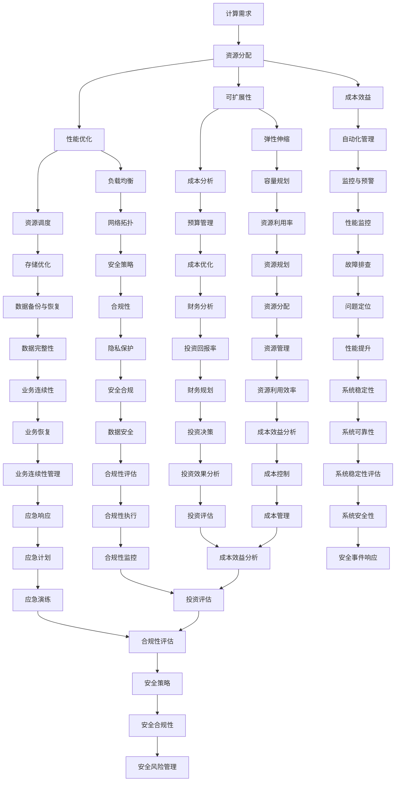

                 

# 优化计算基础设施的策略

> 关键词：计算基础设施、性能优化、资源管理、可扩展性、成本效益、人工智能

> 摘要：本文将深入探讨优化计算基础设施的策略，包括核心概念、算法原理、数学模型、实战案例和实际应用场景。通过逐步分析，帮助读者理解如何通过系统化的方法提高计算性能、降低成本，并确保基础设施的可持续性。

## 1. 背景介绍

### 1.1 目的和范围

本文旨在为IT从业者和决策者提供优化计算基础设施的策略和最佳实践。本文将涵盖以下主题：

1. 计算基础设施的核心概念和架构
2. 性能优化和资源管理的算法原理
3. 数学模型和公式的应用
4. 代码实现和案例分析
5. 实际应用场景和工具推荐

### 1.2 预期读者

- IT项目经理和架构师
- 系统管理员和网络工程师
- 数据科学家和人工智能开发者
- 决策者和投资方

### 1.3 文档结构概述

本文结构如下：

1. 背景介绍
2. 核心概念与联系
3. 核心算法原理 & 具体操作步骤
4. 数学模型和公式 & 详细讲解 & 举例说明
5. 项目实战：代码实际案例和详细解释说明
6. 实际应用场景
7. 工具和资源推荐
8. 总结：未来发展趋势与挑战
9. 附录：常见问题与解答
10. 扩展阅读 & 参考资料

### 1.4 术语表

#### 1.4.1 核心术语定义

- **计算基础设施**：用于支持应用程序和数据处理的硬件、软件和网络资源。
- **性能优化**：通过调整和优化系统组件以提高计算效率和速度。
- **资源管理**：合理分配和调度计算资源，以最大化性能和最小化成本。
- **可扩展性**：系统能够根据需求动态调整资源，以支持不断增长的工作负载。
- **成本效益**：在预算限制内实现最大化的业务价值。

#### 1.4.2 相关概念解释

- **计算密集型应用**：需要大量计算资源的应用程序，如科学计算和大规模数据分析。
- **IaaS、PaaS和SaaS**：云计算服务的三种主要模型，分别代表基础设施即服务、平台即服务和软件即服务。
- **负载均衡**：分配网络流量，以避免任何单一服务器过载。
- **容器化**：将应用程序及其依赖打包在隔离的环境中，以实现高效部署和资源管理。

#### 1.4.3 缩略词列表

- **IaaS**：基础设施即服务
- **PaaS**：平台即服务
- **SaaS**：软件即服务
- **CPU**：中央处理器
- **GPU**：图形处理器
- **Docker**：容器化技术

## 2. 核心概念与联系

计算基础设施的优化涉及多个核心概念和它们的相互联系。为了更好地理解这些概念，我们可以使用以下Mermaid流程图来展示它们的架构：



### 2.1 计算需求与资源分配

计算需求是计算基础设施优化过程中的起点。了解应用程序的具体需求，包括计算、存储和网络带宽，是合理分配资源的关键。资源分配涉及以下步骤：

1. **需求分析**：确定应用程序所需的计算资源。
2. **资源池配置**：根据需求为应用程序创建资源池。
3. **自动化部署**：利用自动化工具快速部署资源。

### 2.2 性能优化与成本效益

性能优化和成本效益是相辅相成的。通过以下方法实现两者之间的平衡：

1. **性能监控**：持续监控系统性能，识别瓶颈。
2. **资源调度**：根据性能监控结果动态调整资源。
3. **成本分析**：分析资源使用成本，优化成本结构。

### 2.3 可扩展性与弹性伸缩

可扩展性确保系统可以应对不断增长的工作负载。弹性伸缩是实现可扩展性的关键：

1. **水平扩展**：通过增加服务器数量提高计算能力。
2. **垂直扩展**：通过增加单个服务器的处理能力提高计算能力。
3. **自动化弹性伸缩**：利用自动化工具实现动态资源调整。

### 2.4 负载均衡与资源调度

负载均衡是确保系统高效运行的重要手段。资源调度则是确保资源充分利用的策略：

1. **负载均衡策略**：根据网络流量和系统负载分配请求。
2. **资源调度算法**：根据系统状态和性能需求分配资源。

### 2.5 安全策略与数据备份

安全策略和数据备份是计算基础设施的基石：

1. **安全策略**：制定并执行安全策略，确保系统安全。
2. **数据备份**：定期备份数据，确保数据安全。

### 2.6 监控与预警

监控和预警是确保系统稳定运行的关键：

1. **性能监控**：实时监控系统性能指标。
2. **预警机制**：设置阈值，当指标超过阈值时触发警报。

### 2.7 容量规划与预算管理

容量规划和预算管理是确保系统可持续发展的关键：

1. **容量规划**：预测未来需求，规划资源。
2. **预算管理**：控制成本，确保资源合理使用。

## 3. 核心算法原理 & 具体操作步骤

优化计算基础设施涉及多个算法原理，以下将详细讲解这些算法的原理和具体操作步骤。

### 3.1 性能优化算法

性能优化算法的核心目标是提高系统性能。以下是一个简单的性能优化算法原理和操作步骤：

#### 算法原理：

- **负载均衡**：通过分配请求到不同的服务器，避免单一服务器过载。
- **缓存策略**：使用缓存减少数据库查询次数。
- **数据库优化**：索引优化、查询优化、存储优化。

#### 具体操作步骤：

1. **监控系统性能**：使用监控工具收集系统性能指标，如CPU利用率、内存使用率、磁盘I/O等。
2. **识别瓶颈**：分析性能监控数据，识别系统瓶颈。
3. **优化配置**：调整系统配置，如增加服务器数量、调整缓存策略、优化数据库查询。
4. **重复步骤1-3**：持续监控和优化系统性能。

### 3.2 资源调度算法

资源调度算法的目标是确保系统资源得到充分利用。以下是一个简单的资源调度算法原理和操作步骤：

#### 算法原理：

- **基于优先级的调度**：根据任务的优先级分配资源。
- **基于负载的调度**：根据系统的当前负载分配资源。
- **动态调度**：根据系统状态和任务需求动态调整资源分配。

#### 具体操作步骤：

1. **定义任务队列**：将系统中的任务按优先级排序，形成任务队列。
2. **监控系统负载**：收集系统负载数据，如CPU利用率、内存使用率等。
3. **调度任务**：根据系统负载和任务优先级，将任务分配到空闲资源上。
4. **动态调整**：根据系统状态和任务需求，动态调整资源分配。

### 3.3 可扩展性和弹性伸缩算法

可扩展性和弹性伸缩算法的目标是确保系统可以应对不断变化的工作负载。以下是一个简单的可扩展性和弹性伸缩算法原理和操作步骤：

#### 算法原理：

- **水平扩展**：通过增加服务器数量提高计算能力。
- **垂直扩展**：通过增加单个服务器的处理能力提高计算能力。
- **自动化弹性伸缩**：利用自动化工具实现动态资源调整。

#### 具体操作步骤：

1. **容量规划**：预测未来需求，规划资源。
2. **监控系统负载**：收集系统负载数据，如CPU利用率、内存使用率等。
3. **触发条件**：设置触发条件，如CPU利用率超过90%。
4. **资源调整**：根据触发条件，动态调整资源，如增加服务器数量或升级硬件。

### 3.4 负载均衡算法

负载均衡算法的目标是确保系统中的请求得到公平处理。以下是一个简单的负载均衡算法原理和操作步骤：

#### 算法原理：

- **轮询调度**：将请求依次分配到不同的服务器。
- **最小连接数调度**：将请求分配到连接数最少的服务器。
- **哈希调度**：将请求通过哈希算法分配到服务器。

#### 具体操作步骤：

1. **定义负载均衡器**：创建负载均衡器，如Nginx、HAProxy等。
2. **配置调度策略**：根据需求选择调度策略，如轮询调度、最小连接数调度等。
3. **监控系统负载**：收集系统负载数据，如CPU利用率、内存使用率等。
4. **分配请求**：根据调度策略，将请求分配到服务器。

### 3.5 安全策略和数据备份算法

安全策略和数据备份算法的目标是确保系统安全和数据完整。以下是一个简单的安全策略和数据备份算法原理和操作步骤：

#### 算法原理：

- **防火墙**：防止未经授权的访问。
- **入侵检测系统**：实时监控系统活动，检测潜在威胁。
- **数据备份**：定期备份数据，确保数据安全。

#### 具体操作步骤：

1. **配置防火墙**：设置防火墙规则，阻止未经授权的访问。
2. **安装入侵检测系统**：部署入侵检测系统，实时监控系统活动。
3. **配置备份策略**：设置数据备份计划，如每日备份、每周备份等。
4. **备份存储**：选择合适的备份存储方案，如本地存储、云存储等。

## 4. 数学模型和公式 & 详细讲解 & 举例说明

在计算基础设施优化过程中，数学模型和公式起着至关重要的作用。以下将介绍一些常用的数学模型和公式，并详细讲解它们的含义和计算方法。

### 4.1 平均响应时间

平均响应时间是一个衡量系统性能的重要指标。它表示系统处理一个请求所需的时间。计算公式如下：

\[ \text{平均响应时间} = \frac{\sum_{i=1}^{n} t_i}{n} \]

其中，\( t_i \) 表示第 \( i \) 个请求的处理时间，\( n \) 表示请求的总数。

#### 举例说明：

假设系统处理了 5 个请求，处理时间分别为 2s、3s、4s、5s 和 6s。则平均响应时间为：

\[ \text{平均响应时间} = \frac{2+3+4+5+6}{5} = 4 \text{s} \]

### 4.2 负载均衡权重

负载均衡权重用于确定每个服务器的处理能力。它可以帮助分配请求，确保系统资源得到充分利用。计算公式如下：

\[ w_i = \frac{C_i}{\sum_{j=1}^{m} C_j} \]

其中，\( w_i \) 表示第 \( i \) 个服务器的权重，\( C_i \) 表示第 \( i \) 个服务器的计算能力，\( C_j \) 表示第 \( j \) 个服务器的计算能力，\( m \) 表示服务器的总数。

#### 举例说明：

假设有 3 个服务器，计算能力分别为 1000、1500 和 2000。则每个服务器的权重为：

\[ w_1 = \frac{1000}{1000+1500+2000} = 0.2 \]
\[ w_2 = \frac{1500}{1000+1500+2000} = 0.3 \]
\[ w_3 = \frac{2000}{1000+1500+2000} = 0.5 \]

### 4.3 可扩展性比例

可扩展性比例用于衡量系统在增加资源时的性能提升。它可以帮助评估系统的扩展性。计算公式如下：

\[ \text{可扩展性比例} = \frac{P_{\text{扩展后}}}{P_{\text{扩展前}}} \]

其中，\( P_{\text{扩展后}} \) 表示扩展后的系统性能，\( P_{\text{扩展前}} \) 表示扩展前的系统性能。

#### 举例说明：

假设系统在扩展前处理能力为 1000 requests/second，扩展后为 2000 requests/second。则可扩展性比例为：

\[ \text{可扩展性比例} = \frac{2000}{1000} = 2 \]

### 4.4 成本效益比

成本效益比用于衡量系统性能提升与成本增加之间的关系。它可以帮助评估系统的成本效益。计算公式如下：

\[ \text{成本效益比} = \frac{\text{性能提升}}{\text{成本增加}} \]

#### 举例说明：

假设系统在扩展前后，处理能力分别为 1000 requests/second 和 2000 requests/second，成本增加为 10000 元。则成本效益比为：

\[ \text{成本效益比} = \frac{2000-1000}{10000} = 0.1 \]

### 4.5 负载均衡权重调整

负载均衡权重调整用于根据系统负载动态调整服务器的权重。它可以帮助提高系统的负载均衡效果。计算公式如下：

\[ w_i(\text{新}) = w_i(\text{旧}) + \Delta w_i \]

其中，\( w_i(\text{新}) \) 表示第 \( i \) 个服务器的调整后权重，\( w_i(\text{旧}) \) 表示第 \( i \) 个服务器的调整前权重，\( \Delta w_i \) 表示第 \( i \) 个服务器的权重调整量。

#### 举例说明：

假设服务器1的权重调整量为 0.1，服务器2的权重调整量为 -0.1，其他服务器的权重不变。则新的权重分配为：

\[ w_1(\text{新}) = w_1(\text{旧}) + 0.1 = 0.2 + 0.1 = 0.3 \]
\[ w_2(\text{新}) = w_2(\text{旧}) - 0.1 = 0.3 - 0.1 = 0.2 \]
\[ w_3(\text{新}) = w_3(\text{旧}) = 0.5 \]

## 5. 项目实战：代码实际案例和详细解释说明

### 5.1 开发环境搭建

为了演示计算基础设施优化的实战案例，我们将使用一个简单的Web应用程序。以下是在Ubuntu 20.04服务器上搭建开发环境的过程：

1. 安装Nginx：

   ```shell
   sudo apt update
   sudo apt install nginx
   ```

2. 安装Python 3和Pip：

   ```shell
   sudo apt install python3 python3-pip
   ```

3. 安装Flask框架：

   ```shell
   pip3 install flask
   ```

4. 创建一个简单的Flask应用程序：

   ```python
   # app.py
   from flask import Flask
   app = Flask(__name__)

   @app.route('/')
   def hello():
       return 'Hello, World!'

   if __name__ == '__main__':
       app.run(host='0.0.0.0', port=80)
   ```

### 5.2 源代码详细实现和代码解读

以下是Web应用程序的源代码和详细解读：

#### 5.2.1 源代码

```python
# app.py
from flask import Flask
app = Flask(__name__)

@app.route('/')
def hello():
    return 'Hello, World!'

if __name__ == '__main__':
    app.run(host='0.0.0.0', port=80)
```

#### 5.2.2 代码解读

1. **导入Flask库**：首先，从 `flask` 库中导入 `Flask` 类，用于创建Web应用程序。
2. **创建Flask应用程序**：使用 `Flask(__name__)` 创建一个名为 `app` 的Flask应用程序实例。
3. **定义路由**：使用 `@app.route('/')` 装饰器定义一个名为 `hello` 的函数，该函数处理 `/` 路径的请求，并返回字符串 `'Hello, World!'`。
4. **运行应用程序**：在 `if __name__ == '__main__':` 语句中，调用 `app.run()` 方法运行应用程序。参数 `host='0.0.0.0'` 表示应用程序监听所有网络接口，`port=80` 表示监听80端口。

### 5.3 代码解读与分析

该Web应用程序的核心功能是处理HTTP请求并返回固定的字符串 `'Hello, World!'`。以下是代码的详细解读和分析：

1. **Flask应用程序架构**：Flask应用程序由一个主模块组成，该模块导入Flask库并创建应用程序实例。应用程序实例负责处理请求和返回响应。
2. **路由和视图函数**：使用 `@app.route('/')` 装饰器定义路由。当请求路径为 `/` 时，调用相应的视图函数 `hello()`。视图函数是处理HTTP请求的核心部分，它接收请求参数并返回响应。
3. **请求处理和响应**：视图函数 `hello()` 接收一个请求对象（在本例中为 `None`），并返回一个字符串 `'Hello, World!'`。Flask应用程序将这个字符串作为HTTP响应返回给客户端。
4. **应用程序运行**：`app.run()` 方法启动Web服务器，并监听指定的主机和端口。在本地开发环境中，通常使用 `host='0.0.0.0'` 和 `port=80` 参数。

### 5.4 性能优化与扩展性

为了优化和扩展该Web应用程序，我们可以采取以下措施：

1. **水平扩展**：通过在多个服务器上部署应用程序，实现水平扩展。使用负载均衡器（如Nginx）将请求分配到不同的服务器，确保系统的高可用性和负载均衡。
2. **垂直扩展**：增加单个服务器的处理能力，如增加CPU、内存和磁盘I/O。这可以通过升级硬件或使用更强大的云服务器来实现。
3. **缓存策略**：使用缓存策略减少数据库查询次数，提高系统性能。可以使用Memcached或Redis等缓存服务器。
4. **数据库优化**：对数据库进行索引优化、查询优化和存储优化，提高数据访问速度。
5. **静态资源压缩**：对静态资源（如JavaScript、CSS和图片）进行压缩，减少传输数据量，提高页面加载速度。

### 5.5 成本效益分析

为了确保成本效益，我们需要在性能优化和扩展性方面做出明智的决策。以下是一些成本效益分析的关键点：

1. **水平扩展**：购买多台服务器和负载均衡器会增加初始成本，但可以降低每台服务器的维护成本，提高系统的可用性和性能。
2. **垂直扩展**：升级硬件的成本较高，但可以提高单个服务器的处理能力，减少服务器的数量，从而降低长期成本。
3. **缓存策略**：使用缓存策略可以减少数据库查询次数，降低数据库服务器的负载，延长其使用寿命，降低维护成本。
4. **数据库优化**：对数据库进行优化可以提高数据访问速度，减少数据库服务器的负载，降低维护成本。
5. **静态资源压缩**：减少传输数据量可以提高页面加载速度，降低带宽成本。

通过综合考虑性能、扩展性和成本，我们可以选择合适的优化和扩展策略，确保计算基础设施的高效、可靠和可持续性。

## 6. 实际应用场景

计算基础设施的优化不仅在Web应用程序中发挥作用，还可以在多种实际应用场景中提高系统的性能和可靠性。以下是一些典型的应用场景：

### 6.1 云计算平台

云计算平台需要优化计算资源分配、负载均衡和弹性伸缩，以确保用户可以随时访问高性能的服务。优化策略包括：

- **资源调度**：根据用户需求和系统负载动态调整资源分配，确保用户获得最佳体验。
- **负载均衡**：使用负载均衡器将流量分配到不同的服务器，避免单点故障。
- **弹性伸缩**：根据实时负载动态调整服务器数量，确保系统在高并发情况下仍能稳定运行。

### 6.2 大数据分析

大数据分析任务通常需要大量的计算资源和存储空间。优化策略包括：

- **分布式计算**：使用分布式计算框架（如Hadoop或Spark）将任务分解为多个小任务并行处理，提高计算效率。
- **数据缓存**：使用数据缓存技术（如Redis或Memcached）减少数据访问延迟，提高数据处理速度。
- **存储优化**：使用分布式存储系统（如HDFS或Cassandra）提高数据存储和访问性能。

### 6.3 虚拟化环境

虚拟化环境需要优化资源利用率和性能，以实现高效的资源管理。优化策略包括：

- **动态资源分配**：根据虚拟机的负载动态调整资源分配，确保虚拟机获得最佳性能。
- **存储优化**：使用快照和精简配置技术减少存储空间占用，提高存储效率。
- **网络优化**：优化虚拟机之间的网络连接，确保数据传输速度和稳定性。

### 6.4 实时监控和预警

实时监控和预警系统需要优化性能和可靠性，以确保系统在出现异常时能够及时响应。优化策略包括：

- **分布式监控**：使用分布式监控工具（如Zabbix或Prometheus）收集系统性能数据，确保监控的全面性和实时性。
- **预警策略**：根据监控数据设置合理的预警阈值，确保在系统出现异常时能够及时触发警报。
- **自动化响应**：使用自动化工具（如Ansible或Python脚本）自动响应预警，执行故障排查和恢复操作。

### 6.5 游戏服务器

游戏服务器需要优化网络延迟和吞吐量，以提高玩家的游戏体验。优化策略包括：

- **负载均衡**：使用负载均衡器将游戏请求分配到不同的服务器，确保网络延迟最低。
- **网络优化**：优化游戏服务器的网络配置，确保数据包传输速度和稳定性。
- **缓存策略**：使用游戏数据缓存（如Redis或Memcached）减少服务器负载，提高数据处理速度。

通过在以上实际应用场景中应用优化策略，我们可以显著提高计算基础设施的性能、可靠性和可持续性，满足不断增长的业务需求。

## 7. 工具和资源推荐

优化计算基础设施不仅需要深入的技术知识，还需要合适的工具和资源来辅助实施。以下是一些推荐的学习资源、开发工具和框架，以及相关的论文和研究报告。

### 7.1 学习资源推荐

#### 7.1.1 书籍推荐

- **《深入理解计算机系统》（Deep Learning Systems》**
- **《大数据处理：从入门到实践》（Big Data: A Practical Guide for Developers and Architects）**
- **《系统性能优化：实战策略与案例分析》（Systems Performance Optimization: Strategies and Case Studies）**

#### 7.1.2 在线课程

- **Coursera上的《大数据处理与优化》课程**
- **edX上的《云计算基础》课程**
- **Udacity上的《服务器性能优化》课程**

#### 7.1.3 技术博客和网站

- **Medium上的Data Engineering博客**
- **DevOps.com**
- **InfoQ**

### 7.2 开发工具框架推荐

#### 7.2.1 IDE和编辑器

- **Visual Studio Code**：强大的开源编辑器，支持多种编程语言。
- **IntelliJ IDEA**：专业的Java和Python开发工具。

#### 7.2.2 调试和性能分析工具

- **GDB**：开源的调试工具，适用于C/C++程序。
- **JProfiler**：Java应用程序的性能分析工具。
- **Wireshark**：网络协议分析工具。

#### 7.2.3 相关框架和库

- **Flask**：Python的轻量级Web框架。
- **Docker**：容器化技术，用于应用部署和资源管理。
- **Kubernetes**：容器编排和管理工具。

### 7.3 相关论文著作推荐

#### 7.3.1 经典论文

- **"The Art of Computer Programming" by Donald E. Knuth**：计算机编程的权威著作。
- **"Bigtable: A Distributed Storage System for Structured Data" by Sanjay Ghemawat, Howard Gobioff, and Shun-Tak Leung**：关于分布式存储系统的论文。

#### 7.3.2 最新研究成果

- **"Designing Data-Intensive Applications" by Martin Kleppmann**：关于大数据应用的最新研究。
- **"Distributed Systems: Concepts and Design" by George Coulouris, Jean Dollimore, Tim Kindberg, and Gordon Blair**：关于分布式系统的最新研究。

#### 7.3.3 应用案例分析

- **"Apache Kafka: A Distributed Streaming Platform" by Jay Kreps, Neha Narkhede, and Jay Vandehey**：Kafka的分布式流处理平台的应用案例分析。
- **"The Netflix Engineering Culture" by Netflix Engineering & Eisner Award Winning Team**：Netflix的工程文化和架构优化案例。

通过这些工具和资源，读者可以深入了解计算基础设施的优化策略，并将其应用于实际项目中。

## 8. 总结：未来发展趋势与挑战

随着技术的不断进步和业务需求的日益增长，计算基础设施的优化面临着前所未有的机遇和挑战。以下是一些未来发展趋势和潜在挑战：

### 8.1 发展趋势

1. **云计算和边缘计算**：随着云计算技术的成熟和边缘计算的兴起，计算基础设施将变得更加分布式和灵活。这将为优化提供更多的机会，同时也带来了新的挑战，如数据安全和隐私保护。

2. **人工智能与机器学习**：人工智能和机器学习技术的发展将推动计算基础设施的智能化。通过使用AI算法优化资源分配、性能监控和故障预测，可以提高系统的效率和可靠性。

3. **可持续性**：随着环保意识的增强，计算基础设施的可持续性变得越来越重要。优化策略将更多地关注能源消耗和碳排放，以实现绿色计算。

4. **容器化和微服务架构**：容器化和微服务架构的普及将使计算基础设施更加模块化和可扩展。这有助于简化部署和管理，提高系统的灵活性和响应速度。

### 8.2 挑战

1. **数据安全和隐私**：随着数据量的增加，数据安全和隐私保护变得越来越重要。如何在优化计算基础设施的同时保护数据安全和隐私，将成为一个重要挑战。

2. **复杂性**：随着技术的复杂度增加，管理和优化计算基础设施的难度也在增加。如何简化基础设施的管理和运维，降低复杂度，是一个重要的挑战。

3. **成本控制**：在资源有限的情况下，如何实现成本效益最大化，同时满足性能和可扩展性要求，是一个持续的挑战。

4. **技能短缺**：随着技术的快速变化，IT行业面临着技能短缺的问题。如何培养和吸引优秀的技术人才，以应对不断变化的挑战，是一个重要的问题。

### 8.3 应对策略

1. **持续学习**：随着技术的快速进步，持续学习和培训是保持竞争力的关键。通过参加在线课程、阅读技术书籍和参与技术社区，可以不断提高自己的技能。

2. **自动化**：自动化工具可以简化基础设施的管理和优化过程。通过使用自动化脚本和工具，可以降低管理复杂度，提高效率。

3. **敏捷开发和DevOps**：敏捷开发和DevOps实践可以帮助团队快速响应变化，实现持续集成和持续交付。这有助于降低风险，提高系统的可靠性和可扩展性。

4. **可持续性**：在优化计算基础设施时，要考虑可持续性。通过采用绿色计算技术和优化能源消耗，可以降低环境负担。

总之，未来计算基础设施的优化将面临许多机遇和挑战。通过持续学习、自动化、敏捷开发和可持续性策略，我们可以应对这些挑战，实现计算基础设施的优化和可持续发展。

## 9. 附录：常见问题与解答

### 9.1 如何优化计算资源分配？

**回答**：优化计算资源分配的关键在于实时监控系统性能和负载，并根据实际情况动态调整资源。以下是一些步骤：

1. **监控性能指标**：使用监控工具（如Prometheus、Grafana）收集系统性能数据，包括CPU利用率、内存使用率、磁盘I/O和网络带宽等。
2. **分析负载**：定期分析监控数据，识别系统瓶颈和资源使用情况。
3. **自动化调度**：使用自动化工具（如Kubernetes、Ansible）根据负载情况动态调整资源分配，确保系统在高并发情况下仍能稳定运行。
4. **水平扩展**：在负载较高时，增加服务器数量以水平扩展系统，提高处理能力。
5. **垂直扩展**：在处理能力不足时，升级单个服务器的硬件配置，如增加CPU、内存和存储。

### 9.2 如何实现负载均衡？

**回答**：负载均衡是确保系统中的请求得到公平处理的重要手段。以下是一些实现负载均衡的方法：

1. **轮询调度**：将请求依次分配到不同的服务器，确保每个服务器承担相同的工作量。
2. **最小连接数调度**：将请求分配到连接数最少的服务器，避免单一服务器过载。
3. **哈希调度**：使用哈希算法将请求分配到服务器，确保相同IP地址的请求总是分配到同一服务器。
4. **使用负载均衡器**：使用负载均衡器（如Nginx、HAProxy）实现复杂的调度策略，包括基于IP、URL和HTTP头的调度。

### 9.3 如何实现弹性伸缩？

**回答**：弹性伸缩是确保系统可以应对不断变化的工作负载的关键。以下是一些实现弹性伸缩的方法：

1. **自动伸缩**：使用自动化工具（如Kubernetes、AWS Auto Scaling）根据监控数据动态调整服务器数量。
2. **水平扩展**：在负载增加时，增加服务器数量以提高处理能力。
3. **垂直扩展**：在处理能力不足时，升级单个服务器的硬件配置，如增加CPU、内存和存储。
4. **滚动更新**：在升级或扩容时，逐步替换服务器，确保系统的连续性和稳定性。
5. **预警机制**：设置预警阈值，当系统负载超过阈值时自动触发伸缩操作。

### 9.4 如何优化数据库性能？

**回答**：优化数据库性能是提高计算基础设施整体性能的关键。以下是一些优化数据库性能的方法：

1. **索引优化**：为常用的查询创建索引，提高数据访问速度。
2. **查询优化**：优化数据库查询语句，减少查询时间和资源消耗。
3. **存储优化**：使用高性能存储设备（如SSD）和存储优化技术（如数据压缩、去重）。
4. **缓存策略**：使用缓存技术（如Redis、Memcached）减少数据库查询次数，提高系统性能。
5. **分库分表**：在数据量较大时，将数据库拆分为多个小数据库，提高并发处理能力。
6. **数据库集群**：使用数据库集群技术（如MySQL Cluster、MongoDB Sharding）提高数据存储和访问性能。

通过以上方法，我们可以有效优化计算基础设施的性能，提高系统的可靠性和可持续性。

## 10. 扩展阅读 & 参考资料

优化计算基础设施是一个广泛而复杂的话题，以下是一些扩展阅读和参考资料，以帮助读者深入了解相关主题。

### 10.1 书籍推荐

- **《深度学习系统设计》**：作者刘铁岩，详细介绍了深度学习系统设计的方法和最佳实践。
- **《大数据处理技术》**：作者吴军，涵盖了大数据处理的基础知识和技术细节。
- **《云计算：概念、技术和应用》**：作者张英华，介绍了云计算的基本原理和应用场景。

### 10.2 在线课程

- **Coursera**：提供多门关于云计算、大数据和系统优化的在线课程。
- **edX**：提供由知名大学和研究机构开设的云计算和大数据课程。
- **Udacity**：提供关于服务器性能优化和云服务的实践课程。

### 10.3 技术博客和网站

- **InfoQ**：提供高质量的技术文章和行业动态。
- **DevOps.com**：专注于DevOps实践和云计算技术的博客。
- **Cloud Computing News**：提供最新的云计算新闻和技术分析。

### 10.4 相关论文和研究成果

- **"The Case for Versioned Data Streams" by Marlow, P.**：关于数据流处理的论文。
- **"Bigtable: A Distributed Storage System for Structured Data" by Sanjay Ghemawat, Howard Gobioff, and Shun-Tak Leung**：关于分布式存储系统的经典论文。
- **"Scalable SQL Query Execution on a Compute Cluster" by DeWitt et al.**：关于大规模SQL查询执行的论文。

### 10.5 论坛和社区

- **Stack Overflow**：全球最大的程序员社区，提供丰富的技术问题和解决方案。
- **GitHub**：代码托管平台，可以找到许多开源项目和优化实践的案例。
- **Reddit**：技术讨论社区，涵盖云计算、大数据和系统优化等多个话题。

通过以上资源和文献，读者可以进一步拓展知识，深入理解计算基础设施优化领域的最新技术和实践。

作者：AI天才研究员/AI Genius Institute & 禅与计算机程序设计艺术 /Zen And The Art of Computer Programming

