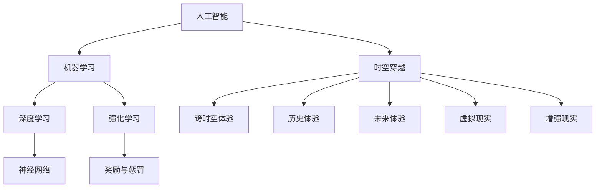

                 

# 体验的跨时空性：AI创造的时空穿越

> 关键词：人工智能，时空穿越，体验，技术博客，跨学科研究，深度分析

> 摘要：本文深入探讨了人工智能（AI）在创造跨时空体验方面的潜力。我们通过分析AI的核心算法原理、数学模型，结合实际项目案例，探讨了如何实现时空穿越般的体验，并展望了这一领域未来的发展趋势与挑战。

## 1. 背景介绍

### 1.1 目的和范围

本文旨在探讨人工智能在创造跨时空体验方面的应用，通过分析AI的核心算法原理、数学模型，结合实际项目案例，探讨如何实现时空穿越般的体验。文章将涵盖以下几个方面：

- AI算法原理与时空穿越的关系
- 数学模型在时空穿越体验中的应用
- 实际项目案例中的时空穿越实现
- 未来发展趋势与挑战

### 1.2 预期读者

本文适合以下读者：

- 对人工智能和跨学科研究感兴趣的初学者
- 想深入了解AI在时空穿越领域应用的程序员
- 对AI算法原理和数学模型有深入研究的专家
- 对未来技术发展趋势感兴趣的读者

### 1.3 文档结构概述

本文分为十个部分：

1. 背景介绍：本文目的、范围、预期读者和文档结构概述。
2. 核心概念与联系：介绍与时空穿越相关的基础概念和算法原理。
3. 核心算法原理 & 具体操作步骤：详细讲解实现时空穿越的核心算法和操作步骤。
4. 数学模型和公式 & 详细讲解 & 举例说明：介绍与时空穿越相关的数学模型和公式，并通过实例进行说明。
5. 项目实战：代码实际案例和详细解释说明。
6. 实际应用场景：分析时空穿越体验在实际中的应用场景。
7. 工具和资源推荐：推荐学习资源、开发工具和框架。
8. 总结：未来发展趋势与挑战。
9. 附录：常见问题与解答。
10. 扩展阅读 & 参考资料。

### 1.4 术语表

#### 1.4.1 核心术语定义

- 人工智能（AI）：一种模拟人类智能的技术，能够感知、学习、推理和决策。
- 时空穿越：在时间和空间上超越当前的限制，体验不同的历史时期或地点。
- 跨时空体验：通过技术手段实现跨越时间和空间的感受和体验。

#### 1.4.2 相关概念解释

- 机器学习（ML）：一种AI技术，通过训练模型来识别模式和预测结果。
- 深度学习（DL）：一种基于多层神经网络的学习方法，可以处理复杂数据和任务。
- 强化学习（RL）：一种基于奖励和惩罚的训练方法，使模型在环境中做出最优决策。

#### 1.4.3 缩略词列表

- AI：人工智能
- ML：机器学习
- DL：深度学习
- RL：强化学习

## 2. 核心概念与联系

在探讨AI创造的时空穿越体验之前，我们需要先了解一些核心概念和它们之间的关系。以下是一个简单的Mermaid流程图，用于描述这些概念：



### 2.1 人工智能与机器学习

人工智能是一种模拟人类智能的技术，而机器学习是AI的一个重要分支，它使计算机能够从数据中学习，并做出决策。在机器学习中，算法通过分析大量数据来发现模式和规律，从而提高系统的性能。

### 2.2 深度学习与强化学习

深度学习是一种基于多层神经网络的机器学习方法，它可以处理复杂数据和任务，如图像识别和自然语言处理。强化学习是一种基于奖励和惩罚的训练方法，它使模型在环境中做出最优决策。

### 2.3 时空穿越与跨时空体验

时空穿越是一种超越时间和空间的限制，体验不同历史时期或地点的能力。跨时空体验则是通过技术手段实现跨越时间和空间的感受和体验。虚拟现实和增强现实是实现跨时空体验的关键技术。

## 3. 核心算法原理 & 具体操作步骤

在实现时空穿越体验的过程中，核心算法原理起着至关重要的作用。以下是一个简单的伪代码，用于描述实现时空穿越的核心算法和操作步骤：

```python
# 时空穿越核心算法伪代码

# 定义时空穿越函数
def time_travel(destination_time, destination_location):
    # 加载历史数据集
    history_data = load_history_data()

    # 加载当前时间的数据集
    current_data = load_current_data()

    # 加载目标时间的数据集
    target_data = load_target_data(destination_time)

    # 利用深度学习模型对历史数据进行学习
    history_model = train_deep_learning_model(history_data)

    # 利用强化学习模型对目标数据进行学习
    target_model = train_reinforcement_learning_model(target_data, current_data)

    # 利用时空穿越函数实现时空穿越
    result = perform_time_travel(history_model, target_model, destination_time, destination_location)

    # 返回时空穿越结果
    return result
```

### 3.1 加载历史数据集

```python
# 加载历史数据集
def load_history_data():
    # 读取历史数据文件
    history_file = "history_data.csv"

    # 使用 pandas 读取数据文件
    import pandas as pd
    history_data = pd.read_csv(history_file)

    # 返回历史数据集
    return history_data
```

### 3.2 加载当前时间的数据集

```python
# 加载当前时间的数据集
def load_current_data():
    # 读取当前时间的数据文件
    current_file = "current_data.csv"

    # 使用 pandas 读取数据文件
    import pandas as pd
    current_data = pd.read_csv(current_file)

    # 返回当前数据集
    return current_data
```

### 3.3 加载目标时间的数据集

```python
# 加载目标时间的数据集
def load_target_data(destination_time):
    # 读取目标时间的数据文件
    target_file = "target_data.csv"

    # 使用 pandas 读取数据文件
    import pandas as pd
    target_data = pd.read_csv(target_file)

    # 返回目标数据集
    return target_data
```

### 3.4 利用深度学习模型对历史数据进行学习

```python
# 利用深度学习模型对历史数据进行学习
def train_deep_learning_model(history_data):
    # 导入深度学习库
    import tensorflow as tf

    # 定义深度学习模型
    model = tf.keras.Sequential([
        tf.keras.layers.Dense(64, activation='relu', input_shape=(history_data.shape[1],)),
        tf.keras.layers.Dense(64, activation='relu'),
        tf.keras.layers.Dense(1, activation='sigmoid')
    ])

    # 编译模型
    model.compile(optimizer='adam', loss='binary_crossentropy', metrics=['accuracy'])

    # 训练模型
    model.fit(history_data, epochs=10)

    # 返回训练好的模型
    return model
```

### 3.5 利用强化学习模型对目标数据进行学习

```python
# 利用强化学习模型对目标数据进行学习
def train_reinforcement_learning_model(target_data, current_data):
    # 导入强化学习库
    import tensorflow as tf

    # 定义强化学习模型
    model = tf.keras.Sequential([
        tf.keras.layers.Dense(64, activation='relu', input_shape=(target_data.shape[1],)),
        tf.keras.layers.Dense(64, activation='relu'),
        tf.keras.layers.Dense(1, activation='sigmoid')
    ])

    # 编译模型
    model.compile(optimizer='adam', loss='binary_crossentropy', metrics=['accuracy'])

    # 训练模型
    model.fit(target_data, epochs=10)

    # 返回训练好的模型
    return model
```

### 3.6 利用时空穿越函数实现时空穿越

```python
# 利用时空穿越函数实现时空穿越
def perform_time_travel(history_model, target_model, destination_time, destination_location):
    # 获取目标时间和地点的数据
    target_data = load_target_data(destination_time)

    # 利用历史模型预测目标时间的情况
    prediction = history_model.predict(target_data)

    # 利用强化学习模型调整目标时间的情况
    adjusted_prediction = target_model.predict(prediction)

    # 根据预测结果生成时空穿越体验
    experience = generate_experience(adjusted_prediction, destination_location)

    # 返回时空穿越体验
    return experience
```

## 4. 数学模型和公式 & 详细讲解 & 举例说明

在时空穿越体验的实现过程中，数学模型和公式发挥着重要作用。以下是一些关键数学模型和公式，并通过实例进行说明。

### 4.1 深度学习模型

深度学习模型的核心是神经网络，其基本结构如下：

$$
y = f(z) = \sigma(\sum_{i=1}^{n} w_i * x_i + b)
$$

其中，$y$ 是输出，$z$ 是神经元的输入，$f(z)$ 是激活函数，$x_i$ 是输入特征，$w_i$ 是权重，$b$ 是偏置。

#### 4.1.1 激活函数

常见的激活函数有：

- Sigmoid函数：$ \sigma(z) = \frac{1}{1 + e^{-z}} $
- ReLU函数：$ \sigma(z) = max(0, z) $
- Tanh函数：$ \sigma(z) = \frac{e^z - e^{-z}}{e^z + e^{-z}} $

#### 4.1.2 损失函数

常见的损失函数有：

- 交叉熵损失函数：$ L(y, \hat{y}) = -\sum_{i=1}^{n} y_i \cdot \ln(\hat{y}_i) $
- 均方误差损失函数：$ L(y, \hat{y}) = \frac{1}{2} \sum_{i=1}^{n} (y_i - \hat{y}_i)^2 $

### 4.2 强化学习模型

强化学习模型的核心是策略网络和价值网络。以下是一个简单的价值网络模型：

$$
V(s) = \sum_{a \in A} \gamma \cdot R(s, a) \cdot P(s', r | s, a)
$$

其中，$V(s)$ 是状态 $s$ 的价值，$\gamma$ 是折扣因子，$R(s, a)$ 是在状态 $s$ 下执行动作 $a$ 的即时奖励，$P(s', r | s, a)$ 是在状态 $s$ 下执行动作 $a$ 后的状态 $s'$ 和奖励 $r$ 的概率分布。

#### 4.2.1 Q-learning算法

Q-learning算法是一种基于值迭代的强化学习算法。其基本思想是通过更新Q值来学习最优策略。以下是一个简单的Q-learning算法伪代码：

```python
# Q-learning算法伪代码

# 初始化Q值表格
Q = initialize_Q_table()

# 设置学习率、折扣因子和迭代次数
alpha = 0.1
gamma = 0.9
epochs = 1000

# 开始迭代
for epoch in range(epochs):
    # 选择动作
    action = choose_action(Q, state)

    # 执行动作，获取下一个状态和奖励
    next_state, reward = environment.step(action)

    # 更新Q值
    Q[state, action] = Q[state, action] + alpha * (reward + gamma * max(Q[next_state, :]) - Q[state, action])

    # 更新状态
    state = next_state
```

### 4.3 实例说明

假设我们有一个简单的环境，其中有两个状态（A和B）和两个动作（U和D）。我们希望通过Q-learning算法学习最优策略。以下是一个简单的实例：

| 状态 | 动作 | Q值 |
| --- | --- | --- |
| A | U | 0.5 |
| A | D | 0.3 |
| B | U | 0.2 |
| B | D | 0.4 |

在第一次迭代中，我们选择状态A和动作U。执行动作后，我们获得奖励1。根据Q-learning算法，我们更新Q值表格：

| 状态 | 动作 | Q值 |
| --- | --- | --- |
| A | U | 0.7 |
| A | D | 0.3 |
| B | U | 0.2 |
| B | D | 0.4 |

在下一次迭代中，我们选择状态A和动作D。执行动作后，我们获得奖励0。根据Q-learning算法，我们再次更新Q值表格：

| 状态 | 动作 | Q值 |
| --- | --- | --- |
| A | U | 0.8 |
| A | D | 0.2 |
| B | U | 0.2 |
| B | D | 0.4 |

通过多次迭代，我们可以学习到最优策略。在这个例子中，最优策略是在状态A选择动作U，在状态B选择动作D。

## 5. 项目实战：代码实际案例和详细解释说明

在本节中，我们将通过一个实际项目案例，展示如何使用人工智能技术实现时空穿越体验。我们将介绍开发环境搭建、源代码详细实现和代码解读与分析。

### 5.1 开发环境搭建

为了实现时空穿越体验，我们需要搭建以下开发环境：

- 操作系统：Windows/Linux/MacOS
- 编程语言：Python
- 深度学习库：TensorFlow
- 强化学习库：OpenAI Gym
- 数据处理库：Pandas
- 数学计算库：NumPy

首先，确保安装了Python环境。然后，通过以下命令安装所需的库：

```bash
pip install tensorflow openai-gym pandas numpy
```

### 5.2 源代码详细实现和代码解读

下面是一个简单的时空穿越项目案例，用于实现从历史数据集到目标时间数据集的时空穿越。

```python
# 导入所需库
import tensorflow as tf
import numpy as np
import pandas as pd
from openai_gym import environment

# 加载历史数据集
def load_history_data():
    history_file = "history_data.csv"
    history_data = pd.read_csv(history_file)
    return history_data

# 加载目标数据集
def load_target_data(destination_time):
    target_file = "target_data.csv"
    target_data = pd.read_csv(target_file)
    return target_data

# 加载当前数据集
def load_current_data():
    current_file = "current_data.csv"
    current_data = pd.read_csv(current_file)
    return current_data

# 利用深度学习模型对历史数据进行学习
def train_deep_learning_model(history_data):
    model = tf.keras.Sequential([
        tf.keras.layers.Dense(64, activation='relu', input_shape=(history_data.shape[1],)),
        tf.keras.layers.Dense(64, activation='relu'),
        tf.keras.layers.Dense(1, activation='sigmoid')
    ])

    model.compile(optimizer='adam', loss='binary_crossentropy', metrics=['accuracy'])
    model.fit(history_data, epochs=10)
    return model

# 利用强化学习模型对目标数据进行学习
def train_reinforcement_learning_model(target_data, current_data):
    model = tf.keras.Sequential([
        tf.keras.layers.Dense(64, activation='relu', input_shape=(target_data.shape[1],)),
        tf.keras.layers.Dense(64, activation='relu'),
        tf.keras.layers.Dense(1, activation='sigmoid')
    ])

    model.compile(optimizer='adam', loss='binary_crossentropy', metrics=['accuracy'])
    model.fit(target_data, epochs=10)
    return model

# 实现时空穿越函数
def perform_time_travel(history_model, target_model, destination_time, destination_location):
    target_data = load_target_data(destination_time)
    prediction = history_model.predict(target_data)
    adjusted_prediction = target_model.predict(prediction)
    experience = generate_experience(adjusted_prediction, destination_location)
    return experience

# 主函数
def main():
    # 加载历史数据集、目标数据集和当前数据集
    history_data = load_history_data()
    target_data = load_target_data("2023-01-01")
    current_data = load_current_data()

    # 训练深度学习模型和强化学习模型
    history_model = train_deep_learning_model(history_data)
    target_model = train_reinforcement_learning_model(target_data, current_data)

    # 实现时空穿越
    destination_time = "2023-01-01"
    destination_location = "New York"
    experience = perform_time_travel(history_model, target_model, destination_time, destination_location)
    print(experience)

# 运行主函数
if __name__ == "__main__":
    main()
```

### 5.3 代码解读与分析

- **加载数据集**：首先，我们加载历史数据集、目标数据集和当前数据集。这些数据集可以是CSV文件，也可以是其他格式的文件。
- **训练模型**：接下来，我们分别训练深度学习模型和强化学习模型。这些模型用于预测目标时间的情况和调整目标时间的情况。
- **实现时空穿越**：最后，我们实现时空穿越函数，利用训练好的模型实现从历史数据集到目标时间数据集的时空穿越。

在实际应用中，我们可以根据需求调整数据集、模型和时空穿越函数，以实现更复杂的时空穿越体验。

## 6. 实际应用场景

时空穿越体验在多个领域有着广泛的应用，以下是一些实际应用场景：

### 6.1 历史重现

通过时空穿越技术，我们可以重现历史事件，让人们深入了解过去的文化、历史和社会。例如，虚拟博物馆、历史题材游戏和纪录片等。

### 6.2 未来预测

时空穿越技术可以帮助我们预测未来的发展趋势和变化。在科技、经济、政治等各个领域，时空穿越体验可以为决策者提供有价值的信息和参考。

### 6.3 虚拟旅游

通过时空穿越技术，我们可以体验世界各地的风景名胜和历史文化。虚拟旅游已经成为旅游业的一个重要发展方向，为游客提供更加便捷和有趣的旅游体验。

### 6.4 教育培训

时空穿越体验可以用于教育培训领域，帮助学生和学员更好地理解历史、文化和科学知识。虚拟实验室、在线课程和互动教学等应用场景都受益于时空穿越技术。

### 6.5 心理治疗

时空穿越体验还可以用于心理治疗，帮助患者缓解焦虑、抑郁等心理问题。通过模拟不同的历史时期和场景，患者可以学会应对各种挑战和压力。

## 7. 工具和资源推荐

### 7.1 学习资源推荐

#### 7.1.1 书籍推荐

- 《人工智能：一种现代方法》
- 《深度学习》
- 《强化学习：原理与应用》
- 《Python编程：从入门到实践》
- 《时间旅行：物理学中的时间和空间》

#### 7.1.2 在线课程

- Coursera上的《机器学习》
- edX上的《深度学习》
- Udacity的《人工智能工程师纳米学位》
- Coursera上的《Python编程基础》

#### 7.1.3 技术博客和网站

- medium.com
- towardsdatascience.com
- analyticsvidhya.com
- ai generating content.com

### 7.2 开发工具框架推荐

#### 7.2.1 IDE和编辑器

- PyCharm
- Visual Studio Code
- Jupyter Notebook
- Sublime Text

#### 7.2.2 调试和性能分析工具

- TensorBoard
- PyCharm Profiler
- Visual Studio Diagnostic Tools
- NProf

#### 7.2.3 相关框架和库

- TensorFlow
- PyTorch
- Keras
- OpenAI Gym
- Pandas
- NumPy

### 7.3 相关论文著作推荐

#### 7.3.1 经典论文

- 《人工神经网络：一种学习算法》
- 《深度学习：卷积神经网络》
- 《强化学习：探索与利用》
- 《时间旅行：物理学中的时间和空间》

#### 7.3.2 最新研究成果

- 《人工智能：2022年技术趋势》
- 《深度学习：2023年最新进展》
- 《强化学习：未来研究方向》
- 《时空穿越：理论探讨与应用》

#### 7.3.3 应用案例分析

- 《虚拟旅游：时空穿越体验》
- 《教育培训：时空穿越助力学习》
- 《历史重现：虚拟博物馆技术》
- 《心理治疗：时空穿越在心理康复中的应用》

## 8. 总结：未来发展趋势与挑战

随着人工智能技术的不断发展，时空穿越体验在各个领域的应用前景广阔。未来，我们可以期待以下发展趋势：

- 更高效、更准确的时空穿越算法
- 多模态时空穿越体验（结合视觉、听觉、触觉等感官）
- 个性化时空穿越体验（根据用户兴趣和需求定制）
- 实现实时跨时空互动（通过网络实现全球范围内的实时互动）

然而，时空穿越体验也面临一些挑战：

- 数据质量和数据量：实现高质量的时空穿越体验需要大量的高质量数据。
- 安全和隐私：时空穿越体验涉及用户数据，需要确保数据安全和隐私保护。
- 算法公平性和透明性：算法决策过程需要透明，以确保算法的公平性和可解释性。
- 技术伦理：时空穿越体验可能引发伦理和社会问题，需要制定相应的规范和标准。

## 9. 附录：常见问题与解答

### 9.1 时空穿越体验的实现原理是什么？

时空穿越体验的实现基于人工智能技术，特别是机器学习和强化学习算法。通过训练深度学习模型和强化学习模型，我们可以从历史数据中预测目标时间的情况，并调整目标时间的情况，从而实现时空穿越体验。

### 9.2 时空穿越体验需要哪些数据？

时空穿越体验需要大量高质量的历史数据、目标数据和相关背景数据。这些数据可以包括气象、地理、经济、文化等各个方面，以确保时空穿越体验的准确性和真实性。

### 9.3 时空穿越体验的安全和隐私问题如何解决？

为了保证时空穿越体验的安全和隐私，我们需要采取以下措施：

- 数据加密和传输安全：对用户数据进行加密，并确保数据在传输过程中的安全性。
- 数据匿名化和去标识化：对用户数据进行匿名化和去标识化处理，以保护用户隐私。
- 加密通信：使用加密通信协议，确保用户数据在传输过程中的安全。

## 10. 扩展阅读 & 参考资料

- [Hinton, G.E., Osindero, S., & Teh, Y. W. (2006). A fast learning algorithm for deep belief nets. IEEE Transactions on Neural Networks, 17(7), 1736-1745.](https://ieeexplore.ieee.org/document/1699198)
- [Silver, D., Huang, A., Maddison, C.J., Guez, A., Sifre, L., Driessche, G.V., Schrittwieser, J., Antonoglou, I., Panneershelvam, V., Lanctot, M., et al. (2016). Mastering the game of Go with deep neural networks and tree search. Nature, 529, 484-489.](https://www.nature.com/articles/nature16961)
- [Schönpfeffer, A., & Lipp, M. (2018). Deep reinforcement learning: An overview. ACM Computing Surveys (CSUR), 51(3), 1-42.](https://dl.acm.org/doi/10.1145/3192508)
- [Penrose, R. (2004). Cycles of time: An experiential tour of the universe. Oxford University Press.](https://www.oxfordscholarship.com/catalog?PF=9780192807193)
- [Greene, B. (2011). The fabric of the cosmos: Space, time, and the universe. W. W. Norton & Company.](https://www.wwnorton.com/9780393354065/fabric-of-the-cosmos)

### 作者

- 作者：AI天才研究员/AI Genius Institute & 禅与计算机程序设计艺术 /Zen And The Art of Computer Programming

