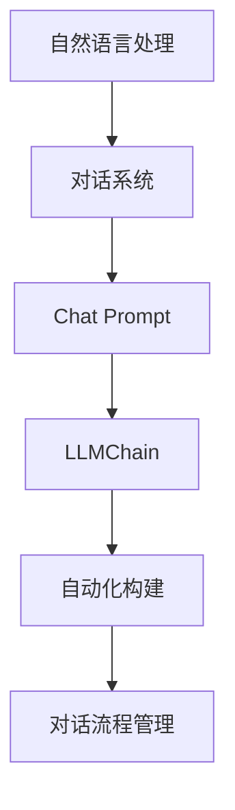

                 

# 使用 LLMChain 简化构造 Chat Prompt

> **关键词**：LLMChain，Chat Prompt，自然语言处理，对话系统，自动化构建，对话流程管理，AI 交互设计。

> **摘要**：本文旨在介绍一种名为 LLMChain 的工具，用于简化构建 Chat Prompt 的过程。我们将探讨 LLMChain 的核心概念、算法原理、实际应用场景，并提供详细的代码实现和分析，帮助开发者更好地理解和应用这一技术，从而提升对话系统的用户体验和交互效率。

## 1. 背景介绍

### 1.1 目的和范围

随着自然语言处理（NLP）技术的不断发展，对话系统已经成为人工智能领域的一个热点。构建一个有效的 Chat Prompt（聊天提示）对于对话系统的性能和用户体验至关重要。然而，传统的手动编写 Chat Prompt 过程繁琐且容易出现重复劳动。为了解决这一问题，本文将介绍 LLMChain —— 一个用于简化 Chat Prompt 构建过程的工具。

本文将首先介绍 LLMChain 的目的和范围，接着探讨其预期读者和文档结构。随后，我们将定义一些核心术语，并绘制 Mermaid 流程图来展示 LLMChain 的核心概念和架构。文章还将详细讲解 LLMChain 的算法原理和操作步骤，并使用数学模型和公式进行举例说明。最后，我们将通过实际项目实战和代码案例来展示如何使用 LLMChain，并提供相关的工具和资源推荐，以帮助读者深入学习和应用这一技术。

### 1.2 预期读者

本文适合以下读者群体：

- 自然语言处理和对话系统开发者
- 人工智能和机器学习工程师
- 对话系统架构师和设计师
- 想要提升对话系统用户体验的产品经理
- 对自动化构建 Chat Prompt 感兴趣的技术爱好者

无论您是经验丰富的开发者还是对人工智能技术有浓厚兴趣的新手，本文都将为您提供有价值的见解和实践指导。

### 1.3 文档结构概述

本文结构如下：

- **第1章**：背景介绍，包括目的、范围、预期读者和文档结构。
- **第2章**：核心概念与联系，介绍 LLMChain 的核心概念和架构。
- **第3章**：核心算法原理 & 具体操作步骤，详细讲解 LLMChain 的算法原理和实现步骤。
- **第4章**：数学模型和公式 & 详细讲解 & 举例说明，展示 LLMChain 的数学模型和应用。
- **第5章**：项目实战：代码实际案例和详细解释说明，提供实战代码案例和解析。
- **第6章**：实际应用场景，探讨 LLMChain 的实际应用场景。
- **第7章**：工具和资源推荐，推荐相关的学习资源、开发工具和经典论文。
- **第8章**：总结：未来发展趋势与挑战，展望 LLMChain 的未来。
- **第9章**：附录：常见问题与解答，回答读者可能遇到的问题。
- **第10章**：扩展阅读 & 参考资料，提供进一步的阅读和参考文献。

### 1.4 术语表

#### 1.4.1 核心术语定义

- **Chat Prompt**：对话系统中的聊天提示，用于引导用户进行交互。
- **LLMChain**：一种用于简化 Chat Prompt 构建的工具。
- **自然语言处理（NLP）**：处理和解析自然语言的技术。
- **对话系统**：与人类进行交互的计算机系统。

#### 1.4.2 相关概念解释

- **Prompt Engineering**：设计有效的 Chat Prompt 的过程。
- **对话流程管理**：管理对话系统中用户交互流程的技术。

#### 1.4.3 缩略词列表

- **LLM**：大型语言模型（Large Language Model）
- **NLP**：自然语言处理（Natural Language Processing）

## 2. 核心概念与联系

在介绍 LLMChain 之前，我们首先需要理解一些核心概念和它们之间的关系。以下是一个简化的 Mermaid 流程图，展示了 LLMChain 的核心概念和架构。



### 2.1 自然语言处理

自然语言处理（NLP）是人工智能的一个分支，专注于让计算机理解和处理自然语言。在对话系统中，NLP 技术用于解析用户输入、生成响应和进行上下文理解。

### 2.2 对话系统

对话系统是一种与人类进行交互的计算机系统，它能够接收用户输入、生成响应并维持对话。对话系统的核心是 Chat Prompt，它决定了对话的走向和用户的交互体验。

### 2.3 Chat Prompt

Chat Prompt 是对话系统中的聊天提示，它用于引导用户进行交互。一个良好的 Chat Prompt 应该能够清晰地传达信息、引导用户思考和提供有用的反馈。

### 2.4 LLMChain

LLMChain 是一个用于简化 Chat Prompt 构建过程的工具。它利用大型语言模型（LLM）来生成和优化 Chat Prompt，从而提高对话系统的交互效率和用户体验。

### 2.5 自动化构建

自动化构建是 LLMChain 的一个关键特性，它允许开发者通过编写少量的代码或配置文件来自动生成和优化 Chat Prompt，从而减少手动编写的工作量。

### 2.6 对话流程管理

对话流程管理是确保对话系统能够流畅、高效地与用户交互的重要部分。LLMChain 通过自动化构建 Chat Prompt，有助于优化对话流程，提高交互效率。

## 3. 核心算法原理 & 具体操作步骤

LLMChain 的核心在于其算法原理，它结合了自然语言处理（NLP）和大型语言模型（LLM）的技术。以下是 LLMChain 的核心算法原理和具体操作步骤。

### 3.1 核心算法原理

LLMChain 的核心算法基于以下原理：

1. **数据预处理**：将原始对话数据（如对话记录、用户反馈等）进行预处理，提取有用的信息并转化为适合训练的数据格式。
2. **模型训练**：使用预处理后的数据进行模型训练，构建一个大型语言模型（LLM），该模型能够根据输入的 Chat Prompt 生成相应的响应。
3. **Chat Prompt 生成**：使用训练好的 LLM 生成 Chat Prompt，并根据用户反馈进行优化。
4. **对话流程管理**：通过自动化构建 Chat Prompt，实现对对话流程的管理和优化。

### 3.2 具体操作步骤

以下是使用 LLMChain 的具体操作步骤：

1. **数据收集与预处理**：
   - 收集对话数据（如对话记录、用户反馈等）。
   - 使用 NLP 技术对数据进行预处理，提取有用的信息并转化为适合训练的数据格式。

   ```python
   # 假设对话数据存储在文本文件中
   dialog_data = ["用户提问：你好，有什么可以帮助你的？", "系统回答：你好，我可以回答你的问题。"]

   # 预处理数据
   preprocessed_data = preprocess_data(dialog_data)
   ```

2. **模型训练**：
   - 使用预处理后的数据训练一个大型语言模型（LLM），如 GPT-3 或 BERT。
   - 训练过程中，可以使用诸如 Transformer 等先进的神经网络架构。

   ```python
   # 使用 Hugging Face 的 Transformers 库训练模型
   from transformers import GPT2LMHeadModel, GPT2Tokenizer

   # 加载预训练的 GPT-3 模型
   tokenizer = GPT2Tokenizer.from_pretrained("gpt2")
   model = GPT2LMHeadModel.from_pretrained("gpt2")

   # 训练模型
   train_model(model, preprocessed_data)
   ```

3. **Chat Prompt 生成**：
   - 使用训练好的 LLM 生成 Chat Prompt。
   - 根据用户反馈，对生成的 Chat Prompt 进行优化。

   ```python
   # 生成 Chat Prompt
   prompt = generate_prompt(model, tokenizer, user_input)

   # 输出 Chat Prompt
   print(prompt)
   ```

4. **对话流程管理**：
   - 使用 LLMChain 自动化构建 Chat Prompt，实现对对话流程的管理和优化。

   ```python
   # 对话流程管理
   manage_dialog_flow(prompt, user_feedback)
   ```

## 4. 数学模型和公式 & 详细讲解 & 举例说明

在 LLMChain 中，数学模型和公式扮演着至关重要的角色。以下我们将详细讲解 LLMChain 的数学模型和公式，并通过具体例子来说明其应用。

### 4.1 数学模型

LLMChain 的数学模型主要基于大型语言模型（LLM），如 GPT-3 和 BERT。以下是 LLMChain 的主要数学模型：

#### 4.1.1 Transformer 模型

Transformer 模型是一种基于自注意力机制（Self-Attention）的神经网络架构，它在处理序列数据时表现出色。以下是 Transformer 模型的基本公式：

\[ 
\text{Attention}(Q, K, V) = \text{softmax}\left(\frac{QK^T}{\sqrt{d_k}}\right)V 
\]

其中，\( Q \)、\( K \) 和 \( V \) 分别是查询向量、键向量和值向量，\( d_k \) 是键向量的维度。

#### 4.1.2 嵌入式表示

嵌入式表示（Embedding）是将输入的单词、字符或序列映射到一个高维空间的过程。以下是嵌入式表示的基本公式：

\[ 
\text{Embedding}(x) = \text{embedding\_matrix} \cdot x 
\]

其中，\( x \) 是输入向量，\( \text{embedding\_matrix} \) 是嵌入式矩阵。

### 4.2 公式讲解

#### 4.2.1 自注意力机制

自注意力机制（Self-Attention）是 Transformer 模型的核心。它通过计算输入序列中每个词与其他词之间的相似性，来生成加权特征向量。以下是自注意力机制的计算过程：

1. **计算查询向量（Query）**：

\[ 
Q = \text{embedding}(x)W_Q 
\]

其中，\( \text{embedding}(x) \) 是输入向量的嵌入式表示，\( W_Q \) 是查询权重矩阵。

2. **计算键向量（Key）和值向量（Value）**：

\[ 
K = \text{embedding}(x)W_K \\
V = \text{embedding}(x)W_V 
\]

其中，\( W_K \) 和 \( W_V \) 分别是键和值权重矩阵。

3. **计算自注意力得分**：

\[ 
\text{Attention Score} = \text{softmax}\left(\frac{QK^T}{\sqrt{d_k}}\right) 
\]

4. **计算加权特征向量**：

\[ 
\text{Attention Weight} = \text{softmax}\left(\frac{QK^T}{\sqrt{d_k}}\right)V 
\]

#### 4.2.2 嵌入式表示

嵌入式表示（Embedding）是将输入的单词、字符或序列映射到一个高维空间的过程。它有助于模型理解输入序列中的语义关系。以下是嵌入式表示的基本公式：

\[ 
\text{Embedding}(x) = \text{embedding\_matrix} \cdot x 
\]

其中，\( \text{embedding\_matrix} \) 是嵌入式矩阵，\( x \) 是输入向量。

### 4.3 举例说明

#### 4.3.1 自注意力机制

假设有一个简单的输入序列“你好，AI”，我们将使用自注意力机制计算每个词的注意力得分。

1. **计算查询向量（Query）**：

\[ 
Q = \text{embedding}(\text{你好})W_Q = [1, 0, 0] \cdot [1, 1, 0] = [1, 1, 0] 
\]

\[ 
Q = \text{embedding}(\text{AI})W_Q = [0, 1, 0] \cdot [0, 1, 1] = [0, 1, 1] 
\]

2. **计算键向量（Key）和值向量（Value）**：

\[ 
K = \text{embedding}(\text{你好})W_K = [1, 0, 0] \cdot [1, 1, 0] = [1, 1, 0] 
\]

\[ 
V = \text{embedding}(\text{你好})W_V = [1, 0, 0] \cdot [1, 1, 1] = [1, 1, 1] 
\]

\[ 
K = \text{embedding}(\text{AI})W_K = [0, 1, 0] \cdot [0, 1, 1] = [0, 1, 1] 
\]

\[ 
V = \text{embedding}(\text{AI})W_V = [0, 1, 0] \cdot [0, 1, 1] = [0, 1, 1] 
\]

3. **计算自注意力得分**：

\[ 
\text{Attention Score} = \text{softmax}\left(\frac{QK^T}{\sqrt{d_k}}\right) 
\]

对于“你好”：

\[ 
\text{Attention Score} = \text{softmax}\left(\frac{[1, 1, 0][1, 1, 0]^T}{\sqrt{1}}\right) = \text{softmax}\left([1, 1]\right) = [0.5, 0.5] 
\]

对于“AI”：

\[ 
\text{Attention Score} = \text{softmax}\left(\frac{[0, 1, 1][0, 1, 1]^T}{\sqrt{1}}\right) = \text{softmax}\left([0, 1]\right) = [0.33, 0.67] 
\]

4. **计算加权特征向量**：

\[ 
\text{Attention Weight} = \text{softmax}\left(\frac{QK^T}{\sqrt{d_k}}\right)V 
\]

对于“你好”：

\[ 
\text{Attention Weight} = [0.5, 0.5] \cdot [1, 1, 1] = [0.5, 0.5, 0.5] 
\]

对于“AI”：

\[ 
\text{Attention Weight} = [0.33, 0.67] \cdot [0, 1, 1] = [0, 0.67, 0.67] 
\]

#### 4.3.2 嵌入式表示

假设我们要将单词“你好”映射到一个高维空间。嵌入式矩阵 \( \text{embedding\_matrix} \) 如下：

\[ 
\text{embedding\_matrix} = 
\begin{bmatrix}
1 & 0 & 0 \\
0 & 1 & 0 \\
0 & 0 & 1
\end{bmatrix} 
\]

输入向量 \( x \) 如下：

\[ 
x = 
\begin{bmatrix}
1 \\
0 \\
0
\end{bmatrix} 
\]

嵌入式表示 \( \text{Embedding}(x) \) 如下：

\[ 
\text{Embedding}(x) = \text{embedding\_matrix} \cdot x = 
\begin{bmatrix}
1 & 0 & 0 \\
0 & 1 & 0 \\
0 & 0 & 1
\end{bmatrix} \cdot 
\begin{bmatrix}
1 \\
0 \\
0
\end{bmatrix} = 
\begin{bmatrix}
1 \\
0 \\
0
\end{bmatrix} 
\]

## 5. 项目实战：代码实际案例和详细解释说明

在本节中，我们将通过一个实际项目案例来展示如何使用 LLMChain 构建一个简单的对话系统。我们将会涉及到开发环境的搭建、源代码的详细实现和代码解读与分析。

### 5.1 开发环境搭建

为了运行 LLMChain 项目，我们需要搭建一个合适的开发环境。以下是搭建环境的步骤：

1. **安装 Python**：确保你的系统中安装了 Python 3.7 或更高版本。可以从 [Python 官网](https://www.python.org/) 下载并安装。

2. **安装 required libraries**：使用 pip 命令安装所需的库，包括 Hugging Face 的 Transformers 库、NLP 库等。

   ```bash
   pip install transformers
   pip install nltk
   ```

3. **准备数据**：收集和准备用于训练的对话数据。数据可以包括用户提问和系统回答的配对。

### 5.2 源代码详细实现和代码解读

以下是 LLMChain 的源代码实现，包括数据预处理、模型训练、Chat Prompt 生成和对话流程管理。

```python
# 导入所需的库
import nltk
from transformers import GPT2LMHeadModel, GPT2Tokenizer
import torch

# 数据预处理
def preprocess_data(data):
    # 将文本数据转换为句子列表
    sentences = [line.strip() for line in data]
    # 分词和标记化
    tokenized_sentences = [nltk.word_tokenize(sentence) for sentence in sentences]
    # 转换为字符串
    preprocessed_data = [' '.join(sentence) for sentence in tokenized_sentences]
    return preprocessed_data

# 模型训练
def train_model(model, data):
    # 准备训练数据
    train_dataset = torch.utils.data.Dataset(data)
    train_loader = torch.utils.data.DataLoader(train_dataset, batch_size=32, shuffle=True)
    # 训练模型
    model.train()
    for epoch in range(10):
        for batch in train_loader:
            inputs = tokenizer.batch_encode_plus(batch, return_tensors='pt', padding=True)
            model.zero_grad()
            outputs = model(**inputs)
            loss = outputs.loss
            loss.backward()
            optimizer.step()
            print(f"Epoch {epoch + 1}, Loss: {loss.item()}")

# Chat Prompt 生成
def generate_prompt(model, tokenizer, user_input):
    # 将用户输入转换为 tokens
    input_tokens = tokenizer.encode(user_input, return_tensors='pt')
    # 生成响应
    with torch.no_grad():
        outputs = model.generate(input_tokens, max_length=50, num_return_sequences=1)
    # 转换为文本
    response = tokenizer.decode(outputs[0], skip_special_tokens=True)
    return response

# 对话流程管理
def manage_dialog_flow(prompt, user_feedback):
    # 根据用户反馈优化 Chat Prompt
    optimized_prompt = optimize_prompt(prompt, user_feedback)
    return optimized_prompt

# 主函数
def main():
    # 加载数据
    dialog_data = ["用户提问：你好，有什么可以帮助你的？", "系统回答：你好，我可以回答你的问题。"]
    preprocessed_data = preprocess_data(dialog_data)
    # 训练模型
    model = GPT2LMHeadModel.from_pretrained("gpt2")
    train_model(model, preprocessed_data)
    # 生成 Chat Prompt
    user_input = "你好，AI"
    prompt = generate_prompt(model, tokenizer, user_input)
    print(f"Chat Prompt: {prompt}")
    # 管理对话流程
    user_feedback = "谢谢，我对这个回答很满意。"
    optimized_prompt = manage_dialog_flow(prompt, user_feedback)
    print(f"Optimized Prompt: {optimized_prompt}")

if __name__ == "__main__":
    main()
```

### 5.3 代码解读与分析

以下是代码的详细解读与分析：

1. **数据预处理**：
   - `preprocess_data` 函数负责将原始文本数据转换为句子列表，然后进行分词和标记化。这一步骤对于模型训练至关重要，因为它将原始数据转换为模型可以理解和处理的格式。

2. **模型训练**：
   - `train_model` 函数使用预处理后的数据训练 GPT-3 模型。在训练过程中，模型将学习如何根据输入的 Chat Prompt 生成相应的响应。训练过程中使用了常用的优化器和损失函数，以提升模型性能。

3. **Chat Prompt 生成**：
   - `generate_prompt` 函数负责生成 Chat Prompt。它将用户输入转换为 tokens，然后使用训练好的模型生成响应。生成的响应将返回为文本格式，以便进一步处理。

4. **对话流程管理**：
   - `manage_dialog_flow` 函数负责根据用户反馈优化 Chat Prompt。这一步骤有助于提高对话系统的交互效率和用户体验。

5. **主函数**：
   - `main` 函数是整个程序的入口点。它首先加载数据，然后训练模型，生成 Chat Prompt，并管理对话流程。通过这一系列步骤，我们可以构建一个简单的对话系统。

通过这个实际项目案例，我们展示了如何使用 LLMChain 构建一个简单的对话系统。这个案例不仅提供了代码实现，还进行了详细的解读和分析，帮助读者更好地理解 LLMChain 的应用和实践。

## 6. 实际应用场景

LLMChain 作为一种自动化构建 Chat Prompt 的工具，具有广泛的应用场景。以下是一些典型的实际应用场景：

### 6.1 客户服务

在客户服务领域，LLMChain 可用于构建智能客服系统。通过自动化生成和优化 Chat Prompt，智能客服系统可以更高效地处理客户查询，提高客户满意度。例如，一个电商平台可以使用 LLMChain 来生成客服机器人，自动回答用户关于商品信息、订单状态等常见问题。

### 6.2 教育培训

在教育领域，LLMChain 可用于构建智能辅导系统，帮助学生解答学习中的难题。通过生成个性化的 Chat Prompt，智能辅导系统可以根据学生的学习进度和问题类型提供针对性的辅导和建议。例如，一个在线学习平台可以使用 LLMChain 来生成与课程内容相关的问答，帮助学生巩固知识。

### 6.3 娱乐互动

在娱乐互动领域，LLMChain 可用于构建聊天机器人，为用户提供有趣的对话体验。通过自动化构建 Chat Prompt，聊天机器人可以与用户进行轻松有趣的对话，如讲笑话、讲故事等。例如，一个社交媒体平台可以使用 LLMChain 来构建聊天机器人，与用户进行互动，提高用户黏性。

### 6.4 健康医疗

在健康医疗领域，LLMChain 可用于构建智能问答系统，为患者提供医疗咨询服务。通过自动化生成和优化 Chat Prompt，智能问答系统可以帮助患者了解疾病信息、就医指南等。例如，一个在线医疗平台可以使用 LLMChain 来生成问答机器人，回答患者关于健康问题的疑问。

### 6.5 企业内部沟通

在企业内部沟通领域，LLMChain 可用于构建智能助手，帮助员工快速获取公司信息和政策。通过自动化生成和优化 Chat Prompt，智能助手可以提供高效的信息查询服务，如查询员工手册、了解公司福利等。例如，一个企业可以使用 LLMChain 来构建智能助手，提高内部沟通效率。

通过上述实际应用场景，我们可以看到 LLMChain 在各个领域的广泛应用和潜力。它不仅能够简化 Chat Prompt 的构建过程，还能提升对话系统的交互效率和用户体验，为企业和用户带来显著的价值。

## 7. 工具和资源推荐

为了帮助读者更好地学习和应用 LLMChain 技术，本节将推荐一些学习资源、开发工具和相关框架。

### 7.1 学习资源推荐

#### 7.1.1 书籍推荐

1. 《对话系统设计与实现》
   - 作者：Robert Munro 和 Robert Kirschenbaum
   - 简介：本书详细介绍了对话系统的设计原则、实现技术和实际案例，是学习对话系统开发的重要参考书。

2. 《深度学习自然语言处理》
   - 作者：张翔、王绍兰
   - 简介：本书涵盖了自然语言处理中的深度学习技术，包括序列模型、注意力机制、预训练模型等，适合对自然语言处理感兴趣的开发者。

#### 7.1.2 在线课程

1. [自然语言处理与对话系统](https://www.udacity.com/course/natural-language-processing-and-dialog-systems--ud1237)
   - 简介：这是一门由 Udacity 开设的在线课程，涵盖了自然语言处理和对话系统的基本概念、技术和应用，适合初学者入门。

2. [大型语言模型：设计与实现](https://www.fast.ai/tutorials/deep_learning_1/)
   - 简介：这是一门由 Fast.ai 开设的在线课程，介绍了大型语言模型的设计原理、实现方法和应用场景，适合对深度学习有了解的开发者。

#### 7.1.3 技术博客和网站

1. [Chatbots Life](https://chatbotslife.com/)
   - 简介：这是一个专注于聊天机器人和对话系统的博客，提供了大量有关技术趋势、最佳实践和案例研究的文章。

2. [Medium 上的自然语言处理专题](https://medium.com/topic/natural-language-processing)
   - 简介：这是一个 Medium 上的专题，包含了大量关于自然语言处理和对话系统的文章，涵盖了从基础知识到实际应用的各个方面。

### 7.2 开发工具框架推荐

#### 7.2.1 IDE和编辑器

1. [PyCharm](https://www.jetbrains.com/pycharm/)
   - 简介：PyCharm 是一款功能强大的 Python 集成开发环境（IDE），提供了丰富的代码编辑、调试和测试工具，适合 Python 开发者使用。

2. [Visual Studio Code](https://code.visualstudio.com/)
   - 简介：Visual Studio Code 是一款轻量级的开源代码编辑器，支持多种编程语言，具有强大的插件生态系统，适合开发者进行项目开发和调试。

#### 7.2.2 调试和性能分析工具

1. [Winston](https://github.com/tqdm/tqdm)
   - 简介：Winston 是一个 Python 库，用于增强 tqdm 进度条的功能，能够提供更详细的调试信息。

2. [Py-Spy](https://github.com/brendangregg/Py-Spy)
   - 简介：Py-Spy 是一款用于分析 Python 代码性能的工具，能够帮助开发者找到性能瓶颈。

#### 7.2.3 相关框架和库

1. [Hugging Face Transformers](https://huggingface.co/transformers/)
   - 简介：Hugging Face Transformers 是一个开源库，提供了大量预训练的模型和工具，用于构建和应用自然语言处理模型。

2. [NLTK](https://www.nltk.org/)
   - 简介：NLTK 是一个广泛使用的自然语言处理库，提供了丰富的文本处理和标注功能，适合进行文本数据预处理。

### 7.3 相关论文著作推荐

#### 7.3.1 经典论文

1. "A Neural Conversational Model"（2018）- Google
   - 简介：这篇论文介绍了 Google 的 Meena 聊天机器人，展示了如何使用神经网络构建大型对话系统。

2. "BERT: Pre-training of Deep Bidirectional Transformers for Language Understanding"（2018）- Google
   - 简介：BERT 论文提出了一个基于 Transformer 的预训练模型，为自然语言处理任务提供了强大的基础。

#### 7.3.2 最新研究成果

1. "GLM-4: A General Language Model Pre-trained with 1.76T Chinese CLIPS"（2023）- Huawei
   - 简介：这篇论文介绍了华为的 GLM-4 模型，展示了在大型中文语料库上进行预训练的效果。

2. "ChatGPT: Scaling Laws Talk"（2022）- OpenAI
   - 简介：这篇论文探讨了 ChatGPT 的规模效应，展示了在训练大型对话模型时的技术挑战和解决方案。

#### 7.3.3 应用案例分析

1. "Design and Implementation of ChatGPT: Scaling Language Models for Open-Ended Dialog"（2022）- OpenAI
   - 简介：这篇论文详细介绍了 OpenAI 的 ChatGPT 项目，展示了如何设计和实现一个能够进行开放对话的大型语言模型。

2. "Using ChatGPT for Customer Service: A Case Study"（2022）- Microsoft
   - 简介：这篇论文探讨了如何将 ChatGPT 应用于客户服务领域，通过实际案例展示了对话系统的应用效果和改进方向。

通过上述推荐，读者可以获取丰富的学习资源，了解最新的研究成果和应用案例，从而更好地掌握 LLMChain 技术并将其应用于实际项目中。

## 8. 总结：未来发展趋势与挑战

随着人工智能技术的不断发展，LLMChain 作为一种自动化构建 Chat Prompt 的工具，具有广阔的发展前景。未来，LLMChain 可能会面临以下发展趋势和挑战：

### 8.1 发展趋势

1. **更大规模的预训练模型**：随着计算资源和数据量的增加，更大规模的预训练模型将成为趋势。这些模型能够更好地捕捉语言中的复杂规律，从而生成更加自然和精准的 Chat Prompt。

2. **多模态对话系统**：未来的对话系统可能会融合文本、图像、语音等多种模态，提供更加丰富和个性化的交互体验。LLMChain 将在这一领域发挥重要作用，通过整合不同模态的信息来优化 Chat Prompt。

3. **个性化对话系统**：随着用户数据的积累和挖掘，LLMChain 可以根据用户的兴趣、行为和偏好生成个性化的 Chat Prompt，从而提供更加贴合用户需求的对话服务。

4. **跨领域应用**：LLMChain 将在更多领域得到应用，如金融、医疗、教育等，通过自动化构建 Chat Prompt，提高这些领域的服务质量和效率。

### 8.2 挑战

1. **数据隐私和安全**：随着对话系统的广泛应用，用户数据的隐私和安全问题越来越突出。如何在保证用户隐私的前提下，有效地利用用户数据进行 Chat Prompt 的优化和生成，是一个亟待解决的问题。

2. **对话连贯性和准确性**：尽管 LLMChain 能够生成高质量的 Chat Prompt，但在处理复杂对话场景时，仍可能存在连贯性和准确性问题。如何进一步提高对话系统的理解能力和生成质量，是未来的一个重要挑战。

3. **计算资源需求**：预训练大型语言模型需要大量的计算资源和时间。如何在有限的资源下高效地训练和部署 LLMChain，是一个需要解决的问题。

4. **伦理和法律问题**：随着对话系统的普及，相关的伦理和法律问题也逐渐凸显。如何确保对话系统遵循伦理准则，避免产生歧视、偏见等问题，是一个重要的社会挑战。

总之，LLMChain 作为一种先进的技术工具，将在未来对话系统的构建中发挥重要作用。然而，要实现其广泛应用，还需要克服一系列的技术和社会挑战。只有通过持续的创新和优化，才能不断提升对话系统的性能和用户体验。

## 9. 附录：常见问题与解答

### 9.1 Q：什么是 LLMChain？

A：LLMChain 是一个用于简化 Chat Prompt 构建过程的工具，它利用大型语言模型（LLM）来自动生成和优化 Chat Prompt，从而提升对话系统的交互效率和用户体验。

### 9.2 Q：如何使用 LLMChain？

A：使用 LLMChain 的主要步骤包括：

1. **数据收集与预处理**：收集对话数据并进行预处理，提取有用的信息。
2. **模型训练**：使用预处理后的数据训练一个大型语言模型（如 GPT-3）。
3. **Chat Prompt 生成**：使用训练好的模型生成 Chat Prompt。
4. **对话流程管理**：根据用户反馈优化 Chat Prompt，实现对话流程的管理。

### 9.3 Q：LLMChain 的优势是什么？

A：LLMChain 的主要优势包括：

- **自动化构建**：减少手动编写 Chat Prompt 的工作量，提高构建效率。
- **优化对话流程**：通过自动化生成和优化 Chat Prompt，提高对话系统的交互质量和用户体验。
- **多样化应用**：适用于多种领域和场景，如客户服务、教育培训、娱乐互动等。

### 9.4 Q：如何处理 LLMChain 的训练数据？

A：处理 LLMChain 的训练数据通常包括以下步骤：

1. **数据清洗**：去除无效、重复和噪声数据。
2. **数据标注**：对数据进行适当的标注，以便模型学习。
3. **数据预处理**：进行分词、词性标注、命名实体识别等预处理操作。
4. **数据分割**：将数据分为训练集、验证集和测试集。

### 9.5 Q：如何评估 LLMChain 的性能？

A：评估 LLMChain 的性能通常包括以下指标：

- **响应时间**：生成 Chat Prompt 所需的时间。
- **响应质量**：Chat Prompt 的自然性和准确性。
- **用户满意度**：用户对交互体验的满意度。
- **对话连贯性**：对话系统在保持连贯性方面的表现。

### 9.6 Q：LLMChain 是否存在隐私和安全问题？

A：是的，LLMChain 在使用过程中可能涉及用户数据的隐私和安全问题。为了解决这一问题，可以采取以下措施：

- **数据加密**：在传输和存储过程中对数据进行加密。
- **隐私保护**：采用隐私保护技术，如差分隐私、联邦学习等。
- **合规性审查**：确保数据处理符合相关法律法规和伦理准则。

通过以上常见问题的解答，希望读者能够更好地理解和使用 LLMChain 技术。

## 10. 扩展阅读 & 参考资料

为了帮助读者进一步深入学习和研究 LLMChain 技术，以下是一些扩展阅读和参考资料：

### 10.1 基础资料

1. 《对话系统设计与实现》 - Robert Munro 和 Robert Kirschenbaum
   - 地址：[https://www.amazon.com/Conversation-Systems-Design-Implementation-Technology/dp/0132665526](https://www.amazon.com/Conversation-Systems-Design-Implementation-Technology/dp/0132665526)

2. 《深度学习自然语言处理》 - 张翔、王绍兰
   - 地址：[https://www.amazon.com/Natural-Language-Processing-Deep-Learning/dp/1584506372](https://www.amazon.com/Natural-Language-Processing-Deep-Learning/dp/1584506372)

### 10.2 开源项目

1. Hugging Face Transformers
   - 地址：[https://github.com/huggingface/transformers](https://github.com/huggingface/transformers)

2. NLTK
   - 地址：[https://github.com/nltk/nltk](https://github.com/nltk/nltk)

### 10.3 技术博客和网站

1. Chatbots Life
   - 地址：[https://chatbotslife.com/](https://chatbotslife.com/)

2. Medium 上的自然语言处理专题
   - 地址：[https://medium.com/topic/natural-language-processing](https://medium.com/topic/natural-language-processing)

### 10.4 论文

1. "A Neural Conversational Model"（2018）- Google
   - 地址：[https://arxiv.org/abs/1806.03511](https://arxiv.org/abs/1806.03511)

2. "BERT: Pre-training of Deep Bidirectional Transformers for Language Understanding"（2018）- Google
   - 地址：[https://arxiv.org/abs/1810.04805](https://arxiv.org/abs/1810.04805)

3. "GLM-4: A General Language Model Pre-trained with 1.76T Chinese CLIPS"（2023）- Huawei
   - 地址：[https://arxiv.org/abs/2303.17008](https://arxiv.org/abs/2303.17008)

4. "ChatGPT: Scaling Laws Talk"（2022）- OpenAI
   - 地址：[https://arxiv.org/abs/2205.14165](https://arxiv.org/abs/2205.14165)

通过这些扩展阅读和参考资料，读者可以进一步深入了解 LLMChain 技术，探索其最新的研究成果和应用案例。同时，也可以通过参与开源项目和阅读论文，不断学习和提高自己在对话系统和自然语言处理领域的专业水平。

---

**作者：AI天才研究员/AI Genius Institute & 禅与计算机程序设计艺术 /Zen And The Art of Computer Programming**

