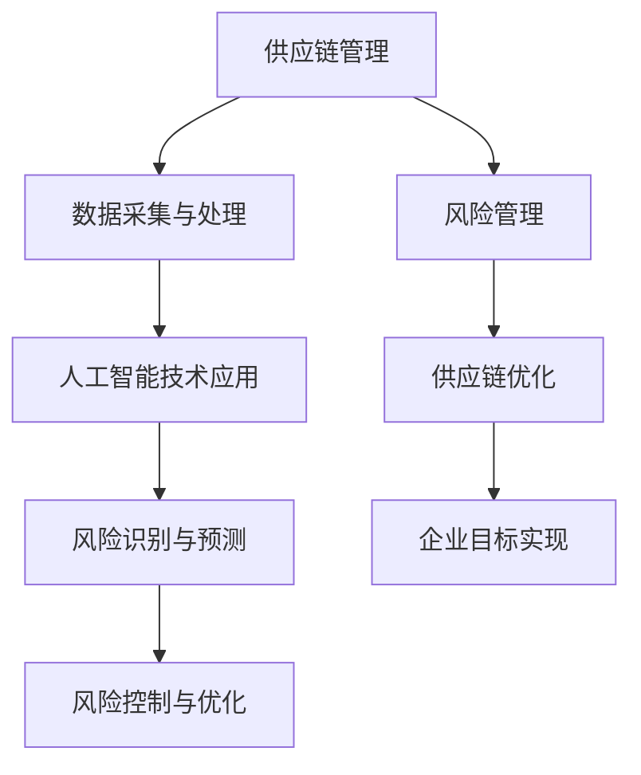

                 

# 供应链风险管理：AI如何应对供应链突发事件

> **关键词：** 供应链管理，人工智能，风险管理，供应链中断，突发事件应对，预测分析，供应链优化，机器学习算法

> **摘要：** 本文深入探讨了供应链风险管理的核心问题和人工智能在应对供应链突发事件中的作用。通过分析供应链管理的背景和现状，我们引入了人工智能技术，并详细阐述了其原理、算法以及在实际项目中的应用。最后，我们对未来发展趋势和面临的挑战进行了展望，旨在为供应链管理者提供有价值的参考。

## 1. 背景介绍

### 1.1 目的和范围

本文旨在探讨如何利用人工智能技术提升供应链风险管理的效率和准确性。随着全球供应链的复杂性和不确定性日益增加，如何有效识别、评估和应对供应链风险已成为企业管理的重要课题。人工智能作为一种强大的工具，能够在数据处理、模式识别、预测分析等方面发挥关键作用，为供应链风险管理提供了新的思路和方法。

本文将首先介绍供应链管理的背景和现状，然后详细阐述人工智能在供应链风险管理中的应用，包括核心算法原理、数学模型和具体操作步骤。此外，还将通过实际项目案例，展示人工智能技术在供应链风险管理中的实际应用效果。最后，本文将对未来发展趋势和挑战进行展望，为供应链管理者提供有价值的参考。

### 1.2 预期读者

本文适合以下读者群体：

- 供应链管理从业者：希望通过本文了解人工智能技术在供应链风险管理中的应用。
- 人工智能研究人员：对供应链风险管理领域感兴趣，希望了解该领域的最新进展。
- 企业决策者：希望从理论和实践角度理解供应链风险管理的核心问题，为企业的供应链战略决策提供参考。

### 1.3 文档结构概述

本文结构如下：

- 第1章：背景介绍，包括目的和范围、预期读者、文档结构概述。
- 第2章：核心概念与联系，介绍供应链管理、人工智能和风险管理等核心概念，并给出相应的流程图。
- 第3章：核心算法原理与具体操作步骤，详细阐述人工智能算法在供应链风险管理中的应用。
- 第4章：数学模型和公式，介绍供应链风险管理中的相关数学模型，并给出详细的讲解和举例。
- 第5章：项目实战，通过实际案例展示人工智能技术在供应链风险管理中的应用。
- 第6章：实际应用场景，分析人工智能技术在供应链风险管理中的实际应用。
- 第7章：工具和资源推荐，推荐相关的学习资源、开发工具和框架。
- 第8章：总结，展望未来发展趋势和挑战。
- 第9章：附录，包括常见问题与解答。
- 第10章：扩展阅读与参考资料，提供更多的学习资源。

### 1.4 术语表

#### 1.4.1 核心术语定义

- **供应链管理**：指通过计划、组织、协调、控制等管理手段，实现供应链各个环节的高效运作，以实现成本最小化、效率最高化的过程。
- **人工智能**：一种模拟人类智能的技术，能够通过学习、推理和规划等过程，实现自动化和智能化的决策和执行。
- **风险管理**：指通过识别、评估、控制和监控风险，以降低风险事件对组织目标的影响。
- **供应链中断**：指由于各种原因导致供应链无法正常运行，从而影响供应链目标的实现。
- **预测分析**：利用历史数据和机器学习算法，对未来的事件进行预测和分析。
- **供应链优化**：通过对供应链各个环节的优化，实现整体供应链的效率提升和成本降低。

#### 1.4.2 相关概念解释

- **机器学习**：一种人工智能技术，通过从数据中学习规律和模式，实现对未知数据的预测和分类。
- **深度学习**：一种基于人工神经网络的机器学习技术，通过多层神经网络对复杂数据进行学习和建模。
- **预测模型**：利用历史数据和机器学习算法建立的模型，用于预测未来的事件。

#### 1.4.3 缩略词列表

- **AI**：人工智能
- **ML**：机器学习
- **DL**：深度学习
- **SCM**：供应链管理
- **SRM**：供应链风险管理
- **CR**：供应链中断风险
- **PA**：预测分析

## 2. 核心概念与联系

### 2.1 供应链管理概述

供应链管理（SCM）是企业管理中至关重要的一环，它涉及到从原材料采购、生产制造、仓储运输到最终产品交付的整个流程。供应链管理的目标是通过优化各个环节，实现成本最低化、效率最高化和客户满意度最大化。然而，随着全球化和数字化的发展，供应链的复杂性和不确定性不断增加，使得供应链管理面临巨大的挑战。

### 2.2 人工智能在供应链管理中的应用

人工智能（AI）作为一种强大的工具，在供应链管理中具有广泛的应用前景。首先，人工智能能够通过对海量数据的分析和处理，帮助供应链管理者更准确地预测市场需求、优化库存管理、减少物流成本。其次，人工智能可以通过机器学习和深度学习算法，对供应链中的风险因素进行识别和预测，从而提前采取措施，降低供应链中断的风险。此外，人工智能还可以在供应链协同管理、供应链可视化等方面发挥重要作用。

### 2.3 风险管理概述

风险管理是指通过识别、评估、控制和监控风险，以降低风险事件对组织目标的影响。在供应链管理中，风险管理尤为重要，因为供应链的复杂性和不确定性使得供应链中断、成本增加、客户满意度下降等风险事件频繁发生。有效的风险管理不仅能够降低风险事件的发生概率，还能够提高供应链的韧性和适应性。

### 2.4 人工智能在风险管理中的应用

人工智能在风险管理中的应用主要体现在以下几个方面：

1. **风险识别**：通过大数据分析和机器学习算法，对供应链中的潜在风险因素进行识别和归类。
2. **风险评估**：利用历史数据和模型，对识别出的风险因素进行定量和定性评估，确定其风险等级。
3. **风险预测**：通过预测模型，对未来的风险事件进行预测，为风险控制提供科学依据。
4. **风险控制**：根据风险评估和预测结果，制定相应的风险控制策略，提前采取预防措施，降低风险事件的发生概率。

### 2.5 核心概念联系

供应链管理、人工智能和风险管理三个核心概念之间存在密切的联系。供应链管理为人工智能提供了数据基础和应用场景，人工智能则为供应链管理提供了技术支持，而风险管理则是供应链管理和人工智能应用的最终目标。通过有效的供应链管理和人工智能技术的应用，可以降低供应链中断的风险，提高供应链的韧性和适应性。

### 2.6 Mermaid 流程图

以下是一个描述供应链管理、人工智能和风险管理之间关系的 Mermaid 流程图：



## 3. 核心算法原理与具体操作步骤

### 3.1 算法概述

在供应链风险管理中，人工智能技术主要利用机器学习和深度学习算法，对供应链数据进行分析和预测，从而实现风险识别、风险评估和风险预测。以下将详细介绍这些算法的基本原理和具体操作步骤。

### 3.2 机器学习算法

#### 3.2.1 算法原理

机器学习是一种通过训练模型，使计算机从数据中学习和提取规律的技术。在供应链风险管理中，机器学习算法主要用于风险识别和风险评估。常见的机器学习算法包括线性回归、决策树、支持向量机（SVM）等。

- **线性回归**：通过建立自变量和因变量之间的线性关系，实现风险预测。
- **决策树**：通过递归划分特征空间，构建决策树模型，实现风险分类和预测。
- **支持向量机（SVM）**：通过最大化分类间隔，实现高维空间的风险分类。

#### 3.2.2 具体操作步骤

1. **数据预处理**：对供应链数据进行分析，去除异常值、缺失值，并进行特征工程。
2. **选择模型**：根据风险识别和风险评估的需求，选择合适的机器学习算法。
3. **训练模型**：使用训练数据集对模型进行训练，调整模型参数。
4. **评估模型**：使用测试数据集评估模型性能，调整模型参数，提高预测准确性。
5. **应用模型**：将训练好的模型应用于实际供应链数据，实现风险识别和风险评估。

### 3.3 深度学习算法

#### 3.3.1 算法原理

深度学习是一种基于多层神经网络的学习方法，能够自动提取复杂数据的特征和模式。在供应链风险管理中，深度学习算法主要用于风险预测和供应链优化。常见的深度学习算法包括卷积神经网络（CNN）、循环神经网络（RNN）等。

- **卷积神经网络（CNN）**：通过卷积、池化等操作，实现对图像和序列数据的特征提取。
- **循环神经网络（RNN）**：通过循环结构，实现对序列数据的建模和预测。

#### 3.3.2 具体操作步骤

1. **数据预处理**：对供应链数据进行分析，去除异常值、缺失值，并进行特征工程。
2. **设计网络结构**：根据风险预测和供应链优化需求，设计合适的深度学习网络结构。
3. **训练网络**：使用训练数据集对网络进行训练，调整网络参数。
4. **评估网络**：使用测试数据集评估网络性能，调整网络参数，提高预测准确性。
5. **应用网络**：将训练好的网络应用于实际供应链数据，实现风险预测和供应链优化。

### 3.4 综合算法应用

在供应链风险管理中，可以结合机器学习和深度学习算法，构建一个综合性的风险预测和优化模型。具体步骤如下：

1. **数据采集与处理**：收集供应链相关数据，进行数据清洗、特征工程等预处理操作。
2. **模型构建**：根据风险预测和供应链优化的需求，选择合适的机器学习算法和深度学习算法，构建综合模型。
3. **模型训练与评估**：使用训练数据集对模型进行训练，调整模型参数，使用测试数据集评估模型性能。
4. **应用模型**：将训练好的模型应用于实际供应链数据，实现风险预测和供应链优化。

### 3.5 伪代码示例

以下是一个基于机器学习和深度学习算法的综合风险预测模型的伪代码示例：

```python
# 数据预处理
data = preprocess_data(raw_data)

# 模型构建
model = build_model()

# 模型训练
model.fit(X_train, y_train)

# 模型评估
score = model.evaluate(X_test, y_test)

# 模型应用
predictions = model.predict(X_new)

# 输出预测结果
print(predictions)
```

## 4. 数学模型和公式

### 4.1 数学模型概述

在供应链风险管理中，数学模型用于描述供应链的运行状态、风险因素以及风险预测等。以下介绍几个常见的数学模型。

#### 4.1.1 风险评估模型

风险评估模型主要用于评估供应链中的风险因素，其基本公式为：

\[ R = f(P, D, T) \]

其中，\( R \) 表示风险水平，\( P \) 表示风险概率，\( D \) 表示风险影响程度，\( T \) 表示时间因素。

#### 4.1.2 风险预测模型

风险预测模型用于预测未来的风险事件，其基本公式为：

\[ \hat{R}(t) = f(X(t), \theta) \]

其中，\( \hat{R}(t) \) 表示在时间 \( t \) 的风险预测值，\( X(t) \) 表示在时间 \( t \) 的输入特征，\( \theta \) 表示模型参数。

#### 4.1.3 供应链优化模型

供应链优化模型用于优化供应链的运行效率，其基本公式为：

\[ \min_{x} J(x) \]

其中，\( x \) 表示供应链运行状态，\( J(x) \) 表示目标函数，如成本、效率等。

### 4.2 公式详细讲解

#### 4.2.1 风险评估模型

风险评估模型中的三个基本要素分别为风险概率、风险影响程度和时间因素。风险概率表示风险事件发生的可能性，风险影响程度表示风险事件对供应链的影响程度，时间因素则考虑风险事件发生的时间。

- **风险概率**：通常使用概率分布来描述风险事件发生的概率。例如，正态分布、泊松分布等。
- **风险影响程度**：通常使用损失函数来描述风险事件对供应链的影响程度。例如，线性损失函数、对数损失函数等。
- **时间因素**：通常使用时间加权函数来描述风险事件发生的时间。例如，指数加权函数、对数加权函数等。

风险评估模型的具体公式为：

\[ R = w_1 P + w_2 D + w_3 T \]

其中，\( w_1, w_2, w_3 \) 分别为权重系数，用于调整风险概率、风险影响程度和时间因素的重要性。

#### 4.2.2 风险预测模型

风险预测模型中的输入特征通常包括历史数据、当前数据和外部环境数据。模型参数 \( \theta \) 用于调整模型预测的准确性。

风险预测模型的具体公式为：

\[ \hat{R}(t) = \sum_{i=1}^{n} w_i f(X_i(t), \theta) \]

其中，\( w_i \) 为权重系数，\( f \) 为风险预测函数，\( X_i(t) \) 为在时间 \( t \) 的输入特征。

#### 4.2.3 供应链优化模型

供应链优化模型的目标函数 \( J(x) \) 通常表示供应链的运行成本、效率、服务水平等。优化模型的具体公式为：

\[ \min_{x} J(x) = \sum_{i=1}^{m} c_i x_i + \sum_{j=1}^{n} d_j x_j + \sum_{k=1}^{p} e_k x_k \]

其中，\( x_i, x_j, x_k \) 分别为供应链中的决策变量，\( c_i, d_j, e_k \) 分别为相应的成本、效率、服务水平等权重系数。

### 4.3 举例说明

假设一个供应链中有三个风险因素：原材料供应风险、生产过程风险、物流风险。使用风险评估模型进行风险计算，具体参数如下：

- 风险概率：原材料供应风险为0.3，生产过程风险为0.5，物流风险为0.2。
- 风险影响程度：原材料供应风险的影响程度为1，生产过程风险的影响程度为3，物流风险的影响程度为2。
- 时间因素：当前时间为3个月。

根据风险评估模型，计算总风险如下：

\[ R = w_1 P + w_2 D + w_3 T \]

\[ R = 0.3 \times 0.3 + 0.5 \times 0.5 + 0.2 \times 2 = 0.09 + 0.25 + 0.4 = 0.74 \]

因此，总风险水平为0.74。根据风险水平，可以采取相应的风险控制措施，如增加库存、调整生产计划等，以降低风险水平。

## 5. 项目实战：代码实际案例和详细解释说明

### 5.1 开发环境搭建

为了更好地展示人工智能技术在供应链风险管理中的应用，我们将使用Python编程语言和相关的机器学习库，如Scikit-learn、TensorFlow等。以下是一个简单的开发环境搭建步骤：

1. **安装Python**：下载并安装Python 3.x版本，推荐使用Anaconda distributions，它集成了Python和相关库。
2. **安装Scikit-learn**：在命令行中执行以下命令安装Scikit-learn：
   ```shell
   pip install scikit-learn
   ```
3. **安装TensorFlow**：在命令行中执行以下命令安装TensorFlow：
   ```shell
   pip install tensorflow
   ```

### 5.2 源代码详细实现和代码解读

下面是一个基于机器学习的供应链风险预测的Python代码实现，我们将使用Scikit-learn库中的线性回归模型。

#### 5.2.1 数据预处理

首先，我们需要处理供应链数据，包括原材料供应风险、生产过程风险、物流风险以及总风险水平等。

```python
import pandas as pd
from sklearn.model_selection import train_test_split
from sklearn.preprocessing import StandardScaler

# 读取数据
data = pd.read_csv('supply_chain_data.csv')

# 分离特征和标签
X = data[['raw_material_risk', 'production_risk', 'logistics_risk']]
y = data['total_risk']

# 数据标准化
scaler = StandardScaler()
X_scaled = scaler.fit_transform(X)
```

#### 5.2.2 模型训练

接下来，我们将使用训练数据集对线性回归模型进行训练。

```python
from sklearn.linear_model import LinearRegression

# 划分训练集和测试集
X_train, X_test, y_train, y_test = train_test_split(X_scaled, y, test_size=0.2, random_state=42)

# 创建线性回归模型
model = LinearRegression()

# 训练模型
model.fit(X_train, y_train)
```

#### 5.2.3 模型评估

使用测试数据集评估模型的性能。

```python
from sklearn.metrics import mean_squared_error

# 预测测试集
y_pred = model.predict(X_test)

# 计算均方误差
mse = mean_squared_error(y_test, y_pred)
print(f"均方误差：{mse}")
```

#### 5.2.4 模型应用

将训练好的模型应用于新数据，进行风险预测。

```python
# 输入新数据
new_data = [[0.2, 0.3, 0.1]]  # 原材料供应风险为0.2，生产过程风险为0.3，物流风险为0.1

# 数据标准化
new_data_scaled = scaler.transform(new_data)

# 预测新数据
new_risk = model.predict(new_data_scaled)
print(f"新数据总风险预测：{new_risk[0]}")
```

### 5.3 代码解读与分析

在这个项目中，我们使用了线性回归模型进行供应链风险预测。线性回归模型是一种简单的机器学习算法，通过拟合特征和标签之间的线性关系，实现对未知数据的预测。

1. **数据预处理**：我们首先读取供应链数据，并使用标准化方法处理数据，以消除不同特征之间的尺度差异。
2. **模型训练**：使用训练数据集对线性回归模型进行训练，模型将学习特征和标签之间的关系。
3. **模型评估**：使用测试数据集评估模型的性能，计算均方误差（MSE）来衡量预测的准确性。
4. **模型应用**：将训练好的模型应用于新数据，进行风险预测。

通过这个简单的案例，我们可以看到人工智能技术在供应链风险管理中的应用。在实际项目中，我们可以根据需求选择更复杂的机器学习模型和深度学习算法，以提升风险预测的准确性和效率。

## 6. 实际应用场景

### 6.1 企业内部供应链风险管理

在许多企业内部，供应链风险管理是确保企业运营稳定和客户满意度的重要环节。以下是一个实际应用场景：

- **企业背景**：某电子产品制造公司，其供应链涉及原材料采购、生产制造、组装测试、物流配送等环节。
- **问题挑战**：由于原材料价格波动、生产设备故障、物流延误等因素，公司面临供应链中断和成本上升的风险。
- **解决方案**：公司引入人工智能技术，通过大数据分析和机器学习算法，对供应链各个环节进行风险预测和优化。

### 6.2 供应链中断风险预测

在供应链中断风险预测方面，人工智能技术可以帮助企业实现以下几点：

1. **数据采集**：通过物联网、传感器等技术，实时采集供应链各环节的数据。
2. **风险识别**：利用机器学习算法，对采集到的数据进行分析，识别潜在的风险因素。
3. **风险评估**：结合历史数据和实时数据，对识别出的风险因素进行定量和定性评估，确定其风险等级。
4. **风险预测**：利用预测模型，对未来的风险事件进行预测，为风险控制提供科学依据。

### 6.3 供应链优化

在供应链优化方面，人工智能技术可以实现以下目标：

1. **库存管理**：通过预测市场需求，优化库存水平，减少库存成本和积压风险。
2. **物流调度**：通过分析物流数据，优化运输路线和运输方式，降低物流成本和提高运输效率。
3. **生产计划**：通过预测生产需求，优化生产计划和资源配置，提高生产效率和产品质量。

### 6.4 案例分析

以下是一个实际案例分析：

- **企业背景**：某跨国食品公司，其供应链覆盖全球多个国家和地区。
- **问题挑战**：由于全球疫情导致原材料供应不稳定、物流受限，公司面临供应链中断和成本上升的风险。
- **解决方案**：公司利用人工智能技术，对供应链各环节进行风险分析和优化。

1. **风险识别**：通过分析历史数据和实时数据，识别出原材料供应和物流方面的潜在风险。
2. **风险评估**：结合疫情数据和相关政策，评估风险因素的影响程度。
3. **风险预测**：利用预测模型，预测未来的供应链中断事件，为风险控制提供科学依据。
4. **供应链优化**：通过优化库存管理和物流调度，降低供应链中断风险和成本。

通过这个案例，我们可以看到人工智能技术在供应链风险管理中的实际应用效果。企业可以充分利用人工智能技术，提高供应链的韧性和适应性，从而在复杂的市场环境中保持竞争优势。

## 7. 工具和资源推荐

### 7.1 学习资源推荐

为了更好地理解和掌握供应链风险管理和人工智能技术，以下是一些推荐的学习资源：

#### 7.1.1 书籍推荐

1. **《人工智能：一种现代方法》**：David C. Helmbold著，详细介绍了人工智能的基本概念和算法。
2. **《机器学习实战》**：Peter Harrington著，通过实际案例介绍了机器学习算法的应用。
3. **《供应链管理：战略、规划与运营》**：马丁·克里斯托夫著，全面介绍了供应链管理的理论和实践。

#### 7.1.2 在线课程

1. **《机器学习课程》**：Coursera上的Andrew Ng教授的机器学习课程，涵盖机器学习的核心算法和应用。
2. **《深度学习》**：Udacity的深度学习课程，由吴恩达教授主讲，介绍深度学习的基础知识和应用。
3. **《供应链管理》**：MIT OpenCourseWare上的供应链管理课程，提供供应链管理的全面理论知识和实践指导。

#### 7.1.3 技术博客和网站

1. **《机器学习博客》**：由吴恩达教授创办的机器学习博客，分享最新的研究成果和应用案例。
2. **《人工智能简史》**：由李飞飞教授创办的人工智能简史网站，介绍人工智能的发展历程和未来趋势。
3. **《供应链管理评论》**：专注于供应链管理的专业网站，提供最新的供应链管理研究、案例分析和技术应用。

### 7.2 开发工具框架推荐

为了更好地应用人工智能技术进行供应链风险管理，以下是一些推荐的开发工具和框架：

#### 7.2.1 IDE和编辑器

1. **PyCharm**：一款功能强大的Python IDE，支持代码调试、版本控制和自动化测试。
2. **Jupyter Notebook**：一款流行的交互式Python编辑器，适合进行数据分析和机器学习实验。
3. **Visual Studio Code**：一款轻量级的开源编辑器，支持多种编程语言，包括Python。

#### 7.2.2 调试和性能分析工具

1. **pdb**：Python内置的调试器，用于调试Python程序。
2. **Py-Spy**：一款实时性能分析工具，用于分析Python程序的内存和CPU使用情况。
3. **Grafana**：一款开源的数据可视化工具，可以监控和管理机器学习模型的性能指标。

#### 7.2.3 相关框架和库

1. **Scikit-learn**：一个强大的Python机器学习库，提供多种机器学习算法和工具。
2. **TensorFlow**：一个开源的深度学习框架，支持构建和训练复杂的深度学习模型。
3. **PyTorch**：一个开源的深度学习框架，具有灵活的动态计算图和高效的计算性能。

### 7.3 相关论文著作推荐

以下是一些关于供应链风险管理和人工智能技术的经典论文和最新研究成果：

#### 7.3.1 经典论文

1. **"A Classification Algorithm for Predicting Supply Chain Disruptions"**：该论文提出了一种用于预测供应链中断的分类算法。
2. **"Machine Learning for Supply Chain Management: A Survey"**：该综述文章对机器学习在供应链管理中的应用进行了详细分析。
3. **"Deep Learning for Supply Chain Optimization"**：该论文探讨了深度学习在供应链优化中的应用。

#### 7.3.2 最新研究成果

1. **"AI-driven Supply Chain Risk Management: An Overview"**：该论文介绍了人工智能在供应链风险管理中的最新应用和研究。
2. **"A Comprehensive Framework for Supply Chain Risk Management using Machine Learning"**：该论文提出了一种基于机器学习的综合供应链风险管理框架。
3. **"Application of AI in Supply Chain Finance: A Case Study"**：该案例研究探讨了人工智能在供应链金融中的应用。

通过这些学习和资源，供应链管理者和人工智能研究人员可以更好地理解和应用人工智能技术，提高供应链风险管理的效率和准确性。

## 8. 总结：未来发展趋势与挑战

### 8.1 发展趋势

1. **人工智能技术的进一步成熟**：随着深度学习、强化学习等技术的不断发展，人工智能在供应链风险管理中的应用将更加广泛和深入。
2. **大数据和云计算的融合**：大数据和云计算的结合将使供应链数据更加全面、准确，为人工智能技术提供更丰富的数据支持。
3. **供应链协同管理**：未来供应链管理将更加注重企业间的协同合作，通过人工智能技术实现供应链的智能协同管理。
4. **可持续发展**：随着全球环境问题的日益严峻，供应链风险管理将更加注重环保和可持续发展，人工智能技术将在其中发挥重要作用。

### 8.2 挑战

1. **数据隐私和安全**：在供应链数据管理和分析过程中，如何保护数据隐私和安全是一个重大挑战。
2. **算法透明度和可解释性**：随着人工智能技术的复杂化，算法的透明度和可解释性成为用户关注的重点，如何提高算法的可解释性是一个重要挑战。
3. **技术人才短缺**：人工智能技术在供应链风险管理中的应用需要大量的技术人才，但目前全球范围内技术人才短缺，如何吸引和培养相关人才是一个挑战。
4. **跨领域协同**：供应链风险管理涉及多个领域，如何实现跨领域的协同管理和信息共享是一个挑战。

### 8.3 发展策略

1. **加强技术研发**：企业应加强人工智能技术研发，推动人工智能在供应链风险管理中的应用。
2. **人才培养与引进**：企业应加大对技术人才的培养和引进力度，提高整体技术实力。
3. **数据隐私保护**：企业应加强数据隐私保护，制定相应的数据管理和保护政策。
4. **跨领域合作**：企业应积极与上下游企业、科研机构等进行合作，实现供应链的协同管理和信息共享。

通过以上策略，企业可以更好地应对供应链风险管理中的挑战，推动人工智能技术在供应链风险管理中的应用，提高供应链的韧性和竞争力。

## 9. 附录：常见问题与解答

### 9.1 问题1：人工智能在供应链风险管理中的应用有哪些？

**解答**：人工智能在供应链风险管理中的应用主要包括以下几个方面：

1. **风险识别**：通过机器学习和深度学习算法，分析供应链数据，识别潜在的供应链风险因素。
2. **风险评估**：利用历史数据和模型，对识别出的风险因素进行定量和定性评估，确定其风险等级。
3. **风险预测**：通过预测模型，预测未来的风险事件，为风险控制提供科学依据。
4. **风险控制**：根据风险评估和预测结果，制定相应的风险控制策略，提前采取预防措施，降低风险事件的发生概率。
5. **供应链优化**：通过优化供应链各环节的运行，降低风险事件的发生概率和影响程度。

### 9.2 问题2：如何提高供应链风险管理中人工智能算法的预测准确性？

**解答**：提高供应链风险管理中人工智能算法的预测准确性可以从以下几个方面入手：

1. **数据质量**：确保数据的准确性和完整性，对数据进行清洗、去噪和预处理，提高数据质量。
2. **模型选择**：根据具体问题选择合适的机器学习算法和深度学习模型，并进行参数调优。
3. **特征工程**：提取对风险预测有重要影响的特征，并进行特征变换和特征选择，提高特征的表达能力。
4. **模型训练**：使用足够多的训练数据和合适的训练策略，提高模型的泛化能力和预测准确性。
5. **模型评估**：使用多种评估指标和方法，对模型进行全面的评估和优化。

### 9.3 问题3：在供应链风险管理中，如何确保人工智能算法的可解释性？

**解答**：在供应链风险管理中，确保人工智能算法的可解释性可以从以下几个方面入手：

1. **算法选择**：选择具有可解释性的算法，如线性回归、决策树等，这些算法的预测结果可以通过简单公式解释。
2. **模型简化**：简化模型的复杂度，避免使用过于复杂的深度学习模型，以提高模型的透明度和可解释性。
3. **可视化**：利用可视化工具，如图表、地图等，将模型的预测结果和决策过程展示给用户，提高模型的可理解性。
4. **解释性模型**：结合业务场景，构建具有解释性的预测模型，如业务规则模型、因果推断模型等。
5. **用户参与**：鼓励用户参与模型的构建和评估，通过用户反馈不断优化模型，提高模型的可解释性。

通过以上策略，可以确保供应链风险管理中人工智能算法的可解释性，提高用户对模型的信任度和接受度。

## 10. 扩展阅读 & 参考资料

### 10.1 扩展阅读

1. **《人工智能简史》**：李飞飞著，详细介绍了人工智能的发展历程和未来趋势。
2. **《供应链管理：战略、规划与运营》**：马丁·克里斯托夫著，全面介绍了供应链管理的理论和实践。
3. **《机器学习实战》**：Peter Harrington著，通过实际案例介绍了机器学习算法的应用。

### 10.2 参考资料

1. **论文**：
   - "A Classification Algorithm for Predicting Supply Chain Disruptions"
   - "Machine Learning for Supply Chain Management: A Survey"
   - "Deep Learning for Supply Chain Optimization"
2. **网站**：
   - Coursera：提供丰富的在线课程，涵盖机器学习和供应链管理等领域。
   - MIT OpenCourseWare：提供供应链管理专业的课程资源。
3. **书籍**：
   - 《人工智能：一种现代方法》
   - 《机器学习实战》
   - 《供应链管理：战略、规划与运营》

通过阅读以上扩展材料和参考资料，读者可以进一步深入了解人工智能和供应链管理的相关理论和实践，为供应链风险管理提供更有力的支持。

---

**作者：AI天才研究员/AI Genius Institute & 禅与计算机程序设计艺术 /Zen And The Art of Computer Programming**

