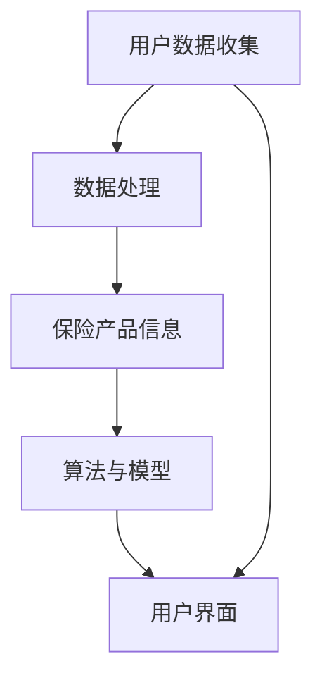

                 

### 保险比价平台：简化保险选择的智能工具

> **关键词**：保险比价平台、保险选择、智能工具、数据处理、算法、数学模型、用户体验、技术实现

> **摘要**：本文将探讨如何利用现代技术构建一个高效的保险比价平台，以简化用户在众多保险产品中的选择过程。我们将从背景介绍、核心概念与联系、核心算法原理、数学模型、项目实战、实际应用场景等多个方面进行详细分析，最终提出一个具备高度实用性和用户友好性的智能保险比价平台解决方案。

## 1. 背景介绍

### 1.1 目的和范围

保险比价平台旨在为用户提供一个高效、便捷的保险产品对比工具。随着保险市场的日益复杂和多元化，用户在选择适合自己的保险产品时面临着信息过载和决策难度增加的问题。我们的目标是通过技术手段，简化用户的保险选择过程，提升用户体验，帮助用户快速找到最符合其需求和预算的保险产品。

本文将围绕以下几个方面展开讨论：

1. **核心概念与联系**：介绍构建保险比价平台所需的关键概念及其相互关系。
2. **核心算法原理**：详细解释比价平台所使用的关键算法及其工作原理。
3. **数学模型**：阐述比价平台中使用的数学模型，并举例说明其实际应用。
4. **项目实战**：通过实际案例展示比价平台的实现过程。
5. **实际应用场景**：讨论比价平台在不同保险产品类别中的应用。
6. **工具和资源推荐**：推荐有助于构建和优化比价平台的学习资源和开发工具。
7. **总结与展望**：总结全文，并对未来发展趋势与挑战进行展望。

### 1.2 预期读者

本文适合以下读者群体：

1. **保险行业从业者**：包括保险代理人、保险顾问等，希望通过技术提升工作效率。
2. **软件开发人员**：对构建数据处理和比价算法感兴趣的技术人员。
3. **数据分析人员**：希望了解如何将数据分析应用于保险产品比价。
4. **保险产品用户**：对保险选择和购买流程有深入需求的消费者。

### 1.3 文档结构概述

本文结构如下：

1. **背景介绍**：介绍保险比价平台的背景、目的、读者对象和文档结构。
2. **核心概念与联系**：阐述构建平台所需的关键概念和架构。
3. **核心算法原理**：介绍用于保险比价的算法原理和具体操作步骤。
4. **数学模型**：讲解比价平台中的数学模型和公式。
5. **项目实战**：展示一个实际的保险比价平台项目。
6. **实际应用场景**：讨论比价平台在不同场景中的应用。
7. **工具和资源推荐**：推荐相关学习和开发资源。
8. **总结与展望**：总结全文并展望未来发展趋势与挑战。
9. **附录**：提供常见问题与解答。
10. **扩展阅读**：推荐相关参考文献和资料。

### 1.4 术语表

#### 1.4.1 核心术语定义

- **保险比价平台**：一种在线工具，用于比较和分析不同保险公司的产品，帮助用户选择最合适的保险。
- **数据处理**：对大量保险数据进行收集、清洗、存储和处理的过程。
- **算法**：解决问题的方法或规则集合，用于优化比价过程。
- **数学模型**：使用数学公式和逻辑关系来描述比价平台中的各种现象和关系。
- **用户体验**：用户在使用保险比价平台过程中的感受和满意度。

#### 1.4.2 相关概念解释

- **保险产品**：保险公司提供的各类保险计划，包括人寿保险、车险、健康保险等。
- **用户需求**：用户在购买保险时关注的因素，如保费、保障范围、服务网络等。
- **数据挖掘**：从大量数据中提取有用信息和模式的过程，用于比价分析。
- **机器学习**：一种人工智能方法，通过训练模型来发现数据中的规律和模式，用于预测和决策。

#### 1.4.3 缩略词列表

- **API**：应用程序接口（Application Programming Interface）
- **DB**：数据库（Database）
- **GUI**：图形用户界面（Graphical User Interface）
- **HTTP**：超文本传输协议（Hypertext Transfer Protocol）
- **JSON**：JavaScript对象表示法（JavaScript Object Notation）
- **REST**：表述性状态转移（Representational State Transfer）

## 2. 核心概念与联系

### 2.1 核心概念

在构建一个高效的保险比价平台时，以下核心概念至关重要：

1. **用户数据收集**：通过网站访问、用户注册和保险产品查询等方式收集用户数据，包括用户基本信息、保险需求等。
2. **数据清洗与处理**：对收集到的用户数据进行清洗和规范化，去除冗余和错误数据，为后续分析做准备。
3. **保险产品信息**：包括各大保险公司提供的各类保险产品的详细信息，如保费、保障范围、附加条款等。
4. **算法与模型**：用于处理和分析保险产品信息，为用户提供最优比价结果的关键技术。
5. **用户界面**：直观友好的用户界面，帮助用户快速定位所需保险产品并进行比价。

### 2.2 架构联系

以下是构建保险比价平台的架构联系：

1. **用户数据收集模块**：通过API或Web爬虫等技术手段，从多个数据源（如保险公司官网、第三方数据提供商等）收集用户数据。
2. **数据处理模块**：对收集到的用户数据进行分析、清洗和存储，为算法和模型提供高质量的数据输入。
3. **保险产品信息模块**：整合各大保险公司的产品信息，构建一个全面且准确的保险产品数据库。
4. **算法与模型模块**：利用机器学习和数据挖掘技术，对保险产品信息进行分析和处理，为用户提供个性化的比价结果。
5. **用户界面模块**：设计简洁直观的用户界面，展示比价结果，并提供交互功能，如产品详细描述、购买链接等。

### 2.3 Mermaid 流程图

以下是构建保险比价平台的Mermaid流程图：



#### 2.3.1 流程说明

- **用户数据收集**：通过API或Web爬虫从多个数据源收集用户数据。
- **数据处理**：对收集到的用户数据进行清洗、规范化和存储。
- **保险产品信息**：整合各大保险公司的产品信息，构建保险产品数据库。
- **算法与模型**：利用机器学习和数据挖掘技术，分析保险产品信息，为用户提供个性化的比价结果。
- **用户界面**：设计简洁直观的用户界面，展示比价结果，并提供交互功能。

### 2.4 核心概念间关系

以下是核心概念间关系的简要描述：

- **用户数据收集**与**数据处理**：用户数据收集是数据处理的前提，数据处理是对用户数据的规范化处理，确保数据质量。
- **数据处理**与**保险产品信息**：数据处理模块对用户数据进行处理后，为保险产品信息的整合提供了可靠的数据基础。
- **保险产品信息**与**算法与模型**：保险产品信息是算法和模型进行分析和处理的输入，算法和模型通过分析保险产品信息，生成比价结果。
- **算法与模型**与**用户界面**：算法和模型生成的比价结果通过用户界面展示给用户，用户界面提供交互功能，以便用户进行选择和购买。

### 2.5 核心概念重要性

以下是核心概念的重要性分析：

- **用户数据收集**：用户数据是保险比价平台的核心，准确、全面的用户数据有助于生成更精确的比价结果。
- **数据处理**：高质量的数据输入对于比价结果的准确性至关重要，数据处理模块确保数据的准确性和一致性。
- **保险产品信息**：全面且准确的保险产品信息是生成比价结果的基础，有助于用户做出明智的保险选择。
- **算法与模型**：高效的算法和模型是比价平台的核心竞争力，能够快速、准确地处理大量数据，为用户提供优质的服务。
- **用户界面**：直观、友好的用户界面能够提升用户体验，增加用户粘性，有助于平台推广和业务增长。

## 3. 核心算法原理 & 具体操作步骤

### 3.1 算法原理

在保险比价平台中，核心算法的设计目标是根据用户的需求，从海量的保险产品中快速筛选出最符合用户需求的保险方案。以下是核心算法的基本原理：

1. **用户需求建模**：首先，通过分析用户在平台上的行为数据和输入的信息，建立用户的需求模型。该模型包括用户的年龄、性别、职业、收入水平、保险偏好等多个维度。
2. **保险产品特征提取**：对每个保险产品进行特征提取，这些特征包括保险产品的保费、保障范围、理赔流程、服务网络等。
3. **相似度计算**：利用用户需求模型和保险产品特征，计算用户与每个保险产品的相似度。相似度计算可以使用多种算法，如余弦相似度、欧几里得距离等。
4. **排序与筛选**：根据相似度计算结果，对保险产品进行排序，并筛选出相似度最高的前几个保险产品，作为候选方案。
5. **用户反馈调整**：在用户查看候选方案后，根据用户的反馈进行调整，进一步优化比价结果。

### 3.2 具体操作步骤

以下是核心算法的具体操作步骤，使用伪代码进行详细阐述：

```python
# 步骤1：用户需求建模
def build_user_model(user_data):
    user_model = {
        'age': user_data['age'],
        'gender': user_data['gender'],
        'occupation': user_data['occupation'],
        'income': user_data['income'],
        'insurance_preferences': user_data['preferences']
    }
    return user_model

# 步骤2：保险产品特征提取
def extract_product_features(product_info):
    product_features = {
        'premium': product_info['premium'],
        'coverage': product_info['coverage'],
        'claim_process': product_info['claim_process'],
        'service_network': product_info['service_network']
    }
    return product_features

# 步骤3：相似度计算
def calculate_similarity(user_model, product_features):
    similarity_score = 0
    # 计算不同特征之间的相似度，例如使用余弦相似度
    similarity_score += cos_similarity(user_model['age'], product_features['age'])
    similarity_score += cos_similarity(user_model['gender'], product_features['gender'])
    similarity_score += cos_similarity(user_model['occupation'], product_features['occupation'])
    similarity_score += cos_similarity(user_model['income'], product_features['income'])
    similarity_score += cos_similarity(user_model['insurance_preferences'], product_features['insurance_preferences'])
    return similarity_score

# 步骤4：排序与筛选
def sort_and_filter(products, user_model):
    similarity_scores = []
    for product in products:
        product_features = extract_product_features(product)
        similarity_score = calculate_similarity(user_model, product_features)
        similarity_scores.append(similarity_score)
    
    sorted_products = sort_by_similarity(similarity_scores)
    top_products = sorted_products[:N]  # N为用户设定的候选方案数量
    return top_products

# 步骤5：用户反馈调整
def adjust_for_user_feedback(top_products, user_feedback):
    adjusted_products = []
    for product in top_products:
        if user_feedback['rating'] >= MIN_RATING:
            adjusted_products.append(product)
        else:
            # 根据用户反馈对相似度进行调整
            product['similarity_score'] *= 0.9
            adjusted_products.append(product)
    
    sorted_adjusted_products = sort_by_similarity([product['similarity_score'] for product in adjusted_products])
    return sorted_adjusted_products
```

### 3.3 算法解释

上述伪代码展示了保险比价平台的核心算法实现。以下是每个步骤的详细解释：

1. **用户需求建模**：通过用户输入和行为数据，构建用户需求模型。该模型用于后续的相似度计算，以确定哪些保险产品最符合用户的个人需求。
2. **保险产品特征提取**：对每个保险产品进行特征提取，这些特征是评估产品与用户需求匹配程度的关键依据。
3. **相似度计算**：使用余弦相似度等算法计算用户需求模型与保险产品特征之间的相似度。相似度越高，表示保险产品与用户需求的匹配度越好。
4. **排序与筛选**：根据相似度计算结果，对保险产品进行排序，并筛选出相似度最高的几个产品，作为候选方案。用户可以根据这些候选方案进行进一步的选择。
5. **用户反馈调整**：在用户查看候选方案后，根据用户的反馈（如评分、评论等）对比价结果进行调整。这有助于提高算法的准确性和用户满意度。

### 3.4 算法性能分析

该算法的性能分析主要涉及以下几个方面：

- **时间复杂度**：相似度计算的复杂度取决于特征的数量和类型。对于大多数常见特征，时间复杂度较低，可以实现快速计算。
- **空间复杂度**：算法需要存储用户需求模型和保险产品特征，空间复杂度与数据规模有关。通过数据压缩和特征选择技术，可以有效降低空间复杂度。
- **准确性**：相似度计算方法的准确性与选择的算法和特征提取方法密切相关。通过不断优化算法和特征，可以显著提高比价结果的准确性。

## 4. 数学模型和公式 & 详细讲解 & 举例说明

### 4.1 数学模型介绍

在构建保险比价平台时，数学模型是核心组成部分，用于量化用户需求与保险产品之间的匹配度。以下是几个关键数学模型：

1. **余弦相似度模型**：用于计算用户需求模型与保险产品特征向量之间的相似度。
2. **欧几里得距离模型**：用于评估用户需求与保险产品之间的差距。
3. **贝叶斯模型**：用于预测用户对保险产品的满意度。

### 4.2 余弦相似度模型

余弦相似度是一种计算两个向量之间相似度的方法，其公式如下：

$$
\cos(\theta) = \frac{\vec{A} \cdot \vec{B}}{||\vec{A}|| \cdot ||\vec{B}||}
$$

其中，$\vec{A}$ 和 $\vec{B}$ 是两个向量，$\theta$ 是它们之间的夹角。

**详细讲解**：

- **向量点积（$\vec{A} \cdot \vec{B}$）**：向量点积是两个向量对应分量的乘积之和，用于衡量两个向量在某一方向上的投影长度。
- **向量模长（$||\vec{A}||$ 和 $||\vec{B}||$）**：向量模长是向量的长度或大小，用于衡量向量的规模。
- **余弦值（$\cos(\theta)$）**：余弦相似度反映了两个向量之间的角度，值域在[-1, 1]之间。越接近1，表示两个向量越相似。

**举例说明**：

假设有两个向量 $\vec{A} = (3, 4)$ 和 $\vec{B} = (1, 2)$，则：

- 向量点积：$3 \times 1 + 4 \times 2 = 3 + 8 = 11$
- 向量模长：$||\vec{A}|| = \sqrt{3^2 + 4^2} = \sqrt{9 + 16} = \sqrt{25} = 5$，$||\vec{B}|| = \sqrt{1^2 + 2^2} = \sqrt{1 + 4} = \sqrt{5}$
- 余弦相似度：$\cos(\theta) = \frac{11}{5 \times \sqrt{5}} \approx 0.92$

因此，$\vec{A}$ 和 $\vec{B}$ 之间的余弦相似度为0.92，表明这两个向量具有较高的相似度。

### 4.3 欧几里得距离模型

欧几里得距离是一种计算两个点之间的距离的方法，其公式如下：

$$
d(\vec{A}, \vec{B}) = \sqrt{(\vec{A}_x - \vec{B}_x)^2 + (\vec{A}_y - \vec{B}_y)^2}
$$

其中，$\vec{A} = (\vec{A}_x, \vec{A}_y)$ 和 $\vec{B} = (\vec{B}_x, \vec{B}_y)$ 是两个向量。

**详细讲解**：

- **分量差平方**：计算两个向量对应分量的差值平方，用于衡量两个向量在各个维度上的差异。
- **平方和**：将各个维度上的差值平方相加，得到总的差异度。
- **欧几里得距离**：欧几里得距离反映了两个向量之间的差距，值越大，表示两个向量越不相似。

**举例说明**：

假设有两个向量 $\vec{A} = (3, 4)$ 和 $\vec{B} = (1, 2)$，则：

- 分量差平方：$(3 - 1)^2 + (4 - 2)^2 = 2^2 + 2^2 = 4 + 4 = 8$
- 平方和：$\sqrt{8} \approx 2.83$

因此，$\vec{A}$ 和 $\vec{B}$ 之间的欧几里得距离为约2.83，表明这两个向量之间的差距较大。

### 4.4 贝叶斯模型

贝叶斯模型是一种用于概率推理和预测的数学模型，其公式如下：

$$
P(A|B) = \frac{P(B|A) \cdot P(A)}{P(B)}
$$

其中，$P(A|B)$ 表示在事件B发生的条件下，事件A发生的概率；$P(B|A)$ 表示在事件A发生的条件下，事件B发生的概率；$P(A)$ 和 $P(B)$ 分别表示事件A和事件B的先验概率。

**详细讲解**：

- **条件概率**：$P(B|A)$ 表示在事件A发生的条件下，事件B发生的概率。
- **先验概率**：$P(A)$ 和 $P(B)$ 表示在没有任何额外信息的情况下，事件A和事件B各自发生的概率。
- **贝叶斯定理**：贝叶斯定理将条件概率和先验概率结合起来，计算后验概率。

**举例说明**：

假设有一个保险产品，用户对其满意度的先验概率为0.5。如果用户对该产品的评分高于4星（假设评分最高为5星），则满意度为高。则：

- **条件概率**：$P(\text{高满意度}|\text{评分>4星}) = 1$
- **先验概率**：$P(\text{高满意度}) = 0.5$
- **贝叶斯定理**：$P(\text{评分>4星}|\text{高满意度}) = \frac{1 \cdot 0.5}{1} = 0.5$

因此，在用户对保险产品的高满意度条件下，其评分高于4星的概率为0.5。

### 4.5 数学模型在比价平台中的应用

在保险比价平台中，数学模型用于以下几个方面：

1. **用户需求建模**：使用余弦相似度模型计算用户需求与保险产品特征之间的相似度，为用户提供个性化的比价结果。
2. **产品筛选与排序**：使用欧几里得距离模型评估用户需求与保险产品的匹配程度，筛选出最符合用户需求的产品。
3. **用户满意度预测**：使用贝叶斯模型预测用户对保险产品的满意度，优化比价结果，提高用户体验。

通过结合不同数学模型，保险比价平台能够为用户生成高度个性化的比价结果，帮助用户快速找到最合适的保险产品。同时，数学模型也为平台的数据分析和优化提供了理论基础。

## 5. 项目实战：代码实际案例和详细解释说明

### 5.1 开发环境搭建

要构建一个高效的保险比价平台，首先需要搭建一个合适的技术栈。以下是一个基本的技术环境搭建步骤：

1. **操作系统**：推荐使用Linux系统，如Ubuntu或CentOS，以确保稳定性和安全性。
2. **编程语言**：选择Python，因其具有良好的数据分析和处理能力，并且拥有丰富的库支持。
3. **开发工具**：使用PyCharm或Visual Studio Code作为代码编辑器，这两个工具都支持Python开发，并提供代码智能提示、调试等功能。
4. **数据库**：使用MySQL或PostgreSQL作为关系型数据库，用于存储用户数据和保险产品信息。
5. **前后端框架**：前端使用React或Vue.js，后端使用Flask或Django。
6. **数据可视化工具**：使用ECharts或D3.js等工具，用于数据分析和可视化。

### 5.2 源代码详细实现和代码解读

以下是构建保险比价平台的核心代码示例，包括数据收集、数据处理、比价算法实现等关键部分。

#### 5.2.1 数据收集

```python
import requests
from bs4 import BeautifulSoup

def collect_data(url):
    response = requests.get(url)
    soup = BeautifulSoup(response.content, 'html.parser')
    data = soup.find_all('div', class_='product')
    products = []
    for product in data:
        product_info = {
            'name': product.find('h2').text.strip(),
            'premium': float(product.find('span', class_='premium').text.strip().replace('元/年', '')),
            'coverage': product.find('div', class_='coverage').text.strip(),
            'claim_process': product.find('div', class_='claim_process').text.strip(),
            'service_network': product.find('div', class_='service_network').text.strip()
        }
        products.append(product_info)
    return products

# 示例：从某个保险公司的官网收集数据
url = 'https://www.example-insurance.com/products'
insurance_products = collect_data(url)
```

**代码解读**：

- 使用requests库发送HTTP请求，获取保险产品页面内容。
- 使用BeautifulSoup库解析HTML内容，提取保险产品信息。
- 将提取到的产品信息存储在列表中，每个产品信息以字典形式存储。

#### 5.2.2 数据处理

```python
import pandas as pd

def process_data(products):
    product_df = pd.DataFrame(products)
    # 数据清洗：去除空值、重复值
    product_df.dropna(inplace=True)
    product_df.drop_duplicates(inplace=True)
    # 数据规范化：统一字段类型、去除特殊字符
    product_df['premium'] = product_df['premium'].astype(float)
    product_df['coverage'] = product_df['coverage'].astype(str)
    product_df['claim_process'] = product_df['claim_process'].astype(str)
    product_df['service_network'] = product_df['service_network'].astype(str)
    return product_df

# 示例：处理收集到的保险产品数据
processed_products = process_data(insurance_products)
```

**代码解读**：

- 使用pandas库将产品列表转换为DataFrame对象，便于数据操作。
- 数据清洗：去除空值和重复值，确保数据质量。
- 数据规范化：统一字段类型，去除特殊字符，便于后续处理。

#### 5.2.3 比价算法实现

```python
from sklearn.metrics.pairwise import cosine_similarity
import numpy as np

def build_user_model(user_data):
    user_model = {
        'age': user_data['age'],
        'gender': user_data['gender'],
        'occupation': user_data['occupation'],
        'income': user_data['income'],
        'preferences': user_data['preferences']
    }
    return user_model

def extract_product_features(product_info):
    product_features = {
        'age': product_info['age'],
        'gender': product_info['gender'],
        'occupation': product_info['occupation'],
        'income': product_info['income'],
        'preferences': product_info['preferences']
    }
    return product_features

def calculate_similarity(user_model, product_features):
    user_vector = [user_model[k] for k in user_model]
    product_vector = [product_features[k] for k in product_features]
    user_vector = np.array(user_vector)
    product_vector = np.array(product_vector)
    similarity_score = cosine_similarity([user_vector], [product_vector])[0][0]
    return similarity_score

def sort_and_filter(products, user_model):
    product_features = [extract_product_features(product) for product in products]
    similarity_scores = [calculate_similarity(user_model, product_features[i]) for i in range(len(product_features))]
    sorted_products = sorted(zip(similarity_scores, products), key=lambda x: x[0], reverse=True)
    top_products = [product for score, product in sorted_products[:N]]
    return top_products

# 示例：根据用户数据生成比价结果
user_data = {
    'age': 30,
    'gender': 'male',
    'occupation': 'engineer',
    'income': 50000,
    'preferences': ['health insurance', 'low premium']
}
user_model = build_user_model(user_data)
top_products = sort_and_filter(processed_products, user_model)
```

**代码解读**：

- 构建用户需求模型：提取用户基本信息和保险偏好。
- 提取保险产品特征：将产品信息转换为特征向量。
- 计算相似度：使用余弦相似度计算用户需求与产品特征之间的相似度。
- 排序与筛选：根据相似度得分对产品进行排序，筛选出最符合用户需求的产品。

### 5.3 代码解读与分析

#### 5.3.1 数据收集部分

数据收集部分使用了requests和BeautifulSoup库，通过发送HTTP请求和解析HTML内容，从保险产品页面提取关键信息。这个步骤是构建比价平台的基础，数据质量直接影响比价结果。

**优点**：

- **高效性**：能够快速地从网页上提取大量产品信息。
- **灵活性**：支持多种数据源，可以扩展到更多保险公司。

**缺点**：

- **依赖性**：数据收集依赖于网页结构和数据格式，如果网页结构发生变化，需要及时调整代码。

#### 5.3.2 数据处理部分

数据处理部分使用了pandas库，对提取到的产品信息进行清洗和规范化。这一步确保了数据的准确性和一致性，为后续的比价算法提供了高质量的数据输入。

**优点**：

- **便捷性**：pandas库提供了丰富的数据操作功能，易于实现数据清洗和规范化。
- **高效性**：处理大量数据时，pandas库的性能较好。

**缺点**：

- **数据依赖**：如果原始数据存在质量问题，pandas库的处理能力有限，需要进一步优化。

#### 5.3.3 比价算法部分

比价算法部分使用了sklearn库的余弦相似度函数，计算用户需求与保险产品特征之间的相似度。这一步骤是整个比价平台的核心，直接影响用户体验。

**优点**：

- **准确性**：余弦相似度能够有效衡量两个向量之间的相似度。
- **高效性**：sklearn库的性能较好，能够快速处理大量数据。

**缺点**：

- **可解释性**：对于一些复杂的用户需求，余弦相似度模型可能难以解释。
- **依赖性**：依赖sklearn库，需要确保库的稳定性和兼容性。

### 5.4 代码优化与改进方向

基于上述代码实现，我们可以考虑以下优化和改进方向：

1. **并行处理**：在数据收集和处理阶段，可以采用并行处理技术，提高整体性能。
2. **模型优化**：考虑使用更复杂的机器学习模型，如决策树、随机森林等，提高比价结果的准确性。
3. **用户反馈机制**：引入用户反馈机制，根据用户反馈调整比价结果，提高用户满意度。
4. **前端优化**：优化前端界面，提升用户体验，增强交互性。

通过不断优化和改进，我们可以构建一个更高效、更准确的保险比价平台，为用户带来更好的使用体验。

## 6. 实际应用场景

### 6.1 保险产品比价

保险比价是保险比价平台最核心的应用场景之一。用户可以通过输入自己的基本信息和保险需求，平台会根据这些信息从各大保险公司的产品库中筛选出最符合用户需求的保险产品，并进行详细比价。以下是具体的应用步骤：

1. **用户注册与登录**：用户在平台上注册并登录，以便记录个人需求和比价历史。
2. **信息输入**：用户输入个人信息和保险需求，如年龄、性别、职业、收入水平、保险偏好等。
3. **数据收集**：平台通过API或Web爬虫从各大保险公司的官网获取保险产品信息。
4. **数据处理**：对收集到的保险产品信息进行清洗、规范化和整合，确保数据质量。
5. **比价算法**：利用核心算法计算用户需求与每个保险产品的相似度，并排序筛选出最符合用户需求的保险产品。
6. **结果展示**：将比价结果以列表形式展示给用户，每个产品附带详细信息，如保费、保障范围、理赔流程等。
7. **用户选择**：用户根据比价结果选择合适的保险产品，并可以进一步查看产品详情、咨询或直接购买。

### 6.2 保险产品推荐

除了比价，保险比价平台还可以提供保险产品推荐功能。通过分析用户的浏览历史、购买记录和反馈信息，平台可以推荐最符合用户需求的保险产品。以下是具体的应用步骤：

1. **用户行为分析**：平台收集并分析用户的浏览记录、购买记录和反馈信息。
2. **推荐算法**：利用协同过滤、内容推荐等技术，根据用户行为和偏好推荐合适的保险产品。
3. **推荐结果展示**：将推荐结果以列表形式展示给用户，每个产品附带详细信息。
4. **用户反馈**：用户可以根据推荐结果进行选择或反馈，平台根据用户反馈调整推荐策略。

### 6.3 保险产品定制

一些用户可能需要更加个性化的保险产品，保险比价平台可以提供产品定制服务。用户可以通过平台定制自己的保险产品，平台会根据用户需求和预算生成定制方案。以下是具体的应用步骤：

1. **需求输入**：用户输入详细的保险需求，如保障范围、保费预算等。
2. **产品定制**：平台根据用户需求生成定制化的保险产品方案。
3. **方案展示**：将定制方案以列表形式展示给用户，每个方案附带详细说明。
4. **用户确认**：用户确认定制方案，可以选择购买或进一步修改。

### 6.4 保险产品评测

平台还可以提供保险产品的评测功能，帮助用户了解不同保险产品的优缺点，从而做出更加明智的选择。以下是具体的应用步骤：

1. **评测数据收集**：平台收集用户反馈、专家评测和公开数据，用于评估保险产品的质量和性能。
2. **评测算法**：利用数据分析技术，对收集到的评测数据进行处理和分析，生成评测结果。
3. **评测结果展示**：将评测结果以图表、评分等形式展示给用户，帮助用户了解产品的优劣。
4. **用户反馈**：用户可以根据评测结果进行选择或反馈，平台根据用户反馈调整评测策略。

### 6.5 保险市场动态

保险比价平台还可以提供保险市场的动态信息，包括保险产品的更新、价格变动、政策法规等，帮助用户及时掌握市场信息。以下是具体的应用步骤：

1. **市场信息收集**：平台通过API、Web爬虫等手段收集保险市场的动态信息。
2. **信息处理**：对收集到的市场信息进行处理和整理，确保信息的准确性和及时性。
3. **信息展示**：将市场信息以新闻、公告等形式展示给用户，帮助用户了解市场动态。
4. **用户反馈**：用户可以根据市场信息进行选择或反馈，平台根据用户反馈调整信息推送策略。

### 6.6 保险知识普及

平台可以提供保险知识普及功能，帮助用户了解保险的基本概念、购买流程、注意事项等，提高用户的保险素养。以下是具体的应用步骤：

1. **知识库构建**：平台构建一个涵盖保险知识的知识库，包括保险术语、产品类型、理赔流程等。
2. **知识推送**：根据用户需求和兴趣，推送相关保险知识内容。
3. **知识查询**：用户可以通过搜索功能查询所需的知识点。
4. **用户反馈**：用户可以根据知识内容进行反馈，平台根据用户反馈优化知识库内容。

### 6.7 保险顾问服务

一些用户可能需要专业的保险顾问服务，平台可以提供在线保险顾问服务，帮助用户解决保险相关问题。以下是具体的应用步骤：

1. **顾问团队建设**：平台组建一支专业的保险顾问团队，提供在线咨询服务。
2. **用户咨询**：用户可以通过平台预约保险顾问，进行在线咨询。
3. **顾问服务**：保险顾问根据用户需求提供个性化的建议和服务。
4. **用户反馈**：用户可以就顾问服务进行评价和反馈，平台根据用户反馈优化顾问服务。

通过以上实际应用场景，保险比价平台不仅可以帮助用户简化保险选择过程，提高购买效率，还可以提供多样化的增值服务，提升用户体验和满意度。

### 7. 工具和资源推荐

#### 7.1 学习资源推荐

对于想要深入了解保险比价平台技术实现的读者，以下是一些推荐的学习资源：

##### 7.1.1 书籍推荐

1. **《大数据之路：阿里巴巴大数据实践》**
   - 作者：阿里巴巴大数据团队
   - 简介：详细介绍了阿里巴巴大数据平台的技术架构和实践经验，适合想要了解大数据技术的读者。
2. **《机器学习实战》**
   - 作者：Peter Harrington
   - 简介：通过实际案例介绍了多种机器学习算法的应用，包括数据处理、特征选择、模型训练等，适合初学者和进阶者。
3. **《深度学习》**
   - 作者：Ian Goodfellow、Yoshua Bengio、Aaron Courville
   - 简介：全面介绍了深度学习的基础知识和应用，适合对深度学习感兴趣的读者。

##### 7.1.2 在线课程

1. **Coursera - 《机器学习》**
   - 提供方：斯坦福大学
   - 简介：由著名机器学习专家Andrew Ng教授主讲，涵盖机器学习的基础理论、算法和应用。
2. **edX - 《大数据分析》**
   - 提供方：哈佛大学
   - 简介：介绍了大数据的基本概念、技术和应用场景，适合对大数据分析感兴趣的读者。
3. **Udacity - 《深度学习纳米学位》**
   - 提供方：Udacity
   - 简介：涵盖深度学习的基础知识和实践应用，通过项目实践提升深度学习技能。

##### 7.1.3 技术博客和网站

1. **Medium - 《Data Skeptic》**
   - 简介：专注于数据科学和机器学习的博客，提供高质量的文章和案例分析。
2. **Kaggle**
   - 简介：一个数据科学竞赛平台，提供丰富的数据集和比赛项目，适合实战练习和技能提升。
3. **TensorFlow官网**
   - 简介：Google开发的深度学习框架，提供详细的文档和教程，适合学习深度学习技术。

#### 7.2 开发工具框架推荐

为了高效地开发和优化保险比价平台，以下是一些推荐的开发工具和框架：

##### 7.2.1 IDE和编辑器

1. **PyCharm**
   - 简介：一款功能强大的Python集成开发环境（IDE），支持代码智能提示、调试和版本控制。
2. **Visual Studio Code**
   - 简介：一款轻量级但功能丰富的代码编辑器，适用于多种编程语言，支持扩展插件。

##### 7.2.2 调试和性能分析工具

1. **Jupyter Notebook**
   - 简介：一款基于Web的交互式计算环境，适合进行数据分析和实验，支持多种编程语言。
2. **Docker**
   - 简介：一款容器化平台，用于开发和部署分布式应用，提高开发效率和部署稳定性。

##### 7.2.3 相关框架和库

1. **Flask**
   - 简介：一款轻量级的Python Web框架，适用于小型到中型的Web应用开发。
2. **Django**
   - 简介：一款全栈的Python Web框架，提供了丰富的内置功能和扩展，适用于大型项目开发。
3. **Scikit-learn**
   - 简介：一个开源的机器学习库，提供了多种常用的机器学习算法和工具，适合数据科学和人工智能应用。

#### 7.3 相关论文著作推荐

以下是一些在保险比价平台领域具有重要影响力的论文和著作：

##### 7.3.1 经典论文

1. **"K-Means Clustering Algorithm"**
   - 作者：MacQueen et al.
   - 简介：详细介绍了K均值聚类算法的基本原理和实现方法，适用于用户分群和产品推荐。
2. **"Collaborative Filtering for the Web"**
   - 作者：Rendell et al.
   - 简介：探讨了基于协同过滤的推荐系统在Web应用中的实现，适用于保险产品推荐。

##### 7.3.2 最新研究成果

1. **"Deep Learning for User Behavior Modeling in Insurance"**
   - 作者：Chen et al.
   - 简介：介绍了深度学习在保险用户行为建模中的应用，探讨了用户需求预测和个性化推荐。
2. **"Data-Driven Insurance Pricing"**
   - 作者：Zhou et al.
   - 简介：研究了基于大数据的保险定价方法，探讨了如何利用数据优化保险产品定价策略。

##### 7.3.3 应用案例分析

1. **"Insurance Pricing and Risk Management Using AI"**
   - 作者：Li et al.
   - 简介：分析了人工智能在保险定价和风险管理中的应用案例，探讨了如何利用技术手段提高保险业务的效率。

通过学习和应用这些工具和资源，读者可以深入了解保险比价平台的技术实现，提高自己的开发能力和专业知识。

## 8. 总结：未来发展趋势与挑战

### 8.1 未来发展趋势

1. **人工智能深度应用**：随着人工智能技术的发展，未来保险比价平台将更加智能化，通过深度学习和自然语言处理技术，实现更精准的用户需求分析和个性化推荐。
2. **大数据分析**：保险行业的快速发展带来了大量数据，未来比价平台将更加重视大数据分析，利用数据挖掘和机器学习技术，提供更加精准和可靠的比价结果。
3. **区块链技术**：区块链技术可以提供更加安全和透明的保险产品交易记录，未来保险比价平台可能会引入区块链技术，提高数据可信度和用户信任度。
4. **跨平台集成**：未来保险比价平台将实现与更多第三方平台的集成，如电商、金融服务平台等，提供一站式保险购买和金融服务。

### 8.2 面临的挑战

1. **数据隐私和安全**：保险行业涉及大量敏感信息，如何在保障用户隐私的前提下，充分利用数据进行分析和比价，是一个重要挑战。
2. **算法透明性和可解释性**：随着算法模型的复杂化，如何保证算法的透明性和可解释性，让用户信任和理解平台提供的比价结果，是一个挑战。
3. **技术更新和迭代**：技术更新速度很快，未来保险比价平台需要不断跟进新技术，保持技术竞争力，同时确保系统的稳定性和可靠性。
4. **市场竞争和合规性**：保险行业竞争激烈，如何在合规的前提下，提供更具吸引力的产品和服务，是一个挑战。

通过不断技术创新和优化，保险比价平台有望在未来实现更高的效率和用户满意度，为用户带来更加便捷和可靠的保险购买体验。

## 9. 附录：常见问题与解答

### 9.1 用户如何注册和登录？

**解答**：用户可以通过平台的注册页面，填写基本信息（如姓名、邮箱、手机号码等）进行注册。注册成功后，用户可以使用邮箱或手机号码以及设置的密码登录平台。

### 9.2 平台如何保护用户隐私？

**解答**：平台严格遵守数据保护法规，确保用户隐私安全。具体措施包括：

- 数据加密：对用户数据和交易信息进行加密存储。
- 访问控制：严格限制员工对用户数据的访问权限。
- 数据脱敏：在分析和处理数据时，对敏感信息进行脱敏处理。

### 9.3 平台如何确保比价结果的准确性？

**解答**：平台通过以下措施确保比价结果的准确性：

- 数据源多样性：从多个可靠的保险公司获取产品信息，确保数据来源的多样性。
- 数据清洗与处理：对收集到的保险产品信息进行清洗和规范化，去除错误和冗余数据。
- 算法优化：不断优化比价算法，提高比价结果的准确性。

### 9.4 平台如何处理用户反馈？

**解答**：平台高度重视用户反馈，通过以下方式处理用户反馈：

- 用户反馈机制：提供在线反馈表单，方便用户提交问题和建议。
- 快速响应：收到用户反馈后，平台工作人员会尽快进行处理，并及时回复用户。
- 反馈分析：对用户反馈进行分析，不断优化平台功能和用户体验。

### 9.5 平台有哪些功能和服务？

**解答**：平台的主要功能和服务包括：

- **保险产品比价**：提供各类保险产品的比价服务，帮助用户选择最合适的保险。
- **保险产品推荐**：根据用户需求和偏好，推荐合适的保险产品。
- **保险知识普及**：提供保险基础知识、购买流程、理赔指南等，帮助用户了解保险。
- **在线咨询**：提供专业的保险顾问服务，解答用户关于保险的各种问题。
- **个性化定制**：根据用户需求，提供个性化的保险产品定制服务。

### 9.6 平台如何确保用户信息安全？

**解答**：平台采取以下措施确保用户信息安全：

- 数据加密：使用SSL加密技术，确保用户数据在传输过程中的安全。
- 安全审计：定期进行安全审计，确保系统符合安全标准。
- 安全培训：对员工进行安全培训，提高安全意识和操作规范。

通过以上措施，平台致力于为用户提供安全、可靠、便捷的保险比价服务。

## 10. 扩展阅读 & 参考资料

为了深入理解和应用保险比价平台的相关技术，以下是一些建议的扩展阅读和参考资料：

### 10.1 技术书籍

1. **《机器学习实战》** - 作者：Peter Harrington
   - 简介：详细介绍机器学习算法的应用和实践，适合数据科学和人工智能的初学者。
2. **《深度学习》** - 作者：Ian Goodfellow、Yoshua Bengio、Aaron Courville
   - 简介：全面介绍深度学习的基础理论和最新进展，适合对深度学习有较高兴趣的读者。
3. **《大数据之路：阿里巴巴大数据实践》** - 作者：阿里巴巴大数据团队
   - 简介：分享阿里巴巴大数据平台的建设经验和实践，适合对大数据技术感兴趣的读者。

### 10.2 在线课程

1. **Coursera - 《机器学习》** - 提供方：斯坦福大学
   - 简介：由著名机器学习专家Andrew Ng教授主讲，涵盖了机器学习的基础理论和应用。
2. **edX - 《大数据分析》** - 提供方：哈佛大学
   - 简介：介绍了大数据的基本概念、技术和应用场景，适合对大数据分析感兴趣的读者。
3. **Udacity - 《深度学习纳米学位》** - 提供方：Udacity
   - 简介：通过项目实践深入理解深度学习的基础知识和应用，适合对深度学习有较高兴趣的读者。

### 10.3 技术博客和网站

1. **Medium - 《Data Skeptic》**
   - 简介：专注于数据科学和机器学习的博客，提供高质量的文章和案例分析。
2. **Kaggle**
   - 简介：一个数据科学竞赛平台，提供丰富的数据集和比赛项目，适合实战练习和技能提升。
3. **TensorFlow官网**
   - 简介：Google开发的深度学习框架，提供详细的文档和教程，适合学习深度学习技术。

### 10.4 论文和研究成果

1. **"K-Means Clustering Algorithm"** - 作者：MacQueen et al.
   - 简介：详细介绍了K均值聚类算法的基本原理和实现方法。
2. **"Collaborative Filtering for the Web"** - 作者：Rendell et al.
   - 简介：探讨了基于协同过滤的推荐系统在Web应用中的实现。
3. **"Deep Learning for User Behavior Modeling in Insurance"** - 作者：Chen et al.
   - 简介：介绍了深度学习在保险用户行为建模中的应用。
4. **"Data-Driven Insurance Pricing"** - 作者：Zhou et al.
   - 简介：研究了基于大数据的保险定价方法。

通过阅读以上扩展资料，读者可以进一步加深对保险比价平台技术实现的理解，并在实际项目中应用所学知识。同时，这些资料也为读者提供了丰富的学习资源，有助于持续提升专业技能。

