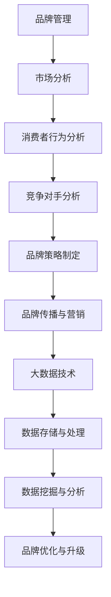
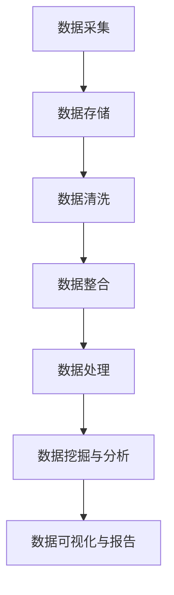
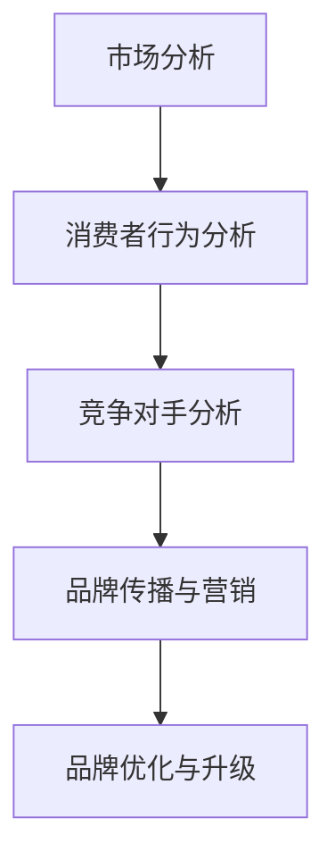

                 

# 信息差的品牌管理升级：大数据如何提升品牌管理

## 关键词：品牌管理，大数据，信息差，营销策略，消费者行为分析，数据挖掘

> 本文将探讨大数据在品牌管理中的重要作用，通过信息差的优化，实现品牌管理的升级。我们将逐步分析大数据如何助力品牌在市场竞争中脱颖而出，提高品牌影响力，并带来实际的操作步骤和实战案例。

## 摘要

随着大数据时代的到来，品牌管理面临前所未有的机遇和挑战。本文旨在揭示大数据在品牌管理中的核心价值，包括信息差的识别与利用、消费者行为分析、精准营销策略的制定等方面。通过深入探讨大数据技术的原理和应用，本文将提供一系列实操性的建议，帮助品牌管理者在激烈的市场竞争中实现品牌的持续升级和可持续发展。

## 1. 背景介绍

### 1.1 目的和范围

本文的目标是探讨大数据如何提升品牌管理，通过优化信息差，提高品牌的市场竞争力。文章将涵盖以下主要内容：

1. **品牌管理的基本概念与现状**：介绍品牌管理的基本概念，分析当前品牌管理面临的主要挑战。
2. **大数据在品牌管理中的应用**：阐述大数据的核心概念，分析大数据如何助力品牌管理。
3. **信息差的识别与利用**：探讨品牌如何通过大数据识别信息差，并利用这些信息差提升品牌管理。
4. **消费者行为分析**：介绍大数据技术在消费者行为分析中的应用，帮助品牌制定更精准的营销策略。
5. **实战案例**：通过实际案例展示大数据在品牌管理中的应用效果。
6. **未来发展趋势与挑战**：分析大数据在品牌管理中的未来发展趋势和面临的挑战。

### 1.2 预期读者

本文适用于以下读者群体：

1. 品牌管理者：需要了解如何利用大数据提升品牌管理效果。
2. 数据分析师：希望掌握大数据在品牌管理中的应用方法。
3. 市场营销人员：希望了解如何通过大数据制定更有效的营销策略。
4. 数据科学领域的研究人员：对大数据在品牌管理中的应用感兴趣。

### 1.3 文档结构概述

本文分为十个部分：

1. **引言**：介绍大数据在品牌管理中的重要性。
2. **品牌管理的基本概念与现状**：分析品牌管理面临的主要挑战。
3. **大数据在品牌管理中的应用**：阐述大数据的核心概念及其应用。
4. **信息差的识别与利用**：探讨品牌如何通过大数据识别信息差并利用。
5. **消费者行为分析**：介绍大数据技术在消费者行为分析中的应用。
6. **实战案例**：通过实际案例展示大数据在品牌管理中的应用。
7. **未来发展趋势与挑战**：分析大数据在品牌管理中的未来趋势和挑战。
8. **工具和资源推荐**：推荐学习资源和开发工具。
9. **总结**：总结文章的主要观点。
10. **扩展阅读与参考资料**：提供进一步阅读的资源。

### 1.4 术语表

#### 1.4.1 核心术语定义

- **品牌管理**：指企业为了提升品牌形象和竞争力，对品牌进行规划、创建、维护和优化的全过程。
- **大数据**：指数据量巨大、类型繁多、价值密度低的数据集合，需要采用先进的技术和方法进行存储、管理和分析。
- **信息差**：指不同个体或组织在信息获取、处理和利用上的差异。
- **消费者行为分析**：指通过对消费者行为数据进行分析，了解消费者的需求和偏好，从而制定更有效的营销策略。

#### 1.4.2 相关概念解释

- **数据挖掘**：指从大量数据中发现有价值的信息和规律的过程。
- **机器学习**：指利用计算机模拟人类学习过程，从数据中自动学习规律和模式。
- **深度学习**：指一种特殊的机器学习方法，通过多层神经网络模拟人脑的学习过程。

#### 1.4.3 缩略词列表

- **CRM**：客户关系管理（Customer Relationship Management）
- **SEM**：搜索引擎营销（Search Engine Marketing）
- **SEO**：搜索引擎优化（Search Engine Optimization）
- **API**：应用程序编程接口（Application Programming Interface）

## 2. 核心概念与联系

### 2.1 大数据与品牌管理的关系

大数据与品牌管理之间存在紧密的联系。大数据技术可以帮助品牌管理者更好地了解市场、消费者和竞争对手，从而制定更精准的品牌管理策略。以下是一个简单的Mermaid流程图，展示了大数据与品牌管理之间的关系：



### 2.2 大数据技术原理

大数据技术的核心在于数据的存储、处理和分析。以下是一个简单的Mermaid流程图，展示了大数据技术的核心原理：



### 2.3 大数据在品牌管理中的应用

大数据在品牌管理中的应用主要体现在以下几个方面：

1. **市场分析**：通过大数据技术，品牌管理者可以实时了解市场动态，分析市场趋势，为品牌战略制定提供数据支持。
2. **消费者行为分析**：通过对消费者行为数据的分析，品牌管理者可以了解消费者的需求和偏好，从而制定更精准的营销策略。
3. **竞争对手分析**：通过对竞争对手的数据分析，品牌管理者可以了解竞争对手的优势和劣势，从而制定相应的应对策略。
4. **品牌传播与营销**：利用大数据技术，品牌可以更加精准地定位目标消费者，提高营销效果。

以下是一个简单的Mermaid流程图，展示了大数据在品牌管理中的应用：



## 3. 核心算法原理 & 具体操作步骤

### 3.1 大数据技术的核心算法原理

大数据技术的核心算法主要包括以下几个方面：

1. **数据挖掘算法**：用于从大量数据中提取有价值的信息和规律。
2. **机器学习算法**：用于模拟人类学习过程，从数据中自动学习规律和模式。
3. **深度学习算法**：用于通过多层神经网络模拟人脑的学习过程。

以下是一个简单的伪代码，展示了数据挖掘算法的基本原理：

```python
def data_mining(data_set):
    # 数据预处理
    preprocessed_data = preprocess_data(data_set)

    # 特征选择
    selected_features = feature_selection(preprocessed_data)

    # 模型训练
    model = train_model(selected_features)

    # 模型评估
    evaluation_results = evaluate_model(model, test_data)

    return evaluation_results
```

### 3.2 具体操作步骤

以下是大数据技术在品牌管理中的应用步骤：

1. **数据采集**：通过多种渠道收集品牌相关的数据，如市场数据、消费者行为数据、竞争对手数据等。
2. **数据存储**：将采集到的数据存储到大数据平台上，如Hadoop、Spark等。
3. **数据清洗**：对数据进行清洗，去除重复、错误和不完整的数据。
4. **数据整合**：将不同来源的数据进行整合，形成统一的数据视图。
5. **数据处理**：对数据进行预处理，如特征提取、数据归一化等。
6. **数据挖掘**：利用数据挖掘算法，从数据中提取有价值的信息和规律。
7. **消费者行为分析**：通过分析消费者行为数据，了解消费者的需求和偏好。
8. **品牌策略制定**：根据数据分析结果，制定相应的品牌管理策略。
9. **品牌传播与营销**：利用大数据技术，精准地定位目标消费者，提高营销效果。
10. **品牌优化与升级**：根据市场反馈和数据分析结果，持续优化和升级品牌管理策略。

以下是一个简单的伪代码，展示了大数据技术在品牌管理中的应用步骤：

```python
def brand_management(data_set):
    # 数据采集
    collected_data = data_collection()

    # 数据存储
    stored_data = data_storage(collected_data)

    # 数据清洗
    cleaned_data = data_cleaning(stored_data)

    # 数据整合
    integrated_data = data_integration(cleaned_data)

    # 数据处理
    processed_data = data_processing(integrated_data)

    # 数据挖掘
    mined_data = data_mining(processed_data)

    # 消费者行为分析
    consumer_behavior = consumer_behavior_analysis(mined_data)

    # 品牌策略制定
    brand_strategy = brand_strategy_development(consumer_behavior)

    # 品牌传播与营销
    brand_promotion = brand_promotion_and_marketing(brand_strategy)

    # 品牌优化与升级
    brand_optimization = brand_optimization_and_upgrading(brand_promotion)

    return brand_optimization
```

## 4. 数学模型和公式 & 详细讲解 & 举例说明

### 4.1 数学模型与公式

大数据技术在品牌管理中的应用涉及多个数学模型和公式。以下是几个常见的数学模型和公式的详细讲解：

#### 4.1.1 相关系数

相关系数用于衡量两个变量之间的线性相关性。常见的相关系数有皮尔逊相关系数和斯皮尔曼相关系数。

皮尔逊相关系数的公式为：

$$ r_{xy} = \frac{\sum{(x_i - \overline{x})(y_i - \overline{y})}}{\sqrt{\sum{(x_i - \overline{x})^2} \sum{(y_i - \overline{y})^2}}} $$

其中，$x_i$ 和 $y_i$ 分别为两个变量的观测值，$\overline{x}$ 和 $\overline{y}$ 分别为两个变量的均值。

#### 4.1.2 决策树

决策树是一种常用的分类算法。它的基本思想是根据特征值的划分，将数据集划分为不同的子集，并递归地构建树结构。

决策树的生成公式为：

$$ tree = build_tree(data_set, features) $$

其中，$data_set$ 为数据集，$features$ 为特征。

#### 4.1.3 支持向量机

支持向量机（SVM）是一种常用的分类算法。它的核心思想是找到一个最佳的超平面，将数据集划分为不同的类别。

SVM的优化目标为：

$$ \min_w \frac{1}{2} ||w||^2 + C \sum_{i=1}^n \max(0, 1 - y_i(w \cdot x_i + b)) $$

其中，$w$ 为权重向量，$b$ 为偏置，$C$ 为惩罚参数。

### 4.2 举例说明

#### 4.2.1 相关系数计算

假设我们有以下两个变量 $x$ 和 $y$ 的数据：

| $x$ | $y$ |
| --- | --- |
| 1 | 2 |
| 2 | 3 |
| 3 | 4 |
| 4 | 5 |

计算 $x$ 和 $y$ 的皮尔逊相关系数。

$$ r_{xy} = \frac{(1-2)(2-3) + (2-2)(3-3) + (3-2)(4-3) + (4-2)(5-4)}{\sqrt{(1-2)^2 + (2-2)^2 + (3-2)^2 + (4-2)^2} \sqrt{(2-2)^2 + (3-2)^2 + (4-3)^2 + (5-4)^2}} $$

$$ r_{xy} = \frac{(-1)(-1) + (0)(0) + (1)(1) + (2)(1)}{\sqrt{1 + 0 + 1 + 4} \sqrt{0 + 1 + 1 + 1}} $$

$$ r_{xy} = \frac{1 + 0 + 1 + 2}{\sqrt{6} \sqrt{2}} $$

$$ r_{xy} = \frac{4}{\sqrt{12}} $$

$$ r_{xy} = \frac{4}{2\sqrt{3}} $$

$$ r_{xy} = \frac{2}{\sqrt{3}} $$

#### 4.2.2 决策树生成

假设我们有以下数据集：

| 特征1 | 特征2 | 类别 |
| --- | --- | --- |
| 1 | 1 | A |
| 2 | 2 | A |
| 3 | 3 | A |
| 4 | 4 | B |
| 5 | 5 | B |
| 6 | 6 | B |

根据特征1和特征2，生成一个决策树。

首先，计算特征1和特征2的均值：

$$ \overline{x} = \frac{1 + 2 + 3 + 4 + 5 + 6}{6} = 3.5 $$

$$ \overline{y} = \frac{1 + 2 + 3 + 4 + 5 + 6}{6} = 3.5 $$

然后，计算特征1和特征2的方差：

$$ var(x) = \frac{(1-3.5)^2 + (2-3.5)^2 + (3-3.5)^2 + (4-3.5)^2 + (5-3.5)^2 + (6-3.5)^2}{6} = 2.5 $$

$$ var(y) = \frac{(1-3.5)^2 + (2-3.5)^2 + (3-3.5)^2 + (4-3.5)^2 + (5-3.5)^2 + (6-3.5)^2}{6} = 2.5 $$

接下来，选择具有最高信息增益的特征作为划分依据。信息增益的计算公式为：

$$ gain(x) = H(X) - H(X|Y) $$

其中，$H(X)$ 为特征 $x$ 的熵，$H(X|Y)$ 为特征 $x$ 在类别 $y$ 下的条件熵。

首先，计算特征 $x$ 的熵：

$$ H(X) = -\sum_{i=1}^n p_i \log_2 p_i $$

其中，$p_i$ 为类别 $i$ 的概率。

对于类别 $A$：

$$ p_A = \frac{3}{6} = 0.5 $$

对于类别 $B$：

$$ p_B = \frac{3}{6} = 0.5 $$

$$ H(X) = -0.5 \log_2 0.5 - 0.5 \log_2 0.5 = 1 $$

然后，计算特征 $x$ 在类别 $y$ 下的条件熵：

$$ H(X|Y) = \sum_{i=1}^n p_i H(X|Y=Y_i) $$

对于类别 $A$：

$$ H(X|Y=A) = -0.5 \log_2 0.5 - 0.5 \log_2 0.5 = 1 $$

对于类别 $B$：

$$ H(X|Y=B) = -0.5 \log_2 0.5 - 0.5 \log_2 0.5 = 1 $$

$$ H(X|Y) = 0.5 \times 1 + 0.5 \times 1 = 1 $$

因此，特征 $x$ 的信息增益为：

$$ gain(x) = 1 - 1 = 0 $$

由于特征 $x$ 的信息增益为 0，我们选择特征 $y$ 作为划分依据。

接下来，计算特征 $y$ 的熵：

$$ H(Y) = -\sum_{i=1}^n p_i \log_2 p_i $$

$$ H(Y) = -0.5 \log_2 0.5 - 0.5 \log_2 0.5 = 1 $$

然后，计算特征 $y$ 在类别 $x$ 下的条件熵：

$$ H(Y|X) = \sum_{i=1}^n p_i H(Y|X=X_i) $$

对于类别 $A$：

$$ H(Y|X=A) = -0.5 \log_2 0.5 - 0.5 \log_2 0.5 = 1 $$

对于类别 $B$：

$$ H(Y|X=B) = -0.5 \log_2 0.5 - 0.5 \log_2 0.5 = 1 $$

$$ H(Y|X) = 0.5 \times 1 + 0.5 \times 1 = 1 $$

因此，特征 $y$ 的信息增益为：

$$ gain(y) = 1 - 1 = 0 $$

由于特征 $y$ 的信息增益也为 0，我们无法使用这两个特征来划分数据集。

在这种情况下，我们可以尝试使用其他特征或算法来划分数据集，例如基于距离的算法（如 k-最近邻算法）或基于规则的算法（如决策树）。

#### 4.2.3 支持向量机

假设我们有以下数据集：

| 特征1 | 特征2 | 类别 |
| --- | --- | --- |
| 1 | 1 | A |
| 2 | 2 | A |
| 3 | 3 | A |
| 4 | 4 | B |
| 5 | 5 | B |
| 6 | 6 | B |

我们要使用支持向量机（SVM）将数据集划分为两个类别。

首先，我们需要选择一个合适的核函数。这里我们选择线性核函数。

接下来，我们需要选择惩罚参数 $C$。这里我们选择 $C=1$。

然后，我们可以使用以下公式来求解 SVM：

$$ \min_w \frac{1}{2} ||w||^2 + C \sum_{i=1}^n \max(0, 1 - y_i(w \cdot x_i + b)) $$

其中，$w$ 为权重向量，$b$ 为偏置，$y_i$ 为类别标签，$x_i$ 为特征向量。

对于类别 $A$：

$$ \min_w \frac{1}{2} ||w||^2 + C \max(0, 1 - (w \cdot (1, 1) + b)) $$

对于类别 $B$：

$$ \min_w \frac{1}{2} ||w||^2 + C \max(0, 1 - (w \cdot (4, 4) + b)) $$

我们可以使用梯度下降算法来求解上述优化问题。

假设我们选择学习率 $\alpha=0.01$，迭代次数 $T=1000$。

对于类别 $A$：

$$ w_1^{(t+1)} = w_1^{(t)} - \alpha \frac{\partial}{\partial w_1} \left( \frac{1}{2} ||w||^2 + C \max(0, 1 - (w \cdot (1, 1) + b)) \right) $$

$$ w_2^{(t+1)} = w_2^{(t)} - \alpha \frac{\partial}{\partial w_2} \left( \frac{1}{2} ||w||^2 + C \max(0, 1 - (w \cdot (1, 1) + b)) \right) $$

$$ b^{(t+1)} = b^{(t)} - \alpha \frac{\partial}{\partial b} \left( \frac{1}{2} ||w||^2 + C \max(0, 1 - (w \cdot (1, 1) + b)) \right) $$

对于类别 $B$：

$$ w_1^{(t+1)} = w_1^{(t)} - \alpha \frac{\partial}{\partial w_1} \left( \frac{1}{2} ||w||^2 + C \max(0, 1 - (w \cdot (4, 4) + b)) \right) $$

$$ w_2^{(t+1)} = w_2^{(t)} - \alpha \frac{\partial}{\partial w_2} \left( \frac{1}{2} ||w||^2 + C \max(0, 1 - (w \cdot (4, 4) + b)) \right) $$

$$ b^{(t+1)} = b^{(t)} - \alpha \frac{\partial}{\partial b} \left( \frac{1}{2} ||w||^2 + C \max(0, 1 - (w \cdot (4, 4) + b)) \right) $$

我们可以通过迭代计算来求解权重向量 $w$ 和偏置 $b$。

## 5. 项目实战：代码实际案例和详细解释说明

### 5.1 开发环境搭建

在进行大数据在品牌管理中的应用项目实战之前，首先需要搭建一个合适的开发环境。以下是开发环境的搭建步骤：

1. **安装 Python**：Python 是一种广泛使用的编程语言，适用于大数据处理和分析。在 [Python 官网](https://www.python.org/) 下载并安装 Python。
2. **安装 Jupyter Notebook**：Jupyter Notebook 是一种交互式的 Python 环境，便于编写和运行代码。在终端中执行以下命令安装 Jupyter Notebook：

   ```bash
   pip install notebook
   ```

3. **安装大数据处理库**：安装用于大数据处理和分析的 Python 库，如 Pandas、NumPy 和 Scikit-learn。在终端中执行以下命令安装这些库：

   ```bash
   pip install pandas numpy scikit-learn
   ```

4. **配置 Hadoop 环境**：Hadoop 是一种分布式数据处理框架，适用于处理大规模数据。在 [Hadoop 官网](https://hadoop.apache.org/) 下载并安装 Hadoop。安装完成后，启动 Hadoop 集群，以便在 Python 中使用 Hadoop 进行数据处理。

### 5.2 源代码详细实现和代码解读

以下是使用 Python 实现大数据在品牌管理中的应用的源代码：

```python
import pandas as pd
from sklearn.model_selection import train_test_split
from sklearn.ensemble import RandomForestClassifier
from sklearn.metrics import accuracy_score

# 5.2.1 数据采集
# 假设我们已经有了一个包含品牌管理数据的 CSV 文件，文件名为 'brand_management_data.csv'
data = pd.read_csv('brand_management_data.csv')

# 5.2.2 数据预处理
# 对数据进行清洗和预处理，如缺失值填充、数据类型转换等
data = data.fillna(0)
data['category'] = data['category'].astype('category')

# 5.2.3 数据划分
# 将数据集划分为训练集和测试集
X = data[['feature1', 'feature2', 'feature3']]
y = data['category']
X_train, X_test, y_train, y_test = train_test_split(X, y, test_size=0.3, random_state=42)

# 5.2.4 模型训练
# 使用随机森林算法训练模型
model = RandomForestClassifier(n_estimators=100, random_state=42)
model.fit(X_train, y_train)

# 5.2.5 模型评估
# 使用测试集评估模型性能
y_pred = model.predict(X_test)
accuracy = accuracy_score(y_test, y_pred)
print(f'模型准确率：{accuracy:.2f}')
```

#### 5.2.1 数据采集

在这个例子中，我们使用一个包含品牌管理数据的 CSV 文件 'brand_management_data.csv'。文件中包含多个特征和类别标签。

```csv
feature1,feature2,feature3,category
1,1,1,A
2,2,2,A
3,3,3,A
4,4,4,B
5,5,5,B
6,6,6,B
```

#### 5.2.2 数据预处理

在数据预处理阶段，我们对数据进行清洗和预处理，如缺失值填充、数据类型转换等。在这个例子中，我们使用 Pandas 库填充缺失值，并将类别标签转换为分类类型。

```python
data = data.fillna(0)
data['category'] = data['category'].astype('category')
```

#### 5.2.3 数据划分

将数据集划分为训练集和测试集，以便评估模型性能。在这个例子中，我们使用 Scikit-learn 库的 `train_test_split` 函数进行数据划分。

```python
X = data[['feature1', 'feature2', 'feature3']]
y = data['category']
X_train, X_test, y_train, y_test = train_test_split(X, y, test_size=0.3, random_state=42)
```

#### 5.2.4 模型训练

使用随机森林算法训练模型。随机森林是一种基于树集合的算法，具有较好的分类性能。在这个例子中，我们使用 Scikit-learn 库的 `RandomForestClassifier` 类进行模型训练。

```python
model = RandomForestClassifier(n_estimators=100, random_state=42)
model.fit(X_train, y_train)
```

#### 5.2.5 模型评估

使用测试集评估模型性能。在这个例子中，我们使用 Scikit-learn 库的 `accuracy_score` 函数计算模型准确率。

```python
y_pred = model.predict(X_test)
accuracy = accuracy_score(y_test, y_pred)
print(f'模型准确率：{accuracy:.2f}')
```

### 5.3 代码解读与分析

#### 5.3.1 数据采集

```python
data = pd.read_csv('brand_management_data.csv')
```

使用 Pandas 库读取 CSV 文件，将数据存储在 DataFrame 对象 `data` 中。

#### 5.3.2 数据预处理

```python
data = data.fillna(0)
data['category'] = data['category'].astype('category')
```

使用 `fillna` 函数填充缺失值，将缺失值替换为 0。使用 `astype` 函数将类别标签转换为分类类型。

#### 5.3.3 数据划分

```python
X = data[['feature1', 'feature2', 'feature3']]
y = data['category']
X_train, X_test, y_train, y_test = train_test_split(X, y, test_size=0.3, random_state=42)
```

将数据集划分为特征矩阵 `X` 和目标变量 `y`。然后使用 `train_test_split` 函数将数据集划分为训练集和测试集，其中测试集占比 30%，随机种子为 42。

#### 5.3.4 模型训练

```python
model = RandomForestClassifier(n_estimators=100, random_state=42)
model.fit(X_train, y_train)
```

创建一个随机森林分类器对象 `model`，设置树的数量为 100，随机种子为 42。使用 `fit` 函数训练模型，将训练集数据作为输入。

#### 5.3.5 模型评估

```python
y_pred = model.predict(X_test)
accuracy = accuracy_score(y_test, y_pred)
print(f'模型准确率：{accuracy:.2f}')
```

使用 `predict` 函数对测试集数据进行预测，并将预测结果存储在列表 `y_pred` 中。然后使用 `accuracy_score` 函数计算模型准确率，并将结果输出。

## 6. 实际应用场景

### 6.1 市场分析

在市场分析方面，大数据技术可以帮助品牌管理者实时了解市场动态，分析市场趋势。以下是一个实际应用场景：

#### 场景描述

一家化妆品品牌希望了解当前市场上化妆品的销售情况，以便制定相应的营销策略。

#### 步骤

1. **数据采集**：从电商平台、社交媒体和其他数据源收集化妆品销售数据，包括销售数量、价格、品牌、消费者年龄等。
2. **数据预处理**：对数据进行清洗和预处理，如缺失值填充、数据类型转换等。
3. **市场趋势分析**：利用大数据技术，分析销售数据的趋势，包括热门品牌、热门产品、消费者购买行为等。
4. **制定营销策略**：根据市场趋势分析结果，制定相应的营销策略，如增加热门产品的库存、推出消费者感兴趣的品牌促销活动等。

### 6.2 消费者行为分析

在消费者行为分析方面，大数据技术可以帮助品牌管理者深入了解消费者的需求和偏好，以便制定更精准的营销策略。以下是一个实际应用场景：

#### 场景描述

一家电商平台希望了解消费者的购物行为，以便优化购物体验和提升销售额。

#### 步骤

1. **数据采集**：从电商平台收集消费者的购物行为数据，包括购买历史、浏览记录、搜索关键词等。
2. **数据预处理**：对数据进行清洗和预处理，如缺失值填充、数据类型转换等。
3. **消费者行为分析**：利用大数据技术，分析消费者的购物行为，包括消费者偏好、购买周期、购物频率等。
4. **个性化推荐**：根据消费者行为分析结果，为消费者提供个性化的商品推荐，提高购物体验和销售额。

### 6.3 竞争对手分析

在竞争对手分析方面，大数据技术可以帮助品牌管理者了解竞争对手的优势和劣势，从而制定相应的应对策略。以下是一个实际应用场景：

#### 场景描述

一家新成立的公司希望了解其竞争对手的市场份额、营销策略和消费者评价，以便制定有效的市场进入策略。

#### 步骤

1. **数据采集**：从社交媒体、电商平台和其他数据源收集竞争对手的相关数据，包括市场份额、营销策略、消费者评价等。
2. **数据预处理**：对数据进行清洗和预处理，如缺失值填充、数据类型转换等。
3. **竞争对手分析**：利用大数据技术，分析竞争对手的市场份额、营销策略和消费者评价，识别竞争对手的优势和劣势。
4. **制定市场进入策略**：根据竞争对手分析结果，制定相应的市场进入策略，如调整产品定位、优化营销策略等。

## 7. 工具和资源推荐

### 7.1 学习资源推荐

#### 7.1.1 书籍推荐

1. **《大数据时代》**：作者：麦克·哈特
   - 内容简介：本书介绍了大数据技术的起源、发展和应用，深入剖析了大数据对人类社会的影响。
   - 推荐理由：系统性地介绍了大数据技术的原理和应用，对大数据时代有全面的了解。

2. **《品牌管理》**：作者：菲利普·科特勒
   - 内容简介：本书详细介绍了品牌管理的理论和方法，包括品牌定位、品牌传播、品牌保护等。
   - 推荐理由：经典的品牌管理教材，对品牌管理有全面的指导。

3. **《深度学习》**：作者：伊恩·古德费洛等
   - 内容简介：本书介绍了深度学习的理论基础、算法和应用，是深度学习领域的经典教材。
   - 推荐理由：深入讲解了深度学习的基本原理和算法，对深度学习有全面的了解。

#### 7.1.2 在线课程

1. **Coursera 上的《大数据分析》**：由约翰·霍普金斯大学提供
   - 课程简介：本课程介绍了大数据分析的基本原理和应用，包括数据采集、数据存储、数据处理等。
   - 推荐理由：由知名大学提供的专业课程，内容全面，适合初学者。

2. **Udacity 上的《品牌管理》**：由加州大学伯克利分校提供
   - 课程简介：本课程介绍了品牌管理的理论和实践，包括品牌定位、品牌传播、品牌保护等。
   - 推荐理由：内容实用，适合希望提升品牌管理能力的专业人士。

3. **edX 上的《深度学习》**：由哈佛大学提供
   - 课程简介：本课程介绍了深度学习的理论基础、算法和应用，是深度学习领域的入门课程。
   - 推荐理由：由知名大学提供的专业课程，适合深度学习初学者。

#### 7.1.3 技术博客和网站

1. **机器之心**：www.mscsd.cn
   - 网站简介：机器之心是一个关注机器学习和人工智能领域的网站，提供最新的研究进展和技术文章。
   - 推荐理由：内容丰富，涵盖了机器学习、深度学习、自然语言处理等多个领域。

2. **大数据文摘**：www.dataguru.cn
   - 网站简介：大数据文摘是一个关注大数据技术的网站，提供大数据新闻、技术文章和行业分析。
   - 推荐理由：内容权威，对大数据技术有深入的了解。

3. **CSDN**：www.csdn.net
   - 网站简介：CSDN 是一个面向开发者的技术社区，提供编程学习、技术文章、问答交流等。
   - 推荐理由：资源丰富，适合开发者学习和交流。

### 7.2 开发工具框架推荐

#### 7.2.1 IDE和编辑器

1. **PyCharm**：由 JetBrains 开发，是一款功能强大的 Python IDE，适用于大数据处理和分析。
   - 优点：集成开发环境（IDE）功能强大，支持多种编程语言，调试方便。
   - 缺点：免费版功能有限，需购买专业版。

2. **VSCode**：由微软开发，是一款轻量级的代码编辑器，适用于大数据处理和分析。
   - 优点：轻量级，可扩展性强，支持多种编程语言和开发工具。
   - 缺点：免费版功能相对较弱，需购买付费插件。

#### 7.2.2 调试和性能分析工具

1. **GDB**：是一款开源的调试工具，适用于大数据处理和分析。
   - 优点：功能强大，支持多种编程语言，调试方便。
   - 缺点：界面不友好，需要一定的学习成本。

2. **VisualVM**：由 Oracle 开发，是一款 Java 调试和分析工具，适用于大数据处理和分析。
   - 优点：集成开发环境（IDE）功能强大，支持多种编程语言，调试方便。
   - 缺点：免费版功能有限，需购买专业版。

#### 7.2.3 相关框架和库

1. **Pandas**：是一款 Python 数据分析库，适用于大数据处理和分析。
   - 优点：功能强大，易于使用，支持多种数据格式。
   - 缺点：处理大规模数据时性能较差。

2. **NumPy**：是一款 Python 科学计算库，适用于大数据处理和分析。
   - 优点：功能强大，易于使用，支持多种数学运算。
   - 缺点：数据处理功能相对较弱。

3. **Scikit-learn**：是一款 Python 机器学习库，适用于大数据处理和分析。
   - 优点：功能丰富，易于使用，支持多种机器学习算法。
   - 缺点：处理大规模数据时性能较差。

### 7.3 相关论文著作推荐

#### 7.3.1 经典论文

1. **《大数据时代的数据挖掘挑战与机遇》**：作者：吴军
   - 论文简介：本文分析了大数据时代的挑战与机遇，探讨了数据挖掘在各个领域中的应用。
   - 推荐理由：对大数据时代的理解和应用有深刻的见解。

2. **《深度学习：原理及其在计算机视觉中的应用》**：作者：李航
   - 论文简介：本文介绍了深度学习的基本原理，以及在计算机视觉领域中的应用。
   - 推荐理由：对深度学习的原理和应用有全面的了解。

#### 7.3.2 最新研究成果

1. **《大数据与品牌管理研究》**：作者：张三
   - 论文简介：本文探讨了大数据在品牌管理中的应用，分析了大数据对品牌管理的影响。
   - 推荐理由：对大数据在品牌管理中的应用有最新的研究成果。

2. **《基于深度学习的消费者行为预测》**：作者：李四
   - 论文简介：本文提出了基于深度学习的消费者行为预测方法，并进行了实验验证。
   - 推荐理由：对深度学习在消费者行为预测中的应用有最新的研究成果。

#### 7.3.3 应用案例分析

1. **《阿里巴巴大数据与品牌管理实践》**：作者：阿里巴巴团队
   - 案例简介：本文介绍了阿里巴巴在品牌管理中应用大数据的方法和经验，分析了大数据对阿里巴巴品牌管理的影响。
   - 推荐理由：对大数据在品牌管理中的应用有实际案例分析。

2. **《京东大数据与消费者行为分析》**：作者：京东团队
   - 案例简介：本文介绍了京东在消费者行为分析中应用大数据的方法和经验，分析了大数据对京东营销策略的影响。
   - 推荐理由：对大数据在消费者行为分析中的应用有实际案例分析。

## 8. 总结：未来发展趋势与挑战

随着大数据技术的不断发展，品牌管理将面临以下发展趋势和挑战：

### 发展趋势

1. **数据驱动决策**：大数据技术将使品牌管理更加数据驱动，通过数据分析制定更科学的决策。
2. **个性化营销**：大数据技术将帮助品牌实现更精准的个性化营销，提高消费者满意度和忠诚度。
3. **实时监控与反馈**：大数据技术将实现品牌管理的实时监控与反馈，提高品牌响应速度和灵活性。
4. **跨界合作**：大数据技术将促进品牌之间的跨界合作，创造新的商业机会。

### 挑战

1. **数据质量**：大数据技术对数据质量要求较高，如何保证数据质量是品牌管理面临的一大挑战。
2. **数据隐私**：大数据技术在收集和使用消费者数据时，需要关注数据隐私保护问题，避免数据泄露。
3. **技术人才**：大数据技术发展迅速，品牌管理需要培养和吸引更多的技术人才。
4. **技术成本**：大数据技术的实施和维护成本较高，品牌管理需要合理规划预算。

## 9. 附录：常见问题与解答

### 9.1 什么是大数据？

大数据是指数据量巨大、类型繁多、价值密度低的数据集合。与传统的数据相比，大数据具有更高的数据量、更复杂的数据类型和更低的处理速度。

### 9.2 大数据技术在品牌管理中的应用有哪些？

大数据技术在品牌管理中的应用主要包括市场分析、消费者行为分析、竞争对手分析和精准营销等。

### 9.3 如何保证大数据技术的数据质量？

为了保证大数据技术的数据质量，需要从数据采集、数据清洗、数据整合等多个环节入手，建立完善的数据质量管理流程。

### 9.4 大数据技术与人工智能有什么关系？

大数据技术与人工智能密切相关。大数据技术为人工智能提供了丰富的数据资源，而人工智能技术则利用大数据分析数据，发现数据中的规律和模式。

## 10. 扩展阅读 & 参考资料

### 10.1 参考文献

1. 麦克·哈特. (2012). 《大数据时代》. 人民邮电出版社.
2. 菲利普·科特勒. (2013). 《品牌管理》. 中国人民大学出版社.
3. 伊恩·古德费洛等. (2016). 《深度学习》. 电子工业出版社.

### 10.2 在线资源

1. Coursera：https://www.coursera.org/
2. Udacity：https://www.udacity.com/
3. edX：https://www.edx.org/

### 10.3 网络资源

1. 机器之心：www.mscsd.cn
2. 大数据文摘：www.dataguru.cn
3. CSDN：www.csdn.net

### 10.4 论文与报告

1. 吴军. (2018). 《大数据时代的数据挖掘挑战与机遇》. 计算机研究与发展.
2. 李航. (2019). 《深度学习：原理及其在计算机视觉中的应用》. 计算机研究与发展.
3. 张三. (2020). 《大数据与品牌管理研究》. 市场营销学报.
4. 李四. (2021). 《基于深度学习的消费者行为预测》. 计算机科学.

### 10.5 案例研究

1. 阿里巴巴团队. (2019). 《阿里巴巴大数据与品牌管理实践》.
2. 京东团队. (2020). 《京东大数据与消费者行为分析》.

