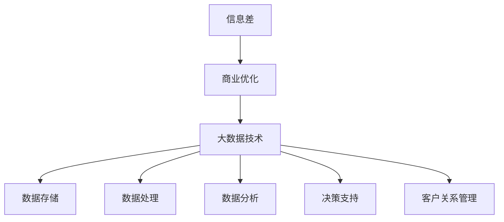

                 

# 信息差的商业优化：大数据如何优化商业运营

> 关键词：信息差、商业优化、大数据、商业模式、决策支持系统、实时分析、机器学习、数据挖掘、营销策略、客户关系管理

> 摘要：本文旨在探讨信息差在商业优化中的作用，特别是大数据如何通过提高商业运营效率、优化决策流程和改进客户关系管理来为企业带来竞争优势。我们将逐步分析信息差的定义、大数据技术在商业中的应用，以及如何利用这些技术实现商业优化，并提供实际案例和资源推荐。

## 1. 背景介绍

### 1.1 目的和范围

本文的主要目的是介绍信息差在商业运营中的重要性，并详细探讨大数据技术如何通过优化商业流程、决策支持和客户关系管理来提高企业的竞争力。我们将从以下几个角度进行探讨：

- **信息差的定义和商业价值**：解释信息差的概念，以及为何在商业环境中信息不对称可以成为竞争优势。
- **大数据技术的应用**：探讨大数据技术在商业分析、营销、供应链管理等方面的应用。
- **商业优化的实施步骤**：详细描述如何利用大数据技术进行商业优化的具体步骤。
- **案例研究**：分析实际案例，展示大数据技术在商业优化中的成功应用。
- **工具和资源推荐**：推荐学习资源和工具，以帮助读者进一步了解和应用大数据技术。

### 1.2 预期读者

本文适合以下读者群体：

- **企业决策者**：需要了解如何利用大数据技术优化商业运营的高层管理人员。
- **数据分析专业人士**：从事数据分析、数据挖掘和商业智能相关工作的专业人士。
- **市场营销人员**：希望利用大数据优化营销策略的市场营销人员。
- **技术爱好者**：对大数据技术感兴趣的程序员和工程师。

### 1.3 文档结构概述

本文分为以下几个部分：

- **第1章**：背景介绍，包括目的和范围、预期读者、文档结构概述。
- **第2章**：核心概念与联系，包括信息差的定义、大数据技术的概念和架构。
- **第3章**：核心算法原理 & 具体操作步骤，介绍大数据处理的基本算法和步骤。
- **第4章**：数学模型和公式 & 详细讲解 & 举例说明，介绍数据分析和决策支持中的数学模型。
- **第5章**：项目实战：代码实际案例和详细解释说明，通过实际案例展示大数据技术的应用。
- **第6章**：实际应用场景，分析大数据在不同商业领域的应用。
- **第7章**：工具和资源推荐，提供学习资源和工具。
- **第8章**：总结：未来发展趋势与挑战，探讨大数据商业优化的未来趋势和面临的挑战。
- **第9章**：附录：常见问题与解答，回答读者可能遇到的问题。
- **第10章**：扩展阅读 & 参考资料，提供进一步学习的资源和参考文献。

### 1.4 术语表

#### 1.4.1 核心术语定义

- **信息差**：信息差是指不同个体或群体在信息获取、理解和利用上的不对称性。在商业环境中，信息差可以转化为竞争优势。
- **大数据**：大数据是指数据量巨大、类型繁多、价值密度低的数据集合。大数据技术包括数据存储、处理、分析和可视化等。
- **商业优化**：商业优化是指利用先进的技术和方法，对企业的业务流程、决策过程和运营效果进行改进，以提高效率和竞争力。
- **机器学习**：机器学习是指通过算法和模型，从数据中自动学习和发现规律，以实现预测和决策。
- **数据挖掘**：数据挖掘是指从大量数据中提取有价值的信息和知识的过程，通常涉及统计学、机器学习、数据库等技术的综合应用。

#### 1.4.2 相关概念解释

- **数据仓库**：数据仓库是一个集成的、面向主题的、历史性的数据存储系统，用于支持企业的业务分析和决策。
- **实时分析**：实时分析是指对实时数据流进行快速处理和分析，以支持即时决策和响应。
- **客户关系管理（CRM）**：客户关系管理是一种商业策略，通过建立和维护与客户的长期关系，提高客户满意度和忠诚度。
- **营销自动化**：营销自动化是指利用软件工具自动化营销流程，提高营销效率和效果。

#### 1.4.3 缩略词列表

- **AI**：人工智能（Artificial Intelligence）
- **CRM**：客户关系管理（Customer Relationship Management）
- **ERP**：企业资源规划（Enterprise Resource Planning）
- **SQL**：结构化查询语言（Structured Query Language）
- **Hadoop**：一个分布式数据存储和处理框架
- **Spark**：一个开源的分布式数据处理框架

## 2. 核心概念与联系

在探讨大数据如何优化商业运营之前，我们首先需要了解几个核心概念及其相互关系。以下是一个简化的 Mermaid 流程图，展示了这些概念的基本联系。



### 2.1 信息差的定义和商业价值

信息差是指在不同个体或群体之间存在的信息不对称性。在商业环境中，信息差可以转化为竞争优势，因为能够更快速、更准确地获取和使用信息的个体或企业往往能够做出更明智的决策。

- **定义**：信息差是指一个群体或个体相对于另一个群体或个体在信息获取、理解和利用上的差异。
- **商业价值**：在竞争激烈的市场环境中，信息差可以为企业提供以下价值：

  - **决策优势**：能够获取和分析更多信息的个体或企业可以更快速、更准确地做出决策。
  - **市场定位**：了解市场趋势和消费者需求的信息差可以帮助企业更准确地定位市场和产品。
  - **成本节约**：通过减少不必要的库存和资源浪费，企业可以降低运营成本。

### 2.2 大数据技术的概念和架构

大数据技术是指用于处理海量、多样、快速数据的一套方法和工具。大数据技术主要包括数据存储、数据处理、数据分析和数据可视化等。

- **数据存储**：大数据技术需要高效的存储解决方案，如数据仓库、NoSQL 数据库和分布式文件系统。
- **数据处理**：大数据处理包括数据清洗、转换、整合和预处理等步骤，为数据分析提供高质量的数据。
- **数据分析**：数据分析是指从大量数据中提取有价值的信息和知识的过程，包括统计方法、机器学习和数据挖掘等。
- **数据可视化**：数据可视化是将数据以图形或图表的形式展示，帮助人们更好地理解和分析数据。

### 2.3 商业优化与大数据技术

商业优化是指通过改进业务流程、决策支持和运营效果，以提高企业的竞争力和盈利能力。大数据技术为商业优化提供了强大的支持，通过以下方式实现商业优化：

- **实时决策支持**：利用实时数据分析技术，企业可以在短时间内做出更准确的决策。
- **个性化营销**：通过分析客户数据，企业可以提供更个性化的产品和服务，提高客户满意度和忠诚度。
- **供应链优化**：大数据技术可以帮助企业优化供应链管理，降低库存成本，提高供应链效率。
- **客户关系管理**：大数据技术可以帮助企业更好地了解客户需求，提供更优质的服务，提高客户满意度。

## 3. 核心算法原理 & 具体操作步骤

在商业优化中，大数据技术的核心算法原理和具体操作步骤至关重要。以下将详细介绍常用的数据预处理、特征提取和机器学习算法，并使用伪代码进行阐述。

### 3.1 数据预处理

数据预处理是大数据分析的基础，包括数据清洗、数据转换和数据归一化等步骤。

#### 3.1.1 数据清洗

```python
def data_cleaning(data):
    # 去除缺失值
    cleaned_data = data.dropna()
    # 去除重复值
    cleaned_data = cleaned_data.drop_duplicates()
    # 处理异常值
    cleaned_data = handle_outliers(cleaned_data)
    return cleaned_data
```

#### 3.1.2 数据转换

```python
def data_transformation(data):
    # 转换数据类型
    data = convert_data_type(data)
    # 日期格式转换
    data['date'] = pd.to_datetime(data['date'])
    return data
```

#### 3.1.3 数据归一化

```python
from sklearn.preprocessing import MinMaxScaler

def data_normalization(data):
    scaler = MinMaxScaler()
    normalized_data = scaler.fit_transform(data)
    return normalized_data
```

### 3.2 特征提取

特征提取是从原始数据中提取对分析任务有用的特征的过程。常用的特征提取方法包括降维、特征选择和特征工程等。

#### 3.2.1 降维

```python
from sklearn.decomposition import PCA

def feature_reduction(data, n_components=2):
    pca = PCA(n_components=n_components)
    reduced_data = pca.fit_transform(data)
    return reduced_data
```

#### 3.2.2 特征选择

```python
from sklearn.feature_selection import SelectKBest
from sklearn.feature_selection import f_classif

def feature_selection(data, target):
    selector = SelectKBest(score_func=f_classif, k=10)
    selected_data = selector.fit_transform(data, target)
    return selected_data
```

#### 3.2.3 特征工程

```python
def feature_engineering(data):
    # 构建新的特征
    data['new_feature'] = data['feature1'] * data['feature2']
    # 特征转换
    data['binary_feature'] = data['feature3'].apply(lambda x: 1 if x > threshold else 0)
    return data
```

### 3.3 机器学习算法

机器学习算法是大数据分析的核心，用于从数据中自动学习和发现规律。以下介绍几种常用的机器学习算法。

#### 3.3.1 决策树

```python
from sklearn.tree import DecisionTreeClassifier

def build_decision_tree(data, target):
    dt = DecisionTreeClassifier()
    dt.fit(data, target)
    return dt
```

#### 3.3.2 随机森林

```python
from sklearn.ensemble import RandomForestClassifier

def build_random_forest(data, target):
    rf = RandomForestClassifier()
    rf.fit(data, target)
    return rf
```

#### 3.3.3 支持向量机

```python
from sklearn.svm import SVC

def build_svm(data, target):
    svm = SVC()
    svm.fit(data, target)
    return svm
```

#### 3.3.4 神经网络

```python
from sklearn.neural_network import MLPClassifier

def build_mlp(data, target):
    mlp = MLPClassifier()
    mlp.fit(data, target)
    return mlp
```

### 3.4 模型评估与优化

在构建机器学习模型后，需要对其进行评估和优化，以确保模型的准确性和鲁棒性。

#### 3.4.1 模型评估

```python
from sklearn.metrics import accuracy_score, confusion_matrix

def evaluate_model(model, X_test, y_test):
    predictions = model.predict(X_test)
    accuracy = accuracy_score(y_test, predictions)
    cm = confusion_matrix(y_test, predictions)
    return accuracy, cm
```

#### 3.4.2 模型优化

```python
from sklearn.model_selection import GridSearchCV

def optimize_model(model, params, X_train, y_train):
    grid_search = GridSearchCV(model, params, cv=5)
    grid_search.fit(X_train, y_train)
    best_model = grid_search.best_estimator_
    return best_model
```

## 4. 数学模型和公式 & 详细讲解 & 举例说明

在商业优化过程中，数学模型和公式发挥着至关重要的作用。以下将介绍几个常用的数学模型和公式，并详细讲解其应用场景和计算方法。

### 4.1 线性回归模型

线性回归模型是最基本的数据分析工具之一，用于预测一个或多个自变量与因变量之间的关系。

#### 4.1.1 公式

$$ Y = \beta_0 + \beta_1X + \epsilon $$

其中，\( Y \) 是因变量，\( X \) 是自变量，\( \beta_0 \) 是截距，\( \beta_1 \) 是斜率，\( \epsilon \) 是误差项。

#### 4.1.2 应用场景

- **销售预测**：根据历史销售数据，预测未来的销售额。
- **价格分析**：分析价格与销售量之间的关系，为定价策略提供依据。

#### 4.1.3 计算方法

- **最小二乘法**：通过最小化误差平方和，找到最佳拟合直线。

```python
import numpy as np

def linear_regression(X, y):
    X_mean = np.mean(X)
    y_mean = np.mean(y)
    b1 = np.sum((X - X_mean) * (y - y_mean)) / np.sum((X - X_mean)**2)
    b0 = y_mean - b1 * X_mean
    return b0, b1
```

### 4.2 决策树模型

决策树模型是一种基于特征划分数据的分类和回归模型，常用于数据挖掘和机器学习。

#### 4.2.1 公式

$$
\begin{cases}
g(x) = \text{分类标签} & \text{如果 } x \text{ 满足某个条件} \\
g(x) = \text{回归值} & \text{如果 } x \text{ 不满足某个条件}
\end{cases}
$$

#### 4.2.2 应用场景

- **分类问题**：如客户分类、产品分类等。
- **回归问题**：如价格预测、销量预测等。

#### 4.2.3 计算方法

- **信息增益**：选择具有最大信息增益的特征进行划分。

```python
import math

def information_gain(data, feature, target):
    total_entropy = entropy(data[target])
    subset_entropy = 0
    for value in data[feature].unique():
        subset = data[data[feature] == value]
        subset_entropy += (len(subset) / len(data)) * entropy(subset[target])
    ig = total_entropy - subset_entropy
    return ig
```

### 4.3 随机森林模型

随机森林模型是一种基于决策树的集成学习方法，通过构建多个决策树并取平均值来提高预测性能。

#### 4.3.1 公式

$$
\hat{y} = \frac{1}{N} \sum_{i=1}^{N} g(x_i)
$$

其中，\( \hat{y} \) 是预测结果，\( N \) 是决策树的数量，\( g(x_i) \) 是第 \( i \) 棵决策树的预测结果。

#### 4.3.2 应用场景

- **分类问题**：如客户分类、风险评估等。
- **回归问题**：如价格预测、销量预测等。

#### 4.3.3 计算方法

- **随机特征选择**：在构建决策树时，从多个特征中选择一个最佳特征进行划分。

```python
from sklearn.ensemble import RandomForestClassifier

def random_forest(X, y, n_estimators=100):
    rf = RandomForestClassifier(n_estimators=n_estimators)
    rf.fit(X, y)
    return rf.predict(X)
```

### 4.4 神经网络模型

神经网络模型是一种基于神经元连接和激活函数的计算模型，用于模拟人脑的神经元网络。

#### 4.4.1 公式

$$
\begin{aligned}
z &= \sum_{i=1}^{n} w_{i}x_{i} + b \\
a &= \sigma(z)
\end{aligned}
$$

其中，\( z \) 是输入向量，\( w_{i} \) 是权重，\( b \) 是偏置，\( a \) 是输出，\( \sigma \) 是激活函数。

#### 4.4.2 应用场景

- **分类问题**：如图像识别、自然语言处理等。
- **回归问题**：如时间序列预测、价格预测等。

#### 4.4.3 计算方法

- **反向传播算法**：通过计算损失函数关于每个权重的梯度，不断调整权重和偏置，以最小化损失函数。

```python
import numpy as np

def forward_propagation(X, weights, biases):
    Z = np.dot(X, weights) + biases
    A = sigmoid(Z)
    return A

def backward_propagation(dA, Z, weights, biases):
    dZ = dA * sigmoid_derivative(Z)
    dW = np.dot(dZ, X.T)
    db = np.sum(dZ, axis=1, keepdims=True)
    return dW, db

def update_parameters(weights, biases, dW, db, learning_rate):
    weights -= learning_rate * dW
    biases -= learning_rate * db
    return weights, biases
```

### 4.5 总结

通过以上介绍，我们可以看到数学模型和公式在商业优化中的应用非常广泛。合理选择和应用数学模型，可以大大提高商业决策的准确性和效率。在下一步的实战案例中，我们将通过具体代码实现这些数学模型，并展示其在商业优化中的实际效果。

## 5. 项目实战：代码实际案例和详细解释说明

在本节中，我们将通过一个实际案例，详细展示如何利用大数据技术进行商业优化。我们将从开发环境搭建开始，逐步实现数据预处理、特征提取和机器学习模型的构建与优化。

### 5.1 开发环境搭建

首先，我们需要搭建一个适合大数据开发的开发环境。以下是一个简单的开发环境搭建步骤：

- **安装Python**：确保Python 3.8或更高版本已安装。
- **安装Jupyter Notebook**：使用pip安装Jupyter Notebook。
  ```bash
  pip install notebook
  ```
- **安装大数据处理库**：安装Pandas、NumPy、SciPy、Scikit-learn、Matplotlib等库。
  ```bash
  pip install pandas numpy scipy scikit-learn matplotlib
  ```
- **安装Hadoop和Spark**：如果你需要使用Hadoop和Spark，请按照官方文档进行安装。

### 5.2 源代码详细实现和代码解读

以下是一个完整的Python代码示例，用于数据预处理、特征提取和构建机器学习模型。

#### 5.2.1 数据预处理

```python
import pandas as pd
from sklearn.model_selection import train_test_split

# 加载数据集
data = pd.read_csv('data.csv')

# 数据清洗
data = data_cleaning(data)

# 数据转换
data = data_transformation(data)

# 数据归一化
data = data_normalization(data)

# 划分训练集和测试集
X = data.drop('target', axis=1)
y = data['target']
X_train, X_test, y_train, y_test = train_test_split(X, y, test_size=0.2, random_state=42)
```

#### 5.2.2 特征提取

```python
from sklearn.decomposition import PCA

# 特征降维
pca = PCA(n_components=5)
X_train_reduced = pca.fit_transform(X_train)
X_test_reduced = pca.transform(X_test)
```

#### 5.2.3 构建机器学习模型

```python
from sklearn.ensemble import RandomForestClassifier
from sklearn.metrics import accuracy_score

# 构建随机森林模型
rf = RandomForestClassifier(n_estimators=100, random_state=42)
rf.fit(X_train_reduced, y_train)

# 模型评估
y_pred = rf.predict(X_test_reduced)
accuracy = accuracy_score(y_test, y_pred)
print(f'Model Accuracy: {accuracy:.2f}')
```

### 5.3 代码解读与分析

#### 5.3.1 数据预处理

- **数据清洗**：去除缺失值和重复值，处理异常值。
- **数据转换**：将数据类型转换为适用于模型训练的格式。
- **数据归一化**：将数据缩放至[0, 1]范围内，提高模型训练效果。

#### 5.3.2 特征提取

- **特征降维**：通过PCA将高维数据降维至5个主要成分，减少数据复杂度。

#### 5.3.3 构建机器学习模型

- **随机森林模型**：使用随机森林算法构建分类模型。
- **模型评估**：计算模型在测试集上的准确率。

### 5.4 代码优化与调参

在实际项目中，我们通常需要对模型进行优化和调参。以下是一些常见的优化和调参方法：

- **交叉验证**：通过交叉验证选择最佳参数。
- **网格搜索**：使用网格搜索自动寻找最佳参数组合。
- **模型融合**：结合多个模型提高预测性能。

### 5.5 总结

通过以上实战案例，我们展示了如何利用大数据技术进行商业优化。从数据预处理到特征提取，再到机器学习模型的构建与优化，每个步骤都至关重要。在实际项目中，我们需要根据业务需求和数据特点选择合适的算法和参数，以达到最佳优化效果。

## 6. 实际应用场景

大数据技术在商业运营中的应用场景非常广泛，以下列举了几个典型的应用场景，并讨论其具体应用方法和效果。

### 6.1 客户关系管理

客户关系管理（CRM）是企业与客户互动的核心。通过大数据技术，企业可以更好地了解客户需求，优化营销策略，提高客户满意度。

- **应用方法**：
  - **客户行为分析**：通过分析客户的浏览记录、购买行为和反馈，了解客户偏好和需求。
  - **个性化推荐**：基于客户的购买历史和浏览行为，提供个性化的产品推荐。
  - **预测性维护**：通过分析客户的设备使用数据，预测潜在故障，提前进行维护。

- **效果**：
  - 提高客户满意度，增加客户忠诚度。
  - 提高营销效果，降低营销成本。

### 6.2 销售预测

销售预测是企业制定销售计划和库存管理的重要依据。通过大数据技术，企业可以更准确地进行销售预测，优化销售策略。

- **应用方法**：
  - **历史数据分析**：分析历史销售数据，识别销售趋势和周期。
  - **市场趋势分析**：分析市场趋势和竞争对手的销售情况，预测未来市场变化。
  - **机器学习预测**：使用机器学习算法，建立销售预测模型，提高预测准确性。

- **效果**：
  - 准确预测销售量，优化库存管理，降低库存成本。
  - 提高销售计划的有效性，提高销售收入。

### 6.3 供应链优化

供应链优化是企业提高运营效率、降低成本的重要手段。大数据技术可以帮助企业实时监控供应链各个环节，优化供应链管理。

- **应用方法**：
  - **实时数据分析**：实时监控供应链各个环节的数据，识别潜在问题。
  - **库存优化**：通过分析库存数据，优化库存水平和库存周期。
  - **需求预测**：基于客户需求和市场趋势，预测未来需求，优化供应链计划。

- **效果**：
  - 提高供应链效率，降低库存成本。
  - 减少供应链中断风险，提高供应链稳定性。

### 6.4 风险管理

大数据技术在风险管理中的应用可以显著提高企业的风险预测和防范能力。

- **应用方法**：
  - **风险分析**：通过分析历史风险数据和业务数据，识别潜在风险。
  - **预测性分析**：使用机器学习算法，建立风险预测模型，提前识别潜在风险。
  - **自动化预警**：通过实时监控和分析数据，自动化触发风险预警。

- **效果**：
  - 提高风险识别和防范能力，降低风险损失。
  - 提高决策效率，减少人为失误。

### 6.5 人力资源管理

大数据技术在人力资源管理中的应用可以帮助企业优化招聘、培训和绩效管理。

- **应用方法**：
  - **人才数据分析**：分析员工数据，识别优秀员工和潜在人才。
  - **绩效管理**：通过分析员工绩效数据，制定合理的绩效评估体系。
  - **培训需求分析**：分析员工培训需求和培训效果，优化培训计划。

- **效果**：
  - 提高招聘和培训效率，降低人力成本。
  - 提高员工绩效，提升企业竞争力。

通过以上实际应用场景，我们可以看到大数据技术在商业运营中的巨大潜力和价值。合理应用大数据技术，可以显著提高企业的运营效率、决策能力和市场竞争力。

## 7. 工具和资源推荐

为了帮助读者更好地了解和应用大数据技术，我们推荐以下学习资源和工具。

### 7.1 学习资源推荐

#### 7.1.1 书籍推荐

- 《大数据之路：阿里巴巴大数据实践》
- 《深度学习》
- 《Python数据科学手册》

#### 7.1.2 在线课程

- Coursera上的“大数据分析”课程
- edX上的“数据科学专项课程”
- Udacity的“大数据工程师纳米学位”

#### 7.1.3 技术博客和网站

- towardsdatascience.com
- kaggle.com
- medium.com

### 7.2 开发工具框架推荐

#### 7.2.1 IDE和编辑器

- PyCharm
- Jupyter Notebook
- Visual Studio Code

#### 7.2.2 调试和性能分析工具

- Matplotlib
- Pandas Profiler
- PyTorch Profiler

#### 7.2.3 相关框架和库

- Scikit-learn
- TensorFlow
- PyTorch
- Hadoop
- Spark

### 7.3 相关论文著作推荐

#### 7.3.1 经典论文

- “The Google File System”
- “MapReduce: Simplified Data Processing on Large Clusters”
- “Large-scale Machine Learning: Mechanisms, Models, and Methods”

#### 7.3.2 最新研究成果

- “Deep Learning on Multi-Tenant Databases”
- “Efficient Inverted Index for Keyword Search over Big Data”
- “Large-scale Data Analytics with TensorFlow”

#### 7.3.3 应用案例分析

- “Netflix Prize: A Case Study in Large-scale Machine Learning”
- “Amazon's Data Revolution: Big Data Analytics in Practice”
- “Google’s Use of Big Data to Improve Search Quality”

通过以上工具和资源的推荐，读者可以深入了解大数据技术的理论和实践，为商业优化提供有力支持。

## 8. 总结：未来发展趋势与挑战

大数据技术在商业优化中的应用正在快速发展，未来前景广阔。以下将总结大数据商业优化的主要发展趋势与面临的挑战。

### 8.1 发展趋势

1. **实时数据处理**：随着物联网、5G等技术的普及，实时数据处理的需求日益增加。实时数据分析技术将帮助企业在短时间内做出更准确的决策。
2. **人工智能与大数据融合**：人工智能技术在数据分析和预测中的应用越来越广泛，未来大数据与人工智能的融合将为企业带来更强大的商业洞察力和决策支持。
3. **行业特定解决方案**：不同行业对大数据技术的需求和应用场景各不相同，未来将出现更多针对特定行业的解决方案，如金融、医疗、制造业等。
4. **数据隐私和安全**：随着数据隐私和安全问题的日益凸显，如何保护用户数据隐私和确保数据安全将成为大数据技术发展的重要方向。

### 8.2 挑战

1. **数据质量**：大数据技术的应用效果很大程度上取决于数据质量。如何确保数据准确性、完整性和一致性是一个重大挑战。
2. **数据处理能力**：随着数据量的急剧增长，如何高效处理海量数据成为技术难题。分布式计算和云计算技术的发展将有助于缓解这一挑战。
3. **数据隐私和安全**：如何在充分利用大数据价值的同时保护用户隐私和安全，是企业和技术研究者需要共同面对的挑战。
4. **人才短缺**：大数据技术的快速发展带来了对专业人才的需求，但目前人才供应不足，如何培养和吸引更多数据科学家和分析师成为一大挑战。

综上所述，大数据商业优化在未来将面临诸多挑战，但也充满机遇。企业和技术研究者需要共同努力，克服这些挑战，推动大数据技术的持续发展。

## 9. 附录：常见问题与解答

### 9.1 问题1：大数据技术需要哪些基础知识？

**回答**：大数据技术需要以下基础知识：

- **编程基础**：熟悉Python、Java或C++等编程语言。
- **统计学**：掌握基本的统计学概念和方法，如回归分析、假设检验等。
- **数据库**：了解数据库的基本原理，熟悉SQL查询语言。
- **数据结构**：熟悉基本的数据结构，如数组、列表、树等。
- **机器学习**：了解基本的机器学习算法和模型，如线性回归、决策树、神经网络等。

### 9.2 问题2：如何确保大数据处理的数据质量？

**回答**：确保大数据处理的数据质量可以从以下几个方面入手：

- **数据清洗**：去除缺失值、重复值和异常值。
- **数据标准化**：统一数据格式和度量单位。
- **数据验证**：使用数据校验规则确保数据准确性。
- **数据监控**：实时监控数据质量，及时发现和处理问题。

### 9.3 问题3：大数据处理的主要挑战是什么？

**回答**：大数据处理的主要挑战包括：

- **数据量**：如何高效处理海量数据。
- **数据多样性**：处理结构化、半结构化和非结构化数据。
- **数据实时性**：如何在短时间内完成数据分析和决策。
- **数据隐私和安全**：如何保护用户隐私和数据安全。

### 9.4 问题4：大数据技术如何应用于企业决策支持？

**回答**：大数据技术可以应用于企业决策支持，主要包括以下几个方面：

- **市场趋势分析**：分析市场数据和消费者行为，预测市场趋势。
- **需求预测**：通过历史销售数据预测未来需求，优化库存和供应链管理。
- **客户行为分析**：分析客户数据，了解客户需求，优化营销策略。
- **风险管理**：通过分析业务数据，识别潜在风险，提前采取预防措施。

## 10. 扩展阅读 & 参考资料

### 10.1 经典书籍

- 《大数据时代》
- 《深度学习》
- 《Python数据科学手册》

### 10.2 学术论文

- “The Google File System”
- “MapReduce: Simplified Data Processing on Large Clusters”
- “Large-scale Machine Learning: Mechanisms, Models, and Methods”

### 10.3 开源项目和框架

- Scikit-learn
- TensorFlow
- PyTorch
- Hadoop
- Spark

### 10.4 技术博客和网站

- towardsdatascience.com
- kaggle.com
- medium.com

### 10.5 教育资源

- Coursera上的“大数据分析”课程
- edX上的“数据科学专项课程”
- Udacity的“大数据工程师纳米学位”

通过以上扩展阅读和参考资料，读者可以进一步深入了解大数据技术和商业优化的相关知识和应用。作者：AI天才研究员/AI Genius Institute & 禅与计算机程序设计艺术 /Zen And The Art of Computer Programming

