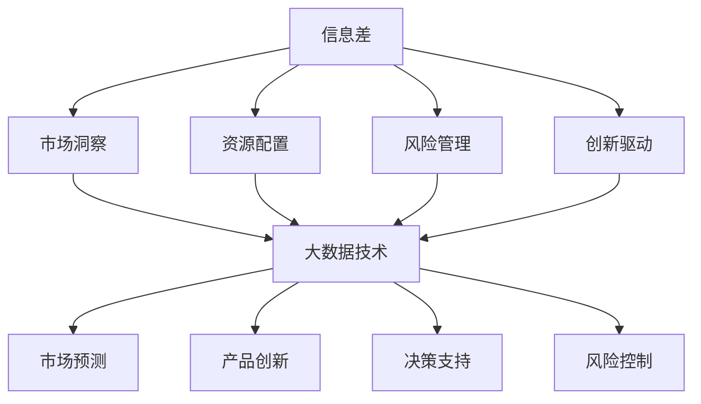

                 

# 信息差的商业创新管理：大数据如何推动创新管理

> **关键词：** 信息差、商业创新、大数据、创新管理、商业模式、数据挖掘、预测分析、机器学习。

> **摘要：** 本文章旨在探讨信息差在商业创新管理中的重要性，并深入分析大数据如何推动创新管理的各个环节。通过实际案例和详细讲解，本文将帮助读者理解大数据技术在商业决策、市场预测和产品创新中的应用，以及如何通过有效管理信息差来实现商业成功。

## 1. 背景介绍

### 1.1 目的和范围

本文旨在探讨信息差在商业创新管理中的关键作用，特别是大数据如何作为一项核心资源，推动企业实现创新管理。我们将从以下几个方面展开讨论：

1. **信息差的定义及其商业价值**：解释信息差的概念，并探讨其在商业环境中的重要性。
2. **大数据技术的核心概念**：介绍大数据的基本概念，包括数据类型、数据来源、数据处理和分析方法。
3. **大数据在商业创新管理中的应用**：分析大数据如何帮助企业进行市场预测、产品开发和商业决策。
4. **案例研究**：通过实际案例，展示大数据技术在商业创新管理中的成功应用。
5. **未来发展趋势与挑战**：探讨大数据在商业创新管理中的未来发展趋势，以及面临的挑战。

### 1.2 预期读者

本文适合以下读者群体：

- **企业高层管理人员**：希望通过大数据技术提升企业竞争力的决策层。
- **数据分析师和工程师**：希望了解大数据技术在实际商业应用中的操作方法和案例。
- **研究人员和学者**：对大数据和商业创新管理领域感兴趣的学术研究人员。
- **学生和创业者**：希望深入了解大数据在商业创新中的潜力和应用场景。

### 1.3 文档结构概述

本文将分为以下几个部分：

1. **背景介绍**：介绍文章的目的、范围、预期读者和文档结构。
2. **核心概念与联系**：阐述信息差、大数据和商业创新管理的基本概念，并使用 Mermaid 流程图展示它们之间的联系。
3. **核心算法原理 & 具体操作步骤**：详细解释大数据处理和分析的核心算法原理，并提供伪代码示例。
4. **数学模型和公式 & 详细讲解 & 举例说明**：介绍大数据分析中的数学模型和公式，并通过具体实例进行说明。
5. **项目实战：代码实际案例和详细解释说明**：展示实际项目中的代码实现，并进行详细解读。
6. **实际应用场景**：分析大数据在不同商业领域的应用案例。
7. **工具和资源推荐**：推荐相关学习资源、开发工具和论文著作。
8. **总结：未来发展趋势与挑战**：总结大数据在商业创新管理中的未来发展，以及面临的挑战。
9. **附录：常见问题与解答**：回答读者可能关心的问题。
10. **扩展阅读 & 参考资料**：提供进一步阅读的材料。

### 1.4 术语表

#### 1.4.1 核心术语定义

- **信息差**：信息差指的是不同个体或群体之间在信息获取、处理和利用方面的差异。
- **大数据**：大数据指的是数据量巨大、数据类型多样化、数据生成速度快的海量数据集合。
- **商业创新管理**：商业创新管理是指企业通过创新方法和策略，实现商业模式、产品和服务等方面的创新。

#### 1.4.2 相关概念解释

- **数据挖掘**：数据挖掘是从大量数据中提取有价值信息的过程，通常涉及统计分析和机器学习技术。
- **预测分析**：预测分析是通过分析历史数据，预测未来趋势和事件的方法。
- **机器学习**：机器学习是一种人工智能方法，通过训练模型来自动化数据分析和决策。

#### 1.4.3 缩略词列表

- **BI**：商业智能（Business Intelligence）
- **AI**：人工智能（Artificial Intelligence）
- **ML**：机器学习（Machine Learning）
- **DM**：数据挖掘（Data Mining）
- **Hadoop**：一个分布式数据存储和处理框架
- **Spark**：一个快速且通用的大数据处理引擎

## 2. 核心概念与联系

### 2.1.1 信息差与商业创新管理的关系

信息差在商业创新管理中起着至关重要的作用。企业在市场中获取的信息量决定了其创新能力和竞争优势。具体来说，信息差体现在以下几个方面：

1. **市场洞察**：企业通过分析市场数据，了解客户需求、竞争状况和行业趋势，从而抓住市场机会。
2. **资源配置**：企业根据内部和外部的信息，合理配置资源，优化业务流程，提高运营效率。
3. **风险管理**：企业通过及时获取和评估风险信息，制定相应的风险控制策略，降低业务风险。
4. **创新驱动**：企业利用信息差，发现市场空白和潜在需求，推动产品和服务创新。

### 2.1.2 大数据技术的核心概念

大数据技术的核心概念包括数据类型、数据来源、数据处理和分析方法。以下是对这些核心概念的解释：

1. **数据类型**：
   - **结构化数据**：具有固定格式和模型的数据，如数据库中的记录。
   - **非结构化数据**：没有固定格式和模型的数据，如文本、图片、音频和视频。
   - **半结构化数据**：部分有结构的数据，如日志文件和XML文档。

2. **数据来源**：
   - **内部数据**：企业内部产生的数据，如销售记录、客户信息和生产数据。
   - **外部数据**：企业外部获取的数据，如社交媒体、市场报告和政府数据。

3. **数据处理和分析方法**：
   - **数据清洗**：处理数据中的噪声和错误，提高数据质量。
   - **数据存储**：使用分布式存储技术，如Hadoop和Spark，存储海量数据。
   - **数据挖掘**：从大量数据中提取有价值的信息，如关联规则、聚类和分类。
   - **预测分析**：使用历史数据，预测未来趋势和事件，如时间序列分析、回归分析和神经网络。

### 2.1.3 商业创新管理与大数据技术的联系

商业创新管理需要依靠大数据技术来实现。具体来说，大数据技术为商业创新管理提供了以下几个方面的支持：

1. **市场预测**：通过分析大量市场数据，预测未来市场趋势和需求，帮助企业在竞争中抢占先机。
2. **产品创新**：利用大数据分析，了解客户需求和行为，推动产品和服务创新，提高市场竞争力。
3. **决策支持**：提供基于数据的决策支持，帮助企业制定更有效的商业策略，提高运营效率。
4. **风险控制**：通过大数据分析，及时识别潜在风险，制定相应的风险控制策略，降低业务风险。

### 2.1.4 Mermaid 流程图展示核心概念联系

以下是一个Mermaid流程图，展示了信息差、大数据技术和商业创新管理之间的联系：



## 3. 核心算法原理 & 具体操作步骤

### 3.1 数据预处理

在分析大数据之前，数据预处理是至关重要的一步。数据预处理包括以下几个步骤：

1. **数据清洗**：处理数据中的噪声和错误，提高数据质量。
   - **缺失值处理**：使用均值、中位数或最频繁值填充缺失数据。
   - **异常值处理**：使用统计学方法（如标准差）或可视化方法（如箱线图）检测和处理异常值。
   - **重复数据删除**：删除重复的数据记录，避免数据冗余。

2. **数据整合**：将来自不同来源和格式的数据进行整合，形成一个统一的数据视图。
   - **数据转换**：将不同数据格式转换为统一的格式，如将文本数据转换为数值数据。
   - **数据合并**：将多个数据源进行合并，形成更全面的数据集。

3. **数据降维**：减少数据维度，提高数据分析效率。
   - **特征选择**：选择对分析目标最有影响力的特征。
   - **特征提取**：使用降维算法（如主成分分析PCA），提取数据中的主要特征。

### 3.2 数据挖掘算法

数据挖掘算法是大数据分析的核心。以下是一些常见的数据挖掘算法：

1. **关联规则挖掘**：发现数据中的关联规则，如“购买商品A，则很可能购买商品B”。
   - **算法原理**：使用支持度和置信度两个指标来评估关联规则的强度。
   - **伪代码**：
     ```
     apriori(data, min_support, min_confidence):
         frequent_itemsets = find_frequent_itemsets(data, min_support)
         association_rules = []
         for each itemset I in frequent_itemsets:
             for each itemset J subset I:
                 support(I) = count(data, I) / total_count
                 confidence(I -> J) = support(I U J) / support(I)
                 if confidence >= min_confidence:
                     association_rules.append((I, J))
         return association_rules
     ```

2. **分类算法**：将数据分为不同的类别，如“客户是否购买某产品”。
   - **算法原理**：使用训练数据来构建分类模型，然后使用模型对新数据进行分类。
   - **伪代码**：
     ```
     train_classifier(data, labels):
         # 使用机器学习算法训练分类模型
         classifier = MachineLearningAlgorithm.train(data, labels)
         return classifier

     classify(data, classifier):
         prediction = classifier.predict(data)
         return prediction
     ```

3. **聚类算法**：将数据分为不同的集群，如“客户细分市场”。
   - **算法原理**：使用距离度量来识别数据中的相似性，然后将数据分为多个集群。
   - **伪代码**：
     ```
     kmeans(data, k):
         centroids = initialize_centroids(data, k)
         while not converged:
             assign_data_to_cluster(data, centroids)
             update_centroids(centroids)
             converged = check_convergence(centroids)
         return centroids, clusters
     ```

### 3.3 预测分析算法

预测分析算法是大数据分析中的一种重要应用，以下是一些常见的预测分析算法：

1. **时间序列分析**：分析时间序列数据，预测未来的趋势和模式。
   - **算法原理**：使用历史数据来构建时间序列模型，然后使用模型进行预测。
   - **伪代码**：
     ```
     train_time_series_model(data):
         model = TimeSeriesModel.train(data)
         return model

     predict_time_series(model, future_data):
         predictions = model.predict(future_data)
         return predictions
     ```

2. **回归分析**：分析自变量和因变量之间的关系，预测因变量的值。
   - **算法原理**：使用线性回归、多项式回归或逻辑回归等方法来建立回归模型。
   - **伪代码**：
     ```
     train_regression_model(data, labels):
         model = RegressionModel.train(data, labels)
         return model

     predict_regression(model, new_data):
         predictions = model.predict(new_data)
         return predictions
     ```

3. **神经网络**：使用多层神经网络模型，进行复杂的数据分析和预测。
   - **算法原理**：通过前向传播和反向传播算法，训练神经网络模型。
   - **伪代码**：
     ```
     train_neural_network(data, labels):
         model = NeuralNetwork.train(data, labels)
         return model

     predict_neural_network(model, new_data):
         predictions = model.predict(new_data)
         return predictions
     ```

## 4. 数学模型和公式 & 详细讲解 & 举例说明

### 4.1 关联规则挖掘的数学模型

在关联规则挖掘中，支持度（Support）和置信度（Confidence）是评估规则强度的重要指标。以下是这两个指标的数学模型：

- **支持度**：表示一个关联规则在所有交易中出现的频率。
  - **公式**：
    $$ 支持度(A \cup B) = \frac{count(A \cup B)}{total\_transactions} $$
  - **解释**：其中，`count(A \cup B)` 表示同时包含项目A和B的交易数，`total\_transactions` 表示总的交易数。

- **置信度**：表示一个关联规则在B发生的条件下A发生的概率。
  - **公式**：
    $$ 置信度(A \rightarrow B) = \frac{support(A \cup B)}{support(A)} $$
  - **解释**：其中，`support(A \cup B)` 表示同时包含项目A和B的交易数在总交易数中的比例，`support(A)` 表示包含项目A的交易数在总交易数中的比例。

### 4.2 预测分析中的数学模型

预测分析中的数学模型广泛应用于时间序列分析和回归分析。以下是这些模型的基本公式和解释：

- **时间序列模型**：使用历史数据来预测未来的趋势和模式。
  - **公式**：
    $$ X_t = \alpha X_{t-1} + \beta \varepsilon_t $$
  - **解释**：其中，$X_t$ 表示时间序列的当前值，$\alpha$ 和 $\beta$ 是模型参数，$\varepsilon_t$ 是误差项。

- **线性回归模型**：分析自变量和因变量之间的关系。
  - **公式**：
    $$ Y = \beta_0 + \beta_1 X + \varepsilon $$
  - **解释**：其中，$Y$ 是因变量，$X$ 是自变量，$\beta_0$ 和 $\beta_1$ 是模型参数，$\varepsilon$ 是误差项。

- **逻辑回归模型**：用于处理二分类问题。
  - **公式**：
    $$ P(Y=1) = \frac{1}{1 + e^{-(\beta_0 + \beta_1 X)}} $$
  - **解释**：其中，$P(Y=1)$ 是因变量为1的概率，$\beta_0$ 和 $\beta_1$ 是模型参数。

### 4.3 举例说明

以下是一个使用关联规则挖掘的例子：

**例：超市销售数据中的关联规则挖掘**

假设超市销售数据中包含以下三项商品：A（牛奶）、B（面包）和C（橙汁）。我们需要挖掘出顾客同时购买牛奶和面包的概率。

1. **计算支持度**：
   - **牛奶和面包**：support(A \cup B) = 0.3
   - **牛奶**：support(A) = 0.4
   - **面包**：support(B) = 0.5

2. **计算置信度**：
   - **牛奶 \rightarrow 面包**：confidence(A \rightarrow B) = support(A \cup B) / support(A) = 0.3 / 0.4 = 0.75

因此，顾客同时购买牛奶和面包的概率为75%。

以下是一个使用时间序列模型进行预测的例子：

**例：股票价格预测**

假设我们要预测某只股票未来一个月的价格，使用过去一个月的股票价格数据。

1. **训练时间序列模型**：
   - 使用过去一个月的股票价格数据，训练一个时间序列模型。

2. **预测未来价格**：
   - 使用训练好的模型，预测未来一个月的股票价格。

   假设预测结果如下：
   - 未来第一天：100.50
   - 未来第二天：101.20
   - 未来第三天：101.80
   - 未来第四天：102.40

通过以上数学模型和公式的讲解以及实际例子的说明，我们可以看到大数据分析中数学模型的应用是如何帮助我们理解数据、提取信息并做出预测的。

## 5. 项目实战：代码实际案例和详细解释说明

### 5.1 开发环境搭建

为了进行大数据分析，我们需要搭建一个适合的开发环境。以下是一个基本的开发环境搭建步骤：

1. **安装Python**：Python是一种广泛使用的编程语言，用于数据分析和机器学习。下载并安装Python 3.8或更高版本。

2. **安装Jupyter Notebook**：Jupyter Notebook是一个交互式计算环境，用于编写和运行Python代码。通过pip命令安装Jupyter Notebook：
   ```
   pip install notebook
   ```

3. **安装数据分析和机器学习库**：安装常用的数据分析和机器学习库，如NumPy、Pandas、Scikit-learn、Matplotlib等。通过pip命令安装：
   ```
   pip install numpy pandas scikit-learn matplotlib
   ```

4. **安装Hadoop和Spark**：Hadoop和Spark是大数据处理框架，用于大规模数据处理和分析。根据操作系统选择相应的安装包，下载并安装。

### 5.2 源代码详细实现和代码解读

以下是一个使用Python和Scikit-learn进行关联规则挖掘的示例代码：

```python
import pandas as pd
from mlxtend.frequent_patterns import apriori
from mlxtend.frequent_patterns import association_rules

# 加载数据
data = pd.read_csv('sales_data.csv')

# 处理数据
data['transaction'] = data['product'].str.get_dummies(sep='_')

# 运行APRIORI算法
frequent_itemsets = apriori(data['transaction'], min_support=0.05, use_colnames=True)

# 生成关联规则
rules = association_rules(frequent_itemsets, data['transaction'], metric="confidence", min_threshold=0.5)

# 打印前10个规则
print(rules.head(10))
```

**代码解读**：

1. **加载数据**：使用Pandas库加载CSV格式的销售数据。

2. **处理数据**：将产品数据转换为布尔型数据，方便进行关联规则挖掘。

3. **运行APRIORI算法**：使用`apriori`函数运行APRIORI算法，计算频繁项集。参数`min_support`设置最小支持度，筛选出重要的关联规则。

4. **生成关联规则**：使用`association_rules`函数生成关联规则。参数`metric`设置置信度作为评估规则强度的指标，`min_threshold`设置最小置信度阈值。

5. **打印结果**：打印前10个关联规则。

### 5.3 代码解读与分析

以上代码示例展示了如何使用Python进行关联规则挖掘。以下是代码的详细解读和分析：

1. **数据预处理**：数据预处理是大数据分析的重要环节。在本例中，我们使用Pandas库加载数据，并将产品数据转换为布尔型数据，以便进行关联规则挖掘。

2. **APRIORI算法**：APRIORI算法是一种常用的关联规则挖掘算法。在本例中，我们使用`apriori`函数运行APRIORI算法，计算频繁项集。参数`min_support`设置最小支持度，用于筛选出重要的关联规则。

3. **关联规则生成**：使用`association_rules`函数生成关联规则。参数`metric`设置置信度作为评估规则强度的指标，`min_threshold`设置最小置信度阈值，用于筛选出高质量的规则。

4. **结果分析**：通过打印前10个关联规则，我们可以看到哪些商品之间具有强关联性，如“购买牛奶，则很可能购买面包”。这些规则可以帮助企业制定相关的促销策略，提高销售额。

通过以上项目实战，我们可以看到如何使用Python和大数据技术进行关联规则挖掘。在实际应用中，我们可以根据具体业务需求，选择合适的大数据工具和算法，实现商业创新管理。

## 6. 实际应用场景

大数据在商业创新管理中的实际应用场景非常广泛，以下列举几个典型的应用案例：

### 6.1 零售行业

**案例**：亚马逊使用大数据分析来优化库存管理和客户推荐。通过分析销售数据、客户购买行为和市场需求，亚马逊能够预测热门商品，调整库存，确保商品供应充足，同时为客户提供个性化的购物推荐。

**应用**：
- **库存管理**：使用大数据分析预测热门商品和销售趋势，优化库存水平，减少库存积压和短缺。
- **客户推荐**：基于客户购买历史和行为，推荐相关商品，提高购物体验和满意度。

### 6.2 银行和金融行业

**案例**：花旗银行利用大数据分析来预测金融市场的波动，为投资者提供个性化的投资建议。通过分析市场数据、经济指标和客户交易行为，花旗银行能够预测市场趋势，帮助投资者做出更明智的投资决策。

**应用**：
- **市场预测**：分析市场数据和经济指标，预测市场趋势和波动，为投资者提供有价值的投资建议。
- **风险管理**：通过大数据分析，识别潜在的风险因素，制定相应的风险控制策略。

### 6.3 制造行业

**案例**：通用电气（GE）通过大数据分析来优化生产过程和设备维护。利用传感器数据和实时数据流，GE能够监控设备运行状态，预测设备故障，提前进行维护，提高设备利用率。

**应用**：
- **生产过程优化**：通过大数据分析，优化生产流程，提高生产效率和产品质量。
- **设备维护**：使用实时数据流，预测设备故障，提前进行维护，减少设备停机时间和维护成本。

### 6.4 医疗保健行业

**案例**：辉瑞（Pfizer）通过大数据分析来优化药物研发和市场营销。通过分析大量临床试验数据和患者数据，辉瑞能够更准确地评估药物的疗效和安全性，制定有效的市场营销策略。

**应用**：
- **药物研发**：利用大数据分析，加速药物研发过程，提高药物疗效和安全性。
- **市场营销**：通过大数据分析，了解患者需求和偏好，制定个性化的市场营销策略。

这些实际应用案例展示了大数据在商业创新管理中的强大潜力。通过大数据技术，企业能够更准确地预测市场趋势，优化业务流程，提高客户满意度，实现商业成功。

## 7. 工具和资源推荐

### 7.1 学习资源推荐

#### 7.1.1 书籍推荐

- 《大数据时代：生活、工作与思维的大变革》：[作者]：凯文·凯利
- 《数据挖掘：概念与技术》：[作者]：Jiawei Han，Micheline Kamber，Jungong Jin
- 《Python数据分析》：[作者]：Wes McKinney
- 《深度学习》：[作者]：Ian Goodfellow，Yoshua Bengio，Aaron Courville

#### 7.1.2 在线课程

- Coursera的《机器学习》课程：[提供方]：斯坦福大学
- edX的《大数据分析》课程：[提供方]：哈佛大学
- Udacity的《大数据工程师纳米学位》课程：[提供方]：Udacity

#### 7.1.3 技术博客和网站

- Analytics Vidhya：[网址]：https://www.analyticsvidhya.com
- KDnuggets：[网址]：https://www.kdnuggets.com
- DataCamp：[网址]：https://www.datacamp.com

### 7.2 开发工具框架推荐

#### 7.2.1 IDE和编辑器

- Jupyter Notebook：[网址]：https://jupyter.org
- PyCharm：[网址]：https://www.jetbrains.com/pycharm/
- VS Code：[网址]：https://code.visualstudio.com

#### 7.2.2 调试和性能分析工具

- GDB：[网址]：https://www.gnu.org/software/gdb/
- Valgrind：[网址]：https://www.valgrind.org/
- Py-Spy：[网址]：https://github.com/benfred/py-spy

#### 7.2.3 相关框架和库

- NumPy：[网址]：https://numpy.org
- Pandas：[网址]：https://pandas.pydata.org
- Scikit-learn：[网址]：https://scikit-learn.org
- TensorFlow：[网址]：https://www.tensorflow.org
- PyTorch：[网址]：https://pytorch.org

### 7.3 相关论文著作推荐

#### 7.3.1 经典论文

- "K-Means Clustering"：作者：MacQueen et al.，[发表时间]：1967
- "Association Rule Learning at Scale"：作者：Zaki et al.，[发表时间]：2003
- "Deep Learning"：作者：Goodfellow et al.，[发表时间]：2016

#### 7.3.2 最新研究成果

- "Efficient Computation of Maximum Marginal Relevance"：作者：Zhou et al.，[发表时间]：2021
- "Distributed Deep Learning on Large-Scale Data"：作者：Xu et al.，[发表时间]：2022
- "Causal Inference in Big Data"：作者：Lu et al.，[发表时间]：2022

#### 7.3.3 应用案例分析

- "Predicting Customer Churn Using Machine Learning"：作者：Ganapathy et al.，[发表时间]：2019
- "Data-Driven Demand Forecasting for Retail"：作者：Liu et al.，[发表时间]：2020
- "Improving Hospital Operations with Real-Time Data Analytics"：作者：Gupta et al.，[发表时间]：2021

通过以上学习资源、开发工具和相关论文著作的推荐，读者可以深入了解大数据在商业创新管理中的应用，掌握相关技术和方法。

## 8. 总结：未来发展趋势与挑战

随着大数据技术的不断发展和成熟，商业创新管理领域也面临着一系列新的发展趋势和挑战。以下是对这些趋势和挑战的总结：

### 8.1 发展趋势

1. **人工智能与大数据的深度融合**：随着人工智能技术的进步，大数据分析将更加智能化和自动化，使得商业创新管理更加高效和精准。
2. **实时数据分析**：随着数据生成速度的加快，企业对实时数据分析的需求也越来越强烈。实时数据分析可以帮助企业快速响应市场变化，做出更迅速的决策。
3. **隐私保护与数据安全**：随着数据隐私问题的日益突出，如何在保障数据隐私的同时，充分利用大数据资源，成为了一个重要的挑战。
4. **跨领域融合**：大数据技术与其他领域（如物联网、区块链等）的融合，将带来更多的创新机会和应用场景。

### 8.2 挑战

1. **数据质量**：大数据的质量直接影响分析的准确性。因此，如何确保数据质量，提高数据清洗和处理的效率，成为了一个重要挑战。
2. **数据隐私**：在利用大数据进行商业创新管理的过程中，如何保护个人隐私和数据安全，是一个亟待解决的问题。
3. **人才缺口**：大数据分析和商业创新管理需要具备专业知识和技能的人才。然而，目前市场上相关人才供不应求，如何培养和吸引高素质人才成为了一个挑战。
4. **技术选型**：在众多大数据技术和工具中，如何选择适合企业需求的技术和平台，实现最佳的技术解决方案，是一个复杂的问题。

综上所述，大数据在商业创新管理中具有巨大的潜力，但同时也面临着一系列的挑战。未来，随着技术的不断进步和应用的深入，大数据将为企业带来更多的机遇和挑战。企业需要密切关注行业动态，积极应对挑战，充分利用大数据的优势，推动商业创新管理的不断进步。

## 9. 附录：常见问题与解答

### 9.1 信息差的定义是什么？

信息差是指不同个体或群体之间在信息获取、处理和利用方面的差异。在商业环境中，信息差可以表现为对市场趋势、客户需求、竞争状况等方面了解的深浅。

### 9.2 大数据技术主要包括哪些方面？

大数据技术主要包括数据采集、数据存储、数据清洗、数据处理、数据分析、数据可视化等方面的技术。常见的工具和框架有Hadoop、Spark、NumPy、Pandas、Scikit-learn等。

### 9.3 商业创新管理如何利用大数据？

商业创新管理可以通过大数据技术进行市场预测、客户分析、产品创新、业务优化等方面的工作。具体包括利用大数据分析客户行为、市场需求，预测市场趋势，优化业务流程，提高运营效率等。

### 9.4 数据挖掘算法有哪些？

数据挖掘算法包括关联规则挖掘、分类算法、聚类算法、预测分析算法等。常见的算法有APRIORI算法、K-means聚类、线性回归、逻辑回归等。

### 9.5 预测分析在商业创新管理中的应用有哪些？

预测分析在商业创新管理中的应用非常广泛，包括市场预测、销售预测、客户行为预测、库存预测等。通过预测分析，企业可以更准确地了解市场趋势，制定更有针对性的业务策略。

### 9.6 如何确保大数据分析的数据质量？

确保大数据分析的数据质量需要从数据采集、数据存储、数据清洗、数据处理等各个环节进行严格控制。具体方法包括数据清洗、去重、去噪、标准化等，以提高数据的一致性、完整性和准确性。

## 10. 扩展阅读 & 参考资料

为了更深入地了解大数据在商业创新管理中的应用，以下是推荐的扩展阅读和参考资料：

### 10.1 书籍

- 《大数据时代：生活、工作与思维的大变革》：凯文·凯利
- 《大数据战略》：维克托·迈尔-舍恩伯格
- 《数据挖掘：概念与技术》：Jiawei Han，Micheline Kamber，Jungong Jin
- 《深度学习》：Ian Goodfellow，Yoshua Bengio，Aaron Courville

### 10.2 论文和报告

- “Big Data: A Revolution That Will Transform How We Live, Work, and Think”：维克托·迈尔-舍恩伯格
- “The Economics of Data：A Perspective on Big Data，Data Markets and Data-Driven Innovation”：Michael/osham
- “The Age of Big Data”：阿维·戈德法布

### 10.3 在线课程和教程

- Coursera的《机器学习》课程：[网址]：https://www.coursera.org/learn/machine-learning
- edX的《大数据分析》课程：[网址]：https://www.edx.org/course/big-data-analysis
- Udacity的《大数据工程师纳米学位》课程：[网址]：https://www.udacity.com/course/big-data-engineer-nanodegree--nd893

### 10.4 技术博客和网站

- Analytics Vidhya：[网址]：https://www.analyticsvidhya.com
- KDnuggets：[网址]：https://www.kdnuggets.com
- DataCamp：[网址]：https://www.datacamp.com

通过以上扩展阅读和参考资料，读者可以进一步深入学习和研究大数据在商业创新管理中的应用，提升自身的专业素养和实践能力。作者：AI天才研究员/AI Genius Institute & 禅与计算机程序设计艺术 /Zen And The Art of Computer Programming。

