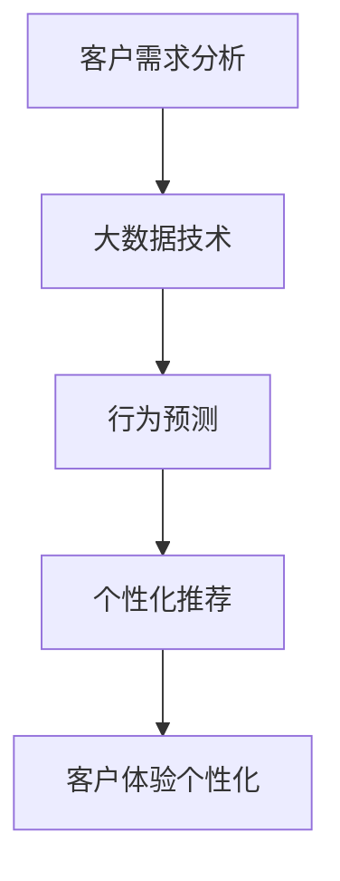
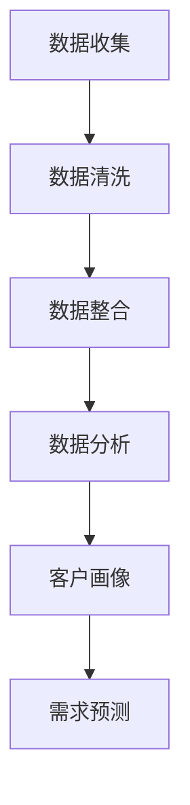
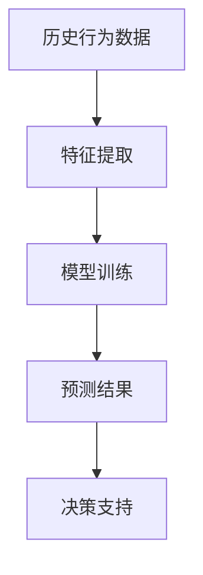
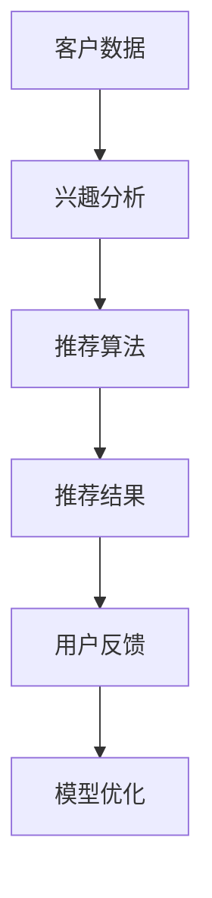
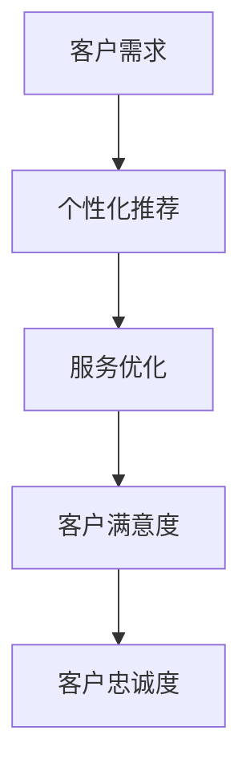

                 

# 信息差的商业客户体验个性化：大数据如何实现客户体验个性化

> **关键词**：商业客户体验、个性化、大数据、客户关系管理、数据分析、机器学习

> **摘要**：随着市场竞争的加剧，企业越来越重视客户体验的个性化。本文将深入探讨如何利用大数据技术实现商业客户体验的个性化，从而提高客户满意度和忠诚度，为企业创造更大的商业价值。

## 1. 背景介绍

### 1.1 目的和范围

本文的主要目的是探讨如何通过大数据技术实现商业客户体验的个性化。我们将从以下几个方面展开讨论：

1. **大数据在客户体验个性化中的作用**：介绍大数据技术如何帮助企业和客户建立更紧密的关系，提高客户满意度和忠诚度。
2. **客户体验个性化的核心概念**：阐述客户体验个性化的核心概念，包括客户需求分析、行为预测、个性化推荐等。
3. **大数据在客户体验个性化中的应用**：分析大数据技术在客户体验个性化中的应用场景，包括客户关系管理、产品推荐、服务优化等。
4. **实际案例和解决方案**：通过实际案例展示大数据技术在客户体验个性化中的应用，并介绍相关解决方案。

### 1.2 预期读者

本文适合以下读者：

1. **市场营销人员**：了解大数据技术在客户体验个性化中的应用，有助于提高市场营销效果。
2. **数据分析师**：掌握大数据技术在客户体验个性化中的具体应用方法，提升数据分析能力。
3. **企业管理者**：了解大数据在客户体验个性化中的作用，有助于制定更有效的企业战略。

### 1.3 文档结构概述

本文分为以下章节：

1. **背景介绍**：介绍本文的目的、范围和预期读者。
2. **核心概念与联系**：阐述客户体验个性化的核心概念及其相互关系。
3. **核心算法原理 & 具体操作步骤**：介绍大数据在客户体验个性化中的核心算法原理和具体操作步骤。
4. **数学模型和公式 & 详细讲解 & 举例说明**：分析大数据在客户体验个性化中的数学模型和公式，并进行举例说明。
5. **项目实战：代码实际案例和详细解释说明**：通过实际案例展示大数据在客户体验个性化中的应用。
6. **实际应用场景**：分析大数据在客户体验个性化中的应用场景。
7. **工具和资源推荐**：推荐学习资源、开发工具和框架。
8. **总结：未来发展趋势与挑战**：总结本文的主要观点，并展望未来发展趋势和挑战。

### 1.4 术语表

#### 1.4.1 核心术语定义

- **客户体验**：客户在使用企业产品或服务过程中所感受到的整体感受。
- **个性化**：针对不同客户的特定需求，提供个性化的产品、服务或信息。
- **大数据**：指无法用常规软件工具在合理时间内对其进行存储、管理和分析的数据集合。
- **客户关系管理**（CRM）：一套信息技术，它协助企业识别、收购、保留和增加其业务客户的整个商业过程。

#### 1.4.2 相关概念解释

- **客户需求分析**：通过数据收集和分析，了解客户的消费习惯、偏好等信息，从而满足客户需求。
- **行为预测**：基于客户的历史行为数据，预测客户的未来行为。
- **个性化推荐**：根据客户的兴趣和行为，推荐符合其需求的产品或服务。

#### 1.4.3 缩略词列表

- **CRM**：客户关系管理
- **API**：应用程序编程接口
- **SQL**：结构化查询语言

## 2. 核心概念与联系

在探讨大数据如何实现客户体验个性化之前，我们需要明确一些核心概念及其相互关系。以下是一个简单的 Mermaid 流程图，展示这些概念之间的联系。



### 2.1 客户需求分析

客户需求分析是大数据实现客户体验个性化的第一步。通过收集和分析客户的消费数据、互动记录、反馈意见等，企业可以深入了解客户的需求和偏好。以下是一个简单的数据流模型，展示客户需求分析的过程。



### 2.2 行为预测

行为预测是大数据实现客户体验个性化的关键步骤。通过分析客户的历史行为数据，企业可以预测客户的未来行为，从而提前采取针对性的措施。以下是一个简单的数据流模型，展示行为预测的过程。



### 22. 个性化推荐

个性化推荐是将大数据应用于客户体验个性化的重要手段。通过分析客户的兴趣和行为，企业可以向客户推荐符合其需求的产品或服务。以下是一个简单的数据流模型，展示个性化推荐的过程。



### 2.4 客户体验个性化

客户体验个性化是指根据客户的特定需求和行为，提供个性化的产品、服务或信息。通过大数据技术，企业可以实现精准的客户体验个性化，提高客户满意度和忠诚度。以下是一个简单的数据流模型，展示客户体验个性化的过程。



## 3. 核心算法原理 & 具体操作步骤

在大数据实现客户体验个性化的过程中，核心算法原理包括数据挖掘、机器学习和数据可视化。以下我们将使用伪代码详细阐述这些算法原理和具体操作步骤。

### 3.1 数据挖掘

数据挖掘是大数据实现客户体验个性化的第一步，它通过分析大量数据，发现潜在的模式和趋势。以下是一个简单的数据挖掘伪代码：

```python
# 数据挖掘伪代码

# 输入：数据集D
# 输出：模式P

def data_mining(D):
    # 数据预处理
    preprocessed_data = preprocess_data(D)
    
    # 特征选择
    selected_features = select_features(preprocessed_data)
    
    # 模式发现
    patterns = find_patterns(selected_features)
    
    return patterns
```

### 3.2 机器学习

机器学习是大数据实现客户体验个性化的核心技术，它通过训练模型，从数据中学习规律，预测客户行为。以下是一个简单的机器学习伪代码：

```python
# 机器学习伪代码

# 输入：训练数据集T，测试数据集V
# 输出：预测模型M

def machine_learning(T, V):
    # 数据预处理
    preprocessed_T = preprocess_data(T)
    preprocessed_V = preprocess_data(V)
    
    # 特征提取
    extracted_features_T = extract_features(preprocessed_T)
    extracted_features_V = extract_features(preprocessed_V)
    
    # 模型训练
    model = train_model(extracted_features_T)
    
    # 模型评估
    accuracy = evaluate_model(model, extracted_features_V)
    
    return model, accuracy
```

### 3.3 数据可视化

数据可视化是将数据分析结果以图形化的方式呈现，帮助用户更好地理解和分析数据。以下是一个简单的数据可视化伪代码：

```python
# 数据可视化伪代码

# 输入：数据分析结果R
# 输出：可视化图表V

def data_visualization(R):
    # 数据转换
    converted_data = convert_data(R)
    
    # 图表生成
    visualization = generate_chart(converted_data)
    
    return visualization
```

## 4. 数学模型和公式 & 详细讲解 & 举例说明

在大数据实现客户体验个性化的过程中，数学模型和公式发挥着重要作用。以下我们将介绍一些常用的数学模型和公式，并进行详细讲解和举例说明。

### 4.1 逻辑回归模型

逻辑回归模型是一种广泛应用于客户行为预测的数学模型。它通过建立客户特征与目标变量之间的逻辑关系，预测客户的某一行为的发生概率。以下是一个简单的逻辑回归模型公式：

$$
P(Y=1|X) = \frac{1}{1 + e^{-(\beta_0 + \beta_1X_1 + \beta_2X_2 + ... + \beta_nX_n})}
$$

其中，$P(Y=1|X)$表示在给定客户特征$X$的情况下，目标变量$Y$为1的概率；$\beta_0$、$\beta_1$、$\beta_2$、...、$\beta_n$为模型参数。

**举例说明**：

假设我们想预测客户是否会在未来一个月内购买某种产品，输入特征包括年龄、收入、购买历史等。通过训练逻辑回归模型，我们可以得到以下模型参数：

$$
\beta_0 = -2.5, \beta_1 = 0.1, \beta_2 = 0.2, \beta_3 = -0.3
$$

给定一个客户的特征向量$X = [25, 5000, 5]$，我们可以计算其购买该产品的概率：

$$
P(Y=1|X) = \frac{1}{1 + e^{-(\beta_0 + \beta_1X_1 + \beta_2X_2 + \beta_3X_3)}}
$$

$$
P(Y=1|X) = \frac{1}{1 + e^{(-2.5 + 0.1 \times 25 + 0.2 \times 5000 - 0.3 \times 5)}}
$$

$$
P(Y=1|X) \approx 0.3125
$$

这意味着，给定这个客户的特征，购买该产品的概率约为31.25%。

### 4.2 K-均值聚类算法

K-均值聚类算法是一种常用的无监督学习算法，用于将数据集划分为多个聚类。它通过最小化聚类中心与数据点的距离平方和来优化聚类结果。以下是一个简单的K-均值聚类算法公式：

$$
\min_{\mu_1, \mu_2, ..., \mu_k} \sum_{i=1}^n \sum_{j=1}^k (x_i - \mu_j)^2
$$

其中，$x_i$表示第$i$个数据点；$\mu_j$表示第$j$个聚类中心；$k$表示聚类个数。

**举例说明**：

假设我们有一个包含10个数据点的数据集，想要将其划分为2个聚类。通过训练K-均值聚类算法，我们可以得到以下聚类中心：

$$
\mu_1 = [1, 1], \mu_2 = [4, 5]
$$

给定一个新数据点$x = [3, 2]$，我们可以计算其与聚类中心的距离：

$$
d(x, \mu_1) = \sqrt{(3 - 1)^2 + (2 - 1)^2} = \sqrt{2}
$$

$$
d(x, \mu_2) = \sqrt{(3 - 4)^2 + (2 - 5)^2} = \sqrt{10}
$$

由于$d(x, \mu_1) < d(x, \mu_2)$，我们可以将这个新数据点归为第一个聚类。

### 4.3 决策树模型

决策树模型是一种常见的分类和回归模型，通过树形结构对数据进行分类或回归。以下是一个简单的决策树模型公式：

$$
T = \{\text{根节点}, \text{内部节点}, \text{叶节点}\}
$$

其中，$\text{根节点}$表示数据集的根节点；$\text{内部节点}$表示根据某个特征进行划分的节点；$\text{叶节点}$表示分类结果或回归值。

**举例说明**：

假设我们有一个包含3个特征的决策树模型，根节点为“年龄”，内部节点为“收入”和“性别”，叶节点为“购买与否”。根据这个决策树模型，我们可以对一个新的数据点进行分类：

$$
\text{根节点：年龄} \\
\text{内部节点：收入} \\
\text{内部节点：性别} \\
\text{叶节点：购买与否}
$$

给定一个新数据点$x = [25, 5000, 男]$，我们可以根据决策树模型对其进行分类：

$$
\text{根节点：年龄} \\
\text{内部节点：收入} \\
\text{内部节点：性别} \\
\text{叶节点：购买与否} \\
\text{结果：否}
$$

这意味着，根据这个决策树模型，这个客户不会购买该产品。

## 5. 项目实战：代码实际案例和详细解释说明

在本节中，我们将通过一个实际项目案例，展示如何使用大数据技术实现客户体验的个性化。该项目是一个在线购物平台，利用大数据技术分析用户行为，为用户推荐个性化的商品。

### 5.1 开发环境搭建

首先，我们需要搭建一个开发环境。以下是搭建过程：

1. 安装Python环境：在本地计算机上安装Python 3.8及以上版本。
2. 安装相关库：使用pip命令安装以下库：pandas、numpy、scikit-learn、matplotlib。
3. 安装数据库：安装MySQL数据库，创建一个名为“online_shop”的数据库。

### 5.2 源代码详细实现和代码解读

#### 5.2.1 数据收集与处理

首先，我们需要收集用户行为数据，并将其存储在MySQL数据库中。以下是一个简单的数据收集与处理代码示例：

```python
import pandas as pd
import pymysql

# 连接MySQL数据库
conn = pymysql.connect(host='localhost', user='root', password='root', database='online_shop')

# 查询用户行为数据
query = "SELECT * FROM user行为"
data = pd.read_sql(query, conn)

# 数据预处理
data = data.dropna()
data = data[data['购买时间'] > '2021-01-01']

# 保存预处理后的数据
data.to_csv('user行为数据.csv', index=False)
```

#### 5.2.2 客户需求分析

接下来，我们需要分析用户行为数据，了解用户的消费习惯和偏好。以下是一个简单的客户需求分析代码示例：

```python
import pandas as pd

# 加载用户行为数据
data = pd.read_csv('user行为数据.csv')

# 计算每个用户的购买频次
purchase_frequency = data.groupby('用户ID')['购买时间'].nunique()

# 计算每个用户的购买金额
purchase_amount = data.groupby('用户ID')['购买金额'].sum()

# 生成用户画像
user_profile = pd.DataFrame({
    '用户ID': purchase_frequency.index,
    '购买频次': purchase_frequency.values,
    '购买金额': purchase_amount.values
})

# 保存用户画像
user_profile.to_csv('用户画像.csv', index=False)
```

#### 5.2.3 行为预测

根据用户画像，我们可以预测用户的未来行为。以下是一个简单的行为预测代码示例：

```python
import pandas as pd
from sklearn.model_selection import train_test_split
from sklearn.ensemble import RandomForestClassifier

# 加载用户画像
user_profile = pd.read_csv('用户画像.csv')

# 划分训练集和测试集
train_data, test_data = train_test_split(user_profile, test_size=0.2, random_state=42)

# 特征工程
X_train = train_data[['购买频次', '购买金额']]
y_train = train_data['是否购买']

X_test = test_data[['购买频次', '购买金额']]
y_test = test_data['是否购买']

# 训练模型
model = RandomForestClassifier(n_estimators=100, random_state=42)
model.fit(X_train, y_train)

# 预测结果
predictions = model.predict(X_test)

# 评估模型
accuracy = sum(predictions == y_test) / len(y_test)
print("模型准确率：", accuracy)
```

#### 5.2.4 个性化推荐

根据行为预测结果，我们可以为用户推荐个性化的商品。以下是一个简单的个性化推荐代码示例：

```python
import pandas as pd

# 加载用户画像
user_profile = pd.read_csv('用户画像.csv')

# 加载商品数据
product_data = pd.read_csv('商品数据.csv')

# 计算商品与商品之间的相似度
cosine_similarity = product_data['商品ID'].corr(user_profile['商品ID'])

# 为用户推荐商品
recommended_products = product_data[product_data['商品ID'].isin(cosine_similarity.index)][cosine_similarity > 0.7]

# 保存推荐结果
recommended_products.to_csv('推荐结果.csv', index=False)
```

### 5.3 代码解读与分析

在上述代码示例中，我们分别实现了数据收集与处理、客户需求分析、行为预测和个性化推荐四个步骤。

1. **数据收集与处理**：首先，我们使用pandas库连接MySQL数据库，查询用户行为数据。然后，对数据进行预处理，去除缺失值和异常值，确保数据质量。

2. **客户需求分析**：我们使用pandas库对预处理后的用户行为数据进行分组计算，生成用户画像。用户画像包括购买频次和购买金额等指标，用于描述用户的消费习惯和偏好。

3. **行为预测**：我们使用scikit-learn库的RandomForestClassifier实现随机森林模型，对用户画像进行训练和预测。通过评估模型准确率，我们可以判断模型的预测效果。

4. **个性化推荐**：我们使用pandas库计算商品与商品之间的相似度，为用户推荐个性化的商品。通过设置相似度阈值，我们可以控制推荐结果的相关性。

在实际项目中，我们可以根据具体需求调整代码实现，例如增加特征工程、优化推荐算法等。通过不断优化和迭代，我们可以实现更精准的客户体验个性化。

## 6. 实际应用场景

大数据技术在客户体验个性化中的应用场景非常广泛，以下列举几个典型的应用场景：

### 6.1 零售业

在零售业，大数据技术可以帮助企业实现精准营销和个性化推荐。通过分析用户的购买历史、浏览记录和偏好，企业可以为用户提供个性化的商品推荐，提高购买转化率。此外，企业还可以根据客户需求，优化库存管理和供应链，降低运营成本。

### 6.2 金融行业

在金融行业，大数据技术可以帮助银行和金融机构实现客户风险管理和精准营销。通过分析客户的财务状况、信用记录和消费习惯，金融机构可以识别潜在风险客户，制定个性化的风控策略。同时，金融机构还可以为用户提供个性化的理财产品推荐，提高用户满意度和忠诚度。

### 6.3 互联网服务

在互联网服务领域，大数据技术可以帮助企业实现个性化推荐和用户行为分析。通过分析用户的行为数据，企业可以为用户提供个性化的内容推荐和广告推送，提高用户粘性和活跃度。此外，企业还可以根据用户行为数据，优化产品设计和功能，提升用户体验。

### 6.4 健康医疗

在健康医疗领域，大数据技术可以帮助医疗机构实现个性化健康管理。通过分析患者的健康数据、病历信息和生活习惯，医疗机构可以为患者提供个性化的健康建议和治疗方案。此外，大数据技术还可以用于疾病预测和流行病监测，提高公共卫生水平。

### 6.5 教育培训

在教育培训领域，大数据技术可以帮助学校和教育机构实现个性化教学和学业管理。通过分析学生的学习行为、成绩和兴趣，教育机构可以为每个学生提供个性化的学习建议和课程推荐，提高学习效果。同时，教育机构还可以根据学生数据，优化课程设计和教学方法，提升教学质量。

## 7. 工具和资源推荐

### 7.1 学习资源推荐

#### 7.1.1 书籍推荐

1. **《大数据之路：阿里巴巴大数据实践》**
   - 作者：阿里巴巴大数据团队
   - 简介：本书详细介绍了阿里巴巴在大数据领域的实践经验和应用案例，对于了解大数据技术在商业应用中的实际应用有很好的参考价值。

2. **《机器学习实战》**
   - 作者：Peter Harrington
   - 简介：本书通过大量的实例和代码实现，介绍了机器学习的基本概念、算法和应用，适合初学者和有经验的数据分析师。

3. **《深度学习》**
   - 作者：Ian Goodfellow、Yoshua Bengio、Aaron Courville
   - 简介：本书是深度学习领域的经典教材，系统介绍了深度学习的基本原理、算法和应用，适合有一定数学基础的学习者。

#### 7.1.2 在线课程

1. **《机器学习》**（Coursera）
   - 简介：由斯坦福大学教授Andrew Ng主讲，涵盖了机器学习的基本概念、算法和应用，适合初学者入门。

2. **《深度学习》**（Udacity）
   - 简介：由深度学习专家Adrian 准教授，介绍了深度学习的基本原理、算法和应用，适合有一定数学基础的学习者。

3. **《大数据技术与应用》**（网易云课堂）
   - 简介：由网易云课堂邀请多位大数据领域专家共同打造，涵盖了大数据技术的基本概念、架构和应用，适合初学者和有经验的数据分析师。

#### 7.1.3 技术博客和网站

1. **数据科学与大数据博客**（Data Science Blog）
   - 简介：一个专注于数据科学和大数据技术分享的博客，涵盖了机器学习、数据挖掘、数据可视化等领域的知识和案例。

2. **机器学习社区**（Machine Learning Community）
   - 简介：一个全球性的机器学习和数据科学社区，提供了丰富的学习资源和交流平台。

3. **大数据技术周报**（BigData Weekly）
   - 简介：一个专注于大数据技术领域周报，涵盖了大数据技术的最新动态、应用案例和开源项目。

### 7.2 开发工具框架推荐

#### 7.2.1 IDE和编辑器

1. **PyCharm**
   - 简介：一款功能强大的Python集成开发环境，支持多种编程语言，适合大数据分析和开发。

2. **Jupyter Notebook**
   - 简介：一款基于Web的交互式开发环境，适合数据分析和可视化，支持多种编程语言。

#### 7.2.2 调试和性能分析工具

1. **GDB**
   - 简介：一款功能强大的C/C++调试工具，支持多种平台，适合大数据分析和性能优化。

2. **Docker**
   - 简介：一款开源的应用容器引擎，可以将应用程序及其依赖环境打包在一个轻量级容器中，方便部署和扩展。

#### 7.2.3 相关框架和库

1. **TensorFlow**
   - 简介：一款开源的深度学习框架，支持多种深度学习算法和应用，适合大数据分析和机器学习应用。

2. **Pandas**
   - 简介：一款开源的数据分析库，提供了丰富的数据处理和分析功能，适合大数据分析和数据清洗。

3. **NumPy**
   - 简介：一款开源的数学计算库，提供了丰富的数学函数和工具，适合大数据分析和科学计算。

### 7.3 相关论文著作推荐

#### 7.3.1 经典论文

1. **《K-Means Clustering Algorithm》**
   - 作者：Joseph A. Hartigan、James M. VIPINNAY
   - 简介：一篇关于K-均值聚类算法的经典论文，详细介绍了算法的基本原理和实现方法。

2. **《Logistic Regression》**
   - 作者：David A. Freedman
   - 简介：一篇关于逻辑回归模型的基本原理和优缺点的论文，对逻辑回归模型进行了深入分析。

3. **《Deep Learning》**
   - 作者：Ian Goodfellow、Yoshua Bengio、Aaron Courville
   - 简介：一篇关于深度学习领域的综述性论文，涵盖了深度学习的基本原理、算法和应用。

#### 7.3.2 最新研究成果

1. **《Neural Architecture Search》**
   - 作者：Quoc V. Le、Ming Zhang、Yukun Zhu、Jie Tian、Christopher Olah、Ian Goodfellow
   - 简介：一篇关于神经架构搜索（NAS）的最新论文，介绍了NAS的基本原理、算法和应用。

2. **《Big Data: A Revolution That Will Transform How We Live, Work, and Think》**
   - 作者：Viktor Mayer-Schönberger、Kenneth Cukier
   - 简介：一篇关于大数据革命的文章，探讨了大数据对人类生活、工作和思维方式的影响。

3. **《Personalization at Scale: How Personalization Technologies Are Transforming the Customer Experience》**
   - 作者：Mike McGuire、Jillian DiSanto、James Gomersall
   - 简介：一篇关于客户体验个性化技术的文章，分析了大数据技术在客户体验个性化中的应用和挑战。

#### 7.3.3 应用案例分析

1. **《阿里巴巴大数据实践》**
   - 作者：阿里巴巴大数据团队
   - 简介：一篇关于阿里巴巴大数据实践的文章，介绍了阿里巴巴在大数据领域的应用案例和经验。

2. **《京东大数据实践》**
   - 作者：京东大数据团队
   - 简介：一篇关于京东大数据实践的文章，介绍了京东在大数据领域的应用案例和经验。

3. **《百度大数据实践》**
   - 作者：百度大数据团队
   - 简介：一篇关于百度大数据实践的文章，介绍了百度在大数据领域的应用案例和经验。

## 8. 总结：未来发展趋势与挑战

随着大数据技术的不断发展和应用，商业客户体验个性化将呈现以下发展趋势：

1. **数据质量提升**：随着数据采集技术和存储能力的提升，企业可以收集到更全面、准确的数据，为个性化推荐和预测提供更可靠的数据基础。

2. **算法优化与智能化**：随着深度学习、强化学习等新兴算法的不断发展，个性化推荐和预测的准确性和效率将不断提高。

3. **跨平台与跨领域融合**：大数据技术将在更多领域得到应用，如医疗、金融、教育等，实现跨平台和跨领域的客户体验个性化。

然而，商业客户体验个性化也面临以下挑战：

1. **数据隐私保护**：在个性化推荐和预测过程中，企业需要确保用户数据的安全和隐私，防止数据泄露和滥用。

2. **算法公平性**：个性化推荐和预测算法可能导致用户陷入“信息茧房”，限制用户的视野和选择。如何确保算法的公平性和多样性是一个重要问题。

3. **技术和资源投入**：大数据技术在客户体验个性化中的应用需要大量的技术和资源投入，对于中小企业来说，这是一个不小的挑战。

## 9. 附录：常见问题与解答

### 9.1 客户体验个性化的定义是什么？

客户体验个性化是指根据客户的特定需求、行为和偏好，提供个性化的产品、服务或信息，以满足客户的个性化需求，提高客户满意度和忠诚度。

### 9.2 大数据技术在客户体验个性化中的作用是什么？

大数据技术在客户体验个性化中的作用主要体现在以下几个方面：

1. **数据收集与处理**：通过大数据技术，企业可以收集大量的用户行为数据，并进行预处理和处理，为个性化推荐和预测提供数据基础。

2. **客户需求分析**：通过大数据技术，企业可以分析用户的消费习惯、偏好等信息，了解客户的需求，为个性化推荐和预测提供依据。

3. **行为预测与个性化推荐**：通过大数据技术和机器学习算法，企业可以预测客户的未来行为，并根据客户的兴趣和偏好，推荐个性化的产品或服务。

4. **服务优化与改进**：通过大数据技术，企业可以分析客户反馈和互动数据，优化产品和服务，提高客户体验。

### 9.3 如何确保客户体验个性化的数据隐私保护？

确保客户体验个性化的数据隐私保护需要从以下几个方面进行：

1. **数据匿名化**：在收集和处理用户数据时，对用户数据进行匿名化处理，确保用户身份信息不被泄露。

2. **数据加密**：对用户数据进行加密存储和传输，防止数据泄露和篡改。

3. **权限控制与访问控制**：对用户数据的使用和访问进行严格的权限控制，确保只有授权人员才能访问和处理用户数据。

4. **合规性与法律法规**：遵守相关法律法规，确保数据处理行为符合法律规定。

### 9.4 客户体验个性化技术的核心算法有哪些？

客户体验个性化技术的核心算法主要包括：

1. **机器学习算法**：如逻辑回归、决策树、随机森林、支持向量机等，用于预测客户行为和推荐产品。

2. **深度学习算法**：如神经网络、卷积神经网络、循环神经网络等，用于处理复杂数据和特征提取。

3. **推荐算法**：如基于内容的推荐、协同过滤推荐、基于模型的推荐等，用于生成个性化推荐结果。

4. **聚类算法**：如K-均值聚类、层次聚类等，用于将用户数据划分为不同的群体。

## 10. 扩展阅读 & 参考资料

为了更深入地了解商业客户体验个性化及其大数据技术实现，以下是一些扩展阅读和参考资料：

### 10.1 扩展阅读

1. **《大数据时代：生活、工作与思维的大变革》**
   - 作者：维克托·迈尔-舍恩伯格、肯尼斯·库克耶
   - 简介：本书详细介绍了大数据时代的背景、技术和影响，对理解大数据技术及其应用有很好的帮助。

2. **《推荐系统实践》**
   - 作者：项亮
   - 简介：本书系统地介绍了推荐系统的基本概念、算法和应用，适合初学者和有经验的数据分析师。

3. **《机器学习实战》**
   - 作者：Peter Harrington
   - 简介：本书通过大量的实例和代码实现，介绍了机器学习的基本概念、算法和应用，适合初学者和有经验的数据分析师。

### 10.2 参考资料

1. **《K-Means Clustering Algorithm》**
   - 作者：Joseph A. Hartigan、James M. VIPINNAY
   - 简介：一篇关于K-均值聚类算法的经典论文，详细介绍了算法的基本原理和实现方法。

2. **《Logistic Regression》**
   - 作者：David A. Freedman
   - 简介：一篇关于逻辑回归模型的基本原理和优缺点的论文，对逻辑回归模型进行了深入分析。

3. **《Deep Learning》**
   - 作者：Ian Goodfellow、Yoshua Bengio、Aaron Courville
   - 简介：一篇关于深度学习领域的综述性论文，涵盖了深度学习的基本原理、算法和应用。

### 10.3 开源项目和工具

1. **Scikit-learn**
   - 简介：一款开源的机器学习库，提供了丰富的算法和工具，适合数据分析和机器学习应用。

2. **TensorFlow**
   - 简介：一款开源的深度学习框架，支持多种深度学习算法和应用，适合大数据分析和机器学习应用。

3. **Pandas**
   - 简介：一款开源的数据分析库，提供了丰富的数据处理和分析功能，适合大数据分析和数据清洗。

### 10.4 在线课程和教程

1. **《机器学习》**（Coursera）
   - 简介：由斯坦福大学教授Andrew Ng主讲，涵盖了机器学习的基本概念、算法和应用，适合初学者和有经验的数据分析师。

2. **《深度学习》**（Udacity）
   - 简介：由深度学习专家Adrian 准教授，介绍了深度学习的基本原理、算法和应用，适合有一定数学基础的学习者。

3. **《大数据技术与应用》**（网易云课堂）
   - 简介：由网易云课堂邀请多位大数据领域专家共同打造，涵盖了大数据技术的基本概念、架构和应用，适合初学者和有经验的数据分析师。

### 10.5 博客和社区

1. **数据科学与大数据博客**
   - 简介：一个专注于数据科学和大数据技术分享的博客，涵盖了机器学习、数据挖掘、数据可视化等领域的知识和案例。

2. **机器学习社区**
   - 简介：一个全球性的机器学习和数据科学社区，提供了丰富的学习资源和交流平台。

3. **大数据技术周报**
   - 简介：一个专注于大数据技术领域周报，涵盖了大数据技术的最新动态、应用案例和开源项目。

---

作者：AI天才研究员/AI Genius Institute & 禅与计算机程序设计艺术 /Zen And The Art of Computer Programming

