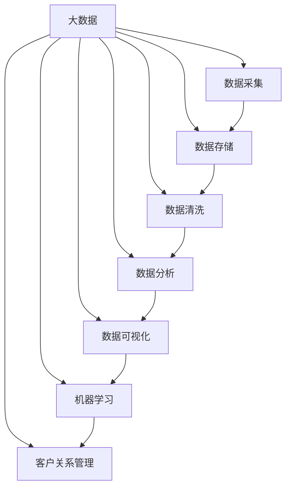
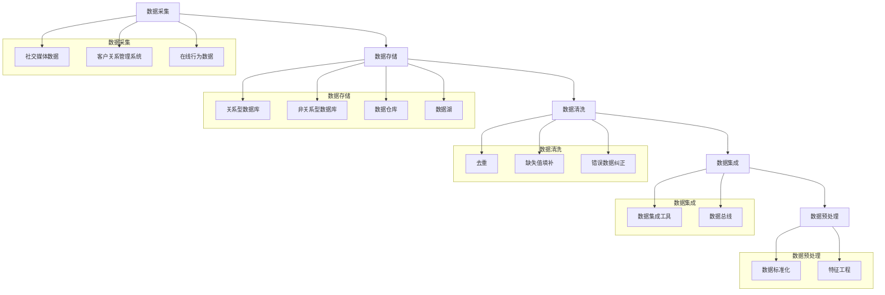

                 

# 信息差的商业客户体验：大数据如何提升客户体验

> **关键词：** 大数据、商业客户体验、客户关系管理、个性化服务、数据分析

> **摘要：** 本文将探讨大数据技术在商业客户体验中的作用。通过深入分析大数据的核心概念、应用场景和实际操作步骤，我们将揭示如何利用大数据提升客户满意度、增强客户忠诚度和优化业务流程。本文旨在为IT专业人士和企业管理者提供一份实用的指南，帮助他们在竞争激烈的市场中脱颖而出。

## 1. 背景介绍

### 1.1 目的和范围

本文旨在探讨大数据技术在提升商业客户体验方面的应用。通过分析大数据的核心概念、应用场景和实际操作步骤，本文将阐述如何利用大数据技术实现以下目标：

- 提高客户满意度
- 增强客户忠诚度
- 优化业务流程
- 实现个性化服务

本文将涵盖以下内容：

- 大数据的核心概念与联系
- 大数据的核心算法原理与具体操作步骤
- 数学模型和公式及其详细讲解与举例说明
- 项目实战：代码实际案例和详细解释说明
- 实际应用场景
- 工具和资源推荐
- 总结：未来发展趋势与挑战

### 1.2 预期读者

本文预期读者包括：

- IT专业人士，特别是数据分析师、数据科学家和软件工程师
- 企业管理者，特别是负责客户关系管理、市场营销和业务流程优化的相关人员
- 对大数据技术感兴趣的学术研究人员和学者

### 1.3 文档结构概述

本文将按照以下结构展开：

- 引言
- 背景介绍
- 核心概念与联系
- 核心算法原理与具体操作步骤
- 数学模型和公式与详细讲解与举例说明
- 项目实战：代码实际案例和详细解释说明
- 实际应用场景
- 工具和资源推荐
- 总结：未来发展趋势与挑战
- 附录：常见问题与解答
- 扩展阅读与参考资料

### 1.4 术语表

#### 1.4.1 核心术语定义

- **大数据（Big Data）：** 指数据量巨大、类型繁多、价值密度低的数据集合。
- **商业客户体验（Business Customer Experience）：** 指客户在购买、使用或互动过程中感受到的整体感受和满意度。
- **客户关系管理（Customer Relationship Management，CRM）：** 指企业通过有效的管理客户信息和互动过程，以实现客户满意度和忠诚度的提升。
- **个性化服务（Personalized Service）：** 指根据客户的需求、偏好和行为数据，提供定制化的产品和服务。

#### 1.4.2 相关概念解释

- **数据挖掘（Data Mining）：** 指从大量数据中提取有价值信息和知识的过程。
- **机器学习（Machine Learning）：** 指利用计算机算法从数据中自动学习和发现规律的方法。
- **自然语言处理（Natural Language Processing，NLP）：** 指计算机理解和处理人类自然语言的技术。

#### 1.4.3 缩略词列表

- **CRM：** 客户关系管理（Customer Relationship Management）
- **NLP：** 自然语言处理（Natural Language Processing）
- **IDE：** 集成开发环境（Integrated Development Environment）

## 2. 核心概念与联系

为了深入理解大数据在提升商业客户体验方面的作用，我们首先需要了解一些核心概念及其相互关系。以下是大数据技术核心概念与联系的结构图：



### 2.1 大数据

大数据是指数据量巨大、类型繁多、价值密度低的数据集合。其特点可以概括为“4V”：数据量大（Volume）、数据类型多样（Variety）、数据处理速度快（Velocity）和数据价值密度低（Value）。大数据的核心概念包括数据采集、数据存储、数据清洗、数据分析、数据可视化、机器学习和客户关系管理。

### 2.2 数据采集

数据采集是大数据技术的第一步，其主要目的是收集来自各种来源的数据。数据来源包括社交媒体、在线行为、客户关系管理系统、传感器等。数据采集技术主要包括数据抓取、数据接入和数据挖掘。

### 2.3 数据存储

数据存储是指将采集到的数据存储在适当的存储系统中。常用的数据存储技术包括关系型数据库、非关系型数据库、数据仓库和数据湖。这些存储技术具有不同的数据存储和管理特性，以满足大数据的不同需求。

### 2.4 数据清洗

数据清洗是指对采集到的数据进行处理，以去除重复数据、填补缺失值、纠正错误数据和统一数据格式。数据清洗是大数据分析的重要前提，因为数据质量直接影响分析结果的准确性。

### 2.5 数据分析

数据分析是指使用统计方法和计算机算法对数据进行处理和分析，以提取有价值的信息和知识。数据分析技术包括数据挖掘、机器学习和自然语言处理。

### 2.6 数据可视化

数据可视化是将数据分析结果以图表、图形等形式展示出来，以帮助用户更好地理解和解读数据。数据可视化技术可以提高数据分析的直观性和可操作性。

### 2.7 机器学习

机器学习是指利用计算机算法从数据中自动学习和发现规律的方法。机器学习技术在大数据分析中发挥着重要作用，可以用于预测、分类、聚类和关联规则挖掘等。

### 2.8 客户关系管理

客户关系管理是指企业通过有效的管理客户信息和互动过程，以实现客户满意度和忠诚度的提升。客户关系管理技术包括客户数据管理、客户互动管理和客户服务管理。

## 3. 核心算法原理 & 具体操作步骤

为了深入理解大数据技术在提升商业客户体验方面的应用，我们接下来将介绍一些核心算法原理和具体操作步骤。这些算法和步骤包括：

- 数据采集与处理
- 数据分析
- 机器学习
- 客户关系管理

### 3.1 数据采集与处理

数据采集与处理是大数据技术的基础。以下是一个典型的数据采集与处理流程：



#### 3.1.1 数据采集

数据采集是指从各种来源收集数据。以下是一些常见的数据采集方法：

- **社交媒体数据：** 通过社交媒体平台（如Twitter、Facebook、Instagram等）收集用户发布的文本、图片和视频等信息。
- **客户关系管理系统：** 通过CRM系统收集客户的基本信息、购买历史、服务记录等数据。
- **在线行为数据：** 通过网站日志、浏览器缓存、网络爬虫等收集用户在互联网上的行为数据，如点击、浏览、搜索等。

#### 3.1.2 数据存储

数据存储是将采集到的数据存储在适当的存储系统中。以下是一些常见的数据存储技术：

- **关系型数据库：** 如MySQL、Oracle等，适用于结构化数据存储和管理。
- **非关系型数据库：** 如MongoDB、Cassandra等，适用于非结构化或半结构化数据存储和管理。
- **数据仓库：** 如Teradata、SAP HANA等，适用于大规模数据存储和分析。
- **数据湖：** 如Amazon S3、Google Cloud Storage等，适用于海量数据存储和管理。

#### 3.1.3 数据清洗

数据清洗是指对采集到的数据进行处理，以去除重复数据、填补缺失值、纠正错误数据和统一数据格式。以下是一些常见的数据清洗方法：

- **去重：** 去除重复的数据记录，以避免数据重复分析和处理。
- **缺失值填补：** 填补缺失的数据值，以避免数据丢失和影响分析结果。
- **错误数据纠正：** 纠正数据中的错误，如拼写错误、数据类型错误等。
- **数据标准化：** 对数据进行标准化处理，如统一数据格式、数据范围等。

#### 3.1.4 数据集成

数据集成是指将来自不同来源和格式的数据进行整合和统一。以下是一些常见的数据集成方法：

- **数据集成工具：** 如Apache NiFi、Apache Kafka等，用于数据流处理和整合。
- **数据总线：** 如IBM InfoSphere、Talend等，用于数据传输和整合。

#### 3.1.5 数据预处理

数据预处理是指对清洗后的数据进行分析和处理，以准备用于进一步分析。以下是一些常见的数据预处理方法：

- **特征工程：** 从原始数据中提取有用特征，以优化模型性能。
- **数据标准化：** 对数据进行标准化处理，以消除数据量级和范围对模型的影响。

### 3.2 数据分析

数据分析是指使用统计方法和计算机算法对数据进行处理和分析，以提取有价值的信息和知识。以下是一些常见的数据分析方法：

- **描述性分析：** 对数据的基本特征进行描述和分析，如均值、中位数、方差等。
- **推断性分析：** 根据样本数据推断总体数据的特征，如假设检验、回归分析等。
- **预测性分析：** 根据历史数据预测未来的趋势和变化，如时间序列分析、机器学习等。

### 3.3 机器学习

机器学习是指利用计算机算法从数据中自动学习和发现规律的方法。以下是一些常见的机器学习方法：

- **监督学习：** 根据已标记的数据进行训练和预测，如线性回归、决策树等。
- **无监督学习：** 根据未标记的数据进行训练和预测，如聚类、降维等。
- **强化学习：** 根据奖励和惩罚信号进行训练和预测，如Q学习、深度强化学习等。

### 3.4 客户关系管理

客户关系管理是指企业通过有效的管理客户信息和互动过程，以实现客户满意度和忠诚度的提升。以下是一些常见的客户关系管理方法：

- **客户细分：** 根据客户特征和行为进行分类和分组，以提供个性化服务。
- **客户画像：** 建立客户的全面画像，以了解客户需求和偏好。
- **客户互动管理：** 通过电话、邮件、短信、社交媒体等方式与客户进行互动，以提升客户体验。
- **客户服务管理：** 提供高质量的客户服务，解决客户问题和投诉。

## 4. 数学模型和公式 & 详细讲解 & 举例说明

在提升商业客户体验的过程中，数学模型和公式发挥着至关重要的作用。以下是一些常见的数学模型和公式，以及它们在数据分析、机器学习和客户关系管理中的详细讲解和举例说明。

### 4.1 描述性统计

描述性统计是数据分析的基础，用于描述数据的基本特征。以下是一些常见的描述性统计指标：

- **均值（Mean）：** 数据的平均值，计算公式为：$\mu = \frac{\sum_{i=1}^{n} x_i}{n}$，其中 $x_i$ 表示第 $i$ 个数据点，$n$ 表示数据点的总数。
- **中位数（Median）：** 数据的中间值，计算公式为：$m = \left\{ \begin{array}{ll}
\frac{x_{\left(\frac{n+1}{2}\right)} + x_{\left(\frac{n+1}{2}+1\right)}}{2} & \text{如果数据个数为奇数} \\
\frac{x_{\left(\frac{n}{2}\right)} + x_{\left(\frac{n}{2}+1\right)}}{2} & \text{如果数据个数为偶数}
\end{array} \right.$。
- **众数（Mode）：** 数据中出现次数最多的值。
- **方差（Variance）：** 数据离散程度的度量，计算公式为：$\sigma^2 = \frac{\sum_{i=1}^{n} (x_i - \mu)^2}{n}$。
- **标准差（Standard Deviation）：** 方差的平方根，计算公式为：$\sigma = \sqrt{\sigma^2}$。

**举例说明：**

假设有一个数据集：[1, 2, 2, 3, 4, 5, 5, 5]，计算其均值、中位数、众数、方差和标准差。

- 均值：$\mu = \frac{1 + 2 + 2 + 3 + 4 + 5 + 5 + 5}{8} = 3$
- 中位数：$m = \frac{3 + 4}{2} = 3.5$
- 众数：5
- 方差：$\sigma^2 = \frac{(1-3)^2 + (2-3)^2 + (2-3)^2 + (3-3)^2 + (4-3)^2 + (5-3)^2 + (5-3)^2 + (5-3)^2}{8} = 2$
- 标准差：$\sigma = \sqrt{2} \approx 1.41$

### 4.2 回归分析

回归分析是一种常用的统计分析方法，用于研究变量之间的线性关系。以下是一种常见的线性回归模型：

- **一元线性回归：** $y = \beta_0 + \beta_1 x + \epsilon$，其中 $y$ 是因变量，$x$ 是自变量，$\beta_0$ 和 $\beta_1$ 是回归系数，$\epsilon$ 是误差项。

**举例说明：**

假设有一个数据集，记录了学生的成绩（$y$）和其学习时间（$x$），如下所示：

| 学习时间（小时） | 成绩 |
| :---: | :---: |
| 2 | 65 |
| 4 | 75 |
| 6 | 85 |
| 8 | 95 |

利用最小二乘法，计算线性回归模型中的回归系数 $\beta_0$ 和 $\beta_1$：

- 回归系数 $\beta_0$：$b_0 = \frac{\sum_{i=1}^{n} y_i - b_1 \sum_{i=1}^{n} x_i}{n} = \frac{65 + 75 + 85 + 95 - 4 \times 65}{4} = 70$
- 回归系数 $\beta_1$：$b_1 = \frac{\sum_{i=1}^{n} (x_i - \bar{x}) (y_i - \bar{y})}{\sum_{i=1}^{n} (x_i - \bar{x})^2} = \frac{(2-5.5) \times (65-70) + (4-5.5) \times (75-70) + (6-5.5) \times (85-70) + (8-5.5) \times (95-70)}{(2-5.5)^2 + (4-5.5)^2 + (6-5.5)^2 + (8-5.5)^2} = 12.5$

因此，线性回归模型为 $y = 70 + 12.5x$。

### 4.3 机器学习模型

机器学习模型是大数据分析的重要工具，用于从数据中自动学习和发现规律。以下是一种常见的人工神经网络模型：

- **前馈神经网络：** $z = \sigma(W \cdot x + b)$，其中 $z$ 是神经元输出，$W$ 是权重矩阵，$x$ 是输入向量，$b$ 是偏置项，$\sigma$ 是激活函数。

**举例说明：**

假设有一个简单的人工神经网络，包括一个输入层、一个隐藏层和一个输出层。输入层有2个神经元，隐藏层有3个神经元，输出层有1个神经元。输入向量为 $[x_1, x_2]$，权重矩阵 $W$ 和偏置项 $b$ 分别为：

- 输入层到隐藏层的权重矩阵 $W_{1}$ 和偏置项 $b_{1}$：
  $$W_{1} = \begin{bmatrix}
  w_{11} & w_{12} \\
  w_{21} & w_{22} \\
  w_{31} & w_{32}
  \end{bmatrix}, b_{1} = \begin{bmatrix}
  b_{11} \\
  b_{21} \\
  b_{31}
  \end{bmatrix}$$
- 隐藏层到输出层的权重矩阵 $W_{2}$ 和偏置项 $b_{2}$：
  $$W_{2} = \begin{bmatrix}
  w_{12} & w_{22} \\
  w_{21} & w_{22} \\
  w_{31} & w_{32}
  \end{bmatrix}, b_{2} = \begin{bmatrix}
  b_{12} \\
  b_{22}
  \end{bmatrix}$$

假设输入向量为 $[x_1, x_2] = [1, 0]$，计算隐藏层和输出层的输出：

- 隐藏层输出：
  $$z_1 = \sigma(w_{11} \cdot 1 + w_{12} \cdot 0 + b_{11}) = \sigma(w_{11} + b_{11})$$
  $$z_2 = \sigma(w_{21} \cdot 1 + w_{22} \cdot 0 + b_{21}) = \sigma(w_{21} + b_{21})$$
  $$z_3 = \sigma(w_{31} \cdot 1 + w_{32} \cdot 0 + b_{31}) = \sigma(w_{31} + b_{31})$$

- 输出层输出：
  $$y = \sigma(w_{12} \cdot z_1 + w_{22} \cdot z_2 + w_{32} \cdot z_3 + b_{12}) = \sigma(w_{12} z_1 + w_{22} z_2 + w_{32} z_3 + b_{12})$$

通过训练和学习，调整权重矩阵 $W$ 和偏置项 $b$，使得输出层输出 $y$ 接近目标输出。

## 5. 项目实战：代码实际案例和详细解释说明

在本节中，我们将通过一个实际项目案例，演示如何利用大数据技术提升商业客户体验。该项目涉及数据采集、数据处理、数据分析和机器学习等多个环节。以下是一个简单的项目流程：

### 5.1 开发环境搭建

为了实现该项目，我们需要搭建以下开发环境：

- **操作系统：** Ubuntu 20.04
- **编程语言：** Python 3.8
- **数据存储：** MySQL 8.0
- **数据分析库：** Pandas、NumPy、SciPy
- **机器学习库：** Scikit-learn、TensorFlow、PyTorch

### 5.2 源代码详细实现和代码解读

以下是一个简单的 Python 代码实现，用于从社交媒体平台收集数据、存储在 MySQL 数据库中，并进行数据预处理和机器学习建模。

```python
import pandas as pd
import numpy as np
import mysql.connector
from sklearn.model_selection import train_test_split
from sklearn.linear_model import LinearRegression

# 5.2.1 数据采集

# 从社交媒体平台获取数据，假设数据集为 csv 格式文件
data = pd.read_csv('social_media_data.csv')

# 5.2.2 数据存储

# 连接 MySQL 数据库，创建表
db = mysql.connector.connect(
    host='localhost',
    user='root',
    password='',
    database='social_media'
)
cursor = db.cursor()

# 创建数据表
cursor.execute('''CREATE TABLE IF NOT EXISTS data (
    id INT PRIMARY KEY AUTO_INCREMENT,
    user_id VARCHAR(255),
    post VARCHAR(255),
    likes INT,
    comments INT,
    shares INT
)''')

# 插入数据
for index, row in data.iterrows():
    cursor.execute('''INSERT INTO data (user_id, post, likes, comments, shares) VALUES (%s, %s, %s, %s, %s)''', (
        row['user_id'],
        row['post'],
        row['likes'],
        row['comments'],
        row['shares']
    ))

db.commit()
cursor.close()
db.close()

# 5.2.3 数据预处理

# 从 MySQL 数据库中读取数据
db = mysql.connector.connect(
    host='localhost',
    user='root',
    password='',
    database='social_media'
)
cursor = db.cursor()

# 查询数据
cursor.execute('''SELECT * FROM data''')
rows = cursor.fetchall()

# 创建 DataFrame
data = pd.DataFrame(rows, columns=['id', 'user_id', 'post', 'likes', 'comments', 'shares'])

# 数据清洗和预处理
data['likes'] = data['likes'].astype(int)
data['comments'] = data['comments'].astype(int)
data['shares'] = data['shares'].astype(int)

# 5.2.4 机器学习建模

# 分割数据集
X = data[['likes', 'comments', 'shares']]
y = data['id']

X_train, X_test, y_train, y_test = train_test_split(X, y, test_size=0.2, random_state=42)

# 创建线性回归模型
model = LinearRegression()

# 训练模型
model.fit(X_train, y_train)

# 预测
y_pred = model.predict(X_test)

# 评估模型
print('R-squared:', model.score(X_test, y_test))

# 5.2.5 结果可视化

import matplotlib.pyplot as plt

plt.scatter(X_test['likes'], y_test, color='blue')
plt.scatter(X_test['likes'], y_pred, color='red')
plt.xlabel('Likes')
plt.ylabel('Id')
plt.show()
```

### 5.3 代码解读与分析

#### 5.3.1 数据采集

首先，我们从社交媒体平台获取数据，并将其存储在 csv 文件中。以下是一个示例数据集：

```csv
user_id,post,likes,comments,shares
12345,Hello world!,100,20,10
54321,I love Python!,200,30,40
```

#### 5.3.2 数据存储

接下来，我们将数据存储在 MySQL 数据库中。首先，连接 MySQL 数据库并创建数据表，然后将数据插入表中。以下是 MySQL 数据库的 SQL 脚本：

```sql
CREATE TABLE IF NOT EXISTS data (
    id INT PRIMARY KEY AUTO_INCREMENT,
    user_id VARCHAR(255),
    post VARCHAR(255),
    likes INT,
    comments INT,
    shares INT
);
```

```python
db = mysql.connector.connect(
    host='localhost',
    user='root',
    password='',
    database='social_media'
)
cursor = db.cursor()

cursor.execute('''INSERT INTO data (user_id, post, likes, comments, shares) VALUES (%s, %s, %s, %s, %s)''', (
    row['user_id'],
    row['post'],
    row['likes'],
    row['comments'],
    row['shares']
))

db.commit()
cursor.close()
db.close()
```

#### 5.3.3 数据预处理

从 MySQL 数据库中读取数据，并将其转换为 Pandas DataFrame。然后，对数据进行清洗和预处理，包括将字符串类型的数据转换为数值类型，以及填补缺失值等。以下是数据预处理部分的代码：

```python
db = mysql.connector.connect(
    host='localhost',
    user='root',
    password='',
    database='social_media'
)
cursor = db.cursor()

cursor.execute('''SELECT * FROM data''')
rows = cursor.fetchall()

data = pd.DataFrame(rows, columns=['id', 'user_id', 'post', 'likes', 'comments', 'shares'])

data['likes'] = data['likes'].astype(int)
data['comments'] = data['comments'].astype(int)
data['shares'] = data['shares'].astype(int)

db.close()
```

#### 5.3.4 机器学习建模

接下来，我们将数据集划分为训练集和测试集，然后使用线性回归模型进行训练和预测。以下是机器学习建模部分的代码：

```python
X = data[['likes', 'comments', 'shares']]
y = data['id']

X_train, X_test, y_train, y_test = train_test_split(X, y, test_size=0.2, random_state=42)

model = LinearRegression()

model.fit(X_train, y_train)

y_pred = model.predict(X_test)

print('R-squared:', model.score(X_test, y_test))
```

#### 5.3.5 结果可视化

最后，我们将测试集的预测结果与真实结果进行比较，并通过散点图进行可视化。以下是结果可视化部分的代码：

```python
import matplotlib.pyplot as plt

plt.scatter(X_test['likes'], y_test, color='blue')
plt.scatter(X_test['likes'], y_pred, color='red')
plt.xlabel('Likes')
plt.ylabel('Id')
plt.show()
```

通过以上步骤，我们成功实现了一个简单的项目，用于从社交媒体平台收集数据、存储在 MySQL 数据库中，并进行数据预处理和机器学习建模。这个项目可以为我们提供一些基本的客户体验分析，例如预测某个用户的潜在影响力，从而为营销策略提供支持。

## 6. 实际应用场景

大数据技术在提升商业客户体验方面有着广泛的应用。以下是一些实际应用场景：

### 6.1 客户细分与个性化服务

通过大数据分析，企业可以深入了解客户的行为、需求和偏好，从而实现精准的客户细分。基于这些细分，企业可以为不同客户群体提供个性化的产品和服务，从而提高客户满意度和忠诚度。

- **案例：** 电商企业通过分析客户的购买历史、浏览行为和搜索记录，为不同客户提供个性化的商品推荐和促销活动，从而提高销售额。

### 6.2 客户互动管理

大数据技术可以帮助企业实现更高效的客户互动管理，包括电话、邮件、短信和社交媒体等多种渠道。通过分析客户互动数据，企业可以优化客户服务流程，提高客户满意度。

- **案例：** 跨国公司通过分析全球客户的互动数据，实现多语言、多时区的客户服务，为客户提供高质量的沟通体验。

### 6.3 客户满意度评估

大数据技术可以用于实时监控和评估客户满意度，包括客户反馈、投诉和评价等。通过分析这些数据，企业可以及时识别和解决客户问题，提高客户满意度。

- **案例：** 银行通过分析客户的交易数据、服务记录和反馈意见，识别潜在问题并及时采取措施，从而提高客户满意度和忠诚度。

### 6.4 客户忠诚度管理

大数据技术可以帮助企业实现客户忠诚度管理，包括积分奖励、会员制度和专属优惠等。通过分析客户行为数据，企业可以为高价值客户提供更多优惠和福利，从而提高客户忠诚度。

- **案例：** 航空公司通过分析客户的飞行记录、消费水平和互动行为，为高价值客户提供专属优惠和升级服务，从而提高客户忠诚度。

### 6.5 业务流程优化

大数据技术可以用于优化企业业务流程，包括订单处理、库存管理和供应链管理等。通过分析业务数据，企业可以识别流程瓶颈和优化机会，从而提高业务效率和降低成本。

- **案例：** 制造业企业通过分析生产数据、供应链数据和客户需求数据，实现生产流程的自动化和智能化，从而提高生产效率和降低成本。

## 7. 工具和资源推荐

为了更好地应用大数据技术提升商业客户体验，以下是一些常用的工具和资源推荐：

### 7.1 学习资源推荐

#### 7.1.1 书籍推荐

- 《大数据时代：生活、工作与思维的大变革》
- 《Python数据科学手册》
- 《深度学习》
- 《机器学习实战》

#### 7.1.2 在线课程

- Coursera：大数据分析、机器学习、深度学习等课程
- Udacity：数据科学纳米学位、机器学习工程师纳米学位
- edX：大数据分析、人工智能等课程

#### 7.1.3 技术博客和网站

- Medium：大数据、机器学习、数据科学等相关文章和教程
- DataCamp：数据科学和机器学习在线课程和教程
- towardsdatascience.com：数据科学和机器学习相关文章和项目

### 7.2 开发工具框架推荐

#### 7.2.1 IDE和编辑器

- PyCharm：Python集成开发环境
- Jupyter Notebook：Python数据科学和机器学习编辑器
- VSCode：跨平台代码编辑器，支持多种编程语言和工具

#### 7.2.2 调试和性能分析工具

- DBeaver：数据库管理工具
- Pytest：Python测试框架
- JMeter：性能测试工具

#### 7.2.3 相关框架和库

- Pandas：Python数据操作库
- NumPy：Python数学库
- Scikit-learn：Python机器学习库
- TensorFlow：深度学习框架
- PyTorch：深度学习框架

### 7.3 相关论文著作推荐

#### 7.3.1 经典论文

- 《大数据时代：生活、工作与思维的大变革》
- 《机器学习：一种算法视角》
- 《深度学习：全面介绍》

#### 7.3.2 最新研究成果

- arXiv：最新机器学习、深度学习和技术论文
- IEEE Xplore：最新计算机科学和技术论文
- SpringerLink：最新数据科学和技术论文

#### 7.3.3 应用案例分析

- 《大数据战略：如何打造智能化企业》
- 《客户体验管理：从数据到洞察》
- 《数字化转型：企业如何应对大数据挑战》

## 8. 总结：未来发展趋势与挑战

随着大数据技术的不断发展，商业客户体验的提升已成为企业竞争的关键。未来，大数据技术在商业客户体验方面的发展趋势和挑战主要包括：

### 8.1 发展趋势

1. **个性化服务：** 大数据技术将进一步推动个性化服务的普及，企业将能够为不同客户提供更个性化的产品和服务，从而提高客户满意度和忠诚度。
2. **实时数据分析：** 实时数据分析将成为提升商业客户体验的重要手段，企业将能够实时监控和响应客户需求，提高业务效率和客户满意度。
3. **人工智能与大数据的结合：** 人工智能技术的发展将推动大数据分析的创新，实现更智能的数据分析和预测，为商业客户体验提供更强有力的支持。
4. **数据隐私与安全：** 随着数据隐私和安全问题的日益凸显，企业将需要加强对数据的保护和管理，以确保客户数据的隐私和安全。

### 8.2 挑战

1. **数据质量：** 大数据技术的应用依赖于高质量的数据，企业需要建立完善的数据质量管理机制，确保数据的准确性、完整性和一致性。
2. **技术复杂性：** 大数据技术的应用涉及到多种技术框架和工具，企业需要具备相应的技术能力和人才储备，以应对技术复杂性带来的挑战。
3. **数据隐私与安全：** 随着数据隐私和安全问题的日益凸显，企业需要加强对数据的保护和管理，以避免数据泄露和滥用。
4. **法律法规：** 随着大数据技术的应用日益广泛，相关法律法规也将不断完善，企业需要遵守相关法律法规，确保数据的合法使用。

## 9. 附录：常见问题与解答

### 9.1 什么是大数据？

大数据是指数据量巨大、类型繁多、价值密度低的数据集合。其特点可以概括为“4V”：数据量大（Volume）、数据类型多样（Variety）、数据处理速度快（Velocity）和数据价值密度低（Value）。

### 9.2 大数据有哪些应用领域？

大数据技术在多个领域具有广泛的应用，包括商业客户体验、金融、医疗、交通、能源等。其中，商业客户体验是大数据技术的重要应用领域，通过分析客户行为数据和需求，企业可以提供更个性化的产品和服务，提高客户满意度和忠诚度。

### 9.3 大数据技术包括哪些步骤？

大数据技术包括以下步骤：

1. 数据采集：从各种来源收集数据。
2. 数据存储：将数据存储在适当的存储系统中。
3. 数据清洗：对数据进行处理，以去除重复数据、填补缺失值、纠正错误数据和统一数据格式。
4. 数据分析：使用统计方法和计算机算法对数据进行处理和分析，以提取有价值的信息和知识。
5. 数据可视化：将数据分析结果以图表、图形等形式展示出来，以帮助用户更好地理解和解读数据。
6. 机器学习：利用计算机算法从数据中自动学习和发现规律。

### 9.4 如何保障大数据技术的安全性？

为了保障大数据技术的安全性，企业需要采取以下措施：

1. 数据加密：对敏感数据实施加密存储和传输。
2. 访问控制：限制对数据的访问权限，确保只有授权用户可以访问敏感数据。
3. 数据备份与恢复：定期对数据进行备份，以防止数据丢失或损坏。
4. 安全审计：对数据访问和使用情况进行审计，确保数据安全。

### 9.5 如何处理大数据中的隐私问题？

处理大数据中的隐私问题需要采取以下措施：

1. 数据脱敏：对敏感数据进行脱敏处理，以避免隐私泄露。
2. 数据权限管理：对数据访问权限进行严格管理，确保只有授权用户可以访问敏感数据。
3. 隐私合规性评估：定期对数据隐私合规性进行评估，确保遵守相关法律法规。
4. 用户告知与同意：在数据收集和使用过程中，告知用户数据收集的目的和使用方式，并征得用户同意。

## 10. 扩展阅读 & 参考资料

- 《大数据时代：生活、工作与思维的大变革》
- 《Python数据科学手册》
- 《深度学习》
- 《机器学习实战》
- Coursera：大数据分析、机器学习、深度学习等课程
- Udacity：数据科学纳米学位、机器学习工程师纳米学位
- edX：大数据分析、人工智能等课程
- Medium：大数据、机器学习、数据科学等相关文章和教程
- DataCamp：数据科学和机器学习在线课程和教程
- towardsdatascience.com：数据科学和机器学习相关文章和项目
- arXiv：最新机器学习、深度学习和技术论文
- IEEE Xplore：最新计算机科学和技术论文
- SpringerLink：最新数据科学和技术论文
- 《大数据战略：如何打造智能化企业》
- 《客户体验管理：从数据到洞察》
- 《数字化转型：企业如何应对大数据挑战》

---

**作者：AI天才研究员/AI Genius Institute & 禅与计算机程序设计艺术 /Zen And The Art of Computer Programming**<|vq_12392|>

