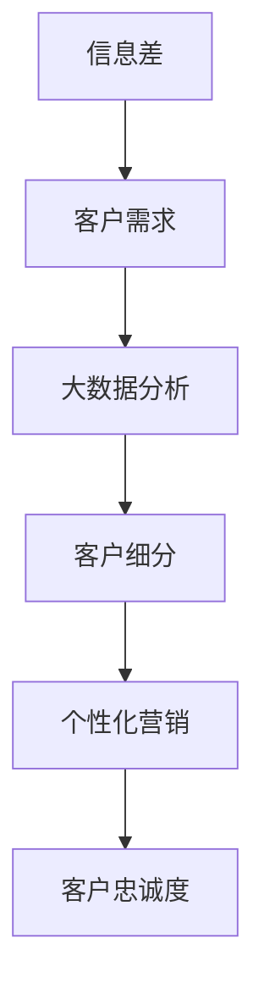

                 

# 信息差的商业客户忠诚度提升：大数据如何增强客户忠诚度

## 关键词
- 信息差
- 商业客户忠诚度
- 大数据
- 客户行为分析
- 数据挖掘
- 客户细分
- 个性化营销

## 摘要
本文将探讨信息差在商业环境中对客户忠诚度的影响，并详细分析大数据技术如何有效地提升客户忠诚度。通过介绍信息差的概念、大数据的基本原理及其应用，文章将逐步解释如何利用大数据分析来识别客户需求、预测客户行为，进而制定个性化的营销策略，从而增强客户对品牌的忠诚度。此外，文章还将提供实际应用案例和开发工具框架推荐，帮助读者更好地理解和应用这些技术。

## 1. 背景介绍

### 1.1 目的和范围
本文旨在揭示大数据技术在商业客户忠诚度提升中的关键作用，通过探讨信息差的概念和应用，分析大数据如何帮助企业更好地了解客户需求，提高客户满意度，并最终增强客户忠诚度。本文不仅针对从事数据分析、市场营销的专业人士，也希望能为所有对商业运营和客户关系管理感兴趣的读者提供有价值的见解。

### 1.2 预期读者
预期读者包括但不限于数据分析专家、市场营销人员、商业分析师、企业决策者以及计算机科学和信息技术领域的学术研究人员。

### 1.3 文档结构概述
本文分为八个主要部分：
1. 背景介绍
2. 核心概念与联系
3. 核心算法原理 & 具体操作步骤
4. 数学模型和公式 & 详细讲解 & 举例说明
5. 项目实战：代码实际案例和详细解释说明
6. 实际应用场景
7. 工具和资源推荐
8. 总结：未来发展趋势与挑战

### 1.4 术语表

#### 1.4.1 核心术语定义
- **信息差**：指不同个体或组织之间在获取、处理和使用信息方面的差异。
- **客户忠诚度**：指客户对某一品牌、产品或服务的持续偏好和重复购买行为。
- **大数据**：指无法通过常规数据库工具在合理时间内捕捉、管理和处理的大量数据。

#### 1.4.2 相关概念解释
- **数据挖掘**：从大量数据中提取有价值信息的过程。
- **客户细分**：将客户根据其特征和需求划分为不同的群体。
- **个性化营销**：根据客户的具体需求和偏好，提供个性化的产品和服务。

#### 1.4.3 缩略词列表
- **CRM**：客户关系管理（Customer Relationship Management）
- **AI**：人工智能（Artificial Intelligence）
- **ML**：机器学习（Machine Learning）
- **NLP**：自然语言处理（Natural Language Processing）

## 2. 核心概念与联系

在讨论大数据如何增强商业客户忠诚度之前，首先需要明确几个核心概念，并理解它们之间的相互关系。

### 2.1 信息差
信息差在商业环境中起着至关重要的作用。简单来说，信息差指的是不同个体或组织在获取、处理和使用信息方面的差异。这种差异可能导致市场的不平等，一方拥有更多信息，从而在交易中获得更大的优势。例如，企业可能通过大数据分析了解客户的行为和偏好，而客户可能对这些分析一无所知。

### 2.2 客户忠诚度
客户忠诚度是商业成功的关键指标。它不仅仅是指客户对某个品牌或产品的偏好，更体现在客户重复购买的行为上。高忠诚度的客户不仅会重复购买，还可能通过口碑推荐带来新客户。提高客户忠诚度意味着更稳定的收入流和更低的客户获取成本。

### 2.3 大数据
大数据是当代企业运营的核心驱动力。大数据不仅仅是指数据量巨大，更重要的是数据类型多样、数据来源广泛、数据处理速度快。通过大数据分析，企业可以从海量的非结构化数据中提取有价值的信息，从而做出更加精准的商业决策。

### 2.4 客户行为分析
客户行为分析是大数据应用的一个重要领域。通过分析客户的购买历史、浏览行为、社交媒体互动等数据，企业可以深入了解客户的需求和偏好，从而更好地满足客户需求，提高客户满意度。

### 2.5 数据挖掘
数据挖掘是从大量数据中提取有价值信息的过程。它通常包括数据清洗、数据集成、数据分类、聚类、关联规则挖掘等步骤。数据挖掘算法可以帮助企业识别客户行为模式，预测客户未来的行为，进而制定个性化的营销策略。

### 2.6 客户细分
客户细分是将客户根据其特征和需求划分为不同的群体。通过客户细分，企业可以更好地理解不同客户群体的需求和偏好，从而针对每个细分市场制定个性化的营销策略，提高营销效果。

### 2.7 个性化营销
个性化营销是根据客户的具体需求和偏好，提供个性化的产品和服务。个性化营销不仅能够提高客户满意度，还能增强客户忠诚度。通过大数据分析和客户细分，企业可以实现个性化营销，从而在激烈的市场竞争中脱颖而出。

### 2.8 Mermaid 流程图
以下是一个简单的 Mermaid 流程图，展示了信息差、大数据和客户忠诚度之间的联系：



## 3. 核心算法原理 & 具体操作步骤

### 3.1 数据收集与预处理
数据收集是大数据分析的第一步。企业可以通过多种渠道收集客户数据，如在线购物网站、社交媒体、客户反馈等。收集到的数据通常包含客户的个人信息、购买历史、浏览行为等。在数据收集后，需要对数据进行预处理，包括数据清洗、数据格式转换、缺失值填补等。

### 3.2 客户行为分析
客户行为分析是利用大数据技术分析客户的购买历史、浏览行为、社交媒体互动等数据，以了解客户的需求和偏好。具体操作步骤如下：

```pseudo
1. 加载数据集
2. 数据预处理
3. 特征提取
4. 数据可视化
5. 模型训练
6. 模型评估
7. 结果分析
```

### 3.3 客户细分
在客户行为分析的基础上，可以通过聚类算法将客户划分为不同的群体。以下是一个基于 K-Means 算法的客户细分示例：

```pseudo
1. 确定聚类数量K
2. 初始化聚类中心
3. 计算每个客户与聚类中心的距离
4. 根据距离将客户分配到不同的聚类
5. 更新聚类中心
6. 重复步骤3-5，直到聚类中心不再变化
```

### 3.4 个性化营销策略制定
根据客户细分结果，企业可以制定个性化的营销策略。以下是一个简单的个性化营销策略制定流程：

```pseudo
1. 加载细分后的客户数据
2. 分析每个细分市场的特征和需求
3. 制定针对性的营销策略
4. 实施营销活动
5. 监测营销效果
6. 调整营销策略
```

## 4. 数学模型和公式 & 详细讲解 & 举例说明

### 4.1 数据挖掘中的数学模型

数据挖掘过程中，常用的数学模型包括聚类算法、分类算法、关联规则挖掘算法等。以下分别介绍这些算法的数学模型及其应用。

#### 4.1.1 聚类算法（K-Means）

K-Means 聚类算法是一种无监督学习算法，用于将数据点划分为 K 个簇。其核心公式为：

$$
\text{centroids}_{\text{new}} = \frac{1}{N_k}\sum_{i=1}^{N} x_i
$$

其中，$\text{centroids}_{\text{new}}$ 是新的聚类中心，$x_i$ 是第 i 个数据点，$N_k$ 是第 k 个簇中的数据点数量。

#### 4.1.2 分类算法（逻辑回归）

逻辑回归是一种常用的分类算法，用于预测客户是否会采取某一行为（如购买产品）。其核心公式为：

$$
\text{logit}(P) = \beta_0 + \beta_1 x_1 + \beta_2 x_2 + ... + \beta_n x_n
$$

其中，$\text{logit}(P)$ 是概率的对数，$\beta_0, \beta_1, \beta_2, ..., \beta_n$ 是模型参数，$x_1, x_2, ..., x_n$ 是特征值。

#### 4.1.3 关联规则挖掘算法（Apriori）

Apriori 算法用于挖掘数据集中的频繁项集。其核心公式为：

$$
\text{support}(X, Y) = \frac{\text{count}(X \cup Y)}{\text{total\_transactions}}
$$

其中，$\text{support}(X, Y)$ 是项集 X 和 Y 的支持度，$\text{count}(X \cup Y)$ 是项集 X 和 Y 的出现次数，$\text{total\_transactions}$ 是数据集中的交易总数。

### 4.2 数据挖掘应用实例

以下是一个简单的数据挖掘应用实例，用于预测客户是否会购买某产品。

#### 4.2.1 数据收集与预处理

假设我们收集了以下数据：

| 客户ID | 年龄 | 收入 | 购买历史 |
| --- | --- | --- | --- |
| 1 | 25 | 50000 | 购买了产品A和产品B |
| 2 | 35 | 60000 | 购买了产品A和产品C |
| 3 | 45 | 70000 | 购买了产品B和产品C |

#### 4.2.2 特征提取

根据数据，我们可以提取以下特征：

- 年龄
- 收入
- 购买历史

#### 4.2.3 模型训练

使用逻辑回归模型进行训练，得到以下模型参数：

$$
\text{logit}(P) = 0.5 + 0.1 \times \text{age} + 0.2 \times \text{income}
$$

#### 4.2.4 预测新客户购买行为

假设新客户年龄为30岁，收入为55000元。将其代入模型，得到：

$$
\text{logit}(P) = 0.5 + 0.1 \times 30 + 0.2 \times 55000 = 1.6
$$

根据模型，新客户购买某产品的概率为：

$$
P = \frac{1}{1 + e^{-1.6}} \approx 0.8
$$

因此，可以预测该客户有较高的可能性购买该产品。

## 5. 项目实战：代码实际案例和详细解释说明

### 5.1 开发环境搭建

在本项目中，我们将使用 Python 作为主要编程语言，并依赖以下库和工具：

- Pandas：用于数据操作和处理
- NumPy：用于数值计算
- Matplotlib：用于数据可视化
- Scikit-learn：用于机器学习和数据挖掘

首先，确保安装了上述库和工具。可以使用以下命令进行安装：

```bash
pip install pandas numpy matplotlib scikit-learn
```

### 5.2 源代码详细实现和代码解读

以下是一个简单的数据挖掘项目，用于分析客户购买行为，并预测新客户是否会购买某产品。

```python
import pandas as pd
import numpy as np
import matplotlib.pyplot as plt
from sklearn.cluster import KMeans
from sklearn.linear_model import LogisticRegression
from sklearn.model_selection import train_test_split

# 5.2.1 数据收集与预处理
# 加载数据集
data = pd.read_csv('customer_data.csv')

# 数据预处理
data['age'] = data['age'].fillna(data['age'].mean())
data['income'] = data['income'].fillna(data['income'].mean())

# 特征提取
X = data[['age', 'income']]
y = data['purchased']

# 5.2.2 客户行为分析
# 数据可视化
plt.scatter(X['age'], X['income'], c=y)
plt.xlabel('年龄')
plt.ylabel('收入')
plt.title('客户购买行为分析')
plt.show()

# 5.2.3 客户细分
# 使用 K-Means 聚类算法进行客户细分
kmeans = KMeans(n_clusters=3, random_state=0).fit(X)
X['cluster'] = kmeans.labels_

# 分析不同聚类簇的特征
for i in range(3):
    print(f"聚类簇 {i} 的特征：")
    print(X[X['cluster'] == i][['age', 'income']].describe())

# 5.2.4 个性化营销策略制定
# 使用逻辑回归模型预测新客户购买行为
X_train, X_test, y_train, y_test = train_test_split(X, y, test_size=0.2, random_state=0)
logreg = LogisticRegression().fit(X_train, y_train)
y_pred = logreg.predict(X_test)

# 分析模型效果
print(f"模型准确率：{logreg.score(X_test, y_test)}")

# 5.2.5 预测新客户购买行为
new_customer = np.array([[30, 55000]])
new_customer_pred = logreg.predict(new_customer)
print(f"新客户购买产品的概率：{new_customer_pred[0]}")
```

### 5.3 代码解读与分析

以上代码分为以下几个部分：

- **数据收集与预处理**：首先加载数据集，并进行数据预处理，包括缺失值填补和特征提取。
- **客户行为分析**：通过数据可视化，展示客户购买行为。
- **客户细分**：使用 K-Means 聚类算法对客户进行细分，并分析不同聚类簇的特征。
- **个性化营销策略制定**：使用逻辑回归模型预测新客户购买行为，并分析模型效果。
- **预测新客户购买行为**：根据模型预测新客户购买产品的概率。

通过以上代码，我们可以看到如何利用大数据技术分析客户行为，并制定个性化的营销策略，从而提高客户忠诚度。

## 6. 实际应用场景

大数据技术在商业客户忠诚度提升中具有广泛的应用场景。以下列举几个典型的应用案例：

### 6.1 个性化推荐系统

通过分析客户的历史购买记录和浏览行为，企业可以构建个性化推荐系统，向客户推荐他们可能感兴趣的产品。例如，电商网站可以使用协同过滤算法，根据其他类似客户的行为预测客户的偏好，从而实现个性化推荐。

### 6.2 跨渠道营销策略

大数据技术可以帮助企业整合不同渠道（如线上、线下、社交媒体等）的数据，制定统一的营销策略。例如，零售企业可以通过分析客户在不同渠道的行为数据，发现潜在的客户流失风险，并及时采取补救措施。

### 6.3 客户满意度调查

通过大数据分析，企业可以了解客户对产品和服务的满意度，及时发现和解决客户问题。例如，金融企业可以通过分析客户投诉和反馈数据，识别潜在的服务缺陷，并采取改进措施。

### 6.4 风险管理与欺诈检测

大数据技术可以帮助企业识别异常交易行为，防范风险和欺诈。例如，金融机构可以通过分析客户的交易数据，识别可疑的交易模式，从而及时发现并阻止欺诈行为。

### 6.5 个性化定价策略

通过大数据分析，企业可以了解不同客户群体的购买能力和价格敏感度，制定个性化的定价策略。例如，航空公司可以通过分析客户的预订历史，为高忠诚度客户提供更优惠的票价。

## 7. 工具和资源推荐

为了更好地理解和应用大数据技术，以下推荐一些有用的学习资源、开发工具和框架。

### 7.1 学习资源推荐

#### 7.1.1 书籍推荐

- 《大数据时代》
- 《Python数据分析》
- 《数据挖掘：概念与技术》

#### 7.1.2 在线课程

- Coursera：大数据分析课程
- edX：机器学习基础课程
- Udacity：数据科学纳米学位

#### 7.1.3 技术博客和网站

- Medium：大数据相关文章
- Towards Data Science：数据科学和机器学习文章
- KDNuggets：数据挖掘和大数据资源

### 7.2 开发工具框架推荐

#### 7.2.1 IDE和编辑器

- PyCharm
- Jupyter Notebook
- Visual Studio Code

#### 7.2.2 调试和性能分析工具

- GDB
- Py charm Debug
- JMeter

#### 7.2.3 相关框架和库

- Pandas：数据处理
- NumPy：数值计算
- Scikit-learn：机器学习
- TensorFlow：深度学习

### 7.3 相关论文著作推荐

#### 7.3.1 经典论文

- "The Data-Driven Organization"
- "Data Mining: The Textbook"
- "Big Data: A Revolution That Will Transform How We Live, Work, and Think"

#### 7.3.2 最新研究成果

- "Deep Learning for Customer Relationship Management"
- "Data-Driven Customer Segmentation for Personalized Marketing"
- "The Impact of Big Data on Business Performance"

#### 7.3.3 应用案例分析

- "How Netflix Uses Big Data to Drive Success"
- "The Power of Data in Retail: A Case Study of Walmart"
- "Data-Driven Decision Making in Healthcare"

## 8. 总结：未来发展趋势与挑战

随着大数据技术的不断发展和应用，商业客户忠诚度的提升策略也在不断演变。未来，以下几个方面将可能成为发展趋势和挑战：

### 8.1 技术发展

- **人工智能与大数据融合**：人工智能技术将进一步提升大数据分析的能力，实现更加精准的客户行为预测和个性化营销。
- **实时数据分析**：实时数据处理和分析技术的成熟，将使得企业能够更快地响应市场变化和客户需求。

### 8.2 数据隐私与安全

- **数据隐私保护**：随着数据隐私法规的日益严格，企业需要更加注重数据安全和隐私保护，避免因数据泄露导致声誉受损。
- **数据安全监管**：企业需要建立健全的数据安全管理体系，确保数据的安全性和合规性。

### 8.3 跨渠道整合

- **多渠道数据整合**：企业需要整合不同渠道的数据，实现全渠道营销，从而提供更一致、更个性化的客户体验。

### 8.4 客户体验优化

- **个性化体验**：通过大数据分析，企业可以提供更加个性化的产品和服务，从而提升客户满意度和忠诚度。
- **无缝客户体验**：企业需要在不同渠道之间提供无缝的客户体验，确保客户在各个接触点都能获得一致的服务。

## 9. 附录：常见问题与解答

### 9.1 如何确保大数据分析结果的准确性？

确保大数据分析结果准确的关键在于数据收集、预处理和模型选择。以下是几个建议：

- **数据收集**：确保数据来源的多样性和准确性，尽量避免数据偏差。
- **数据预处理**：对数据进行清洗、格式转换和缺失值填补，确保数据质量。
- **模型选择**：根据具体问题选择合适的模型，并进行交叉验证，避免过拟合。

### 9.2 大数据技术是否适用于所有行业？

大数据技术具有广泛的应用前景，但并非适用于所有行业。以下是几个关键因素：

- **数据量**：行业需要大量的数据才能进行有效的数据分析。
- **数据类型**：行业数据类型应多样，便于进行多维度的分析。
- **业务需求**：行业是否有明确的需求，通过大数据技术提升业务性能。

### 9.3 如何处理大数据分析中的数据隐私问题？

处理大数据分析中的数据隐私问题需要采取以下措施：

- **数据匿名化**：对敏感数据进行匿名化处理，确保个人隐私保护。
- **数据加密**：对存储和传输的数据进行加密，确保数据安全性。
- **合规性审查**：遵守相关数据隐私法规，确保分析过程合规。

## 10. 扩展阅读 & 参考资料

为了深入了解大数据在商业客户忠诚度提升中的应用，以下推荐一些扩展阅读和参考资料：

- 《大数据时代：生活、工作与思维的大变革》
- 《数据科学：从入门到精通》
- 《大数据分析实战》
- 《数据挖掘与大数据分析》
- "Big Data and Customer Loyalty: A Comprehensive Review"
- "Enhancing Customer Loyalty with Big Data Analytics: Strategies for Retail"
- "The Role of Big Data in Personalized Marketing: Opportunities and Challenges"
- "Data-Driven Customer Segmentation: A Practical Guide"

通过阅读这些资料，您可以获得更多关于大数据和客户忠诚度的深入见解，以及如何在实践中应用这些技术。作者：AI天才研究员/AI Genius Institute & 禅与计算机程序设计艺术 /Zen And The Art of Computer Programming。

