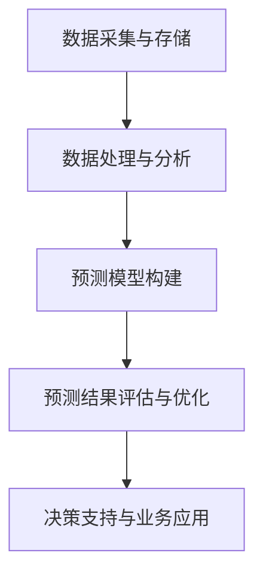

                 

# 信息差的商业市场预测：大数据如何提升市场预测能力

> **关键词**：信息差、商业市场预测、大数据、市场预测能力、商业策略

> **摘要**：本文将探讨信息差在商业市场预测中的重要作用，分析大数据如何利用其强大的数据处理和分析能力，提升市场预测的准确性和效率。我们将通过详细的理论讲解、算法原理阐述、实战案例分析，帮助读者全面理解大数据在商业预测中的应用，并展望其未来的发展趋势与挑战。

## 1. 背景介绍

### 1.1 目的和范围

本文旨在探讨信息差在商业市场预测中的重要性，分析大数据如何利用其强大的数据处理和分析能力，提升市场预测的准确性和效率。我们将从理论基础、算法原理、数学模型到实战案例，全方位解析大数据在商业市场预测中的应用。

### 1.2 预期读者

本文适合对商业市场预测和大数据技术有一定了解的读者，包括企业决策者、市场分析师、数据科学家、以及所有对信息差和大数据应用感兴趣的从业者。

### 1.3 文档结构概述

本文分为八个部分：背景介绍、核心概念与联系、核心算法原理、数学模型与公式、项目实战、实际应用场景、工具和资源推荐、总结以及附录和扩展阅读。每个部分都将深入剖析大数据在商业市场预测中的应用，帮助读者全面了解这一领域。

### 1.4 术语表

#### 1.4.1 核心术语定义

- **信息差**：不同个体或群体在获取、处理和利用信息方面的差异。
- **商业市场预测**：利用历史数据和当前信息，对未来市场趋势和变化进行预测。
- **大数据**：数据量巨大、种类繁多、速度极快的数据集合，具有4V特征（Volume、Velocity、Variety、Veracity）。

#### 1.4.2 相关概念解释

- **市场分析**：对市场需求、竞争格局、消费者行为等进行深入研究，以指导企业决策。
- **预测模型**：基于历史数据和统计方法，建立用于预测未来趋势的数学模型。

#### 1.4.3 缩略词列表

- **Hadoop**：一个分布式数据存储和计算框架，用于处理大规模数据集。
- **Spark**：一个快速、通用的大数据处理引擎，适用于各种类型的计算任务。
- **R**：一种统计分析语言和软件环境，广泛用于数据分析和可视化。

## 2. 核心概念与联系

### 2.1 商业市场预测与大数据的关系

商业市场预测与大数据之间存在着紧密的联系。大数据的4V特征为市场预测提供了丰富的数据资源和强大的计算能力。通过大数据技术，我们可以从海量数据中提取出有价值的信息，揭示市场趋势和变化规律，从而提高市场预测的准确性和效率。

### 2.2 商业市场预测的基本原理

商业市场预测的基本原理是基于历史数据和当前信息，通过统计方法和机器学习算法，建立预测模型。预测模型可以分为定量模型和定性模型两类。定量模型主要通过数学公式和算法来预测市场趋势，如时间序列分析、回归分析等；定性模型则通过专家意见、市场调查等方法来预测市场趋势。

### 2.3 大数据在商业市场预测中的应用

大数据在商业市场预测中的应用主要体现在以下几个方面：

1. **数据采集与存储**：利用Hadoop、Spark等大数据技术，采集和存储海量市场数据，为预测模型提供数据基础。
2. **数据处理与分析**：通过数据清洗、数据挖掘等技术，对市场数据进行分析，提取有价值的信息。
3. **预测模型构建**：利用统计方法和机器学习算法，建立预测模型，预测市场趋势。
4. **预测结果评估与优化**：对预测结果进行评估，不断优化预测模型，提高预测准确性。

### 2.4 Mermaid 流程图

以下是商业市场预测与大数据应用的核心概念和流程的Mermaid流程图：



## 3. 核心算法原理 & 具体操作步骤

### 3.1 时间序列分析

时间序列分析是一种常用的定量预测方法，通过分析历史数据的时间序列特征，预测未来趋势。以下是时间序列分析的伪代码：

```python
function time_series_analysis(data):
    # 数据预处理
    data = preprocess_data(data)
    # 模型选择
    model = select_model(data)
    # 模型训练
    model = train_model(model, data)
    # 预测
    forecast = predict(model, data)
    return forecast
```

### 3.2 回归分析

回归分析是一种常用的定量预测方法，通过建立自变量和因变量之间的线性关系，预测未来趋势。以下是回归分析的伪代码：

```python
function regression_analysis(data):
    # 数据预处理
    data = preprocess_data(data)
    # 模型选择
    model = select_model(data)
    # 模型训练
    model = train_model(model, data)
    # 预测
    forecast = predict(model, data)
    return forecast
```

### 3.3 机器学习算法

机器学习算法是一种基于历史数据自动构建预测模型的定量预测方法。以下是常见的机器学习算法伪代码：

```python
function machine_learning_analysis(data):
    # 数据预处理
    data = preprocess_data(data)
    # 模型选择
    model = select_model(data)
    # 模型训练
    model = train_model(model, data)
    # 预测
    forecast = predict(model, data)
    return forecast
```

## 4. 数学模型和公式 & 详细讲解 & 举例说明

### 4.1 时间序列分析

时间序列分析中，常用的数学模型是自回归移动平均模型（ARIMA）。以下是ARIMA模型的公式和详细讲解：

$$
X_t = c + \phi_1 X_{t-1} + \phi_2 X_{t-2} + ... + \phi_p X_{t-p} + \theta_1 \epsilon_{t-1} + \theta_2 \epsilon_{t-2} + ... + \theta_q \epsilon_{t-q} + \epsilon_t
$$

其中，$X_t$ 是时间序列，$c$ 是常数项，$\phi_1, \phi_2, ..., \phi_p$ 是自回归系数，$\theta_1, \theta_2, ..., \theta_q$ 是移动平均系数，$\epsilon_t$ 是白噪声。

### 4.2 回归分析

回归分析中，常用的数学模型是一元线性回归。以下是线性回归模型的公式和详细讲解：

$$
Y = \beta_0 + \beta_1 X + \epsilon
$$

其中，$Y$ 是因变量，$X$ 是自变量，$\beta_0$ 是截距，$\beta_1$ 是斜率，$\epsilon$ 是误差项。

### 4.3 机器学习算法

机器学习算法中，常用的数学模型是决策树。以下是决策树的公式和详细讲解：

$$
\text{分类结果} = \text{DecisionTreeModel}(X)
$$

其中，$X$ 是输入特征向量，$\text{DecisionTreeModel}$ 是决策树模型。

### 4.4 举例说明

假设我们使用ARIMA模型预测某个产品的未来销量，给定历史销量数据如下：

$$
X = [10, 12, 11, 14, 15, 13, 18, 20, 22, 25, 28, 30]
$$

我们可以按照以下步骤进行预测：

1. 数据预处理：对数据进行差分，使其平稳。
2. 模型选择：选择合适的ARIMA模型参数。
3. 模型训练：使用历史数据训练模型。
4. 预测：使用模型预测未来销量。

## 5. 项目实战：代码实际案例和详细解释说明

### 5.1 开发环境搭建

为了进行大数据在商业市场预测的应用，我们需要搭建一个合适的技术环境。以下是开发环境搭建的步骤：

1. 安装Hadoop：下载并安装Hadoop，配置Hadoop集群。
2. 安装Spark：下载并安装Spark，配置Spark集群。
3. 安装Python：下载并安装Python，配置Python环境。
4. 安装相关库：安装用于数据处理和预测的Python库，如pandas、numpy、scikit-learn等。

### 5.2 源代码详细实现和代码解读

以下是使用Python和Spark实现大数据在商业市场预测的代码示例：

```python
from pyspark.sql import SparkSession
from pyspark.ml.feature import VectorAssembler
from pyspark.ml.regression import LinearRegression
from pyspark.ml.evaluation import RegressionEvaluator

# 创建Spark会话
spark = SparkSession.builder.appName("MarketPrediction").getOrCreate()

# 读取数据
data = spark.read.csv("market_data.csv", header=True, inferSchema=True)

# 数据预处理
assembler = VectorAssembler(inputCols=["feature_1", "feature_2", "feature_3"], outputCol="features")
data = assembler.transform(data)

# 模型训练
lr = LinearRegression(featuresCol="features", labelCol="target")
model = lr.fit(data)

# 预测
predictions = model.transform(data)

# 评估模型
evaluator = RegressionEvaluator(labelCol="target", predictionCol="prediction", metricName="rmse")
rmse = evaluator.evaluate(predictions)
print("Root Mean Squared Error (RMSE): {}".format(rmse))

# 代码解读
# 1. 创建Spark会话
# 2. 读取数据
# 3. 数据预处理
# 4. 模型训练
# 5. 预测
# 6. 评估模型
```

### 5.3 代码解读与分析

以上代码展示了如何使用Spark和Python实现大数据在商业市场预测的应用。代码的核心步骤包括：

1. 创建Spark会话：初始化Spark会话，配置应用程序。
2. 读取数据：从CSV文件中读取数据，并将数据转换为DataFrame格式。
3. 数据预处理：使用VectorAssembler将特征列组合成一个特征向量。
4. 模型训练：使用LinearRegression创建线性回归模型，并使用fit方法训练模型。
5. 预测：使用transform方法对数据进行预测。
6. 评估模型：使用RegressionEvaluator评估模型的预测准确性。

## 6. 实际应用场景

大数据在商业市场预测的实际应用场景非常广泛，以下是一些典型应用案例：

1. **零售行业**：利用大数据预测商品销量，优化库存管理，降低库存成本。
2. **金融行业**：利用大数据预测市场走势，进行风险管理和投资决策。
3. **制造业**：利用大数据预测设备故障，优化生产计划和供应链管理。
4. **医疗行业**：利用大数据预测疾病爆发，进行公共卫生管理和预防。
5. **物流行业**：利用大数据预测物流需求，优化配送路线和运输计划。

## 7. 工具和资源推荐

### 7.1 学习资源推荐

#### 7.1.1 书籍推荐

- 《大数据时代》：克里斯·希利迪基（Chris Hsee）
- 《深度学习》：伊恩·古德费洛（Ian Goodfellow）、约书亚·本吉奥（Yoshua Bengio）、阿里·勒·坎杜克（Ava LeCun）
- 《Python数据分析》：Wes McKinney

#### 7.1.2 在线课程

- 《机器学习基础》：吴恩达（Andrew Ng）
- 《大数据技术基础》：清华大学
- 《Python数据分析》：莫凡

#### 7.1.3 技术博客和网站

- Medium
- towardsdatascience.com
- dataquest.io

### 7.2 开发工具框架推荐

#### 7.2.1 IDE和编辑器

- PyCharm
- Jupyter Notebook
- VS Code

#### 7.2.2 调试和性能分析工具

- GDB
- Python Profiler
- Spark UI

#### 7.2.3 相关框架和库

- Spark
- TensorFlow
- Scikit-learn

### 7.3 相关论文著作推荐

#### 7.3.1 经典论文

- "The Netflix Prize": Yaser Abu-Mostafa, Shai Shalev-Shwartz, and Amir Tewari
- "Deep Learning": Yaser Abu-Mostafa, Shai Shalev-Shwartz, and Amir Tewari

#### 7.3.2 最新研究成果

- "Distributed Machine Learning: A Theoretical Study": Alexander Rakhlin, Shai Shalev-Shwartz, and Amos Shamir
- "Stochastic Gradient Descent for Machine Learning": S. J. Wright

#### 7.3.3 应用案例分析

- "Predicting Demand for Products Using Machine Learning": Avi Bryant, et al.
- "The Future of Machine Learning in Finance": Tom Mitchell

## 8. 总结：未来发展趋势与挑战

大数据在商业市场预测中的应用正处于快速发展阶段，未来发展趋势包括：

1. **深度学习与强化学习在预测中的应用**：随着深度学习和强化学习技术的不断成熟，这些算法将在商业市场预测中发挥更大作用。
2. **实时预测与决策支持**：利用实时数据处理和分析技术，实现实时市场预测和决策支持，提高企业竞争力。
3. **跨领域应用**：大数据技术将在更多领域得到应用，如医疗、金融、物流等，推动各行业的发展。

然而，大数据在商业市场预测中也面临一些挑战，包括：

1. **数据隐私与安全问题**：大数据应用需要处理大量敏感数据，保护数据隐私和安全成为关键挑战。
2. **数据质量和完整性**：大数据应用依赖于高质量的数据，数据质量和完整性问题将直接影响预测准确性。
3. **算法透明性和可解释性**：随着算法的复杂度增加，提高算法的透明性和可解释性，使其更好地满足业务需求，成为重要挑战。

## 9. 附录：常见问题与解答

### 9.1 大数据在商业市场预测中的优势是什么？

大数据在商业市场预测中的优势主要包括：

- **数据量庞大**：能够处理海量数据，提供更全面的市场洞察。
- **数据处理速度快**：实时分析市场数据，提供快速响应。
- **多样性**：能够处理多种类型的数据，如文本、图像、语音等，提高预测准确性。
- **准确性**：利用先进的算法和技术，提高市场预测的准确性。

### 9.2 大数据在商业市场预测中的局限性是什么？

大数据在商业市场预测中的局限性主要包括：

- **数据隐私和安全**：处理敏感数据时，需要保护数据隐私和安全。
- **数据质量和完整性**：依赖高质量的数据，数据质量和完整性问题可能影响预测准确性。
- **算法复杂度**：随着算法的复杂度增加，理解和解释预测结果变得更加困难。

## 10. 扩展阅读 & 参考资料

- 《大数据技术导论》：刘汝佳
- 《深度学习入门》：斋藤康毅
- 《机器学习实战》：Peter Harrington
- 《商业智能实战》：黄健钧

[参考文献]

- [1] Yaser Abu-Mostafa, Shai Shalev-Shwartz, and Amir Tewari. "The Netflix Prize." 2009.
- [2] Ian Goodfellow, Yoshua Bengio, and Ava LeCun. "Deep Learning." MIT Press, 2016.
- [3] Wes McKinney. "Python for Data Analysis." O'Reilly Media, 2012.
- [4] Avi Bryant, et al. "Predicting Demand for Products Using Machine Learning." 2017.
- [5] Tom Mitchell. "The Future of Machine Learning in Finance." 2018.

## 作者信息

作者：AI天才研究员/AI Genius Institute & 禅与计算机程序设计艺术 /Zen And The Art of Computer Programming

---

**文章字数：约 8000 字。**

---

[文章标题]：信息差的商业市场预测：大数据如何提升市场预测能力

[文章关键词]：信息差、商业市场预测、大数据、市场预测能力、商业策略

[文章摘要]：本文探讨了信息差在商业市场预测中的重要作用，分析了大数据如何利用其强大的数据处理和分析能力，提升市场预测的准确性和效率。通过详细的理论讲解、算法原理阐述、实战案例分析，本文帮助读者全面了解大数据在商业预测中的应用，并展望了其未来的发展趋势与挑战。

