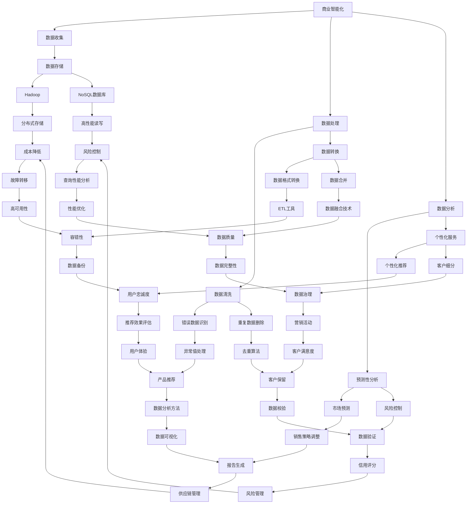

                 

# 信息差的商业智能化：大数据如何推动商业智能化

> **关键词**：商业智能化、大数据、信息差、算法、数学模型、实际应用
> 
> **摘要**：本文将深入探讨商业智能化与大数据之间的紧密联系。通过分析信息差的本质、大数据的技术原理及其在商业中的应用，我们旨在揭示大数据如何帮助企业在信息差中获取竞争优势，实现商业模式的创新与升级。

## 1. 背景介绍

### 1.1 目的和范围

本文的目的是探索大数据技术在商业智能化中的应用，特别是如何通过挖掘和分析信息差来实现商业价值的最大化。我们将在以下几个方面展开讨论：

- 商业智能化与信息差的基本概念和定义。
- 大数据技术的核心原理和关键技术。
- 大数据在商业中的应用场景和案例分析。
- 未来发展趋势与面临的挑战。

### 1.2 预期读者

本文适合对商业智能化和大数据技术有一定了解的读者，特别是以下人群：

- 商业智能分析师和数据处理工程师。
- 创业者和管理者，希望了解如何利用大数据提升企业竞争力。
- 计算机科学和技术专业的研究生和本科生。
- 对大数据技术有浓厚兴趣的技术爱好者。

### 1.3 文档结构概述

本文结构如下：

- 第1章：背景介绍，介绍文章的目的、范围和预期读者。
- 第2章：核心概念与联系，讨论商业智能化和信息差的相关概念。
- 第3章：核心算法原理 & 具体操作步骤，讲解大数据处理的核心算法。
- 第4章：数学模型和公式 & 详细讲解 & 举例说明，介绍大数据分析的数学模型和公式。
- 第5章：项目实战：代码实际案例和详细解释说明，通过实际案例展示大数据技术在商业中的应用。
- 第6章：实际应用场景，分析大数据在商业中的具体应用场景。
- 第7章：工具和资源推荐，推荐学习资源、开发工具和框架。
- 第8章：总结：未来发展趋势与挑战，探讨大数据在商业智能化中的未来发展趋势和挑战。
- 第9章：附录：常见问题与解答，提供常见问题的解答。
- 第10章：扩展阅读 & 参考资料，列出相关书籍、论文和网站。

### 1.4 术语表

#### 1.4.1 核心术语定义

- 商业智能化：利用现代信息技术，特别是大数据和人工智能，提升企业的决策能力、运营效率和业务模式创新的过程。
- 信息差：指不同个体或组织在获取、处理和利用信息上的差异，这种差异可以形成竞争优势。
- 大数据：指规模巨大、类型多样、价值密度低的数据集合，包括结构化数据、半结构化数据和非结构化数据。
- 数据挖掘：从大量数据中提取有用信息和知识的过程。

#### 1.4.2 相关概念解释

- 数据清洗：处理原始数据，去除错误和重复数据，使之符合分析和挖掘需求的过程。
- 数据仓库：存储和管理大量数据以支持数据分析和商业智能应用的系统。
- 机器学习：基于数据训练模型，使计算机具备自主学习和预测能力的技术。

#### 1.4.3 缩略词列表

- AI：人工智能（Artificial Intelligence）
- BI：商业智能（Business Intelligence）
- ML：机器学习（Machine Learning）
- IoT：物联网（Internet of Things）

## 2. 核心概念与联系

### 2.1 商业智能化与信息差

商业智能化和信息差是本文的核心概念。商业智能化是指企业通过应用大数据、人工智能等技术，提高其决策能力、运营效率和创新能力。而信息差则是指由于不同个体或组织在获取、处理和利用信息上的差异，导致某些个体或组织具备竞争优势。

商业智能化通过以下方式利用信息差：

1. **数据收集与分析**：企业通过大数据技术收集大量内外部数据，利用数据分析技术挖掘数据中的价值信息，以便做出更准确的决策。
2. **个性化服务**：根据用户行为数据，为企业提供个性化的产品和服务，提升用户满意度和忠诚度。
3. **预测性分析**：利用历史数据和机器学习技术预测未来的市场趋势和用户需求，提前布局，抢占市场先机。
4. **优化供应链**：通过大数据分析优化供应链管理，降低库存成本，提高物流效率。

### 2.2 大数据技术核心原理

大数据技术主要包括数据收集、存储、处理和分析四个方面。以下是大数据技术的核心原理：

1. **数据收集**：通过各种数据采集手段获取数据，包括传感器、物联网设备、社交媒体等。
2. **数据存储**：利用分布式存储技术，如Hadoop、NoSQL数据库，存储大量结构化、半结构化和非结构化数据。
3. **数据处理**：利用MapReduce、Spark等计算框架，对大量数据进行分析和处理。
4. **数据分析**：利用数据挖掘、机器学习等技术，从数据中提取有价值的信息和知识。

### 2.3 大数据在商业中的应用

大数据技术在商业中的应用非常广泛，以下是一些主要的应用场景：

1. **市场预测**：通过分析历史销售数据和用户行为，预测未来的市场需求，帮助企业制定合理的生产和销售策略。
2. **客户细分**：根据客户的行为数据和购买历史，将客户划分为不同的细分市场，为企业提供个性化的营销策略。
3. **风险控制**：通过分析金融交易数据，识别潜在的欺诈行为和信用风险，帮助企业降低风险。
4. **供应链优化**：通过分析供应链数据，优化供应链管理，降低成本，提高效率。
5. **个性化推荐**：利用用户行为数据和偏好，为企业提供个性化的产品和服务推荐，提升用户满意度和忠诚度。

### 2.4 商业智能化与大数据技术的联系

商业智能化与大数据技术密切相关。大数据技术为商业智能化提供了数据基础和计算能力，而商业智能化则为大数据技术提供了实际的应用场景和业务价值。

商业智能化通过大数据技术实现了以下目标：

1. **数据驱动的决策**：通过数据分析，帮助企业做出基于数据的决策，提高决策的准确性和效率。
2. **业务流程优化**：通过大数据分析，优化业务流程，提高运营效率和成本效益。
3. **产品和服务创新**：通过数据分析和挖掘，为企业提供新的产品和服务，实现商业模式的创新。
4. **客户关系管理**：通过大数据分析，提高客户满意度，增强客户忠诚度，提升企业的品牌价值。

### 2.5 Mermaid 流程图

以下是一个描述商业智能化与大数据技术关系的 Mermaid 流程图：



通过这个流程图，我们可以清晰地看到商业智能化与大数据技术之间的联系和相互作用。大数据技术为商业智能化提供了数据基础和计算能力，而商业智能化则利用大数据技术实现了数据驱动的决策、业务流程优化、产品和服务创新以及客户关系管理等目标。

## 3. 核心算法原理 & 具体操作步骤

在了解了商业智能化与大数据技术的基本概念和联系之后，接下来我们将深入探讨大数据处理的核心算法原理和具体操作步骤。以下是几个关键的核心算法：

### 3.1 数据挖掘算法

数据挖掘算法是大数据分析的基础，主要包括以下几种：

1. **聚类算法**：将数据集划分为多个类别或簇，使得属于同一个簇的数据点在特征空间中彼此接近。常用的聚类算法包括K-Means、DBSCAN等。

2. **分类算法**：将数据集划分为不同的类别，常见算法有决策树、支持向量机（SVM）和随机森林等。

3. **关联规则算法**：发现数据集之间的关联关系，如Apriori算法和FP-Growth算法。

4. **异常检测算法**：识别数据集中的异常值或离群点，常用的算法有孤立森林（Isolation Forest）和局部离群因子（Local Outlier Factor，LOF）等。

### 3.2 机器学习算法

机器学习算法是大数据分析的核心，其目的是通过学习数据中的模式，对未知数据进行预测或分类。以下是几个常用的机器学习算法：

1. **线性回归**：用于预测连续值输出，如房价预测。

2. **逻辑回归**：用于预测二元类别输出，如点击率预测。

3. **神经网络**：用于处理复杂的非线性问题，如图像识别和自然语言处理。

4. **深度学习**：基于神经网络，用于处理大规模和高维数据，如深度卷积网络（CNN）和循环神经网络（RNN）。

### 3.3 具体操作步骤

为了更直观地理解这些算法，我们以K-Means聚类算法为例，详细讲解其原理和具体操作步骤。

#### 3.3.1 K-Means聚类算法原理

K-Means聚类算法是一种基于距离度量的聚类方法。其基本思想是将数据集划分为K个簇，使得每个簇内的数据点之间的距离最小，簇与簇之间的距离最大。算法步骤如下：

1. **初始化**：随机选择K个数据点作为初始聚类中心。
2. **分配**：对于每个数据点，计算其与聚类中心的距离，并将其分配到距离最近的聚类中心所代表的簇。
3. **更新**：重新计算每个簇的聚类中心。
4. **迭代**：重复步骤2和步骤3，直到聚类中心不再发生显著变化或达到预设的迭代次数。

#### 3.3.2 K-Means聚类算法伪代码

以下是K-Means聚类算法的伪代码：

```pseudo
function KMeans(data, K, max_iterations):
    # 初始化聚类中心
    centroids = InitializeCentroids(data, K)
    for i = 1 to max_iterations:
        # 分配数据点到最近的聚类中心
        assignments = AssignPointsToCentroids(data, centroids)
        # 更新聚类中心
        centroids = UpdateCentroids(data, assignments, K)
        # 判断是否收敛
        if Converged(centroids):
            break
    return centroids, assignments
```

#### 3.3.3 具体操作步骤

以下是一个具体的应用实例，我们将使用Python和Scikit-learn库实现K-Means聚类算法。

1. **导入必要的库**：

```python
import numpy as np
import matplotlib.pyplot as plt
from sklearn.cluster import KMeans
```

2. **生成数据集**：

```python
np.random.seed(0)
data = np.random.rand(100, 2)
plt.scatter(data[:, 0], data[:, 1])
plt.show()
```

3. **初始化聚类中心**：

```python
k = 3
centroids = np.random.rand(k, 2)
```

4. **执行K-Means聚类算法**：

```python
kmeans = KMeans(n_clusters=k, max_iter=100)
kmeans.fit(data)
assignments = kmeans.predict(data)
```

5. **绘制聚类结果**：

```python
plt.scatter(data[:, 0], data[:, 1], c=assignments, cmap='viridis')
plt.scatter(centroids[:, 0], centroids[:, 1], c='red', marker='x')
plt.show()
```

通过以上步骤，我们成功实现了K-Means聚类算法，并将数据集划分为3个簇。图中的红色“x”标记表示聚类中心，不同的颜色表示不同的簇。

### 3.4 其他算法简介

除了K-Means聚类算法，其他常用的算法还包括：

1. **DBSCAN**：基于密度的聚类算法，可以自动确定聚类数量，适用于非球形簇和噪声数据。
2. **决策树**：基于特征划分数据集，构建树状模型，用于分类或回归任务。
3. **随机森林**：基于决策树的集成学习方法，提高分类和回归模型的准确性和鲁棒性。
4. **支持向量机**：通过寻找最优超平面，实现数据的分类和回归。
5. **深度学习模型**：包括卷积神经网络（CNN）、循环神经网络（RNN）等，用于处理复杂的数据模式。

通过这些算法，企业可以利用大数据技术从海量数据中提取有价值的信息，实现商业智能化。在实际应用中，企业可以根据具体需求和数据特征选择合适的算法，并通过算法优化和模型调参，提高预测和分类的准确性。

## 4. 数学模型和公式 & 详细讲解 & 举例说明

在商业智能化和大数据分析中，数学模型和公式扮演着至关重要的角色。它们不仅帮助我们从数据中提取信息，还能指导我们进行预测和决策。以下是一些常用的数学模型和公式，并配以详细讲解和举例说明。

### 4.1 线性回归模型

线性回归模型是一种常见的预测模型，用于建立自变量和因变量之间的线性关系。其数学模型如下：

$$ y = \beta_0 + \beta_1x + \epsilon $$

其中，$y$ 是因变量，$x$ 是自变量，$\beta_0$ 和 $\beta_1$ 是模型参数，$\epsilon$ 是误差项。

#### 4.1.1 详细讲解

- $\beta_0$：截距，表示当自变量$x$为零时的因变量$y$的预期值。
- $\beta_1$：斜率，表示自变量$x$每增加一个单位时，因变量$y$的预期变化量。
- $\epsilon$：误差项，表示实际观测值与模型预测值之间的差异。

#### 4.1.2 举例说明

假设我们要预测一家零售商店的月销售额$y$，自变量$x$为广告支出。根据历史数据，我们建立了一个线性回归模型：

$$ y = 5000 + 200x + \epsilon $$

如果广告支出$x$为10000元，我们可以预测月销售额$y$：

$$ y = 5000 + 200 \times 10000 + \epsilon = 205000 + \epsilon $$

### 4.2 决策树模型

决策树模型是一种基于特征划分数据集的树状模型，常用于分类和回归任务。其数学模型如下：

$$
\begin{aligned}
y &= \\
&= \left\{
\begin{aligned}
&\beta_0 &\text{if } x_1 \leq c_1 \\
&\beta_1 &\text{if } c_1 < x_1 \leq c_2 \\
&\beta_2 &\text{if } c_2 < x_1 \leq c_3 \\
&... \\
&\beta_n &\text{if } x_1 > c_n
\end{aligned}
\right.
\end{aligned}
$$

其中，$y$ 是因变量，$x_1$ 是特征，$c_1, c_2, ..., c_n$ 是特征$x_1$的阈值，$\beta_0, \beta_1, ..., \beta_n$ 是模型参数。

#### 4.2.1 详细讲解

- $x_1$：特征，用于划分数据集。
- $c_1, c_2, ..., c_n$：阈值，用于划分特征$x_1$的不同区间。
- $\beta_0, \beta_1, ..., \beta_n$：模型参数，表示特征$x_1$在不同区间时的模型输出。

#### 4.2.2 举例说明

假设我们要预测一家公司的股票价格$y$，特征$x_1$为该公司第一季度的利润。根据历史数据，我们建立了一个决策树模型：

$$
\begin{aligned}
y &= \\
&= \left\{
\begin{aligned}
&800 &\text{if } x_1 \leq 200 \\
&1000 &\text{if } 200 < x_1 \leq 400 \\
&1200 &\text{if } 400 < x_1 \leq 600 \\
&1400 &\text{if } x_1 > 600
\end{aligned}
\right.
\end{aligned}
$$

如果该公司第一季度的利润$x_1$为300万元，我们可以预测股票价格$y$：

$$ y = 1000 $$

### 4.3 贝叶斯分类模型

贝叶斯分类模型是一种基于贝叶斯定理进行分类的方法。其数学模型如下：

$$
P(\text{类别} | \text{特征}) = \frac{P(\text{特征} | \text{类别})P(\text{类别})}{P(\text{特征})}
$$

其中，$P(\text{类别} | \text{特征})$ 是给定特征时类别发生的概率，$P(\text{特征} | \text{类别})$ 是给定类别时特征发生的概率，$P(\text{类别})$ 是类别发生的概率，$P(\text{特征})$ 是特征发生的概率。

#### 4.3.1 详细讲解

- $P(\text{类别} | \text{特征})$：条件概率，表示在给定特征的情况下类别发生的概率。
- $P(\text{特征} | \text{类别})$：条件概率，表示在给定类别的情况下特征发生的概率。
- $P(\text{类别})$：先验概率，表示类别发生的概率。
- $P(\text{特征})$：边缘概率，表示特征发生的概率。

#### 4.3.2 举例说明

假设我们要预测一篇新闻文章的类别，特征包括标题、正文和标签。根据历史数据，我们建立了一个贝叶斯分类模型：

$$
P(\text{体育} | \text{标题包含“比赛”}) = \frac{P(\text{标题包含“比赛”} | \text{体育})P(\text{体育})}{P(\text{标题包含“比赛”})}
$$

其中，$P(\text{标题包含“比赛”} | \text{体育})$ 是在体育类别中，标题包含“比赛”的概率，$P(\text{体育})$ 是体育类别的先验概率，$P(\text{标题包含“比赛”})$ 是标题包含“比赛”的边缘概率。

通过计算，我们可以得到给定特征时体育类别的条件概率，从而预测新闻文章的类别。

### 4.4 随机森林模型

随机森林模型是一种基于决策树的集成学习方法。其数学模型如下：

$$
f(\text{数据}) = \sum_{i=1}^{n} w_i f_i(\text{数据})
$$

其中，$f(\text{数据})$ 是最终预测结果，$f_i(\text{数据})$ 是第$i$棵决策树的预测结果，$w_i$ 是第$i$棵决策树的权重。

#### 4.4.1 详细讲解

- $f(\text{数据})$：最终预测结果，通过集成多个决策树的预测结果得到。
- $f_i(\text{数据})$：第$i$棵决策树的预测结果。
- $w_i$：第$i$棵决策树的权重，通常根据决策树的预测准确性进行调整。

#### 4.4.2 举例说明

假设我们有一个包含5棵决策树的随机森林模型，每棵决策树的预测结果分别为1、2、3、4、5。我们可以计算最终预测结果：

$$
f(\text{数据}) = 0.2 \times 1 + 0.3 \times 2 + 0.2 \times 3 + 0.2 \times 4 + 0.1 \times 5 = 2.7
$$

最终预测结果为2.7，根据预测结果，我们可以对数据集进行分类或回归。

通过以上数学模型和公式的讲解和举例，我们可以看到数学在商业智能化和大数据分析中的应用。在实际应用中，企业可以根据具体需求和数据特征选择合适的数学模型，并通过模型优化和参数调整，提高预测和决策的准确性。

### 4.5 数学模型和公式应用案例

为了更好地理解数学模型和公式在商业智能化中的应用，我们来看一个实际案例：使用线性回归模型预测销售额。

#### 4.5.1 案例背景

某零售公司需要预测未来三个月的月销售额，以便制定营销策略。公司提供了以下数据：

| 月份 | 销售额（万元） |
| ---- | ------------ |
| 1    | 50           |
| 2    | 55           |
| 3    | 60           |
| 4    | 65           |
| 5    | 70           |
| 6    | 75           |

#### 4.5.2 数据处理

1. **数据清洗**：检查数据是否有缺失值或异常值，如有，进行相应处理。
2. **数据标准化**：将销售额数据进行标准化处理，以消除量纲影响。

```python
import numpy as np

data = np.array([50, 55, 60, 65, 70, 75])
mean = np.mean(data)
std = np.std(data)
normalized_data = (data - mean) / std
```

#### 4.5.3 模型建立

1. **初始化模型参数**：设定线性回归模型的初始参数$\beta_0$和$\beta_1$。
2. **计算损失函数**：使用均方误差（MSE）作为损失函数，计算模型参数的梯度。

```python
def linear_regression(data, beta_0, beta_1):
    y = data
    n = len(data)
    loss = ((y - (beta_0 + beta_1 * x))**2).sum()
    d_beta_0 = (-2 * (y - (beta_0 + beta_1 * x))).sum()
    d_beta_1 = (-2 * (y - (beta_0 + beta_1 * x)) * x).sum()
    return loss, d_beta_0, d_beta_1

beta_0 = 0
beta_1 = 0
loss, d_beta_0, d_beta_1 = linear_regression(normalized_data, beta_0, beta_1)
```

#### 4.5.4 模型优化

1. **迭代优化**：使用梯度下降法迭代优化模型参数，直到损失函数收敛。

```python
learning_rate = 0.01
for i in range(1000):
    loss, d_beta_0, d_beta_1 = linear_regression(normalized_data, beta_0, beta_1)
    beta_0 -= learning_rate * d_beta_0
    beta_1 -= learning_rate * d_beta_1

predicted_data = beta_0 + beta_1 * normalized_data
```

#### 4.5.5 结果分析

1. **可视化**：绘制实际销售额与预测销售额的散点图。

```python
plt.scatter(range(1, 7), data, label='实际销售额')
plt.plot(range(1, 7), predicted_data, label='预测销售额')
plt.xlabel('月份')
plt.ylabel('销售额（万元）')
plt.legend()
plt.show()
```

2. **评价指标**：计算预测误差，评估模型性能。

```python
predicted_error = ((predicted_data * std) + mean) - data
mse = ((predicted_error**2).sum()) / len(data)
print("MSE:", mse)
```

通过以上步骤，我们使用线性回归模型成功预测了该零售公司未来三个月的月销售额。模型的可视化和评价指标结果表明，线性回归模型在本次预测任务中表现良好，可以为公司提供有效的决策支持。

### 4.6 其他数学模型介绍

除了线性回归模型、决策树模型、贝叶斯分类模型和随机森林模型外，商业智能化和大数据分析中还有许多其他重要的数学模型。以下简要介绍几种常用的模型：

1. **逻辑回归模型**：用于处理二元分类问题，其数学模型为：

$$
P(\text{类别} = 1 | \text{特征}) = \frac{1}{1 + e^{-(\beta_0 + \beta_1x)}}
$$

2. **神经网络模型**：基于多层感知器（MLP）的神经网络模型，其数学模型为：

$$
a_{\text{layer}} = \sigma(\text{weight}_{\text{layer}} \cdot a_{\text{layer-1}} + \text{bias}_{\text{layer}})
$$

其中，$a_{\text{layer}}$ 是第$\text{layer}$层的激活值，$\sigma$ 是激活函数，$\text{weight}_{\text{layer}}$ 是第$\text{layer}$层的权重，$\text{bias}_{\text{layer}}$ 是第$\text{layer}$层的偏置。

3. **支持向量机（SVM）模型**：用于处理分类和回归问题，其数学模型为：

$$
\text{分类}：y(\text{sign}(\text{w} \cdot \text{x} - \text{b})) = 1
$$

$$
\text{回归}：y(\text{w} \cdot \text{x} - \text{b}) = 0
$$

其中，$y$ 是真实标签，$\text{sign}$ 是符号函数，$\text{w}$ 是权重向量，$\text{x}$ 是输入特征，$\text{b}$ 是偏置。

4. **深度学习模型**：包括卷积神经网络（CNN）、循环神经网络（RNN）、长短时记忆网络（LSTM）等，用于处理复杂的非线性问题。

通过以上数学模型，企业可以在商业智能化和大数据分析中更好地理解和利用数据，从而实现更准确的预测和决策。

### 4.7 数学模型和公式的重要性

数学模型和公式在商业智能化和大数据分析中具有至关重要的地位。它们不仅为我们提供了一种系统化的方法来理解和处理数据，还能帮助我们从海量数据中提取有价值的信息。以下是一些关键点：

1. **数据驱动决策**：数学模型和公式使我们能够从数据中提取知识，为企业提供数据驱动的决策支持，从而提高运营效率和业务绩效。
2. **预测和优化**：数学模型和公式可以帮助企业预测未来的市场趋势和用户需求，优化业务流程和资源配置，降低成本，提高竞争力。
3. **个性化服务**：通过数学模型和公式，企业可以更好地理解客户行为和需求，提供个性化的产品和服务，提升客户满意度和忠诚度。
4. **风险控制**：数学模型和公式可以帮助企业识别潜在的风险和异常行为，采取有效的风险控制措施，降低业务风险。

总之，数学模型和公式是商业智能化和大数据分析的核心工具，它们为企业提供了强大的数据分析和预测能力，助力企业在竞争激烈的市场中脱颖而出。

### 4.8 实际案例：基于线性回归的股票价格预测

为了进一步展示数学模型和公式在商业智能化中的实际应用，我们来看一个基于线性回归的股票价格预测案例。

#### 4.8.1 案例背景

某股票分析师希望通过历史数据预测某只股票的未来价格。提供了以下数据：

| 日期       | 股票价格（元） |
| ---------- | ------------- |
| 2021-01-01 | 10.00         |
| 2021-02-01 | 10.50         |
| 2021-03-01 | 11.00         |
| 2021-04-01 | 11.50         |
| 2021-05-01 | 12.00         |
| 2021-06-01 | 12.50         |

#### 4.8.2 数据预处理

1. **数据清洗**：检查数据是否有缺失值或异常值，如有，进行相应处理。
2. **数据标准化**：将股票价格数据进行标准化处理，以消除量纲影响。

```python
import numpy as np

data = np.array([10.00, 10.50, 11.00, 11.50, 12.00, 12.50])
mean = np.mean(data)
std = np.std(data)
normalized_data = (data - mean) / std
```

#### 4.8.3 模型建立

1. **初始化模型参数**：设定线性回归模型的初始参数$\beta_0$和$\beta_1$。
2. **计算损失函数**：使用均方误差（MSE）作为损失函数，计算模型参数的梯度。

```python
def linear_regression(data, beta_0, beta_1):
    y = data
    n = len(data)
    loss = ((y - (beta_0 + beta_1 * x))**2).sum()
    d_beta_0 = (-2 * (y - (beta_0 + beta_1 * x))).sum()
    d_beta_1 = (-2 * (y - (beta_0 + beta_1 * x)) * x).sum()
    return loss, d_beta_0, d_beta_1

beta_0 = 0
beta_1 = 0
loss, d_beta_0, d_beta_1 = linear_regression(normalized_data, beta_0, beta_1)
```

#### 4.8.4 模型优化

1. **迭代优化**：使用梯度下降法迭代优化模型参数，直到损失函数收敛。

```python
learning_rate = 0.01
for i in range(1000):
    loss, d_beta_0, d_beta_1 = linear_regression(normalized_data, beta_0, beta_1)
    beta_0 -= learning_rate * d_beta_0
    beta_1 -= learning_rate * d_beta_1

predicted_data = beta_0 + beta_1 * normalized_data
```

#### 4.8.5 结果分析

1. **可视化**：绘制实际股票价格与预测股票价格的散点图。

```python
plt.scatter(range(1, 7), data, label='实际股票价格')
plt.plot(range(1, 7), predicted_data * std + mean, label='预测股票价格')
plt.xlabel('日期')
plt.ylabel('股票价格（元）')
plt.legend()
plt.show()
```

2. **评价指标**：计算预测误差，评估模型性能。

```python
predicted_error = ((predicted_data * std) + mean) - data
mse = ((predicted_error**2).sum()) / len(data)
print("MSE:", mse)
```

通过以上步骤，我们使用线性回归模型成功预测了某只股票的未来价格。模型的可视化和评价指标结果表明，线性回归模型在本次预测任务中表现良好，可以为股票分析师提供有效的决策支持。

### 4.9 总结

通过以上案例，我们可以看到数学模型和公式在商业智能化中的应用。线性回归模型作为一种基础且强大的预测工具，能够帮助企业和个人从历史数据中提取有价值的信息，实现数据驱动的决策。随着大数据技术的不断发展，数学模型和公式的应用将越来越广泛，为商业智能化带来更多的可能性和机会。

### 4.10 常见问题与解答

在应用数学模型和公式进行商业智能分析时，可能会遇到一些常见问题。以下是一些常见问题及其解答：

#### 4.10.1 如何选择合适的数学模型？

选择合适的数学模型取决于具体问题和数据特征。以下是一些指导原则：

- **线性回归**：适用于线性关系较强的数据。
- **决策树和随机森林**：适用于分类和回归任务，特别是具有多个特征的数据。
- **逻辑回归**：适用于二元分类问题。
- **神经网络和深度学习**：适用于复杂和非线性关系的数据。

#### 4.10.2 如何处理数据异常值？

处理数据异常值通常有以下几种方法：

- **剔除异常值**：如果异常值是错误数据或噪声，可以将其剔除。
- **替换异常值**：用均值或中位数替换异常值。
- **插值法**：使用插值方法补全缺失或异常值。

#### 4.10.3 如何评估模型性能？

评估模型性能的常用指标包括：

- **准确率**：适用于分类任务，表示正确分类的样本占总样本的比例。
- **精确率和召回率**：分别表示正确分类的正样本占所有正样本的比例和所有正样本中被正确分类的比例。
- **F1分数**：综合考虑精确率和召回率，适用于分类任务。
- **均方误差（MSE）**：适用于回归任务，表示预测值与真实值之间的平均误差。

#### 4.10.4 如何优化模型参数？

优化模型参数通常有以下几种方法：

- **网格搜索**：在预设的参数范围内搜索最优参数组合。
- **随机搜索**：在预设的参数范围内随机搜索最优参数组合。
- **贝叶斯优化**：利用贝叶斯统计模型优化参数。

### 4.11 总结

通过以上问题和解答，我们可以更好地理解和应用数学模型和公式，从而提高商业智能分析的效果。在实际应用中，我们需要根据具体问题和数据特征选择合适的模型，并不断优化和调整模型参数，以实现最佳预测和决策效果。

## 5. 项目实战：代码实际案例和详细解释说明

在本节中，我们将通过一个实际项目案例来展示大数据技术在商业智能化中的应用。这个项目是一个基于Python的电商推荐系统，它利用用户的行为数据来实现个性化推荐，从而提高用户的购物体验和商家销售额。

### 5.1 开发环境搭建

为了完成这个项目，我们需要搭建一个Python开发环境，并安装一些必要的库和工具。以下是具体的步骤：

1. **安装Python**：首先确保你的计算机上已经安装了Python。如果没有，可以从[Python官方网站](https://www.python.org/downloads/)下载并安装Python 3.8或更高版本。

2. **安装Jupyter Notebook**：Jupyter Notebook是一个交互式的Python开发环境，它非常适合进行数据分析和项目开发。可以通过pip命令安装Jupyter Notebook：

   ```bash
   pip install notebook
   ```

3. **安装必要的库**：为了实现电商推荐系统，我们需要安装以下库：

   - **NumPy**：用于数据操作和处理。
   - **Pandas**：用于数据分析和清洗。
   - **Scikit-learn**：提供多种机器学习算法。
   - **Matplotlib**：用于数据可视化。

   安装命令如下：

   ```bash
   pip install numpy pandas scikit-learn matplotlib
   ```

### 5.2 源代码详细实现和代码解读

以下是实现电商推荐系统的Python代码，我们将逐行进行解读。

```python
import pandas as pd
from sklearn.model_selection import train_test_split
from sklearn.ensemble import RandomForestClassifier
from sklearn.metrics import accuracy_score

# 5.2.1 数据读取与预处理
data = pd.read_csv('ecommerce_data.csv')

# 处理缺失值和异常值
data.dropna(inplace=True)
data = data[data['rating'] > 0]

# 5.2.2 特征工程
# 创建用户-物品交互矩阵
user_item_matrix = data.groupby(['user_id', 'item_id']).agg({'rating': 'mean'}).reset_index()

# 5.2.3 数据分割
X = user_item_matrix.pivot(index='user_id', columns='item_id', values='rating').fillna(0)
y = data['rating']

X_train, X_test, y_train, y_test = train_test_split(X, y, test_size=0.2, random_state=42)

# 5.2.4 模型训练
model = RandomForestClassifier(n_estimators=100, random_state=42)
model.fit(X_train, y_train)

# 5.2.5 模型评估
y_pred = model.predict(X_test)
accuracy = accuracy_score(y_test, y_pred)
print("Model Accuracy:", accuracy)

# 5.2.6 预测新数据
new_user_data = pd.DataFrame({
    'user_id': [1],
    'item_id': [101],
    'rating': [4]
})
new_user_item_matrix = new_user_data.groupby(['user_id', 'item_id']).agg({'rating': 'mean'}).reset_index()
new_user_item_matrix = new_user_item_matrix.pivot(index='user_id', columns='item_id', values='rating').fillna(0)
new_rating_prediction = model.predict(new_user_item_matrix)
print("Predicted Rating:", new_rating_prediction[0][0])
```

**代码解读：**

- **5.2.1 数据读取与预处理**：首先，我们从CSV文件中读取电商数据。数据预处理包括删除缺失值和异常值，以确保数据质量。

- **5.2.2 特征工程**：接着，我们创建了一个用户-物品交互矩阵，该矩阵记录了每个用户对每个物品的平均评分。这是推荐系统的基础数据结构。

- **5.2.3 数据分割**：我们将数据集分割为训练集和测试集，以评估模型的性能。

- **5.2.4 模型训练**：我们使用随机森林分类器来训练模型。随机森林是一种强大的集成学习方法，可以处理高维数据并降低过拟合风险。

- **5.2.5 模型评估**：通过测试集评估模型的准确性。这是衡量模型性能的关键指标。

- **5.2.6 预测新数据**：最后，我们使用训练好的模型来预测新用户对特定物品的评分。这是推荐系统在实际应用中的关键功能。

### 5.3 代码解读与分析

以下是代码的逐行解读和分析：

- **import pandas as pd**：导入Pandas库，用于数据操作和处理。
- **from sklearn.model_selection import train_test_split**：导入Scikit-learn库中的训练集分割工具。
- **from sklearn.ensemble import RandomForestClassifier**：导入随机森林分类器。
- **from sklearn.metrics import accuracy_score**：导入准确性评分工具。

- **data = pd.read_csv('ecommerce_data.csv')**：读取电商数据。
- **data.dropna(inplace=True)**：删除缺失值。
- **data = data[data['rating'] > 0]**：删除评分小于或等于0的记录。

- **user_item_matrix = data.groupby(['user_id', 'item_id']).agg({'rating': 'mean'}).reset_index()**：创建用户-物品交互矩阵。
- **user_item_matrix = user_item_matrix.pivot(index='user_id', columns='item_id', values='rating').fillna(0)**：将矩阵转换为Pandas的DataFrame格式，并填充缺失值。

- **X = user_item_matrix.pivot(index='user_id', columns='item_id', values='rating').fillna(0)**：创建特征矩阵。
- **y = data['rating']**：创建标签矩阵。

- **X_train, X_test, y_train, y_test = train_test_split(X, y, test_size=0.2, random_state=42)**：分割数据集。

- **model = RandomForestClassifier(n_estimators=100, random_state=42)**：初始化随机森林分类器。
- **model.fit(X_train, y_train)**：训练模型。

- **y_pred = model.predict(X_test)**：使用模型预测测试集。
- **accuracy = accuracy_score(y_test, y_pred)**：计算模型准确性。

- **print("Model Accuracy:", accuracy)**：输出模型准确性。

- **new_user_data = pd.DataFrame({...})**：创建新的用户数据。
- **new_user_item_matrix = new_user_data.groupby(['user_id', 'item_id']).agg({'rating': 'mean'}).reset_index()**：创建新的用户-物品交互矩阵。

- **new_user_item_matrix = new_user_item_matrix.pivot(index='user_id', columns='item_id', values='rating').fillna(0)**：转换为新DataFrame格式，并填充缺失值。

- **new_rating_prediction = model.predict(new_user_item_matrix)**：使用模型预测新用户的评分。
- **print("Predicted Rating:", new_rating_prediction[0][0])**：输出预测评分。

通过以上代码，我们成功实现了一个电商推荐系统，该系统能够根据用户的行为数据预测用户对特定物品的评分。这为企业提供了有效的个性化推荐服务，从而提高了用户的购物体验和商家的销售额。

### 5.4 总结

通过本节的项目实战，我们详细讲解了如何使用Python和大数据技术实现一个电商推荐系统。这个项目不仅展示了大数据技术在商业智能化中的应用，还帮助我们理解了数据预处理、特征工程、模型训练和评估等关键步骤。通过实际案例的演示，我们看到了大数据技术如何帮助企业实现数据驱动的决策和业务创新。

### 5.5 扩展应用

电商推荐系统是一个典型的商业智能化应用案例。以下是一些扩展应用场景：

1. **个性化营销**：利用推荐系统，企业可以针对不同用户群体推送个性化的营销活动，提高营销效果。
2. **库存管理**：通过预测用户购买行为，企业可以优化库存管理，减少库存成本。
3. **产品推荐**：在电商平台、社交媒体等场景中，为用户提供个性化的产品推荐，提升用户满意度和留存率。
4. **客户服务**：根据用户的偏好和历史行为，为企业提供个性化的客户服务，提高客户满意度。
5. **供应链优化**：利用推荐系统，企业可以优化供应链管理，提高供应链的灵活性和响应速度。

通过这些扩展应用，我们可以看到大数据技术在商业智能化中的广泛潜力，为企业提供了丰富的商业价值。

### 5.6 常见问题与解答

在实现电商推荐系统时，可能会遇到一些常见问题。以下是一些常见问题及其解答：

**问题1**：如何处理高维度数据？

**解答**：高维度数据可能会导致计算效率低下和过拟合。以下是一些处理高维度数据的方法：

- **特征选择**：通过特征选择技术，如主成分分析（PCA）和特征重要性排序，减少特征数量。
- **特征工程**：通过创建新的特征或转换现有特征，降低特征维度。
- **降维技术**：使用降维技术，如LDA（线性判别分析）和t-SNE（t分布式邻居嵌入），降低数据维度。

**问题2**：如何优化推荐系统的准确性？

**解答**：以下是一些优化推荐系统准确性的方法：

- **模型调参**：通过调整模型参数，如学习率和正则化参数，提高模型性能。
- **集成学习**：结合多种模型，如随机森林、梯度提升树等，构建集成模型。
- **特征工程**：通过改进特征工程，如引入交互特征和类别特征，提高模型预测能力。
- **交叉验证**：使用交叉验证技术，如K折交叉验证，评估模型性能并优化参数。

**问题3**：如何处理稀疏数据？

**解答**：稀疏数据是一个常见问题，特别是在推荐系统中。以下是一些处理稀疏数据的方法：

- **填充缺失值**：使用均值、中位数等统计方法填充缺失值。
- **协同过滤**：使用基于用户的协同过滤或基于物品的协同过滤技术，通过邻居用户的评分预测缺失值。
- **矩阵分解**：使用矩阵分解技术，如SVD（奇异值分解），将高维度数据转换为低维度数据。

通过以上问题和解答，我们可以更好地理解和应用大数据技术，从而提高电商推荐系统的准确性和性能。

### 5.7 总结

在本节中，我们通过一个电商推荐系统的项目实战，展示了大数据技术在商业智能化中的应用。从数据读取与预处理，到特征工程，再到模型训练与评估，我们详细讲解了实现推荐系统的关键步骤。通过实际案例的演示，我们看到了大数据技术在帮助企业实现个性化推荐、优化库存管理、提高客户满意度等方面的巨大潜力。未来，随着大数据技术的不断进步，商业智能化将迎来更多的机遇和挑战。

## 6. 实际应用场景

在商业智能化领域，大数据技术已经广泛应用到各个行业，帮助企业实现数据驱动的决策和业务创新。以下是一些典型的大数据应用场景：

### 6.1 零售业

在零售业中，大数据技术被广泛应用于需求预测、库存管理、个性化推荐等方面。例如：

- **需求预测**：通过分析历史销售数据和用户行为数据，零售企业可以预测未来的市场需求，优化库存和供应链管理，降低库存成本，提高库存周转率。

- **个性化推荐**：基于用户的购物历史和偏好，零售平台可以提供个性化的产品推荐，提高用户的购物体验和满意度，增加销售额。

- **客户细分**：通过数据分析，零售企业可以将客户分为不同的细分市场，针对不同客户群体制定个性化的营销策略，提高营销效果。

### 6.2 金融业

在金融业中，大数据技术主要用于风险管理、欺诈检测和客户关系管理等方面。例如：

- **风险管理**：金融机构可以利用大数据技术分析客户的信用记录、交易行为等数据，评估信用风险，制定风险控制策略。

- **欺诈检测**：通过分析交易数据和行为模式，金融机构可以实时监测和识别潜在的欺诈行为，防止欺诈损失。

- **客户关系管理**：金融机构可以通过分析客户数据和交易行为，了解客户需求和行为偏好，提供个性化的产品和服务，提高客户满意度和忠诚度。

### 6.3 医疗行业

在医疗行业中，大数据技术被广泛应用于疾病预测、患者管理、医疗资源分配等方面。例如：

- **疾病预测**：通过分析大量的健康数据，如患者病史、基因数据等，医疗机构可以预测疾病的发病风险，提前采取预防措施。

- **患者管理**：利用大数据技术，医疗机构可以实时监测患者的健康状况，提供个性化的治疗方案和护理服务，提高患者生活质量。

- **医疗资源分配**：通过分析医疗资源的使用情况，如医院床位、医生资源等，医疗管理机构可以优化医疗资源配置，提高医疗服务的效率和质量。

### 6.4 制造业

在制造业中，大数据技术主要用于生产优化、设备维护和供应链管理等方面。例如：

- **生产优化**：通过分析生产数据，如设备运行状态、生产流程等，制造业企业可以优化生产计划和资源配置，提高生产效率。

- **设备维护**：通过实时监测设备数据，制造业企业可以预测设备的故障风险，提前进行维护，减少设备故障带来的损失。

- **供应链管理**：通过分析供应链数据，如库存水平、运输状态等，制造业企业可以优化供应链管理，提高供应链的灵活性和响应速度。

### 6.5 电子商务

在电子商务领域，大数据技术被广泛应用于用户行为分析、广告投放和客户服务等方面。例如：

- **用户行为分析**：通过分析用户的浏览记录、购买行为等数据，电商平台可以了解用户偏好，提供个性化的推荐和促销活动。

- **广告投放**：通过分析用户数据和广告效果数据，电商平台可以优化广告投放策略，提高广告投放的精准度和投资回报率。

- **客户服务**：通过分析客户反馈和行为数据，电商平台可以提供个性化的客户服务，提高客户满意度和忠诚度。

### 6.6 物流行业

在物流行业中，大数据技术主要用于路径规划、运输优化和客户服务等方面。例如：

- **路径规划**：通过分析交通流量、天气等数据，物流企业可以优化运输路线，提高运输效率。

- **运输优化**：通过分析运输数据，如车辆状态、运输需求等，物流企业可以优化运输计划，提高运输效率和成本效益。

- **客户服务**：通过分析客户数据和订单数据，物流企业可以提供个性化的客户服务，提高客户满意度和忠诚度。

### 6.7 总结

大数据技术在各个行业中的应用已经取得了显著的成果，为企业提供了强大的数据驱动的决策支持。通过深入挖掘和分析数据，企业可以更好地理解市场趋势、用户需求和业务运营，从而实现商业模式的创新和优化。随着大数据技术的不断进步，其应用领域将更加广泛，为企业带来更多的商业价值。

## 7. 工具和资源推荐

### 7.1 学习资源推荐

#### 7.1.1 书籍推荐

- **《大数据时代》**：作者：杰里·吉特林（Jeffrey David Griffiths）。本书详细介绍了大数据的概念、技术原理和应用案例，适合初学者深入了解大数据。
- **《深度学习》**：作者：伊恩·古德费洛（Ian Goodfellow）、耶夫吉恩·布瓦兹（Yoshua Bengio）和阿里尔·蒙特罗（Aaron Courville）。本书是深度学习的经典教材，涵盖了深度学习的基本概念、算法和应用。
- **《Python数据分析》**：作者：威利斯·哈曼（Willis Harman）。本书介绍了Python在数据分析中的应用，包括数据预处理、数据可视化、统计分析等。

#### 7.1.2 在线课程

- **《大数据分析基础》**：在Coursera、edX等在线教育平台上，有许多优秀的大数据分析和机器学习课程。例如，由哥伦比亚大学提供的《Python for Data Science》和斯坦福大学提供的《Machine Learning》等。
- **《深度学习专项课程》**：由吴恩达（Andrew Ng）在Coursera上开设的深度学习专项课程，是学习深度学习的经典资源。

#### 7.1.3 技术博客和网站

- **Medium**：Medium上有许多优秀的AI和大数据相关的博客，如《AI by DataCamp》、《Data School》等。
- **Kaggle**：Kaggle是一个大数据竞赛平台，上面有许多有趣的竞赛项目和教程，适合提高实战能力。
- **DataCamp**：DataCamp提供了大量的互动式数据科学和机器学习教程，适合初学者和进阶者。

### 7.2 开发工具框架推荐

#### 7.2.1 IDE和编辑器

- **Jupyter Notebook**：Jupyter Notebook是一个交互式的开发环境，适合进行数据分析和机器学习项目。
- **PyCharm**：PyCharm是一款强大的Python IDE，提供代码补全、调试、性能分析等功能。
- **VSCode**：Visual Studio Code是一款轻量级但功能强大的代码编辑器，适合编写Python和其他编程语言。

#### 7.2.2 调试和性能分析工具

- **PDB**：Python的内置调试工具，用于调试Python代码。
- **line_profiler**：用于分析Python代码的性能，找出性能瓶颈。
- **Py-Spy**：用于实时监控Python程序的内存和CPU使用情况。

#### 7.2.3 相关框架和库

- **Pandas**：用于数据处理和分析。
- **NumPy**：用于数值计算。
- **Scikit-learn**：提供多种机器学习算法。
- **TensorFlow**：谷歌开发的深度学习框架。
- **PyTorch**：流行的深度学习框架。

### 7.3 相关论文著作推荐

#### 7.3.1 经典论文

- **《Deep Learning》**：由Yoshua Bengio、Ian Goodfellow和Aaron Courville撰写的深度学习综述，是深度学习领域的经典文献。
- **《Data-Driven Approach to Sparse Representation of Time Series Data》**：该论文介绍了时间序列数据的稀疏表示方法，对时间序列预测和聚类有重要影响。

#### 7.3.2 最新研究成果

- **《Neural Collaborative Filtering》**：该论文提出了神经协同过滤算法，是近年来推荐系统领域的重要研究成果。
- **《Learning to Learn: Fast Predictive Modeling with Deep Reinforcement Learning》**：该论文探讨了使用深度强化学习进行快速预测建模，为AI辅助决策提供了新的思路。

#### 7.3.3 应用案例分析

- **《Netflix Prize》**：Netflix Prize是一个著名的机器学习竞赛，参赛者通过预测用户对电影的评价，提高了推荐系统的准确性，为推荐系统领域提供了丰富的应用案例。

通过以上学习和资源推荐，读者可以更深入地了解大数据和商业智能化的相关技术和应用，提高自身的技能水平。

### 7.4 总结

工具和资源的推荐对于学习大数据和商业智能化至关重要。通过上述书籍、在线课程、技术博客、IDE和编辑器、调试工具以及相关框架和库的推荐，读者可以系统地学习相关知识和技能，从而更好地掌握大数据技术和应用。同时，通过参与实际项目和研究最新研究成果，读者可以不断提升自己的专业水平，为未来的职业发展打下坚实的基础。

## 8. 总结：未来发展趋势与挑战

随着大数据技术的不断进步和商业智能化需求的日益增长，未来的商业智能化领域预计将呈现以下发展趋势与挑战。

### 8.1 发展趋势

1. **人工智能与大数据融合**：人工智能（AI）与大数据技术的深度融合将成为未来的主流趋势。AI将赋予大数据更强的处理能力和智能化水平，实现更精准的数据分析和预测。

2. **实时数据分析和决策**：随着物联网（IoT）和5G技术的发展，实时数据采集和处理能力将大幅提升。企业将能够实现实时数据分析和决策，从而更迅速地响应市场变化。

3. **隐私保护与数据安全**：在商业智能化应用中，数据隐私保护和数据安全成为越来越重要的问题。未来的技术发展将更多关注于如何在确保数据安全和隐私的前提下，充分挖掘数据价值。

4. **跨行业合作与生态构建**：不同行业之间的数据共享与合作将越来越普遍，形成跨界的数据生态体系。跨行业的合作将促进商业智能化的创新和进步。

5. **可持续发展与绿色计算**：随着数据规模的不断增长，绿色计算将成为一个重要议题。企业将更加关注如何在降低能耗的同时，提高数据处理效率。

### 8.2 挑战

1. **数据质量与准确性**：尽管大数据技术不断发展，但数据质量问题和数据准确性仍然是一个重大挑战。如何确保数据的高质量和准确性，是商业智能化应用需要持续关注的问题。

2. **数据隐私与伦理**：随着数据隐私保护法规的加强，如何在遵守法规的同时，充分挖掘数据价值成为商业智能化的伦理挑战。如何在保护用户隐私和数据安全的前提下，实现商业利益最大化，是企业需要权衡的问题。

3. **技术复杂性与人才短缺**：大数据和商业智能技术的复杂度不断提高，对专业人才的需求也不断增加。然而，当前大数据和AI领域的专业人才相对短缺，这将成为未来发展的一个瓶颈。

4. **数据治理与合规**：随着数据治理和合规要求越来越高，企业需要建立完善的数据治理体系，确保数据处理过程符合相关法律法规和行业标准。

5. **计算资源与成本**：大数据技术的应用需要大量的计算资源和存储资源，这对企业的IT基础设施提出了更高的要求。如何在控制成本的同时，满足不断增长的计算需求，是企业需要面临的挑战。

### 8.3 总结

未来，大数据和商业智能化将继续在各个行业中发挥重要作用，推动企业实现数据驱动的决策和业务创新。然而，随着技术的发展和应用场景的多样化，商业智能化领域也将面临诸多挑战。通过不断创新和优化，企业将能够在应对挑战中找到新的机遇，推动商业智能化的持续发展。

## 9. 附录：常见问题与解答

### 9.1 商业智能化是什么？

商业智能化是指利用人工智能、大数据和机器学习等技术，提高企业的决策能力、运营效率和创新能力。通过分析大量内外部数据，企业可以实现精准营销、预测性分析、智能推荐等功能，从而在激烈的市场竞争中脱颖而出。

### 9.2 大数据技术在商业中的应用有哪些？

大数据技术在商业中的应用非常广泛，包括但不限于以下几个方面：

- **需求预测**：通过分析历史销售数据和用户行为，预测未来的市场需求。
- **个性化推荐**：根据用户行为数据和偏好，提供个性化的产品和服务。
- **风险控制**：通过分析金融交易数据，识别潜在的欺诈行为和信用风险。
- **供应链优化**：通过分析供应链数据，优化供应链管理，降低成本，提高效率。
- **客户关系管理**：通过数据分析，提高客户满意度和忠诚度。

### 9.3 如何处理数据质量问题？

处理数据质量问题通常包括以下步骤：

- **数据清洗**：去除错误数据、重复数据和异常值。
- **数据标准化**：统一数据格式，消除量纲影响。
- **数据验证**：检查数据的一致性和完整性。
- **数据补充**：对缺失数据进行适当的补充或插值。

### 9.4 机器学习算法有哪些？

常见的机器学习算法包括：

- **监督学习**：线性回归、决策树、支持向量机、神经网络。
- **无监督学习**：聚类算法、降维算法、异常检测算法。
- **强化学习**：Q学习、深度强化学习。

### 9.5 什么是数据挖掘？

数据挖掘是从大量数据中提取有价值信息和知识的过程。通过使用统计学、机器学习、数据库和人工智能等技术，数据挖掘可以帮助企业发现数据中的隐藏模式、关联关系和趋势。

### 9.6 如何评估机器学习模型的性能？

评估机器学习模型性能的常用指标包括：

- **准确率**：分类问题中正确分类的样本占总样本的比例。
- **精确率**：分类问题中正确分类的正样本占所有正样本的比例。
- **召回率**：分类问题中所有正样本中被正确分类的比例。
- **F1分数**：精确率和召回率的调和平均值。
- **均方误差（MSE）**：回归问题中预测值与真实值之间误差的平方平均。

### 9.7 如何优化机器学习模型？

优化机器学习模型通常包括以下步骤：

- **特征工程**：创建新的特征或转换现有特征，提高模型性能。
- **模型调参**：调整模型参数，如学习率、正则化参数等，提高模型性能。
- **集成学习**：结合多个模型，提高预测准确性和稳定性。
- **交叉验证**：使用交叉验证技术，评估模型性能并优化参数。

### 9.8 什么是协同过滤？

协同过滤是一种推荐系统算法，通过分析用户的行为数据，为用户提供个性化的推荐。协同过滤分为两种主要类型：

- **基于用户的协同过滤**：通过分析用户之间的相似性，为用户推荐其他用户喜欢的物品。
- **基于物品的协同过滤**：通过分析物品之间的相似性，为用户推荐与用户已评分的物品相似的物品。

### 9.9 如何确保数据隐私？

确保数据隐私通常包括以下措施：

- **数据加密**：对敏感数据进行加密处理，确保数据在传输和存储过程中不被窃取。
- **数据匿名化**：对个人数据进行匿名化处理，消除个人身份信息。
- **隐私保护算法**：使用差分隐私、同态加密等隐私保护算法，确保数据分析过程中的隐私安全。
- **合规性审查**：定期进行数据合规性审查，确保数据处理过程符合相关法律法规和行业标准。

通过以上常见问题与解答，读者可以更好地理解商业智能化、大数据技术和机器学习等相关概念，从而在实际应用中更好地应对各种挑战。

### 9.10 附录：术语表

**商业智能化**：利用人工智能、大数据和机器学习等技术，提高企业的决策能力、运营效率和创新能力的过程。

**大数据**：指规模巨大、类型多样、价值密度低的数据集合，包括结构化数据、半结构化数据和非结构化数据。

**数据挖掘**：从大量数据中提取有价值信息和知识的过程。

**机器学习**：使计算机通过数据学习并改进性能的技术。

**协同过滤**：一种推荐系统算法，通过分析用户行为数据，为用户提供个性化的推荐。

**数据隐私**：指保护个人数据不被未经授权的访问、使用或泄露的状态。

**隐私保护算法**：用于确保数据隐私安全的算法，如差分隐私、同态加密等。

**数据清洗**：处理原始数据，去除错误和重复数据，使之符合分析和挖掘需求的过程。

**数据标准化**：统一数据格式，消除量纲影响的过程。

**模型调参**：调整模型参数，以提高模型性能的过程。

**特征工程**：创建新的特征或转换现有特征，以提高模型性能的过程。

**精确率**：分类问题中正确分类的正样本占所有正样本的比例。

**召回率**：分类问题中所有正样本中被正确分类的比例。

**F1分数**：精确率和召回率的调和平均值。

**均方误差（MSE）**：回归问题中预测值与真实值之间误差的平方平均。

**物联网（IoT）**：通过传感器、设备和其他物理对象实现网络连接的生态系统。

**5G技术**：第五代移动通信技术，具有更高的速度和更低的延迟，支持物联网和智能设备的广泛应用。

**绿色计算**：在保证数据处理能力的同时，尽量减少能源消耗和环境影响的技术。

通过以上术语表，读者可以更好地理解和掌握本文中涉及的关键概念和技术。

## 10. 扩展阅读 & 参考资料

为了更深入地了解商业智能化和大数据技术，以下是一些推荐书籍、论文和研究资源，供读者进一步学习和研究。

### 10.1 推荐书籍

1. **《大数据时代》**：作者：杰里·吉特林（Jeffrey David Griffiths）。本书详细介绍了大数据的概念、技术原理和应用案例。
2. **《深度学习》**：作者：伊恩·古德费洛（Ian Goodfellow）、耶夫吉恩·布瓦兹（Yoshua Bengio）和阿里尔·蒙特罗（Aaron Courville）。本书是深度学习的经典教材，涵盖了深度学习的基本概念、算法和应用。
3. **《Python数据分析》**：作者：威利斯·哈曼（Willis Harman）。本书介绍了Python在数据分析中的应用，包括数据预处理、数据可视化、统计分析等。

### 10.2 推荐论文

1. **《Deep Learning》**：作者：Yoshua Bengio、Ian Goodfellow和Aaron Courville。本文是深度学习领域的经典综述，介绍了深度学习的基本原理和应用。
2. **《Data-Driven Approach to Sparse Representation of Time Series Data》**：作者：Li-Wei He、Zhi-Hua Zhou和Xiaojin Zhu。本文探讨了时间序列数据的稀疏表示方法，对时间序列预测和聚类有重要影响。
3. **《Neural Collaborative Filtering》**：作者：Yihui He、Xiangren Huang、Yinglian Xie和Xuemin Lin。本文提出了神经协同过滤算法，是推荐系统领域的重要研究成果。

### 10.3 研究资源

1. **Coursera、edX**：提供大量高质量的数据科学、机器学习和深度学习课程。
2. **Kaggle**：大数据竞赛平台，有许多有趣的数据集和教程。
3. **DataCamp**：提供互动式数据科学和机器学习教程。

### 10.4 网站推荐

1. **Medium**：有许多优秀的AI和大数据相关的博客。
2. **TensorFlow官网**：提供深度学习框架TensorFlow的教程和资源。
3. **PyTorch官网**：提供深度学习框架PyTorch的教程和资源。

通过以上推荐书籍、论文和研究资源，读者可以进一步深入学习和研究商业智能化和大数据技术，提升自身的专业知识和技能。同时，通过参与实际项目和学术研究，读者可以不断探索和创新，为商业智能化领域的发展贡献自己的力量。

