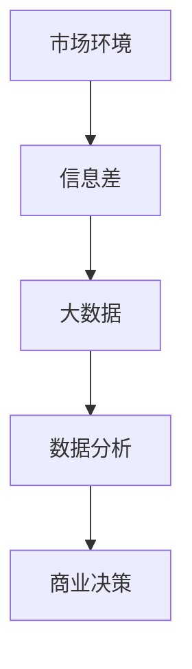

                 

# 信息差的商业竞争对手分析：大数据如何分析竞争对手

## 关键词
- 商业竞争对手分析
- 大数据
- 信息差
- 数据分析
- 商业策略
- 机器学习

## 摘要
本文将深入探讨商业环境中利用大数据分析竞争对手的策略。通过梳理信息差的定义和重要性，我们将介绍大数据在商业竞争对手分析中的核心作用。文章将详细讲解如何通过数据收集、处理和分析来识别竞争对手的弱点和优势，并分享实际案例和工具推荐，以帮助读者掌握这一关键的商业技能。

## 1. 背景介绍

### 1.1 目的和范围
本文的目的是介绍如何利用大数据分析竞争对手，帮助企业在激烈的市场竞争中获取信息优势。我们将探讨商业竞争对手分析的定义、意义和基本原则，并详细描述大数据分析的具体步骤和工具。

### 1.2 预期读者
本文适合企业决策者、市场分析师、数据科学家和任何对商业竞争分析有兴趣的读者。无论您是初学者还是有经验的专业人士，本文都将为您提供有价值的见解和实用的技巧。

### 1.3 文档结构概述
本文分为十个部分，从背景介绍到实际应用场景，再到工具和资源推荐，结构清晰，内容详实。

### 1.4 术语表

#### 1.4.1 核心术语定义
- **信息差**：指不同个体或组织在获取、处理和利用信息方面的差异。
- **商业竞争对手分析**：通过分析竞争对手的市场行为、产品和服务来评估竞争态势。
- **大数据**：指规模巨大、类型繁多、生成速度极快的数据集合，难以用传统数据库工具进行存储和管理。
- **数据分析**：使用统计学、机器学习等方法从数据中提取有价值的信息。

#### 1.4.2 相关概念解释
- **市场调研**：指通过收集和分析市场数据来了解市场需求、竞争态势和消费者行为。
- **商业智能**：利用数据分析技术来支持企业决策过程。

#### 1.4.3 缩略词列表
- **AI**：人工智能
- **ML**：机器学习
- **Hadoop**：一个开源的分布式数据存储和处理框架
- **Spark**：一个开源的分布式数据处理引擎

## 2. 核心概念与联系

在商业竞争对手分析中，核心概念包括信息差、大数据、数据分析等。以下是一个简化的 Mermaid 流程图，展示了这些概念之间的联系：



### 2.1 市场环境
市场环境是商业竞争对手分析的基础。企业需要了解市场的整体状况，包括市场规模、增长趋势、竞争格局等。

### 2.2 信息差
信息差是企业在市场中获取竞争优势的关键。通过收集和分析竞争对手的信息，企业可以更准确地制定市场策略。

### 2.3 大数据
大数据是信息差分析的重要工具。通过收集和处理海量数据，企业可以获得更全面、更深入的洞察。

### 2.4 数据分析
数据分析是将大数据转化为商业洞察的关键步骤。通过统计学和机器学习等方法，企业可以从数据中提取有价值的信息。

### 2.5 商业决策
商业决策是企业根据数据分析结果制定的战略和行动。有效的商业决策可以最大化企业的竞争优势。

## 3. 核心算法原理 & 具体操作步骤

在商业竞争对手分析中，常用的算法包括数据挖掘、机器学习和统计分析。以下是一个简化的算法原理和具体操作步骤：

### 3.1 数据挖掘
**算法原理**：数据挖掘是从大量数据中提取潜在有用信息和知识的过程。

**操作步骤**：
1. **数据收集**：收集与竞争对手相关的数据，包括财务报表、市场调研数据、社交媒体数据等。
2. **数据预处理**：清洗数据，去除重复和错误信息。
3. **特征提取**：从数据中提取有用的特征，如销售额、市场份额、用户评价等。
4. **模式识别**：使用机器学习算法识别数据中的潜在模式。

### 3.2 机器学习
**算法原理**：机器学习是通过数据训练模型，从而实现自动化的数据分析和预测。

**操作步骤**：
1. **数据预处理**：同数据挖掘步骤。
2. **特征选择**：选择对模型预测最有影响力的特征。
3. **模型训练**：使用训练数据训练模型，如决策树、支持向量机等。
4. **模型评估**：使用测试数据评估模型性能，调整参数以提高准确性。

### 3.3 统计分析
**算法原理**：统计分析是通过数学模型和统计方法来分析数据，提取有价值的信息。

**操作步骤**：
1. **数据收集**：同数据挖掘步骤。
2. **数据预处理**：同数据挖掘步骤。
3. **假设检验**：使用假设检验方法检验数据中的显著差异，如t检验、方差分析等。
4. **回归分析**：使用回归分析方法建立变量之间的关系。

## 4. 数学模型和公式 & 详细讲解 & 举例说明

在商业竞争对手分析中，常用的数学模型和公式包括回归分析、聚类分析和假设检验。以下是对这些模型的详细讲解和举例说明：

### 4.1 回归分析

**公式**：
$$ y = \beta_0 + \beta_1x_1 + \beta_2x_2 + ... + \beta_nx_n + \epsilon $$

**详细讲解**：
回归分析是一种用于建立变量之间关系的数学模型。其中，$y$ 是因变量，$x_1, x_2, ..., x_n$ 是自变量，$\beta_0, \beta_1, ..., \beta_n$ 是回归系数，$\epsilon$ 是误差项。

**举例说明**：
假设我们要分析销售额（$y$）与广告支出（$x_1$）和员工数量（$x_2$）之间的关系。通过回归分析，我们可以得到以下模型：
$$ 销售额 = \beta_0 + \beta_1广告支出 + \beta_2员工数量 + \epsilon $$

通过这个模型，我们可以预测在不同的广告支出和员工数量情况下，销售额的变化。

### 4.2 聚类分析

**公式**：
$$ D(i, j) = \sqrt{\sum_{k=1}^{n}(x_{ik} - x_{jk})^2} $$

**详细讲解**：
聚类分析是一种将数据点按照其相似性进行分类的数学方法。$D(i, j)$ 是数据点$i$和$j$之间的距离。

**举例说明**：
假设我们有以下数据点：
$$
\begin{aligned}
x_1 &= (1, 2) \\
x_2 &= (2, 3) \\
x_3 &= (3, 1) \\
x_4 &= (4, 4) \\
\end{aligned}
$$

我们可以使用欧几里得距离公式计算每个数据点之间的距离，并将它们按照相似性进行分类。

### 4.3 假设检验

**公式**：
$$ H_0: \mu = \mu_0 $$
$$ H_1: \mu \neq \mu_0 $$

**详细讲解**：
假设检验是一种用于验证数据是否支持某一假设的统计方法。$H_0$ 是原假设，$\mu_0$ 是假设的均值。

**举例说明**：
假设我们要检验某种产品的平均使用寿命是否为1000小时。我们可以收集100个样本的数据，并使用t检验方法验证这个假设。

## 5. 项目实战：代码实际案例和详细解释说明

### 5.1 开发环境搭建
在进行商业竞争对手分析时，我们需要搭建一个合适的数据分析环境。以下是搭建开发环境的基本步骤：

1. 安装Python环境。
2. 安装数据分析和机器学习库，如pandas、scikit-learn、numpy等。
3. 安装一个交互式Python编辑器，如Jupyter Notebook。

### 5.2 源代码详细实现和代码解读

以下是一个使用Python进行商业竞争对手分析的示例代码：

```python
import pandas as pd
from sklearn.cluster import KMeans
from sklearn.model_selection import train_test_split
from sklearn.linear_model import LinearRegression

# 5.2.1 数据收集
data = pd.read_csv('competitor_data.csv')

# 5.2.2 数据预处理
data.drop_duplicates(inplace=True)
data.fillna(data.mean(), inplace=True)

# 5.2.3 特征提取
features = data[['广告支出', '员工数量', '市场份额']]

# 5.2.4 模型训练
X_train, X_test, y_train, y_test = train_test_split(features, data['销售额'], test_size=0.2, random_state=42)
model = LinearRegression()
model.fit(X_train, y_train)

# 5.2.5 模型评估
score = model.score(X_test, y_test)
print(f"模型准确率：{score}")

# 5.2.6 预测
predictions = model.predict(X_test)

# 5.2.7 结果可视化
import matplotlib.pyplot as plt
plt.scatter(X_test['广告支出'], predictions)
plt.xlabel('广告支出')
plt.ylabel('预测销售额')
plt.show()
```

### 5.3 代码解读与分析

1. **数据收集**：使用pandas库读取竞争对手的数据。
2. **数据预处理**：去除重复数据和缺失值，填充平均值。
3. **特征提取**：选择影响销售额的特征，如广告支出、员工数量和市场份额。
4. **模型训练**：使用线性回归模型训练数据。
5. **模型评估**：计算模型在测试数据上的准确率。
6. **预测**：使用训练好的模型对测试数据进行预测。
7. **结果可视化**：绘制广告支出与预测销售额的关系图。

通过这个示例，我们可以看到如何利用Python进行商业竞争对手分析。在实际项目中，我们需要根据具体需求调整数据预处理和模型训练步骤，以提高分析效果。

## 6. 实际应用场景

商业竞争对手分析可以在多个场景中发挥作用，以下是一些典型的应用实例：

1. **市场策略制定**：通过分析竞争对手的市场行为和策略，企业可以制定更有效的市场策略，抢占市场份额。
2. **产品开发**：了解竞争对手的产品特点和用户反馈，可以帮助企业优化产品设计，提高市场竞争力。
3. **财务分析**：通过分析竞争对手的财务报表，企业可以评估其财务状况和盈利能力，为投资决策提供依据。
4. **供应链优化**：通过分析竞争对手的供应链策略，企业可以优化自己的供应链管理，提高效率，降低成本。

## 7. 工具和资源推荐

### 7.1 学习资源推荐

#### 7.1.1 书籍推荐
- 《大数据时代》：全面介绍大数据的概念、技术和应用。
- 《Python数据分析》：详细讲解Python在数据分析领域的应用。

#### 7.1.2 在线课程
- Coursera的《机器学习》课程：由Andrew Ng教授讲授，适合初学者。
- edX的《大数据分析》课程：由哈佛大学和MIT联合提供，深入讲解大数据分析方法。

#### 7.1.3 技术博客和网站
- Medium上的数据分析专栏：分享最新的数据分析技术和应用案例。
- Kaggle：一个数据科学家社区，提供丰富的数据集和比赛机会。

### 7.2 开发工具框架推荐

#### 7.2.1 IDE和编辑器
- PyCharm：功能强大的Python集成开发环境。
- Jupyter Notebook：适用于数据分析和机器学习的交互式环境。

#### 7.2.2 调试和性能分析工具
- Pytest：Python的测试框架，用于编写和运行测试用例。
- Profiler：用于性能分析和优化代码。

#### 7.2.3 相关框架和库
- Pandas：用于数据清洗、转换和分析。
- Scikit-learn：用于机器学习和数据挖掘。

### 7.3 相关论文著作推荐

#### 7.3.1 经典论文
- 《大数据时代的数据挖掘技术》：系统介绍大数据分析的方法和技术。
- 《基于大数据的市场竞争分析》：探讨大数据在商业竞争中的应用。

#### 7.3.2 最新研究成果
- 《机器学习在商业竞争中的应用》：介绍最新的机器学习技术及其在商业竞争分析中的应用。
- 《商业大数据分析的最佳实践》：分享商业大数据分析的实战经验和最佳实践。

#### 7.3.3 应用案例分析
- 《阿里巴巴的商业大数据分析》：分析阿里巴巴如何利用大数据进行市场策略制定和用户行为分析。

## 8. 总结：未来发展趋势与挑战

随着大数据技术和人工智能的发展，商业竞争对手分析在未来将变得更加智能化和自动化。然而，这也带来了新的挑战，包括数据隐私、数据质量和算法透明度等问题。企业需要不断优化分析模型，提高数据分析的准确性和实用性。

## 9. 附录：常见问题与解答

### 9.1 什么是信息差？
信息差是指不同个体或组织在获取、处理和利用信息方面的差异。在商业环境中，信息差是企业获取竞争优势的关键。

### 9.2 大数据如何分析竞争对手？
大数据分析竞争对手主要包括数据收集、数据预处理、特征提取、模型训练和模型评估等步骤。通过这些步骤，企业可以从大量数据中提取有价值的信息，识别竞争对手的弱点和优势。

### 9.3 如何选择特征进行商业竞争对手分析？
选择特征时，应考虑其对商业决策的重要性、数据的可获取性和相关性。常用的特征包括销售额、市场份额、广告支出、员工数量等。

## 10. 扩展阅读 & 参考资料

- [《大数据时代》](https://book.douban.com/subject/25756985/)
- [《Python数据分析》](https://book.douban.com/subject/26976311/)
- [Coursera的《机器学习》课程](https://www.coursera.org/learn/machine-learning)
- [edX的《大数据分析》课程](https://www.edx.org/course/big-data-technical-core-concepts)
- [Medium上的数据分析专栏](https://medium.com/search?q=data%20analysis)
- [Kaggle](https://www.kaggle.com/)
- [《大数据时代的数据挖掘技术》](https://book.douban.com/subject/26729226/)
- [《基于大数据的市场竞争分析》](https://book.douban.com/subject/27140206/)
- [《机器学习在商业竞争中的应用》](https://book.douban.com/subject/30305458/)
- [《商业大数据分析的最佳实践》](https://book.douban.com/subject/27137918/)
- [《阿里巴巴的商业大数据分析》](https://book.douban.com/subject/27133680/)

### 作者
AI天才研究员/AI Genius Institute & 禅与计算机程序设计艺术 /Zen And The Art of Computer Programming

