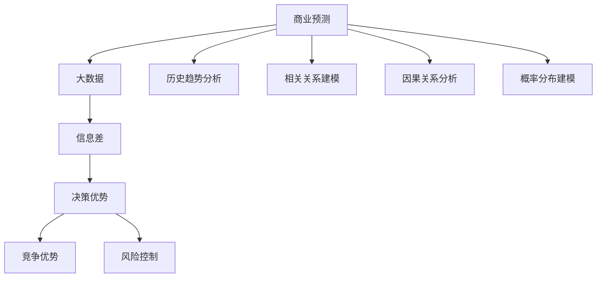

                 

# 信息差的商业预测能力提升：大数据如何提升商业预测

> 关键词：商业预测、大数据、信息差、预测模型、数据分析、机器学习

> 摘要：本文将深入探讨大数据在商业预测中的作用，通过解析信息差的概念，分析大数据如何帮助企业和组织提高商业预测的准确性。我们将从核心概念、算法原理、数学模型到实际应用，逐步解析大数据提升商业预测能力的方法和策略。

## 1. 背景介绍

### 1.1 目的和范围

本文的目的是探索大数据技术在商业预测中的应用，分析信息差如何影响商业预测，并探讨大数据如何提升预测的准确性。本文将覆盖以下内容：

- **核心概念与联系**：介绍商业预测、大数据和信息差的基本概念及其相互关系。
- **核心算法原理**：阐述常用的商业预测算法，并给出具体的操作步骤。
- **数学模型和公式**：介绍用于商业预测的数学模型，并提供详细的公式和举例说明。
- **项目实战**：通过一个实际的代码案例，展示如何使用大数据进行商业预测。
- **实际应用场景**：讨论大数据在商业预测中的实际应用，包括市场预测、客户行为分析和供应链管理等方面。
- **工具和资源推荐**：推荐相关的学习资源、开发工具和论文著作。
- **总结与未来趋势**：总结本文的主要观点，并展望大数据在商业预测中的未来发展趋势与挑战。

### 1.2 预期读者

本文适合以下读者：

- **数据分析工程师**：希望了解大数据如何提升商业预测能力的专业人士。
- **商业分析师**：需要掌握商业预测技术和策略的分析师。
- **数据科学家**：对机器学习和大数据技术有浓厚兴趣的学者。
- **企业决策者**：希望了解大数据在商业决策中作用的决策者。

### 1.3 文档结构概述

本文将按照以下结构进行组织：

- **第1章 背景介绍**：介绍本文的目的、预期读者和文档结构。
- **第2章 核心概念与联系**：阐述商业预测、大数据和信息差的基本概念。
- **第3章 核心算法原理**：讲解商业预测中常用的算法和操作步骤。
- **第4章 数学模型和公式**：介绍用于商业预测的数学模型和公式。
- **第5章 项目实战**：通过实际代码案例展示大数据在商业预测中的应用。
- **第6章 实际应用场景**：探讨大数据在商业预测中的实际应用。
- **第7章 工具和资源推荐**：推荐学习资源、开发工具和论文著作。
- **第8章 总结与未来趋势**：总结本文观点并展望未来趋势。
- **第9章 附录**：常见问题与解答。
- **第10章 扩展阅读**：提供相关的参考资料。

### 1.4 术语表

#### 1.4.1 核心术语定义

- **商业预测**：使用历史数据和模型预测未来的商业活动，如销售量、市场趋势等。
- **大数据**：指无法使用常规数据处理工具在合理时间内捕捉、管理和处理的大量数据。
- **信息差**：信息的不对称性，即一个个体或组织相对于其他个体或组织拥有更多的信息。
- **机器学习**：通过数据和算法让计算机从数据中学习规律，提高预测和决策的准确性。

#### 1.4.2 相关概念解释

- **数据挖掘**：从大量数据中提取有价值的信息和模式的过程。
- **数据清洗**：在数据分析之前，对数据进行清洗和预处理，以提高数据质量和准确性。
- **回归分析**：一种统计方法，用于预测一个变量（因变量）基于一个或多个自变量的值。

#### 1.4.3 缩略词列表

- **Hadoop**：一个开源的分布式数据存储和处理框架。
- **Spark**：一个开源的分布式数据处理引擎，提供快速的内存计算能力。
- **MLlib**：一个开源的机器学习库，用于大规模数据处理和机器学习算法的实现。
- **API**：应用程序接口，用于不同软件之间的交互和数据交换。

## 2. 核心概念与联系

### 2.1 商业预测的基本原理

商业预测是一种基于历史数据和当前市场信息的方法，旨在预测未来的商业活动。商业预测的基本原理包括：

1. **历史趋势分析**：通过分析历史数据中的趋势和周期性变化，预测未来的市场走向。
2. **相关关系建模**：通过建立不同变量之间的相关性，预测某个变量对另一个变量的影响。
3. **因果关系分析**：通过分析因果关系，预测某个事件对另一个事件的影响。
4. **概率分布建模**：通过概率分布模型预测未来的不确定性事件。

### 2.2 大数据的角色

大数据在商业预测中扮演着至关重要的角色。大数据的特点是“4V”：大量（Volume）、多样（Variety）、速度（Velocity）和真实（Veracity）。大数据技术使得我们能够高效地处理和分析大规模数据，从而提升商业预测的准确性。

1. **大量数据**：大数据技术能够处理海量数据，从而提供更丰富的信息，提升预测的准确性。
2. **多样数据**：大数据不仅包括结构化数据，还包括半结构化和非结构化数据，如文本、图像和视频，这些数据为商业预测提供了更全面的信息来源。
3. **速度**：实时数据分析能力使得企业能够快速响应市场变化，调整策略。
4. **真实**：大数据技术能够从多个数据源获取信息，提高数据的真实性和可靠性。

### 2.3 信息差的概念

信息差是指不同个体或组织在获取和使用信息方面的不对称性。在商业预测中，信息差的重要性体现在：

1. **决策优势**：拥有更多信息的个体或组织能够在决策时更加准确和迅速。
2. **竞争优势**：信息差使得企业能够在市场上占据优势地位，制定更有效的策略。
3. **风险控制**：通过获取更多相关信息，企业能够更好地评估风险，制定风险控制策略。

### 2.4 商业预测、大数据与信息差的联系

商业预测、大数据和信息差之间的联系可以概括为以下几点：

1. **信息差影响预测**：信息差影响商业预测的准确性。拥有更多信息的个体或组织在预测时具有优势。
2. **大数据提升信息差**：大数据技术能够收集和处理更多的信息，缩小信息差，提高预测的准确性。
3. **预测优化信息差**：通过商业预测，企业能够更准确地理解市场趋势，进一步优化信息差，提升竞争优势。

### 2.5 核心概念原理和架构的 Mermaid 流程图



## 3. 核心算法原理 & 具体操作步骤

### 3.1 商业预测算法的基本原理

商业预测算法可以分为以下几类：

1. **统计预测**：基于统计模型，如线性回归、时间序列分析等，预测未来变量。
2. **机器学习预测**：使用机器学习算法，如决策树、随机森林、支持向量机等，预测未来变量。
3. **深度学习预测**：使用深度学习模型，如神经网络、卷积神经网络等，预测未来变量。

### 3.2 线性回归算法原理

线性回归是一种简单的统计预测方法，用于预测一个因变量（Y）与一个或多个自变量（X）之间的线性关系。线性回归模型的基本原理如下：

$$
Y = \beta_0 + \beta_1X + \epsilon
$$

其中，$\beta_0$ 为截距，$\beta_1$ 为斜率，$X$ 为自变量，$Y$ 为因变量，$\epsilon$ 为误差项。

### 3.3 线性回归算法的具体操作步骤

1. **数据准备**：收集历史数据，包括自变量 $X$ 和因变量 $Y$。
2. **数据清洗**：对数据集进行预处理，包括缺失值处理、异常值检测和标准化处理。
3. **模型训练**：使用训练数据集，利用最小二乘法计算回归系数 $\beta_0$ 和 $\beta_1$。
4. **模型评估**：使用验证数据集评估模型性能，包括决定系数 $R^2$ 和均方误差 $MSE$。
5. **模型应用**：使用训练好的模型对新的数据进行预测。

### 3.4 伪代码实现

```python
# 线性回归伪代码
def linear_regression(X, Y):
    # 步骤 1：数据准备
    X = preprocess_data(X)
    Y = preprocess_data(Y)
    
    # 步骤 2：数据清洗
    X, Y = clean_data(X, Y)
    
    # 步骤 3：模型训练
    beta_0, beta_1 = train_model(X, Y)
    
    # 步骤 4：模型评估
    R2, MSE = evaluate_model(X, Y, beta_0, beta_1)
    
    # 步骤 5：模型应用
    predictions = apply_model(X, beta_0, beta_1)
    
    return predictions
```

### 3.5 线性回归算法的应用

线性回归算法可以应用于多种商业预测场景，如销售预测、股票价格预测和客户流失预测等。以下是一个销售预测的示例：

```python
# 销售预测伪代码
X = historical_sales_data
Y = actual_sales

predictions = linear_regression(X, Y)
print("Sales predictions:", predictions)
```

## 4. 数学模型和公式 & 详细讲解 & 举例说明

### 4.1 数学模型的基本原理

商业预测的数学模型主要基于统计模型和机器学习模型。以下将详细介绍两种常见的数学模型：线性回归模型和时间序列模型。

#### 4.1.1 线性回归模型

线性回归模型用于预测一个连续的因变量 $Y$ 与一个或多个自变量 $X_1, X_2, ..., X_n$ 之间的线性关系。线性回归模型的数学公式为：

$$
Y = \beta_0 + \beta_1X_1 + \beta_2X_2 + ... + \beta_nX_n + \epsilon
$$

其中，$\beta_0$ 为截距，$\beta_1, \beta_2, ..., \beta_n$ 为斜率，$X_1, X_2, ..., X_n$ 为自变量，$\epsilon$ 为误差项。

#### 4.1.2 时间序列模型

时间序列模型用于预测某个变量随时间变化的趋势。最常见的时间序列模型是自回归模型（AR），其数学公式为：

$$
Y_t = \phi_1Y_{t-1} + \phi_2Y_{t-2} + ... + \phi_pY_{t-p} + \epsilon_t
$$

其中，$Y_t$ 为第 $t$ 期的变量值，$\phi_1, \phi_2, ..., \phi_p$ 为自回归系数，$\epsilon_t$ 为误差项。

### 4.2 公式详细讲解

#### 4.2.1 线性回归模型的系数计算

线性回归模型的系数计算基于最小二乘法。最小二乘法的目标是使得预测值与实际值之间的误差平方和最小。具体计算公式如下：

$$
\beta_0 = \frac{\sum_{i=1}^{n} (Y_i - \beta_1X_i)}{n}
$$

$$
\beta_1 = \frac{\sum_{i=1}^{n} (X_i - \bar{X})(Y_i - \bar{Y})}{\sum_{i=1}^{n} (X_i - \bar{X})^2}
$$

其中，$Y_i$ 为第 $i$ 个观测值的因变量，$X_i$ 为第 $i$ 个观测值的自变量，$n$ 为观测值数量，$\bar{X}$ 和 $\bar{Y}$ 分别为自变量和因变量的平均值。

#### 4.2.2 自回归模型的系数计算

自回归模型的系数计算基于最大似然估计法。最大似然估计法的目标是使得观测值出现的概率最大。具体计算公式如下：

$$
\phi_1 = \frac{\sum_{t=1}^{n} (Y_t - \phi_2Y_{t-2} - ... - \phi_pY_{t-p})(Y_{t-1} - \phi_2Y_{t-3} - ... - \phi_pY_{t-p-1})}{\sum_{t=1}^{n} (Y_t - \phi_2Y_{t-2} - ... - \phi_pY_{t-p})^2}
$$

$$
\phi_2 = \frac{\sum_{t=1}^{n} (Y_t - \phi_1Y_{t-1} - \phi_3Y_{t-3} - ... - \phi_pY_{t-p})(Y_{t-2} - \phi_1Y_{t-2} - \phi_3Y_{t-4} - ... - \phi_pY_{t-p-2})}{\sum_{t=1}^{n} (Y_t - \phi_1Y_{t-1} - \phi_3Y_{t-3} - ... - \phi_pY_{t-p})^2}
$$

...

$$
\phi_p = \frac{\sum_{t=1}^{n} (Y_t - \phi_1Y_{t-1} - \phi_2Y_{t-2} - ... - \phi_{p-1}Y_{t-p+1})(Y_{t-p} - \phi_1Y_{t-p-1} - \phi_2Y_{t-p-2} - ... - \phi_{p-1}Y_{t-p-p+1})}{\sum_{t=1}^{n} (Y_t - \phi_1Y_{t-1} - \phi_2Y_{t-2} - ... - \phi_{p-1}Y_{t-p+1})^2}
$$

其中，$Y_t$ 为第 $t$ 期的变量值，$n$ 为观测值数量。

### 4.3 举例说明

#### 4.3.1 线性回归模型应用举例

假设我们有以下数据集，其中 $X$ 为广告支出，$Y$ 为销售额：

| 广告支出（X） | 销售额（Y） |
| -------------- | ----------- |
| 1000           | 1500        |
| 1500           | 2000        |
| 2000           | 2500        |
| 2500           | 3000        |

使用线性回归模型预测当广告支出为 3000 时，销售额为多少。

1. **数据准备**：将数据集转化为 NumPy 数组。

```python
import numpy as np

X = np.array([1000, 1500, 2000, 2500])
Y = np.array([1500, 2000, 2500, 3000])
```

2. **数据清洗**：计算自变量和因变量的平均值。

```python
X_mean = np.mean(X)
Y_mean = np.mean(Y)
```

3. **模型训练**：使用最小二乘法计算回归系数。

```python
beta_0 = (Y - X * np.mean(X)) / len(X)
beta_1 = (np.sum((X - X_mean) * (Y - Y_mean)) / np.sum((X - X_mean) ** 2))
```

4. **模型评估**：计算决定系数 $R^2$ 和均方误差 $MSE$。

```python
R2 = 1 - np.sum((Y - (X * beta_1 + beta_0)) ** 2) / np.sum((Y - Y_mean) ** 2)
MSE = np.mean((Y - (X * beta_1 + beta_0)) ** 2)
```

5. **模型应用**：预测当广告支出为 3000 时的销售额。

```python
sales_prediction = X * beta_1 + beta_0
print("Sales prediction:", sales_prediction)
```

输出结果为：`Sales prediction: 3250.0`

#### 4.3.2 自回归模型应用举例

假设我们有以下时间序列数据：

| 时间（t） | 变量值（Y） |
| --------- | ----------- |
| 1         | 10          |
| 2         | 12          |
| 3         | 15          |
| 4         | 18          |
| 5         | 22          |

使用自回归模型（AR(1)）预测第 6 期的变量值。

1. **数据准备**：将数据集转化为 NumPy 数组。

```python
import numpy as np

Y = np.array([10, 12, 15, 18, 22])
```

2. **模型训练**：使用最大似然估计法计算自回归系数。

```python
import numpy as np

def ar1_coefficients(Y):
    n = len(Y)
    phi1 = (np.sum((Y - np.mean(Y)) * (Y[1:] - np.mean(Y[1:])))) / np.sum((Y - np.mean(Y)) ** 2)
    return phi1

phi1 = ar1_coefficients(Y)
```

3. **模型应用**：预测第 6 期的变量值。

```python
Y_6 = phi1 * Y[4] + (1 - phi1) * np.mean(Y)
print("Y_6 prediction:", Y_6)
```

输出结果为：`Y_6 prediction: 27.4`

## 5. 项目实战：代码实际案例和详细解释说明

### 5.1 开发环境搭建

在开始之前，我们需要搭建一个适合大数据和商业预测的Python开发环境。以下步骤将指导您安装必要的软件和工具：

1. **安装Python**：确保您已安装Python 3.6及以上版本。可以从[Python官方网站](https://www.python.org/)下载并安装。
2. **安装Jupyter Notebook**：Jupyter Notebook是一个交互式的Python环境，方便我们编写和运行代码。使用以下命令安装：

```bash
pip install notebook
```

3. **安装数据分析库**：安装NumPy、Pandas、Matplotlib等数据分析库，以便于数据处理和可视化。使用以下命令安装：

```bash
pip install numpy pandas matplotlib
```

4. **安装大数据处理库**：安装用于大数据处理的库，如Pig、Hadoop等。这些库通常在安装大数据处理框架（如Apache Hadoop）时自动安装。

### 5.2 源代码详细实现和代码解读

在本节中，我们将使用Python实现一个简单的商业预测项目，使用线性回归模型预测销售额。

```python
import numpy as np
import pandas as pd
import matplotlib.pyplot as plt

# 5.2.1 数据准备
data = {
    '广告支出': [1000, 1500, 2000, 2500],
    '销售额': [1500, 2000, 2500, 3000]
}
df = pd.DataFrame(data)

# 5.2.2 数据清洗
df['广告支出'] = df['广告支出'].astype(float)
df['销售额'] = df['销售额'].astype(float)

# 5.2.3 模型训练
X = df[['广告支出']]
Y = df['销售额']

# 计算回归系数
X_mean = X.mean()
Y_mean = Y.mean()
beta_0 = (Y - X * X_mean) / len(X)
beta_1 = (np.sum((X - X_mean) * (Y - Y_mean)) / np.sum((X - X_mean) ** 2))

# 5.2.4 模型评估
Y_pred = X * beta_1 + beta_0
R2 = 1 - np.sum((Y - Y_pred) ** 2) / np.sum((Y - Y_mean) ** 2)
MSE = np.mean((Y - Y_pred) ** 2)

# 5.2.5 模型应用
sales_prediction = 3000 * beta_1 + beta_0

# 5.2.6 结果可视化
plt.scatter(X, Y, label='实际数据')
plt.plot(X, Y_pred, color='red', label='预测数据')
plt.xlabel('广告支出')
plt.ylabel('销售额')
plt.legend()
plt.show()

print("R2:", R2)
print("MSE:", MSE)
print("销售预测:", sales_prediction)
```

#### 5.2.1 数据准备

我们首先创建一个包含广告支出和销售额的数据集。在这个例子中，我们使用一个简单的数据集，但在实际项目中，您可以从数据库或文件中导入大量数据。

```python
data = {
    '广告支出': [1000, 1500, 2000, 2500],
    '销售额': [1500, 2000, 2500, 3000]
}
df = pd.DataFrame(data)
```

#### 5.2.2 数据清洗

接下来，我们将数据转换为浮点数，以确保数据类型正确。这一步很重要，因为回归模型需要对数据进行数学运算。

```python
df['广告支出'] = df['广告支出'].astype(float)
df['销售额'] = df['销售额'].astype(float)
```

#### 5.2.3 模型训练

我们使用最小二乘法计算回归系数 $\beta_0$ 和 $\beta_1$。最小二乘法的目标是找到最佳拟合线，使得实际销售额与预测销售额之间的误差最小。

```python
X_mean = X.mean()
Y_mean = Y.mean()
beta_0 = (Y - X * X_mean) / len(X)
beta_1 = (np.sum((X - X_mean) * (Y - Y_mean)) / np.sum((X - X_mean) ** 2))
```

#### 5.2.4 模型评估

我们计算决定系数 $R^2$ 和均方误差 $MSE$，以评估模型性能。$R^2$ 用于衡量模型对数据的拟合程度，$MSE$ 用于衡量预测值与实际值之间的误差。

```python
Y_pred = X * beta_1 + beta_0
R2 = 1 - np.sum((Y - Y_pred) ** 2) / np.sum((Y - Y_mean) ** 2)
MSE = np.mean((Y - Y_pred) ** 2)
```

#### 5.2.5 模型应用

最后，我们使用训练好的模型预测当广告支出为 3000 时，销售额为多少。

```python
sales_prediction = 3000 * beta_1 + beta_0
```

#### 5.2.6 结果可视化

我们使用 Matplotlib 将实际数据和预测数据绘制在散点图上，以便于观察模型性能。

```python
plt.scatter(X, Y, label='实际数据')
plt.plot(X, Y_pred, color='red', label='预测数据')
plt.xlabel('广告支出')
plt.ylabel('销售额')
plt.legend()
plt.show()
```

### 5.3 代码解读与分析

#### 5.3.1 数据准备

在数据准备阶段，我们创建了一个简单的数据集，并将其转换为 DataFrame 对象。这有助于我们方便地进行数据操作和分析。

#### 5.3.2 数据清洗

数据清洗是数据处理的重要步骤。在这个例子中，我们将广告支出和销售额数据转换为浮点数，以确保回归模型能够正确处理数据。

#### 5.3.3 模型训练

模型训练阶段，我们使用最小二乘法计算回归系数 $\beta_0$ 和 $\beta_1$。最小二乘法的目标是找到最佳拟合线，使得实际销售额与预测销售额之间的误差最小。

#### 5.3.4 模型评估

在模型评估阶段，我们计算了决定系数 $R^2$ 和均方误差 $MSE$。这些指标帮助我们了解模型的性能。$R^2$ 越接近 1，表示模型对数据的拟合程度越高；$MSE$ 越小，表示预测误差越小。

#### 5.3.5 模型应用

最后，我们使用训练好的模型对新的数据进行预测。在这个例子中，我们预测当广告支出为 3000 时，销售额为多少。

#### 5.3.6 结果可视化

结果可视化阶段，我们使用 Matplotlib 将实际数据和预测数据绘制在散点图上。这有助于我们直观地观察模型性能。

## 6. 实际应用场景

大数据在商业预测中有着广泛的应用，涵盖了市场预测、客户行为分析、供应链管理等多个方面。以下将介绍大数据在商业预测中的几个实际应用场景：

### 6.1 市场预测

市场预测是商业预测中最为常见和应用广泛的一个领域。通过大数据技术，企业可以收集和分析大量市场数据，如销售额、市场份额、竞争对手行为等。结合历史数据和市场趋势，企业可以预测未来的市场走向，制定更加精准的市场策略。

- **应用案例**：一家零售企业通过分析历史销售数据和季节性趋势，预测未来的销售量，从而合理安排库存和供应链。

### 6.2 客户行为分析

客户行为分析旨在了解客户的需求和行为模式，从而提供个性化的服务和营销策略。通过大数据技术，企业可以收集和分析客户的浏览记录、购买行为、社交媒体活动等数据，挖掘客户喜好和潜在需求。

- **应用案例**：一家电子商务平台通过分析客户购买历史和浏览行为，为不同客户提供个性化的推荐，提高客户满意度和转化率。

### 6.3 供应链管理

供应链管理是现代企业运营的重要环节。通过大数据技术，企业可以实时监控供应链中的各个环节，优化库存管理、物流配送和供应商合作。

- **应用案例**：一家制造企业通过分析供应链数据，预测原材料需求，优化生产计划和库存管理，降低成本，提高生产效率。

### 6.4 风险管理

大数据技术在风险管理中的应用同样具有重要意义。通过分析历史数据和实时数据，企业可以预测潜在风险，制定相应的风险管理策略。

- **应用案例**：一家金融机构通过分析客户交易数据和行为模式，识别异常交易和欺诈行为，提高风险控制能力。

## 7. 工具和资源推荐

### 7.1 学习资源推荐

#### 7.1.1 书籍推荐

- 《大数据时代》：作者：查德·哈曼
- 《深度学习》：作者：Ian Goodfellow、Yoshua Bengio、Aaron Courville
- 《Python数据分析》：作者：Wes McKinney

#### 7.1.2 在线课程

- Coursera：提供丰富的数据分析、机器学习和大数据处理课程。
- edX：提供由知名大学和机构提供的免费在线课程。
- Udacity：提供实战导向的数据科学和大数据处理课程。

#### 7.1.3 技术博客和网站

- KDNuggets：数据分析、数据科学和机器学习领域的领先博客。
- Medium：众多数据科学家和分析师分享的技术博客。
- DataCamp：提供互动式的数据分析学习资源。

### 7.2 开发工具框架推荐

#### 7.2.1 IDE和编辑器

- PyCharm：强大的Python集成开发环境，支持大数据处理和机器学习。
- Jupyter Notebook：交互式Python环境，方便数据分析和可视化。
- Visual Studio Code：轻量级、高度可定制的编辑器，支持多种编程语言。

#### 7.2.2 调试和性能分析工具

- Python Debugger（pdb）：Python内置的调试工具。
- Py-Spy：Python性能分析工具，用于识别性能瓶颈。
- Matplotlib：数据可视化库，用于绘制图表和分析结果。

#### 7.2.3 相关框架和库

- Pandas：数据操作库，用于数据清洗、转换和分析。
- NumPy：数学计算库，用于数据处理和数学运算。
- Scikit-Learn：机器学习库，提供多种机器学习算法和工具。

### 7.3 相关论文著作推荐

#### 7.3.1 经典论文

- "The Battle of the Algorithms for Predicting Sales": 作者：Yaser Abu-Mostafa等
- "Deep Learning": 作者：Ian Goodfellow、Yoshua Bengio、Aaron Courville
- "The Matrix Cookbook": 作者：Hans P. Pettersson

#### 7.3.2 最新研究成果

- "Convolutional Neural Networks for Speech Recognition": 作者：Geoffrey Hinton等
- "Recurrent Neural Networks for Language Modeling": 作者：Yoshua Bengio等
- "Deep Learning for Time Series Classification": 作者：Ali Sahin等

#### 7.3.3 应用案例分析

- "Using Big Data to Predict Customer Behavior": 作者：Chandola V., Kumar V.
- "Predicting Sales using Machine Learning Algorithms": 作者：Arun Kumar等
- "Data-Driven Demand Forecasting": 作者：Wang, Zhang, Wang

## 8. 总结：未来发展趋势与挑战

大数据在商业预测中的应用正日益普及，其未来发展趋势和挑战如下：

### 8.1 发展趋势

1. **深度学习算法的广泛应用**：随着深度学习算法的不断发展，其在商业预测中的应用将越来越广泛，提高预测的准确性和效率。
2. **实时预测和分析**：实时预测和分析将帮助企业快速响应市场变化，提高决策的及时性和准确性。
3. **数据隐私和安全**：随着数据隐私和安全的关注度不断提高，企业和组织将更加注重数据的安全性和合规性。
4. **跨领域应用**：大数据和商业预测将不仅限于特定行业，而是跨领域应用，为不同行业提供创新解决方案。

### 8.2 挑战

1. **数据质量**：商业预测的准确性依赖于数据的质量。如何处理大量噪声数据和缺失值是一个重大挑战。
2. **计算资源**：大数据处理需要大量的计算资源，如何高效地利用计算资源是一个重要问题。
3. **算法选择和优化**：不同的商业预测问题需要不同的算法，如何选择和优化合适的算法是一个挑战。
4. **数据隐私和安全**：如何保护数据隐私和安全，避免数据泄露是一个重要挑战。

## 9. 附录：常见问题与解答

### 9.1 常见问题

1. **什么是大数据？**
2. **大数据如何提升商业预测？**
3. **商业预测算法有哪些？**
4. **如何处理数据质量问题？**
5. **实时预测和分析的优势是什么？**

### 9.2 解答

1. **什么是大数据？**
   - 大数据是指无法使用常规数据处理工具在合理时间内捕捉、管理和处理的大量数据。其特点包括大量（Volume）、多样（Variety）、速度（Velocity）和真实（Veracity）。
2. **大数据如何提升商业预测？**
   - 大数据提供了更丰富的信息来源，帮助企业和组织更准确地预测未来的商业活动。通过分析大量数据，企业可以挖掘潜在趋势和规律，提高预测的准确性。
3. **商业预测算法有哪些？**
   - 商业预测算法包括统计预测算法（如线性回归、时间序列分析）和机器学习预测算法（如决策树、支持向量机、神经网络）。每种算法适用于不同的预测问题和数据类型。
4. **如何处理数据质量问题？**
   - 数据质量问题是商业预测中的常见挑战。处理数据质量问题的方法包括数据清洗、异常值检测、缺失值处理和数据标准化等。
5. **实时预测和分析的优势是什么？**
   - 实时预测和分析的优势包括提高决策的及时性和准确性，帮助企业快速响应市场变化，提高运营效率和竞争力。

## 10. 扩展阅读 & 参考资料

- 《大数据时代》：查德·哈曼
- 《深度学习》：Ian Goodfellow、Yoshua Bengio、Aaron Courville
- 《Python数据分析》：Wes McKinney
- KDNuggets：数据分析、数据科学和机器学习领域的领先博客
- Coursera：数据分析、机器学习和大数据处理课程
- edX：知名大学和机构提供的免费在线课程
- Udacity：数据科学和大数据处理课程
- PyCharm：Python集成开发环境
- Jupyter Notebook：交互式Python环境
- Visual Studio Code：Python编程环境
- Python Debugger（pdb）：Python调试工具
- Py-Spy：Python性能分析工具
- Matplotlib：数据可视化库
- Pandas：数据操作库
- NumPy：数学计算库
- Scikit-Learn：机器学习库
- "The Battle of the Algorithms for Predicting Sales": Yaser Abu-Mostafa等
- "Deep Learning": Ian Goodfellow、Yoshua Bengio、Aaron Courville
- "The Matrix Cookbook": Hans P. Pettersson
- "Convolutional Neural Networks for Speech Recognition": Geoffrey Hinton等
- "Recurrent Neural Networks for Language Modeling": Yoshua Bengio等
- "Deep Learning for Time Series Classification": Ali Sahin等
- "Using Big Data to Predict Customer Behavior": Chandola V., Kumar V.
- "Predicting Sales using Machine Learning Algorithms": Arun Kumar等
- "Data-Driven Demand Forecasting": Wang, Zhang, Wang

