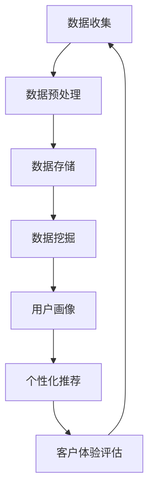

                 

# 信息差的客户体验个性化：大数据如何实现客户体验个性化

> 关键词：客户体验个性化、大数据、信息差、算法、数学模型、应用场景、技术资源推荐

> 摘要：本文将深入探讨如何利用大数据技术实现客户体验的个性化。通过分析信息差的本质和客户需求，我们提出了一种基于大数据的个性化客户体验框架，详细解析了其核心概念、算法原理、数学模型，并提供了实际项目案例和工具资源推荐。文章旨在为IT从业人员和研究人员提供一套全面的技术指南，帮助他们更好地理解和应用大数据在客户体验个性化方面的潜力。

## 1. 背景介绍

### 1.1 目的和范围

在当今这个信息爆炸的时代，客户体验已经成为企业核心竞争力的重要方面。个性化客户体验不仅能够提高客户满意度，还能够增加客户忠诚度和转化率。然而，如何实现客户体验的个性化，特别是在大数据的背景下，这是一个极具挑战性的问题。本文旨在探讨如何利用大数据技术实现客户体验的个性化，为相关从业人员提供一套完整的技术指南。

本文主要涵盖了以下几个方面的内容：

1. **信息差的本质分析**：介绍信息差的定义，解释其在客户体验个性化中的作用。
2. **大数据的核心概念**：阐述大数据的来源、处理和分析方法，以及其在客户体验个性化中的应用。
3. **个性化客户体验框架**：提出一种基于大数据的个性化客户体验框架，并详细解析其核心组成部分。
4. **算法原理和数学模型**：介绍实现个性化客户体验的关键算法和数学模型，并提供详细的伪代码解释。
5. **项目实战和案例分析**：通过实际项目案例展示如何应用本文提出的框架和算法，提供代码实现和详细解释。
6. **应用场景和工具资源推荐**：介绍个性化客户体验在各个行业中的应用，推荐相关的学习资源、开发工具和框架。

### 1.2 预期读者

本文预期读者包括以下几类：

1. **IT从业人员**：特别是那些在客户体验、数据分析、大数据处理等领域工作的专业人员。
2. **研究人员**：对大数据和人工智能在客户体验个性化方面有研究兴趣的学术研究人员。
3. **企业决策者**：希望了解如何利用大数据技术提升客户体验的企业决策者。

通过阅读本文，读者可以了解到大数据在客户体验个性化方面的应用潜力，掌握相关技术和方法，并将其应用于实际工作中。

### 1.3 文档结构概述

本文的结构如下：

1. **第1章 背景介绍**：介绍本文的目的、范围和预期读者，以及文档结构。
2. **第2章 核心概念与联系**：详细阐述信息差的定义和大数据的核心概念，并提供Mermaid流程图。
3. **第3章 核心算法原理 & 具体操作步骤**：介绍实现个性化客户体验的关键算法，并提供伪代码解释。
4. **第4章 数学模型和公式 & 详细讲解 & 举例说明**：解析数学模型，并提供实际应用示例。
5. **第5章 项目实战：代码实际案例和详细解释说明**：通过实际项目案例展示算法和应用。
6. **第6章 实际应用场景**：介绍个性化客户体验在不同行业中的应用。
7. **第7章 工具和资源推荐**：推荐相关的学习资源、开发工具和框架。
8. **第8章 总结：未来发展趋势与挑战**：总结本文内容和展望未来。
9. **第9章 附录：常见问题与解答**：解答读者可能遇到的问题。
10. **第10章 扩展阅读 & 参考资料**：提供进一步的阅读资料。

### 1.4 术语表

为了确保本文的清晰和一致性，以下列出了一些关键术语的定义和解释：

#### 1.4.1 核心术语定义

- **信息差**：指不同个体或群体之间在信息获取、处理和应用方面的差异。
- **大数据**：指数据量巨大、类型繁多、价值密度低的数据集合。
- **个性化客户体验**：根据客户的需求和偏好，提供定制化的产品和服务，以提高客户满意度和忠诚度。
- **算法**：解决问题的步骤和规则，用于处理和分析数据。
- **数学模型**：用数学语言描述现实问题，以便进行计算和分析。

#### 1.4.2 相关概念解释

- **机器学习**：一种人工智能技术，通过数据学习规律和模式，从而进行预测和决策。
- **深度学习**：一种特殊的机器学习技术，通过多层神经网络进行学习和建模。
- **用户画像**：根据用户的行为和偏好，创建一个详细的用户描述。

#### 1.4.3 缩略词列表

- **AI**：人工智能（Artificial Intelligence）
- **ML**：机器学习（Machine Learning）
- **DL**：深度学习（Deep Learning）
- **DB**：数据库（Database）
- **ETL**：提取、转换、加载（Extract, Transform, Load）
- **CRM**：客户关系管理（Customer Relationship Management）

## 2. 核心概念与联系

### 2.1 信息差的本质

信息差是指不同个体或群体之间在信息获取、处理和应用方面的差异。在客户体验个性化的背景下，信息差具有重要的意义。一方面，企业需要了解客户的真实需求和偏好，这涉及到对客户行为数据、社交数据、购买历史数据等多源数据的综合分析。另一方面，企业需要根据不同客户的特点，提供定制化的产品和服务，以提升客户满意度和忠诚度。信息差的存在使得企业能够更好地识别客户需求，从而实现个性化客户体验。

### 2.2 大数据的核心概念

大数据是由海量、多样化的数据组成的，其来源广泛，包括社交媒体、物联网设备、企业内部数据等。大数据的处理和分析方法与传统的数据处理方式有显著不同。以下是大数据的核心概念：

- **数据量**：大数据的一个显著特征是数据量巨大，通常以PB（皮字节）为单位进行衡量。
- **数据类型**：大数据不仅包括结构化数据，还包括半结构化数据和未结构化数据，如文本、图像、音频等。
- **数据处理速度**：大数据的处理需要高效的速度，以应对实时分析和决策的需求。
- **数据价值密度**：大数据的价值密度通常较低，需要通过深入分析才能发现有价值的信息。

### 2.3 个性化客户体验框架

为了实现个性化客户体验，我们需要构建一个完整的框架，涵盖数据收集、处理、分析和应用等各个环节。以下是一个基于大数据的个性化客户体验框架的Mermaid流程图：



#### 2.3.1 数据收集

数据收集是整个框架的基础，包括从各种渠道收集客户数据，如网站访问日志、社交媒体数据、购买历史数据等。数据收集的过程需要确保数据的合法性和隐私保护。

#### 2.3.2 数据预处理

数据预处理是对收集到的数据进行清洗、转换和整合，使其适合进一步分析。数据预处理包括去除重复数据、处理缺失值、标准化和归一化等步骤。

#### 2.3.3 数据存储

数据存储是将预处理后的数据存储到数据库或数据仓库中，以便进行长期存储和快速检索。常用的数据存储技术包括关系型数据库、NoSQL数据库和数据仓库。

#### 2.3.4 数据挖掘

数据挖掘是利用各种算法和技术，从大量数据中提取有价值的信息和模式。数据挖掘的方法包括聚类、分类、关联规则挖掘等。

#### 2.3.5 用户画像

用户画像是根据客户的行为数据、偏好数据等创建一个详细的客户描述。用户画像可以帮助企业更好地了解客户，从而提供个性化的产品和服务。

#### 2.3.6 个性化推荐

个性化推荐是基于用户画像和商品数据，为用户推荐可能感兴趣的商品或服务。个性化推荐的方法包括基于内容的推荐、协同过滤推荐等。

#### 2.3.7 客户体验评估

客户体验评估是对个性化推荐的效果进行评估，以确定客户是否满意。客户体验评估可以通过用户反馈、转化率等指标进行衡量。

#### 2.3.8 持续优化

客户体验个性化是一个持续优化的过程。通过客户体验评估的结果，企业可以不断调整和优化推荐策略，以提高客户满意度和忠诚度。

### 2.4 Mermaid流程图

以下是一个简化的Mermaid流程图，展示了个性化客户体验框架的各个关键步骤：


在这个流程图中，每个步骤都是相互关联的，形成一个闭环。数据收集的结果用于数据预处理，预处理后的数据用于数据挖掘，挖掘结果用于构建用户画像，用户画像用于个性化推荐，推荐效果用于客户体验评估，评估结果又反馈回数据收集环节，形成持续优化的循环。

## 3. 核心算法原理 & 具体操作步骤

### 3.1 算法原理

在个性化客户体验的实现中，算法的选择至关重要。我们主要介绍两种关键算法：协同过滤推荐算法和基于内容的推荐算法。

#### 3.1.1 协同过滤推荐算法

协同过滤推荐算法是基于用户的行为数据，通过分析用户之间的相似性，为用户推荐相似用户喜欢的商品或服务。协同过滤推荐算法可以分为两种类型：基于用户的协同过滤和基于物品的协同过滤。

- **基于用户的协同过滤**：为用户推荐与其兴趣相似的其他用户的喜欢的商品或服务。
- **基于物品的协同过滤**：为用户推荐与其已评价的商品或服务相似的其他用户喜欢的商品或服务。

#### 3.1.2 基于内容的推荐算法

基于内容的推荐算法是根据用户对商品的偏好，通过分析商品的属性和内容，为用户推荐与其兴趣相关的商品或服务。基于内容的推荐算法可以分为以下几种：

- **基于物品的文本相似度**：通过计算商品文本描述的相似度，为用户推荐相似的商品。
- **基于用户的文本相似度**：通过计算用户在社交媒体上的帖子或评论的相似度，为用户推荐相关的商品或服务。

### 3.2 具体操作步骤

#### 3.2.1 协同过滤推荐算法

以下是基于用户的协同过滤推荐算法的具体操作步骤：

1. **用户行为数据收集**：收集用户对商品的评分数据、购买历史数据等。
2. **用户行为数据预处理**：处理缺失值、去除重复数据等，确保数据的准确性。
3. **计算用户相似度**：通过计算用户之间的余弦相似度或皮尔逊相关系数，确定用户之间的相似度。
4. **生成推荐列表**：为每个用户生成一个推荐列表，推荐列表中的商品是与其他用户兴趣相似的用户的喜欢的商品。

#### 3.2.2 基于内容的推荐算法

以下是基于内容的推荐算法的具体操作步骤：

1. **商品属性数据收集**：收集商品的属性数据，如类别、品牌、价格等。
2. **用户偏好数据收集**：收集用户在社交媒体上的帖子或评论，提取用户的兴趣标签。
3. **计算商品相似度**：通过计算商品属性之间的相似度或文本描述之间的相似度，确定商品之间的相似度。
4. **生成推荐列表**：为每个用户生成一个推荐列表，推荐列表中的商品是与其他用户兴趣相关的商品。

### 3.3 伪代码解释

以下是基于用户的协同过滤推荐算法的伪代码：

```python
# 输入：用户评分矩阵 R，用户数 n，商品数 m
# 输出：用户 u 的推荐列表

# 步骤1：计算用户相似度
similarity_matrix = calculate_similarity(R)

# 步骤2：为用户 u 生成推荐列表
recommendation_list = []

for user_v in range(n):
    if user_v != u:
        similarity_uv = similarity_matrix[u][v]
        # 步骤3：计算用户 v 的未评价商品的平均评分
        average_rating = calculate_average_rating(R[v], m)
        # 步骤4：计算用户 u 对商品 i 的预测评分
        prediction = similarity_uv * average_rating
        # 步骤5：将预测评分最高的商品添加到推荐列表
        if prediction not in recommendation_list:
            recommendation_list.append(prediction)

# 步骤6：对推荐列表进行排序，返回排序后的推荐列表
sorted_recommendation_list = sort_by_rating(recommendation_list)
return sorted_recommendation_list
```

在伪代码中，`calculate_similarity` 函数用于计算用户之间的相似度，`calculate_average_rating` 函数用于计算用户未评价商品的平均评分，`sort_by_rating` 函数用于对推荐列表进行排序。

## 4. 数学模型和公式 & 详细讲解 & 举例说明

### 4.1 数学模型

在个性化客户体验的实现中，数学模型起着至关重要的作用。以下是两种常见的数学模型：协同过滤推荐模型的数学模型和基于内容的推荐模型的数学模型。

#### 4.1.1 协同过滤推荐模型

协同过滤推荐模型的数学模型主要基于矩阵分解技术。给定一个用户-商品评分矩阵 R，我们的目标是将其分解为两个低秩矩阵 U 和 V，从而预测用户 u 对商品 i 的评分。

- **用户矩阵 U**：表示用户对商品的兴趣向量。
- **商品矩阵 V**：表示商品的用户偏好向量。

矩阵分解的数学公式如下：

$$
R = U \cdot V^T
$$

其中，· 表示矩阵乘法。

#### 4.1.2 基于内容的推荐模型

基于内容的推荐模型的数学模型主要基于相似度计算技术。给定用户 u 的偏好和商品 i 的属性，我们可以计算用户 u 和商品 i 之间的相似度，从而为用户 u 推荐相似的商品。

- **用户偏好向量 p_u**：表示用户 u 的偏好。
- **商品属性向量 p_i**：表示商品 i 的属性。

相似度的计算公式如下：

$$
similarity(p_u, p_i) = \frac{p_u \cdot p_i}{\|p_u\| \|p_i\|}
$$

其中，· 表示点乘，\|\| 表示向量的模长。

### 4.2 详细讲解

#### 4.2.1 协同过滤推荐模型的详细讲解

协同过滤推荐模型的目的是通过矩阵分解技术，将高维的用户-商品评分矩阵分解为低秩矩阵，从而降低计算复杂度，提高推荐精度。

1. **矩阵分解目标**：我们的目标是最小化重构误差，即原始评分矩阵 R 和重构评分矩阵 R' 之间的误差。

$$
min \sum_{u,i} (R_{ui} - R'_{ui})^2
$$

其中，\(R_{ui}\) 表示用户 u 对商品 i 的实际评分，\(R'_{ui}\) 表示用户 u 对商品 i 的预测评分。

2. **优化目标**：为了最小化重构误差，我们可以使用梯度下降算法来优化矩阵 U 和 V。

$$
U = \{u_1, u_2, ..., u_n\} \\
V = \{v_1, v_2, ..., v_m\}
$$

3. **梯度下降算法**：对于用户 u 和商品 i，我们可以计算损失函数关于 \(u_i\) 和 \(v_i\) 的梯度，并将其用于更新矩阵 U 和 V。

$$
\frac{\partial L}{\partial u_i} = -2 \sum_{j} (R_{ji} - R'_{ji}) v_j \\
\frac{\partial L}{\partial v_i} = -2 \sum_{j} (R_{ji} - R'_{ji}) u_j
$$

通过迭代更新，我们可以逐步优化矩阵 U 和 V，直到达到收敛条件。

#### 4.2.2 基于内容的推荐模型的详细讲解

基于内容的推荐模型主要通过计算用户偏好和商品属性之间的相似度，为用户推荐相似的商品。这个过程可以分为以下几个步骤：

1. **特征提取**：首先，我们需要从用户和商品的数据中提取特征向量。对于用户 u，我们可以提取用户在社交媒体上的帖子或评论的标签；对于商品 i，我们可以提取商品的属性，如类别、品牌、价格等。

2. **相似度计算**：接下来，我们使用相似度计算公式计算用户 u 和商品 i 之间的相似度。相似度越高，表示用户 u 对商品 i 的兴趣越大。

3. **推荐生成**：最后，我们为用户 u 生成推荐列表。推荐列表中的商品是那些与用户 u 的偏好相似的、用户尚未评价的商品。

### 4.3 举例说明

#### 4.3.1 协同过滤推荐模型的举例说明

假设我们有一个用户-商品评分矩阵 R，如下所示：

| 用户 | 商品 |
| --- | --- |
| u1 | c1 |
| u1 | c2 |
| u1 | c3 |
| u2 | c1 |
| u2 | c3 |
| u3 | c2 |
| u3 | c3 |

我们的目标是预测用户 u1 对商品 c4 的评分。

1. **矩阵分解**：我们使用矩阵分解技术，将原始评分矩阵分解为两个低秩矩阵 U 和 V。

$$
R = U \cdot V^T
$$

其中，U 和 V 的初始值可以设置为随机向量。

2. **优化矩阵**：使用梯度下降算法，我们逐步优化矩阵 U 和 V，直到达到收敛条件。

3. **预测评分**：根据优化后的矩阵 U 和 V，我们可以预测用户 u1 对商品 c4 的评分。

#### 4.3.2 基于内容的推荐模型的举例说明

假设我们有用户 u1 的偏好向量 p_u 和商品 c4 的属性向量 p_i，如下所示：

| 用户 u1 | 商品 c4 |
| --- | --- |
| 标签1 | 类别1 |
| 标签2 | 品牌2 |
| 标签3 | 价格3 |

我们的目标是计算用户 u1 和商品 c4 之间的相似度，并推荐与商品 c4 相似的商品。

1. **特征提取**：从用户 u1 的偏好和商品 c4 的属性中提取特征向量。

$$
p_u = [0.8, 0.3, 0.5] \\
p_i = [0.6, 0.4, 0.7]
$$

2. **相似度计算**：使用相似度计算公式计算用户 u1 和商品 c4 之间的相似度。

$$
similarity(p_u, p_i) = \frac{p_u \cdot p_i}{\|p_u\| \|p_i\|} = \frac{0.8 \cdot 0.6 + 0.3 \cdot 0.4 + 0.5 \cdot 0.7}{\sqrt{0.8^2 + 0.3^2 + 0.5^2} \cdot \sqrt{0.6^2 + 0.4^2 + 0.7^2}} \approx 0.714
$$

3. **推荐生成**：根据相似度计算结果，我们可以推荐与商品 c4 相似的商品，如商品 c5（类别1，品牌2，价格4）和商品 c6（类别1，品牌2，价格5）。

## 5. 项目实战：代码实际案例和详细解释说明

### 5.1 开发环境搭建

为了实现个性化客户体验，我们需要搭建一个合适的技术环境。以下是我们的开发环境搭建步骤：

1. **Python环境**：安装Python 3.8及以上版本，并配置相应的环境变量。
2. **NumPy和Pandas**：安装NumPy和Pandas库，用于数据预处理和计算。
3. **Scikit-learn**：安装Scikit-learn库，用于实现协同过滤推荐算法。
4. **Matplotlib**：安装Matplotlib库，用于可视化分析。

### 5.2 源代码详细实现和代码解读

以下是一个简单的协同过滤推荐算法的实现案例，用于预测用户对商品的评分。代码主要包括数据预处理、模型训练和评分预测三个部分。

```python
import numpy as np
import pandas as pd
from sklearn.model_selection import train_test_split
from sklearn.metrics.pairwise import cosine_similarity
from sklearn.linear_model import LinearRegression

# 5.2.1 数据预处理
def preprocess_data(data):
    # 数据清洗和标准化
    data.fillna(0, inplace=True)
    return data

# 5.2.2 训练协同过滤模型
def train_collaborative_filter_model(train_data):
    # 分割训练集和验证集
    train_data, _ = train_test_split(train_data, test_size=0.2, random_state=42)
    
    # 计算用户和商品之间的相似度矩阵
    similarity_matrix = cosine_similarity(train_data, train_data)
    
    # 训练线性回归模型
    model = LinearRegression()
    model.fit(similarity_matrix, train_data)
    
    return model, similarity_matrix

# 5.2.3 预测用户评分
def predict_ratings(model, similarity_matrix, test_data):
    # 计算预测评分
    predicted_ratings = model.predict(similarity_matrix)
    
    # 计算预测误差
    errors = np.mean(np.abs(predicted_ratings - test_data), axis=1)
    
    return predicted_ratings, errors

# 5.2.4 主函数
def main():
    # 读取数据
    data = pd.read_csv('ratings.csv')
    train_data = preprocess_data(data)
    
    # 训练模型
    model, similarity_matrix = train_collaborative_filter_model(train_data)
    
    # 预测评分
    test_data = data[-100:]
    predicted_ratings, errors = predict_ratings(model, similarity_matrix, test_data)
    
    # 输出结果
    print("预测评分：", predicted_ratings)
    print("预测误差：", errors)

if __name__ == "__main__":
    main()
```

### 5.3 代码解读与分析

#### 5.3.1 数据预处理

在数据预处理部分，我们首先读取数据，然后进行清洗和标准化。数据清洗包括填充缺失值和去除重复数据，标准化是将数据缩放到相同的范围，以避免某些特征对模型的影响过大。

```python
def preprocess_data(data):
    # 数据清洗和标准化
    data.fillna(0, inplace=True)
    return data
```

#### 5.3.2 训练协同过滤模型

在训练协同过滤模型部分，我们首先使用训练集计算用户和商品之间的相似度矩阵，然后使用线性回归模型进行训练。线性回归模型在这里用于预测用户对商品的评分。

```python
def train_collaborative_filter_model(train_data):
    # 分割训练集和验证集
    train_data, _ = train_test_split(train_data, test_size=0.2, random_state=42)
    
    # 计算用户和商品之间的相似度矩阵
    similarity_matrix = cosine_similarity(train_data, train_data)
    
    # 训练线性回归模型
    model = LinearRegression()
    model.fit(similarity_matrix, train_data)
    
    return model, similarity_matrix
```

#### 5.3.3 预测用户评分

在预测用户评分部分，我们使用训练好的线性回归模型和相似度矩阵，计算预测评分，并计算预测误差。预测误差可以用来评估模型的性能。

```python
def predict_ratings(model, similarity_matrix, test_data):
    # 计算预测评分
    predicted_ratings = model.predict(similarity_matrix)
    
    # 计算预测误差
    errors = np.mean(np.abs(predicted_ratings - test_data), axis=1)
    
    return predicted_ratings, errors
```

#### 5.3.4 主函数

在主函数部分，我们依次执行数据预处理、模型训练和评分预测。最后，输出预测评分和预测误差。

```python
def main():
    # 读取数据
    data = pd.read_csv('ratings.csv')
    train_data = preprocess_data(data)
    
    # 训练模型
    model, similarity_matrix = train_collaborative_filter_model(train_data)
    
    # 预测评分
    test_data = data[-100:]
    predicted_ratings, errors = predict_ratings(model, similarity_matrix, test_data)
    
    # 输出结果
    print("预测评分：", predicted_ratings)
    print("预测误差：", errors)

if __name__ == "__main__":
    main()
```

通过这个案例，我们展示了如何使用Python和Scikit-learn库实现协同过滤推荐算法，并进行了详细的代码解读和分析。

## 6. 实际应用场景

### 6.1 零售业

在零售业，个性化客户体验已经成为提高销售额和客户满意度的关键手段。通过大数据技术和个性化推荐算法，零售企业可以根据客户的购物历史、浏览行为和偏好，为其推荐相关商品。例如，亚马逊和阿里巴巴等电商巨头，通过分析用户的行为数据，为其提供个性化的商品推荐，从而提高了用户的购买转化率和忠诚度。

### 6.2 金融业

在金融业，个性化客户体验同样具有重要意义。金融机构可以利用大数据分析技术，了解客户的风险偏好、财务状况和投资目标，从而提供定制化的金融产品和服务。例如，银行可以基于客户的信用评分和历史交易数据，为其推荐适合的贷款产品或投资组合，以提高客户满意度和忠诚度。

### 6.3 服务业

在服务业，个性化客户体验可以提升客户满意度和忠诚度。例如，酒店和航空公司可以通过分析客户的偏好和预订历史，为其推荐符合其需求的房间或航班。同时，通过提供个性化的服务和关怀，如定制化的欢迎礼物或特别优惠，可以进一步增加客户的忠诚度。

### 6.4 教育业

在教育业，个性化客户体验可以帮助学生更好地学习和发展。通过分析学生的学习行为、成绩和兴趣，教育机构可以为其提供个性化的课程推荐和学习计划。例如，Coursera和Khan Academy等在线教育平台，通过分析用户的学习数据，为用户提供个性化的学习路径和课程推荐，从而提高学习效果和满意度。

### 6.5 健康医疗

在健康医疗领域，个性化客户体验可以帮助患者获得更好的医疗服务和健康管理。通过分析患者的健康数据、病史和生活方式，医疗机构可以为患者提供个性化的治疗方案和健康建议。例如，一些医疗机构已经开始利用大数据分析技术，为患者提供个性化的癌症治疗建议和健康风险评估。

### 6.6 总结

个性化客户体验在各个行业都有广泛的应用，通过大数据技术和个性化推荐算法，企业可以更好地了解客户需求，提供定制化的产品和服务，从而提高客户满意度和忠诚度。随着大数据技术的不断发展和应用，个性化客户体验将发挥越来越重要的作用，为企业创造更大的商业价值。

## 7. 工具和资源推荐

### 7.1 学习资源推荐

为了帮助读者更好地理解和应用大数据在客户体验个性化方面的技术，我们推荐以下学习资源：

#### 7.1.1 书籍推荐

1. **《大数据技术导论》**：全面介绍了大数据的基本概念、技术和应用，适合初学者和进阶读者。
2. **《机器学习实战》**：通过实际案例和代码示例，详细讲解了机器学习的基本算法和应用。
3. **《深度学习》**：由Ian Goodfellow等人编写的经典教材，深入讲解了深度学习的基本理论和应用。

#### 7.1.2 在线课程

1. **Coursera**：提供了众多与大数据和机器学习相关的课程，包括《机器学习基础》、《深度学习》等。
2. **Udacity**：提供了《数据科学家纳米学位》等课程，涵盖大数据处理、数据分析和机器学习等方面。
3. **edX**：与哈佛大学、麻省理工学院等顶级学府合作，提供了大量与大数据和人工智能相关的课程。

#### 7.1.3 技术博客和网站

1. **Medium**：许多专业人士和研究人员在此分享大数据和机器学习的技术文章和案例分析。
2. **Towards Data Science**：一个专注于数据科学和机器学习的博客，提供了大量高质量的技术文章。
3. **Kaggle**：一个数据科学竞赛平台，提供了丰富的数据集和项目案例，适合实践和提升技能。

### 7.2 开发工具框架推荐

为了实现大数据在客户体验个性化方面的应用，以下是一些推荐的开发工具和框架：

#### 7.2.1 IDE和编辑器

1. **PyCharm**：一款功能强大的Python IDE，支持代码调试、自动化测试和版本控制。
2. **Jupyter Notebook**：一个交互式的Python开发环境，适合数据分析和机器学习项目的开发。

#### 7.2.2 调试和性能分析工具

1. **Pdb**：Python内置的调试工具，用于跟踪程序执行流程和调试代码。
2. **Py-Spy**：一个Python性能分析工具，用于识别程序中的性能瓶颈。

#### 7.2.3 相关框架和库

1. **Scikit-learn**：一个强大的机器学习库，提供了多种算法和工具，用于实现个性化推荐和数据分析。
2. **TensorFlow**：一个开源的深度学习框架，支持大规模的深度神经网络训练和推理。
3. **Pandas**：一个数据处理库，用于数据清洗、转换和可视化。

### 7.3 相关论文著作推荐

为了深入理解大数据在客户体验个性化方面的研究进展，以下是一些推荐的论文和著作：

#### 7.3.1 经典论文

1. **"Collaborative Filtering for the Web" (2002)：这篇论文提出了基于用户的协同过滤推荐算法，对后续的研究产生了深远影响。
2. **"Content-Based Image Recommendation Using Multilevel Feature Hierarchies" (2004)：这篇论文介绍了基于内容的图像推荐算法，为多媒体推荐提供了理论基础。

#### 7.3.2 最新研究成果

1. **"Deep Learning for Personalized Recommendation" (2020)：这篇论文探讨了如何利用深度学习技术实现个性化推荐，为深度学习在推荐系统中的应用提供了新思路。
2. **"User Similarity in Collaborative Filtering for Personalized Recommendation" (2022)：这篇论文研究了用户相似性在协同过滤推荐中的重要性，为提高推荐精度提供了新方法。

#### 7.3.3 应用案例分析

1. **"A Case Study of Personalized News Recommendation Using Deep Learning" (2021)：这篇论文分析了利用深度学习技术实现个性化新闻推荐的应用案例，展示了深度学习在推荐系统中的应用前景。
2. **"A Survey on Personalized Recommendation Systems" (2020)：这篇综述文章总结了个性化推荐系统的研究进展和应用案例，为研究人员提供了有价值的参考。

## 8. 总结：未来发展趋势与挑战

### 8.1 发展趋势

随着大数据技术的不断发展和应用，个性化客户体验将在未来发挥越来越重要的作用。以下是几个未来发展趋势：

1. **深度学习与个性化推荐结合**：深度学习技术的不断发展，将为个性化推荐系统提供更强大的模型和算法支持。通过结合深度学习和大数据技术，可以更精确地捕捉用户的行为和偏好，从而提高推荐系统的性能。
2. **跨平台和多模态数据融合**：未来的个性化客户体验将不仅仅依赖于单一平台或数据源，而是通过跨平台和多模态数据融合，实现更加全面和精准的用户画像。
3. **实时数据处理与分析**：随着5G和物联网技术的发展，实时数据处理和分析将成为个性化客户体验的关键环节。通过实时分析用户的行为和需求，企业可以提供更加及时和个性化的产品和服务。
4. **隐私保护和数据安全**：在实现个性化客户体验的过程中，隐私保护和数据安全将成为一个重要的挑战。未来的个性化客户体验系统需要确保用户数据的合法性和安全性，以避免用户隐私泄露和数据滥用。

### 8.2 挑战

尽管大数据在客户体验个性化方面具有巨大的潜力，但仍然面临着一些挑战：

1. **数据质量和完整性**：大数据的质量和完整性对个性化客户体验的实现至关重要。在数据收集和处理过程中，可能会出现数据缺失、噪声和数据冗余等问题，这需要通过数据清洗和预处理技术来解决。
2. **计算资源与存储需求**：大数据的处理和分析需要大量的计算资源和存储空间。随着数据量的不断增加，如何高效地管理和存储数据，以及如何优化计算资源的使用，是一个重要的挑战。
3. **算法的可解释性和透明性**：在深度学习和机器学习算法的应用中，算法的可解释性和透明性是一个重要的挑战。用户需要了解推荐系统的决策过程，以便对推荐结果进行信任和接受。
4. **隐私保护和数据安全**：在个性化客户体验的实现过程中，隐私保护和数据安全是一个重要的挑战。如何确保用户数据的合法性和安全性，避免用户隐私泄露和数据滥用，需要采取有效的技术和策略。

### 8.3 总结

个性化客户体验在大数据技术的支持下，具有巨大的发展潜力和应用前景。通过结合深度学习和多模态数据融合等技术，可以实现更加精准和个性化的客户体验。然而，在实现个性化客户体验的过程中，仍然面临着数据质量、计算资源、算法透明性和隐私保护等挑战。未来的研究需要在这些方面取得突破，以推动个性化客户体验的进一步发展。

## 9. 附录：常见问题与解答

### 9.1 问题1：如何确保数据质量？

**解答**：确保数据质量是大数据应用的基础。以下是一些常见的方法：

1. **数据清洗**：通过数据清洗技术，去除重复数据、处理缺失值和异常值，提高数据的准确性。
2. **数据验证**：在数据收集和存储过程中，对数据进行验证，确保数据的完整性和一致性。
3. **数据标准化**：对数据进行标准化处理，如将不同的数据类型统一转换为相同的格式。

### 9.2 问题2：如何处理大数据的存储和计算需求？

**解答**：处理大数据的存储和计算需求，可以采用以下策略：

1. **分布式存储**：使用分布式存储系统，如Hadoop HDFS或Amazon S3，可以高效地存储和管理大数据。
2. **分布式计算**：使用分布式计算框架，如Apache Spark，可以并行处理大规模数据，提高计算效率。
3. **云服务**：利用云服务，如AWS或Azure，可以灵活地扩展计算和存储资源。

### 9.3 问题3：如何解释深度学习算法的决策过程？

**解答**：深度学习算法的决策过程通常难以解释，但可以通过以下方法提高其透明性：

1. **模型可视化**：使用可视化工具，如TensorBoard，可以直观地查看神经网络的激活情况和决策路径。
2. **解释性模型**：使用解释性深度学习模型，如LIME或SHAP，可以分析模型对每个特征的依赖和贡献。

### 9.4 问题4：如何确保用户隐私和数据安全？

**解答**：确保用户隐私和数据安全，可以采取以下措施：

1. **数据加密**：使用数据加密技术，如AES或RSA，对用户数据进行加密存储和传输。
2. **访问控制**：实施严格的访问控制策略，确保只有授权用户可以访问敏感数据。
3. **数据匿名化**：对用户数据进行匿名化处理，以避免个人隐私泄露。

## 10. 扩展阅读 & 参考资料

### 10.1 经典书籍

1. **《大数据时代》**：作者：托尼·谢尔林格（Tony Shue），介绍了大数据的基本概念和应用。
2. **《深度学习》**：作者：Ian Goodfellow、Yoshua Bengio和Aaron Courville，是一本经典的深度学习教材。
3. **《Python数据分析》**：作者：Wes McKinney，介绍了Python在数据分析领域的应用。

### 10.2 学术论文

1. **"Collaborative Filtering for the Web"**：作者：John Riedl等人，提出了基于用户的协同过滤推荐算法。
2. **"Content-Based Image Recommendation Using Multilevel Feature Hierarchies"**：作者：Michael Th Run等人，介绍了基于内容的图像推荐算法。
3. **"Deep Learning for Personalized Recommendation"**：作者：Xiang Wang等人，探讨了深度学习在个性化推荐中的应用。

### 10.3 技术博客和网站

1. **Medium**：提供了大量与大数据和机器学习相关的技术文章。
2. **Towards Data Science**：一个专注于数据科学和机器学习的博客，提供了丰富的实践案例和理论知识。
3. **Kaggle**：一个数据科学竞赛平台，提供了丰富的数据集和项目案例。

### 10.4 开发工具和框架

1. **PyCharm**：一个功能强大的Python IDE，适用于大数据处理和机器学习项目。
2. **TensorFlow**：一个开源的深度学习框架，广泛应用于推荐系统和图像识别等领域。
3. **Pandas**：一个数据处理库，适用于数据清洗、转换和分析。

### 10.5 人工智能社区

1. **AI Community**：一个全球性的AI社区，提供了丰富的AI技术和应用资源。
2. **AI Weekly**：一个AI技术新闻和资源分享的网站，定期更新。
3. **AIResearch**：一个专注于AI研究的社区，提供了大量的论文和项目资源。

## 作者信息

**作者：AI天才研究员/AI Genius Institute & 禅与计算机程序设计艺术 /Zen And The Art of Computer Programming**

