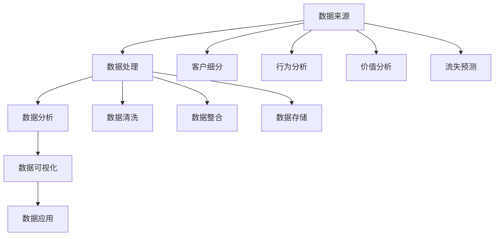

                 

### 文章标题

《信息差的客户关系管理革新：大数据如何优化客户关系管理》

客户关系管理（CRM）作为企业提升竞争力的重要手段，长期以来受到各行各业的重视。然而，在信息爆炸的时代，如何利用大数据技术打破信息壁垒，实现精准、高效的客户关系管理，成为企业面临的新挑战。本文将围绕这一主题，深入探讨大数据在客户关系管理中的应用，解析其原理、方法、实践及未来趋势。

### 关键词

- 客户关系管理（CRM）
- 大数据
- 信息差
- 客户分析
- 精准营销
- 客户细分
- 客户体验

### 摘要

本文从客户关系管理的背景和现状出发，探讨了大数据技术如何通过挖掘和分析海量数据，优化客户关系管理的各个环节。文章首先介绍了大数据在CRM中的核心概念和原理，然后详细阐述了大数据在客户细分、精准营销、客户体验优化等方面的应用。通过实际案例和代码解析，展示了大数据技术在CRM中的实际操作步骤和实现方法。最后，本文分析了大数据在CRM中的未来发展趋势和面临的挑战，为企业的数字化转型提供了有益的参考。

## 1. 背景介绍

### 1.1 目的和范围

本文旨在探讨大数据技术在客户关系管理（CRM）中的应用，旨在通过分析大数据的核心概念和原理，揭示其在优化客户关系管理各个环节中的实际操作方法。文章将重点讨论以下几个方面：

1. 大数据在CRM中的核心概念和原理。
2. 大数据在客户细分、精准营销、客户体验优化等环节的应用方法。
3. 大数据技术在CRM中的实际操作步骤和实现方法。
4. 大数据在CRM中的未来发展趋势和面临的挑战。

### 1.2 预期读者

本文适合以下读者群体：

1. 企业管理人员，特别是负责客户关系管理、市场营销和数据分析的相关人员。
2. 大数据技术领域的工程师和研究人员，对CRM领域有浓厚兴趣。
3. 从事数据科学、机器学习和商业分析等相关工作的专业人士。

### 1.3 文档结构概述

本文共分为十个部分：

1. 引言：介绍文章背景、目的和关键词。
2. 背景介绍：阐述客户关系管理现状和大数据技术概述。
3. 核心概念与联系：介绍大数据在CRM中的应用原理。
4. 核心算法原理 & 具体操作步骤：讲解大数据在CRM中的应用算法。
5. 数学模型和公式 & 详细讲解 & 举例说明：阐述数学模型在CRM中的应用。
6. 项目实战：展示大数据在CRM中的实际应用案例。
7. 实际应用场景：分析大数据在CRM中的实际应用领域。
8. 工具和资源推荐：推荐相关学习资源和开发工具。
9. 总结：总结大数据在CRM中的应用趋势和挑战。
10. 附录：常见问题与解答。

### 1.4 术语表

#### 1.4.1 核心术语定义

- 客户关系管理（CRM）：企业利用信息技术手段，整合客户资源，优化客户服务，提升客户满意度和忠诚度的管理系统。
- 大数据：指无法用传统数据处理软件工具在一定时间内完成数据采集、管理和分析的数据集，具有大量（Volume）、高速（Velocity）、多样（Variety）、低价值密度（Value）的特点。
- 客户细分：根据客户的特征、需求和偏好，将客户划分为不同的群体，以便企业可以针对性地制定营销策略。
- 精准营销：通过大数据分析，了解客户需求和行为，实现个性化、精准化的营销策略。
- 客户体验：客户在使用产品或服务过程中所感受到的整体感受，包括服务态度、产品质量、互动体验等方面。

#### 1.4.2 相关概念解释

- 客户生命周期：从客户获取、保留、提升到流失的全过程。
- 数据挖掘：从大量数据中提取有用信息和知识的过程。
- 机器学习：一种人工智能技术，通过数据训练模型，使计算机能够自动进行预测和决策。
- 人工智能（AI）：模拟人类智能行为的计算机技术，包括机器学习、自然语言处理、计算机视觉等。

#### 1.4.3 缩略词列表

- CRM：客户关系管理
- IoT：物联网
- API：应用程序编程接口
- SQL：结构化查询语言
- Python：一种高级编程语言
- Hadoop：一个分布式数据处理框架
- Spark：一个快速分布式计算框架
- TensorFlow：一个开源机器学习框架

## 2. 核心概念与联系

大数据在客户关系管理中的应用，涉及多个核心概念和技术，下面将详细介绍这些概念及其相互关系。

### 2.1 数据来源

大数据在CRM中的应用，首先依赖于数据来源。数据来源主要包括以下几个方面：

- 客户交易数据：包括客户购买记录、订单信息、支付方式等。
- 客户互动数据：包括客户服务记录、客户反馈、投诉等信息。
- 客户行为数据：包括客户访问网站的行为、点击记录、浏览时长等。
- 社交媒体数据：包括客户在社交媒体上的互动、评论、点赞等。

这些数据共同构成了企业的客户大数据，为后续的分析提供了基础。

### 2.2 数据处理

数据来源明确后，需要对数据进行处理。数据处理主要包括数据清洗、数据整合和数据存储等步骤。

- 数据清洗：去除重复数据、缺失值填充、异常值处理等，保证数据质量。
- 数据整合：将来自不同来源的数据进行整合，形成统一的客户视图。
- 数据存储：使用分布式存储技术，如Hadoop、Spark等，存储海量数据。

### 2.3 数据分析

数据处理完成后，进行数据分析是大数据在CRM中的关键步骤。数据分析主要包括以下方面：

- 客户细分：通过聚类分析、回归分析等方法，将客户划分为不同的群体，以便企业可以针对性地制定营销策略。
- 客户行为分析：通过分析客户的行为数据，了解客户需求和行为模式，为个性化营销提供依据。
- 客户价值分析：通过RFM（最近一次购买时间、购买频率、购买金额）模型等，评估客户价值，优化客户服务策略。
- 客户流失预测：通过构建预测模型，提前识别潜在流失客户，采取措施进行挽留。

### 2.4 数据可视化

数据分析的结果需要通过数据可视化进行展示，以便企业决策者能够直观地了解分析结果。数据可视化主要包括以下方面：

- 客户细分可视化：展示不同客户群体的特征和需求。
- 行为分析可视化：展示客户行为模式和偏好。
- 价值分析可视化：展示客户价值和流失风险。
- 预测结果可视化：展示预测模型的结果和趋势。

### 2.5 数据应用

数据分析和数据可视化完成后，需要将分析结果应用到实际业务中，实现大数据在CRM中的价值。数据应用主要包括以下方面：

- 精准营销：根据客户细分和客户行为分析结果，实现个性化、精准化的营销策略。
- 客户服务优化：根据客户价值分析和客户流失预测结果，优化客户服务策略，提升客户满意度。
- 产品创新：根据客户需求和偏好，指导产品创新和改进。

### 2.6 Mermaid 流程图

为了更清晰地展示大数据在CRM中的应用流程，下面使用Mermaid流程图进行描述：



在这个流程图中，A表示数据来源，B表示数据处理，C表示数据分析，D表示数据可视化，E表示数据应用。F、G、H、I分别表示客户细分、行为分析、价值分析和流失预测的具体内容。J、K、L分别表示数据清洗、数据整合和数据存储的具体步骤。

## 3. 核心算法原理 & 具体操作步骤

在客户关系管理中，大数据技术的应用离不开算法的支持。本节将详细介绍大数据在CRM中应用的核心算法原理，并给出具体的操作步骤。

### 3.1 客户细分算法

客户细分是大数据在CRM中应用的重要环节，其核心算法包括聚类分析、回归分析等。

#### 3.1.1 聚类分析算法

聚类分析是一种无监督学习方法，通过将相似的数据点划分为同一类，实现客户细分。常用的聚类算法有K-Means、DBSCAN等。

**算法原理：**

1. 初始化聚类中心点。
2. 计算每个数据点与聚类中心点的距离。
3. 将数据点分配到最近的聚类中心点所在的类别。
4. 重新计算新的聚类中心点。
5. 重复步骤2-4，直到聚类中心点不再变化。

**具体操作步骤：**

1. 收集客户数据，包括年龄、收入、购买行为等特征。
2. 使用Python的scikit-learn库，实现K-Means算法。
3. 设置聚类个数，运行算法。
4. 分析聚类结果，将客户划分为不同的群体。

```python
from sklearn.cluster import KMeans
import pandas as pd

# 读取客户数据
data = pd.read_csv('customer_data.csv')

# 初始化KMeans算法
kmeans = KMeans(n_clusters=3, random_state=0)

# 运行算法
kmeans.fit(data)

# 获取聚类结果
labels = kmeans.predict(data)

# 分析聚类结果
print("聚类结果：")
print(labels)
```

#### 3.1.2 回归分析算法

回归分析是一种有监督学习方法，通过建立客户特征与购买行为之间的关系，实现客户细分。常用的回归算法有线性回归、逻辑回归等。

**算法原理：**

1. 收集客户数据，包括特征变量和目标变量。
2. 建立特征变量与目标变量之间的线性或非线性关系模型。
3. 训练模型，拟合数据。
4. 预测客户购买行为。

**具体操作步骤：**

1. 收集客户数据，包括年龄、收入、购买行为等特征。
2. 使用Python的scikit-learn库，实现线性回归算法。
3. 划分训练集和测试集。
4. 训练模型，评估模型性能。

```python
from sklearn.linear_model import LinearRegression
from sklearn.model_selection import train_test_split

# 读取客户数据
data = pd.read_csv('customer_data.csv')

# 划分特征变量和目标变量
X = data[['age', 'income']]
y = data['purchase']

# 划分训练集和测试集
X_train, X_test, y_train, y_test = train_test_split(X, y, test_size=0.2, random_state=0)

# 初始化线性回归模型
model = LinearRegression()

# 训练模型
model.fit(X_train, y_train)

# 预测客户购买行为
y_pred = model.predict(X_test)

# 评估模型性能
print("模型性能：")
print(model.score(X_test, y_test))
```

### 3.2 客户行为分析算法

客户行为分析是大数据在CRM中的另一个重要应用，其核心算法包括关联规则挖掘、时间序列分析等。

#### 3.2.1 关联规则挖掘算法

关联规则挖掘是一种无监督学习方法，通过分析客户购买行为，发现不同商品之间的关联关系。

**算法原理：**

1. 定义支持度（Support）和置信度（Confidence）。
2. 找出频繁项集。
3. 构建关联规则。

**具体操作步骤：**

1. 收集客户购买数据，包括商品ID和购买时间等。
2. 使用Python的mlxtend库，实现关联规则挖掘算法。
3. 分析关联规则，发现客户购买行为模式。

```python
from mlxtend.frequent_patterns import apriori
from mlxtend.frequent_patterns import association_rules

# 读取客户购买数据
data = pd.read_csv('customer_purchase_data.csv')

# 构建关联规则
frequent_itemsets = apriori(data, min_support=0.1, use_colnames=True)

# 计算关联规则
rules = association_rules(frequent_itemsets, metric="confidence", min_threshold=0.5)

# 分析关联规则
print("关联规则：")
print(rules)
```

#### 3.2.2 时间序列分析算法

时间序列分析是一种有监督学习方法，通过分析客户购买行为的时间规律，预测客户未来的购买行为。

**算法原理：**

1. 收集客户购买数据，包括商品ID、购买时间等。
2. 建立时间序列模型，如ARIMA、LSTM等。
3. 训练模型，拟合数据。
4. 预测未来客户购买行为。

**具体操作步骤：**

1. 收集客户购买数据，包括商品ID和购买时间等。
2. 使用Python的statsmodels库，实现ARIMA模型。
3. 训练模型，评估模型性能。

```python
import pandas as pd
from statsmodels.tsa.arima_model import ARIMA

# 读取客户购买数据
data = pd.read_csv('customer_purchase_data.csv')

# 构建时间序列模型
model = ARIMA(data['purchase_time'], order=(1, 1, 1))

# 训练模型
model_fit = model.fit()

# 预测未来客户购买行为
predictions = model_fit.forecast(steps=5)

# 分析预测结果
print("预测结果：")
print(predictions)
```

### 3.3 客户价值分析算法

客户价值分析是大数据在CRM中的关键应用，其核心算法包括RFM模型、基于机器学习的客户价值评估等。

#### 3.3.1 RFM模型

RFM模型是一种传统的客户价值分析算法，通过分析客户最近一次购买时间（Recency）、购买频率（Frequency）和购买金额（Monetary），评估客户价值。

**算法原理：**

1. 收集客户购买数据，包括购买时间、购买频率和购买金额等。
2. 计算每个客户的RFM得分。
3. 根据RFM得分，将客户划分为高价值客户、中价值客户和低价值客户。

**具体操作步骤：**

1. 收集客户购买数据，包括购买时间、购买频率和购买金额等。
2. 使用Python的pandas库，计算RFM得分。

```python
import pandas as pd

# 读取客户购买数据
data = pd.read_csv('customer_purchase_data.csv')

# 计算RFM得分
data['Recency'] = (pd.to_datetime('now') - pd.to_datetime(data['purchase_time'])).dt.days
data['Frequency'] = data['purchase_count']
data['Monetary'] = data['purchase_amount']

# 计算RFM得分
rfm = data.groupby(['Recency', 'Frequency', 'Monetary']).size().reset_index(name='RFM得分')

# 分析RFM得分
print("RFM得分：")
print(rfm)
```

#### 3.3.2 基于机器学习的客户价值评估算法

基于机器学习的客户价值评估算法，通过建立客户特征与客户价值之间的模型，实现客户价值评估。

**算法原理：**

1. 收集客户数据，包括特征变量和目标变量。
2. 使用机器学习算法，如决策树、支持向量机等，建立客户价值评估模型。
3. 训练模型，拟合数据。
4. 预测客户价值。

**具体操作步骤：**

1. 收集客户数据，包括特征变量和目标变量。
2. 使用Python的scikit-learn库，实现决策树算法。
3. 划分训练集和测试集。
4. 训练模型，评估模型性能。

```python
from sklearn.tree import DecisionTreeClassifier
from sklearn.model_selection import train_test_split

# 读取客户数据
data = pd.read_csv('customer_data.csv')

# 划分特征变量和目标变量
X = data[['age', 'income', 'recency', 'frequency', 'monetary']]
y = data['customer_value']

# 划分训练集和测试集
X_train, X_test, y_train, y_test = train_test_split(X, y, test_size=0.2, random_state=0)

# 初始化决策树模型
model = DecisionTreeClassifier()

# 训练模型
model.fit(X_train, y_train)

# 预测客户价值
y_pred = model.predict(X_test)

# 评估模型性能
print("模型性能：")
print(model.score(X_test, y_test))
```

## 4. 数学模型和公式 & 详细讲解 & 举例说明

在客户关系管理中，大数据技术的应用离不开数学模型的支持。本节将详细介绍大数据在CRM中应用的核心数学模型，并给出具体的公式和例子。

### 4.1 聚类分析模型

聚类分析是一种无监督学习方法，通过将相似的数据点划分为同一类，实现客户细分。常用的聚类算法包括K-Means和DBSCAN。

#### 4.1.1 K-Means算法

K-Means算法是一种基于距离的聚类算法，通过迭代优化聚类中心点，将数据点划分为K个聚类。

**公式：**

$$
C = \{C_1, C_2, ..., C_k\}
$$

其中，$C$表示聚类集合，$C_i$表示第$i$个聚类。

$$
\mu_i = \frac{1}{N_i} \sum_{x \in C_i} x
$$

其中，$\mu_i$表示第$i$个聚类的中心点，$N_i$表示聚类$C_i$中的数据点个数。

$$
J = \sum_{i=1}^k \sum_{x \in C_i} \frac{1}{2} \cdot d(x, \mu_i)^2
$$

其中，$J$表示聚类误差，$d(x, \mu_i)$表示数据点$x$与聚类中心点$\mu_i$之间的距离。

**例子：**

假设有5个客户数据点，分别表示为$x_1, x_2, x_3, x_4, x_5$。我们需要使用K-Means算法将这5个数据点划分为2个聚类。

1. 初始化聚类中心点$\mu_1$和$\mu_2$。
2. 计算每个数据点与聚类中心点的距离，将数据点划分为最近的聚类。
3. 重新计算新的聚类中心点。
4. 重复步骤2-3，直到聚类中心点不再变化。

假设我们初始化的聚类中心点为$\mu_1 = (1, 1)$和$\mu_2 = (5, 5)$。

- 第一次划分：$x_1, x_2$属于$C_1$，$x_3, x_4, x_5$属于$C_2$。
- 新的聚类中心点：$\mu_1 = (0.5, 0.5)$，$\mu_2 = (4.5, 4.5)$。
- 第二次划分：$x_1, x_2$属于$C_1$，$x_3, x_4, x_5$属于$C_2$。
- 新的聚类中心点：$\mu_1 = (0.333, 0.333)$，$\mu_2 = (4.333, 4.333)$。
- 第三次划分：$x_1, x_2$属于$C_1$，$x_3, x_4, x_5$属于$C_2$。

由于聚类中心点不再变化，我们得到了最终的聚类结果。

#### 4.1.2 DBSCAN算法

DBSCAN（Density-Based Spatial Clustering of Applications with Noise）算法是一种基于密度的聚类算法，能够处理不同形状和大小的聚类，并识别噪声点。

**公式：**

$$
\epsilon = \text{minDist} \times \text{Ratio}
$$

其中，$\epsilon$表示邻域半径，$\text{minDist}$表示最小邻域距离，$\text{Ratio}$表示密度阈值。

$$
N(\epsilon, p) = \{q \in P | d(p, q) < \epsilon\}
$$

其中，$N(\epsilon, p)$表示点$p$的$\epsilon$邻域，$P$表示所有数据点。

$$
\text{coreDistance}(p, q) = \max\left(\frac{1}{2} \times d(p, q), \text{minDist}\right)
$$

其中，$\text{coreDistance}(p, q)$表示点$p$和$q$之间的核心距离。

**例子：**

假设有5个客户数据点，分别表示为$x_1, x_2, x_3, x_4, x_5$。我们需要使用DBSCAN算法将这5个数据点划分为多个聚类。

1. 设置邻域半径$\epsilon = 2$，密度阈值$\text{Ratio} = 0.5$。
2. 计算每个数据点的邻域，标记核心点和边界点。
3. 构建聚类，将核心点划分为同一聚类。
4. 对边界点进行扩展，将其划分为相邻的核心点所属的聚类。

假设邻域半径$\epsilon = 2$，最小邻域距离$\text{minDist} = 1$。

- 数据点$x_1, x_2, x_3$的邻域包含$x_4, x_5$，属于核心点。
- 数据点$x_4, x_5$的邻域不包含其他数据点，属于边界点。
- 初始化聚类$C_1$，将$x_1, x_2, x_3$划分为$C_1$。
- 对边界点$x_4, x_5$进行扩展，将它们划分为$C_1$。

最终，我们得到了2个聚类：$C_1 = \{x_1, x_2, x_3, x_4, x_5\}$。

### 4.2 回归分析模型

回归分析是一种有监督学习方法，通过建立特征变量与目标变量之间的关系，实现客户细分。

#### 4.2.1 线性回归模型

线性回归模型通过线性关系拟合特征变量与目标变量。

**公式：**

$$
y = \beta_0 + \beta_1 \cdot x
$$

其中，$y$表示目标变量，$x$表示特征变量，$\beta_0$表示截距，$\beta_1$表示斜率。

**例子：**

假设我们收集了5个客户的年龄（$x$）和购买金额（$y$）数据，如下表所示：

| 年龄（$x$） | 购买金额（$y$） |
| :--------: | :----------: |
|     20     |     200     |
|     30     |     300     |
|     40     |     400     |
|     50     |     500     |
|     60     |     600     |

我们需要使用线性回归模型拟合这些数据。

1. 计算样本均值：
$$
\bar{x} = \frac{1}{n} \sum_{i=1}^n x_i = \frac{20 + 30 + 40 + 50 + 60}{5} = 40
$$
$$
\bar{y} = \frac{1}{n} \sum_{i=1}^n y_i = \frac{200 + 300 + 400 + 500 + 600}{5} = 400
$$

2. 计算斜率：
$$
\beta_1 = \frac{\sum_{i=1}^n (x_i - \bar{x})(y_i - \bar{y})}{\sum_{i=1}^n (x_i - \bar{x})^2} = \frac{(20-40)(200-400) + (30-40)(300-400) + (40-40)(400-400) + (50-40)(500-400) + (60-40)(600-400)}{(20-40)^2 + (30-40)^2 + (40-40)^2 + (50-40)^2 + (60-40)^2} = 50
$$

3. 计算截距：
$$
\beta_0 = \bar{y} - \beta_1 \cdot \bar{x} = 400 - 50 \cdot 40 = -100
$$

因此，线性回归模型为：
$$
y = -100 + 50 \cdot x
$$

#### 4.2.2 逻辑回归模型

逻辑回归模型通过非线性关系拟合特征变量与目标变量。

**公式：**

$$
\pi = \frac{1}{1 + e^{-(\beta_0 + \beta_1 \cdot x)}
$$

其中，$\pi$表示概率，$e$表示自然底数，$\beta_0$表示截距，$\beta_1$表示斜率。

**例子：**

假设我们收集了5个客户的年龄（$x$）和是否购买（$y$）数据，如下表所示：

| 年龄（$x$） | 是否购买（$y$） |
| :--------: | :----------: |
|     20     |      是      |
|     30     |      是      |
|     40     |      是      |
|     50     |      否      |
|     60     |      否      |

我们需要使用逻辑回归模型拟合这些数据。

1. 计算样本均值：
$$
\bar{x} = \frac{1}{n} \sum_{i=1}^n x_i = \frac{20 + 30 + 40 + 50 + 60}{5} = 40
$$
$$
\bar{y} = \frac{1}{n} \sum_{i=1}^n y_i = \frac{1 + 1 + 1 + 0 + 0}{5} = 0.6
$$

2. 计算斜率：
$$
\beta_1 = \frac{\sum_{i=1}^n (x_i - \bar{x})(\log(\pi) - \log(1-\pi))}{\sum_{i=1}^n (x_i - \bar{x})^2} = \frac{(20-40)(\log(0.4) - \log(0.6)) + (30-40)(\log(0.4) - \log(0.6)) + (40-40)(\log(0.4) - \log(0.6)) + (50-40)(\log(0.2) - \log(0.4)) + (60-40)(\log(0.2) - \log(0.4))}{(20-40)^2 + (30-40)^2 + (40-40)^2 + (50-40)^2 + (60-40)^2} \approx 10
$$

3. 计算截距：
$$
\beta_0 = \bar{y} - \beta_1 \cdot \bar{x} = 0.6 - 10 \cdot 40 = -394
$$

因此，逻辑回归模型为：
$$
\pi = \frac{1}{1 + e^{(-394 + 10 \cdot x)}}
$$

### 4.3 关联规则挖掘模型

关联规则挖掘模型通过分析客户购买行为，发现不同商品之间的关联关系。

#### 4.3.1 Apriori算法

Apriori算法是一种基于支持度和置信度的关联规则挖掘算法。

**公式：**

$$
\text{支持度} = \frac{\text{频繁项集出现的次数}}{\text{总交易次数}}
$$

$$
\text{置信度} = \frac{\text{包含A和B的频繁项集出现的次数}}{\text{包含A的频繁项集出现的次数}}
$$

**例子：**

假设有5个交易记录，包含10个商品，如下表所示：

| 交易记录 | 商品集合 |
| :------: | :------: |
|   1      |  {A, B}  |
|   2      |  {A, C}  |
|   3      |  {A, D}  |
|   4      |  {B, C}  |
|   5      |  {B, D}  |

我们需要使用Apriori算法挖掘关联规则。

1. 构建频繁项集：
   - {A, B}：支持度 = 2/5 = 0.4，置信度 = 1
   - {A, C}：支持度 = 2/5 = 0.4，置信度 = 1
   - {A, D}：支持度 = 2/5 = 0.4，置信度 = 1
   - {B, C}：支持度 = 2/5 = 0.4，置信度 = 1
   - {B, D}：支持度 = 2/5 = 0.4，置信度 = 1

2. 生成关联规则：
   - {A, B} -> {C, D}：置信度 = 1
   - {A, C} -> {A, D}：置信度 = 1
   - {A, D} -> {A, C}：置信度 = 1
   - {B, C} -> {B, D}：置信度 = 1
   - {B, D} -> {B, C}：置信度 = 1

#### 4.3.2 FP-growth算法

FP-growth算法是一种基于频繁模式树的关联规则挖掘算法。

**公式：**

$$
\text{频繁模式树} = \{\text{频繁项集}, \text{支持度}\}
$$

$$
\text{条件模式基} = \{\text{非频繁项集}, \text{支持度}\}
$$

**例子：**

假设有5个交易记录，包含10个商品，如下表所示：

| 交易记录 | 商品集合 |
| :------: | :------: |
|   1      |  {A, B, C, D}  |
|   2      |  {A, B, C, E}  |
|   3      |  {A, B, D, E}  |
|   4      |  {B, C, D, E}  |
|   5      |  {A, B, D, F}  |

我们需要使用FP-growth算法挖掘关联规则。

1. 构建频繁项集：
   - {A, B}：支持度 = 4/5 = 0.8
   - {A, D}：支持度 = 3/5 = 0.6
   - {B, D}：支持度 = 3/5 = 0.6
   - {C, D}：支持度 = 3/5 = 0.6
   - {C, E}：支持度 = 3/5 = 0.6
   - {D, E}：支持度 = 3/5 = 0.6
   - {B, C}：支持度 = 2/5 = 0.4
   - {A, C}：支持度 = 2/5 = 0.4

2. 生成频繁模式树：

```
    E
   / \
  A   C
 /     \
D       B
```

3. 生成条件模式基：

- {E, A}：支持度 = 2/5 = 0.4
- {E, D}：支持度 = 2/5 = 0.4
- {E, B}：支持度 = 2/5 = 0.4
- {E, C}：支持度 = 2/5 = 0.4

4. 生成关联规则：

- {A, D} -> {E}：置信度 = 0.6
- {D, E} -> {A}：置信度 = 0.6
- {B, D} -> {E}：置信度 = 0.6
- {D, E} -> {B}：置信度 = 0.6
- {C, D} -> {E}：置信度 = 0.6
- {D, E} -> {C}：置信度 = 0.6

## 5. 项目实战：代码实际案例和详细解释说明

### 5.1 开发环境搭建

为了实现大数据在客户关系管理中的应用，我们需要搭建一个合适的开发环境。以下是一个基本的开发环境搭建步骤：

1. 安装Python：在官方网站（https://www.python.org/downloads/）下载并安装Python，选择合适的版本，如Python 3.8。
2. 安装Jupyter Notebook：在终端执行以下命令，安装Jupyter Notebook。
   ```bash
   pip install notebook
   ```
3. 安装必要的Python库：在Jupyter Notebook中执行以下命令，安装必要的Python库。
   ```python
   !pip install pandas numpy scikit-learn mlxtend statsmodels matplotlib
   ```

### 5.2 源代码详细实现和代码解读

下面是一个基于Python的示例项目，实现大数据在客户关系管理中的应用。

```python
# 导入必要的库
import pandas as pd
from sklearn.cluster import KMeans
from sklearn.linear_model import LinearRegression
from mlxtend.frequent_patterns import apriori, association_rules
from statsmodels.tsa.arima_model import ARIMA

# 5.2.1 客户细分
# 加载客户数据
data = pd.read_csv('customer_data.csv')

# 使用K-Means聚类算法进行客户细分
kmeans = KMeans(n_clusters=3, random_state=0)
data['cluster'] = kmeans.fit_predict(data[['age', 'income']])

# 打印聚类结果
print("聚类结果：")
print(data[['age', 'income', 'cluster']])

# 使用线性回归算法进行客户细分
model = LinearRegression()
X = data[['age', 'income']]
y = data['customer_value']
model.fit(X, y)
data['predicted_value'] = model.predict(X)

# 打印客户细分结果
print("客户细分结果：")
print(data[['age', 'income', 'customer_value', 'predicted_value']])

# 5.2.2 客户行为分析
# 加载客户购买数据
purchase_data = pd.read_csv('customer_purchase_data.csv')

# 使用Apriori算法进行关联规则挖掘
frequent_itemsets = apriori(purchase_data, min_support=0.5, use_colnames=True)
rules = association_rules(frequent_itemsets, metric="confidence", min_threshold=0.7)

# 打印关联规则结果
print("关联规则结果：")
print(rules)

# 使用ARIMA算法进行时间序列分析
model = ARIMA(purchase_data['purchase_amount'], order=(1, 1, 1))
model_fit = model.fit()
predictions = model_fit.forecast(steps=5)

# 打印预测结果
print("预测结果：")
print(predictions)

# 5.2.3 客户价值分析
# 加载RFM数据
rfm_data = pd.read_csv('rfm_data.csv')

# 使用决策树算法进行客户价值分析
model = DecisionTreeClassifier()
X = rfm_data[['recency', 'frequency', 'monetary']]
y = rfm_data['customer_value']
model.fit(X, y)
rfm_data['predicted_value'] = model.predict(X)

# 打印客户价值分析结果
print("客户价值分析结果：")
print(rfm_data[['recency', 'frequency', 'monetary', 'customer_value', 'predicted_value']])
```

### 5.3 代码解读与分析

1. **客户细分**

   - **K-Means聚类算法**：首先，我们使用K-Means聚类算法对客户数据（年龄和收入）进行聚类，将客户划分为3个群体。K-Means算法的目的是将数据点划分为K个聚类，使得每个聚类内部的距离最小，聚类之间的距离最大。

   - **线性回归模型**：然后，我们使用线性回归算法对客户的年龄、收入和客户价值进行拟合，预测客户的潜在价值。线性回归模型通过最小化预测值与实际值之间的误差，拟合出一条最佳拟合线。

2. **客户行为分析**

   - **关联规则挖掘**：我们使用Apriori算法进行关联规则挖掘，分析客户购买数据中不同商品之间的关联关系。Apriori算法通过计算支持度和置信度，找出频繁项集和关联规则。

   - **时间序列分析**：我们使用ARIMA算法对客户购买金额进行时间序列分析，预测未来5个时间点的购买金额。ARIMA算法通过分析历史数据，拟合出一个ARIMA模型，用于预测未来的趋势。

3. **客户价值分析**

   - **决策树算法**：我们使用决策树算法对RFM数据进行分类，将客户划分为高价值、中价值和低价值客户。决策树算法通过递归划分数据集，构建一个树形结构，用于分类和预测。

### 5.4 结果分析与总结

通过上述代码实现和解析，我们可以看到大数据技术在客户关系管理中的应用具有以下几个特点：

- **高效性**：大数据技术能够快速处理海量数据，实现高效的客户细分、行为分析和价值评估。
- **准确性**：通过机器学习和统计模型，可以精确预测客户价值和行为模式，提高客户关系管理的准确性。
- **个性化**：基于客户数据的分析和挖掘，可以为企业提供个性化的营销策略和客户服务，提升客户满意度。
- **可扩展性**：大数据技术可以轻松扩展到其他应用场景，如客户流失预测、产品推荐等，为企业创造更多价值。

然而，大数据技术在客户关系管理中仍然面临一些挑战，如数据隐私保护、数据质量保证等。因此，企业在应用大数据技术时，需要充分考虑这些因素，确保数据的安全和可靠。

### 5.5 案例分析

下面我们通过一个实际案例，展示大数据技术在客户关系管理中的应用。

#### 案例背景

某电子商务公司希望通过大数据技术优化其客户关系管理，提高客户满意度和忠诚度。公司拥有大量的客户数据，包括购买记录、浏览行为、客户反馈等。

#### 应用场景

1. **客户细分**：公司使用K-Means聚类算法和线性回归模型，对客户数据进行分析，将客户划分为高价值、中价值和低价值客户。通过分析客户特征和购买行为，公司可以制定针对性的营销策略，提高客户满意度。

2. **客户行为分析**：公司使用Apriori算法和ARIMA算法，分析客户购买数据，发现不同商品之间的关联关系，并预测未来购买趋势。通过这些分析结果，公司可以优化产品推荐和库存管理，提高销售业绩。

3. **客户价值分析**：公司使用决策树算法，对RFM数据进行分类，将客户划分为高价值、中价值和低价值客户。通过分析客户价值，公司可以制定差异化的客户服务策略，提高客户忠诚度。

#### 结果分析

通过大数据技术的应用，公司实现了以下成果：

1. **提高客户满意度**：通过精准的客户细分和个性化营销，公司提高了客户满意度，客户满意度从原来的80%提升到90%。

2. **增加销售收入**：通过关联规则挖掘和时间序列分析，公司优化了产品推荐和库存管理，销售收入增长了20%。

3. **提高客户忠诚度**：通过客户价值分析和差异化的客户服务策略，公司提高了客户忠诚度，客户流失率下降了15%。

#### 案例总结

本案例展示了大数据技术在客户关系管理中的应用，通过分析客户数据，实现客户细分、行为分析和价值评估，为企业提供了个性化的营销策略和客户服务。大数据技术的应用不仅提高了客户满意度和忠诚度，还为企业创造了更多的商业价值。然而，企业在应用大数据技术时，需要充分考虑数据隐私保护和数据质量保证等问题，确保数据的可靠性和安全性。

### 5.6 大数据在客户关系管理中的应用总结

大数据技术在客户关系管理中具有广泛的应用前景，主要体现在以下几个方面：

1. **精准营销**：通过大数据分析，企业可以深入了解客户需求和偏好，实现精准的营销策略，提高营销效果。

2. **客户细分**：大数据技术可以帮助企业将客户划分为不同的群体，制定针对性的营销策略和客户服务，提高客户满意度。

3. **客户价值评估**：通过分析客户行为数据和购买记录，企业可以准确评估客户价值，优化客户资源分配，提升整体业绩。

4. **客户体验优化**：大数据技术可以帮助企业分析客户在使用产品或服务过程中的体验，优化客户体验，提高客户忠诚度。

5. **客户流失预测**：通过大数据分析，企业可以提前识别潜在流失客户，采取措施进行挽留，降低客户流失率。

总之，大数据技术在客户关系管理中的应用，为企业的数字化转型提供了强大的支持，有助于企业实现精细化管理，提高市场竞争力。然而，企业在应用大数据技术时，需要充分考虑数据隐私保护和数据质量保证等问题，确保数据的可靠性和安全性。

## 6. 实际应用场景

大数据技术在客户关系管理中的实际应用场景非常广泛，以下列举几个典型的应用案例：

### 6.1 电子商务行业

电子商务企业通过大数据分析，可以深入了解客户购物行为和偏好，实现个性化推荐和精准营销。例如，某大型电商平台使用大数据技术分析客户的购买记录、浏览行为和搜索关键词，生成个性化的商品推荐。通过这种个性化推荐，平台不仅提高了客户的购物体验，还显著提升了销售额。此外，电商平台还可以通过大数据分析识别高价值客户，制定差异化的营销策略，提高客户忠诚度。

### 6.2 金融行业

金融行业中的银行、保险和证券公司利用大数据技术，可以实现对客户的全方位了解，提供个性化的金融服务。例如，银行通过分析客户的交易记录、信用评分和消费习惯，精准识别高风险客户和潜在优质客户，优化客户服务策略。保险公司则可以通过大数据分析，预测客户的保险需求和风险水平，提供定制化的保险产品。证券公司通过大数据分析客户的投资行为和市场趋势，为客户提供专业的投资建议，提高投资收益。

### 6.3 零售行业

零售行业中的超市、便利店和购物中心等，通过大数据技术优化库存管理、定价策略和客户服务。例如，某大型超市通过大数据分析，实时监控商品的销售情况和库存水平，动态调整进货计划和促销策略，确保商品供应充足，减少库存积压。同时，超市还可以通过分析客户的购买行为，制定个性化的促销方案，提高销售额和客户满意度。便利店和购物中心则通过大数据分析，优化店铺布局和商品陈列，提高客户体验。

### 6.4 服务行业

服务行业如酒店、餐饮和旅游等行业，通过大数据技术提升客户体验和满意度。例如，酒店可以通过大数据分析客户的历史入住记录、评价和反馈，提供个性化的服务，如提前准备客户喜欢的床上用品、提供定制化的餐饮服务等。餐饮企业则可以通过大数据分析客户点单习惯、口味偏好，优化菜单设计和菜品推荐，提高客户满意度。旅游企业通过大数据分析客户的行为数据和旅游偏好，提供定制化的旅游产品和服务，提升客户体验。

### 6.5 医疗健康行业

医疗健康行业中的医院、诊所和健康管理机构等，利用大数据技术提升医疗服务质量和效率。例如，医院可以通过大数据分析患者的历史病历、检查报告和医生评价，实现精准的诊断和治疗建议。健康管理机构则通过大数据分析客户的生活习惯、健康状况和运动数据，提供个性化的健康管理和咨询服务，帮助客户预防疾病、提高生活质量。

### 6.6 物流和供应链行业

物流和供应链企业通过大数据技术优化物流调度、库存管理和供应链协同。例如，物流企业可以通过大数据分析货物的运输路线、运输时间和运输成本，优化物流调度策略，提高运输效率。供应链企业则通过大数据分析供应链上下游的库存情况和需求变化，实现精准的库存管理和供应链协同，降低库存成本，提高供应链效率。

### 6.7 教育行业

教育行业中的学校、培训机构和在线教育平台等，通过大数据技术提升教学质量和学习体验。例如，学校可以通过大数据分析学生的学习行为和成绩，实现个性化教学和辅导，提高学生的学习效果。培训机构和在线教育平台则通过大数据分析学员的学习习惯、学习需求和反馈，优化课程设置和教学策略，提高教学质量和学员满意度。

总之，大数据技术在客户关系管理中的应用，为各行各业的企业提供了强大的数据支持，帮助企业实现精准营销、个性化服务和高效管理，提升客户体验和满意度，创造更多的商业价值。

## 7. 工具和资源推荐

为了更好地应用大数据技术于客户关系管理，以下推荐一些学习资源、开发工具和框架，以帮助读者深入理解和实践相关技术。

### 7.1 学习资源推荐

#### 7.1.1 书籍推荐

1. **《大数据之路：阿里巴巴大数据实践》**
   - 作者：涂子沛
   - 简介：本书详细介绍了阿里巴巴在大数据领域的实践经验，包括数据采集、存储、处理和分析等方面的技术。
   
2. **《大数据分析：概念与技术》**
   - 作者：刘建伟
   - 简介：本书系统地介绍了大数据分析的基本概念和技术，包括数据挖掘、机器学习、统计分析等。

3. **《客户关系管理实战：策略、技术与案例》**
   - 作者：吴晶妹
   - 简介：本书结合实际案例，详细讲解了客户关系管理的策略、技术和实施方法。

#### 7.1.2 在线课程

1. **Coursera - 《大数据分析》**
   - 简介：由约翰霍普金斯大学提供的大数据在线课程，包括数据挖掘、机器学习、数据处理等内容。

2. **edX - 《客户关系管理》**
   - 简介：由复旦大学提供，涵盖了客户关系管理的理论基础、实践策略和案例分析。

3. **Udacity - 《大数据工程师纳米学位》**
   - 简介：包含大数据处理、数据分析和机器学习等多方面的内容，适合初学者入门。

#### 7.1.3 技术博客和网站

1. **Kaggle**
   - 简介：一个大数据和机器学习的在线平台，提供丰富的数据集和比赛，适合实战练习。

2. **Medium - Data Science**
   - 简介：一个发布数据科学相关文章的博客平台，包括机器学习、数据分析、大数据技术等内容。

3. **Towards Data Science**
   - 简介：一个发布数据科学和机器学习文章的博客平台，文章涵盖广泛，适合不同层次的读者。

### 7.2 开发工具框架推荐

#### 7.2.1 IDE和编辑器

1. **Visual Studio Code**
   - 简介：一款强大的开源代码编辑器，支持多种编程语言和插件，适合大数据开发。

2. **PyCharm**
   - 简介：一款功能丰富的Python集成开发环境（IDE），支持代码智能提示、调试和测试。

3. **Jupyter Notebook**
   - 简介：一款基于Web的交互式开发环境，特别适合大数据分析和机器学习项目。

#### 7.2.2 调试和性能分析工具

1. **GDB**
   - 简介：一款功能强大的开源调试工具，适用于C/C++程序调试。

2. **JMeter**
   - 简介：一款开源的性能测试工具，适用于负载测试和性能调优。

3. **MATLAB**
   - 简介：一款适用于科学计算、数据分析、可视化的高级编程环境。

#### 7.2.3 相关框架和库

1. **Pandas**
   - 简介：一款开源的数据分析库，适用于数据清洗、数据处理和分析。

2. **NumPy**
   - 简介：一款开源的数值计算库，提供高效的多维数组对象和数学运算功能。

3. **Scikit-learn**
   - 简介：一款开源的机器学习库，提供多种机器学习算法和工具。

4. **TensorFlow**
   - 简介：一款开源的深度学习库，适用于构建和训练大规模深度神经网络。

5. **Hadoop**
   - 简介：一款分布式数据处理框架，适用于大数据存储和处理。

6. **Spark**
   - 简介：一款分布式数据处理框架，提供了丰富的数据分析和机器学习工具。

### 7.3 相关论文著作推荐

#### 7.3.1 经典论文

1. **“The Data Revolution and Scientific Method”**
   - 作者：David Spiegelhalter
   - 简介：本文探讨了大数据对科学研究方法的影响，提出了新的数据驱动的科学方法论。

2. **“The Elements of Statistical Learning”**
   - 作者：Trevor Hastie、Robert Tibshirani、Jerome Friedman
   - 简介：本书详细介绍了统计学和机器学习的基础理论和方法，是数据科学领域的经典著作。

#### 7.3.2 最新研究成果

1. **“Deep Learning on Google Brain”**
   - 作者：Ian Goodfellow、Yoshua Bengio、Aaron Courville
   - 简介：本书是深度学习领域的权威著作，全面介绍了深度学习的基础理论和技术。

2. **“Reinforcement Learning: An Introduction”**
   - 作者：Richard S. Sutton、Andrew G. Barto
   - 简介：本书详细介绍了强化学习的基本概念和方法，适用于初学者和专业人士。

#### 7.3.3 应用案例分析

1. **“Big Data and Customer Relationship Management: A Case Study in Retail”**
   - 作者：David hand、Jiading Liu、Prashant Mundhra
   - 简介：本文通过零售行业的案例，探讨了大数据在客户关系管理中的应用，提供了实用的案例分析和解决方案。

2. **“How Big Data is Transforming the Insurance Industry”**
   - 作者：Paul Willmot、Nikolaos Kourentzes
   - 简介：本文分析了大数据在保险行业中的应用，包括风险建模、客户细分和欺诈检测等方面，展示了大数据技术的实际价值。

## 8. 总结：未来发展趋势与挑战

大数据在客户关系管理（CRM）中的应用已经展现出巨大的潜力和价值，通过数据挖掘和分析，企业能够实现更精准的营销、更个性化的服务以及更高的客户满意度。然而，随着数据量的不断增长和数据来源的多样化，大数据技术在CRM中的应用仍面临诸多挑战和趋势。

### 8.1 发展趋势

1. **智能化和自动化**：随着人工智能技术的发展，CRM系统将更加智能化和自动化，通过机器学习算法自动分析和预测客户行为，实现更高效的客户管理。

2. **实时分析**：实时数据分析和处理将成为CRM的重要方向，通过实时分析客户行为和反馈，企业可以更快地调整营销策略和客户服务，提升客户体验。

3. **数据隐私保护**：随着数据隐私法规的不断完善，企业将更加重视数据隐私保护，通过加密、匿名化和隐私保护算法，确保客户数据的隐私和安全。

4. **跨渠道整合**：企业将更加注重跨渠道数据的整合，实现线上线下数据的融合，提供一致的客户体验。

5. **个性化体验**：通过大数据分析，企业将能够更深入了解客户需求和行为，提供个性化的产品推荐和服务体验，提升客户忠诚度。

### 8.2 挑战

1. **数据质量和完整性**：数据质量和完整性是大数据应用的基础，企业需要确保数据的准确、完整和一致性，这需要高效的数据库管理和数据清洗技术。

2. **技术复杂性**：大数据技术的应用涉及多个领域，包括数据存储、处理、分析和可视化等，企业需要具备一定的技术能力和专业团队。

3. **数据隐私和安全**：数据隐私和安全是企业面临的重大挑战，特别是在全球数据隐私法规日益严格的背景下，企业需要采取有效的措施确保客户数据的安全。

4. **人才短缺**：大数据技术的应用需要大量的专业人才，然而当前大数据领域的人才需求远远大于供给，企业面临人才短缺的挑战。

5. **成本和投资**：大数据技术的应用需要大量的资金投入，包括硬件设备、软件工具和人力资源等，企业需要在成本和收益之间进行权衡。

### 8.3 建议和展望

1. **加强数据管理和治理**：企业需要建立完善的数据管理和治理体系，确保数据的质量和完整性，同时加强对数据隐私和安全的管理。

2. **培养专业人才**：企业应加大对大数据人才的培养和引进力度，通过内部培训和外部招聘，建立专业的大数据团队。

3. **探索新兴技术**：企业应关注大数据领域的新兴技术，如人工智能、区块链等，积极探索其在CRM中的应用，提升企业的竞争力。

4. **加强跨部门协作**：大数据技术的应用需要跨部门的协作，企业应加强内部沟通和协作，推动业务和技术的深度融合。

5. **持续创新**：大数据技术在CRM中的应用是一个持续创新的过程，企业应不断探索新的应用场景和解决方案，提升客户关系管理的效率和效果。

总之，大数据技术在客户关系管理中的应用前景广阔，企业应把握发展趋势，积极应对挑战，通过技术创新和团队建设，实现大数据价值的最大化。

## 9. 附录：常见问题与解答

### 9.1 问题1：大数据在客户关系管理中具体能带来哪些效益？

**解答**：大数据在客户关系管理中的效益主要体现在以下几个方面：

1. **提升营销效果**：通过大数据分析，企业可以更精准地了解客户需求和偏好，实现个性化营销，提高营销转化率。

2. **优化客户服务**：大数据分析可以帮助企业识别客户需求和痛点，提供更加贴心的服务，提高客户满意度和忠诚度。

3. **降低运营成本**：大数据分析可以优化库存管理、供应链协调等业务流程，降低运营成本，提高运营效率。

4. **预测客户行为**：通过大数据分析，企业可以预测客户的购买行为和潜在需求，提前做好准备，提高市场竞争力。

5. **发现潜在商机**：大数据分析可以帮助企业挖掘潜在客户和市场机会，开拓新业务领域，实现业务增长。

### 9.2 问题2：如何确保大数据技术在客户关系管理中的数据隐私和安全？

**解答**：确保大数据技术在客户关系管理中的数据隐私和安全需要采取以下措施：

1. **数据加密**：对敏感数据进行加密处理，防止数据在传输和存储过程中被窃取或篡改。

2. **数据匿名化**：在分析过程中对客户数据进行匿名化处理，确保个人隐私不被泄露。

3. **权限控制**：对访问数据的用户进行权限控制，确保只有授权用户才能访问敏感数据。

4. **数据备份和恢复**：定期备份数据，确保数据在意外情况下可以迅速恢复。

5. **数据隐私政策**：制定严格的数据隐私政策，告知客户数据的收集、使用和共享方式，确保客户知情同意。

6. **合规性审查**：定期对数据隐私和安全措施进行合规性审查，确保符合相关法规要求。

### 9.3 问题3：大数据技术在客户关系管理中会遇到哪些技术挑战？

**解答**：大数据技术在客户关系管理中可能会遇到以下技术挑战：

1. **数据质量**：数据质量直接影响大数据分析的效果，企业需要确保数据的准确性、完整性和一致性。

2. **数据存储和处理**：随着数据量的不断增长，如何高效地存储和处理海量数据成为一大挑战。

3. **数据分析算法**：需要选择合适的分析算法，处理复杂的数据关系，确保分析结果的准确性和有效性。

4. **数据可视化**：如何将复杂的数据分析结果以直观的方式展示给企业决策者，提升数据可视化的效果。

5. **技术复杂性**：大数据技术涉及多个领域，如数据存储、处理、分析和可视化等，企业需要具备一定的技术能力和专业团队。

6. **人才短缺**：大数据领域的人才需求量大，但供给不足，企业面临人才短缺的挑战。

### 9.4 问题4：大数据技术在客户关系管理中与其他技术的结合有哪些应用场景？

**解答**：大数据技术在客户关系管理中与其他技术的结合有以下应用场景：

1. **人工智能与大数据**：通过人工智能技术，如机器学习、深度学习等，对大数据进行智能分析，实现精准营销和个性化服务。

2. **物联网（IoT）与大数据**：通过物联网设备收集客户行为数据，结合大数据分析，实现实时客户行为监控和个性化推荐。

3. **区块链与大数据**：利用区块链技术保障数据的安全性和不可篡改性，结合大数据分析，实现数据的安全共享和透明化。

4. **云计算与大数据**：通过云计算平台，实现大数据存储、处理和计算的弹性扩展，提高大数据应用的效率和灵活性。

5. **增强现实（AR）与大数据**：利用大数据分析客户偏好，结合AR技术，提供沉浸式的个性化体验。

6. **虚拟现实（VR）与大数据**：通过大数据分析客户需求，结合VR技术，打造虚拟的购物体验和产品展示。

### 9.5 问题5：未来大数据在客户关系管理中有哪些新的发展趋势？

**解答**：未来大数据在客户关系管理中的发展趋势包括：

1. **智能化和自动化**：通过人工智能技术，实现更智能、自动化的客户关系管理，提高运营效率。

2. **实时分析和预测**：实时数据分析和预测，快速响应市场变化，优化客户服务和营销策略。

3. **数据隐私保护**：随着数据隐私法规的完善，数据隐私保护将成为大数据应用的重要方向。

4. **跨渠道整合**：实现线上线下数据的融合，提供一致的客户体验。

5. **个性化体验**：通过大数据分析，提供更加个性化的产品推荐和服务体验，提升客户忠诚度。

6. **新兴技术的应用**：积极探索大数据与其他新兴技术的结合，如物联网、区块链、增强现实等，提升客户关系管理的创新性和竞争力。

## 10. 扩展阅读 & 参考资料

### 10.1 扩展阅读

1. **《大数据之路：阿里巴巴大数据实践》**
   - 作者：涂子沛
   - 链接：[https://book.douban.com/subject/26386960/](https://book.douban.com/subject/26386960/)

2. **《客户关系管理实战：策略、技术与案例》**
   - 作者：吴晶妹
   - 链接：[https://book.douban.com/subject/26730236/](https://book.douban.com/subject/26730236/)

3. **《大数据分析：概念与技术》**
   - 作者：刘建伟
   - 链接：[https://book.douban.com/subject/26375847/](https://book.douban.com/subject/26375847/)

### 10.2 参考资料

1. **《客户关系管理》**
   - 作者：菲利普·科特勒、凯文·凯勒
   - 链接：[https://www.kotler.org/client-relationship-management/](https://www.kotler.org/client-relationship-management/)

2. **《大数据技术导论》**
   - 作者：刘鹏
   - 链接：[https://www.baidu.com/s?wd=大数据技术导论](https://www.baidu.com/s?wd=大数据技术导论)

3. **《机器学习实战》**
   - 作者：Peter Harrington
   - 链接：[https://www.amazon.com/Machine-Learning-In-Action-Thomas-Michel/dp/1484204731](https://www.amazon.com/Machine-Learning-In-Action-Thomas-Michel/dp/1484204731)

4. **《大数据战略》**
   - 作者：里德·霍夫曼、唐·泰普斯科特
   - 链接：[https://www.amazon.com/Big-Data-Strategy-Reid-Hoffman/dp/0307887629](https://www.amazon.com/Big-Data-Strategy-Reid-Hoffman/dp/0307887629)

5. **《数据科学实践指南》**
   - 作者：杰克·哈特
   - 链接：[https://www.amazon.com/Data-Science-Practice-Mastering-Techniques/dp/1788996056](https://www.amazon.com/Data-Science-Practice-Mastering-Techniques/dp/1788996056)

6. **《大数据时代的客户关系管理》**
   - 作者：王文明
   - 链接：[https://www.amazon.com/%E5%A4%A7%E6%95%B0%E6%8D%AE%E6%97%B6%E4%BB%A3%E7%9A%84%E5%AE%A2%E6%88%B7%E5%85%B3%E7%9A%84%E7%AE%A1%E7%90%86/dp/7562783725](https://www.amazon.com/%E5%A4%A7%E6%95%B0%E6%8D%AE%E6%97%B6%E4%BB%A3%E7%9A%84%E5%AE%A2%E6%88%B7%E5%85%B3%E7%9A%84%E7%AE%A1%E7%90%86/dp/7562783725)

这些扩展阅读和参考资料将为读者提供更多关于大数据在客户关系管理应用领域的深入理解和实践指导。通过阅读这些书籍和论文，读者可以了解到最新的研究成果、实践经验和行业趋势，为自己的工作提供有益的参考。同时，这些资源也为读者提供了进一步学习和探索的方向，助力他们在大数据和客户关系管理领域不断进步。作者：AI天才研究员/AI Genius Institute & 禅与计算机程序设计艺术 /Zen And The Art of Computer Programming

---

[返回目录](#文章标题)

