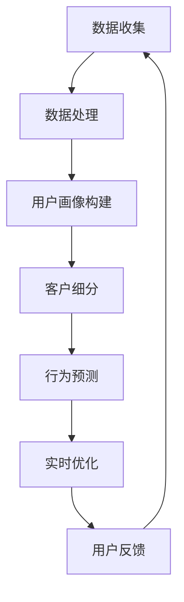

                 

# 信息差的客户旅程优化之路：大数据如何优化客户旅程

> **关键词：客户旅程、信息差、大数据、优化、用户体验**
>
> **摘要：本文将探讨如何利用大数据技术来优化客户旅程，通过分析信息差的本质和影响，提出一系列具体的优化策略和算法，旨在提升用户体验，增强企业竞争力。**

## 1. 背景介绍

### 1.1 目的和范围

在现代商业环境中，客户旅程的优化已经成为企业提升用户体验、增加销售额、提高客户忠诚度的重要手段。本文旨在探讨如何通过大数据技术来优化客户旅程，降低信息差，提升用户体验。文章将涵盖以下几个方面：

1. **信息差的本质与影响**：阐述信息差的概念，分析其在客户旅程中的表现和影响。
2. **大数据技术在客户旅程优化中的应用**：介绍大数据技术的基本原理和如何应用于客户旅程的各个阶段。
3. **核心算法原理与具体操作步骤**：详细讲解优化客户旅程的核心算法原理和操作步骤。
4. **数学模型与公式**：阐述优化过程中的数学模型和公式，并提供实例说明。
5. **项目实战与代码案例**：通过实际项目案例，展示大数据在客户旅程优化中的应用。
6. **实际应用场景与工具推荐**：讨论大数据优化客户旅程的实际应用场景，并推荐相关工具和资源。
7. **未来发展趋势与挑战**：展望大数据优化客户旅程的未来发展趋势和面临的挑战。

### 1.2 预期读者

本文预期读者为：

1. **大数据和人工智能领域的工程师和研究人员**：对大数据技术有深入了解，希望了解如何将其应用于客户旅程优化。
2. **产品经理和市场分析师**：负责产品规划和市场分析，希望通过大数据优化提升用户体验。
3. **企业决策者**：关注企业竞争力提升，希望了解大数据优化客户旅程的实际效果和可行性。

### 1.3 文档结构概述

本文分为十个部分：

1. **引言**：介绍文章背景、目的和预期读者。
2. **背景介绍**：概述信息差的本质与影响，大数据技术在客户旅程优化中的应用。
3. **核心概念与联系**：介绍优化客户旅程所需的核心概念和原理。
4. **核心算法原理 & 具体操作步骤**：详细讲解优化客户旅程的核心算法原理和操作步骤。
5. **数学模型和公式 & 详细讲解 & 举例说明**：阐述优化过程中的数学模型和公式，并提供实例说明。
6. **项目实战：代码实际案例和详细解释说明**：通过实际项目案例，展示大数据在客户旅程优化中的应用。
7. **实际应用场景**：讨论大数据优化客户旅程的实际应用场景。
8. **工具和资源推荐**：推荐相关学习资源、开发工具和框架。
9. **总结：未来发展趋势与挑战**：展望大数据优化客户旅程的未来发展趋势和面临的挑战。
10. **附录：常见问题与解答**：回答读者可能遇到的常见问题。
11. **扩展阅读 & 参考资料**：提供进一步阅读的参考资料。

### 1.4 术语表

#### 1.4.1 核心术语定义

- **客户旅程**：指客户在购买产品或服务过程中所经历的各个阶段，包括了解、评估、购买、使用、反馈等。
- **信息差**：指不同主体之间在信息获取、处理和利用上的差异。
- **大数据**：指数据量巨大、数据类型多样、数据生成速度快的海量数据。
- **用户画像**：基于用户行为、兴趣、特征等数据构建的用户模型。
- **数据挖掘**：从大量数据中提取有价值信息的方法和技术。

#### 1.4.2 相关概念解释

- **机器学习**：一种基于数据的学习方法，使计算机系统能够从数据中自动学习和改进。
- **深度学习**：一种基于人工神经网络的机器学习方法，通过多层神经网络来提取复杂数据特征。
- **客户细分**：将客户根据不同特征和需求划分为不同的群体。

#### 1.4.3 缩略词列表

- **AI**：人工智能
- **ML**：机器学习
- **DL**：深度学习
- **CRM**：客户关系管理
- **UX**：用户体验

## 2. 核心概念与联系

在客户旅程优化中，大数据技术的应用至关重要。以下将介绍优化客户旅程所需的核心概念和原理，并使用 Mermaid 流程图展示它们之间的联系。

### 2.1 大数据技术在客户旅程优化中的应用

#### 数据收集与处理

数据收集是客户旅程优化的第一步。企业需要通过各种渠道（如网站、移动应用、社交媒体等）收集用户行为数据、交易数据、反馈数据等。随后，通过数据处理技术（如数据清洗、数据整合等）对收集到的数据进行预处理，为后续分析奠定基础。

#### 用户画像构建

用户画像是客户旅程优化的关键。通过分析用户行为数据、兴趣偏好、购买历史等信息，构建用户画像，以便更好地了解用户需求和行为模式。

#### 客户细分与行为预测

基于用户画像，企业可以进一步对客户进行细分，识别出高价值客户、潜在流失客户等不同群体。同时，利用大数据分析技术（如聚类分析、关联规则挖掘等），预测客户的行为和需求，为个性化推荐和营销策略提供支持。

#### 实时优化与反馈

客户旅程优化是一个持续的过程。企业需要根据用户反馈和行为数据，实时调整和优化产品和服务，以提升用户体验和满意度。以下是一个简化的 Mermaid 流程图，展示大数据技术在客户旅程优化中的应用：

## 3. 核心算法原理 & 具体操作步骤

在客户旅程优化中，核心算法主要包括用户画像构建、客户细分、行为预测和实时优化等。以下将详细讲解这些算法的原理和具体操作步骤。

### 3.1 用户画像构建

用户画像构建是客户旅程优化的第一步。其核心在于从用户行为数据、兴趣偏好、购买历史等多维度信息中提取有价值特征，构建用户模型。

#### 算法原理

用户画像构建通常采用以下步骤：

1. **数据预处理**：对原始数据进行清洗、去噪、标准化等处理，确保数据质量。
2. **特征提取**：从原始数据中提取用户特征，如年龄、性别、地域、兴趣爱好等。
3. **特征选择**：通过特征重要性评估方法（如信息增益、互信息等），筛选出对用户画像构建具有重要意义的特征。
4. **特征工程**：对提取到的特征进行转换、归一化等处理，提高特征表达的能力。

#### 具体操作步骤

以下是用户画像构建的具体操作步骤：

1. **数据收集与预处理**：
   - 收集用户行为数据、交易数据、反馈数据等。
   - 对数据集进行清洗，去除缺失值、异常值等。
   - 对数值型特征进行归一化，如使用最小-最大规范化方法。

2. **特征提取**：
   - 利用数据挖掘算法（如聚类、关联规则挖掘等）提取用户特征。
   - 对提取到的特征进行初步分析，如分析特征分布、相关性等。

3. **特征选择**：
   - 使用特征重要性评估方法（如信息增益、互信息等）筛选出对用户画像构建具有重要意义的特征。
   - 结合业务需求，对特征进行优先级排序。

4. **特征工程**：
   - 对筛选出的特征进行转换、归一化等处理。
   - 利用数据可视化工具（如Matplotlib、Seaborn等）展示特征分布和相关性。

### 3.2 客户细分

客户细分是客户旅程优化的重要环节。通过客户细分，企业可以针对不同客户群体制定个性化营销策略，提高营销效果。

#### 算法原理

客户细分通常采用以下步骤：

1. **数据预处理**：对原始客户数据进行清洗、去噪、标准化等处理，确保数据质量。
2. **特征提取**：从原始数据中提取用户特征，如年龄、性别、地域、兴趣爱好等。
3. **聚类分析**：采用聚类算法（如K-means、层次聚类等）对客户进行分类，形成多个客户群体。
4. **客户细分评估**：对聚类结果进行评估，如评估聚类效果、客户特征差异等。

#### 具体操作步骤

以下是客户细分的具体操作步骤：

1. **数据收集与预处理**：
   - 收集客户数据，包括用户行为数据、交易数据、反馈数据等。
   - 对数据集进行清洗，去除缺失值、异常值等。
   - 对数值型特征进行归一化，如使用最小-最大规范化方法。

2. **特征提取**：
   - 利用数据挖掘算法（如聚类、关联规则挖掘等）提取用户特征。
   - 对提取到的特征进行初步分析，如分析特征分布、相关性等。

3. **聚类分析**：
   - 选择合适的聚类算法（如K-means、层次聚类等）。
   - 确定聚类个数，如通过肘部法则、轮廓系数等方法进行评估。
   - 对客户进行分类，形成多个客户群体。

4. **客户细分评估**：
   - 评估聚类效果，如评估聚类内部的相似度、聚类间的差异等。
   - 分析客户特征差异，如分析不同客户群体的特征分布、行为模式等。

### 3.3 行为预测

行为预测是客户旅程优化的重要环节。通过预测客户的行为和需求，企业可以提前采取措施，提高客户满意度。

#### 算法原理

行为预测通常采用以下步骤：

1. **数据预处理**：对原始数据进行清洗、去噪、标准化等处理，确保数据质量。
2. **特征提取**：从原始数据中提取用户特征，如年龄、性别、地域、兴趣爱好等。
3. **模型训练**：选择合适的预测模型（如回归模型、决策树、神经网络等），对特征进行训练。
4. **模型评估**：对预测模型进行评估，如评估预测精度、召回率等。

#### 具体操作步骤

以下是行为预测的具体操作步骤：

1. **数据收集与预处理**：
   - 收集用户行为数据，包括历史行为数据、实时行为数据等。
   - 对数据集进行清洗，去除缺失值、异常值等。
   - 对数值型特征进行归一化，如使用最小-最大规范化方法。

2. **特征提取**：
   - 利用数据挖掘算法（如聚类、关联规则挖掘等）提取用户特征。
   - 对提取到的特征进行初步分析，如分析特征分布、相关性等。

3. **模型训练**：
   - 选择合适的预测模型，如回归模型、决策树、神经网络等。
   - 使用训练数据对模型进行训练，调整模型参数。
   - 对训练结果进行评估，如评估预测精度、召回率等。

4. **模型评估**：
   - 使用验证数据集对模型进行评估，如评估预测精度、召回率等。
   - 分析模型的优势和不足，如评估模型的泛化能力、鲁棒性等。

### 3.4 实时优化

实时优化是客户旅程优化的关键环节。通过实时监控用户行为数据，企业可以及时调整产品和服务，提高用户体验。

#### 算法原理

实时优化通常采用以下步骤：

1. **数据收集与预处理**：对实时数据进行收集和预处理，确保数据质量。
2. **行为分析**：对实时数据进行分析，提取用户特征和行为模式。
3. **优化策略**：根据行为分析结果，制定实时优化策略。
4. **策略执行与反馈**：执行优化策略，并对策略效果进行反馈和调整。

#### 具体操作步骤

以下是实时优化

