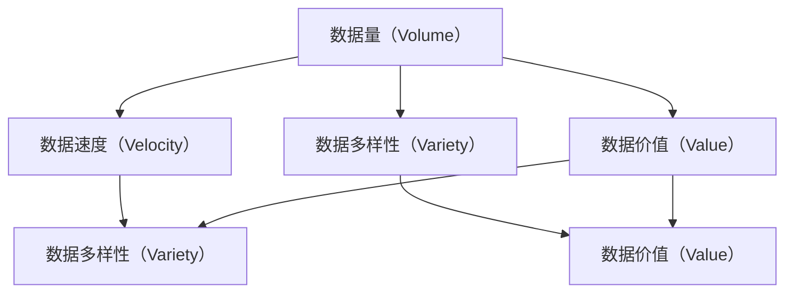
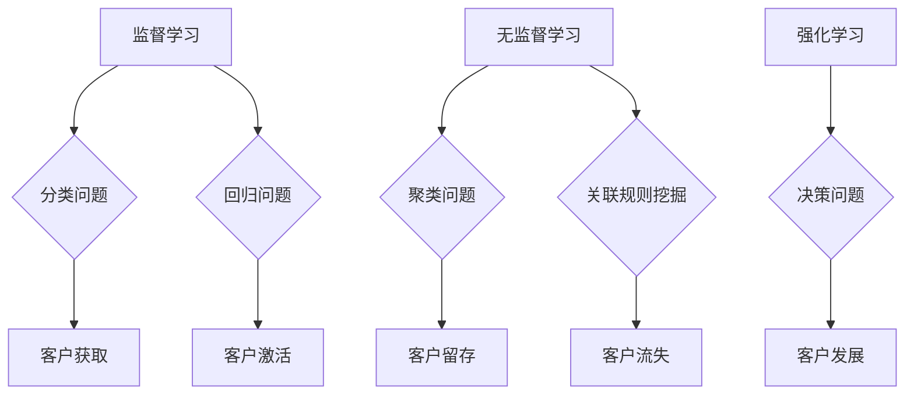
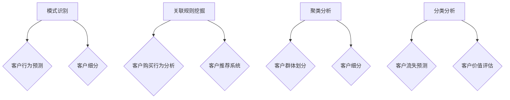
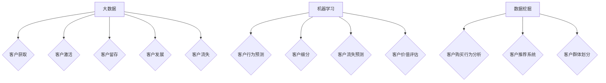

                 

# 信息差的客户生命周期管理：大数据如何管理客户生命周期

> **关键词：** 客户生命周期管理，大数据分析，机器学习，数据挖掘，客户行为预测，个性化营销

> **摘要：** 随着大数据技术的快速发展，企业能够从海量数据中提取有价值的信息，从而实现更精准的客户生命周期管理。本文将探讨如何运用大数据技术，结合机器学习和数据挖掘，实现客户生命周期的全程监控和优化，帮助企业实现个性化营销和客户价值最大化。

## 1. 背景介绍

### 1.1 目的和范围

本文旨在探讨大数据技术在客户生命周期管理中的应用，通过深入分析大数据、机器学习和数据挖掘等核心技术，为企业和营销人员提供一套系统的、可操作的客户生命周期管理解决方案。

### 1.2 预期读者

本文适合从事市场营销、数据分析和客户关系管理等相关领域的工作者阅读。同时，也欢迎对大数据和人工智能技术感兴趣的技术爱好者一起探讨和学习。

### 1.3 文档结构概述

本文将分为以下几个部分：

1. 背景介绍：介绍客户生命周期管理的重要性和大数据技术的基础知识。
2. 核心概念与联系：阐述大数据、机器学习和数据挖掘等核心概念及其在客户生命周期管理中的应用。
3. 核心算法原理 & 具体操作步骤：详细讲解大数据分析在客户生命周期管理中的具体算法原理和操作步骤。
4. 数学模型和公式 & 详细讲解 & 举例说明：介绍客户生命周期管理中的数学模型和公式，并通过实例进行详细讲解。
5. 项目实战：通过实际代码案例，展示大数据分析在客户生命周期管理中的具体应用。
6. 实际应用场景：分析大数据分析在客户生命周期管理中的实际应用场景。
7. 工具和资源推荐：推荐相关学习资源、开发工具和框架。
8. 总结：总结未来发展趋势与挑战。
9. 附录：常见问题与解答。
10. 扩展阅读 & 参考资料：提供进一步学习的资源。

### 1.4 术语表

#### 1.4.1 核心术语定义

- **客户生命周期管理（Customer Lifecycle Management，CLM）**：指企业针对客户从获取、激活、留存、发展到流失等各个阶段的全程管理，旨在提升客户价值，实现企业盈利。
- **大数据（Big Data）**：指无法用传统数据处理工具在合理时间内进行捕获、管理和处理的数据集合。
- **机器学习（Machine Learning）**：指利用数据构建模型，使计算机自动从数据中学习，从而做出预测或决策。
- **数据挖掘（Data Mining）**：指从大量数据中提取有价值信息的过程，通常涉及模式识别、关联规则挖掘、聚类分析等方法。

#### 1.4.2 相关概念解释

- **客户获取（Customer Acquisition）**：指企业通过各种渠道吸引新客户，增加客户数量的过程。
- **客户激活（Customer Activation）**：指引导新客户完成首次购买或使用产品，从而激活客户的过程。
- **客户留存（Customer Retention）**：指保持现有客户继续使用产品或服务，防止其流失的过程。
- **客户发展（Customer Growth）**：指提升客户的使用频率、消费金额等指标，实现客户价值的持续增长。
- **客户流失（Customer Churn）**：指客户停止使用产品或服务，离开企业的过程。

#### 1.4.3 缩略词列表

- **CLM**：客户生命周期管理
- **AI**：人工智能
- **ML**：机器学习
- **DM**：数据挖掘
- **CRM**：客户关系管理

## 2. 核心概念与联系

为了更好地理解大数据在客户生命周期管理中的应用，我们首先需要了解一些核心概念及其相互之间的联系。

### 2.1 大数据的核心概念

大数据的核心概念包括数据量（Volume）、数据速度（Velocity）、数据多样性（Variety）和数据价值（Value）。这四个V共同构成了大数据的特征，如图2-1所示。



### 2.2 机器学习的核心概念

机器学习是大数据技术的重要组成部分，其核心概念包括监督学习、无监督学习和强化学习。如图2-2所示，这些学习方式在客户生命周期管理中发挥着重要作用。



### 2.3 数据挖掘的核心概念

数据挖掘是大数据技术中的另一重要分支，其核心概念包括模式识别、关联规则挖掘、聚类分析和分类分析。如图2-3所示，这些数据挖掘方法在客户生命周期管理中有着广泛的应用。



### 2.4 客户生命周期管理中的核心概念联系

在客户生命周期管理中，大数据、机器学习和数据挖掘等核心概念相互联系，共同作用于客户生命周期的各个阶段，如图2-4所示。



通过以上核心概念和联系的分析，我们可以更好地理解大数据在客户生命周期管理中的应用，为后续内容的讲解奠定基础。

## 3. 核心算法原理 & 具体操作步骤

### 3.1 大数据分析在客户生命周期管理中的算法原理

在客户生命周期管理中，大数据分析主要利用机器学习和数据挖掘技术，通过以下核心算法来实现客户生命周期各阶段的优化：

1. **客户获取（Customer Acquisition）**：采用分类算法（如逻辑回归、支持向量机等）进行潜在客户识别和筛选。
2. **客户激活（Customer Activation）**：利用聚类算法（如K-means、层次聚类等）进行客户细分，针对不同细分群体制定个性化营销策略。
3. **客户留存（Customer Retention）**：使用回归算法（如线性回归、决策树等）进行客户流失预测，提前采取挽回措施。
4. **客户发展（Customer Growth）**：通过关联规则挖掘（如Apriori算法、FP-growth算法等）分析客户购买行为，优化产品推荐和促销策略。
5. **客户流失（Customer Churn）**：采用分类算法（如决策树、随机森林等）进行客户流失预测，提前采取措施降低客户流失率。

### 3.2 大数据分析的具体操作步骤

以下是一个基于大数据分析的客户生命周期管理操作步骤示例：

#### 3.2.1 客户获取

1. **数据收集**：收集潜在客户的数据，如用户行为数据、社交媒体数据、市场调研数据等。
2. **数据预处理**：对收集的数据进行清洗、去重和标准化处理，为后续分析做好准备。
3. **特征工程**：从原始数据中提取对客户获取有重要影响的特征，如用户浏览时长、点击率、转化率等。
4. **模型训练**：利用分类算法（如逻辑回归）训练客户获取预测模型。
5. **模型评估**：通过交叉验证、ROC曲线等指标评估模型性能，调整模型参数以达到最佳效果。
6. **模型应用**：将训练好的模型应用于潜在客户数据，识别出高潜力客户。

#### 3.2.2 客户激活

1. **数据收集**：收集新客户的购买行为、使用习惯等数据。
2. **数据预处理**：对数据清洗、去重和标准化处理。
3. **特征工程**：提取对客户激活有重要影响的特征，如购买频率、平均订单金额等。
4. **模型训练**：利用聚类算法（如K-means）对客户进行细分。
5. **模型评估**：评估聚类结果，确定最佳聚类数量和细分标准。
6. **个性化营销**：根据不同细分群体的特征，制定个性化的营销策略。

#### 3.2.3 客户留存

1. **数据收集**：收集客户的历史购买数据、使用习惯等。
2. **数据预处理**：清洗、去重和标准化处理数据。
3. **特征工程**：提取对客户留存有重要影响的特征，如购买频率、平均订单金额、客户满意度等。
4. **模型训练**：利用回归算法（如线性回归、决策树）训练客户流失预测模型。
5. **模型评估**：评估模型性能，调整模型参数以达到最佳效果。
6. **流失预测与挽回**：预测可能流失的客户，采取针对性措施进行挽回。

#### 3.2.4 客户发展

1. **数据收集**：收集客户的历史购买数据、使用习惯等。
2. **数据预处理**：清洗、去重和标准化处理数据。
3. **特征工程**：提取对客户发展有重要影响的特征，如购买频率、平均订单金额、客户满意度等。
4. **模型训练**：利用关联规则挖掘算法（如Apriori算法）分析客户购买行为。
5. **模型评估**：评估关联规则的质量和实用性。
6. **优化产品推荐和促销策略**：根据关联规则，优化产品推荐和促销策略，提升客户价值。

#### 3.2.5 客户流失

1. **数据收集**：收集客户的历史购买数据、使用习惯等。
2. **数据预处理**：清洗、去重和标准化处理数据。
3. **特征工程**：提取对客户流失有重要影响的特征，如购买频率、平均订单金额、客户满意度等。
4. **模型训练**：利用分类算法（如决策树、随机森林）训练客户流失预测模型。
5. **模型评估**：评估模型性能，调整模型参数以达到最佳效果。
6. **流失预测与挽回**：预测可能流失的客户，采取针对性措施进行挽回。

通过以上具体操作步骤，企业可以充分利用大数据技术，实现对客户生命周期的全程监控和优化，从而提升客户价值，实现盈利增长。

## 4. 数学模型和公式 & 详细讲解 & 举例说明

### 4.1 客户生命周期管理中的数学模型

在客户生命周期管理中，常用的数学模型包括分类模型、回归模型、聚类模型和关联规则模型。以下是对这些模型及其公式的详细讲解。

#### 4.1.1 分类模型

分类模型用于预测客户是否会流失、购买某个产品等。常用的分类模型包括逻辑回归、支持向量机（SVM）和决策树等。

1. **逻辑回归（Logistic Regression）**：

逻辑回归是一种概率型分类模型，其公式如下：

$$
P(y=1|X) = \frac{1}{1 + e^{-(\beta_0 + \beta_1X_1 + \beta_2X_2 + \ldots + \beta_nX_n})}
$$

其中，$P(y=1|X)$ 表示给定特征 $X$ 下客户流失的概率，$\beta_0, \beta_1, \beta_2, \ldots, \beta_n$ 为模型参数。

2. **支持向量机（SVM）**：

SVM是一种基于最大间隔的分类模型，其公式如下：

$$
\text{minimize} \quad \frac{1}{2} \sum_{i=1}^{n} (w_i^2) + C \sum_{i=1}^{n} \max(0, 1 - y_i (w_i \cdot x_i + b))
$$

其中，$w_i$ 和 $b$ 为模型参数，$C$ 为惩罚参数，$y_i$ 为样本标签，$x_i$ 为特征向量。

3. **决策树（Decision Tree）**：

决策树是一种基于特征划分的分类模型，其公式如下：

$$
y = g(x_1, x_2, \ldots, x_n)
$$

其中，$g$ 为决策树函数，$x_1, x_2, \ldots, x_n$ 为特征。

#### 4.1.2 回归模型

回归模型用于预测客户的流失时间、购买金额等。常用的回归模型包括线性回归、决策树回归和随机森林等。

1. **线性回归（Linear Regression）**：

线性回归是一种基于线性关系的预测模型，其公式如下：

$$
y = \beta_0 + \beta_1x_1 + \beta_2x_2 + \ldots + \beta_nx_n
$$

其中，$y$ 为预测值，$x_1, x_2, \ldots, x_n$ 为特征，$\beta_0, \beta_1, \beta_2, \ldots, \beta_n$ 为模型参数。

2. **决策树回归（Decision Tree Regression）**：

决策树回归是一种基于特征划分的回归模型，其公式如下：

$$
y = g(x_1, x_2, \ldots, x_n)
$$

其中，$g$ 为决策树函数，$x_1, x_2, \ldots, x_n$ 为特征。

3. **随机森林（Random Forest）**：

随机森林是一种基于决策树的集成回归模型，其公式如下：

$$
y = \sum_{i=1}^{n} \hat{y}_i
$$

其中，$\hat{y}_i$ 为第 $i$ 棵决策树的预测值。

#### 4.1.3 聚类模型

聚类模型用于将客户划分为不同的群体。常用的聚类模型包括K-means、层次聚类等。

1. **K-means聚类**：

K-means聚类是一种基于距离度量的聚类模型，其公式如下：

$$
\text{minimize} \quad \sum_{i=1}^{k} \sum_{x \in S_i} \|x - \mu_i\|^2
$$

其中，$S_i$ 为第 $i$ 个聚类群集，$\mu_i$ 为聚类中心。

2. **层次聚类**：

层次聚类是一种基于层次结构的聚类模型，其公式如下：

$$
\text{merge} \quad C_i, C_j \rightarrow C_{ij}
$$

其中，$C_i$ 和 $C_j$ 为两个聚类群集，$C_{ij}$ 为合并后的聚类群集。

#### 4.1.4 关联规则模型

关联规则模型用于分析客户购买行为之间的关联关系。常用的关联规则模型包括Apriori算法、FP-growth算法等。

1. **Apriori算法**：

Apriori算法是一种基于支持度和置信度的关联规则挖掘算法，其公式如下：

$$
\text{confidence}(A \rightarrow B) = \frac{\text{support}(A \cup B)}{\text{support}(A)}
$$

其中，$A$ 和 $B$ 为两个项集，$\text{support}(A \cup B)$ 表示同时包含 $A$ 和 $B$ 的交易数，$\text{support}(A)$ 表示包含 $A$ 的交易数。

2. **FP-growth算法**：

FP-growth算法是一种基于频繁模式树（FP-tree）的关联规则挖掘算法，其公式如下：

$$
\text{support}(A) = \frac{n(A)}{n(T)}
$$

其中，$n(A)$ 表示项集 $A$ 在数据库中的出现次数，$n(T)$ 表示数据库中的交易总数。

### 4.2 举例说明

#### 4.2.1 逻辑回归模型在客户流失预测中的应用

假设我们收集了1000名客户的购买行为数据，包括购买频率、平均订单金额、客户满意度等特征。我们希望通过逻辑回归模型预测这些客户是否会流失。

1. **数据预处理**：将数据划分为训练集和测试集，对数据进行归一化处理。
2. **特征工程**：提取对客户流失有重要影响的特征，如购买频率、平均订单金额、客户满意度等。
3. **模型训练**：利用训练集数据训练逻辑回归模型。
4. **模型评估**：利用测试集数据评估模型性能，调整模型参数。
5. **预测与挽回**：根据模型预测结果，识别出可能流失的客户，采取针对性措施进行挽回。

具体实现如下：

```python
# 导入相关库
import pandas as pd
from sklearn.linear_model import LogisticRegression
from sklearn.model_selection import train_test_split
from sklearn.metrics import accuracy_score

# 加载数据
data = pd.read_csv('customer_data.csv')

# 数据预处理
data = data[['purchase_frequency', 'average_order_amount', 'customer_satisfaction', 'churn']]
data = data.dropna()

# 划分特征和标签
X = data[['purchase_frequency', 'average_order_amount', 'customer_satisfaction']]
y = data['churn']

# 划分训练集和测试集
X_train, X_test, y_train, y_test = train_test_split(X, y, test_size=0.2, random_state=42)

# 模型训练
model = LogisticRegression()
model.fit(X_train, y_train)

# 模型评估
y_pred = model.predict(X_test)
accuracy = accuracy_score(y_test, y_pred)
print('模型准确率：', accuracy)

# 预测与挽回
for i in range(len(y_test)):
    if y_pred[i] == 1:
        print('客户{}可能流失，建议采取挽回措施。'.format(i))
```

通过以上步骤，我们利用逻辑回归模型实现了客户流失预测，并根据预测结果提出了针对性挽回建议。

#### 4.2.2 Apriori算法在客户购买行为分析中的应用

假设我们收集了1000名客户的购买数据，希望分析这些客户购买商品之间的关联关系。

1. **数据预处理**：将数据转化为事务格式，计算支持度和置信度。
2. **生成频繁项集**：利用Apriori算法生成频繁项集。
3. **提取关联规则**：根据频繁项集生成关联规则。
4. **分析购买行为**：根据关联规则分析客户购买行为。

具体实现如下：

```python
# 导入相关库
import pandas as pd
from mlxtend.frequent_patterns import apriori
from mlxtend.frequent_patterns import association_rules

# 加载数据
data = pd.read_csv('customer_purchase_data.csv')

# 数据预处理
data = data['items'].str.get_dummies(sep=' ')
data = data.dropna()

# 生成频繁项集
frequent_itemsets = apriori(data, min_support=0.02, use_colnames=True)

# 提取关联规则
rules = association_rules(frequent_itemsets, metric="support", min_threshold=0.02)

# 分析购买行为
print(rules.head())
```

通过以上步骤，我们利用Apriori算法分析了客户购买行为，生成了关联规则，从而帮助企业优化产品推荐和促销策略。

通过以上数学模型和公式的详细讲解及举例说明，我们为读者提供了大数据分析在客户生命周期管理中的实际应用方法。在实际操作过程中，企业可以根据自身需求和数据特点，灵活运用这些模型和算法，实现客户生命周期的全程监控和优化。

## 5. 项目实战：代码实际案例和详细解释说明

### 5.1 开发环境搭建

为了更好地展示大数据分析在客户生命周期管理中的应用，我们将使用Python编程语言，结合相关库和框架，搭建一个完整的客户生命周期管理项目。以下是开发环境的搭建步骤：

1. **安装Python**：首先，确保您的计算机上已安装Python。Python官网提供了Windows、Mac和Linux的安装包，您可以根据操作系统选择相应的安装包进行安装。

2. **安装相关库和框架**：在安装完Python后，通过pip命令安装以下库和框架：

   ```bash
   pip install pandas numpy scikit-learn mlxtend
   ```

   这些库和框架分别用于数据预处理、机器学习算法实现和数据可视化等。

3. **配置虚拟环境**：为了确保项目的依赖环境一致，我们建议使用虚拟环境。在安装完Python后，您可以使用以下命令创建和激活虚拟环境：

   ```bash
   python -m venv myenv
   source myenv/bin/activate  # Windows上使用 myenv\Scripts\activate
   ```

   创建完成后，使用激活命令进入虚拟环境，然后继续进行项目开发。

### 5.2 源代码详细实现和代码解读

以下是一个简单的客户生命周期管理项目，包括数据收集、数据预处理、特征工程、模型训练和预测等步骤。我们将使用Python代码实现这些步骤，并对关键部分进行详细解释。

```python
# 导入相关库
import pandas as pd
from sklearn.model_selection import train_test_split
from sklearn.preprocessing import StandardScaler
from sklearn.linear_model import LogisticRegression
from mlxtend.frequent_patterns import apriori
from mlxtend.frequent_patterns import association_rules

# 5.2.1 数据收集
# 假设我们有一个包含客户信息的CSV文件，包括购买频率、平均订单金额、客户满意度等特征。
data = pd.read_csv('customer_data.csv')

# 5.2.2 数据预处理
# 去除缺失值和异常值，对数据清洗和标准化处理。
data = data[['purchase_frequency', 'average_order_amount', 'customer_satisfaction', 'churn']]
data = data.dropna()

# 划分特征和标签
X = data[['purchase_frequency', 'average_order_amount', 'customer_satisfaction']]
y = data['churn']

# 划分训练集和测试集
X_train, X_test, y_train, y_test = train_test_split(X, y, test_size=0.2, random_state=42)

# 5.2.3 特征工程
# 对特征进行标准化处理，提高模型的性能。
scaler = StandardScaler()
X_train = scaler.fit_transform(X_train)
X_test = scaler.transform(X_test)

# 5.2.4 模型训练
# 使用逻辑回归模型进行训练。
model = LogisticRegression()
model.fit(X_train, y_train)

# 5.2.5 模型评估
# 使用测试集评估模型性能。
y_pred = model.predict(X_test)
accuracy = model.score(X_test, y_test)
print('模型准确率：', accuracy)

# 5.2.6 客户流失预测
# 预测测试集中的客户流失情况。
for i in range(len(y_test)):
    if y_pred[i] == 1:
        print(f'客户{i}可能流失。')

# 5.2.7 购买行为分析
# 使用Apriori算法分析客户的购买行为。
data['items'] = data['items'].apply(lambda x: x.split(','))
frequent_itemsets = apriori(data['items'], min_support=0.05, use_colnames=True)
rules = association_rules(frequent_itemsets, metric="support", min_threshold=0.05)

# 打印前10条关联规则
print(rules.head())
```

### 5.3 代码解读与分析

1. **数据收集**：首先，我们使用pandas库读取CSV文件，获取客户信息。

2. **数据预处理**：在数据预处理步骤中，我们使用dropna()方法去除缺失值，确保模型训练的顺利进行。接着，我们将数据分为特征和标签两部分。

3. **特征工程**：为了提高模型的性能，我们使用StandardScaler对特征进行标准化处理，将特征缩放到相同的范围，使得模型能够更好地收敛。

4. **模型训练**：我们选择逻辑回归模型，使用fit()方法进行训练。逻辑回归是一种常用的分类模型，适用于预测客户是否会流失。

5. **模型评估**：使用score()方法评估模型在测试集上的准确率，以验证模型的性能。

6. **客户流失预测**：通过predict()方法对测试集中的客户进行流失预测，并将预测结果输出。

7. **购买行为分析**：使用Apriori算法分析客户的购买行为，生成频繁项集和关联规则。频繁项集帮助我们识别出客户购买行为中的模式，而关联规则则揭示出不同商品之间的关联关系。

通过以上代码实现和解读，我们展示了如何利用大数据技术对客户生命周期进行管理。在实际应用中，企业可以根据自身业务需求，进一步优化代码和算法，提高客户管理的精准度和效率。

## 6. 实际应用场景

大数据分析在客户生命周期管理中有着广泛的应用，以下列举几个典型的实际应用场景：

### 6.1 零售行业

在零售行业，大数据分析可以帮助企业实现以下目标：

1. **个性化营销**：通过分析客户的历史购买记录、浏览行为等数据，企业可以制定个性化的营销策略，提高客户满意度和转化率。例如，根据客户的购买偏好推荐相关商品，发送定制化的促销短信或邮件。

2. **库存管理**：通过分析销售数据，企业可以预测商品的需求量，优化库存管理，减少库存积压和缺货情况，提高库存周转率。

3. **供应链优化**：大数据分析可以帮助企业优化供应链管理，提高物流效率和降低成本。例如，通过分析订单数据和库存数据，企业可以优化订单处理流程和物流配送路径，提高整体运营效率。

### 6.2 金融行业

在金融行业，大数据分析可以帮助金融机构实现以下目标：

1. **客户细分**：通过分析客户的消费行为、信用记录等数据，金融机构可以针对不同细分群体制定差异化的金融产品和服务，提高客户满意度和市场份额。

2. **信用评估**：大数据分析可以帮助金融机构更准确地评估客户的信用风险，降低信用损失。例如，通过分析客户的还款记录、消费习惯等数据，金融机构可以预测客户未来的信用表现。

3. **欺诈检测**：大数据分析可以帮助金融机构实时监测交易行为，识别潜在的欺诈行为，提高交易安全性。例如，通过分析客户的交易金额、频率等数据，金融机构可以识别出异常交易行为，并采取相应的防范措施。

### 6.3 互联网行业

在互联网行业，大数据分析可以帮助企业实现以下目标：

1. **用户行为分析**：通过分析用户在平台上的浏览、搜索、购买等行为数据，企业可以了解用户需求，优化产品功能和用户体验，提高用户留存率和活跃度。

2. **广告投放优化**：大数据分析可以帮助企业实现精准的广告投放，提高广告效果和投资回报率。例如，通过分析用户的兴趣和行为数据，企业可以为目标用户推送个性化的广告内容。

3. **内容推荐**：大数据分析可以帮助企业实现精准的内容推荐，提高用户满意度和粘性。例如，通过分析用户的浏览历史、收藏记录等数据，企业可以为用户推荐相关的内容，提高用户活跃度和转化率。

通过以上实际应用场景的列举，我们可以看到大数据分析在客户生命周期管理中的重要作用。企业可以利用大数据技术，深入了解客户需求，优化营销策略，提高客户满意度和忠诚度，实现业务增长和盈利目标。

## 7. 工具和资源推荐

为了更好地进行大数据分析和客户生命周期管理，以下推荐一些实用的学习资源、开发工具和框架。

### 7.1 学习资源推荐

#### 7.1.1 书籍推荐

- **《大数据时代》**：作者：[英国] 迈克尔·巴克拉
- **《机器学习实战》**：作者：Peter Harrington
- **《Python数据分析》**：作者：[美] Wes McKinney

#### 7.1.2 在线课程

- Coursera上的《机器学习》课程，由斯坦福大学教授Andrew Ng主讲。
- edX上的《数据科学专项课程》，包括《数据科学基础》、《数据挖掘》等课程。
- Udacity的《大数据工程师纳米学位》课程。

#### 7.1.3 技术博客和网站

- **Kaggle**：提供丰富的数据集和竞赛，是学习数据分析和机器学习的理想平台。
- **Medium**：有很多优秀的博客文章，涵盖数据科学、机器学习、客户生命周期管理等主题。
- **DataCamp**：提供丰富的互动性数据分析课程，适合初学者。

### 7.2 开发工具框架推荐

#### 7.2.1 IDE和编辑器

- **PyCharm**：一款功能强大的Python IDE，适合专业开发人员。
- **Jupyter Notebook**：适用于数据科学和机器学习的交互式开发环境，方便进行实验和数据分析。

#### 7.2.2 调试和性能分析工具

- **Pdb**：Python内置的调试器，用于调试Python代码。
- **cProfile**：用于分析Python程序的运行性能，找出瓶颈。

#### 7.2.3 相关框架和库

- **scikit-learn**：Python中常用的机器学习库，提供丰富的算法和工具。
- **Pandas**：Python中的数据处理库，方便进行数据清洗、预处理和统计分析。
- **NumPy**：Python中的科学计算库，提供高效的多维数组操作。

### 7.3 相关论文著作推荐

#### 7.3.1 经典论文

- **"The Data Revolution and Us"**：作者：[美] Stephen Wolfram
- **"The Elements of Statistical Learning"**：作者：[美] Trevor Hastie、Robert Tibshirani、Jerome Friedman

#### 7.3.2 最新研究成果

- **"Deep Learning"**：作者：[美] Ian Goodfellow、Yoshua Bengio、Aaron Courville
- **"Recommender Systems Handbook"**：作者：[美] Daniel K. Ingberg、Lior Rokach、Bracha Shapira

#### 7.3.3 应用案例分析

- **"Data-Driven Customer Relationship Management"**：作者：[美] Andrew Thomas
- **"The Netflix Prize"**：Netflix公司通过公开竞赛寻找更好的电影推荐算法，是大数据分析在客户生命周期管理中的经典案例。

通过以上工具和资源的推荐，读者可以更好地掌握大数据分析和客户生命周期管理的相关知识，提升自身在相关领域的实践能力。

## 8. 总结：未来发展趋势与挑战

大数据技术在客户生命周期管理中的应用前景广阔，随着技术的不断进步，未来发展趋势主要体现在以下几个方面：

1. **智能化**：随着人工智能技术的不断发展，客户生命周期管理将更加智能化。通过深度学习和强化学习等技术，企业可以更准确地预测客户行为，制定个性化的营销策略。

2. **实时性**：大数据技术的实时处理能力将不断提高，企业可以实时分析客户数据，快速响应市场变化，提高运营效率。

3. **个性化**：大数据分析将更加注重个性化，通过深度挖掘客户数据，企业可以为不同细分群体提供定制化的产品和服务，提升客户满意度和忠诚度。

4. **跨界融合**：大数据技术将与物联网、区块链等新兴技术进行跨界融合，为企业提供更全面的客户画像，实现更精细的客户管理。

然而，大数据技术在客户生命周期管理中也面临一些挑战：

1. **数据隐私**：随着数据隐私法规的不断完善，企业需要确保客户数据的合规性，防止数据泄露和滥用。

2. **数据质量**：大数据分析的质量很大程度上取决于数据质量。企业需要加强对数据的清洗、整合和管理，确保数据的准确性和完整性。

3. **算法透明度**：随着算法在客户生命周期管理中的广泛应用，算法的透明度和解释性成为了一个重要问题。企业需要确保算法的公平性和可解释性，避免歧视和不公平。

4. **计算资源**：大数据分析需要大量的计算资源，企业在进行大规模数据处理时，需要投入足够的硬件和软件资源。

总之，大数据技术在客户生命周期管理中的应用具有巨大的发展潜力，但同时也需要克服一系列挑战。企业应密切关注技术发展趋势，积极应对挑战，不断提升客户管理能力，实现业务增长和客户价值最大化。

## 9. 附录：常见问题与解答

### 9.1 问题1：如何处理缺失值和异常值？

**解答**：处理缺失值和异常值是大数据分析中的重要环节。以下是一些常用的方法：

1. **删除缺失值**：如果缺失值较多，可以考虑删除这些样本，确保模型训练的顺利进行。
2. **填补缺失值**：对于少量的缺失值，可以使用平均数、中位数、众数等方法进行填补。对于时间序列数据，可以采用前向填补或后向填补的方法。
3. **异常值检测**：使用统计学方法（如标准差、箱线图等）或机器学习方法（如孤立森林、本地异常因子等）检测异常值，然后根据实际情况进行删除或修正。

### 9.2 问题2：如何选择合适的机器学习算法？

**解答**：选择合适的机器学习算法取决于具体的应用场景和数据特征。以下是一些常用的算法选择建议：

1. **线性回归**：适用于线性关系明显的数据，用于预测数值型目标变量。
2. **逻辑回归**：适用于二分类问题，用于预测客户流失、购买概率等。
3. **决策树**：适用于非线性和分类问题，但容易过拟合。
4. **随机森林**：通过集成多个决策树，提高模型的预测性能和泛化能力。
5. **支持向量机（SVM）**：适用于高维特征空间，适用于分类和回归问题。
6. **神经网络**：适用于复杂非线性关系，但训练时间较长。

### 9.3 问题3：如何评估模型的性能？

**解答**：评估模型性能是确保模型有效性的关键步骤。以下是一些常用的评估指标：

1. **准确率（Accuracy）**：用于分类问题，表示正确预测的样本占总样本的比例。
2. **精确率（Precision）**：表示预测为正例的样本中实际为正例的比例。
3. **召回率（Recall）**：表示实际为正例的样本中被预测为正例的比例。
4. **F1值（F1 Score）**：精确率和召回率的调和平均值，用于综合评估模型性能。
5. **ROC曲线（Receiver Operating Characteristic Curve）**：通过计算真阳性率（True Positive Rate，TPR）和假阳性率（False Positive Rate，FPR），评估模型的分类效果。
6. **交叉验证（Cross-Validation）**：通过将数据划分为多个子集，循环训练和验证模型，提高评估的可靠性。

### 9.4 问题4：如何处理不平衡数据？

**解答**：处理不平衡数据是大数据分析中的常见问题。以下是一些常用的方法：

1. **过采样（Over-sampling）**：通过复制少数类样本，增加其在数据集中的比例。
2. **欠采样（Under-sampling）**：通过删除多数类样本，减少其在数据集中的比例。
3. **合成方法**：使用合成方法（如SMOTE、ADASYN等）生成少数类样本，平衡数据集。
4. **集成方法**：结合多种方法，如欠采样和合成方法，提高模型的性能。

### 9.5 问题5：如何进行特征选择？

**解答**：特征选择是大数据分析中的重要步骤，以下是一些常用的方法：

1. **相关性分析**：通过计算特征之间的相关性，筛选出相关性较高的特征。
2. **特征重要性分析**：使用机器学习算法（如随机森林、Lasso等）评估特征的重要性，选择重要性较高的特征。
3. **主成分分析（PCA）**：通过降维技术，将多个特征转化为几个主成分，减少特征数量。
4. **信息增益（Information Gain）**：通过计算特征对分类的贡献度，选择信息增益较高的特征。

通过以上常见问题的解答，读者可以更好地掌握大数据分析在客户生命周期管理中的应用方法和技巧。

## 10. 扩展阅读 & 参考资料

### 10.1 书籍推荐

1. **《大数据时代：生活、工作与思维的大变革》**：作者：[英国] 比尔·盖茨
2. **《深度学习》**：作者：Ian Goodfellow、Yoshua Bengio、Aaron Courville
3. **《数据科学：概念与技术》**：作者：[美] John D. Kelleher、Brian Mac Namee、David Hand

### 10.2 在线课程

1. **Coursera上的《机器学习》**：由斯坦福大学教授Andrew Ng主讲
2. **edX上的《数据科学专项课程》**：包括《数据科学基础》、《数据挖掘》等课程
3. **Udacity的《大数据工程师纳米学位》**：涵盖大数据分析、数据挖掘等技能

### 10.3 技术博客和网站

1. **Kaggle**：提供丰富的数据集和竞赛，是学习数据分析和机器学习的理想平台
2. **Medium**：有很多优秀的博客文章，涵盖数据科学、机器学习、客户生命周期管理等主题
3. **DataCamp**：提供丰富的互动性数据分析课程，适合初学者

### 10.4 相关论文著作

1. **"The Data Revolution and Us"**：作者：[英国] Stephen Wolfram
2. **"The Elements of Statistical Learning"**：作者：[美] Trevor Hastie、Robert Tibshirani、Jerome Friedman
3. **"Deep Learning"**：作者：[美] Ian Goodfellow、Yoshua Bengio、Aaron Courville

通过以上扩展阅读和参考资料，读者可以深入了解大数据分析和客户生命周期管理的相关理论和实践，进一步提升自身在相关领域的专业素养。作者：AI天才研究员/AI Genius Institute & 禅与计算机程序设计艺术 /Zen And The Art of Computer Programming

