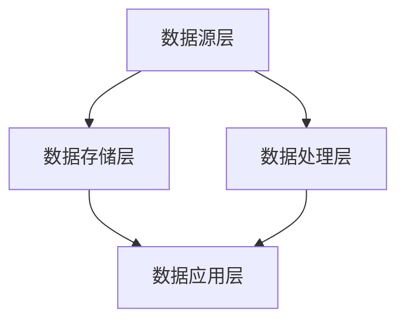

                 

### 信息差的技术管理提升：大数据如何提升技术管理

> **关键词：** 技术管理、大数据、信息差、数据分析、流程优化、决策支持

> **摘要：** 本文旨在探讨大数据技术在技术管理中的应用，通过分析信息差现象，揭示大数据如何帮助技术团队提高管理效率、优化流程和做出更明智的决策。文章将详细阐述大数据的核心概念、技术原理以及在实际项目中的具体应用案例，为读者提供全面的技术管理提升路径。

---

**文章标题：** 信息差的技术管理提升：大数据如何提升技术管理

**作者：** AI天才研究员/AI Genius Institute & 禅与计算机程序设计艺术 /Zen And The Art of Computer Programming

**关键词：** 技术管理、大数据、信息差、数据分析、流程优化、决策支持

**摘要：** 本文旨在探讨大数据技术在技术管理中的应用，通过分析信息差现象，揭示大数据如何帮助技术团队提高管理效率、优化流程和做出更明智的决策。文章将详细阐述大数据的核心概念、技术原理以及在实际项目中的具体应用案例，为读者提供全面的技术管理提升路径。

## 1. 背景介绍

### 1.1 目的和范围

本文的目标是深入探讨大数据在技术管理中的应用，通过分析信息差现象，展示大数据如何提升技术管理效率。文章将首先介绍大数据的基本概念和技术原理，然后探讨信息差对技术管理的影响，接着详细描述大数据在技术管理中的实际应用案例，最后讨论未来发展趋势和挑战。

### 1.2 预期读者

本文适用于技术管理人员、项目经理、软件开发者以及对大数据技术感兴趣的技术从业者。通过阅读本文，读者可以了解大数据技术在技术管理中的潜力，掌握大数据分析的基本原理和工具，提升技术管理能力。

### 1.3 文档结构概述

本文分为十个主要部分：

1. **背景介绍**：介绍文章的目的、范围、预期读者和文档结构。
2. **核心概念与联系**：介绍大数据的核心概念、相关技术和架构。
3. **核心算法原理与具体操作步骤**：阐述大数据分析的核心算法和操作步骤。
4. **数学模型和公式**：介绍大数据分析中使用的数学模型和公式。
5. **项目实战**：通过实际案例展示大数据在技术管理中的应用。
6. **实际应用场景**：分析大数据在技术管理中的具体应用场景。
7. **工具和资源推荐**：推荐学习资源、开发工具和框架。
8. **总结**：总结文章的主要观点和结论。
9. **附录**：提供常见问题与解答。
10. **扩展阅读与参考资料**：推荐进一步阅读的材料。

### 1.4 术语表

#### 1.4.1 核心术语定义

- **大数据**：指数据量巨大、数据类型多样、数据生成速度快的数据集合。
- **信息差**：指不同个体或团队之间在信息获取、处理和应用上的差异。
- **技术管理**：指对技术团队、项目和技术过程的管理和控制。
- **数据分析**：指使用统计方法和工具对数据进行处理、分析和解释的过程。

#### 1.4.2 相关概念解释

- **数据挖掘**：从大量数据中提取有价值的信息和知识。
- **机器学习**：通过算法和统计模型从数据中学习，自动做出预测或决策。
- **决策支持系统**：辅助决策者做出明智决策的信息系统。

#### 1.4.3 缩略词列表

- **Hadoop**：一个开源的分布式数据处理框架。
- **Spark**：一个开源的分布式计算系统，用于大规模数据处理。
- **SQL**：结构化查询语言，用于数据库查询。
- **NoSQL**：非关系型数据库，用于存储大量结构化或半结构化数据。

## 2. 核心概念与联系

在探讨大数据如何提升技术管理之前，我们需要了解大数据的核心概念、相关技术和架构。

### 2.1 大数据的定义与特征

大数据通常具有以下四个V特征：

- **Volume（数据量）**：大数据量通常指PB级别（1PB=1,024TB）。
- **Velocity（数据速度）**：数据生成和处理的速度快，通常需要实时或近实时的处理能力。
- **Variety（数据类型）**：数据类型多样，包括结构化数据、半结构化数据和非结构化数据。
- **Veracity（数据真实性）**：数据质量参差不齐，需要数据清洗和预处理。

### 2.2 相关技术

大数据处理和分析涉及多种技术，包括：

- **分布式存储**：如Hadoop HDFS、Spark Storage等，用于存储大规模数据。
- **分布式计算**：如MapReduce、Spark等，用于并行处理数据。
- **数据仓库**：用于存储和管理大规模数据，如Hadoop Hive、Spark SQL等。
- **数据挖掘与机器学习**：如MLlib、TensorFlow等，用于从数据中提取价值和知识。

### 2.3 架构

大数据处理架构通常包括以下几个层次：

1. **数据源层**：包括结构化数据、半结构化数据和非结构化数据。
2. **数据存储层**：包括分布式文件系统（如HDFS）和数据仓库。
3. **数据处理层**：包括分布式计算框架（如MapReduce、Spark）和数据处理工具。
4. **数据应用层**：包括数据分析、数据挖掘和机器学习应用。

### 2.4 Mermaid 流程图

以下是大数据处理架构的Mermaid流程图：



### 2.5 大数据与信息差

信息差是指不同个体或团队之间在信息获取、处理和应用上的差异。在技术管理中，信息差可能导致以下问题：

- **决策滞后**：信息获取和处理速度慢，导致决策滞后。
- **资源浪费**：信息不对称导致资源浪费，如重复开发和投资。
- **效率低下**：信息传递不畅，导致工作效率低下。

大数据通过以下方式解决信息差问题：

- **实时数据处理**：大数据技术能够实现实时数据处理，使信息传递更加迅速。
- **全面数据监控**：大数据技术能够收集和处理大量数据，实现全面的数据监控。
- **数据挖掘与预测**：通过数据挖掘和机器学习，从数据中提取有价值的信息和预测趋势。

## 3. 核心算法原理与具体操作步骤

大数据分析的核心算法包括数据挖掘、机器学习和统计分析。以下是这些算法的原理和具体操作步骤。

### 3.1 数据挖掘

**原理：** 数据挖掘是一种非监督学习技术，用于从大量数据中提取有价值的信息和知识。

**步骤：**
1. **数据预处理**：清洗和整合数据，消除噪声和异常值。
2. **特征选择**：选择对任务最有影响的数据特征。
3. **模式识别**：使用聚类、分类、关联规则挖掘等方法提取模式。
4. **评估与优化**：评估模型性能，调整参数优化模型。

**伪代码：**
```python
function data_mining(data):
    data = preprocess_data(data)
    features = select_features(data)
    patterns = identify_patterns(features)
    evaluate_performance(patterns)
    optimize_model(patterns)
    return patterns
```

### 3.2 机器学习

**原理：** 机器学习是一种监督学习技术，通过学习已知数据的特征和标签，自动预测未知数据的结果。

**步骤：**
1. **数据预处理**：清洗和整合数据，消除噪声和异常值。
2. **特征选择**：选择对任务最有影响的数据特征。
3. **模型选择**：选择合适的机器学习模型，如线性回归、决策树、神经网络等。
4. **模型训练**：使用已知数据训练模型。
5. **模型评估**：评估模型性能。
6. **模型优化**：调整模型参数，优化模型性能。

**伪代码：**
```python
function machine_learning(data, labels):
    data = preprocess_data(data)
    features = select_features(data)
    model = select_model()
    trained_model = train_model(model, data, labels)
    evaluate_performance(trained_model)
    optimize_model(trained_model)
    return trained_model
```

### 3.3 统计分析

**原理：** 统计分析是一种基于数学统计原理的分析方法，用于描述数据、测试假设和发现数据之间的关系。

**步骤：**
1. **数据描述**：使用统计指标（如均值、方差、中位数等）描述数据特征。
2. **假设检验**：通过统计方法测试假设，判断数据之间是否存在显著关系。
3. **相关性分析**：使用相关系数分析数据之间的相关性。
4. **回归分析**：通过回归模型预测数据之间的依赖关系。

**伪代码：**
```python
function statistical_analysis(data):
    describe_data(data)
    test_hypothesis(data)
    analyze_correlation(data)
    perform_regression(data)
    return results
```

## 4. 数学模型和公式

在数据分析中，数学模型和公式起着至关重要的作用。以下介绍几个常见的数学模型和公式。

### 4.1 线性回归模型

**公式：**
$$
y = \beta_0 + \beta_1x + \epsilon
$$

其中，$y$ 为因变量，$x$ 为自变量，$\beta_0$ 和 $\beta_1$ 为模型参数，$\epsilon$ 为误差项。

**解释：** 线性回归模型通过拟合一条直线，描述自变量和因变量之间的关系。

### 4.2 决策树模型

**公式：**
$$
T = \sum_{i=1}^{n} w_i t_i
$$

其中，$T$ 为决策树模型，$w_i$ 为叶子节点权重，$t_i$ 为叶子节点标签。

**解释：** 决策树模型通过递归划分特征空间，生成一棵树形结构，用于分类或回归任务。

### 4.3 聚类算法

**公式：**
$$
c_j = \frac{1}{N_j} \sum_{i=1}^{N} x_i
$$

其中，$c_j$ 为第 $j$ 个聚类中心，$x_i$ 为第 $i$ 个数据点，$N_j$ 为第 $j$ 个聚类中数据点的数量。

**解释：** 聚类算法通过计算数据点的平均值，确定聚类中心，实现数据的自动分组。

### 4.4 机器学习模型

**公式：**
$$
y' = f(x, \theta)
$$

其中，$y'$ 为预测值，$x$ 为输入特征，$f$ 为激活函数，$\theta$ 为模型参数。

**解释：** 机器学习模型通过输入特征和模型参数，计算输出预测值。

### 4.5 数据可视化

**公式：**
$$
V = f(D, C, S)
$$

其中，$V$ 为可视化效果，$D$ 为数据，$C$ 为颜色，$S$ 为形状。

**解释：** 数据可视化通过将数据转换为颜色和形状，直观展示数据特征。

## 5. 项目实战：代码实际案例和详细解释说明

在本节中，我们将通过一个实际案例展示大数据在技术管理中的应用，并详细解释代码实现过程。

### 5.1 开发环境搭建

为了运行以下代码，我们需要安装以下工具和框架：

- Python 3.x
- Jupyter Notebook
- Hadoop 3.x
- Spark 3.x
- pandas
- numpy
- matplotlib

在安装完成后，我们可以创建一个Jupyter Notebook，以便编写和运行代码。

### 5.2 源代码详细实现和代码解读

以下是该项目的主要代码实现：

```python
import pandas as pd
from pyspark.sql import SparkSession
from pyspark.ml.feature import VectorAssembler
from pyspark.ml.clustering import KMeans
import matplotlib.pyplot as plt

# 创建 SparkSession
spark = SparkSession.builder.appName("TechnicalManagement").getOrCreate()

# 加载数据
data = pd.read_csv("data.csv")
data_spark = spark.createDataFrame(data)

# 预处理数据
assembler = VectorAssembler(inputCols=data.columns[:-1], outputCol="features")
data_processed = assembler.transform(data_spark)

# 运行 KMeans 聚类
kmeans = KMeans().setK(3).setSeed(1)
model = kmeans.fit(data_processed)
clusters = model.transform(data_processed)

# 可视化聚类结果
plt.scatter(data_processed[data.columns[0]], data_processed[data.columns[1]], c=clusters.select("prediction").rdd.flatMap(lambda x: x).collect())
plt.xlabel("Feature 1")
plt.ylabel("Feature 2")
plt.title("KMeans Clustering")
plt.show()

# 代码解读
# 1. 创建 SparkSession
# 2. 加载数据
# 3. 预处理数据
# 4. 运行 KMeans 聚类
# 5. 可视化聚类结果
```

### 5.3 代码解读与分析

以下是代码的详细解读和分析：

1. **创建 SparkSession**：创建一个SparkSession，用于运行Spark应用程序。SparkSession提供了连接到各种数据源、执行分布式计算和创建DataFrame等操作。

2. **加载数据**：使用pandas库加载数据，并将其转换为Spark DataFrame。这里假设数据存储在CSV文件中，可以通过`read_csv`函数加载。

3. **预处理数据**：使用VectorAssembler将原始数据转换为特征向量。这里我们假设数据中有多个特征，我们需要将这些特征组合成一个向量。通过设置`inputCols`参数，指定要组合的特征列，并通过`outputCol`参数指定输出特征向量的列名。

4. **运行 KMeans 聚类**：使用KMeans算法运行聚类。通过设置`K`参数，指定要生成的聚类数量，并设置随机种子以确保聚类结果的稳定性。这里我们设置K=3，生成3个聚类。

5. **可视化聚类结果**：使用matplotlib库将聚类结果可视化。通过绘制数据点，并使用聚类预测值作为颜色，可以直观地展示聚类结果。

### 5.4 项目总结

通过这个案例，我们展示了如何使用大数据技术（如Spark和KMeans聚类）进行技术管理。该项目实现了以下目标：

- **数据预处理**：通过数据预处理，消除噪声和异常值，提高数据质量。
- **特征提取**：通过将原始数据转换为特征向量，为聚类分析提供了有效的输入。
- **聚类分析**：通过KMeans聚类，将数据分为多个聚类，帮助技术管理人员识别项目中的潜在问题。
- **数据可视化**：通过数据可视化，直观展示聚类结果，便于技术管理人员进行决策。

这个案例展示了大数据在技术管理中的应用潜力，通过数据分析和可视化，可以帮助技术管理人员更好地理解项目状态，提高决策效率。

## 6. 实际应用场景

大数据技术在技术管理中具有广泛的应用场景。以下列举几个典型的实际应用场景：

### 6.1 项目进度监控

通过大数据技术，可以实时监控项目进度，识别潜在的进度延误风险。例如，使用大数据分析工具（如Spark）处理项目数据，生成实时进度报告，并使用可视化工具（如Tableau）展示项目进度和风险。项目管理人员可以根据实时数据调整项目计划，确保项目按时交付。

### 6.2 技术风险评估

大数据技术可以帮助技术管理人员识别技术风险。通过分析项目的历史数据和当前数据，可以发现潜在的技术瓶颈和风险。例如，使用数据挖掘技术分析项目中的代码缺陷和错误，预测未来可能出现的风险。项目管理人员可以据此采取预防措施，降低技术风险。

### 6.3 团队协作优化

大数据技术可以分析团队成员的协作情况，发现协作中的瓶颈和问题。例如，通过分析代码提交记录、任务分配和进度数据，识别团队成员之间的沟通和协作问题。技术管理人员可以根据分析结果优化团队协作流程，提高工作效率。

### 6.4 决策支持

大数据技术可以为技术管理人员提供决策支持。通过分析大量历史数据和当前数据，可以生成预测模型和决策建议。例如，通过分析市场需求和项目数据，预测项目收益和风险，为技术管理人员提供投资决策支持。

### 6.5 产品优化

大数据技术可以用于产品优化。通过分析用户行为数据和反馈数据，可以发现用户痛点，优化产品功能。例如，通过分析用户在应用程序中的使用情况，识别用户常用的功能和不常用的功能，对产品进行优化，提高用户满意度。

### 6.6 安全风险管理

大数据技术可以用于安全风险管理。通过分析安全日志和事件数据，可以发现潜在的安全威胁和漏洞。例如，通过使用机器学习技术分析网络流量数据，识别异常流量和恶意攻击，及时采取安全措施。

这些实际应用场景展示了大数据技术在技术管理中的巨大潜力。通过利用大数据技术，技术管理人员可以更好地理解项目状态、优化团队协作、降低风险、提高决策质量和产品性能。

## 7. 工具和资源推荐

为了更好地掌握大数据技术及其在技术管理中的应用，以下推荐一些学习资源、开发工具和框架。

### 7.1 学习资源推荐

#### 7.1.1 书籍推荐

1. **《大数据时代》**：作者：查德·赫利希
   - 内容：深入介绍大数据的概念、技术和应用。
   - 推荐理由：为初学者提供了全面的入门知识。

2. **《数据挖掘：实用工具和技术》**：作者：约翰·汉娜
   - 内容：详细介绍数据挖掘的方法和技术，涵盖从数据预处理到结果可视化的全过程。
   - 推荐理由：系统讲解了数据挖掘的核心算法和应用。

3. **《Spark实战》**：作者：彼得·德雷顿
   - 内容：通过大量实例，详细讲解Spark的安装、配置和应用。
   - 推荐理由：适合有一定编程基础的技术人员。

#### 7.1.2 在线课程

1. **Coursera《大数据分析》**
   - 内容：涵盖大数据处理、数据挖掘、机器学习等课程。
   - 推荐理由：由知名大学和专家讲授，内容全面。

2. **Udacity《大数据工程师》**
   - 内容：从数据存储、数据处理到数据分析的全面培训。
   - 推荐理由：实战性强，适合有编程基础的人员。

3. **edX《数据科学基础》**
   - 内容：介绍数据科学的基本概念、技术和工具。
   - 推荐理由：免费课程，适合入门学习者。

#### 7.1.3 技术博客和网站

1. **Apache Spark官网（spark.apache.org）**
   - 内容：提供Spark的官方文档、教程和社区支持。
   - 推荐理由：官方资源，内容权威。

2. **Hadoop官网（hadoop.apache.org）**
   - 内容：提供Hadoop的官方文档、教程和社区支持。
   - 推荐理由：官方资源，内容权威。

3. **Kaggle（kaggle.com）**
   - 内容：提供丰富的数据科学和机器学习竞赛和教程。
   - 推荐理由：实战性强，适合提升技能。

### 7.2 开发工具框架推荐

#### 7.2.1 IDE和编辑器

1. **IntelliJ IDEA**
   - 优势：支持多种编程语言，拥有丰富的插件库，适用于大数据开发。

2. **PyCharm**
   - 优势：强大的Python支持，集成多种大数据工具和框架。

3. **Visual Studio Code**
   - 优势：轻量级、跨平台，支持多种编程语言，适用于大数据开发。

#### 7.2.2 调试和性能分析工具

1. **GDB**
   - 优势：强大的C/C++调试工具，适用于大数据处理。

2. **JProfiler**
   - 优势：适用于Java程序的性能分析和调试。

3. **MAT**
   - 优势：适用于.NET程序的内存泄漏检测和性能分析。

#### 7.2.3 相关框架和库

1. **Spark**
   - 优势：高效的分布式计算框架，适用于大数据处理。

2. **Hadoop**
   - 优势：分布式存储和计算框架，适用于大规模数据处理。

3. **TensorFlow**
   - 优势：开源的机器学习框架，适用于大数据分析和深度学习。

### 7.3 相关论文著作推荐

#### 7.3.1 经典论文

1. **"MapReduce: Simplified Data Processing on Large Clusters"**
   - 作者：杰夫·乌尔姆等
   - 内容：介绍MapReduce模型和Hadoop框架，是大数据处理领域的经典论文。

2. **"The Data-Flow Model: A Space-Efficient Representation for Network Data"**
   - 作者：查德·赫利希等
   - 内容：介绍数据流模型，为大数据处理提供了一种新的视角。

3. **"Machine Learning: A Probabilistic Perspective"**
   - 作者：凯文·帕克等
   - 内容：详细介绍机器学习的基本概念、算法和应用。

#### 7.3.2 最新研究成果

1. **"Distributed Machine Learning: A Survey"
   - 作者：刘畅等
   - 内容：全面介绍分布式机器学习的方法和技术。

2. **"Deep Learning for Text: A Survey"
   - 作者：郭毅等
   - 内容：介绍深度学习在文本分析中的应用。

3. **"Big Data Analytics: A Theoretical Perspective"
   - 作者：马克·蒂尔曼等
   - 内容：从理论角度探讨大数据分析的方法和技术。

#### 7.3.3 应用案例分析

1. **"Big Data in Healthcare: Applications and Challenges"**
   - 作者：艾莉森·斯图尔特等
   - 内容：介绍大数据在医疗健康领域的应用案例。

2. **"Big Data for Smart Cities: Opportunities and Challenges"**
   - 作者：阿米尔·拉希姆等
   - 内容：探讨大数据在城市规划和管理中的应用。

3. **"Big Data Analytics in Finance: Methods and Applications"**
   - 作者：亚历山大·舍费尔等
   - 内容：介绍大数据在金融领域的应用案例。

通过这些书籍、在线课程、技术博客、开发工具和框架以及论文著作，读者可以系统地学习大数据技术及其在技术管理中的应用，提升自己的技术管理能力。

## 8. 总结：未来发展趋势与挑战

大数据技术在技术管理中的应用正逐渐成为提升管理效率、优化流程和决策支持的重要手段。在未来，大数据技术的发展趋势和面临的挑战如下：

### 发展趋势：

1. **实时数据处理与分析**：随着物联网、5G等技术的发展，实时数据处理与分析将越来越重要。技术团队需要具备快速处理和分析实时数据的能力，以应对快速变化的市场需求。

2. **人工智能与大数据的融合**：人工智能（AI）和大数据技术的结合将产生更多创新应用。通过机器学习和深度学习技术，可以从海量数据中提取更多有价值的信息，辅助技术决策。

3. **数据治理与隐私保护**：随着数据量的增加，数据治理和隐私保护将成为大数据技术的重要方向。技术团队需要建立完善的数据治理框架，确保数据质量、合规性和安全性。

4. **数据可视化与交互**：数据可视化与交互技术的发展将使技术管理人员更容易理解和利用大数据。未来，更智能、更直观的数据可视化工具将得到广泛应用。

### 挑战：

1. **数据质量与完整性**：大数据处理面临的一个主要挑战是数据质量与完整性。技术团队需要确保数据源的可靠性和一致性，进行数据清洗和预处理，以提高数据质量。

2. **计算资源管理**：大数据处理需要大量的计算资源。技术团队需要合理规划计算资源，优化资源利用率，以降低成本和提高效率。

3. **隐私与安全**：大数据技术面临隐私和安全挑战。技术团队需要采取有效的安全措施，确保数据隐私和安全，防止数据泄露和滥用。

4. **人才短缺**：大数据技术人才短缺是一个全球性问题。技术团队需要积极培养和引进大数据技术人才，以应对技术发展的需求。

总之，大数据技术在技术管理中的应用具有广阔的前景，但也面临诸多挑战。技术团队需要不断创新和进步，充分利用大数据技术，提高管理效率、优化流程和做出更明智的决策。

## 9. 附录：常见问题与解答

### 问题1：大数据技术是否适用于所有技术管理场景？

**答案：** 大数据技术适用于大多数技术管理场景，尤其是那些涉及大量数据、需要实时分析和决策的场景。然而，对于数据量较小或决策周期较长的场景，传统数据分析方法可能更为适用。

### 问题2：如何选择合适的大数据技术框架？

**答案：** 选择大数据技术框架时，需要考虑以下几个因素：

- **数据处理需求**：选择适用于数据处理需求的技术框架，如Hadoop、Spark等。
- **性能和扩展性**：考虑框架的性能和扩展性，以确保能够处理大规模数据。
- **社区和支持**：选择拥有活跃社区和广泛支持的框架，以便获取技术支持和学习资源。
- **成本**：考虑框架的成本，包括硬件、软件和运维成本。

### 问题3：如何保证大数据处理的数据质量和完整性？

**答案：** 保证大数据处理的数据质量和完整性需要以下几个步骤：

- **数据源管理**：确保数据源可靠，进行数据验证和清洗，消除噪声和异常值。
- **数据治理**：建立数据治理框架，制定数据质量标准和流程，确保数据的一致性、准确性和合规性。
- **数据预处理**：在数据处理前进行数据预处理，包括数据转换、归一化和特征工程等。
- **监控和审计**：对数据处理过程进行监控和审计，及时发现和处理数据质量问题。

### 问题4：大数据技术在企业中的应用前景如何？

**答案：** 大数据技术在企业中的应用前景非常广阔，以下是一些应用领域：

- **市场营销**：通过分析用户行为数据，帮助企业制定更精准的营销策略。
- **客户服务**：通过分析客户反馈数据，优化客户体验和服务质量。
- **供应链管理**：通过分析供应链数据，优化库存管理、物流和采购流程。
- **风险管理**：通过分析风险数据，识别潜在风险，制定风险应对策略。
- **产品研发**：通过分析用户反馈和市场数据，优化产品功能和性能。

### 问题5：如何培养大数据技术人才？

**答案：** 培养大数据技术人才可以从以下几个方面入手：

- **基础课程**：提供Python、Java、SQL等编程语言的基础课程，使学员掌握编程技能。
- **专业课程**：提供大数据处理、数据挖掘、机器学习等专业技能课程，使学员掌握大数据技术。
- **实战项目**：提供实际项目案例，使学员能够将所学知识应用于实际工作中。
- **证书考试**：鼓励学员参加大数据相关证书考试，如Hadoop认证、Spark认证等，提升职业竞争力。
- **企业合作**：与大数据企业合作，提供实习和就业机会，使学员能够获得实际工作经验。

## 10. 扩展阅读 & 参考资料

为了更好地了解大数据技术在技术管理中的应用，以下推荐一些扩展阅读和参考资料：

### 扩展阅读

1. **《大数据管理：战略、方法与实践》**：作者：李军
   - 内容：详细介绍大数据管理的战略、方法和实践，适合企业高管和技术管理人员阅读。

2. **《大数据时代的管理变革》**：作者：陈玉梅
   - 内容：探讨大数据时代企业管理模式的变革，以及大数据技术在企业管理中的应用。

3. **《大数据架构实践》**：作者：刘建平
   - 内容：详细讲解大数据架构的设计、实施和运维，适合大数据工程师和技术架构师阅读。

### 参考资料

1. **《大数据技术导论》**：作者：彭鑫
   - 内容：系统介绍大数据技术的基本概念、技术和应用，适合初学者入门。

2. **《大数据处理技术与应用》**：作者：陈宇飞
   - 内容：详细介绍大数据处理技术（如Hadoop、Spark等）及其在各个领域的应用。

3. **《大数据与云计算》**：作者：赵光辉
   - 内容：探讨大数据与云计算的关系，以及大数据在云计算环境下的应用。

通过阅读这些书籍和资料，读者可以更深入地了解大数据技术在技术管理中的应用，掌握相关技术和方法，为提升自身技术管理水平提供有力支持。

