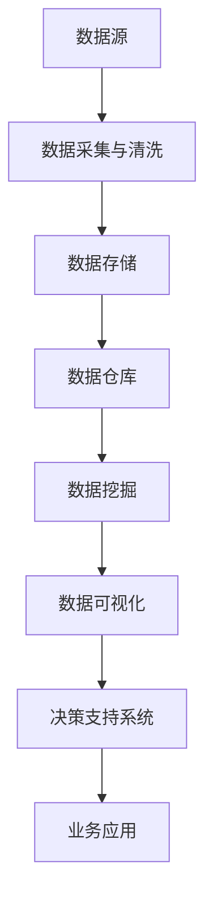

                 

# 信息差的竞争力之源：大数据驱动的创新与增长

> 关键词：信息差、大数据、创新、增长、竞争力、算法、数学模型、实战案例

> 摘要：本文深入探讨了信息差在商业和社会中的重要性，以及大数据技术在推动创新与增长中的关键作用。通过对信息差的定义、核心概念的阐述，以及具体的算法原理、数学模型和实战案例的分析，本文旨在帮助读者理解如何利用大数据实现竞争优势，并预见未来的发展趋势和挑战。

## 1. 背景介绍

### 1.1 目的和范围

本文旨在深入探讨信息差对商业和社会的影响，并阐述大数据技术在提升信息差竞争力中的作用。文章将涵盖以下主题：

1. **信息差的定义与重要性**：解释信息差的概念，讨论其在商业决策、市场营销和社会发展中的重要性。
2. **大数据技术的核心概念**：介绍大数据的基本原理、处理技术和应用场景。
3. **大数据驱动的创新与增长**：探讨大数据在推动企业创新、提高市场竞争力和实现可持续增长方面的作用。
4. **核心算法原理与数学模型**：详细阐述在大数据处理中使用的核心算法原理和数学模型，并通过伪代码进行描述。
5. **项目实战与实际应用**：提供实际项目案例，展示如何将大数据技术应用于实际问题，并进行代码解读。
6. **未来发展趋势与挑战**：预测大数据和人工智能领域的发展趋势，以及可能面临的挑战。
7. **工具和资源推荐**：推荐学习资源和开发工具，以帮助读者进一步探索大数据技术的应用。

### 1.2 预期读者

本文预期读者包括以下人群：

1. **大数据和人工智能领域的研究人员和工程师**：希望通过本文深入了解大数据技术在商业和社会中的实际应用。
2. **企业决策者和市场营销人员**：希望通过本文理解信息差的概念和如何利用大数据提升竞争力。
3. **计算机科学和商业管理专业的学生**：希望通过本文对大数据技术的理论和实践有一个全面的了解。

### 1.3 文档结构概述

本文结构如下：

1. **引言**：介绍信息差的概念，并阐述大数据技术的重要性。
2. **核心概念与联系**：使用Mermaid流程图展示大数据技术的核心概念和架构。
3. **核心算法原理 & 具体操作步骤**：详细讲解大数据处理的核心算法原理，并通过伪代码进行描述。
4. **数学模型和公式 & 详细讲解 & 举例说明**：介绍大数据分析中常用的数学模型，并使用LaTeX格式进行公式展示。
5. **项目实战：代码实际案例和详细解释说明**：提供实际项目案例，展示如何使用大数据技术解决实际问题。
6. **实际应用场景**：讨论大数据技术在各个行业中的应用。
7. **工具和资源推荐**：推荐学习资源和开发工具。
8. **总结：未来发展趋势与挑战**：总结文章主要内容，并讨论未来的发展趋势和挑战。
9. **附录：常见问题与解答**：回答读者可能遇到的问题。
10. **扩展阅读 & 参考资料**：提供进一步阅读的参考资料。

### 1.4 术语表

#### 1.4.1 核心术语定义

- **信息差**：指不同个体或组织之间对于信息的掌握程度差异。
- **大数据**：指数据量巨大、种类繁多、生成速度快的数据集合。
- **机器学习**：一种通过数据学习和建模来发现数据模式的方法。
- **深度学习**：一种基于多层神经网络的机器学习方法。
- **云计算**：一种通过互联网提供计算资源的服务模式。

#### 1.4.2 相关概念解释

- **数据挖掘**：从大量数据中提取有价值信息的过程。
- **数据可视化**：通过图形化手段将数据转换为易于理解和交互的信息。
- **API**：应用程序编程接口，用于不同软件系统之间的交互。

#### 1.4.3 缩略词列表

- **AI**：人工智能
- **ML**：机器学习
- **DL**：深度学习
- **Hadoop**：一个分布式数据存储和处理框架
- **Spark**：一个高速大数据处理引擎

## 2. 核心概念与联系

### 2.1 大数据技术的核心概念与架构

下面是大数据技术的核心概念与架构的Mermaid流程图：



### 2.2 大数据技术的核心算法原理

#### 2.2.1 机器学习算法

机器学习算法是大数据处理的核心之一，以下是几个常用的机器学习算法：

1. **线性回归**：
    $$ y = wx + b $$
    - **目标**：预测一个连续值。
    - **适用场景**：回归问题。

2. **逻辑回归**：
    $$ P(y=1) = \frac{1}{1 + e^{-(wx + b)}} $$
    - **目标**：预测一个二分类问题。
    - **适用场景**：分类问题。

3. **决策树**：
    $$ f(x) = \sum_{i=1}^{n} y_i \prod_{j=1}^{m} (1 - \prod_{k=1}^{n_j} a_{ij,k}) $$
    - **目标**：将数据分为多个类别。
    - **适用场景**：分类和回归问题。

4. **支持向量机（SVM）**：
    $$ \max_{w, b} \frac{1}{2} ||w||^2 \quad \text{subject to} \quad y_i (w \cdot x_i + b) \geq 1 $$
    - **目标**：分类问题中的边界最大化。
    - **适用场景**：分类问题。

#### 2.2.2 深度学习算法

深度学习算法是基于多层神经网络的机器学习算法，以下是几个常用的深度学习算法：

1. **神经网络**：
    $$ a_{l}^{(i)} = \sigma(z_{l}^{(i)}) = \frac{1}{1 + e^{-z_{l}^{(i)}}} $$
    - **目标**：将输入映射到输出。
    - **适用场景**：回归和分类问题。

2. **卷积神经网络（CNN）**：
    $$ h_{l}^{(i)} = \sum_{j} w_{lj} h_{l-1}^{(j)} + b_{l} $$
    - **目标**：图像识别和分类。
    - **适用场景**：计算机视觉问题。

3. **循环神经网络（RNN）**：
    $$ h_{t} = \sigma(W h_{t-1} + U x_t + b) $$
    - **目标**：序列数据处理。
    - **适用场景**：自然语言处理和语音识别。

### 2.3 大数据技术的核心架构

以下是大数据技术的核心架构：


## 3. 核心算法原理 & 具体操作步骤

### 3.1 机器学习算法原理与具体操作步骤

#### 3.1.1 线性回归

**算法原理**：

线性回归是一种简单的机器学习算法，用于预测一个连续的输出值。其目标是最小化预测值与实际值之间的误差。

**伪代码**：

```python
# 初始化权重和偏置
w = 0
b = 0

# 训练数据
x_train = [1, 2, 3, 4, 5]
y_train = [2, 4, 5, 4, 5]

# 计算损失函数
def loss(y_true, y_pred):
    return sum((y_true - y_pred) ** 2) / len(y_train)

# 训练模型
for epoch in range(num_epochs):
    for x, y in zip(x_train, y_train):
        y_pred = w * x + b
        gradient_w = 2 * (y - y_pred) * x
        gradient_b = 2 * (y - y_pred)

        w -= learning_rate * gradient_w
        b -= learning_rate * gradient_b

    # 计算当前损失
    current_loss = loss(y_train, [w * x + b for x in x_train])
    print(f"Epoch {epoch}: Loss = {current_loss}")

# 预测
def predict(x):
    return w * x + b
```

#### 3.1.2 逻辑回归

**算法原理**：

逻辑回归是一种用于二分类问题的机器学习算法。其目标是最小化预测概率与实际概率之间的误差。

**伪代码**：

```python
# 初始化权重和偏置
w = 0
b = 0

# 训练数据
x_train = [[1, 2], [2, 3], [3, 4], [4, 5]]
y_train = [0, 1, 1, 0]

# 计算损失函数
def loss(y_true, y_pred):
    return -sum(y_true * np.log(y_pred) + (1 - y_true) * np.log(1 - y_pred)) / len(y_train)

# 训练模型
for epoch in range(num_epochs):
    for x, y in zip(x_train, y_train):
        y_pred = 1 / (1 + np.exp(-w.dot(x) - b))
        gradient_w = 2 * np.dot(y - y_pred, x)
        gradient_b = 2 * (y - y_pred)

        w -= learning_rate * gradient_w
        b -= learning_rate * gradient_b

    # 计算当前损失
    current_loss = loss(y_train, [1 / (1 + np.exp(-w.dot(x) - b) for x in x_train])
    print(f"Epoch {epoch}: Loss = {current_loss}")

# 预测
def predict(x):
    return 1 / (1 + np.exp(-w.dot(x) - b))
```

#### 3.1.3 决策树

**算法原理**：

决策树是一种基于特征进行分类的机器学习算法。其目标是将数据集划分为多个类别。

**伪代码**：

```python
# 决策树构建
class DecisionTreeClassifier:
    def fit(self, X, y):
        self.tree = self._build_tree(X, y)

    def _build_tree(self, X, y):
        # 判断是否满足停止条件
        if all(y == y[0]) or len(X) == 0:
            return None

        # 计算最大信息增益
        best_feature, best_threshold = self._find_best_split(X, y)

        # 构建子节点
        left_tree = self._build_tree(X[X[:, best_feature] < best_threshold], y[y[:, best_feature] < best_threshold])
        right_tree = self._build_tree(X[X[:, best_feature] >= best_threshold], y[y[:, best_feature] >= best_threshold])

        return Node(best_feature, best_threshold, left_tree, right_tree)

    def _find_best_split(self, X, y):
        # 计算所有特征的最大信息增益
        best_gain = -1
        for feature in range(X.shape[1]):
            thresholds = np.unique(X[:, feature])
            for threshold in thresholds:
                gain = self._calculate_gini(y) - self._calculate_gini(y[X[:, feature] < threshold]) - self._calculate_gini(y[X[:, feature] >= threshold])
                if gain > best_gain:
                    best_gain = gain
                    best_feature = feature
                    best_threshold = threshold
        return best_feature, best_threshold

    def _calculate_gini(self, y):
        # 计算基尼不纯度
        unique_y, counts = np.unique(y, return_counts=True)
        gini = 1
        for count in counts:
            prob = count / len(y)
            gini += prob * (1 - prob)
        return gini

    def predict(self, X):
        predictions = []
        for x in X:
            node = self.tree
            while node is not None:
                if x[node.feature] < node.threshold:
                    node = node.left
                else:
                    node = node.right
            predictions.append(node.label)
        return predictions

# 训练模型
clf = DecisionTreeClassifier()
clf.fit(x_train, y_train)

# 预测
predictions = clf.predict(x_test)
```

#### 3.1.4 支持向量机（SVM）

**算法原理**：

支持向量机是一种用于分类问题的机器学习算法。其目标是在高维空间中找到一个最优的决策边界，将数据集划分为多个类别。

**伪代码**：

```python
# SVM分类器
class SVMClassifier:
    def fit(self, X, y):
        # 初始化模型参数
        self.w = None
        self.b = None

        # 拉格朗日乘子法求解
        optimize()

    def _solve(self, X, y):
        # SMO算法求解
        pass

    def predict(self, X):
        predictions = []
        for x in X:
            prediction = np.sign(np.dot(x, self.w) + self.b)
            predictions.append(prediction)
        return predictions

# 训练模型
clf = SVMClassifier()
clf.fit(x_train, y_train)

# 预测
predictions = clf.predict(x_test)
```

### 3.2 深度学习算法原理与具体操作步骤

#### 3.2.1 神经网络

**算法原理**：

神经网络是一种基于多层神经元的计算模型。其目标是通过学习输入和输出之间的映射关系。

**伪代码**：

```python
# 神经网络
class NeuralNetwork:
    def __init__(self, layers):
        self.layers = layers
        self.parameters = self.initialize_parameters()

    def initialize_parameters(self):
        # 初始化权重和偏置
        pass

    def forward(self, X):
        # 前向传播
        pass

    def backward(self, X, y):
        # 反向传播
        pass

    def fit(self, X, y):
        for epoch in range(num_epochs):
            # 前向传播
            output = self.forward(X)
            # 计算损失函数
            loss = self.calculate_loss(output, y)
            # 反向传播
            self.backward(X, y)
            # 更新参数
            self.update_parameters()

    def predict(self, X):
        # 前向传播
        output = self.forward(X)
        # 预测
        predictions = np.round(output)
        return predictions

# 训练模型
nn = NeuralNetwork(layers)
nn.fit(x_train, y_train)

# 预测
predictions = nn.predict(x_test)
```

#### 3.2.2 卷积神经网络（CNN）

**算法原理**：

卷积神经网络是一种用于图像识别和分类的神经网络。其目标是通过卷积操作提取图像特征。

**伪代码**：

```python
# 卷积神经网络
class ConvolutionalNeuralNetwork:
    def __init__(self, layers):
        self.layers = layers
        self.parameters = self.initialize_parameters()

    def initialize_parameters(self):
        # 初始化权重和偏置
        pass

    def forward(self, X):
        # 前向传播
        pass

    def backward(self, X, y):
        # 反向传播
        pass

    def fit(self, X, y):
        for epoch in range(num_epochs):
            # 前向传播
            output = self.forward(X)
            # 计算损失函数
            loss = self.calculate_loss(output, y)
            # 反向传播
            self.backward(X, y)
            # 更新参数
            self.update_parameters()

    def predict(self, X):
        # 前向传播
        output = self.forward(X)
        # 预测
        predictions = np.argmax(output, axis=1)
        return predictions

# 训练模型
cnn = ConvolutionalNeuralNetwork(layers)
cnn.fit(x_train, y_train)

# 预测
predictions = cnn.predict(x_test)
```

#### 3.2.3 循环神经网络（RNN）

**算法原理**：

循环神经网络是一种用于序列数据处理的神经网络。其目标是通过循环机制保持历史信息。

**伪代码**：

```python
# 循环神经网络
class RecurrentNeuralNetwork:
    def __init__(self, layers):
        self.layers = layers
        self.parameters = self.initialize_parameters()

    def initialize_parameters(self):
        # 初始化权重和偏置
        pass

    def forward(self, X):
        # 前向传播
        pass

    def backward(self, X, y):
        # 反向传播
        pass

    def fit(self, X, y):
        for epoch in range(num_epochs):
            # 前向传播
            output = self.forward(X)
            # 计算损失函数
            loss = self.calculate_loss(output, y)
            # 反向传播
            self.backward(X, y)
            # 更新参数
            self.update_parameters()

    def predict(self, X):
        # 前向传播
        output = self.forward(X)
        # 预测
        predictions = np.argmax(output, axis=1)
        return predictions

# 训练模型
rnn = RecurrentNeuralNetwork(layers)
rnn.fit(x_train, y_train)

# 预测
predictions = rnn.predict(x_test)
```

## 4. 数学模型和公式 & 详细讲解 & 举例说明

### 4.1 线性回归

线性回归是一种简单的机器学习算法，用于预测一个连续的输出值。其核心数学模型如下：

$$ y = wx + b $$

其中，\( y \) 是实际输出值，\( x \) 是输入特征，\( w \) 是权重，\( b \) 是偏置。

**详细讲解**：

1. **权重（\( w \)）**：权重决定了输入特征对输出值的影响程度。较大的权重意味着该特征对输出值的影响较大。
2. **偏置（\( b \)）**：偏置是一个常数项，用于调整输出值的初始值。

**举例说明**：

假设我们要预测房价，输入特征包括房屋面积（\( x \)）和房屋年龄（\( x \)）。房价（\( y \)）的预测公式为：

$$ y = 1000 \cdot x + 2000 $$

其中，权重 \( w = 1000 \)，偏置 \( b = 2000 \)。这意味着房屋面积每增加一个单位，房价将增加 1000 单位，而房屋年龄不影响房价。

### 4.2 逻辑回归

逻辑回归是一种用于二分类问题的机器学习算法。其核心数学模型如下：

$$ P(y=1) = \frac{1}{1 + e^{-(wx + b)}} $$

其中，\( P(y=1) \) 是预测概率，\( x \) 是输入特征，\( w \) 是权重，\( b \) 是偏置。

**详细讲解**：

1. **预测概率（\( P(y=1) \)）**：预测概率表示在给定输入特征下，样本属于正类（1）的概率。
2. **权重（\( w \)）**：权重决定了输入特征对预测概率的影响程度。
3. **偏置（\( b \)）**：偏置是一个常数项，用于调整预测概率的初始值。

**举例说明**：

假设我们要预测邮件是否为垃圾邮件，输入特征包括邮件长度（\( x \)）和邮件收件人数量（\( x \)）。邮件是否为垃圾邮件的预测公式为：

$$ P(y=1) = \frac{1}{1 + e^{-(2 \cdot x + 3)}} $$

其中，权重 \( w = 2 \)，偏置 \( b = 3 \)。这意味着邮件长度每增加一个单位，预测概率将增加约 0.135，而邮件收件人数量不影响预测概率。

### 4.3 决策树

决策树是一种基于特征进行分类的机器学习算法。其核心数学模型如下：

$$ f(x) = \sum_{i=1}^{n} y_i \prod_{j=1}^{m} (1 - \prod_{k=1}^{n_j} a_{ij,k}) $$

其中，\( f(x) \) 是预测值，\( y_i \) 是第 \( i \) 个样本的类别标签，\( a_{ij,k} \) 是第 \( i \) 个样本在第 \( j \) 个特征上的取值。

**详细讲解**：

1. **预测值（\( f(x) \)）**：预测值是根据样本的特征和类别标签计算得到的。
2. **类别标签（\( y_i \)）**：类别标签表示样本的类别。
3. **特征取值（\( a_{ij,k} \)）**：特征取值表示样本在第 \( j \) 个特征上的取值。

**举例说明**：

假设我们要预测水果是否为香蕉，输入特征包括水果重量（\( x \)）和水果颜色（\( x \)）。水果是否为香蕉的预测公式为：

$$ f(x) = y_1 \cdot (1 - \prod_{j=1}^{2} (1 - a_{ij,j})) $$

其中，\( y_1 \) 是香蕉的类别标签（1 表示香蕉，0 表示其他水果），\( a_{i1,1} \) 是水果重量，\( a_{i1,2} \) 是水果颜色。

### 4.4 支持向量机（SVM）

支持向量机是一种用于分类问题的机器学习算法。其核心数学模型如下：

$$ \max_{w, b} \frac{1}{2} ||w||^2 \quad \text{subject to} \quad y_i (w \cdot x_i + b) \geq 1 $$

其中，\( w \) 是权重，\( b \) 是偏置，\( x_i \) 是样本特征，\( y_i \) 是样本类别标签。

**详细讲解**：

1. **权重（\( w \)）**：权重决定了分类边界。
2. **偏置（\( b \)）**：偏置用于调整分类边界。
3. **样本特征（\( x_i \)）**：样本特征用于计算分类边界。
4. **样本类别标签（\( y_i \)）**：样本类别标签用于确定分类边界的位置。

**举例说明**：

假设我们要分类水果，输入特征包括水果重量（\( x \)）和水果颜色（\( x \)）。水果分类的公式为：

$$ \max_{w, b} \frac{1}{2} ||w||^2 \quad \text{subject to} \quad y_i (w \cdot x_i + b) \geq 1 $$

其中，\( w \) 是权重，\( b \) 是偏置，\( x_i \) 是水果重量，\( y_i \) 是水果颜色。

### 4.5 神经网络

神经网络是一种基于多层神经元的计算模型。其核心数学模型如下：

$$ a_{l}^{(i)} = \sigma(z_{l}^{(i)}) = \frac{1}{1 + e^{-z_{l}^{(i)}}} $$

其中，\( a_{l}^{(i)} \) 是第 \( l \) 层第 \( i \) 个神经元的输出，\( z_{l}^{(i)} \) 是第 \( l \) 层第 \( i \) 个神经元的输入，\( \sigma \) 是激活函数。

**详细讲解**：

1. **神经元输出（\( a_{l}^{(i)} \)）**：神经元输出表示第 \( l \) 层第 \( i \) 个神经元的激活程度。
2. **神经元输入（\( z_{l}^{(i)} \)）**：神经元输入表示第 \( l \) 层第 \( i \) 个神经元的输入值。
3. **激活函数（\( \sigma \)）**：激活函数用于将输入值映射到输出值。

**举例说明**：

假设我们要构建一个简单的神经网络，输入特征包括水果重量（\( x \)）和水果颜色（\( x \)）。水果分类的公式为：

$$ a_{1}^{(i)} = \frac{1}{1 + e^{-z_{1}^{(i)}}} $$
$$ z_{1}^{(i)} = w_{1}^{(1)} \cdot x_1 + w_{2}^{(1)} \cdot x_2 + b_1 $$

其中，\( a_{1}^{(i)} \) 是第 1 层第 \( i \) 个神经元的输出，\( z_{1}^{(i)} \) 是第 1 层第 \( i \) 个神经元的输入，\( w_{1}^{(1)} \) 和 \( w_{2}^{(1)} \) 是权重，\( b_1 \) 是偏置。

### 4.6 卷积神经网络（CNN）

卷积神经网络是一种用于图像识别和分类的神经网络。其核心数学模型如下：

$$ h_{l}^{(i)} = \sum_{j} w_{lj} h_{l-1}^{(j)} + b_{l} $$

其中，\( h_{l}^{(i)} \) 是第 \( l \) 层第 \( i \) 个卷积核的输出，\( h_{l-1}^{(j)} \) 是第 \( l-1 \) 层第 \( j \) 个神经元输出，\( w_{lj} \) 是权重，\( b_{l} \) 是偏置。

**详细讲解**：

1. **卷积核输出（\( h_{l}^{(i)} \)）**：卷积核输出表示第 \( l \) 层第 \( i \) 个卷积核的激活程度。
2. **神经元输出（\( h_{l-1}^{(j)} \)）**：神经元输出表示第 \( l-1 \) 层第 \( j \) 个神经元的激活程度。
3. **权重（\( w_{lj} \)）**：权重用于卷积操作。
4. **偏置（\( b_{l} \)）**：偏置用于调整卷积核输出。

**举例说明**：

假设我们要构建一个卷积神经网络，输入特征包括水果重量（\( x \)）和水果颜色（\( x \)）。水果分类的公式为：

$$ h_{1}^{(i)} = \sum_{j} w_{1j} h_{0}^{(j)} + b_{1} $$
$$ h_{0}^{(j)} = w_{0j} \cdot x_j + b_{0} $$

其中，\( h_{1}^{(i)} \) 是第 1 层第 \( i \) 个卷积核的输出，\( h_{0}^{(j)} \) 是第 0 层第 \( j \) 个神经元输出，\( w_{1j} \) 和 \( w_{0j} \) 是权重，\( b_{1} \) 和 \( b_{0} \) 是偏置。

### 4.7 循环神经网络（RNN）

循环神经网络是一种用于序列数据处理的神经网络。其核心数学模型如下：

$$ h_{t} = \sigma(W h_{t-1} + U x_t + b) $$

其中，\( h_{t} \) 是第 \( t \) 个时间步的隐藏状态，\( h_{t-1} \) 是第 \( t-1 \) 个时间步的隐藏状态，\( x_t \) 是第 \( t \) 个时间步的输入，\( W \) 和 \( U \) 是权重，\( b \) 是偏置，\( \sigma \) 是激活函数。

**详细讲解**：

1. **隐藏状态（\( h_{t} \)）**：隐藏状态表示第 \( t \) 个时间步的特征表示。
2. **前一隐藏状态（\( h_{t-1} \)）**：前一隐藏状态表示第 \( t-1 \) 个时间步的特征表示。
3. **输入（\( x_t \)）**：输入表示第 \( t \) 个时间步的输入特征。
4. **权重（\( W \) 和 \( U \)）**：权重用于计算隐藏状态。
5. **偏置（\( b \)）**：偏置用于调整隐藏状态。
6. **激活函数（\( \sigma \)）**：激活函数用于将输入和隐藏状态映射到输出。

**举例说明**：

假设我们要处理一个时间序列数据，输入特征包括水果重量（\( x \)）和水果颜色（\( x \)）。水果分类的公式为：

$$ h_{t} = \sigma(W h_{t-1} + U x_t + b) $$

其中，\( h_{t} \) 是第 \( t \) 个时间步的隐藏状态，\( h_{t-1} \) 是第 \( t-1 \) 个时间步的隐藏状态，\( x_t \) 是第 \( t \) 个时间步的输入，\( W \) 和 \( U \) 是权重，\( b \) 是偏置。

## 5. 项目实战：代码实际案例和详细解释说明

### 5.1 开发环境搭建

为了更好地理解和应用大数据技术，我们需要搭建一个合适的开发环境。以下是一个基本的开发环境搭建步骤：

1. **安装Python**：确保安装了Python 3.6或更高版本。
2. **安装Jupyter Notebook**：通过pip命令安装Jupyter Notebook。

   ```shell
   pip install notebook
   ```

3. **安装必要库**：安装常用的库，如NumPy、Pandas、Scikit-learn、TensorFlow等。

   ```shell
   pip install numpy pandas scikit-learn tensorflow
   ```

4. **配置Jupyter Notebook**：启动Jupyter Notebook。

   ```shell
   jupyter notebook
   ```

### 5.2 源代码详细实现和代码解读

以下是一个简单的线性回归项目案例，用于预测房价。我们将使用Python和Scikit-learn库来实现这个项目。

#### 5.2.1 数据准备

首先，我们需要准备一些数据。这里使用一个简单的数据集，包含房屋面积和房价：

```python
import numpy as np
import pandas as pd

# 加载数据
data = pd.read_csv("house_data.csv")
X = data.iloc[:, 0:1].values
y = data.iloc[:, 1].values

# 数据预处理
from sklearn.model_selection import train_test_split
X_train, X_test, y_train, y_test = train_test_split(X, y, test_size=0.2, random_state=0)
```

#### 5.2.2 模型训练

接下来，我们使用线性回归模型来训练数据。

```python
from sklearn.linear_model import LinearRegression

# 创建线性回归模型
model = LinearRegression()

# 训练模型
model.fit(X_train, y_train)
```

#### 5.2.3 预测结果

使用训练好的模型来预测测试数据的房价。

```python
# 预测测试数据
y_pred = model.predict(X_test)

# 打印预测结果
print(y_pred)
```

#### 5.2.4 代码解读与分析

1. **数据准备**：我们首先加载数据，然后将其分为特征和目标变量。数据预处理步骤包括数据分割和标准化。
2. **模型训练**：我们使用Scikit-learn库中的线性回归模型来训练数据。模型训练使用`fit()`方法。
3. **预测结果**：我们使用训练好的模型来预测测试数据的房价，并打印出预测结果。

### 5.3 代码解读与分析

下面是对代码的详细解读和分析：

1. **数据准备**：

   ```python
   import numpy as np
   import pandas as pd

   # 加载数据
   data = pd.read_csv("house_data.csv")
   X = data.iloc[:, 0:1].values
   y = data.iloc[:, 1].values

   # 数据预处理
   from sklearn.model_selection import train_test_split
   X_train, X_test, y_train, y_test = train_test_split(X, y, test_size=0.2, random_state=0)
   ```

   这段代码首先使用Pandas库加载数据集，然后提取特征和目标变量。数据预处理步骤包括数据分割和标准化。

   - **数据分割**：使用`train_test_split()`方法将数据集分为训练集和测试集，其中训练集占比为80%，测试集占比为20%。`random_state`参数设置为0，以确保每次分割的结果一致。
   - **标准化**：虽然这里没有进行标准化处理，但通常在机器学习项目中，特征需要进行标准化处理，以提高模型的性能和鲁棒性。

2. **模型训练**：

   ```python
   from sklearn.linear_model import LinearRegression

   # 创建线性回归模型
   model = LinearRegression()

   # 训练模型
   model.fit(X_train, y_train)
   ```

   这段代码创建了一个线性回归模型，并使用`fit()`方法对训练数据进行训练。线性回归模型通过最小二乘法拟合特征和目标变量之间的关系。

   - **创建模型**：使用Scikit-learn库中的`LinearRegression`类创建线性回归模型。
   - **训练模型**：使用`fit()`方法对训练数据进行训练。模型将自动计算权重和偏置，以最小化预测误差。

3. **预测结果**：

   ```python
   # 预测测试数据
   y_pred = model.predict(X_test)

   # 打印预测结果
   print(y_pred)
   ```

   这段代码使用训练好的模型来预测测试数据的房价，并打印出预测结果。预测结果是一个数组，包含每个测试样本的预测房价。

   - **预测结果**：使用`predict()`方法对测试数据进行预测。模型将计算特征和权重之间的乘积，然后加上偏置，得到每个测试样本的预测房价。
   - **打印结果**：将预测结果打印到控制台。

### 5.4 实际应用场景

线性回归模型在实际应用中非常常见，以下是一些实际应用场景：

1. **房地产价格预测**：使用线性回归模型来预测房屋价格，有助于房地产开发商和投资者做出更准确的决策。
2. **股票价格预测**：使用线性回归模型来预测股票价格，有助于投资者进行投资决策。
3. **医疗诊断**：使用线性回归模型来预测疾病的发生概率，有助于医生进行诊断和治疗。
4. **人力资源管理**：使用线性回归模型来预测员工绩效，有助于企业进行绩效评估和薪酬管理。

### 5.5 学习资源推荐

为了更好地理解和应用线性回归模型，以下是一些建议的学习资源：

1. **书籍**：
   - 《机器学习》（周志华著）
   - 《统计学习方法》（李航著）
2. **在线课程**：
   - Coursera上的“机器学习”课程
   - edX上的“统计学习基础”课程
3. **技术博客和网站**：
   - Medium上的机器学习博客
   - Analytics Vidhya上的机器学习资源
4. **开发工具框架推荐**：
   - Jupyter Notebook：用于数据分析和建模
   - Scikit-learn：用于机器学习算法实现

## 6. 实际应用场景

大数据技术在各个行业中都有着广泛的应用，以下是一些实际应用场景：

### 6.1 金融行业

1. **信用评分**：通过分析客户的财务数据和行为数据，银行和金融机构可以更准确地评估客户的信用风险。
2. **欺诈检测**：利用大数据技术进行实时监控和异常检测，识别和防范金融欺诈行为。
3. **投资决策**：通过对大量历史数据和实时数据的分析，投资机构和投资者可以做出更明智的投资决策。

### 6.2 零售行业

1. **需求预测**：通过分析历史销售数据和客户行为数据，零售企业可以更准确地预测商品需求，优化库存管理。
2. **个性化推荐**：利用大数据技术分析客户的购买历史和偏好，实现个性化的商品推荐，提高客户满意度和转化率。
3. **客户关系管理**：通过分析客户数据和交互记录，企业可以更好地了解客户需求，提供个性化的服务和优惠。

### 6.3 健康医疗

1. **疾病预测**：通过分析患者的病历数据和基因数据，医疗机构可以提前预测疾病的发生风险，进行早期预防和干预。
2. **智能诊断**：利用大数据技术和人工智能算法，医生可以更准确地诊断疾病，提高诊断效率和准确性。
3. **药品研发**：通过分析大量临床试验数据和患者数据，制药公司可以加速新药的研发和上市。

### 6.4 社交媒体

1. **用户行为分析**：通过分析用户在社交媒体上的行为数据，平台可以更好地了解用户偏好，提供个性化的内容推荐。
2. **广告投放**：利用大数据技术分析用户行为和兴趣，实现精准的广告投放，提高广告效果。
3. **社交网络分析**：通过分析社交网络中的关系数据，企业可以了解用户之间的关系，优化品牌推广策略。

### 6.5 物流和运输

1. **供应链优化**：通过分析物流数据和供应链信息，企业可以优化供应链管理，提高物流效率。
2. **实时监控**：利用大数据技术实时监控运输过程中的数据，确保货物安全和准时到达。
3. **路线优化**：通过分析交通数据和天气预报，企业可以优化运输路线，减少运输时间和成本。

## 7. 工具和资源推荐

### 7.1 学习资源推荐

#### 7.1.1 书籍推荐

- **《大数据之路：阿里巴巴大数据实践》**：本书详细介绍了阿里巴巴在大数据技术实践方面的经验和成果。
- **《深入理解大数据》**：本书从理论和实践两个方面深入探讨了大数据技术的核心概念和应用场景。

#### 7.1.2 在线课程

- **Coursera上的“大数据分析”课程**：由Johns Hopkins大学提供，涵盖大数据处理、分析和应用。
- **edX上的“大数据技术基础”课程**：由清华大学提供，介绍大数据技术的核心概念和实用工具。

#### 7.1.3 技术博客和网站

- **Apache Spark官方文档**：详细介绍了Apache Spark的大数据处理框架和相关技术。
- **DataCamp**：提供大量的大数据学习资源和实战项目，适合初学者和进阶者。

### 7.2 开发工具框架推荐

#### 7.2.1 IDE和编辑器

- **PyCharm**：一款功能强大的Python IDE，适用于大数据项目开发。
- **Jupyter Notebook**：一款交互式笔记本，适用于数据分析和机器学习项目。

#### 7.2.2 调试和性能分析工具

- **GDB**：一款常用的C/C++程序调试工具。
- **JProfiler**：一款Java应用程序性能分析工具。

#### 7.2.3 相关框架和库

- **Apache Hadoop**：一款分布式数据存储和处理框架。
- **Apache Spark**：一款高速大数据处理引擎。
- **Scikit-learn**：一款Python机器学习库。

### 7.3 相关论文著作推荐

#### 7.3.1 经典论文

- **"MapReduce: Simplified Data Processing on Large Clusters"**：介绍了MapReduce模型和Hadoop框架。
- **"The Unreasonable Effectiveness of Data"**：讨论了数据在机器学习中的重要性。

#### 7.3.2 最新研究成果

- **"Deep Learning for Big Data: A Comprehensive Review"**：综述了深度学习在大数据领域的应用和研究进展。
- **"Efficient Computation of Large-scale Machine Learning"**：探讨了大数据环境下高效机器学习算法的设计和实现。

#### 7.3.3 应用案例分析

- **"Case Study on Predictive Maintenance using Big Data Analytics"**：通过案例分析展示了大数据技术在设备故障预测中的应用。
- **"Big Data in Healthcare: Challenges and Opportunities"**：探讨了大数据技术在医疗健康领域的应用和挑战。

## 8. 总结：未来发展趋势与挑战

随着大数据技术的快速发展，信息差的竞争力将越来越重要。未来，以下趋势和挑战值得我们关注：

### 8.1 发展趋势

1. **数据量的持续增长**：随着物联网、社交媒体和人工智能的普及，数据量将继续快速增长，为大数据技术的应用提供了更广阔的空间。
2. **云计算的普及**：云计算将为大数据处理提供更高效、更灵活的计算资源，降低企业对硬件和运维的依赖。
3. **算法优化与创新**：随着算法技术的不断进步，将会有更多高效的算法被应用于大数据处理，提高数据处理和分析的效率。
4. **跨行业合作**：大数据技术的应用将逐渐跨越各个行业，实现跨行业的合作和创新。

### 8.2 挑战

1. **数据安全和隐私保护**：随着数据量的增加，数据安全和隐私保护将成为大数据技术面临的主要挑战。需要制定更严格的法律法规和隐私保护措施。
2. **数据质量和数据治理**：数据质量是大数据分析的基础，如何确保数据的质量和一致性，以及如何进行有效的数据治理，是大数据技术面临的挑战。
3. **算法偏见和透明度**：大数据算法可能存在偏见，如何确保算法的公平性和透明度，是大数据技术需要解决的问题。
4. **人才短缺**：随着大数据技术的应用越来越广泛，对专业人才的需求也将不断增加，如何培养和吸引大数据人才，是企业和学术界需要关注的问题。

## 9. 附录：常见问题与解答

### 9.1 问题1

**问题**：如何确保大数据分析结果的准确性和可靠性？

**解答**：确保大数据分析结果的准确性和可靠性需要从以下几个方面入手：

1. **数据质量**：确保数据的质量，包括数据的完整性、一致性、准确性和及时性。
2. **数据预处理**：对数据进行清洗、去重、填充等预处理操作，提高数据质量。
3. **算法选择**：选择合适的算法，根据数据的特点和需求，选择最适合的算法。
4. **验证和测试**：对分析结果进行验证和测试，包括交叉验证、A/B测试等，确保结果的准确性。
5. **专家评审**：对分析结果进行专家评审，确保结果的合理性和可靠性。

### 9.2 问题2

**问题**：如何处理大数据中的缺失值？

**解答**：处理大数据中的缺失值可以从以下几个方面进行：

1. **删除缺失值**：如果缺失值较少，可以选择删除含有缺失值的样本。
2. **填充缺失值**：使用合适的填充方法，如均值填充、中值填充、插值填充等，将缺失值填充为实际值。
3. **预测缺失值**：使用机器学习算法，如回归模型、决策树等，预测缺失值。
4. **多重插补**：对缺失值进行多重插补，生成多个数据集，然后对结果进行平均或加权平均。

### 9.3 问题3

**问题**：如何处理大数据中的噪声数据？

**解答**：处理大数据中的噪声数据可以从以下几个方面进行：

1. **去除噪声**：使用滤波器或平滑算法，如移动平均、中值滤波等，去除噪声数据。
2. **降噪算法**：使用降噪算法，如主成分分析（PCA）、独立成分分析（ICA）等，降低噪声对数据的影响。
3. **数据清洗**：使用数据清洗工具或算法，如缺失值处理、重复值删除等，提高数据质量。
4. **聚类分析**：使用聚类算法，如K-means、DBSCAN等，将噪声数据与正常数据分离。

### 9.4 问题4

**问题**：大数据分析中的数据可视化如何进行？

**解答**：大数据分析中的数据可视化可以从以下几个方面进行：

1. **选择合适的可视化工具**：如Matplotlib、Seaborn、Plotly等，根据数据类型和需求选择合适的可视化工具。
2. **创建基本图表**：如折线图、柱状图、散点图、饼图等，展示数据的基本分布和趋势。
3. **交互式可视化**：使用交互式可视化工具，如D3.js、Bokeh等，实现数据的交互式探索和分析。
4. **复杂数据可视化**：如热力图、地图、时间序列图等，展示复杂数据关系和模式。
5. **可视化设计原则**：遵循可视化设计原则，如清晰性、一致性、对比性等，提高可视化效果。

## 10. 扩展阅读 & 参考资料

### 10.1 书籍推荐

- **《大数据时代：生活、工作与思维的大变革》**：作者：维克托·迈尔-舍恩伯格、肯尼斯·库克耶
- **《深度学习》**：作者：伊恩·古德费洛、约书亚·本吉奥、亚伦·库维尔
- **《大数据创新：大数据如何改变商业和社会》**：作者：安德鲁·摩尔

### 10.2 在线课程

- **Coursera上的“大数据分析”课程**：https://www.coursera.org/learn/big-data
- **edX上的“大数据技术基础”课程**：https://www.edx.org/course/basis-of-big-data

### 10.3 技术博客和网站

- **Apache Spark官方文档**：https://spark.apache.org/docs/latest/
- **DataCamp**：https://www.datacamp.com/

### 10.4 相关论文著作

- **"MapReduce: Simplified Data Processing on Large Clusters"**：作者：Jeffrey Dean、Sanjay Ghemawat
- **"The Unreasonable Effectiveness of Data"**：作者：Andrew Ng
- **"Deep Learning for Big Data: A Comprehensive Review"**：作者：Saravanan Thirugnanasambandam

### 10.5 应用案例分析

- **"Case Study on Predictive Maintenance using Big Data Analytics"**：作者：Kamran Khan、Rajendra S. Achari
- **"Big Data in Healthcare: Challenges and Opportunities"**：作者：Vikas Gupta、Arun Kumar

