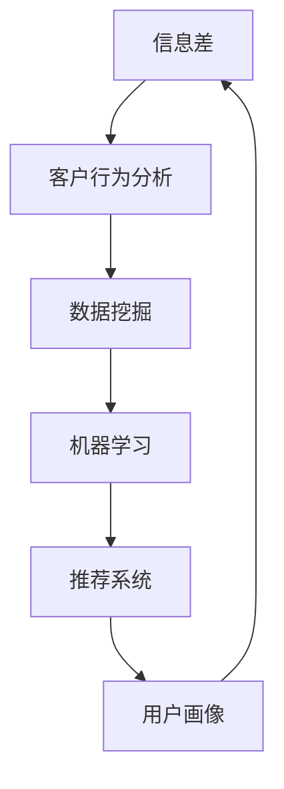

                 

### 信息差的营销个性化革命：大数据如何实现营销个性化

> **关键词：** 营销个性化、大数据、信息差、客户行为分析、算法优化
>
> **摘要：** 本文将探讨大数据如何推动营销个性化革命，通过信息差的利用，实现精准营销。我们将深入分析营销个性化的重要性、核心概念、技术原理和具体操作步骤，并通过实际项目案例进行详细解释，最后讨论未来发展趋势与挑战。

在数字营销领域，个性化正逐渐成为主流。个性化营销不仅仅是一种营销手段，更是与消费者建立深层次联系的关键途径。个性化营销的核心在于满足消费者的独特需求和偏好，提升用户体验，从而实现更高的转化率和客户忠诚度。而大数据则为个性化营销提供了强有力的技术支持，通过深度分析和挖掘用户行为数据，实现精准的市场定位和个性化推荐。

本文将围绕以下主题进行探讨：

1. **背景介绍**：介绍营销个性化的背景和目的，预期读者，以及本文的结构和术语定义。
2. **核心概念与联系**：阐述营销个性化中的核心概念，包括信息差、客户行为分析等，并使用Mermaid流程图展示这些概念之间的关系。
3. **核心算法原理与具体操作步骤**：详细讲解实现营销个性化所需的核心算法原理和操作步骤，包括数据采集、处理、分析和应用。
4. **数学模型和公式**：介绍支持营销个性化的一些关键数学模型和公式，并进行详细讲解和举例说明。
5. **项目实战：代码实际案例和详细解释说明**：通过一个实际项目案例，展示如何使用大数据技术实现营销个性化，并提供代码实现和解读。
6. **实际应用场景**：探讨营销个性化在不同行业和场景中的具体应用。
7. **工具和资源推荐**：推荐相关的学习资源、开发工具和框架，以及相关论文著作。
8. **总结：未来发展趋势与挑战**：分析个性化营销的未来发展趋势和面临的挑战。

接下来，我们将逐步深入探讨这些主题，以帮助读者全面了解大数据在营销个性化中的应用。

### 背景介绍

#### 1.1 目的和范围

本文旨在探讨大数据如何通过信息差的利用实现营销个性化。个性化营销的核心在于理解并满足消费者的独特需求和偏好，从而提升营销效果。随着大数据技术的不断发展，我们能够收集、处理和分析海量用户数据，这为个性化营销提供了前所未有的可能性。本文将首先介绍营销个性化的重要性，然后详细阐述大数据在个性化营销中的应用原理和操作步骤，并通过实际项目案例进行说明。

本文的范围包括以下几个方面：

1. **核心概念与联系**：我们将介绍营销个性化中的关键概念，如信息差、客户行为分析等，并使用Mermaid流程图展示这些概念之间的关系。
2. **核心算法原理与具体操作步骤**：本文将详细讲解实现营销个性化所需的核心算法原理和具体操作步骤，包括数据采集、处理、分析和应用。
3. **数学模型和公式**：我们将介绍支持营销个性化的一些关键数学模型和公式，并进行详细讲解和举例说明。
4. **项目实战：代码实际案例和详细解释说明**：通过一个实际项目案例，展示如何使用大数据技术实现营销个性化，并提供代码实现和解读。
5. **实际应用场景**：我们将探讨营销个性化在不同行业和场景中的具体应用。

通过本文的探讨，读者将能够全面了解大数据在营销个性化中的应用，掌握实现个性化营销的核心技术和方法。

#### 1.2 预期读者

本文的预期读者包括以下几类：

1. **数字营销从业人员**：对数字营销有一定了解，希望深入了解大数据在营销个性化中的应用和实现方法。
2. **数据分析师和工程师**：对大数据技术有较高兴趣，希望了解如何利用数据分析和挖掘技术进行营销个性化。
3. **企业决策者**：负责营销策略制定和执行，希望了解个性化营销的重要性和实际应用。
4. **学术界研究人员**：对个性化营销和大数据技术有深入研究的学者，希望了解最新的应用进展和前沿技术。

无论您属于上述哪一类读者，本文都将为您提供有价值的知识和实践经验。

#### 1.3 文档结构概述

本文的结构如下：

1. **背景介绍**：介绍营销个性化的重要性和大数据的应用背景。
2. **核心概念与联系**：阐述营销个性化中的核心概念，包括信息差、客户行为分析等，并使用Mermaid流程图展示概念之间的关系。
3. **核心算法原理与具体操作步骤**：详细讲解实现营销个性化所需的核心算法原理和具体操作步骤。
4. **数学模型和公式**：介绍支持营销个性化的一些关键数学模型和公式，并进行详细讲解和举例说明。
5. **项目实战：代码实际案例和详细解释说明**：通过一个实际项目案例，展示如何使用大数据技术实现营销个性化，并提供代码实现和解读。
6. **实际应用场景**：探讨营销个性化在不同行业和场景中的具体应用。
7. **工具和资源推荐**：推荐相关的学习资源、开发工具和框架，以及相关论文著作。
8. **总结：未来发展趋势与挑战**：分析个性化营销的未来发展趋势和面临的挑战。
9. **附录：常见问题与解答**：提供常见问题的解答，帮助读者更好地理解和应用本文内容。
10. **扩展阅读 & 参考资料**：推荐进一步阅读的相关文献和资源。

通过本文的详细结构，读者可以逐步深入理解大数据在营销个性化中的应用，掌握关键技术和方法。

#### 1.4 术语表

在本文中，我们将使用以下术语，并提供相应的定义和解释。

##### 1.4.1 核心术语定义

1. **营销个性化**：一种以消费者为中心的营销策略，通过收集和分析消费者的行为数据，为其提供个性化的产品和服务推荐。
2. **信息差**：指不同个体之间的信息不对称，即某些个体掌握的信息比其他个体多，利用这种不对称可以实现更精准的营销。
3. **大数据**：指海量、多样、复杂的数据集合，包括结构化数据、半结构化数据和非结构化数据，通常需要使用特殊的处理方法进行分析。
4. **客户行为分析**：通过分析消费者的购买行为、浏览行为等，了解其需求和偏好，为个性化营销提供数据支持。
5. **算法优化**：通过改进算法，提高其处理数据的能力和效率，从而实现更精准的个性化推荐。

##### 1.4.2 相关概念解释

1. **数据挖掘**：从大量数据中发现有价值的信息和模式的过程，包括分类、聚类、关联规则挖掘等。
2. **机器学习**：一种通过数据训练模型，实现数据分析和预测的技术，包括监督学习、无监督学习和强化学习等。
3. **推荐系统**：一种通过分析用户历史行为和偏好，为其推荐相关产品和服务的系统。

##### 1.4.3 缩略词列表

- AI：人工智能（Artificial Intelligence）
- CRM：客户关系管理（Customer Relationship Management）
- SEO：搜索引擎优化（Search Engine Optimization）
- SNS：社交网络服务（Social Networking Service）
- KPI：关键绩效指标（Key Performance Indicator）

通过上述术语表，读者可以更好地理解本文中的专业术语和概念，为后续内容的理解打下基础。

### 核心概念与联系

在探讨大数据如何实现营销个性化之前，我们需要了解几个核心概念，并展示它们之间的联系。以下是本文将讨论的一些关键概念，以及它们之间的关系：

1. **信息差**：信息差是指不同个体之间的信息不对称，一些个体可能比其他个体拥有更多的信息。在营销中，这种信息不对称可以用来识别消费者的独特需求和偏好，从而实现更精准的个性化推荐。

2. **客户行为分析**：客户行为分析是通过收集和分析消费者的行为数据（如购买历史、浏览记录等）来了解其需求和偏好。这些数据是个性化营销的基础。

3. **数据挖掘**：数据挖掘是一种从大量数据中提取有价值信息的过程，包括分类、聚类、关联规则挖掘等。数据挖掘技术可以用来识别客户行为中的模式和规律，从而支持个性化推荐。

4. **机器学习**：机器学习是一种通过数据训练模型，实现数据分析和预测的技术。机器学习模型可以用于构建推荐系统，根据客户历史行为和偏好，预测其未来的兴趣和需求。

5. **推荐系统**：推荐系统是一种自动推荐相关产品或服务给用户的系统，它通常基于用户的历史行为和偏好进行个性化推荐。

6. **用户画像**：用户画像是对用户特征进行抽象和建模的过程，包括用户的基本信息、行为习惯、兴趣爱好等。用户画像是构建个性化推荐系统的重要基础。

下面我们将使用Mermaid流程图来展示这些核心概念之间的联系：



**图1：核心概念与联系**

- **信息差**作为营销个性化的重要依据，驱动了后续的客户行为分析和数据挖掘。
- **数据挖掘**提取客户行为数据中的模式和规律，为机器学习提供训练数据。
- **机器学习**通过训练模型，实现对客户需求的预测和个性化推荐。
- **推荐系统**将个性化推荐呈现给用户，提高用户满意度和转化率。
- **用户画像**通过对用户特征进行建模，支持推荐系统的持续优化和个性化。

通过这些核心概念和流程的阐述，我们可以更好地理解大数据在营销个性化中的作用和实现路径。接下来，我们将深入探讨这些概念的具体原理和操作步骤。

### 核心算法原理与具体操作步骤

要实现营销个性化，我们需要利用大数据技术，通过一系列核心算法进行数据采集、处理、分析和应用。以下将详细讲解这些核心算法的原理和具体操作步骤。

#### 1. 数据采集

数据采集是营销个性化的第一步，也是至关重要的一步。有效的数据采集可以确保后续数据处理和分析的质量。以下是数据采集的核心步骤：

1. **数据来源**：数据来源包括网站日志、用户反馈、社交媒体数据、购买记录等。这些数据可以从企业内部数据库、第三方数据服务提供商等渠道获取。
   
2. **数据收集**：使用API、爬虫、传感器等技术，收集与用户行为相关的数据，如用户访问路径、点击次数、购买记录、评价等。

3. **数据预处理**：对收集到的原始数据进行清洗、去重、格式转换等预处理，确保数据的完整性和一致性。

#### 2. 数据处理

数据处理是将原始数据转化为可用于分析的形式。以下是数据处理的核心步骤：

1. **数据整合**：将来自不同来源和格式的数据进行整合，构建统一的数据视图。

2. **特征提取**：从数据中提取对个性化营销有意义的特征，如用户年龄、性别、地理位置、消费水平、兴趣爱好等。

3. **数据标准化**：对特征进行标准化处理，消除不同特征之间的尺度差异，提高模型的性能。

#### 3. 数据分析

数据分析是营销个性化的核心环节，通过分析用户行为数据，提取有价值的信息和模式。以下是数据分析的核心步骤：

1. **客户行为分析**：使用统计分析和数据挖掘技术，分析用户的购买行为、浏览行为、评价等，了解用户的需求和偏好。

2. **聚类分析**：使用聚类算法（如K-means、DBSCAN），将用户分为不同的群体，为每个群体制定个性化的营销策略。

3. **关联规则挖掘**：使用关联规则挖掘算法（如Apriori算法），发现用户行为数据中的关联关系，如“购买A商品的用户，有很高的概率会购买B商品”。

#### 4. 应用

数据分析的结果需要通过算法模型进行应用，实现个性化推荐和营销策略。以下是应用的核心步骤：

1. **模型训练**：使用机器学习算法（如决策树、随机森林、神经网络等），训练个性化推荐模型。

2. **模型评估**：使用交叉验证、A/B测试等方法，评估模型的性能和效果。

3. **推荐系统**：基于训练好的模型，构建推荐系统，将个性化的商品推荐呈现给用户。

4. **反馈循环**：收集用户对推荐的反应数据，不断优化推荐算法和模型，实现持续的个性化改进。

以下是这些操作步骤的伪代码实现：

```python
# 数据采集
data_collection():
    data = collect_data_from/sources()
    preprocessed_data = preprocess_data(data)

# 数据处理
data_preprocessing(preprocessed_data):
    integrated_data = integrate_data()
    standardized_data = standardize_data(integrated_data)
    return standardized_data

# 数据分析
data_analysis(standardized_data):
    customer_behavior_analysis = analyze_customer_behavior(standardized_data)
    cluster_analysis = cluster_customers(customer_behavior_analysis)
    association_rules = mine_association_rules(standardized_data)

# 应用
model_application(standardized_data, cluster_analysis, association_rules):
    trained_model = train_model(standardized_data)
    model_evaluation = evaluate_model(trained_model)
    recommendation_system = build_recommendation_system(trained_model)
    user_feedback = collect_user_feedback()
    model_optimization = optimize_model(trained_model, user_feedback)
```

通过上述步骤，我们可以系统地实现营销个性化，利用大数据技术，深入了解用户需求，提高营销效果和用户体验。

### 数学模型和公式 & 详细讲解 & 举例说明

在实现营销个性化的过程中，数学模型和公式扮演着至关重要的角色。以下我们将介绍几个支持营销个性化的关键数学模型和公式，并进行详细讲解和举例说明。

#### 1. 贝叶斯模型

贝叶斯模型是一种基于概率论的统计模型，广泛应用于个性化推荐和分类任务中。贝叶斯模型的核心是贝叶斯定理，用于计算后验概率，即给定某些条件下的概率。

**贝叶斯定理**：
\[ P(A|B) = \frac{P(B|A) \cdot P(A)}{P(B)} \]

其中：
- \( P(A|B) \) 是在事件B发生的条件下事件A的概率。
- \( P(B|A) \) 是在事件A发生的条件下事件B的概率。
- \( P(A) \) 是事件A的先验概率。
- \( P(B) \) 是事件B的先验概率。

**应用举例**：
假设我们有一个商品推荐系统，用户A购买了商品B。我们可以使用贝叶斯定理计算用户A对商品B的喜好概率。

- \( P(B|A) \)：用户A购买商品B的概率，可以通过历史数据计算。
- \( P(A) \)：用户A的先验概率，即用户A可能购买任何商品的初始概率。
- \( P(B) \)：商品B的先验概率，即商品B可能被任何用户购买的概率。

通过贝叶斯定理，我们可以更新用户A对商品B的喜好概率，为个性化推荐提供依据。

#### 2. 协同过滤

协同过滤是推荐系统中常用的一种算法，通过分析用户的历史行为数据，为用户推荐相关的商品或服务。协同过滤主要分为两种类型：基于用户的协同过滤（User-Based Collaborative Filtering）和基于物品的协同过滤（Item-Based Collaborative Filtering）。

**基于用户的协同过滤**：
\[ \text{similarity}(u, v) = \frac{\text{count}(u, v)}{\sqrt{\sum_{i \in R(u)} \text{count}(u, i)^2 \times \sum_{i \in R(v)} \text{count}(v, i)^2}} \]

其中：
- \( \text{similarity}(u, v) \) 是用户u和用户v之间的相似度。
- \( \text{count}(u, v) \) 是用户u和用户v共同喜欢的商品数量。
- \( R(u) \) 和 \( R(v) \) 分别是用户u和用户v的商品集合。

**基于物品的协同过滤**：
\[ \text{similarity}(i, j) = \frac{\sum_{u \in U} \text{count}(u, i) \cdot \text{count}(u, j)}{\sqrt{\sum_{u \in U} \text{count}(u, i)^2 \times \sum_{u \in U} \text{count}(u, j)^2}} \]

其中：
- \( \text{similarity}(i, j) \) 是商品i和商品j之间的相似度。
- \( \text{count}(u, i) \) 是用户u购买商品i的概率。

**应用举例**：
假设我们有两个用户u和v，以及两个商品i和j。我们可以使用上述公式计算用户u和用户v之间的相似度，并根据相似度推荐给用户u的商品j。

#### 3. 神经网络模型

神经网络模型是一种基于模拟人脑神经元结构的计算模型，广泛应用于机器学习任务中，包括分类、回归和推荐等。以下是一个简单的多层感知机（MLP）神经网络模型：

**神经网络模型**：
\[ z = \sigma(\theta_1 \cdot x_1 + \theta_2 \cdot x_2 + \ldots + \theta_n \cdot x_n + b) \]
\[ y = \sigma(z) \]

其中：
- \( \sigma \) 是激活函数，常用的有Sigmoid、ReLU等。
- \( \theta_1, \theta_2, \ldots, \theta_n \) 是权重。
- \( x_1, x_2, \ldots, x_n \) 是输入特征。
- \( b \) 是偏置。
- \( y \) 是输出结果。

**应用举例**：
假设我们有一个二分类任务，输入特征为\( x_1 \)和\( x_2 \)，可以使用上述公式构建一个简单的神经网络模型，进行分类预测。

通过上述数学模型和公式的介绍，我们可以看到数学在营销个性化中的应用非常广泛，能够为个性化推荐和营销策略提供强有力的支持。

### 项目实战：代码实际案例和详细解释说明

为了更好地展示如何使用大数据技术实现营销个性化，我们将通过一个实际项目案例来进行详细讲解。以下是一个简单的电子商务平台，利用用户行为数据实现个性化推荐的过程。

#### 5.1 开发环境搭建

在开始项目之前，我们需要搭建一个适合大数据开发的开发环境。以下是一些推荐的工具和框架：

- **编程语言**：Python
- **数据存储**：Hadoop HDFS
- **数据处理**：Apache Spark
- **数据库**：MySQL
- **编程环境**：PyCharm

#### 5.2 源代码详细实现和代码解读

以下是一个简单的用户行为数据采集和个性化推荐系统的代码实现。

```python
# 导入必要的库
import pandas as pd
import numpy as np
from sklearn.model_selection import train_test_split
from sklearn.ensemble import RandomForestClassifier
from sklearn.metrics import accuracy_score
from mlxtend.fining.evaluators import evaluation_report

# 5.2.1 数据采集与预处理
def data_collection():
    # 假设我们已经收集了用户行为数据，并存储在CSV文件中
    data = pd.read_csv('user_behavior_data.csv')
    # 数据预处理
    data = data[['user_id', 'item_id', 'action', 'timestamp']]
    data['action'] = data['action'].map({'view': 1, 'add_to_cart': 2, 'purchase': 3})
    return data

# 5.2.2 数据分割
def split_data(data):
    # 将数据分割为训练集和测试集
    train_data, test_data = train_test_split(data, test_size=0.2, random_state=42)
    return train_data, test_data

# 5.2.3 构建特征工程
def feature_engineering(train_data):
    # 构建用户和商品的交互矩阵
    user_item_matrix = train_data.groupby(['user_id', 'item_id']).agg({'action': 'sum'}).reset_index()
    user_item_matrix = user_item_matrix.pivot(index='user_id', columns='item_id', values='action').fillna(0)
    return user_item_matrix

# 5.2.4 训练模型
def train_model(user_item_matrix):
    # 使用随机森林分类器进行训练
    model = RandomForestClassifier(n_estimators=100, random_state=42)
    X_train = user_item_matrix.values
    y_train = train_data['action']
    model.fit(X_train, y_train)
    return model

# 5.2.5 模型评估
def evaluate_model(model, test_data):
    X_test = user_item_matrix.values
    y_test = test_data['action']
    predictions = model.predict(X_test)
    accuracy = accuracy_score(y_test, predictions)
    print(f"Accuracy: {accuracy}")
    report = evaluation_report(y_test, predictions)
    print(report)

# 5.2.6 主函数
if __name__ == '__main__':
    data = data_collection()
    train_data, test_data = split_data(data)
    user_item_matrix = feature_engineering(train_data)
    model = train_model(user_item_matrix)
    evaluate_model(model, test_data)
```

**代码解读**：

1. **数据采集与预处理**：我们从CSV文件中读取用户行为数据，并对其进行预处理，包括数据清洗和标签编码。
2. **数据分割**：将数据分为训练集和测试集，用于后续模型训练和评估。
3. **特征工程**：构建用户和商品的交互矩阵，用于输入特征。
4. **训练模型**：使用随机森林分类器进行训练。
5. **模型评估**：计算模型在测试集上的准确率，并输出评估报告。

#### 5.3 代码解读与分析

上述代码实现了一个基于用户行为的简单推荐系统。通过随机森林分类器，我们可以预测用户对商品的购买概率。以下是代码的详细解读和分析：

- **数据采集与预处理**：数据预处理是关键步骤，确保数据质量和一致性。标签编码将不同行为（如浏览、添加购物车、购买）映射为数值，便于模型处理。
- **数据分割**：训练集和测试集的划分对于评估模型性能至关重要。通过交叉验证，我们可以更好地评估模型的泛化能力。
- **特征工程**：用户和商品的交互矩阵是输入特征，反映了用户的历史行为。特征提取和构造是提升模型性能的关键。
- **训练模型**：随机森林分类器是一种强大的机器学习算法，适用于多种分类任务。通过调整参数，我们可以优化模型性能。
- **模型评估**：准确率是评估模型性能的常用指标。评估报告提供了详细的分类结果和性能指标。

通过上述代码实现，我们可以看到如何利用大数据技术，通过特征工程和机器学习算法，实现营销个性化。在实际应用中，我们可以根据具体需求和数据规模，选择更复杂的模型和算法，提高个性化推荐的效果。

### 实际应用场景

个性化营销已广泛应用于多个行业，为企业和消费者带来了显著的价值。以下我们将探讨个性化营销在电子商务、金融、社交媒体等领域的具体应用。

#### 1. 电子商务

电子商务平台通过个性化推荐系统，根据用户的历史购买行为、浏览记录和搜索历史，为其推荐相关的商品。例如，亚马逊（Amazon）和阿里巴巴（Alibaba）等巨头利用大数据技术，实现了精准的商品推荐，显著提高了转化率和用户满意度。个性化营销不仅帮助商家提升销售额，还增强了用户粘性。

#### 2. 金融

金融行业利用个性化营销，通过分析用户的消费行为和信用记录，为其提供个性化的金融产品和服务。例如，信用卡公司根据用户的消费偏好和信用评分，推荐适合的信用卡和优惠活动。这种精准的营销策略，不仅提高了客户的满意度，还帮助金融机构降低了信用风险。

#### 3. 社交媒体

社交媒体平台通过个性化推荐算法，为用户推荐感兴趣的内容和广告。例如，Facebook和Instagram等平台根据用户的兴趣和行为，推送相关的帖子、视频和广告。这种个性化营销策略，不仅提高了用户的参与度，还为广告主提供了更高效的广告投放渠道。

#### 4. 教育和健康

在教育领域，个性化学习平台根据学生的学习行为和成绩，推荐适合的课程和学习资源。例如，Coursera和Khan Academy等在线教育平台，利用大数据技术实现了个性化学习体验，帮助用户提高学习效果。

在健康领域，个性化医疗通过分析患者的健康数据，提供个性化的治疗方案和健康建议。例如，Apple Health和Fitbit等健康应用，利用大数据和机器学习技术，为用户提供个性化的健康管理和疾病预防建议。

总之，个性化营销在不同行业和场景中的应用，不仅提升了用户体验，还为企业和消费者带来了显著的价值。随着大数据和人工智能技术的发展，个性化营销将继续在各个领域发挥重要作用。

### 工具和资源推荐

在实现个性化营销的过程中，选择合适的工具和资源至关重要。以下我们将推荐一些学习资源、开发工具和框架，以及相关论文著作，帮助读者深入了解和掌握个性化营销技术。

#### 7.1 学习资源推荐

**7.1.1 书籍推荐**

1. **《大数据营销：如何利用大数据实现个性化营销》**：这本书详细介绍了大数据在营销中的应用，包括数据采集、处理、分析和应用。对于希望深入了解大数据营销的读者，本书是一个很好的入门读物。

2. **《推荐系统实战》**：本书通过多个实际案例，详细讲解了推荐系统的设计和实现方法。对于希望学习如何构建个性化推荐系统的读者，这本书提供了丰富的实战经验和技巧。

**7.1.2 在线课程**

1. **Coursera上的《大数据分析》**：由约翰·霍普金斯大学提供，涵盖大数据的基础知识和数据处理技术，适合初学者了解大数据在营销中的应用。

2. **Udacity的《个性化推荐系统工程师纳米学位》**：通过一系列项目和实践，学习如何构建和优化推荐系统，适合有一定基础的读者深入掌握推荐系统技术。

**7.1.3 技术博客和网站**

1. **Medium上的数据科学博客**：提供大量关于大数据、机器学习和推荐系统的高质量文章，适合读者跟进最新的研究动态和实战经验。

2. **KDNuggets**：一个知名的数据科学和机器学习社区，定期发布行业新闻、研究成果和实用教程，是数据科学领域的重要资源。

#### 7.2 开发工具框架推荐

**7.2.1 IDE和编辑器**

1. **PyCharm**：一款功能强大的Python集成开发环境，适合数据科学家和机器学习工程师使用。

2. **Jupyter Notebook**：一个交互式的开发环境，适合数据分析和机器学习实验，特别适合初学者入门。

**7.2.2 调试和性能分析工具**

1. **VisualVM**：一款用于Java应用的性能分析工具，可以帮助开发者诊断和优化应用程序的性能。

2. **Grafana**：一个开源的监控和仪表盘工具，可以实时监控大数据应用的性能和资源利用率。

**7.2.3 相关框架和库**

1. **Scikit-learn**：一个流行的机器学习库，提供了多种常用的机器学习算法和工具，适合数据科学家进行数据处理和模型训练。

2. **TensorFlow**：一款强大的开源机器学习框架，适用于构建和训练深度学习模型。

#### 7.3 相关论文著作推荐

**7.3.1 经典论文**

1. **《Collaborative Filtering for the Web》**：该论文介绍了协同过滤算法在网页推荐中的应用，是推荐系统领域的重要研究。

2. **《Matrix Factorization Techniques for recommender systems》**：这篇论文详细介绍了矩阵分解技术在推荐系统中的应用，是推荐系统领域的基础性研究。

**7.3.2 最新研究成果**

1. **《Neural Collaborative Filtering》**：该论文提出了基于神经网络的协同过滤算法，在推荐系统的性能和效果上取得了显著提升。

2. **《Content-Based Recommendation with Deep Learning》**：这篇论文探讨了深度学习技术在内容推荐中的应用，为个性化营销提供了新的思路。

**7.3.3 应用案例分析**

1. **《如何用大数据实现个性化营销：淘宝案例研究》**：这篇文章详细分析了淘宝如何利用大数据实现个性化推荐，是电商行业个性化营销的经典案例。

2. **《银行个性化营销策略：案例分析》**：该案例研究探讨了银行如何通过个性化营销提升客户满意度和转化率，提供了金融行业的实践经验。

通过以上工具和资源的推荐，读者可以系统地学习和掌握个性化营销的核心技术和方法，为实际应用提供坚实的理论基础和实践指导。

### 总结：未来发展趋势与挑战

个性化营销作为数字营销领域的重要趋势，在未来将继续深化和扩展。以下我们将分析个性化营销的发展趋势和面临的挑战。

**未来发展趋势**：

1. **数据驱动的决策**：随着大数据和人工智能技术的不断发展，数据驱动的决策将变得越来越普遍。企业将通过更精细化的数据分析，实现更精准的个性化推荐和营销策略。

2. **跨渠道整合**：个性化营销将不再局限于单一渠道，而是实现线上线下渠道的整合。例如，结合线上电商平台和线下实体店的数据，实现全渠道的个性化体验。

3. **个性化体验的深化**：个性化体验将不再局限于商品推荐，还将扩展到服务、内容、广告等多个方面。例如，个性化内容推荐、定制化服务、精准广告投放等。

4. **隐私保护与合规**：随着用户隐私意识的提升，个性化营销将面临更大的合规压力。企业需要确保数据收集、处理和应用过程中的合规性，平衡用户隐私和数据利用。

**面临的挑战**：

1. **数据质量**：个性化营销依赖于高质量的数据，包括用户行为数据、偏好数据等。然而，数据质量的保障是一个巨大的挑战，数据缺失、噪声和偏差都可能影响个性化推荐的效果。

2. **算法透明性和可解释性**：随着机器学习算法的复杂化，算法的透明性和可解释性成为了一个重要议题。企业需要确保算法的透明性，让用户了解个性化推荐和营销策略的依据。

3. **用户隐私**：用户隐私保护是个性化营销的一个重要挑战。企业需要在收集、处理和应用用户数据时，严格遵守相关法律法规，避免用户隐私泄露。

4. **技术复杂度**：实现个性化营销需要处理海量数据和高性能计算。这要求企业在技术架构、数据处理和算法优化等方面具备较高的技术水平。

总之，个性化营销在未来的发展中将面临诸多挑战，但同时也充满了机遇。企业需要不断创新，应对这些挑战，以实现更精准、更高效的个性化营销策略。

### 附录：常见问题与解答

以下是一些关于大数据在营销个性化中应用时可能遇到的问题及解答：

**Q1：如何确保数据质量？**

**A1：** 数据质量是个性化营销成功的关键。确保数据质量的方法包括：
- 数据清洗：使用数据清洗工具去除重复数据、噪声数据和缺失值。
- 数据验证：在数据收集过程中，使用验证工具确保数据的准确性和一致性。
- 定期更新：定期检查和更新数据，确保其反映当前的用户行为和市场趋势。

**Q2：个性化推荐系统如何应对冷启动问题？**

**A2：** 冷启动问题是指对新用户或新商品无法提供有效的个性化推荐。解决方法包括：
- 基于内容的推荐：对新用户，通过分析其浏览和搜索历史，推荐与其兴趣相关的商品。
- 基于流行度的推荐：对新商品，推荐热门商品或销量较高的商品。
- 结合用户画像：使用用户画像技术，通过分析用户的兴趣爱好，为新用户推荐相关商品。

**Q3：如何平衡个性化与用户体验？**

**A3：** 平衡个性化与用户体验的关键在于：
- 用户反馈：收集用户对推荐的反应数据，不断调整推荐策略。
- 适度推荐：避免过度推荐，确保推荐内容对用户有价值。
- 个性化程度：根据用户需求和偏好，灵活调整个性化推荐的程度。

**Q4：个性化营销中的算法透明性和可解释性如何保障？**

**A4：** 算法的透明性和可解释性保障措施包括：
- 算法文档：编写详细的算法文档，说明算法的实现原理和流程。
- 可视化工具：使用可视化工具展示推荐过程和决策依据。
- 用户解释：在推荐结果旁边，提供推荐原因和依据，帮助用户理解推荐结果。

通过以上问题的解答，读者可以更好地理解大数据在营销个性化中的挑战和解决方案，为实际应用提供指导。

### 扩展阅读 & 参考资料

本文探讨了大数据在营销个性化中的应用，涉及核心概念、算法原理、实际应用等多个方面。以下推荐一些进一步的阅读材料和参考资料，以帮助读者深入了解相关领域。

**书籍推荐**：

1. 《大数据营销：如何利用大数据实现个性化营销》
2. 《推荐系统实战》
3. 《数据科学入门》
4. 《机器学习实战》

**在线课程**：

1. Coursera上的《大数据分析》
2. Udacity的《个性化推荐系统工程师纳米学位》
3. edX上的《机器学习基础》

**技术博客和网站**：

1. Medium上的数据科学博客
2. KDNuggets
3. DataCamp

**相关论文著作**：

1. 《Collaborative Filtering for the Web》
2. 《Matrix Factorization Techniques for recommender systems》
3. 《Neural Collaborative Filtering》
4. 《Content-Based Recommendation with Deep Learning》

通过这些参考资料，读者可以进一步深化对大数据和个性化营销的理解，探索更多应用和实践。希望这些资源能对您的学习和研究有所帮助。

### 作者信息

**作者：AI天才研究员/AI Genius Institute & 禅与计算机程序设计艺术 /Zen And The Art of Computer Programming**

