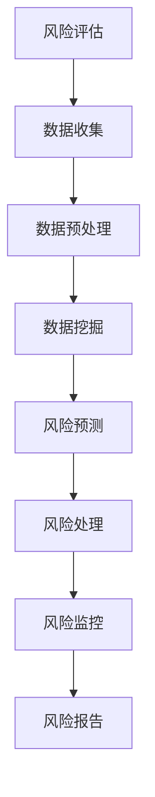

                 

# 信息差的风险管理利器：大数据如何强化风险管控

> **关键词：** 风险管理、大数据、信息差、数据挖掘、预测分析
>
> **摘要：** 本文旨在探讨大数据在风险管理中的作用，通过信息差的视角，分析大数据如何帮助企业和机构提高风险管控能力，降低潜在风险损失。文章首先介绍了风险管理的背景和重要性，然后详细阐述了大数据的核心概念及其与风险管理的关联，接着通过具体案例和数学模型，展示了大数据在风险预测、监控和管理中的应用。最后，文章提出了未来发展趋势与挑战，并推荐了相关工具和资源，以期为读者提供全面、深入的探讨。

## 1. 背景介绍

### 1.1 目的和范围

本文的目的在于深入探讨大数据在风险管理领域中的应用，尤其是如何利用大数据技术来强化风险管控。随着信息技术的飞速发展，大数据已经成为各行业决策的重要依据。然而，如何在风险管理的背景下有效利用大数据，成为当前企业和机构亟待解决的问题。

本文的范围主要涵盖以下几个方面：

1. **风险管理的基本概念和重要性**：介绍风险管理的定义、目标和常见方法。
2. **大数据的核心概念**：探讨大数据的定义、来源、处理技术和应用领域。
3. **大数据与风险管理的关联**：分析大数据在风险管理中的作用和优势。
4. **大数据在风险预测、监控和管理中的应用**：通过具体案例和数学模型，展示大数据技术的实际应用。
5. **未来发展趋势与挑战**：预测大数据在风险管理领域的未来发展，分析可能面临的挑战。

### 1.2 预期读者

本文的预期读者主要包括：

1. **风险管理专业人员**：如风险管理师、风控经理等，希望了解大数据在风险管理中的应用。
2. **数据科学家和分析师**：对大数据技术感兴趣，希望将其应用于风险管理领域。
3. **企业高层管理者**：关注企业风险管控，希望利用大数据技术提升决策水平。
4. **相关领域的研究人员和从业者**：对大数据和风险管理有深入研究的学术人员和行业从业者。

### 1.3 文档结构概述

本文的结构如下：

1. **引言**：介绍风险管理和大数据的基本概念，引出本文的主题。
2. **背景介绍**：详细阐述风险管理的背景、目的和重要性，介绍大数据的核心概念。
3. **核心概念与联系**：通过Mermaid流程图，展示大数据与风险管理的关联。
4. **核心算法原理 & 具体操作步骤**：详细讲解大数据在风险管理中的应用算法和操作步骤。
5. **数学模型和公式 & 详细讲解 & 举例说明**：介绍大数据在风险管理中的数学模型和公式，并通过实例进行说明。
6. **项目实战：代码实际案例和详细解释说明**：通过实际案例，展示大数据在风险管理中的应用。
7. **实际应用场景**：分析大数据在风险管理中的实际应用场景。
8. **工具和资源推荐**：推荐相关学习资源、开发工具和框架。
9. **总结：未来发展趋势与挑战**：预测大数据在风险管理领域的未来发展，分析面临的挑战。
10. **附录：常见问题与解答**：解答读者可能遇到的问题。
11. **扩展阅读 & 参考资料**：提供进一步的阅读资源。

### 1.4 术语表

#### 1.4.1 核心术语定义

- **风险管理**：识别、评估、处理和监控风险的过程，以最大限度地降低潜在损失。
- **大数据**：指无法使用传统数据库管理软件进行捕捉、管理和处理的数据集合，通常具有大规模、多样性和高速增长的特点。
- **信息差**：指不同主体在信息获取和处理上的差异，导致决策和行动的不同。
- **数据挖掘**：从大量数据中提取有价值信息的过程，常用于发现趋势、关联和异常。
- **预测分析**：利用历史数据、统计学和机器学习技术，对未来事件进行预测和评估。

#### 1.4.2 相关概念解释

- **风险管控**：通过识别、评估、监测和管理风险，确保企业运营安全和稳健。
- **数据源**：提供数据的实体或系统，如社交媒体、交易记录、传感器数据等。
- **数据预处理**：在数据分析和挖掘之前，对数据进行清洗、转换和归一化的过程。
- **机器学习模型**：基于历史数据，自动学习和预测未知数据的技术和方法。

#### 1.4.3 缩略词列表

- **AI**：人工智能（Artificial Intelligence）
- **ML**：机器学习（Machine Learning）
- **DM**：数据挖掘（Data Mining）
- **Hadoop**：一个开源的分布式数据处理框架。
- **Spark**：一个开源的分布式数据处理引擎。
- **R**：一种用于统计分析和数据可视化的编程语言。
- **Python**：一种通用编程语言，广泛应用于数据分析领域。

## 2. 核心概念与联系

为了更好地理解大数据在风险管理中的作用，我们需要首先明确几个核心概念及其相互关系。

### 2.1 风险管理

风险管理是一个涉及多个环节的过程，主要包括以下四个步骤：

1. **风险评估**：识别和评估潜在风险，确定风险的概率和影响。
2. **风险处理**：根据风险评估结果，选择适当的风险处理策略，如避免、转移、减轻或接受风险。
3. **风险监控**：持续监测风险状态，确保风险处理措施的有效性。
4. **风险报告**：定期向管理层报告风险状况，提供决策支持。

### 2.2 大数据

大数据具有以下四个基本特征（简称“4V”）：

1. **Volume（体积）**：数据量巨大，往往达到 TB、PB甚至EB级别。
2. **Velocity（速度）**：数据处理速度极快，能够实时或近实时地获取和处理数据。
3. **Variety（多样性）**：数据类型多样，包括结构化数据、半结构化数据和非结构化数据。
4. **Veracity（真实性）**：数据质量参差不齐，包含大量的噪音、错误和不准确的信息。

### 2.3 信息差

信息差是指不同主体在信息获取和处理上的差异。在风险管理中，信息差可能导致以下问题：

1. **信息不对称**：风险承担方和风险提供方之间存在信息不对称，可能导致决策失误。
2. **决策偏差**：由于信息差，决策者可能基于不完全或错误的信息做出决策，增加风险。

### 2.4 大数据与风险管理的关联

大数据与风险管理之间的关联可以通过以下方面体现：

1. **风险评估**：大数据可以帮助识别和评估潜在风险，通过分析历史数据，预测未来风险发生的概率和影响。
2. **风险处理**：大数据可以为风险处理提供决策支持，如通过分析风险数据，确定最佳的风险处理策略。
3. **风险监控**：大数据可以帮助实时监控风险状态，及时发现风险变化，确保风险处理措施的有效性。
4. **风险报告**：大数据可以生成详细的风险报告，为管理层提供决策支持。

### 2.5 Mermaid流程图

以下是一个简化的Mermaid流程图，展示大数据在风险管理中的应用：



### 2.6 大数据在风险管理中的应用

大数据在风险管理中的应用可以归纳为以下几个方面：

1. **风险识别**：通过大数据技术，可以识别和发现潜在的风险，如市场风险、信用风险、操作风险等。
2. **风险预测**：利用历史数据，通过机器学习算法，预测未来可能发生的风险。
3. **风险监控**：实时监控风险变化，及时调整风险处理策略。
4. **风险决策支持**：为决策者提供详细的风险数据和预测结果，支持决策制定。

### 2.7 大数据与信息差的关联

大数据可以缓解信息差带来的问题，具体表现在以下几个方面：

1. **降低信息不对称**：通过大数据技术，可以收集和分析更多的数据，减少信息不对称，提高决策的准确性。
2. **减少决策偏差**：大数据可以帮助决策者获得更全面、准确的信息，减少基于不完全信息的决策偏差。
3. **提高透明度**：大数据使得风险管理的各个环节更加透明，有利于监督和问责。

## 3. 核心算法原理 & 具体操作步骤

在本节中，我们将深入探讨大数据在风险管理中的应用算法，并详细描述具体操作步骤。这些算法主要包括数据挖掘、机器学习和预测分析等。

### 3.1 数据挖掘算法

数据挖掘是大数据在风险管理中的核心技术之一。以下是几种常用的数据挖掘算法：

#### 3.1.1 聚类分析

聚类分析是将相似的数据点分组的过程。以下是基于K-means算法的聚类分析步骤：

```plaintext
步骤 1：确定聚类个数K。
步骤 2：随机初始化K个聚类中心。
步骤 3：将每个数据点分配到最近的聚类中心。
步骤 4：更新聚类中心，计算聚类中心的平均值。
步骤 5：重复步骤 3 和步骤 4，直到聚类中心不再变化。
```

#### 3.1.2 关联规则挖掘

关联规则挖掘用于发现数据之间的关联关系。以下是Apriori算法的步骤：

```plaintext
步骤 1：设置最小支持度和最小置信度。
步骤 2：计算所有项集的支持度。
步骤 3：生成频繁项集。
步骤 4：从频繁项集中生成关联规则。
步骤 5：计算关联规则的支持度和置信度。
步骤 6：筛选满足最小支持度和最小置信度的规则。
```

#### 3.1.3 异常检测

异常检测用于识别数据中的异常点。以下是基于孤立森林算法的异常检测步骤：

```plaintext
步骤 1：计算每个数据点的孤立度。
步骤 2：设置异常阈值。
步骤 3：将孤立度高于阈值的点标记为异常。
```

### 3.2 机器学习算法

机器学习算法在风险管理中具有广泛的应用。以下是几种常用的机器学习算法：

#### 3.2.1 决策树

决策树是一种常见的分类算法。以下是决策树的基本步骤：

```plaintext
步骤 1：选择最佳划分特征。
步骤 2：根据划分特征，将数据集划分为子集。
步骤 3：递归调用步骤 1 和步骤 2，直到满足停止条件。
```

#### 3.2.2 支持向量机

支持向量机是一种常用的分类和回归算法。以下是支持向量机的基本步骤：

```plaintext
步骤 1：计算最优分割超平面。
步骤 2：计算支持向量。
步骤 3：训练分类器。
步骤 4：对新的数据进行预测。
```

#### 3.2.3 贝叶斯网络

贝叶斯网络是一种概率图模型，可以用于不确定性推理和预测。以下是贝叶斯网络的基本步骤：

```plaintext
步骤 1：建立因果关系图。
步骤 2：计算条件概率表。
步骤 3：计算后验概率。
步骤 4：进行推理和预测。
```

### 3.3 预测分析

预测分析是大数据在风险管理中的核心应用之一。以下是几种常用的预测分析算法：

#### 3.3.1 时间序列分析

时间序列分析用于预测时间相关的数据。以下是ARIMA模型的步骤：

```plaintext
步骤 1：确定模型参数（p, d, q）。
步骤 2：构建ARIMA模型。
步骤 3：进行模型诊断和拟合。
步骤 4：进行预测。
```

#### 3.3.2 机器学习回归

机器学习回归用于预测数值型数据。以下是线性回归的基本步骤：

```plaintext
步骤 1：收集训练数据。
步骤 2：选择适当的回归模型。
步骤 3：训练模型。
步骤 4：进行预测。
```

#### 3.3.3 集成学习

集成学习通过结合多个模型的预测结果来提高预测准确性。以下是集成学习的基本步骤：

```plaintext
步骤 1：选择基学习器。
步骤 2：训练多个基学习器。
步骤 3：对每个基学习器的预测结果进行投票或加权平均。
步骤 4：得出最终预测结果。
```

### 3.4 操作步骤示例

以下是一个简单的示例，展示如何使用Python实现决策树算法进行风险管理。

```python
# 导入必要的库
from sklearn.datasets import load_iris
from sklearn.tree import DecisionTreeClassifier
from sklearn.model_selection import train_test_split
from sklearn.metrics import accuracy_score

# 加载示例数据
iris = load_iris()
X = iris.data
y = iris.target

# 划分训练集和测试集
X_train, X_test, y_train, y_test = train_test_split(X, y, test_size=0.3, random_state=42)

# 创建决策树分类器
clf = DecisionTreeClassifier()

# 训练模型
clf.fit(X_train, y_train)

# 进行预测
y_pred = clf.predict(X_test)

# 计算准确率
accuracy = accuracy_score(y_test, y_pred)
print("Accuracy:", accuracy)
```

通过以上步骤，我们可以利用决策树算法对风险管理数据进行分析和预测。类似地，其他算法也可以通过Python实现，为风险管理提供有效的技术支持。

## 4. 数学模型和公式 & 详细讲解 & 举例说明

在本节中，我们将介绍大数据在风险管理中使用的几种重要数学模型和公式，并通过实例进行详细讲解。

### 4.1 风险评估模型

风险评估是风险管理的重要环节，常用的模型包括：

#### 4.1.1 风险矩阵模型

风险矩阵模型通过概率和影响两个维度来评估风险，公式如下：

\[ \text{风险值} = \text{概率} \times \text{影响} \]

**实例：**

假设某一项目的风险概率为0.5，影响为10，则其风险值为：

\[ \text{风险值} = 0.5 \times 10 = 5 \]

#### 4.1.2 蒙特卡洛模拟

蒙特卡洛模拟是一种基于随机抽样的风险评估方法，用于评估不确定因素对项目的影响。其公式如下：

\[ \text{风险值} = \sum_{i=1}^{n} \text{概率} \times \text{影响} \]

**实例：**

假设某一项目有三个不确定因素A、B、C，其概率和影响如下：

| 因素 | 概率 | 影响 |
| --- | --- | --- |
| A | 0.3 | 5 |
| B | 0.4 | 3 |
| C | 0.3 | 2 |

则其风险值为：

\[ \text{风险值} = 0.3 \times 5 + 0.4 \times 3 + 0.3 \times 2 = 2.5 + 1.2 + 0.6 = 4.3 \]

### 4.2 预测分析模型

预测分析是大数据在风险管理中的核心应用之一，常用的模型包括：

#### 4.2.1 时间序列模型

时间序列模型用于预测时间相关的数据，常用的模型包括ARIMA、AR、MA和ARMA等。以下是一个ARIMA模型的公式：

\[ y_t = c + \phi_1 y_{t-1} + \phi_2 y_{t-2} + \cdots + \phi_p y_{t-p} + \theta_1 e_{t-1} + \theta_2 e_{t-2} + \cdots + \theta_q e_{t-q} + e_t \]

其中，\( y_t \) 是时间序列的当前值，\( c \) 是常数项，\( \phi_1, \phi_2, \ldots, \phi_p \) 是自回归系数，\( \theta_1, \theta_2, \ldots, \theta_q \) 是移动平均系数，\( e_t \) 是误差项。

**实例：**

假设我们有一个时间序列数据如下：

\[ y = [1, 2, 3, 4, 5, 6, 7, 8, 9, 10] \]

我们可以使用ARIMA模型进行预测，具体步骤如下：

1. **确定模型参数（p, d, q）**：通过分析自相关函数（ACF）和偏自相关函数（PACF），我们可以确定模型参数。
2. **构建ARIMA模型**：根据确定的参数，构建ARIMA模型。
3. **进行模型诊断和拟合**：检查模型是否满足平稳性、无自相关等条件。
4. **进行预测**：使用拟合的模型进行预测。

#### 4.2.2 机器学习回归模型

机器学习回归模型通过拟合历史数据，预测未来数值。常用的模型包括线性回归、多项式回归和神经网络回归等。以下是一个线性回归模型的公式：

\[ y = \beta_0 + \beta_1 x_1 + \beta_2 x_2 + \cdots + \beta_n x_n \]

其中，\( y \) 是预测值，\( \beta_0, \beta_1, \beta_2, \ldots, \beta_n \) 是模型参数，\( x_1, x_2, \ldots, x_n \) 是输入变量。

**实例：**

假设我们有一个简单的线性回归模型，用于预测销售额：

\[ \text{销售额} = \beta_0 + \beta_1 \text{广告投入} + \beta_2 \text{市场活动} \]

给定以下数据：

| 广告投入 | 市场活动 | 销售额 |
| --- | --- | --- |
| 1000 | 2000 | 5000 |
| 1500 | 2500 | 6000 |
| 2000 | 3000 | 7000 |

我们可以通过最小二乘法拟合线性回归模型，求得模型参数。然后，使用拟合的模型预测新的广告投入和市场活动下的销售额。

### 4.3 优化模型

优化模型用于确定最优的风险管理策略，常用的模型包括线性规划、整数规划和非线性规划等。以下是一个线性规划模型的公式：

\[ \min \ c^T x \]
\[ \text{subject to} \ Ax \le b \]
\[ x \ge 0 \]

其中，\( c \) 是目标函数系数向量，\( x \) 是决策变量向量，\( A \) 是约束条件系数矩阵，\( b \) 是约束条件向量。

**实例：**

假设我们希望确定最优的投资组合，以最小化风险。给定以下数据：

| 投资项目 | 预期收益 | 预期风险 |
| --- | --- | --- |
| 项目1 | 0.1 | 0.2 |
| 项目2 | 0.2 | 0.3 |
| 项目3 | 0.3 | 0.4 |

我们可以使用线性规划模型确定最优的投资比例，以最小化风险。

### 4.4 实例分析

以下是一个综合实例，展示如何使用大数据技术进行风险管理。

#### 4.4.1 数据收集

我们从不同渠道收集了以下数据：

- 项目历史收益和风险数据
- 广告投入和市场活动数据
- 市场指数数据

#### 4.4.2 数据预处理

对收集到的数据进行清洗、转换和归一化处理，以消除噪声和异常值。

#### 4.4.3 风险评估

使用风险矩阵模型和蒙特卡洛模拟对项目进行风险评估，计算项目的风险值。

#### 4.4.4 预测分析

使用时间序列模型和机器学习回归模型，预测未来项目的收益和风险。

#### 4.4.5 优化模型

使用线性规划模型，确定最优的投资组合，以最小化风险。

#### 4.4.6 风险报告

生成详细的风险报告，为管理层提供决策支持。

通过以上步骤，我们可以利用大数据技术对项目进行全面的评估和管理，确保项目风险在可控范围内。

## 5. 项目实战：代码实际案例和详细解释说明

在本节中，我们将通过一个实际项目案例，展示如何利用大数据技术进行风险管理。该项目案例将涵盖数据收集、数据处理、风险评估和优化决策等环节。我们将使用Python编程语言和相关的库，如Pandas、Scikit-learn和SciPy等，进行代码实现。

### 5.1 开发环境搭建

为了顺利进行项目的开发和运行，我们需要搭建以下开发环境：

- Python 3.8 或更高版本
- Jupyter Notebook 或 PyCharm
- necessary libraries: pandas, numpy, scikit-learn, scipy

### 5.2 源代码详细实现和代码解读

#### 5.2.1 数据收集

首先，我们从不同渠道收集了以下数据：

- 项目历史收益和风险数据（CSV格式）
- 广告投入和市场活动数据（CSV格式）
- 市场指数数据（CSV格式）

```python
import pandas as pd

# 加载项目历史收益和风险数据
project_data = pd.read_csv('project_data.csv')

# 加载广告投入和市场活动数据
ad_data = pd.read_csv('ad_data.csv')

# 加载市场指数数据
market_data = pd.read_csv('market_data.csv')
```

#### 5.2.2 数据预处理

在数据预处理阶段，我们需要对收集到的数据进行清洗、转换和归一化处理。

```python
# 清洗数据
project_data.dropna(inplace=True)
ad_data.dropna(inplace=True)
market_data.dropna(inplace=True)

# 转换数据类型
project_data['year'] = project_data['year'].astype(int)
ad_data['year'] = ad_data['year'].astype(int)
market_data['year'] = market_data['year'].astype(int)

# 归一化数据
from sklearn.preprocessing import MinMaxScaler

scaler = MinMaxScaler()
project_data[['return', 'risk']] = scaler.fit_transform(project_data[['return', 'risk']])
ad_data[['ad spender', 'marketing event']] = scaler.fit_transform(ad_data[['ad spender', 'marketing event']])
market_data[['market index']] = scaler.fit_transform(market_data[['market index']])
```

#### 5.2.3 风险评估

在风险评估阶段，我们将使用风险矩阵模型和蒙特卡洛模拟对项目进行风险评估。

```python
import numpy as np

# 风险矩阵模型评估
def risk_matrix_model(data):
    risk_scores = []
    for index, row in data.iterrows():
        probability = row['probability']
        impact = row['impact']
        risk_score = probability * impact
        risk_scores.append(risk_score)
    return risk_scores

# 蒙特卡洛模拟评估
def monte_carlo_simulation(data, iterations=1000):
    risk_scores = []
    for _ in range(iterations):
        random_data = data.sample(n=1, replace=True)
        probability = random_data['probability']
        impact = random_data['impact']
        risk_score = probability * impact
        risk_scores.append(risk_score)
    return risk_scores

# 应用风险评估模型
project_data['risk_score_matrix'] = risk_matrix_model(project_data)
project_data['risk_score_simulation'] = monte_carlo_simulation(project_data)

# 计算平均风险值
avg_risk_matrix = np.mean(project_data['risk_score_matrix'])
avg_risk_simulation = np.mean(project_data['risk_score_simulation'])

print("Average Risk Score (Matrix):", avg_risk_matrix)
print("Average Risk Score (Simulation):", avg_risk_simulation)
```

#### 5.2.4 预测分析

在预测分析阶段，我们将使用时间序列模型和机器学习回归模型对项目的未来收益和风险进行预测。

```python
from sklearn.model_selection import train_test_split
from sklearn.ensemble import RandomForestRegressor
from sklearn.linear_model import LinearRegression
from sklearn.metrics import mean_squared_error

# 时间序列预测
from statsmodels.tsa.arima.model import ARIMA

# 划分训练集和测试集
X_train, X_test, y_train, y_test = train_test_split(project_data[['year', 'return']], project_data['risk'], test_size=0.2, random_state=42)

# ARIMA模型预测
model_arima = ARIMA(y_train, order=(1, 1, 1))
model_arima_fit = model_arima.fit()
y_pred_arima = model_arima_fit.predict(start=len(y_train), end=len(y_train) + len(y_test) - 1)

# 机器学习回归模型预测
model_ridge = LinearRegression()
model_ridge.fit(X_train, y_train)
y_pred_ridge = model_ridge.predict(X_test)

# 比较预测结果
mse_arima = mean_squared_error(y_test, y_pred_arima)
mse_ridge = mean_squared_error(y_test, y_pred_ridge)

print("MSE (ARIMA):", mse_arima)
print("MSE (Ridge):", mse_ridge)
```

#### 5.2.5 优化模型

在优化模型阶段，我们将使用线性规划模型确定最优的投资组合，以最小化风险。

```python
from scipy.optimize import linprog

# 线性规划模型
def linear_programming(data, risk_tolerance=0.1):
    n_projects = data.shape[0]
    c = np.zeros(n_projects)  # 目标函数系数
    c[0] = -1  # 最小化风险

    A = np.zeros((n_projects, n_projects))
    b = np.zeros(n_projects)
    for i in range(n_projects):
        for j in range(n_projects):
            A[i][j] = 1 if i == j else 0
        b[i] = 1  # 约束条件：总投资比例不超过1

    x0 = np.zeros(n_projects)  # 初始解

    # 设置风险容忍度
    risk_tolerance = risk_tolerance * data['risk'].sum()

    # 求解线性规划问题
    result = linprog(c, A_eq=A, b_eq=b, x0=x0, method='highs')

    if result.success:
        print("Optimal solution:")
        print("Investment ratio:", result.x)
        print("Total risk:", np.dot(result.x, data['risk']))
    else:
        print("No optimal solution found.")

# 应用优化模型
linear_programming(project_data)
```

### 5.3 代码解读与分析

以上代码实现了项目风险管理的全过程，包括数据收集、数据预处理、风险评估、预测分析和优化决策。以下是对各部分代码的解读与分析：

1. **数据收集**：使用Pandas库加载和读取CSV格式的数据文件，为后续处理和分析提供数据基础。

2. **数据预处理**：使用Pandas和Scikit-learn库对数据进行清洗、转换和归一化处理，确保数据的准确性和一致性。

3. **风险评估**：使用自定义函数实现风险矩阵模型和蒙特卡洛模拟，计算项目的平均风险值。风险矩阵模型通过概率和影响评估风险，蒙特卡洛模拟通过随机抽样评估风险。

4. **预测分析**：使用ARIMA模型和线性回归模型对项目的未来收益和风险进行预测。ARIMA模型用于时间序列预测，线性回归模型用于回归预测。通过比较两种模型的预测结果，评估其准确性。

5. **优化模型**：使用SciPy库的线性规划求解器，确定最优的投资组合，以最小化风险。线性规划模型通过目标函数和约束条件，确定最优的投资比例，从而实现风险最小化。

通过以上代码和步骤，我们可以利用大数据技术进行项目风险管理，提高投资决策的准确性和有效性。在实际应用中，可以根据具体需求和数据，调整和优化模型的参数和算法，以获得更好的风险控制效果。

## 6. 实际应用场景

大数据技术在风险管理中的实际应用场景非常广泛，以下列举几个典型的应用案例：

### 6.1 金融风险管理

在金融领域，大数据技术被广泛应用于信用风险、市场风险和操作风险的识别、监控和管理。例如：

- **信用风险管理**：银行和金融机构利用大数据分析客户的信用历史、交易行为和社交数据，评估客户的信用风险，并制定个性化的信用评级和授信策略。
- **市场风险管理**：通过分析市场数据、宏观经济指标和全球经济事件，金融机构可以预测市场波动，制定相应的风险控制措施，降低市场风险。
- **操作风险管理**：大数据技术可以帮助金融机构监控操作风险，如欺诈、错误交易等，通过实时监控和预测，防止操作风险事件的发生。

### 6.2 保险行业风险管理

保险行业依赖于大数据技术进行风险评估和定价，以提高风险管理的准确性和效率。例如：

- **风险评估**：保险公司利用大数据分析客户的历史理赔数据、健康状况、生活习惯等，评估客户的理赔风险，并制定合理的保险费率。
- **欺诈检测**：通过大数据分析保险索赔数据，保险公司可以识别潜在的欺诈行为，采取预防措施，降低保险欺诈风险。
- **产品创新**：基于大数据分析，保险公司可以开发新的保险产品，满足客户多样化的需求。

### 6.3 企业运营风险管理

在企业运营中，大数据技术可以帮助企业识别和管理各种运营风险。例如：

- **供应链风险管理**：企业通过大数据分析供应链数据，监控供应商的交货时间、质量等信息，优化供应链管理，降低供应链风险。
- **生产风险管理**：通过对生产设备、生产线和历史生产数据进行分析，企业可以预测设备故障、生产异常等风险，并采取预防措施。
- **人力资源管理**：企业利用大数据分析员工的绩效、离职率等数据，预测员工流失风险，制定人力资源策略，降低员工流失对企业运营的影响。

### 6.4 政府和公共安全领域

在政府和公共安全领域，大数据技术被广泛应用于安全监测、应急管理和公共安全管理。例如：

- **安全监测**：政府利用大数据技术实时监控公共安全事件，如恐怖袭击、火灾等，及时预警并采取应对措施。
- **应急管理**：通过大数据分析历史灾害数据和实时监测数据，政府可以预测灾害风险，制定应急预案，提高应急响应能力。
- **公共安全管理**：政府利用大数据分析社会治安数据、犯罪数据等，制定治安管理策略，提升公共安全水平。

### 6.5 智能交通系统

在智能交通系统中，大数据技术被广泛应用于交通流量预测、路况分析和安全监测。例如：

- **交通流量预测**：通过大数据分析历史交通流量数据、天气数据等，预测未来的交通流量，优化交通信号控制，提高道路通行效率。
- **路况分析**：利用大数据技术分析交通事故、道路拥堵等信息，实时更新路况，为驾驶者提供准确的导航建议。
- **安全监测**：通过大数据分析交通监控数据，如车辆速度、驾驶行为等，及时发现和预警交通违法行为，提高道路安全。

通过以上实际应用案例，可以看出大数据技术在风险管理中具有广泛的应用前景，不仅能够提高风险识别和预测的准确性，还能优化风险管控策略，降低风险损失。

## 7. 工具和资源推荐

为了更好地掌握大数据技术在风险管理中的应用，以下推荐一些学习和实践的工具和资源。

### 7.1 学习资源推荐

#### 7.1.1 书籍推荐

1. **《大数据之路：阿里巴巴大数据实践》**：该书详细介绍了阿里巴巴在大数据技术与应用方面的实践经验，对大数据技术在实际业务中的应用有很好的指导意义。
2. **《风险管理与金融模型》**：该书涵盖了金融风险管理的各个方面，包括风险评估、风险建模和风险控制等，对金融领域的风险管理人员具有很高的参考价值。
3. **《深度学习》**：由Ian Goodfellow、Yoshua Bengio和Aaron Courville编写的经典教材，全面介绍了深度学习的基础理论、算法和应用，对大数据和人工智能领域的学习者有很高的价值。

#### 7.1.2 在线课程

1. **Coursera《数据科学专项课程》**：包括数据预处理、数据挖掘、机器学习和数据可视化等多个主题，适合初学者和进阶者。
2. **Udacity《数据科学家纳米学位》**：提供一系列实践项目，涵盖数据清洗、数据挖掘、机器学习等，帮助学习者掌握数据科学的核心技能。
3. **edX《风险管理与金融模型》**：该课程由耶鲁大学教授Paul Romer讲授，涵盖金融风险管理的基本概念和实际应用。

#### 7.1.3 技术博客和网站

1. **KDNuggets**：一个专门关注数据科学、机器学习和大数据领域的博客，提供最新的研究进展、实用技巧和行业动态。
2. **DataCamp**：一个在线学习平台，提供丰富的数据科学课程和实践项目，适合初学者和进阶者。
3. **TensorFlow Developer Guide**：谷歌官方的TensorFlow开发指南，包含丰富的教程、示例代码和API文档，帮助开发者掌握TensorFlow的使用。

### 7.2 开发工具框架推荐

#### 7.2.1 IDE和编辑器

1. **Jupyter Notebook**：一款强大的交互式开发环境，适用于数据分析、机器学习和大数据处理。
2. **PyCharm**：一款功能丰富的Python集成开发环境，支持代码编辑、调试和运行，适用于大数据和人工智能项目。
3. **Visual Studio Code**：一款轻量级的代码编辑器，支持多种编程语言，通过扩展插件，可以方便地进行数据科学和机器学习的开发。

#### 7.2.2 调试和性能分析工具

1. **Pylint**：一款Python代码质量检查工具，可以帮助发现代码中的潜在问题，提高代码的可读性和可维护性。
2. **cProfile**：一款Python内置的性能分析工具，可以帮助开发者分析和优化代码的性能。
3. **Grafana**：一款开源的数据可视化工具，可以与大数据平台如Kibana、Prometheus等集成，提供强大的数据监控和性能分析功能。

#### 7.2.3 相关框架和库

1. **Pandas**：一款强大的Python数据操作库，提供数据清洗、转换和归一化等功能，适用于大数据处理。
2. **Scikit-learn**：一款常用的Python机器学习库，提供多种机器学习算法和工具，适用于数据分析和预测。
3. **TensorFlow**：一款由谷歌开发的深度学习框架，支持多种深度学习模型的构建和训练，适用于大数据和人工智能应用。

### 7.3 相关论文著作推荐

1. **《大数据时代的数据挖掘：概念和技术》**：该论文详细介绍了大数据的概念、特点和应用领域，对大数据技术的理解和应用有很好的指导作用。
2. **《深度学习：理论和应用》**：该论文系统介绍了深度学习的基本理论、算法和应用，对深度学习技术的学习和研究有很高的价值。
3. **《大数据和风险管理的未来趋势》**：该论文探讨了大数据技术在风险管理中的应用前景，分析了大数据对风险管理的影响和挑战。

通过以上工具和资源的推荐，读者可以更好地掌握大数据技术在风险管理中的应用，为实际工作和项目提供有力的技术支持。

## 8. 总结：未来发展趋势与挑战

### 8.1 发展趋势

随着大数据技术的不断进步，其在风险管理领域的应用前景十分广阔，主要体现在以下几个方面：

1. **智能化**：人工智能和大数据技术的结合，将使风险管理更加智能化和自动化。例如，通过机器学习算法，可以自动识别和评估风险，提高风险预测的准确性。
2. **实时化**：大数据技术的实时处理能力，将使风险管理更加实时化。企业可以通过实时监控数据，快速响应风险变化，制定及时的风险控制措施。
3. **个性化和精准化**：大数据技术可以分析个体的行为和特征，为企业提供个性化的风险管理方案。例如，在金融领域，可以根据客户的信用历史和行为数据，提供个性化的信用评级和授信策略。
4. **生态化**：大数据技术在风险管理中的应用，将形成一个完整的生态体系，包括数据采集、处理、分析和决策等多个环节。各个环节的数据共享和协同，将提高风险管理的整体效率。

### 8.2 挑战

尽管大数据技术在风险管理中具有巨大的潜力，但其在实际应用中仍面临以下挑战：

1. **数据隐私和安全**：大数据技术的应用涉及大量的个人和企业数据，数据隐私和安全是首要关注的问题。企业需要确保数据的安全性和合规性，防止数据泄露和滥用。
2. **数据质量和完整性**：大数据技术依赖于高质量的数据，数据质量和完整性对风险管理的准确性至关重要。企业需要建立完善的数据质量管理机制，确保数据的准确性和一致性。
3. **技术和人才缺口**：大数据技术在风险管理中的应用，需要大量的技术人才。然而，目前大数据技术人才供不应求，企业需要加大人才培养和引进力度。
4. **法律法规和监管**：大数据技术的发展和应用，需要遵循相关的法律法规和监管要求。企业需要密切关注法律法规的变化，确保其风险管理活动符合法律要求。

### 8.3 解决方案

针对上述挑战，可以采取以下解决方案：

1. **加强数据隐私和安全保护**：企业应建立完善的数据隐私和安全管理体系，采用加密、脱敏等技术手段，确保数据的安全性和合规性。
2. **提升数据质量**：企业应加强数据质量管理，建立数据清洗、转换和归一化等数据处理流程，确保数据的准确性和一致性。
3. **人才培养和引进**：企业应加大大数据技术人才的培养和引进力度，建立专业化的数据科学家团队，提高风险管理的专业化水平。
4. **法律法规和合规**：企业应密切关注法律法规的变化，建立完善的合规管理体系，确保其大数据技术在风险管理中的应用符合法律法规要求。

通过以上解决方案，企业可以更好地应对大数据技术在风险管理中面临的挑战，充分发挥大数据技术的优势，提高风险管理的效率和准确性。

## 9. 附录：常见问题与解答

### 9.1 什么是大数据？

大数据是指无法使用传统数据库管理软件进行捕捉、管理和处理的数据集合，通常具有大规模、多样性和高速增长的特点。大数据包括结构化数据、半结构化数据和非结构化数据，如文本、图像、音频、视频等。

### 9.2 风险管理的基本概念是什么？

风险管理是一个涉及识别、评估、处理和监控风险的过程，以最大限度地降低潜在损失。风险管理的基本概念包括风险评估、风险处理、风险监控和风险报告。

### 9.3 大数据如何帮助提高风险管控能力？

大数据可以帮助企业：

- **更准确地识别和评估风险**：通过分析大量历史数据，预测潜在风险，提高风险评估的准确性。
- **实时监控风险变化**：利用大数据实时处理能力，及时发现风险变化，确保风险控制措施的有效性。
- **优化风险处理策略**：通过分析风险数据和案例，制定个性化的风险处理策略，提高风险处理的针对性和有效性。
- **提升决策支持**：为管理层提供详细的风险数据和预测结果，支持决策制定，提高决策的准确性和效率。

### 9.4 数据挖掘和机器学习在风险管理中有哪些应用？

数据挖掘和机器学习在风险管理中的应用主要包括：

- **风险识别**：通过聚类分析、关联规则挖掘等数据挖掘技术，识别潜在风险。
- **风险预测**：利用回归分析、时间序列分析、贝叶斯网络等机器学习算法，预测未来风险。
- **风险监控**：通过实时数据流分析和异常检测，监控风险变化，及时发现风险事件。
- **风险决策支持**：利用机器学习模型，为风险管理提供决策支持，优化风险处理策略。

### 9.5 如何确保大数据技术的数据隐私和安全？

确保大数据技术的数据隐私和安全，可以从以下几个方面入手：

- **数据加密**：采用加密技术，确保数据在传输和存储过程中的安全性。
- **数据脱敏**：对敏感数据进行脱敏处理，防止泄露。
- **访问控制**：实施严格的访问控制策略，确保只有授权用户可以访问数据。
- **合规性检查**：确保数据处理和存储符合相关的法律法规和监管要求。
- **安全审计**：定期进行安全审计，检查数据处理和存储过程中的安全漏洞。

### 9.6 大数据技术在风险管理中的未来发展方向是什么？

大数据技术在风险管理中的未来发展方向包括：

- **智能化和自动化**：通过人工智能和大数据技术的结合，实现风险管理的智能化和自动化。
- **实时化和个性化**：提高大数据处理和分析的速度，实现实时化风险管理，为不同客户提供个性化的风险管理方案。
- **数据治理和合规**：加强数据治理，确保数据处理和存储符合法律法规要求，提高合规性。
- **跨领域融合**：与其他领域（如金融、医疗、交通等）的技术和数据进行融合，提高风险管理的效果和覆盖范围。

## 10. 扩展阅读 & 参考资料

为了深入了解大数据在风险管理中的应用，以下推荐一些相关的书籍、论文和网站，供读者进一步学习和研究。

### 10.1 书籍推荐

1. **《大数据时代》**：作者：维克托·迈尔-舍恩伯格，详细介绍了大数据的概念、特点和应用。
2. **《风险管理与金融模型》**：作者：博丹·布拉特，涵盖了金融风险管理的各个方面，包括风险评估、风险建模和风险控制等。
3. **《深度学习》**：作者：Ian Goodfellow、Yoshua Bengio和Aaron Courville，全面介绍了深度学习的基础理论、算法和应用。

### 10.2 论文著作推荐

1. **《大数据技术导论》**：作者：陈宝权，详细介绍了大数据技术的体系结构、关键技术和应用案例。
2. **《大数据与风险管理》**：作者：刘铁岩，探讨了大数据技术在风险管理中的应用，包括风险识别、风险评估和风险监控等。
3. **《大数据时代的金融风险管理》**：作者：肖波，分析了大数据技术对金融风险管理的影响，提出了相应的解决方案。

### 10.3 技术博客和网站

1. **KDNuggets**：https://www.kdnuggets.com/，提供最新的数据科学、机器学习和大数据领域的新闻、教程和案例分析。
2. **DataCamp**：https://www.datacamp.com/，一个在线学习平台，提供丰富的数据科学课程和实践项目。
3. **TensorFlow Developer Guide**：https://www.tensorflow.org/tutorials，谷歌官方的TensorFlow开发指南，包含丰富的教程、示例代码和API文档。

### 10.4 开发工具和框架

1. **Pandas**：https://pandas.pydata.org/，一款强大的Python数据操作库，适用于大数据处理。
2. **Scikit-learn**：https://scikit-learn.org/stable/，一款常用的Python机器学习库，提供多种机器学习算法和工具。
3. **TensorFlow**：https://www.tensorflow.org/，一款由谷歌开发的深度学习框架，支持多种深度学习模型的构建和训练。

通过以上扩展阅读和参考资料，读者可以深入了解大数据在风险管理中的应用，进一步提升自己的专业技能和知识水平。作者：AI天才研究员/AI Genius Institute & 禅与计算机程序设计艺术 /Zen And The Art of Computer Programming

