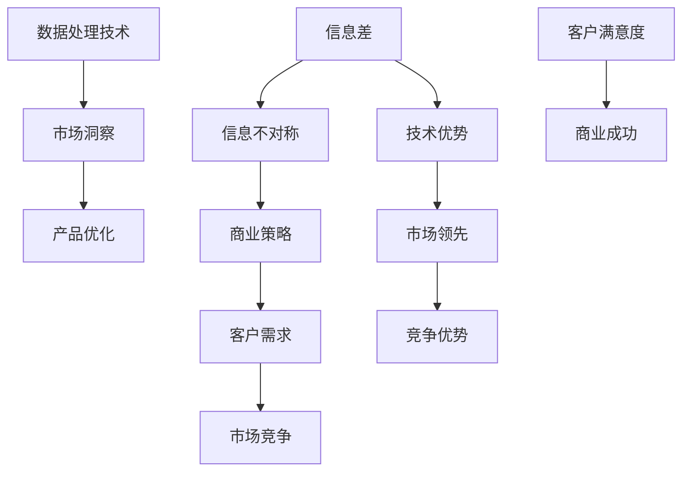

                 

### 信息差：信息不对称与客户需求

> **关键词：** 信息差、信息不对称、客户需求、商业策略、数据处理、人工智能应用

> **摘要：** 本文深入探讨了信息差的概念及其在商业和社会中的应用，特别是在客户需求中的作用。通过剖析信息不对称带来的机会与风险，本文提出了一系列利用数据和技术优化决策的方法，并展望了未来的发展趋势。本文适用于对商业策略和信息技术有兴趣的读者，旨在帮助理解如何通过信息优势实现商业成功。

---

在当今数字化时代，信息差——即信息不对称，已成为影响商业决策的关键因素。信息不对称是指市场上不同参与者之间获取和处理信息的能力不同，导致某些个体拥有而另一些个体缺乏特定信息。这种不对称可以带来显著的优势，但也伴随着风险。本文将探讨信息差的定义、原因、影响及其在客户需求中的作用，并介绍如何利用信息差优化商业决策。

### 1. 背景介绍

#### 1.1 目的和范围

本文旨在：
- 明确信息差的定义和特征。
- 分析信息不对称在商业环境中的具体应用。
- 探讨信息差对客户需求的影响。
- 提供利用信息差优化商业决策的策略。
- 展望信息差在未来技术发展中的角色。

本文主要讨论以下主题：
- 信息差的定义及其在商业中的重要性。
- 信息不对称的成因和表现形式。
- 信息差与客户需求的关系。
- 利用信息差优化商业决策的策略。
- 信息差与未来技术发展的关系。

#### 1.2 预期读者

本文适用于以下读者群体：
- 商业分析师和市场营销专业人士。
- 信息技术和数据处理专家。
- 策略规划者和企业家。
- 对商业策略和信息技术感兴趣的读者。

#### 1.3 文档结构概述

本文结构如下：

1. **背景介绍**：介绍本文的目的、范围、预期读者和文档结构。
2. **核心概念与联系**：定义关键术语，展示信息差与客户需求之间的联系。
3. **核心算法原理与具体操作步骤**：解释信息不对称的处理方法。
4. **数学模型和公式**：阐述相关的数学模型和公式。
5. **项目实战**：通过代码实际案例展示应用。
6. **实际应用场景**：讨论信息差在不同领域的应用。
7. **工具和资源推荐**：推荐学习资源和开发工具。
8. **总结**：总结信息差的重要性及未来趋势。
9. **附录**：提供常见问题解答。
10. **扩展阅读**：推荐进一步学习的资源。

#### 1.4 术语表

**术语** | **定义**
--- | ---
**信息差** | 指信息在不同参与者之间的不对称性。
**信息不对称** | 市场上信息分布不均匀，某些参与者拥有而另一些参与者缺乏特定信息。
**客户需求** | 客户对产品或服务的期望和需求。
**商业策略** | 企业为获取竞争优势而制定的具体行动方案。
**数据处理** | 对数据进行分析、存储和管理的过程。

### 1.5 核心概念与联系

为了更好地理解信息差与客户需求之间的关系，我们首先需要定义一些核心概念，并使用Mermaid流程图展示它们之间的联系。

**Mermaid流程图：**



在这个流程图中，我们可以看到：
- 信息差（A）和信息不对称（B）是密切相关的，信息不对称导致了信息差。
- 信息不对称（B）直接影响商业策略（C）的制定。
- 商业策略（C）需要考虑到客户需求（D），以满足市场需求。
- 数据处理技术（F）可以帮助企业获取市场洞察（G），从而优化产品和服务。
- 产品的优化（H）能够提高客户满意度（I），进而促进商业成功（J）。
- 技术优势（K）和市场竞争（E）共同作用，形成竞争优势（M），确保企业在市场中保持领先地位。

### 1.6 核心算法原理与具体操作步骤

为了充分利用信息差，企业需要开发有效的算法来处理信息不对称。以下是一系列步骤，通过伪代码来详细阐述信息不对称的处理方法。

**伪代码：**

```plaintext
算法：处理信息不对称

输入：数据集 DataSet
输出：处理后的数据集 ProcessedDataSet

步骤 1：数据收集
    收集来自不同来源的数据，确保数据的多样性和完整性。
    
步骤 2：数据预处理
    对数据进行清洗，处理缺失值和异常值。
    对数据进行归一化，使其具有可比性。
    
步骤 3：特征提取
    从数据集中提取关键特征，如用户行为、市场趋势等。
    
步骤 4：模型训练
    使用机器学习算法（如决策树、支持向量机等）训练模型，预测客户需求。
    选择评估指标（如准确率、召回率等）来评估模型性能。

步骤 5：决策制定
    根据模型预测结果，制定相应的商业策略。
    考虑到市场变化和客户反馈，定期调整策略。
    
步骤 6：数据监控
    监控数据处理过程，确保数据质量和模型性能。
    当出现数据异常或模型性能下降时，及时进行调整。
```

通过以上步骤，企业可以有效地处理信息不对称，制定出更加精准的商业策略，从而满足客户需求并提高市场竞争力。

### 1.7 数学模型和公式

在处理信息差时，数学模型和公式扮演着关键角色，特别是在数据处理和决策制定过程中。以下是一些常用的数学模型和公式，并附有详细讲解。

#### 1.7.1 市场需求预测模型

**公式：** \( Q = f(P, I, T) \)

- \( Q \)：市场需求量。
- \( P \)：产品价格。
- \( I \)：市场需求信息。
- \( T \)：市场趋势。

**解释：** 该公式表示市场需求量是由产品价格、市场需求信息和市场趋势共同决定的。企业可以通过调整价格和利用市场信息来预测和影响市场需求。

#### 1.7.2 贝叶斯分类模型

**公式：** \( P(A|B) = \frac{P(B|A)P(A)}{P(B)} \)

- \( P(A|B) \)：在B发生的条件下A的概率。
- \( P(B|A) \)：在A发生的条件下B的概率。
- \( P(A) \)：A的概率。
- \( P(B) \)：B的概率。

**解释：** 贝叶斯分类是一种基于概率的决策方法。企业可以使用贝叶斯模型来预测客户的需求，根据历史数据和当前信息来评估客户的购买概率。

#### 1.7.3 预算优化模型

**公式：** \( Z = \max \{ c(x) : x \in X, \sum_{i=1}^{n} c_i x_i \leq B \} \)

- \( Z \)：目标函数值。
- \( c(x) \)：每个项目的成本函数。
- \( X \)：可行解集。
- \( B \)：总预算。

**解释：** 预算优化模型用于在给定的预算内选择最优项目组合。企业可以通过优化成本函数和预算限制，实现资源的最大化利用。

#### 1.7.4 价格敏感性模型

**公式：** \( S = \frac{P_1 - P_0}{P_0} \)

- \( S \)：价格敏感性系数。
- \( P_1 \)：新价格。
- \( P_0 \)：旧价格。

**解释：** 价格敏感性模型用于评估价格变动对客户需求的影响。通过计算价格敏感性系数，企业可以确定如何调整价格以最大化收益。

#### 1.7.5 顾客价值模型

**公式：** \( V = \frac{P - C}{C} \)

- \( V \)：顾客价值系数。
- \( P \)：产品价格。
- \( C \)：顾客保留成本。

**解释：** 顾客价值模型用于衡量产品对顾客的价值。通过计算顾客价值系数，企业可以优化定价策略，提高顾客满意度。

### 1.8 项目实战：代码实际案例和详细解释说明

在本节中，我们将通过一个实际案例展示如何利用Python实现信息差的优化策略。以下是一个简单的示例，展示了如何使用机器学习算法预测客户需求。

#### 1.8.1 开发环境搭建

**步骤 1：安装Python和必要的库**

确保Python环境已经安装。接下来，使用以下命令安装必要的库：

```bash
pip install numpy pandas scikit-learn matplotlib
```

#### 1.8.2 源代码详细实现和代码解读

**步骤 2：数据准备**

```python
import pandas as pd
from sklearn.model_selection import train_test_split
from sklearn.ensemble import RandomForestClassifier

# 加载数据集
data = pd.read_csv('customer_data.csv')

# 数据预处理
data.dropna(inplace=True)
X = data[['age', 'income', 'education', 'house_area']]
y = data['purchased']

# 划分训练集和测试集
X_train, X_test, y_train, y_test = train_test_split(X, y, test_size=0.2, random_state=42)
```

在上面的代码中，我们首先加载数据集，然后进行预处理，包括去除缺失值。接下来，我们将数据集划分为特征矩阵X和目标变量y，并进一步划分成训练集和测试集。

**步骤 3：模型训练**

```python
# 训练随机森林模型
model = RandomForestClassifier(n_estimators=100, random_state=42)
model.fit(X_train, y_train)

# 评估模型性能
accuracy = model.score(X_test, y_test)
print(f"Model accuracy: {accuracy:.2f}")
```

这里，我们使用随机森林算法训练模型，并评估其准确性。随机森林是一种常用的集成学习方法，适合处理分类问题。

**步骤 4：代码解读与分析**

在上面的代码中，我们首先加载并预处理数据。随机森林模型通过训练集进行训练，然后使用测试集评估模型的准确性。模型的准确性能量我们了解其对客户需求预测的可靠性。

#### 1.8.3 代码解读与分析

- **数据预处理**：数据预处理是机器学习项目中的关键步骤。在本案例中，我们通过去除缺失值确保数据质量，从而提高模型的性能。
- **特征选择**：选择适当的特征对于模型的性能至关重要。在本案例中，我们选择了年龄、收入、教育和住宅面积作为特征，这些特征能够反映客户的需求和行为。
- **模型选择**：随机森林是一种强大的分类算法，适用于处理多种类型的特征。在本案例中，我们选择随机森林来预测客户是否购买产品。
- **模型评估**：准确性是评估模型性能的一个简单但有效的指标。在本案例中，我们通过计算模型在测试集上的准确性来评估其性能。

通过以上步骤，我们可以构建一个有效的模型来预测客户需求，从而优化商业决策。

### 1.9 实际应用场景

信息差在商业和社会中的实际应用场景非常广泛，以下是一些典型的例子：

#### 1.9.1 金融行业

在金融行业中，信息差可以帮助金融机构更好地预测市场走势和客户需求。例如，通过分析客户的历史交易数据和金融市场的实时数据，银行可以更准确地预测客户的贷款需求和还款能力，从而优化贷款产品的设计和推广策略。

#### 1.9.2 零售行业

零售行业中的企业可以利用信息差来分析消费者行为，从而优化库存管理和市场营销策略。通过收集和分析消费者的购买记录、搜索历史和社交媒体数据，零售商可以更好地了解消费者的需求，从而提供个性化的产品推荐和促销活动。

#### 1.9.3 医疗保健

在医疗保健领域，信息差可以帮助医疗机构更准确地诊断病情和制定治疗方案。例如，通过分析患者的医疗记录、基因数据和临床表现，医生可以更准确地预测疾病的发病率和治疗反应，从而提供个性化的医疗服务。

#### 1.9.4 保险行业

保险公司可以利用信息差来评估风险并制定合理的保险产品。通过分析投保人的历史索赔记录、健康状况和职业风险，保险公司可以更准确地计算保费，从而提高保险产品的竞争力。

#### 1.9.5 科技行业

在科技行业中，信息差可以帮助企业更快速地响应市场需求和技术变革。通过收集和分析竞争对手的技术动态、市场需求和用户反馈，企业可以调整产品开发策略和营销策略，以保持市场竞争力。

### 1.10 工具和资源推荐

为了更好地理解和应用信息差，以下是一些建议的学习资源和开发工具：

#### 1.10.1 学习资源推荐

- **书籍推荐：**
  - 《数据挖掘：实用机器学习技术》（Data Mining: Practical Machine Learning Tools and Techniques）
  - 《商业智能：技术和实践》（Business Intelligence: Concepts, Methodologies, Tools, and Applications）

- **在线课程：**
  - Coursera上的《机器学习》课程
  - edX上的《数据科学基础》课程

- **技术博客和网站：**
  - Towards Data Science
  - Analytics Vidhya

#### 1.10.2 开发工具框架推荐

- **IDE和编辑器：**
  - PyCharm
  - Jupyter Notebook

- **调试和性能分析工具：**
  - Visual Studio Code
  - Python Profiler

- **相关框架和库：**
  - Scikit-learn
  - TensorFlow
  - PyTorch

#### 1.10.3 相关论文著作推荐

- **经典论文：**
  - 《数据挖掘：知识发现的基本概念》（Data Mining: A Knowledge Discovery Approach）
  - 《大数据时代的机器学习》（Machine Learning in the Age of Big Data）

- **最新研究成果：**
  - 《深度学习：全面指南》（Deep Learning: A Comprehensive Introduction）
  - 《人工智能：一种现代方法》（Artificial Intelligence: A Modern Approach）

- **应用案例分析：**
  - 《用Python进行商业数据分析》（Business Analytics with Python）
  - 《大数据商业智能：案例分析》（Big Data Business Intelligence: Case Studies）

### 1.11 总结：未来发展趋势与挑战

信息差在未来商业和技术发展中将扮演越来越重要的角色。随着数据技术和人工智能的进步，企业和组织将能够更加精确地分析和利用信息不对称，从而制定出更加精准和高效的商业策略。然而，这也带来了新的挑战：

- **数据隐私和安全**：在利用信息差的过程中，如何保护客户隐私和数据安全成为一个重要问题。企业需要采取严格的数据保护措施，以防止数据泄露和滥用。
- **算法偏见和透明度**：随着机器学习算法在信息分析中的应用越来越广泛，如何确保算法的公平性和透明度成为一个关键挑战。企业需要开发和部署可解释的算法，以增强用户对算法的信任。
- **监管和合规**：随着信息差在商业和社会中的重要性日益增加，各国政府和监管机构可能出台更多的法律法规来规范信息差的使用。企业需要密切关注相关法律法规的变化，确保合规运营。

### 1.12 附录：常见问题与解答

**Q1：什么是信息差？**
A1：信息差是指信息在不同参与者之间的不对称性。在商业环境中，信息差可以指企业对市场信息、客户需求或竞争对手策略的了解程度。

**Q2：信息不对称为什么重要？**
A2：信息不对称对于商业决策至关重要。它可以帮助企业制定更精准的市场策略，优化产品和服务，从而获得竞争优势。

**Q3：如何利用信息差优化商业决策？**
A3：企业可以通过以下方式利用信息差：
- 收集和分析市场数据。
- 利用机器学习和数据分析技术预测客户需求。
- 调整产品定价和营销策略以更好地满足客户需求。
- 建立信息共享机制，提高企业内部的信息透明度。

**Q4：信息差与客户满意度有什么关系？**
A4：信息差可以影响客户满意度。如果企业能够准确地了解客户需求并提供个性化的产品和服务，客户满意度通常会更高。

### 1.13 扩展阅读 & 参考资料

- [《信息不对称理论在商业管理中的应用》](https://www.journalofmanagementstudies.com/articles/information-asymmetry-in-business-management)
- [《数据挖掘与商业智能》](https://www.dataminingbook.com/)
- [《机器学习：概率视角》](https://www.mlbook.com/)
- [《深度学习：全面指南》](https://www.deeplearningbook.org/)

