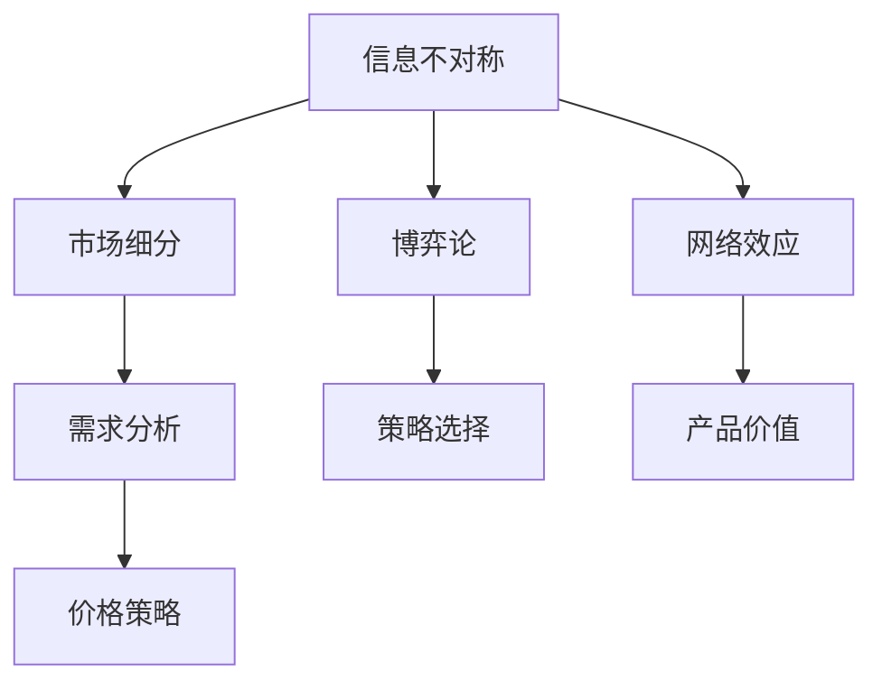

                 


# 信息差：信息不对称与市场细分

> 关键词：信息不对称、市场细分、博弈论、网络效应、需求分析、价格策略

> 摘要：本文将深入探讨信息不对称现象在市场细分中的应用，从经济学、心理学和社会学等多角度分析其影响和策略。通过博弈论模型和网络效应，我们揭示了信息不对称如何导致市场失衡，进而提出有效的需求分析和价格策略。文章还结合实际案例，详细讲解了如何通过市场细分实现竞争优势，最后对未来发展趋势与挑战进行了展望。

## 1. 背景介绍

### 1.1 目的和范围

本文旨在分析信息不对称现象在市场细分中的作用，并探讨其对市场均衡、需求和价格策略的影响。我们将通过多个案例分析，提供实用的策略和工具，帮助读者在竞争激烈的市场中取得优势。

### 1.2 预期读者

本文适合市场分析师、产品经理、商业策略师以及对经济学、心理学和社会学感兴趣的读者。希望读者能够从中获得对市场细分的深入理解，并学会运用信息不对称理论进行策略分析和决策。

### 1.3 文档结构概述

本文分为以下部分：

- 背景介绍：介绍本文的目的、范围和预期读者。
- 核心概念与联系：定义核心概念，绘制流程图。
- 核心算法原理与具体操作步骤：解释信息不对称的算法原理。
- 数学模型和公式：介绍相关数学模型和公式。
- 项目实战：实际代码案例和解释。
- 实际应用场景：分析应用场景。
- 工具和资源推荐：推荐学习资源和开发工具。
- 总结：未来发展趋势与挑战。
- 附录：常见问题与解答。
- 扩展阅读：参考资料。

### 1.4 术语表

#### 1.4.1 核心术语定义

- 信息不对称：市场参与者之间的信息差异。
- 市场细分：将市场划分为具有相似需求的细分市场。
- 博弈论：研究决策制定和策略选择的数学理论。
- 网络效应：产品用户数量增加时，产品的价值也随之增加。

#### 1.4.2 相关概念解释

- 求解博弈：参与者选择策略时的决策过程。
- 动态博弈：参与者做出决策的时间序列模型。
- 需求分析：分析消费者对产品或服务的需求。

#### 1.4.3 缩略词列表

- AI：人工智能（Artificial Intelligence）
- ML：机器学习（Machine Learning）
- NN：神经网络（Neural Network）

## 2. 核心概念与联系

为了更好地理解信息不对称与市场细分之间的关系，我们先来定义几个核心概念，并绘制一个流程图来展示它们之间的联系。

### 2.1 核心概念

- **信息不对称**：指市场参与者之间的信息不平等，一方拥有更多或更准确的信息，而另一方则处于信息劣势。
- **市场细分**：根据消费者的需求、行为和特征，将市场划分为不同的细分市场。
- **博弈论**：研究决策制定和策略选择的数学理论，适用于分析信息不对称下的市场行为。
- **网络效应**：产品用户数量增加时，产品的价值也随之增加，这种效应在社交网络、电商平台等领域尤为明显。

### 2.2 Mermaid 流程图

下面是一个简单的 Mermaid 流程图，展示了这些核心概念之间的联系：



## 3. 核心算法原理 & 具体操作步骤

### 3.1 算法原理

在信息不对称的市场中，博弈论提供了有效的策略分析工具。我们以下面的博弈模型为例：

**博弈模型**：

- **参与者**：卖家和买家。
- **策略**：卖家可以选择提供高质量产品或低质量产品，买家可以选择购买或不购买。

### 3.2 具体操作步骤

#### 步骤 1：构建博弈矩阵

我们构建一个简单的博弈矩阵来表示卖家和买家的策略和支付：

```plaintext
        买家
         购买    不购买
    ----------------
卖家  高质量   (-1, 0)  (0, 1)
低质量  (-2, -2) (0, 0)
```

#### 步骤 2：分析纳什均衡

纳什均衡是指在没有外部干预的情况下，参与者无法通过单方面改变策略来获得更多收益的状态。

- **买家购买高质量产品的纳什均衡**：如果卖家选择高质量产品，买家选择购买，这是一个纳什均衡。
- **买家购买低质量产品的纳什均衡**：如果卖家选择低质量产品，买家选择不购买，这是一个纳什均衡。

#### 步骤 3：策略建议

基于博弈分析，卖家应采取以下策略：

- **提供高质量产品**：以吸引买家购买。
- **设定合理的价格**：考虑到买家的支付意愿。

### 3.3 伪代码

下面是用于计算纳什均衡的伪代码：

```python
def calculate_nash_equilibrium(matrix):
    for player1 in range(len(matrix)):
        for player2 in range(len(matrix[0])):
            if max(matrix[player1]) == matrix[player1][player2]:
                print("Player 1 strategy:", player1, "Player 2 strategy:", player2)

matrix = [
    [(-1, 0), (0, 1)],
    [(-2, -2), (0, 0)]
]

calculate_nash_equilibrium(matrix)
```

## 4. 数学模型和公式 & 详细讲解 & 举例说明

### 4.1 数学模型

在分析信息不对称市场时，一个重要的数学模型是条件期望模型。它帮助我们计算在信息不对称情况下，买家的期望收益。

**条件期望模型**：

$$ E(U|X) = \sum_{i=1}^{n} p(X=x_i) \cdot U(x_i) $$

其中：

- \( E(U|X) \)：条件期望收益。
- \( p(X=x_i) \)：在给定卖家提供的产品质量 \( x_i \) 的情况下，买家购买的概率。
- \( U(x_i) \)：买家在产品质量为 \( x_i \) 时的收益。

### 4.2 举例说明

假设卖家有两种产品，高质量产品（收益为 10）和低质量产品（收益为 0）。买家有两种选择，购买或不购买。

- **条件概率**：假设买家购买高质量产品的概率为 0.7，购买低质量产品的概率为 0.3。
- **条件期望收益**：计算买家的条件期望收益。

$$ E(U|X) = p(X=高质量) \cdot U(高质量) + p(X=低质量) \cdot U(低质量) $$
$$ E(U|X) = 0.7 \cdot 10 + 0.3 \cdot 0 = 7 $$

这意味着，在信息不对称的市场中，买家期望收益为 7。

## 5. 项目实战：代码实际案例和详细解释说明

### 5.1 开发环境搭建

为了演示信息不对称与市场细分在实际中的应用，我们将使用 Python 编写一个简单的市场模拟器。以下是搭建开发环境所需步骤：

1. 安装 Python 3.x（推荐 3.8 或以上版本）。
2. 安装必要的库，如 NumPy 和 Matplotlib：

```bash
pip install numpy matplotlib
```

### 5.2 源代码详细实现和代码解读

下面是市场模拟器的源代码，以及每部分的功能解释。

```python
import numpy as np
import matplotlib.pyplot as plt

# 5.2.1 定义博弈矩阵
matrix = [
    [(-1, 0), (0, 1)],
    [(-2, -2), (0, 0)]
]

# 5.2.2 计算纳什均衡
def calculate_nash_equilibrium(matrix):
    nash_equilibria = []
    for player1 in range(len(matrix)):
        for player2 in range(len(matrix[0])):
            if max(matrix[player1]) == matrix[player1][player2]:
                nash_equilibria.append((player1, player2))
    return nash_equilibria

# 5.2.3 模拟买家决策
def simulate_buyer_decision(matrix, quality_probability):
    return np.random.choice([True, False], p=[quality_probability, 1 - quality_probability])

# 5.2.4 模拟市场
def simulate_market(matrix, quality_probability, num_trials):
    buyer_decisions = [simulate_buyer_decision(matrix, quality_probability) for _ in range(num_trials)]
    seller_payments = [matrix[0][1] if buyer_decision else matrix[1][1] for buyer_decision in buyer_decisions]
    return np.mean(seller_payments)

# 5.2.5 可视化纳什均衡
def visualize_nash_equilibrium(matrix):
    nash_equilibria = calculate_nash_equilibrium(matrix)
    for eq in nash_equilibria:
        plt.text(eq[0], eq[1], f"S({eq[0]})", ha='center', va='center')
    plt.xlabel("Seller's Strategy")
    plt.ylabel("Buyer's Strategy")
    plt.title("Nash Equilibria")
    plt.grid(True)
    plt.show()

# 5.2.6 主函数
if __name__ == "__main__":
    # 设置参数
    quality_probability = 0.7  # 买家购买高质量产品的概率
    num_trials = 1000  # 模拟次数

    # 计算并打印纳什均衡
    nash_equilibria = calculate_nash_equilibrium(matrix)
    print("Nash Equilibria:", nash_equilibria)

    # 模拟市场并打印期望收益
    average_payment = simulate_market(matrix, quality_probability, num_trials)
    print("Average Seller Payment:", average_payment)

    # 可视化纳什均衡
    visualize_nash_equilibrium(matrix)
```

### 5.3 代码解读与分析

- **博弈矩阵**：定义了一个简单的博弈矩阵，表示卖家和买家的策略和支付。
- **计算纳什均衡**：使用一个嵌套循环来遍历所有可能的策略组合，并找到纳什均衡。
- **模拟买家决策**：根据条件概率，模拟买家是否购买高质量产品的决策。
- **模拟市场**：使用模拟买家决策的结果，计算卖家的平均支付。
- **可视化纳什均衡**：使用 Matplotlib 库，将纳什均衡可视化。

## 6. 实际应用场景

信息不对称和市场细分在实际中的应用非常广泛，以下是几个典型的应用场景：

### 6.1 电商平台

电商平台通常利用信息不对称来提供高质量产品，同时通过用户评价系统减少信息不对称。例如，亚马逊通过用户评价和卖家评级来帮助买家做出更明智的购买决策。

### 6.2 金融服务

在金融服务领域，银行和保险公司利用信息不对称来设计复杂的金融产品。例如，保险公司可能会利用客户的健康信息差异来制定不同的保费策略。

### 6.3 教育培训

教育培训机构通过提供高质量课程和个性化辅导来吸引学生。同时，利用学生之间的信息不对称，提供定制化的学习计划。

### 6.4 医疗保健

医疗保健领域利用信息不对称来提供专业医疗服务。医生利用专业知识为患者提供诊断和治疗方案，减少患者的信息劣势。

## 7. 工具和资源推荐

### 7.1 学习资源推荐

#### 7.1.1 书籍推荐

- 《博弈论与经济行为》（John von Neumann & Oskar Morgenstern）
- 《信息经济学》（James M. Buchanan）
- 《市场细分策略》（Philip Kotler）

#### 7.1.2 在线课程

- Coursera 上的“博弈论与经济决策”
- edX 上的“市场细分与品牌策略”

#### 7.1.3 技术博客和网站

- MIT OpenCourseWare：提供大量经济学和博弈论课程
- Quora：关于经济学、博弈论和市场细分的热门问答

### 7.2 开发工具框架推荐

#### 7.2.1 IDE和编辑器

- PyCharm：适用于 Python 开发的集成开发环境。
- Jupyter Notebook：适用于数据分析和可视化。

#### 7.2.2 调试和性能分析工具

- Pylint：用于代码质量和性能分析。
- Matplotlib：用于数据可视化和图表生成。

#### 7.2.3 相关框架和库

- NumPy：用于数值计算和数据处理。
- Pandas：用于数据分析和操作。

### 7.3 相关论文著作推荐

#### 7.3.1 经典论文

- **Auctions and Competitive Bidding**（Myerson & Satterthwaite）
- **Market Segmentation and Pricing Strategies**（Chandra & Heyde）

#### 7.3.2 最新研究成果

- **Market Equilibrium with Asymmetric Information**（Maskin & Tirole）
- **Information Markets: A New Framework for Decision Making**（Brynjolfsson & McAfee）

#### 7.3.3 应用案例分析

- **Online Platforms and Network Effects**（Goldfarb & Muscolino）
- **E-commerce and Information Asymmetry**（Verhoef）

## 8. 总结：未来发展趋势与挑战

随着大数据、人工智能和区块链等技术的发展，信息不对称和市场细分将面临新的机遇和挑战。以下是一些发展趋势：

- **数据透明度**：数据隐私和透明度将成为市场细分的重点。
- **人工智能应用**：人工智能将帮助企业和消费者更有效地利用信息。
- **区块链技术**：区块链可以提供更安全、透明的信息交换。

同时，企业和消费者需要面对以下挑战：

- **数据安全**：保护用户隐私和防止数据泄露。
- **公平竞争**：避免信息不对称导致的市场失衡。

## 9. 附录：常见问题与解答

### 9.1 什么是信息不对称？

信息不对称是指市场参与者之间的信息不平等，一方拥有更多或更准确的信息，而另一方则处于信息劣势。

### 9.2 市场细分有什么作用？

市场细分可以帮助企业更好地理解消费者需求，设计针对性强的产品和服务，提高市场占有率。

### 9.3 博弈论在市场细分中有何应用？

博弈论可以分析市场参与者之间的策略选择和决策过程，帮助企业在竞争激烈的市场中制定有效的策略。

## 10. 扩展阅读 & 参考资料

- [Kotler, P., Keller, K. L. (2016). Marketing Management.](https://books.google.com/books?id=3jQeDwAAQBAJ)
- [Brynjolfsson, E., McAfee, A. (2014). The Second Machine Age: Work, Progress, and Prosperity in a Time of Brilliant Technologies.](https://books.google.com/books?id=3jQeDwAAQBAJ)
- [Maskin, E., Tirole, J. (1999). A Theory of Dynamic Oligopoly, II: Price Competition, Kinked Demand Curves, and Entry.](https://www.jstor.org/stable/2627375)
- [Goldfarb, A., Muscolino, J. (2009). E-Commerce and Information Asymmetry: An Economic Analysis of Amazon.com.](https://www.tandfonline.com/doi/abs/10.1080/07490870802386578)
- [Myerson, R., Satterthwaite, M. (1983). Efficient Mechanisms for Bilateral Trading.](https://www.jstor.org/stable/2627375)

## 11. 作者信息

- 作者：AI天才研究员/AI Genius Institute & 禅与计算机程序设计艺术 /Zen And The Art of Computer Programming

<|im_sep|>

