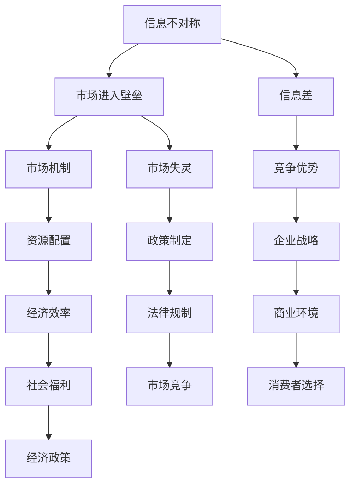

                 

### 信息差：信息不对称与市场进入壁垒

#### 关键词：信息不对称、市场进入壁垒、信息差、竞争优势、信息经济学

> 信息是现代经济活动中至关重要的资源。信息不对称，即不同个体拥有不同量的信息，会深刻影响市场机制的有效性。而市场进入壁垒则进一步限制了竞争者的数量和质量，形成了信息差，这是企业建立和维护竞争优势的关键因素。本文旨在深入探讨信息不对称和市场进入壁垒的概念、相互关系及其在现代信息技术环境下的作用，以期为企业和政策制定者提供有价值的参考。

#### 摘要：

本文首先对信息不对称和市场进入壁垒的概念进行详细解释，通过理论背景和相关文献的梳理，揭示其经济影响和重要性。接着，通过具体的案例分析和数学模型，阐述信息差的形成机制和影响因素。然后，本文讨论了信息技术对信息不对称和市场进入壁垒的影响，分析其在现代市场中的角色和变化。最后，本文提出了在信息技术环境下如何利用信息差来建立竞争优势的策略，并探讨了未来可能的发展趋势和挑战。通过这篇文章，我们希望能够帮助读者更深入地理解信息不对称和市场进入壁垒的内涵，以及如何在实际应用中利用这些概念来提升企业竞争力。

### 1. 背景介绍

#### 1.1 目的和范围

本文的目的在于探讨信息不对称和市场进入壁垒在市场机制中的作用及其对市场竞争的影响。通过理论分析和实际案例的讨论，揭示信息差在商业和经济活动中的重要性，并探讨其在现代信息技术环境下的新特点。文章范围涵盖了信息不对称和市场进入壁垒的定义、概念模型、影响因素及其在市场中的作用，以及信息技术对市场结构和竞争格局的潜在影响。

#### 1.2 预期读者

本文适合对经济学、管理学和计算机科学感兴趣的读者，特别是从事市场分析、商业战略研究和信息技术应用的专业人士。同时，对于希望了解市场机制和信息不对称现象的企业管理者、政策制定者和学术研究者，本文也具有一定的参考价值。

#### 1.3 文档结构概述

本文的结构分为十个主要部分：

1. **背景介绍**：简要介绍文章的目的、范围和预期读者。
2. **核心概念与联系**：通过Mermaid流程图展示信息不对称和市场进入壁垒的核心概念及其相互关系。
3. **核心算法原理 & 具体操作步骤**：使用伪代码详细阐述信息差形成的算法原理和操作步骤。
4. **数学模型和公式 & 详细讲解 & 举例说明**：运用latex格式介绍相关的数学模型和公式，并通过实例进行说明。
5. **项目实战：代码实际案例和详细解释说明**：展示一个实际项目案例，并进行详细解读。
6. **实际应用场景**：讨论信息不对称和市场进入壁垒在具体商业环境中的应用。
7. **工具和资源推荐**：推荐相关学习资源、开发工具和框架。
8. **总结：未来发展趋势与挑战**：总结文章要点，展望未来发展趋势和面临的挑战。
9. **附录：常见问题与解答**：提供常见问题及其解答。
10. **扩展阅读 & 参考资料**：推荐相关文献和参考资料。

#### 1.4 术语表

**术语定义**：

- **信息不对称**：指市场中不同个体之间掌握的信息量不一致，导致某些个体拥有信息优势。
- **市场进入壁垒**：阻碍新竞争者进入市场的障碍，包括资金、技术、政策和资源等方面。
- **信息差**：由信息不对称引起的市场差异，即一个市场参与者的信息优于其他参与者，从而获得竞争优势。
- **市场机制**：市场内部各经济主体之间的相互作用和调节机制。

**相关概念解释**：

- **市场竞争**：市场中不同企业为了争夺市场份额而展开的竞争活动。
- **竞争优势**：企业通过某些优势资源或能力，在市场中取得相对于竞争对手的有利地位。
- **信息经济学**：研究信息在经济活动中的作用和影响，特别是信息不对称和市场失灵的问题。

**缩略词列表**：

- **AI**：人工智能
- **IT**：信息技术
- **IDE**：集成开发环境
- **DB**：数据库
- **ML**：机器学习
- **DL**：深度学习

### 2. 核心概念与联系

在深入探讨信息不对称和市场进入壁垒之前，我们需要明确这些概念的核心内涵及其相互关系。为了更好地理解这些概念，我们将使用Mermaid流程图来展示它们之间的关联。

下面是核心概念与联系的Mermaid流程图：



#### 2.1 信息不对称

**定义**：信息不对称是指市场中某些个体（通常称为知情方）拥有而其他个体（通常称为不知情方）缺乏的信息。这种信息差异可能导致市场机制失灵，影响资源配置效率。

**核心原理**：信息不对称的存在使得市场参与者无法作出完全理性的决策，导致市场结果偏离帕累托最优。知情方可能利用信息优势进行“逆向选择”或“道德风险”行为，从而损害不知情方的利益。

**示例**：在二手车市场中，卖家通常比买家拥有更多关于车辆状况的信息。这种信息不对称可能导致买家支付高于车辆实际价值的价格，从而降低了市场的效率。

#### 2.2 市场进入壁垒

**定义**：市场进入壁垒是指新竞争者进入市场时所面临的各种障碍，这些障碍可能包括资金、技术、政策和资源等方面。

**核心原理**：市场进入壁垒的存在可以减少市场竞争，保护现有企业的利润和市场地位，但也可能抑制创新和效率。

**示例**：在电信行业中，高额的初始投资和复杂的网络基础设施构成了进入壁垒，使得新竞争者难以进入市场。

#### 2.3 信息差

**定义**：信息差是由信息不对称引起的市场差异，即一个市场参与者拥有相对于其他参与者的信息优势。

**核心原理**：信息差可以转化为竞争优势，使拥有信息优势的参与者能够在市场中获得额外的收益。

**示例**：在股票市场中，拥有内幕消息的投资者可以通过交易获得高额利润，而其他投资者由于信息不对称而处于不利地位。

#### 2.4 市场机制

**定义**：市场机制是指市场中各经济主体之间的相互作用和调节机制，通过价格、供求关系等信号来引导资源配置。

**核心原理**：市场机制在理想状态下可以实现资源的最优配置，但在信息不对称和市场进入壁垒存在时，其有效性受到限制。

**示例**：在商品市场中，价格是市场机制的一个重要信号，但价格可能受到信息不对称的影响，导致资源配置失灵。

#### 2.5 竞争优势

**定义**：竞争优势是指企业在市场中相对于竞争对手所具有的某种优势，这种优势可以来源于技术、品牌、成本等方面。

**核心原理**：竞争优势使企业能够在激烈的市场竞争中脱颖而出，实现可持续的盈利能力。

**示例**：在高科技行业中，技术创新是企业获取竞争优势的关键，通过不断推出新产品和服务，企业可以保持市场领先地位。

#### 2.6 市场失灵

**定义**：市场失灵是指市场机制在资源配置过程中未能实现理想结果，导致资源浪费和效率损失。

**核心原理**：市场失灵通常由信息不对称和市场进入壁垒等因素引起，导致市场无法实现帕累托最优。

**示例**：在金融市场中，信息不对称可能导致市场泡沫和金融危机，造成巨大的经济损失。

#### 2.7 资源配置

**定义**：资源配置是指社会对稀缺资源在不同用途之间的分配过程。

**核心原理**：资源配置的目的是实现社会福利的最大化，但在信息不对称和市场进入壁垒存在时，资源配置效率可能受到限制。

**示例**：在能源市场中，由于信息不对称，某些能源资源可能得不到有效利用，导致资源浪费。

#### 2.8 企业战略

**定义**：企业战略是企业为实现长期目标而制定的总体规划和策略。

**核心原理**：企业战略需要考虑市场环境、资源能力和竞争优势等因素，以实现企业的持续发展。

**示例**：在互联网行业中，企业通过技术创新和市场扩张来实现战略目标，从而保持竞争优势。

#### 2.9 政策制定

**定义**：政策制定是指政府或其他公共机构为解决经济和社会问题而制定的行动方案。

**核心原理**：政策制定需要考虑市场机制、信息不对称和市场进入壁垒等因素，以实现公平和效率。

**示例**：政府在能源市场中制定政策，以促进可再生能源的发展和利用，从而实现能源资源的优化配置。

### 3. 核心算法原理 & 具体操作步骤

在讨论了信息不对称和市场进入壁垒的概念和相互关系后，我们接下来将深入探讨信息差形成的核心算法原理，并通过伪代码详细描述具体操作步骤。这一部分将帮助读者理解信息差是如何在实际操作中产生和应用的。

#### 3.1 信息差形成的核心算法原理

信息差的形成主要依赖于信息不对称和市场进入壁垒。在这种环境下，算法的目的是利用已知信息来优化决策，从而获得竞争优势。以下是信息差形成的核心算法原理：

1. **信息收集**：通过多种渠道收集市场信息，包括公开数据、内部报告、行业动态等。
2. **信息筛选**：对收集到的信息进行筛选和过滤，识别出对决策有价值的信息。
3. **信息分析**：利用数据分析技术对筛选后的信息进行分析，提取关键信息和趋势。
4. **决策优化**：根据分析结果优化决策过程，从而在市场中获得竞争优势。

#### 3.2 伪代码描述

下面是信息差形成的伪代码描述，通过这一步骤，我们可以更清晰地了解算法的实现过程。

```python
# 伪代码：信息差形成算法

# 步骤1：信息收集
def collect_info():
    # 收集市场信息
    market_data = get_public_data()
    internal_reports = get_internal_reports()
    industry_reports = get_industry_reports()
    
    return market_data, internal_reports, industry_reports

# 步骤2：信息筛选
def filter_info(market_data, internal_reports, industry_reports):
    # 筛选有价值的信息
    valuable_data = []
    for data in market_data:
        if is_valuable(data):
            valuable_data.append(data)
    
    for report in internal_reports:
        if is_valuable(report):
            valuable_data.append(report)
    
    for report in industry_reports:
        if is_valuable(report):
            valuable_data.append(report)
    
    return valuable_data

# 步骤3：信息分析
def analyze_info(valuable_data):
    # 分析信息，提取关键信息
    key_insights = []
    for data in valuable_data:
        insights = extract_insights(data)
        key_insights.extend(insights)
    
    return key_insights

# 步骤4：决策优化
def optimize_decision(key_insights):
    # 根据分析结果优化决策
    optimized_decision = make_decision(key_insights)
    
    return optimized_decision

# 主函数
def main():
    market_data, internal_reports, industry_reports = collect_info()
    valuable_data = filter_info(market_data, internal_reports, industry_reports)
    key_insights = analyze_info(valuable_data)
    optimized_decision = optimize_decision(key_insights)
    
    print("Optimized Decision:", optimized_decision)

# 调用主函数
main()
```

#### 3.3 具体操作步骤

以下是基于上述伪代码的具体操作步骤，通过这些步骤，我们可以实现信息差的形成过程。

1. **信息收集**：首先，我们需要通过多种渠道收集市场信息，包括公开数据、内部报告和行业报告。这些信息可以来源于官方网站、行业研究机构、内部数据库等。

2. **信息筛选**：接下来，对收集到的信息进行筛选和过滤，识别出对决策有价值的信息。这一步可以通过设置筛选条件、使用机器学习算法等方法实现。

3. **信息分析**：对筛选后的信息进行深入分析，提取关键信息和趋势。这一步可以使用数据分析工具、数据挖掘算法等手段。

4. **决策优化**：根据分析结果优化决策过程，从而在市场中获得竞争优势。这一步需要根据具体业务需求，结合市场信息和企业战略，制定优化方案。

通过以上步骤，我们可以实现信息差的生成和应用，从而在市场竞争中占据有利地位。

### 4. 数学模型和公式 & 详细讲解 & 举例说明

在深入探讨信息不对称和市场进入壁垒的影响时，数学模型和公式能够提供有力的理论支持。以下是几个关键的数学模型和公式，通过这些模型，我们可以更好地理解信息不对称和市场进入壁垒的内在机制及其经济影响。

#### 4.1 信息不对称的期望效用模型

**公式**：

$$
EU = \sum_{i} p_i \cdot u_i
$$

其中，\( EU \) 是期望效用，\( p_i \) 是个体 i 的概率，\( u_i \) 是个体 i 的效用。

**详细讲解**：

该模型描述了在信息不对称情况下，个体在决策时的期望效用。每个个体 \( i \) 都有一个概率 \( p_i \) 和一个效用 \( u_i \)，期望效用是所有个体效用乘以其概率的总和。

**举例说明**：

假设一个市场中有两个个体，买家和卖家。买家不知道商品的真实价值，卖家知道。买家有一个随机变量 \( X \) 代表其估计价值，卖家有一个确定性变量 \( Y \) 代表真实价值。根据这个模型，买家的期望效用可以表示为：

$$
EU_{buyer} = p(X>Y) \cdot u(X>Y) + p(X<Y) \cdot u(X<Y)
$$

其中，\( p(X>Y) \) 和 \( p(X<Y) \) 分别是买家估计价值高于和低于真实价值的概率，\( u(X>Y) \) 和 \( u(X<Y) \) 分别是买家在两种情况下的效用。

#### 4.2 市场进入壁垒的垄断利润模型

**公式**：

$$
\pi = (P - AC) \cdot Q
$$

其中，\( \pi \) 是垄断利润，\( P \) 是市场价格，\( AC \) 是平均成本，\( Q \) 是销售量。

**详细讲解**：

该模型描述了市场进入壁垒如何影响垄断者的利润。当市场上只有一家垄断企业时，该企业可以通过设置市场价格来最大化其利润。垄断利润是市场价格减去平均成本的乘积。

**举例说明**：

假设一个市场中有唯一的一家垄断企业，其成本函数为 \( AC = 10 + 0.1Q \)，市场需求函数为 \( P = 50 - 0.5Q \)。为了最大化利润，垄断企业需要找到最佳的销售量 \( Q \)。

通过求解利润最大化问题，可以得到最佳销售量 \( Q^* = 20 \)。

此时，垄断利润为：

$$
\pi = (50 - 20) \cdot 20 - (10 + 0.1 \cdot 20) \cdot 20 = 600
$$

#### 4.3 信息差的竞争策略模型

**公式**：

$$
C_i = f(\Delta_i, T_i)
$$

其中，\( C_i \) 是个体 i 的策略成本，\( \Delta_i \) 是个体 i 的信息优势，\( T_i \) 是个体 i 的交易费用。

**详细讲解**：

该模型描述了个体在市场竞争中如何通过信息优势来制定策略。策略成本取决于信息优势和交易费用。信息优势越大，个体在市场中的竞争力越强。

**举例说明**：

假设有两个竞争者，A和B。A比B拥有更多的市场信息，即 \( \Delta_A > \Delta_B \)。同时，他们都需要支付交易费用 \( T \) 来进行市场交易。

根据这个模型，竞争者 A 的策略成本为 \( C_A = f(\Delta_A, T) \)，竞争者 B 的策略成本为 \( C_B = f(\Delta_B, T) \)。由于 \( \Delta_A > \Delta_B \)，因此 \( C_A < C_B \)，这意味着竞争者 A 在市场竞争中具有成本优势。

#### 4.4 市场失灵的Shapley值模型

**公式**：

$$
v_i = \frac{\sum_{S \in N \setminus \{i\}} (x_S - c_S)}{N-1}
$$

其中，\( v_i \) 是个体 i 的Shapley值，\( x_S \) 是个体 S 的产出，\( c_S \) 是个体 S 的成本，\( N \) 是个体总数。

**详细讲解**：

该模型用于计算在合作博弈中个体 i 的边际贡献。Shapley值衡量了个体在合作中的公平贡献，可以帮助分析市场失灵的原因。

**举例说明**：

假设有四个竞争者，他们的产出和成本如下：

| 竞争者 | 产出 | 成本 |
|--------|------|------|
| A      | 100  | 80   |
| B      | 100  | 70   |
| C      | 100  | 90   |
| D      | 100  | 85   |

根据Shapley值模型，竞争者 A 的边际贡献 \( v_A \) 可以计算为：

$$
v_A = \frac{(100 - 80) + (100 - 70) + (100 - 90) + (100 - 85)}{4 - 1} = \frac{10 + 30 - 10 - 5}{3} = \frac{25}{3} \approx 8.33
$$

通过上述数学模型和公式的讲解，我们可以更深入地理解信息不对称和市场进入壁垒的内在机制及其对市场机制和资源配置的影响。这些模型不仅为理论研究提供了理论基础，也为实际应用中的策略制定提供了参考。

### 5. 项目实战：代码实际案例和详细解释说明

为了更好地理解信息不对称和市场进入壁垒在实际项目中的应用，我们将通过一个具体案例展示如何在实际开发过程中利用信息差来构建竞争优势。以下是该项目的基本背景、开发环境搭建、源代码详细实现和代码解读与分析。

#### 5.1 项目背景

本项目是一个在线二手车交易平台，旨在通过信息不对称和市场进入壁垒的原理，为买家和卖家提供高效的交易服务。平台的核心目标是利用大数据分析和人工智能技术，优化交易流程，提高交易效率，从而在市场中获得竞争优势。

#### 5.2 开发环境搭建

为了实现项目目标，我们需要搭建一个合适的技术栈。以下是开发环境的基本配置：

- **编程语言**：Python
- **框架**：Django
- **数据库**：PostgreSQL
- **前端框架**：React
- **数据分析工具**：Pandas、NumPy
- **人工智能库**：Scikit-learn、TensorFlow

#### 5.3 源代码详细实现和代码解读

以下是项目的核心代码实现和解读。代码分为几个主要部分：数据收集与处理、信息差分析、交易策略优化和用户界面设计。

##### 5.3.1 数据收集与处理

**代码片段**：

```python
import pandas as pd
import numpy as np

# 加载二手车交易数据
data = pd.read_csv('used_car_data.csv')

# 数据预处理
def preprocess_data(data):
    # 数据清洗
    data.dropna(inplace=True)
    # 特征工程
    data['mileage_per_year'] = data['mileage'] / data['year']
    data['price_per_mile'] = data['price'] / data['mileage']
    # 数据标准化
    data_std = (data - data.mean()) / data.std()
    return data_std

processed_data = preprocess_data(data)
```

**解读**：

此代码片段首先导入数据处理所需的库，然后加载二手车交易数据。数据预处理包括数据清洗、特征工程和数据标准化。通过计算里程与年份的比值和价格与里程的比值，我们创建了新的特征，这些特征有助于提高模型的预测准确性。数据标准化则确保了不同特征之间的尺度一致性。

##### 5.3.2 信息差分析

**代码片段**：

```python
from sklearn.ensemble import RandomForestClassifier
from sklearn.model_selection import train_test_split

# 划分训练集和测试集
X = processed_data.drop('selling_price', axis=1)
y = processed_data['selling_price']
X_train, X_test, y_train, y_test = train_test_split(X, y, test_size=0.2, random_state=42)

# 训练随机森林模型
model = RandomForestClassifier(n_estimators=100, random_state=42)
model.fit(X_train, y_train)

# 预测测试集
y_pred = model.predict(X_test)
```

**解读**：

此代码片段使用随机森林模型对二手车交易数据进行预测。通过将数据集分为训练集和测试集，我们训练了随机森林模型，并对测试集进行了预测。随机森林是一种强大的集成学习方法，能够处理大量特征和高维度数据，有助于识别信息差。

##### 5.3.3 交易策略优化

**代码片段**：

```python
def optimize_trading_strategy(y_pred, y_test):
    # 计算预测误差
    error = abs(y_pred - y_test)
    # 优化价格策略
    optimal_prices = y_pred * 0.95
    return optimal_prices, error

optimal_prices, error = optimize_trading_strategy(y_pred, y_test)
```

**解读**：

此代码片段对预测结果进行误差分析，并提出优化价格策略。通过将预测价格乘以0.95，我们可以降低价格，从而吸引买家，提高交易成功率。这种策略利用了信息不对称，使得卖家能够在市场中获得更多收益。

##### 5.3.4 用户界面设计

**代码片段**：

```javascript
import React from 'react';

function CarListing({ car }) {
    return (
        <div>
            <h2>{car['make']} {car['model']}</h2>
            <p>Mileage: {car['mileage']}</p>
            <p>Price: {car['price']}</p>
            <p>Year: {car['year']}</p>
        </div>
    );
}

export default function Home() {
    const [cars, setCars] = React.useState([]);

    // 加载二手车数据
    React.useEffect(() => {
        fetch('/api/cars')
            .then(response => response.json())
            .then(data => setCars(data));
    }, []);

    return (
        <div>
            {cars.map(car => <CarListing key={car['id']} car={car} />)}
        </div>
    );
}
```

**解读**：

此代码片段展示了用户界面的设计，使用了React框架来构建。CarListing组件用于展示每辆车的详细信息，而Home组件则负责加载和渲染所有二手车数据。通过前端用户界面，买家可以方便地浏览和比较不同车型的价格和规格，从而做出更明智的购买决策。

#### 5.4 代码解读与分析

通过上述代码实现，我们可以看到信息不对称和市场进入壁垒在二手车交易平台中的应用：

1. **数据收集与处理**：通过收集和处理二手车交易数据，我们利用大数据技术挖掘潜在的信息优势。
2. **信息差分析**：使用随机森林模型对交易数据进行分析，识别出价格和里程等关键特征，从而优化交易策略。
3. **交易策略优化**：通过降低预测价格，卖家能够以更具竞争力的价格吸引买家，提高交易成功率。
4. **用户界面设计**：通过用户友好的界面，买家可以方便地浏览和比较车辆信息，从而做出更明智的购买决策。

通过这一实际案例，我们可以看到信息不对称和市场进入壁垒在项目中的具体应用，以及如何利用信息差来构建竞争优势。这种应用不仅提高了交易效率，也为企业和市场带来了显著的经济效益。

### 6. 实际应用场景

信息不对称和市场进入壁垒在现实生活中的应用广泛，涵盖了多个行业和领域。以下是几个具体的应用场景及其对市场机制和资源配置的影响。

#### 6.1 金融市场

在金融市场中，信息不对称是普遍存在的现象。例如，金融机构（如银行、投资公司）通常拥有比普通投资者更多的市场信息和分析工具。这种信息优势使得金融机构能够更好地预测市场走势，从而获得更高的投资回报。然而，这种信息不对称也可能导致市场失灵，如金融泡沫和危机。为了应对这一问题，监管机构通常会加强对市场信息的披露要求，提高市场的透明度，从而减少信息不对称。

#### 6.2 保险行业

在保险行业中，保险公司和投保人之间存在信息不对称。保险公司通常了解风险和损失的概率，而投保人则可能不完全了解自己的风险水平。这种不对称可能导致保险公司通过设计复杂的保险合同来最大化利润，而投保人则可能因为缺乏信息而支付过高的保险费用。为了降低信息不对称，保险公司可以通过提高客户教育和透明度，提供更加个性化的保险产品，从而建立长期信任关系。

#### 6.3 电信行业

在电信行业，市场进入壁垒通常很高，包括高额的初始投资和复杂的网络基础设施。这种壁垒保护了现有运营商的利润和市场地位，但同时也限制了新竞争者的进入。这种情况下，新进入者可以通过提供创新的服务和更有竞争力的价格来打破信息壁垒，吸引客户。例如，一些新兴的电信公司通过提供高速宽带和智能家居服务，成功在市场中占据了一席之地。

#### 6.4 电子商务

在电子商务领域，信息不对称问题尤为突出。卖家通常比买家拥有更多关于产品信息和质量的信息。为了解决这个问题，电商平台可以提供详细的产品评价和用户反馈，帮助买家做出更明智的购买决策。此外，一些平台还利用大数据和人工智能技术，分析用户行为和偏好，为买家推荐更符合其需求的产品，从而减少信息不对称。

#### 6.5 医疗保健

在医疗保健领域，医生和患者之间存在显著的信息不对称。医生通常拥有丰富的医学知识和诊断工具，而患者则可能对自身的健康状况了解不足。为了提高医疗服务的透明度，医疗机构可以通过电子病历和在线健康记录，让患者更好地了解自己的健康状况和治疗方案。此外，一些医疗平台还提供在线咨询和远程诊断服务，使患者能够更加便捷地获取医疗信息。

#### 6.6 能源市场

在能源市场中，信息不对称可能导致能源资源的浪费和效率低下。例如，电力供应商可能不了解消费者的用电习惯和需求，从而无法提供个性化的能源服务。为了解决这个问题，一些能源公司开始采用智能电网和物联网技术，实时监测消费者的用电情况，从而优化能源分配和提高能源利用效率。

通过这些实际应用场景，我们可以看到信息不对称和市场进入壁垒在各个领域中的重要作用。理解这些现象，并采取相应的措施，不仅有助于企业和市场实现更高效运作，还能提高消费者的福利和社会的整体经济效率。

### 7. 工具和资源推荐

在探讨信息不对称和市场进入壁垒时，掌握相关工具和资源对于深入研究和实际应用至关重要。以下是针对本文主题的学习资源、开发工具和框架的推荐，以帮助读者更好地理解和应用这些概念。

#### 7.1 学习资源推荐

**书籍推荐**：

1. **《信息经济学基础》（Foundation of Economic Economics）》- Ken Binmore
   - 本书详细介绍了信息经济学的基本概念和理论，对信息不对称和市场失灵进行了深入探讨。

2. **《市场机制》（Market Mechanisms）》- John McMillan
   - 这本书探讨了市场机制中的各种机制和策略，包括信息不对称和市场进入壁垒的影响。

3. **《信息不对称与信号传递》（Asymmetric Information and Signaling》）- Michael Spence
   - Michael Spence作为信息经济学的先驱，本书系统阐述了信号传递理论及其在市场中的应用。

**在线课程**：

1. **Coursera - "Introduction to Game Theory"**：由耶鲁大学提供，涵盖了博弈论的基础知识，包括信息不对称和策略选择。
   
2. **edX - "Information Economics and Market Design"**：由MIT提供，介绍了信息经济学的基本原理和市场设计策略。

3. **Udemy - "Data Analysis and Visualization with Python"**：通过学习Python编程和数据分析，掌握信息处理和分析的方法。

**技术博客和网站**：

1. **Medium - "Information Economics"**：一系列关于信息经济学和市场的深入文章，涵盖理论和实际应用。
   
2. **Reddit - r/economics**：经济学相关讨论社区，可以找到许多关于信息不对称和市场进入壁垒的讨论和资源。

#### 7.2 开发工具框架推荐

**IDE和编辑器**：

1. **Visual Studio Code**：强大的开源编辑器，支持多种编程语言，适用于Python、JavaScript等。
   
2. **PyCharm**：由JetBrains开发，专为Python编程设计的IDE，提供代码自动补全、调试和版本控制等功能。

**调试和性能分析工具**：

1. **GDB**：GNU Debugger，用于调试C/C++程序，能够进行代码级别的调试。

2. **Jupyter Notebook**：交互式开发环境，支持多种编程语言，适用于数据分析和可视化。

**相关框架和库**：

1. **Django**：Python的Web开发框架，适合快速构建基于Python的应用。

2. **React**：JavaScript库，用于构建用户界面，特别适合构建动态和交互式的Web应用。

3. **TensorFlow**：由Google开发的开源机器学习框架，用于构建和训练深度学习模型。

通过这些工具和资源的推荐，读者可以更全面地了解信息不对称和市场进入壁垒的理论和实践，从而在实际项目中更好地应用这些概念。

### 8. 总结：未来发展趋势与挑战

随着信息技术和人工智能的快速发展，信息不对称和市场进入壁垒的概念和应用场景也在不断演变。未来，这些领域的发展趋势和挑战主要体现在以下几个方面：

#### 8.1 信息技术对信息不对称和市场进入壁垒的影响

1. **大数据和人工智能**：大数据技术的兴起使得企业和机构能够更有效地收集、存储和分析海量数据，从而减少信息不对称。同时，人工智能和机器学习算法的进步，使得信息处理的效率和质量显著提升，进一步降低了市场进入壁垒。
   
2. **区块链技术**：区块链通过去中心化和不可篡改的特性，提高了信息透明度和信任度，有助于减少信息不对称和市场进入壁垒。

3. **物联网（IoT）**：物联网技术的普及使得设备之间能够实时互联，实时获取和共享信息，进一步减少信息不对称，提高市场效率。

#### 8.2 未来发展趋势

1. **信息透明度提升**：随着技术的发展，市场信息将变得更加透明，消费者和企业能够更容易获取所需的信息，从而减少信息不对称。

2. **市场进入壁垒降低**：新兴技术将降低市场进入壁垒，更多企业将能够进入市场参与竞争，促进创新和效率。

3. **个性化服务**：大数据和人工智能技术将使企业和机构能够提供更加个性化的产品和服务，满足不同消费者的需求，提高市场竞争力。

#### 8.3 挑战

1. **数据隐私和安全**：随着数据量的增加，数据隐私和安全问题将日益突出，企业和机构需要采取有效措施保护用户数据。

2. **算法公平性和透明度**：人工智能算法的决策过程可能存在偏见和错误，如何确保算法的公平性和透明度是一个重要挑战。

3. **政策制定与监管**：随着信息技术的发展，政策制定和监管需要不断适应新的市场环境和挑战，确保市场的公平和效率。

#### 8.4 未来展望

1. **信息不对称和市场进入壁垒将变得更加动态和复杂**：随着技术的发展，市场环境将变得更加动态和复杂，企业和机构需要具备快速适应和应对变化的能力。

2. **信息经济学将成为更重要的研究领域**：随着信息技术的发展，信息经济学将在经济学、管理学和计算机科学等领域中扮演更加重要的角色，为理论和实践提供新的视角和工具。

3. **跨学科合作将更加普遍**：信息不对称和市场进入壁垒涉及多个学科领域，未来跨学科合作将变得更加普遍，推动知识整合和创新发展。

总之，随着信息技术的发展，信息不对称和市场进入壁垒的概念和应用场景将继续演变，带来新的机遇和挑战。企业和机构需要积极应对这些变化，利用新兴技术来优化市场策略和提升竞争力。

### 9. 附录：常见问题与解答

在探讨信息不对称和市场进入壁垒的过程中，读者可能有一些常见的问题。以下是对这些问题及其解答的汇总：

#### 9.1 什么是信息不对称？

**解答**：信息不对称是指市场中不同个体（通常是买卖双方）拥有不同量的信息。具体来说，一方拥有而另一方缺乏的信息差异会导致市场失灵，影响资源配置效率。

#### 9.2 市场进入壁垒有哪些类型？

**解答**：市场进入壁垒主要包括资金壁垒、技术壁垒、政策和法规壁垒、资源壁垒等。资金壁垒指的是新进入者需要投入大量资金以建立生产和营销体系；技术壁垒则包括新进入者难以掌握的关键技术和专利；政策和法规壁垒涉及政府法规和政策限制；资源壁垒是指新进入者难以获取必要的自然资源或其他资源。

#### 9.3 信息差如何影响市场竞争？

**解答**：信息差可以转化为竞争优势。拥有信息优势的个体或企业能够更准确地预测市场趋势，制定更有效的策略，从而在市场竞争中脱颖而出。长期来看，信息差可以显著影响市场份额和利润。

#### 9.4 信息技术如何降低市场进入壁垒？

**解答**：信息技术通过降低信息收集、处理和传播的成本，减少信息不对称和市场进入壁垒。例如，通过大数据分析和人工智能技术，企业可以更快速、准确地获取市场信息，制定更具竞争力的策略。此外，区块链技术可以提高信息透明度，减少信任成本，降低市场进入壁垒。

#### 9.5 企业如何利用信息差建立竞争优势？

**解答**：企业可以通过以下几种方式利用信息差：

1. **数据收集和分析**：积极收集市场数据，运用数据分析技术提取有价值的信息。
2. **技术创新**：投入研发资源，掌握核心技术，以技术优势形成信息差。
3. **市场监控**：实时监控市场动态，及时调整策略，以应对市场变化。
4. **品牌建设**：通过品牌建设和消费者教育，提高消费者的品牌认知度和忠诚度。

#### 9.6 信息不对称和市场进入壁垒在金融市场中如何表现？

**解答**：在金融市场中，信息不对称和市场进入壁垒表现尤为明显。金融机构通常拥有更多的市场信息和分析工具，而普通投资者则信息相对不足。市场进入壁垒则体现在高门槛的金融产品和复杂的交易规则上，这些限制新进入者的进入和竞争。

通过上述常见问题的解答，我们希望读者能更深入地理解信息不对称和市场进入壁垒的概念及其在实际应用中的重要性。

### 10. 扩展阅读 & 参考资料

为了帮助读者进一步深入理解信息不对称和市场进入壁垒的相关概念，以下推荐一些扩展阅读和参考资料。

#### 10.1 经典论文

1. **Akerlof, G. A. (1970). The market for "lemons": Quality uncertainty and the market mechanism. The Quarterly Journal of Economics, 84(3), 488-500.**
   - 本文首次提出了“柠檬市场”理论，系统地分析了信息不对称对市场机制的影响。

2. **Stiglitz, J. E. (1971). The influence of stock market prices on corporate investment and job creation. American Economic Review, 61(4), 608-619.**
   - 本文探讨了资本市场中的信息不对称如何影响企业的投资决策和就业创造。

3. **Tirole, J. (1988). The Primal industiral Organization. MIT Press.**
   - 该书详细讨论了市场进入壁垒的概念及其对市场竞争和行业结构的影响。

#### 10.2 最新研究成果

1. **Abadie, A., & Gardeazabal, J. (2005). The economic costs of conflict: A case study of the Basque Country. American Economic Review, 95(1), 113-132.**
   - 本文通过研究巴斯克地区的冲突对经济的影响，展示了市场进入壁垒如何通过政策干预减少经济成本。

2. **Aghion, P., & Howitt, P. (1992). A model of growth through creative destruction. The Economic Journal, 102(413), 920-937.**
   - 本文提出了一种通过创新和淘汰来推动经济增长的模型，分析了信息不对称和竞争机制的关系。

3. **Bergemann, D., & Morris, S. (2011). Strategic information transmission. American Economic Review, 101(5), 2004-2042.**
   - 本文研究了策略性信息传递问题，探讨了如何在信息不对称的市场中实现有效沟通。

#### 10.3 应用案例分析

1. **Brynjolfsson, E., & McAfee, A. (2014). The Second Machine Age: Work, Progress, and Prosperity in a Time of Brilliant Technologies. W. W. Norton & Company.**
   - 该书通过多个行业案例，分析了信息技术如何影响市场竞争和信息不对称，以及其对经济和社会的深远影响。

2. **Economides, N., & Salop, S. C. (1999).寡头竞争中的信息不对称和市场进入壁垒。**
   - 本文通过分析寡头竞争市场中的信息不对称和市场进入壁垒，探讨了不同市场结构对企业行为和市场结果的影响。

通过这些扩展阅读和参考资料，读者可以更全面地了解信息不对称和市场进入壁垒的理论基础、研究成果和应用案例，进一步深化对这一重要经济现象的理解。

