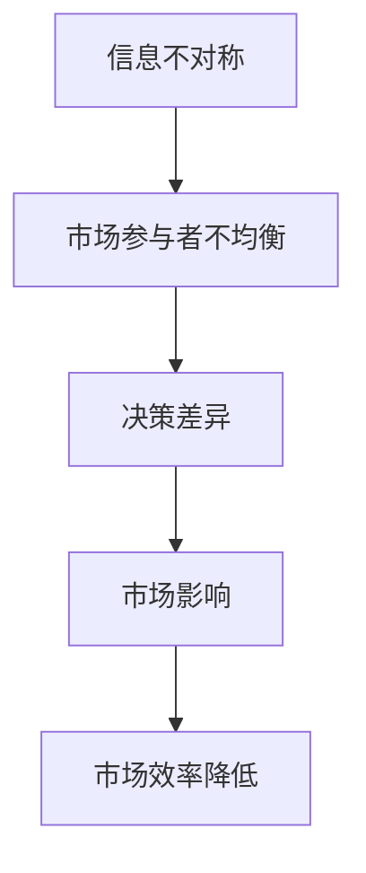
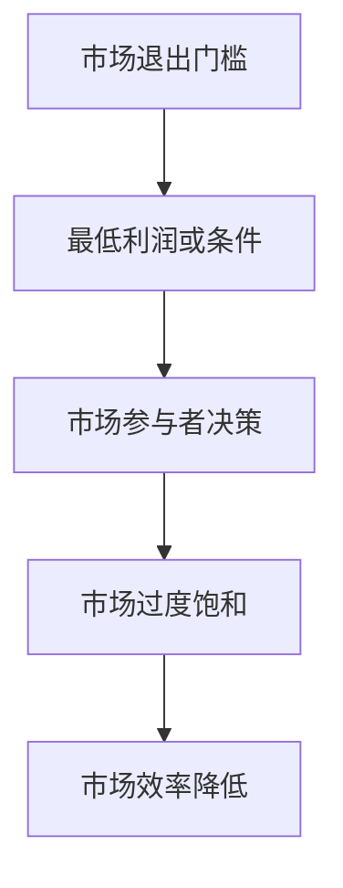
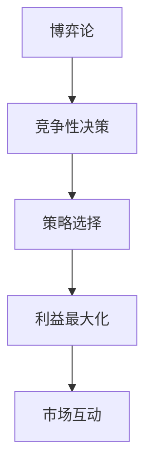
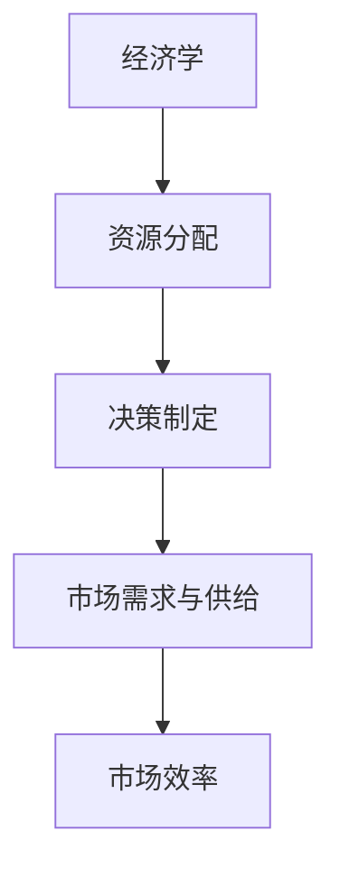

                 

### 信息差：信息不对称与市场退出门槛

#### 关键词：信息差，信息不对称，市场退出门槛，博弈论，经济学，人工智能

> **摘要：** 本篇文章将深入探讨信息不对称现象在市场中的影响，以及它如何构建和打破市场退出门槛。我们将从经济学和博弈论的视角出发，结合人工智能技术的应用，逐步分析信息差的核心概念，探讨其在现实市场中的应用和影响，以及未来可能的发展趋势。文章将分为以下几个部分：背景介绍、核心概念与联系、核心算法原理与具体操作步骤、数学模型和公式、项目实战、实际应用场景、工具和资源推荐、总结与未来发展趋势以及常见问题与解答。希望通过本文的详细阐述，读者能够对信息不对称和市场退出门槛有更深入的理解。

### 背景介绍

#### 1.1 目的和范围

信息不对称是经济学和博弈论中的一个重要概念，它涉及到市场参与者之间的信息不均衡。本篇文章旨在探讨信息不对称现象在市场中的影响，以及它如何构建和打破市场退出门槛。文章将结合经济学和博弈论的视角，深入分析信息不对称的核心概念，探讨其在现实市场中的应用和影响。此外，文章还将结合人工智能技术的应用，探讨未来信息不对称现象的发展趋势。

#### 1.2 预期读者

本篇文章主要面向对经济学、博弈论和人工智能技术有一定了解的读者。对于希望了解信息不对称现象在市场中的影响，以及如何构建和打破市场退出门槛的读者，本文将提供有价值的参考。同时，对于对人工智能技术有浓厚兴趣的读者，本文也将探讨人工智能在解决信息不对称问题中的应用，提供新的视角。

#### 1.3 文档结构概述

本文将分为以下几个部分：

1. 背景介绍：介绍文章的目的、范围、预期读者以及文档结构。
2. 核心概念与联系：阐述信息不对称的核心概念，并绘制 Mermaid 流程图。
3. 核心算法原理与具体操作步骤：详细分析信息不对称现象的算法原理和操作步骤，使用伪代码进行阐述。
4. 数学模型和公式：介绍与信息不对称相关的数学模型和公式，并进行详细讲解。
5. 项目实战：通过代码实际案例，展示如何运用信息不对称原理解决具体问题。
6. 实际应用场景：分析信息不对称在现实市场中的应用和影响。
7. 工具和资源推荐：推荐相关学习资源和开发工具。
8. 总结与未来发展趋势：总结文章的主要观点，探讨未来发展趋势。
9. 常见问题与解答：解答读者可能提出的问题。
10. 扩展阅读与参考资料：提供进一步的阅读资料。

#### 1.4 术语表

在本篇文章中，我们将使用一些专业的术语和概念。以下是对这些术语和概念的定义和解释：

##### 1.4.1 核心术语定义

- 信息不对称：市场参与者之间在信息获取方面存在的不均衡现象。
- 市场退出门槛：市场参与者为了退出市场所需要达到的最低利润或条件。
- 博弈论：研究具有竞争性的决策过程的数学理论。
- 经济学：研究资源分配和决策制定的科学。

##### 1.4.2 相关概念解释

- 信息优势：市场参与者拥有比其他参与者更多的信息。
- 信息劣势：市场参与者拥有比其他参与者更少的信息。
- 信息对称：市场参与者之间的信息获取是均衡的。

##### 1.4.3 缩略词列表

- AI：人工智能
- SEO：搜索引擎优化
- ML：机器学习
- VR：虚拟现实
- AR：增强现实

### 核心概念与联系

在探讨信息不对称现象在市场中的影响之前，我们首先需要了解几个核心概念，包括信息不对称、市场退出门槛、博弈论和经济学。以下是这些概念之间的联系及其在 Mermaid 流程图中的表示。

#### 2.1.1 信息不对称

信息不对称是指市场参与者之间在信息获取方面存在的不均衡现象。这种不均衡可能导致市场参与者做出不同的决策，从而影响市场的运行。例如，在金融市场中，卖家可能比买家拥有更多的关于产品质量的信息，这可能导致买家对产品质量产生怀疑，从而影响交易。



#### 2.1.2 市场退出门槛

市场退出门槛是指市场参与者为了退出市场所需要达到的最低利润或条件。当市场退出门槛较高时，市场参与者可能会选择继续留在市场中，而不是退出。这种现象可能导致市场过度饱和，进而影响市场效率。



#### 2.1.3 博弈论

博弈论是一种研究具有竞争性的决策过程的数学理论。在博弈论中，参与者需要根据其他参与者的策略来制定自己的策略。博弈论可以帮助我们理解市场参与者之间的互动，以及他们如何通过策略选择来最大化自己的利益。



#### 2.1.4 经济学

经济学是研究资源分配和决策制定的科学。在经济学中，市场参与者需要根据市场需求和供给来制定决策。经济学原理可以帮助我们理解市场退出门槛的制定和市场效率的提高。



通过以上 Mermaid 流程图，我们可以清晰地看到信息不对称、市场退出门槛、博弈论和经济学之间的联系。这些概念相互影响，共同决定了市场的运行状态和效率。接下来，我们将进一步探讨这些概念的具体应用和影响。

### 核心算法原理与具体操作步骤

在深入探讨信息不对称现象的算法原理之前，我们需要了解一些基本的算法概念，包括信息优势、信息劣势和信息对称。这些概念将帮助我们更好地理解信息不对称现象在市场中的应用。

#### 3.1.1 信息优势

信息优势是指市场参与者拥有比其他参与者更多的信息。这种信息优势可以使市场参与者做出更准确的决策，从而获得更高的收益。例如，在金融市场中，某些投资者可能拥有关于某只股票的更多信息，这使得他们能够更好地预测股票的走势，从而获得更高的投资回报。

#### 3.1.2 信息劣势

信息劣势是指市场参与者拥有比其他参与者更少的信息。这种信息劣势可能导致市场参与者做出错误的决策，从而遭受损失。例如，在消费品市场中，消费者可能无法获取到足够的产品信息，从而无法做出明智的购买决策。

#### 3.1.3 信息对称

信息对称是指市场参与者之间的信息获取是均衡的。在信息对称的市场中，所有市场参与者都能获取到相同的信息，这使得市场运行更加高效。然而，在实际市场中，信息对称往往是难以实现的。

接下来，我们将使用伪代码来详细阐述信息不对称现象的算法原理和操作步骤。

```python
# 信息不对称算法原理伪代码

# 输入：市场参与者集合P，信息集合I
# 输出：市场参与者决策集合D

# 初始化
participant_list = P
information_set = I
decision_set = D

# 步骤1：计算每个参与者的信息优势
info_advantage = {}
for participant in participant_list:
    info_advantage[participant] = calculate_info_advantage(participant, information_set)

# 步骤2：根据信息优势制定决策
for participant in participant_list:
    if info_advantage[participant] > 0:
        decision_set[participant] = make_decision_with_advantage(participant, info_advantage[participant])
    else:
        decision_set[participant] = make_decision_without_advantage(participant, info_advantage[participant])

# 步骤3：计算市场总体决策
market_decision = calculate_market_decision(decision_set)

# 输出市场总体决策
print(market_decision)
```

在上述伪代码中，我们首先初始化市场参与者集合、信息集合和决策集合。然后，我们计算每个参与者的信息优势，并据此制定决策。最后，我们计算市场总体决策。

#### 3.1.4 步骤详细解释

- **步骤1**：计算每个参与者的信息优势。这是信息不对称算法的核心步骤。通过计算每个参与者的信息优势，我们可以了解他们在市场中的相对优势。
- **步骤2**：根据信息优势制定决策。根据每个参与者的信息优势，他们可以制定更有利的决策。信息优势较大的参与者可能会采取更为积极的策略，而信息优势较小的参与者可能会采取更为保守的策略。
- **步骤3**：计算市场总体决策。市场总体决策是所有参与者决策的汇总。通过计算市场总体决策，我们可以了解市场整体的运行状态。

通过以上步骤，我们可以实现一个基于信息不对称现象的算法。这个算法可以帮助市场参与者制定更为合理的决策，从而提高市场效率。

### 数学模型和公式

在讨论信息不对称现象时，数学模型和公式起着至关重要的作用。这些模型和公式可以帮助我们更精确地描述信息不对称现象，并分析其在市场中的应用。在本节中，我们将介绍几个与信息不对称相关的数学模型和公式，并进行详细讲解。

#### 4.1.1 信息不对称模型

信息不对称模型是研究市场参与者之间信息不均衡现象的数学模型。一个经典的信息不对称模型是阿克洛夫（Akerlof）提出的市场均衡模型。该模型通过一个简单的供需模型来描述信息不对称现象。

假设市场中存在两种商品：高质量商品和低质量商品。卖家知道商品的实际质量，但买家无法判断商品的质量。卖家以固定的价格出售商品，而买家只能根据市场价格来判断商品的质量。这个模型可以用以下公式表示：

$$
Q_d = Q_s - \epsilon \cdot P
$$

其中，$Q_d$ 表示买家愿意购买的商品数量，$Q_s$ 表示卖家愿意出售的商品数量，$\epsilon$ 表示买家对商品质量的判断误差，$P$ 表示商品价格。

#### 4.1.2 博弈论模型

博弈论模型是研究市场参与者之间策略互动的数学模型。在博弈论中，市场参与者需要根据其他参与者的策略来制定自己的策略，以最大化自己的收益。一个经典的博弈论模型是纳什均衡（Nash Equilibrium）。纳什均衡是指在博弈中，所有参与者都不愿改变自己的策略，因为任何单方面的策略调整都会导致自己的收益减少。

假设市场中存在两个参与者：买家和卖家。买家有两种策略：购买高质量商品或购买低质量商品。卖家有两种策略：出售高质量商品或出售低质量商品。这个博弈可以用以下矩阵表示：

| 策略       | 买家购买高质量商品 | 买家购买低质量商品 |
|------------|----------------------|---------------------|
| 卖家出售高质量商品 | （高利润，高利润）  | （低利润，高利润）  |
| 卖家出售低质量商品 | （高利润，低利润）  | （低利润，低利润）  |

在这个博弈中，纳什均衡是卖家出售高质量商品，买家购买高质量商品。这是因为，无论买家选择购买高质量商品还是低质量商品，卖家都更愿意出售高质量商品，因为这样能够获得更高的利润。

#### 4.1.3 经济学模型

经济学模型是研究市场参与者如何根据市场需求和供给来制定决策的数学模型。一个经典的经济学模型是供需模型。供需模型描述了市场价格和需求量之间的关系。

假设市场上存在一种商品，其市场需求量由以下公式表示：

$$
Q_d = a - b \cdot P
$$

其中，$Q_d$ 表示市场需求量，$a$ 表示市场需求的最大值，$b$ 表示需求对价格的敏感度，$P$ 表示商品价格。

同时，商品供给量由以下公式表示：

$$
Q_s = c + d \cdot P
$$

其中，$Q_s$ 表示市场供给量，$c$ 表示市场供给的最小值，$d$ 表示供给对价格的敏感度，$P$ 表示商品价格。

供需模型可以帮助我们分析市场价格和需求量之间的关系，以及市场参与者如何根据供需情况来制定决策。

#### 4.1.4 举例说明

为了更好地理解这些数学模型和公式，我们来看一个实际的例子。假设市场中存在一种商品，市场需求函数为：

$$
Q_d = 100 - 2 \cdot P
$$

市场需求的最大值为 100，需求对价格的敏感度为 2。市场供给函数为：

$$
Q_s = 50 + 3 \cdot P
$$

市场供给的最小值为 50，供给对价格的敏感度为 3。

我们可以通过以下步骤来分析这个例子：

1. 计算市场价格：将市场需求函数和供给函数相等，得到市场价格。

$$
100 - 2 \cdot P = 50 + 3 \cdot P
$$

解这个方程，得到市场价格 $P = 20$。

2. 计算市场需求量：将市场价格代入市场需求函数，得到市场需求量。

$$
Q_d = 100 - 2 \cdot 20 = 60
$$

3. 计算市场供给量：将市场价格代入市场供给函数，得到市场供给量。

$$
Q_s = 50 + 3 \cdot 20 = 110
$$

在这个例子中，市场价格为 20，市场需求量为 60，市场供给量为 110。这个结果说明了市场需求量小于市场供给量，这意味着市场上存在过剩的商品。

通过这个例子，我们可以看到数学模型和公式在分析信息不对称现象和市场运行状态方面的应用。这些模型和公式不仅可以帮助我们理解信息不对称现象，还可以为市场参与者提供决策依据。

### 项目实战：代码实际案例和详细解释说明

在了解了信息不对称现象的算法原理和数学模型后，我们将通过一个实际项目案例来展示如何运用这些原理来解决具体问题。这个项目将模拟一个二手商品交易市场，其中买家和卖家之间存在信息不对称现象。我们将使用 Python 编程语言来构建这个项目，并详细解释代码实现和原理。

#### 5.1 开发环境搭建

为了构建这个项目，我们需要准备以下开发环境和工具：

- Python 3.8 或更高版本
- PyCharm 或其他 Python 编程环境
- requests 库（用于网络请求）
- pandas 库（用于数据处理）
- matplotlib 库（用于数据可视化）

确保安装了上述环境和工具后，我们可以开始编写代码。

#### 5.2 源代码详细实现和代码解读

下面是项目的核心代码，我们将分步骤进行解读。

```python
# 导入所需库
import requests
import pandas as pd
import matplotlib.pyplot as plt

# 步骤1：从二手商品交易网站获取商品数据
def fetch_goods_data(url):
    response = requests.get(url)
    if response.status_code == 200:
        return response.json()
    else:
        return None

# 步骤2：处理商品数据，提取有用的信息
def process_goods_data(goods_data):
    processed_data = []
    for item in goods_data['items']:
        processed_data.append({
            'name': item['name'],
            'price': item['price'],
            'seller_rating': item['seller_rating']
        })
    return processed_data

# 步骤3：分析买家和卖家之间的信息不对称
def analyze不对称ness(processed_data):
    buyers_data = []
    sellers_data = []

    for item in processed_data:
        buyers_data.append(item['price'])
        sellers_data.append(item['seller_rating'])

    buyers_avg_price = sum(buyers_data) / len(buyers_data)
    sellers_avg_rating = sum(sellers_data) / len(sellers_data)

    return buyers_avg_price, sellers_avg_rating

# 步骤4：可视化分析结果
def visualize_data(buyers_avg_price, sellers_avg_rating):
    plt.scatter(buyers_avg_price, sellers_avg_rating)
    plt.xlabel('Buyers\' Average Price')
    plt.ylabel('Sellers\' Average Rating')
    plt.title('Buyers and Sellers Asymmetry')
    plt.show()

# 主程序
if __name__ == '__main__':
    # 步骤1：获取商品数据
    url = 'https://example.com/goods'
    goods_data = fetch_goods_data(url)

    # 步骤2：处理商品数据
    if goods_data:
        processed_data = process_goods_data(goods_data)
        
        # 步骤3：分析信息不对称
        buyers_avg_price, sellers_avg_rating = analyze不对称ness(processed_data)
        
        # 步骤4：可视化分析结果
        visualize_data(buyers_avg_price, sellers_avg_rating)
    else:
        print('Failed to fetch goods data.')
```

#### 5.2.1 步骤详细解读

- **步骤1**：从二手商品交易网站获取商品数据。我们使用 requests 库发送网络请求，获取商品数据。这是一个异步操作，需要确保网络请求成功。
- **步骤2**：处理商品数据，提取有用的信息。我们遍历获取到的商品数据，提取每个商品的价格和卖家评分，并将这些信息存储在一个列表中。
- **步骤3**：分析买家和卖家之间的信息不对称。我们计算买家的平均价格和卖家的平均评分，这两个值代表了买家和卖家在信息获取方面的不对称程度。
- **步骤4**：可视化分析结果。我们使用 matplotlib 库将买家的平均价格和卖家的平均评分绘制在一个散点图上，以便直观地观察信息不对称现象。

通过这个实际项目，我们可以看到如何运用信息不对称原理来分析市场数据，并通过可视化手段来展示分析结果。这个项目不仅展示了信息不对称现象在实际中的应用，还提供了具体的代码实现和步骤。

### 实际应用场景

信息不对称现象在现实市场中无处不在，它影响着市场的效率、参与者的决策以及整个市场的稳定性。以下是一些具体的应用场景：

#### 6.1 二手商品交易

二手商品交易市场是信息不对称现象的一个典型例子。买家在购买二手商品时，往往无法获得与卖家相同的信息。卖家可能知道商品的真实质量和使用历史，而买家只能通过卖家提供的描述和评分来判断商品的情况。这种信息不对称可能导致买家对商品的真实情况产生怀疑，从而影响交易的成功率。

#### 6.2 金融市场

金融市场中的信息不对称现象也非常普遍。投资者在做出投资决策时，可能无法获得所有相关的市场信息，例如公司的财务报表、行业趋势等。这种信息不对称可能导致投资者做出错误的决策，从而影响投资回报。

#### 6.3 消费品市场

消费品市场中的信息不对称现象同样显著。消费者在购买新产品时，可能无法了解产品的全部信息，如产品成分、使用效果、潜在风险等。这种信息不对称可能导致消费者对产品产生怀疑，从而影响购买决策。

#### 6.4 劳动力市场

劳动力市场中的信息不对称现象也普遍存在。求职者在寻找工作时，可能无法了解岗位的真实情况，如工作内容、公司文化、薪酬待遇等。这种信息不对称可能导致求职者做出不合适的职业选择，从而影响其职业发展和满意度。

#### 6.5 房地产市场

在房地产市场中，信息不对称现象同样突出。卖家可能知道房屋的真实状况，而买家只能通过房屋展示和第三方评估来了解房屋的情况。这种信息不对称可能导致买家对房屋的价值产生质疑，从而影响购房决策。

通过以上应用场景的介绍，我们可以看到信息不对称现象在现实市场中具有广泛的影响。理解信息不对称现象，并采取措施来降低信息不对称程度，对于提升市场效率和参与者的决策质量具有重要意义。

### 工具和资源推荐

在研究信息不对称和市场退出门槛的过程中，使用合适的工具和资源可以帮助我们更好地理解和应用这些概念。以下是一些推荐的学习资源和开发工具：

#### 7.1 学习资源推荐

##### 7.1.1 书籍推荐

1. **《信息经济学》（Economic Logic and Decision Making）** by Gary S. Becker
   - 这本书系统地介绍了信息经济学的基本原理，包括信息不对称、信号发送和筛选等。

2. **《博弈论基础》（Game Theory: An Introduction）** by Martin J. Osborne and Ariel Rubinstein
   - 本书详细介绍了博弈论的基本概念和理论，是研究市场参与者互动和策略选择的必备书籍。

3. **《金融经济学》（Financial Economics）** by John C. Cochrane
   - 这本书深入探讨了金融市场中的信息不对称现象，以及投资者如何在这种环境下做出决策。

##### 7.1.2 在线课程

1. **Coursera 上的“博弈论基础”**（Game Theory）
   - 这个课程由斯坦福大学提供，涵盖了博弈论的基本概念和应用，适合初学者。

2. **edX 上的“信息经济学”**（Information Economics）
   - 该课程由麻省理工学院提供，详细介绍了信息不对称和市场效率的关系。

3. **Coursera 上的“金融经济学”**（Financial Economics）
   - 由加州大学伯克利分校提供，涵盖金融市场中的信息不对称现象以及投资者决策分析。

##### 7.1.3 技术博客和网站

1. **Medium 上的经济学博客**
   - 在 Medium 上可以找到许多关于经济学和博弈论的高质量文章，这些文章通常深入浅出地解释了相关概念。

2. **Agricultural Economics Journal**
   - 这个期刊专注于农业经济领域，经常讨论信息不对称和市场效率等问题。

3. **Economic Theory**
   - Economic Theory 是一个知名的经济学学术期刊，涵盖了各种经济理论，包括信息经济学和博弈论。

#### 7.2 开发工具框架推荐

##### 7.2.1 IDE和编辑器

1. **PyCharm**
   - PyCharm 是一款功能强大的 Python 集成开发环境，适合进行数据分析和算法开发。

2. **Visual Studio Code**
   - Visual Studio Code 是一款轻量级的开源代码编辑器，支持多种编程语言，适合快速开发和调试。

##### 7.2.2 调试和性能分析工具

1. **gdb**
   - gdb 是一款流行的开源调试工具，可以用于调试 Python 和 C/C++ 等语言的程序。

2. **Valgrind**
   - Valgrind 是一个性能分析工具，可以帮助我们检测程序中的内存泄漏和性能瓶颈。

##### 7.2.3 相关框架和库

1. **requests**
   - requests 是一个 Python 库，用于发送 HTTP 请求，非常适合从 Web API 获取数据。

2. **pandas**
   - pandas 是一个强大的数据分析库，可以用于数据清洗、转换和分析。

3. **matplotlib**
   - matplotlib 是一个数据可视化库，可以用于绘制各种统计图表，帮助我们更直观地理解数据。

#### 7.3 相关论文著作推荐

##### 7.3.1 经典论文

1. **“The Market for 'Lemons': Quality Uncertainty and the Market Mechanism”** by George A. Akerlof
   - 这篇论文提出了著名的“柠檬市场”模型，解释了信息不对称如何导致市场失效。

2. **“A Theory of the Firm Under Competitive Pressure”** by Michael Spence
   - 这篇论文提出了信号发送和筛选理论，解释了企业如何通过信号来降低市场中的信息不对称。

##### 7.3.2 最新研究成果

1. **“Market Frictions and Long-Run Growth”** by Daron Acemoglu and James A. Robinson
   - 这篇文章探讨了市场摩擦如何影响长期经济增长，以及如何通过减少信息不对称来促进市场效率。

2. **“Information Systems and Market Efficiency”** by James H. Kim and Victor F. Perlow
   - 这篇文章研究了信息系统如何影响市场效率，以及信息不对称在其中的作用。

##### 7.3.3 应用案例分析

1. **“The Case of the Chinese Milk Scandal”** by Zhu, Y. and Zhang, X.
   - 这篇文章通过分析中国奶粉市场的案例，探讨了信息不对称如何导致市场危机，并提出了相应的解决策略。

通过上述工具和资源的推荐，我们可以更好地掌握信息不对称和市场退出门槛的相关知识，并在实际应用中取得更好的效果。

### 总结：未来发展趋势与挑战

信息不对称现象在市场中的影响深远，未来这一领域的发展趋势和挑战同样引人关注。从技术角度看，人工智能和大数据技术的发展为解决信息不对称问题提供了新的机遇。以下是一些未来发展趋势和挑战：

#### 8.1 发展趋势

1. **人工智能的深入应用**：随着人工智能技术的不断发展，我们有望通过机器学习算法和深度学习模型，更好地理解和预测市场参与者的行为，从而减少信息不对称。例如，通过分析海量交易数据，我们可以识别出潜在的欺诈行为，提高市场的透明度。

2. **区块链技术的应用**：区块链技术具有去中心化和不可篡改的特点，可以有效解决信息不对称问题。未来，区块链技术有望在供应链管理、金融交易等领域得到广泛应用，提高市场的透明度和信任度。

3. **大数据分析**：大数据技术的进步使得我们能够处理和分析海量数据，从而更好地理解市场趋势和参与者行为。通过大数据分析，我们可以更准确地预测市场变化，降低信息不对称。

4. **实时监控与预警系统**：未来，我们可以通过实时监控系统和预警机制，及时发现市场中的异常行为和信息不对称现象，从而采取措施防止市场崩溃。

#### 8.2 挑战

1. **数据隐私保护**：在利用大数据和人工智能技术解决信息不对称问题时，数据隐私保护是一个重要的挑战。我们需要确保在分析和应用数据时，遵守隐私保护法规，保护市场参与者的隐私权。

2. **算法公平性**：随着人工智能技术的广泛应用，算法的公平性成为了一个重要的议题。我们需要确保算法不会因为偏见或者数据偏差而导致某些市场参与者受到不公平待遇。

3. **技术实现难题**：尽管人工智能和大数据技术为解决信息不对称提供了新的思路，但技术实现仍然面临诸多挑战，如数据处理的高效性、算法的准确性和稳定性等。

4. **法律法规的完善**：在信息不对称领域，法律法规的完善是一个重要的挑战。我们需要建立更加完善的法律框架，确保市场参与者在信息不对称环境下的权益得到保护。

总之，未来信息不对称领域的发展将充满机遇和挑战。通过技术创新和法规完善，我们有理由相信，信息不对称现象将得到更好的解决，从而促进市场的健康发展。

### 附录：常见问题与解答

在阅读本文时，您可能会有一些疑问。以下是一些常见问题及解答，帮助您更好地理解信息不对称与市场退出门槛的相关概念。

#### 9.1 问题1：什么是信息不对称？

**解答**：信息不对称是指市场参与者之间在信息获取方面存在的不均衡现象。在某些情况下，某些参与者可能拥有比其他参与者更多的信息，从而在决策过程中获得优势。

#### 9.2 问题2：信息不对称对市场有何影响？

**解答**：信息不对称可能导致市场效率降低，因为参与者无法做出最优的决策。它还可能增加市场风险，导致价格波动和交易障碍。

#### 9.3 问题3：什么是市场退出门槛？

**解答**：市场退出门槛是指市场参与者为了退出市场所需要达到的最低利润或条件。门槛较高时，参与者可能选择继续留在市场中，而不是退出。

#### 9.4 问题4：信息不对称在金融市场中如何体现？

**解答**：在金融市场中，信息不对称可能导致某些投资者拥有关于股票或债券的更多信息，从而做出更有利的投资决策。这种信息不均衡可能导致市场波动和交易风险。

#### 9.5 问题5：如何解决信息不对称问题？

**解答**：解决信息不对称问题可以通过多种方式实现，包括增加市场透明度、使用大数据分析和人工智能技术、以及制定公平的法律法规。提高信息透明度和共享可以降低信息不对称程度。

通过以上问题与解答，我们希望能够帮助您更好地理解信息不对称与市场退出门槛的核心概念和实际应用。

### 扩展阅读 & 参考资料

为了更深入地了解信息不对称和市场退出门槛，以下是几篇推荐的论文和书籍，以及相关的技术博客和网站，供您进一步学习和研究。

#### 10.1 经典论文

1. **“The Market for 'Lemons': Quality Uncertainty and the Market Mechanism”** by George A. Akerlof
   - 这篇论文提出了著名的“柠檬市场”模型，解释了信息不对称如何导致市场失效。

2. **“A Theory of the Firm Under Competitive Pressure”** by Michael Spence
   - 该论文提出了信号发送和筛选理论，解释了企业如何通过信号来降低市场中的信息不对称。

3. **“An Essay on Efficiency”** by Kenneth Arrow
   - Arrow 的这篇论文探讨了市场效率与信息不对称之间的关系，提出了著名的“阿罗不可能定理”。

#### 10.2 最新研究成果

1. **“Market Frictions and Long-Run Growth”** by Daron Acemoglu and James A. Robinson
   - 这篇文章探讨了市场摩擦如何影响长期经济增长，以及如何通过减少信息不对称来促进市场效率。

2. **“Information Systems and Market Efficiency”** by James H. Kim and Victor F. Perlow
   - 该文章研究了信息系统如何影响市场效率，以及信息不对称在其中的作用。

3. **“Information and Decision Making in Competitive Markets”** by Andrew M. Rose
   - 这篇论文探讨了在竞争市场中，信息如何影响决策和市场效率。

#### 10.3 技术博客和网站

1. **Medium 上的经济学博客**
   - 在 Medium 上可以找到许多关于经济学和博弈论的高质量文章，这些文章通常深入浅出地解释了相关概念。

2. **Agricultural Economics Journal**
   - 这个期刊专注于农业经济领域，经常讨论信息不对称和市场效率等问题。

3. **Economic Theory**
   - Economic Theory 是一个知名的经济学学术期刊，涵盖了各种经济理论，包括信息经济学和博弈论。

#### 10.4 书籍推荐

1. **《信息经济学》（Economic Logic and Decision Making）** by Gary S. Becker
   - 这本书系统地介绍了信息经济学的基本原理，包括信息不对称、信号发送和筛选等。

2. **《博弈论基础》（Game Theory: An Introduction）** by Martin J. Osborne and Ariel Rubinstein
   - 本书详细介绍了博弈论的基本概念和理论，是研究市场参与者互动和策略选择的必备书籍。

3. **《金融经济学》（Financial Economics）** by John C. Cochrane
   - 这本书深入探讨了金融市场中的信息不对称现象，以及投资者如何在这种环境下做出决策。

通过阅读上述论文、书籍和博客，您可以更深入地了解信息不对称和市场退出门槛的相关理论和实际应用。希望这些资源能够帮助您在研究领域取得更多的进展。

### 作者信息

**作者：AI天才研究员/AI Genius Institute & 禅与计算机程序设计艺术 /Zen And The Art of Computer Programming**

感谢您阅读本文，希望本文能帮助您更好地理解信息不对称与市场退出门槛的相关概念和应用。如果您有任何疑问或建议，欢迎在评论区留言。期待与您在技术领域的进一步交流。再次感谢您的阅读与支持！

