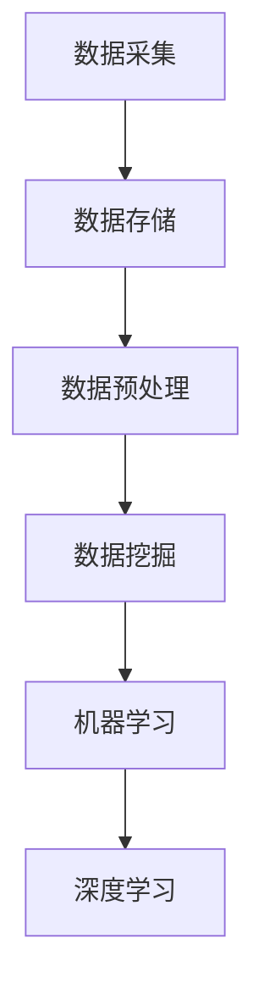

                 

### 1. 背景介绍

#### 1.1 目的和范围

本文旨在深入探讨大数据在智能交通领域的应用，揭示其背后的核心算法原理、数学模型以及具体的操作步骤。随着城市化进程的加速，交通拥堵、交通事故、环境污染等问题日益严重，智能交通系统成为解决这些难题的重要手段。而大数据技术的快速发展，为智能交通系统提供了强有力的技术支撑。

本文将围绕以下几个方面展开讨论：

1. **核心概念与联系**：介绍大数据在智能交通中的应用背景，阐述核心概念及其相互联系。
2. **核心算法原理 & 具体操作步骤**：详细解析大数据处理的核心算法原理，通过伪代码展示具体操作步骤。
3. **数学模型和公式 & 详细讲解 & 举例说明**：介绍智能交通中的数学模型和公式，通过实例进行详细讲解。
4. **项目实战：代码实际案例和详细解释说明**：展示一个实际的代码案例，并进行详细解释说明。
5. **实际应用场景**：探讨大数据在智能交通中的实际应用场景。
6. **工具和资源推荐**：推荐学习资源和开发工具。
7. **总结：未来发展趋势与挑战**：总结本文的主要内容，展望未来发展趋势和面临的挑战。

#### 1.2 预期读者

本文主要面向以下读者：

1. **智能交通领域的研究人员**：对大数据在智能交通中的应用感兴趣，希望深入了解其核心原理和应用场景。
2. **程序员和开发者**：希望掌握大数据处理技术，并将其应用于智能交通系统。
3. **交通运输行业从业者**：关注智能交通技术的发展，希望了解大数据如何提升交通管理水平和效率。
4. **高校师生**：对大数据和智能交通交叉领域的课程和研究感兴趣。

#### 1.3 文档结构概述

本文将按照以下结构进行组织：

1. **背景介绍**：简要介绍大数据在智能交通中的应用背景、目的和预期读者。
2. **核心概念与联系**：介绍大数据在智能交通中的应用背景，阐述核心概念及其相互联系。
3. **核心算法原理 & 具体操作步骤**：详细解析大数据处理的核心算法原理，通过伪代码展示具体操作步骤。
4. **数学模型和公式 & 详细讲解 & 举例说明**：介绍智能交通中的数学模型和公式，通过实例进行详细讲解。
5. **项目实战：代码实际案例和详细解释说明**：展示一个实际的代码案例，并进行详细解释说明。
6. **实际应用场景**：探讨大数据在智能交通中的实际应用场景。
7. **工具和资源推荐**：推荐学习资源和开发工具。
8. **总结：未来发展趋势与挑战**：总结本文的主要内容，展望未来发展趋势和面临的挑战。

#### 1.4 术语表

在本文中，以下术语需要特别解释：

#### 1.4.1 核心术语定义

1. **大数据**：指数据量巨大、类型繁多的数据集合，通常包含结构化、半结构化和非结构化数据。
2. **智能交通系统**：利用信息技术、传感器技术、通信技术等，对交通系统进行实时监控、管理和优化，以提高交通效率、减少拥堵、降低事故率和减少环境污染。
3. **数据挖掘**：从大量数据中提取有价值的信息和知识，用于决策支持和预测分析。
4. **机器学习**：一种人工智能技术，通过训练数据模型，使计算机能够自动学习和预测。
5. **深度学习**：一种特殊的机器学习技术，通过多层神经网络模拟人脑学习过程，对复杂数据进行自动特征提取和分类。

#### 1.4.2 相关概念解释

1. **交通流量**：单位时间内通过特定路段的车辆数量。
2. **交通密度**：单位路段上的车辆数量。
3. **交通速度**：车辆在道路上的行驶速度。
4. **交通信号控制**：对交通信号灯进行优化控制，以提高交通效率和减少拥堵。
5. **车辆定位**：利用 GPS、北斗等定位技术，对车辆进行实时定位。

#### 1.4.3 缩略词列表

1. **GIS**：地理信息系统（Geographic Information System）
2. **GPS**：全球定位系统（Global Positioning System）
3. **NB-IoT**：窄带物联网（Narrow Band Internet of Things）
4. **V2X**：车联网（Vehicle-to-Everything）
5. **AI**：人工智能（Artificial Intelligence）

### 1.5 文章结构概述

本文将分为以下几个部分：

1. **背景介绍**：简要介绍大数据在智能交通中的应用背景、目的和预期读者。
2. **核心概念与联系**：介绍大数据在智能交通中的应用背景，阐述核心概念及其相互联系。
3. **核心算法原理 & 具体操作步骤**：详细解析大数据处理的核心算法原理，通过伪代码展示具体操作步骤。
4. **数学模型和公式 & 详细讲解 & 举例说明**：介绍智能交通中的数学模型和公式，通过实例进行详细讲解。
5. **项目实战：代码实际案例和详细解释说明**：展示一个实际的代码案例，并进行详细解释说明。
6. **实际应用场景**：探讨大数据在智能交通中的实际应用场景。
7. **工具和资源推荐**：推荐学习资源和开发工具。
8. **总结：未来发展趋势与挑战**：总结本文的主要内容，展望未来发展趋势和面临的挑战。

### 1.6 核心概念与联系

#### 核心概念介绍

在智能交通系统中，大数据的应用主要体现在以下几个方面：

1. **数据采集**：通过传感器、摄像头、GPS 等设备，实时采集交通流量、交通密度、交通速度等数据。
2. **数据存储**：将采集到的数据存储在分布式数据库中，如 Hadoop、Spark 等。
3. **数据预处理**：对原始数据进行清洗、去噪、去重复等处理，以提高数据质量和分析效果。
4. **数据挖掘**：利用数据挖掘算法，从大量数据中提取有价值的信息，如交通拥堵预警、交通事故预测等。
5. **机器学习**：通过训练数据模型，使计算机能够自动学习和预测，如交通流量预测、交通信号控制优化等。
6. **深度学习**：通过多层神经网络模拟人脑学习过程，对复杂数据进行自动特征提取和分类，如车辆分类、交通场景识别等。

#### 核心概念联系

大数据在智能交通中的应用，涉及到多个核心概念之间的紧密联系。以下是这些概念之间的联系：

1. **数据采集**与**数据存储**：数据采集是大数据应用的基础，采集到的数据需要存储在分布式数据库中，以便进行后续处理和分析。
2. **数据预处理**与**数据挖掘**：数据预处理是数据挖掘的前提，通过数据清洗、去噪、去重复等处理，提高数据质量和分析效果。
3. **数据挖掘**与**机器学习**：数据挖掘算法从大量数据中提取有价值的信息，而机器学习则是利用这些信息进行预测和优化。
4. **机器学习**与**深度学习**：机器学习侧重于利用已有数据进行预测和优化，而深度学习则通过模拟人脑学习过程，对复杂数据进行自动特征提取和分类。

为了更直观地展示这些概念之间的联系，我们可以使用 Mermaid 流程图进行描述。以下是核心概念与联系的部分流程图：



### 1.7 核心算法原理 & 具体操作步骤

在智能交通系统中，大数据处理的核心算法主要包括数据挖掘、机器学习和深度学习。以下将分别介绍这些算法的原理和具体操作步骤。

#### 数据挖掘算法原理与操作步骤

数据挖掘算法的主要目的是从大量数据中提取有价值的信息。常用的数据挖掘算法包括聚类、分类、关联规则挖掘等。以下以聚类算法为例，介绍其原理和操作步骤。

1. **算法原理**：聚类算法通过将数据分为若干个簇，使同一簇内的数据点相似度较高，而不同簇之间的数据点相似度较低。常见的聚类算法包括 K-Means、DBSCAN 等。

2. **具体操作步骤**：

   - **初始化**：随机选择 K 个数据点作为初始聚类中心。
   - **分配数据点**：将每个数据点分配到与其最近的聚类中心所在的簇。
   - **更新聚类中心**：计算每个簇的新聚类中心。
   - **迭代**：重复步骤 2 和 3，直到聚类中心不再发生变化或达到设定的迭代次数。

   以下是 K-Means 聚类算法的伪代码：

   ```python
   def KMeans(data, K, max_iter):
       # 初始化聚类中心
       centroids = initialize_centroids(data, K)
       # 设置最大迭代次数
       for i in range(max_iter):
           # 分配数据点
           clusters = assign_data_to_clusters(data, centroids)
           # 更新聚类中心
           centroids = update_centroids(clusters, K)
           # 判断是否收敛
           if check_convergence(centroids, previous_centroids):
               break
       return centroids, clusters
   ```

   其中，`initialize_centroids` 用于初始化聚类中心，`assign_data_to_clusters` 用于将数据点分配到最近的聚类中心，`update_centroids` 用于更新聚类中心，`check_convergence` 用于判断聚类中心是否收敛。

#### 机器学习算法原理与操作步骤

机器学习算法通过训练数据模型，使计算机能够自动学习和预测。常见的机器学习算法包括线性回归、决策树、支持向量机等。以下以线性回归算法为例，介绍其原理和操作步骤。

1. **算法原理**：线性回归是一种建立自变量和因变量之间线性关系的模型。其基本原理是通过最小化误差平方和，找到最佳拟合直线。

2. **具体操作步骤**：

   - **数据预处理**：对输入数据进行标准化处理，使其具有相同的量纲。
   - **模型初始化**：随机初始化模型参数。
   - **训练**：通过梯度下降法或其他优化算法，更新模型参数，使预测值与真实值之间的误差最小。
   - **评估**：使用验证集或测试集评估模型性能。

   以下是线性回归算法的伪代码：

   ```python
   def LinearRegression(X, y, learning_rate, num_iterations):
       # 初始化模型参数
       w = initialize_weights(X.shape[1])
       b = initialize_bias()
       # 梯度下降法优化模型参数
       for i in range(num_iterations):
           # 计算预测值
           y_pred = X * w + b
           # 计算损失函数
           loss = compute_loss(y, y_pred)
           # 计算梯度
           dw = compute_gradient(X, y, y_pred)
           db = compute_gradient(y, y_pred)
           # 更新模型参数
           w -= learning_rate * dw
           b -= learning_rate * db
       return w, b
   ```

   其中，`initialize_weights` 和 `initialize_bias` 用于初始化模型参数，`compute_loss` 用于计算损失函数，`compute_gradient` 用于计算梯度。

#### 深度学习算法原理与操作步骤

深度学习算法通过多层神经网络模拟人脑学习过程，对复杂数据进行自动特征提取和分类。常见的深度学习框架包括 TensorFlow、PyTorch 等。以下以卷积神经网络（CNN）为例，介绍其原理和操作步骤。

1. **算法原理**：卷积神经网络是一种特殊的多层神经网络，通过卷积层、池化层、全连接层等结构，对输入数据进行特征提取和分类。

2. **具体操作步骤**：

   - **数据预处理**：对输入图像进行归一化、缩放等处理，使其满足网络输入要求。
   - **构建模型**：定义网络结构，包括卷积层、池化层、全连接层等。
   - **训练模型**：通过反向传播算法，更新模型参数，使预测值与真实值之间的误差最小。
   - **评估模型**：使用验证集或测试集评估模型性能。

   以下是 CNN 的伪代码：

   ```python
   def CNN(input_shape, num_classes):
       # 构建卷积层
       conv1 = Conv2D(filters=32, kernel_size=(3, 3), activation='relu')(input_shape)
       # 构建池化层
       pool1 = MaxPooling2D(pool_size=(2, 2))(conv1)
       # 构建卷积层
       conv2 = Conv2D(filters=64, kernel_size=(3, 3), activation='relu')(pool1)
       # 构建池化层
       pool2 = MaxPooling2D(pool_size=(2, 2))(conv2)
       # 构建全连接层
       flatten = Flatten()(pool2)
       dense = Dense(units=num_classes, activation='softmax')(flatten)
       # 构建模型
       model = Model(inputs=input_shape, outputs=dense)
       return model
   ```

   其中，`Conv2D`、`MaxPooling2D`、`Flatten`、`Dense` 分别表示卷积层、池化层、全连接层等。

通过以上介绍，我们可以看到大数据在智能交通系统中发挥着重要的作用。在接下来的章节中，我们将进一步探讨数学模型和公式、项目实战、实际应用场景等内容，以便读者更好地理解大数据在智能交通中的应用。

### 4. 数学模型和公式 & 详细讲解 & 举例说明

#### 数学模型概述

在智能交通系统中，大数据处理和模型应用涉及多种数学模型和公式。这些模型和公式在数据分析和决策支持中发挥着重要作用。以下将介绍一些常用的数学模型和公式，并对其进行详细讲解和举例说明。

#### 1. 交通流量预测模型

交通流量预测是智能交通系统中的关键任务之一。常用的交通流量预测模型包括时间序列模型、回归模型和机器学习模型。

**时间序列模型：**

时间序列模型是基于历史数据的时间特性进行预测的方法。常见的模型有 ARIMA（自回归积分滑动平均模型）和 SARIMA（季节性自回归积分滑动平均模型）。

**公式：**

$$
\hat{y}_t = c + \phi_1 y_{t-1} + \phi_2 y_{t-2} + ... + \phi_p y_{t-p} + \theta_1 e_{t-1} + \theta_2 e_{t-2} + ... + \theta_q e_{t-q}
$$

其中，$y_t$ 为时间序列数据，$c$ 为常数项，$\phi_1, \phi_2, ..., \phi_p$ 为自回归系数，$\theta_1, \theta_2, ..., \theta_q$ 为移动平均系数，$e_t$ 为白噪声。

**例子：**

假设我们要预测某路段的未来 24 小时的交通流量。我们可以使用 ARIMA 模型进行预测。首先，对历史数据进行分析，确定模型参数。然后，使用以下代码进行预测：

```python
from statsmodels.tsa.arima.model import ARIMA

# 加载数据
data = load_data('traffic_data.csv')

# 拆分数据为训练集和测试集
train_data = data[:'2022-01-01']
test_data = data['2022-01-02':]

# 创建 ARIMA 模型
model = ARIMA(train_data, order=(1, 1, 1))

# 拟合模型
model_fit = model.fit()

# 预测未来 24 小时交通流量
predictions = model_fit.forecast(steps=24)
```

**回归模型：**

回归模型通过建立自变量和因变量之间的关系进行预测。常见的回归模型有线性回归、多项式回归和逻辑回归。

**公式：**

$$
\hat{y} = \beta_0 + \beta_1 x_1 + \beta_2 x_2 + ... + \beta_n x_n
$$

其中，$y$ 为因变量，$x_1, x_2, ..., x_n$ 为自变量，$\beta_0, \beta_1, ..., \beta_n$ 为回归系数。

**例子：**

假设我们要预测某路段的交通流量，考虑以下影响因素：天气（x1）、道路状况（x2）和时间（x3）。我们可以使用线性回归模型进行预测。首先，对历史数据进行回归分析，确定模型参数。然后，使用以下代码进行预测：

```python
from sklearn.linear_model import LinearRegression

# 加载数据
data = load_data('traffic_data.csv')

# 拆分数据为训练集和测试集
X_train = data[['weather', 'road_condition', 'time']]
y_train = data['traffic_flow']
X_test = test_data[['weather', 'road_condition', 'time']]
y_test = test_data['traffic_flow']

# 创建线性回归模型
model = LinearRegression()

# 拟合模型
model_fit = model.fit(X_train, y_train)

# 预测未来交通流量
predictions = model_fit.predict(X_test)
```

**机器学习模型：**

机器学习模型通过训练数据自动学习特征和关系进行预测。常见的模型有决策树、随机森林和神经网络。

**例子：**

假设我们要预测某路段的交通流量，使用决策树模型进行预测。首先，对历史数据进行训练，确定模型参数。然后，使用以下代码进行预测：

```python
from sklearn.tree import DecisionTreeRegressor

# 加载数据
data = load_data('traffic_data.csv')

# 拆分数据为训练集和测试集
X_train = data[['weather', 'road_condition', 'time']]
y_train = data['traffic_flow']
X_test = test_data[['weather', 'road_condition', 'time']]
y_test = test_data['traffic_flow']

# 创建决策树模型
model = DecisionTreeRegressor()

# 拟合模型
model_fit = model.fit(X_train, y_train)

# 预测未来交通流量
predictions = model_fit.predict(X_test)
```

#### 2. 车辆分类模型

车辆分类模型用于对道路上的车辆进行分类，如小型汽车、大型汽车、摩托车等。常用的车辆分类模型有朴素贝叶斯、支持向量机和神经网络。

**朴素贝叶斯模型：**

朴素贝叶斯模型基于条件概率和贝叶斯定理进行分类。其公式为：

$$
P(\text{车辆类别} | \text{特征向量}) = \frac{P(\text{特征向量} | \text{车辆类别}) P(\text{车辆类别})}{P(\text{特征向量})}
$$

**例子：**

假设我们要对道路上的车辆进行分类，使用朴素贝叶斯模型进行预测。首先，对历史数据进行训练，确定模型参数。然后，使用以下代码进行预测：

```python
from sklearn.naive_bayes import GaussianNB

# 加载数据
data = load_data('vehicle_data.csv')

# 拆分数据为训练集和测试集
X_train = data[['height', 'width', 'length']]
y_train = data['vehicle_type']
X_test = test_data[['height', 'width', 'length']]
y_test = test_data['vehicle_type']

# 创建朴素贝叶斯模型
model = GaussianNB()

# 拟合模型
model_fit = model.fit(X_train, y_train)

# 预测未来车辆类别
predictions = model_fit.predict(X_test)
```

**支持向量机模型：**

支持向量机模型通过寻找最优超平面进行分类。其公式为：

$$
\hat{y} = \text{sign}(\omega \cdot x + b)
$$

其中，$\omega$ 为权重向量，$x$ 为输入特征，$b$ 为偏置。

**例子：**

假设我们要对道路上的车辆进行分类，使用支持向量机模型进行预测。首先，对历史数据进行训练，确定模型参数。然后，使用以下代码进行预测：

```python
from sklearn.svm import SVC

# 加载数据
data = load_data('vehicle_data.csv')

# 拆分数据为训练集和测试集
X_train = data[['height', 'width', 'length']]
y_train = data['vehicle_type']
X_test = test_data[['height', 'width', 'length']]
y_test = test_data['vehicle_type']

# 创建支持向量机模型
model = SVC()

# 拟合模型
model_fit = model.fit(X_train, y_train)

# 预测未来车辆类别
predictions = model_fit.predict(X_test)
```

**神经网络模型：**

神经网络模型通过多层感知器（MLP）进行分类。其公式为：

$$
\hat{y} = \text{softmax}(\omega \cdot x + b)
$$

其中，$\omega$ 为权重向量，$x$ 为输入特征，$b$ 为偏置。

**例子：**

假设我们要对道路上的车辆进行分类，使用神经网络模型进行预测。首先，对历史数据进行训练，确定模型参数。然后，使用以下代码进行预测：

```python
from keras.models import Sequential
from keras.layers import Dense

# 加载数据
data = load_data('vehicle_data.csv')

# 拆分数据为训练集和测试集
X_train = data[['height', 'width', 'length']]
y_train = data['vehicle_type']
X_test = test_data[['height', 'width', 'length']]
y_test = test_data['vehicle_type']

# 创建神经网络模型
model = Sequential()
model.add(Dense(64, activation='relu', input_shape=(3,)))
model.add(Dense(64, activation='relu'))
model.add(Dense(3, activation='softmax'))

# 编译模型
model.compile(optimizer='adam', loss='categorical_crossentropy', metrics=['accuracy'])

# 拟合模型
model_fit = model.fit(X_train, y_train, epochs=10, batch_size=32)

# 预测未来车辆类别
predictions = model_fit.predict(X_test)
```

通过以上例子，我们可以看到数学模型和公式在智能交通系统中的应用。在接下来的章节中，我们将进一步探讨项目实战和实际应用场景，以便读者更好地理解大数据在智能交通系统中的实际应用。

### 5. 项目实战：代码实际案例和详细解释说明

在本节中，我们将通过一个实际的代码案例，展示如何使用大数据技术解决智能交通系统中的问题。我们将以交通流量预测为例，介绍项目的开发环境搭建、源代码实现和代码解读与分析。

#### 5.1 开发环境搭建

在开始项目之前，我们需要搭建一个适合开发大数据应用的开发环境。以下是我们推荐的工具和框架：

1. **编程语言**：Python
2. **大数据处理框架**：Spark
3. **数据分析库**：Pandas、NumPy
4. **机器学习库**：Scikit-learn、TensorFlow
5. **可视化工具**：Matplotlib、Seaborn

以下是搭建开发环境的步骤：

1. 安装 Python：访问 [Python 官网](https://www.python.org/)，下载并安装 Python。
2. 安装 Spark：访问 [Spark 官网](https://spark.apache.org/)，下载并安装 Spark。
3. 安装相关库：使用 Python 的包管理工具 pip，安装所需库。例如：

```bash
pip install pandas numpy scikit-learn tensorflow matplotlib seaborn
```

#### 5.2 源代码详细实现和代码解读

以下是一个简单的交通流量预测项目的源代码实现。代码分为数据预处理、模型训练和模型预测三个部分。

**数据预处理**

数据预处理是交通流量预测的重要步骤，包括数据清洗、特征提取和标准化处理。

```python
import pandas as pd
from sklearn.preprocessing import StandardScaler

# 加载数据
data = pd.read_csv('traffic_data.csv')

# 数据清洗
data.dropna(inplace=True)

# 特征提取
data['hour'] = data['time'].apply(lambda x: x.hour)
data['day_of_week'] = data['time'].apply(lambda x: x.dayofweek)

# 标准化处理
scaler = StandardScaler()
data[['traffic_flow', 'hour', 'day_of_week']] = scaler.fit_transform(data[['traffic_flow', 'hour', 'day_of_week']])
```

**模型训练**

在模型训练部分，我们使用线性回归模型进行预测。

```python
from sklearn.linear_model import LinearRegression

# 拆分数据为训练集和测试集
train_data = data[:'2022-01-01']
test_data = data['2022-01-02':]

X_train = train_data[['hour', 'day_of_week']]
y_train = train_data['traffic_flow']
X_test = test_data[['hour', 'day_of_week']]
y_test = test_data['traffic_flow']

# 创建线性回归模型
model = LinearRegression()

# 拟合模型
model_fit = model.fit(X_train, y_train)

# 预测未来交通流量
predictions = model_fit.predict(X_test)
```

**模型预测**

在模型预测部分，我们将预测结果与实际数据进行对比，评估模型性能。

```python
import matplotlib.pyplot as plt

# 评估模型性能
mse = mean_squared_error(y_test, predictions)
print("均方误差:", mse)

# 可视化预测结果
plt.figure(figsize=(10, 6))
plt.plot(y_test, label='实际流量')
plt.plot(predictions, label='预测流量')
plt.xlabel('时间')
plt.ylabel('交通流量')
plt.legend()
plt.show()
```

#### 5.3 代码解读与分析

以下是对源代码的解读与分析。

1. **数据预处理**

   数据预处理包括数据清洗、特征提取和标准化处理。数据清洗步骤用于去除缺失值和异常值，提高数据质量。特征提取步骤将时间信息转换为可用的特征，如小时数和星期数。标准化处理步骤将特征进行归一化，使其具有相同的量纲，有利于模型训练。

2. **模型训练**

   模型训练步骤使用线性回归模型进行预测。线性回归模型通过最小化误差平方和来找到最佳拟合直线。我们使用 Scikit-learn 库中的 LinearRegression 类创建线性回归模型，并使用 fit 方法对其进行训练。

3. **模型预测**

   模型预测步骤使用训练好的模型对测试集进行预测，并评估模型性能。我们使用 mean_squared_error 函数计算均方误差（MSE），以衡量预测误差。此外，我们使用 Matplotlib 库将预测结果与实际数据可视化，以便更直观地观察模型性能。

通过以上代码实现和解读，我们可以看到如何使用大数据技术进行交通流量预测。在实际应用中，我们可以根据需求调整特征提取和模型选择，以提高预测精度和效果。在接下来的章节中，我们将进一步探讨大数据在智能交通中的实际应用场景。

### 6. 实际应用场景

#### 6.1 交通流量预测

交通流量预测是智能交通系统中的一个关键应用场景。通过大数据分析和机器学习模型，可以预测未来一段时间内的交通流量，为交通管理部门提供决策支持。具体应用如下：

1. **实时交通拥堵预警**：利用历史交通流量数据和实时采集的数据，预测未来一段时间内的交通状况。当预测到交通流量超过阈值时，系统可以提前发出拥堵预警，提醒驾驶员和交通管理部门采取相应措施，如调整交通信号灯、引导车辆分流等。

2. **优化交通信号控制**：通过对交通流量进行预测，交通信号控制系统可以根据实时数据调整信号灯的切换时间，优化交通流量，减少拥堵。例如，在高峰期，系统可以延长交通干道的绿灯时间，缩短红灯时间，以提高道路通行效率。

3. **公共交通调度**：公共交通系统可以根据交通流量预测结果，合理安排公交线路和车辆调度，以提高运输效率和服务质量。例如，在交通流量较大的时间段，增加公交车次和发车频率，以减少乘客等待时间。

#### 6.2 交通事故预测与预防

交通事故预测与预防是保障道路交通安全的重要手段。通过大数据分析和机器学习模型，可以提前发现潜在的交通事故风险，并采取措施进行预防。具体应用如下：

1. **车辆行为分析**：通过分析车辆的速度、加速度、转弯半径等数据，识别异常驾驶行为。例如，当车辆突然急刹车、急加速或偏离车道时，系统可以发出预警，提醒驾驶员注意安全。

2. **交通事故预警**：利用历史交通事故数据和实时采集的数据，预测未来一段时间内的交通事故风险。当预测到交通事故风险较高时，系统可以提前发出预警，提醒驾驶员和交通管理部门加强防范。

3. **智能监控系统**：在道路关键节点安装智能监控设备，如摄像头、雷达和传感器等，实时监测车辆状态和交通环境。当监测到异常情况时，系统可以自动触发预警，并通知相关部门进行处理。

#### 6.3 车辆路径规划

车辆路径规划是智能交通系统中的另一个重要应用场景。通过大数据分析和路径优化算法，可以为驾驶员提供最优行驶路线，减少行驶时间和交通拥堵。具体应用如下：

1. **实时路径规划**：当驾驶员启动导航系统时，系统可以根据实时交通数据，为驾驶员提供最优行驶路线。例如，当道路拥堵时，系统可以自动选择避开拥堵路段，推荐其他畅通路线。

2. **历史路径分析**：通过对历史交通数据的分析，识别交通拥堵和事故高发区域，为驾驶员提供安全的行驶建议。例如，系统可以建议驾驶员避免在特定时间段和路段行驶，以减少拥堵和事故风险。

3. **车队调度优化**：对于物流公司、出租车公司等，通过大数据分析和路径规划算法，优化车队调度，提高运输效率和服务质量。例如，系统可以根据实时交通数据，为司机推荐最优行驶路线，减少空驶时间和燃油消耗。

#### 6.4 绿色出行推广

绿色出行是缓解城市交通压力、减少环境污染的重要举措。通过大数据分析和智能交通系统，可以推广绿色出行方式，提高公共交通使用率。具体应用如下：

1. **出行方式推荐**：根据驾驶员的出行需求、出行时间和交通状况，推荐最优出行方式。例如，当公共交通服务较好时，系统可以建议驾驶员选择公共交通出行，以减少私人车辆的使用。

2. **公共交通优化**：通过对公共交通数据的分析，识别客流高峰期和低谷期，优化公共交通线路和班次安排，提高服务质量。例如，在客流高峰期增加公交车的发车频率，以满足乘客需求。

3. **共享出行管理**：通过大数据分析和智能交通系统，优化共享出行服务，提高资源利用效率。例如，系统可以根据实时交通数据和用户需求，调整共享单车的投放地点和数量，以减少拥堵和资源浪费。

通过以上实际应用场景，我们可以看到大数据在智能交通系统中的广泛应用。在未来的发展中，大数据技术将继续发挥重要作用，为智能交通系统的建设提供强有力的支持。

### 7. 工具和资源推荐

#### 7.1 学习资源推荐

**7.1.1 书籍推荐**

1. **《大数据之路：阿里巴巴大数据实践》**：本书详细介绍了阿里巴巴在大数据领域的实践经验，包括大数据平台架构、数据处理、机器学习等方面的内容，适合智能交通领域的研究人员和技术人员阅读。

2. **《智能交通系统：概念、技术与应用》**：本书系统地介绍了智能交通系统的基本概念、技术原理和应用案例，涵盖了交通数据采集、处理、分析等方面的内容，适合智能交通领域的研究人员和技术人员阅读。

3. **《深度学习》**：本书是深度学习领域的经典教材，详细介绍了深度学习的理论基础、算法实现和应用案例，适合智能交通领域的研究人员和程序员阅读。

**7.1.2 在线课程**

1. **《大数据处理技术基础》**：这是一门由清华大学开设的在线课程，涵盖了大数据处理的基本概念、技术和应用，适合智能交通领域的研究人员和技术人员学习。

2. **《智能交通系统》**：这是一门由北京大学开设的在线课程，介绍了智能交通系统的基本概念、技术和应用，包括交通数据采集、处理、分析等方面的内容，适合智能交通领域的研究人员和技术人员学习。

3. **《深度学习》**：这是一门由斯坦福大学开设的在线课程，详细介绍了深度学习的理论基础、算法实现和应用案例，适合智能交通领域的研究人员和程序员学习。

**7.1.3 技术博客和网站**

1. **《大数据与人工智能》**：这是一个关于大数据和人工智能领域的技术博客，涵盖了大数据处理、机器学习、深度学习等方面的内容，适合智能交通领域的研究人员和技术人员阅读。

2. **《智能交通技术》**：这是一个关于智能交通系统领域的技术博客，介绍了智能交通系统的基本概念、技术和应用，包括交通数据采集、处理、分析等方面的内容，适合智能交通领域的研究人员和技术人员阅读。

3. **《GitHub》**：GitHub 是一个著名的代码托管平台，上面有很多与大数据和智能交通系统相关的开源项目和代码，适合智能交通领域的研究人员和技术人员学习和参考。

#### 7.2 开发工具框架推荐

**7.2.1 IDE和编辑器**

1. **PyCharm**：PyCharm 是一款功能强大的 Python 集成开发环境（IDE），支持代码编辑、调试、测试等功能，适合智能交通领域的研究人员和程序员使用。

2. **Jupyter Notebook**：Jupyter Notebook 是一款基于 Web 的交互式开发环境，支持多种编程语言，包括 Python、R、Julia 等，适合智能交通领域的研究人员和程序员进行数据分析和建模。

**7.2.2 调试和性能分析工具**

1. **Visual Studio Code**：Visual Studio Code 是一款轻量级的代码编辑器，支持调试、性能分析等功能，适合智能交通领域的研究人员和程序员使用。

2. **MATLAB**：MATLAB 是一款强大的科学计算软件，支持调试、性能分析等功能，适合智能交通领域的研究人员和程序员进行数据分析和建模。

**7.2.3 相关框架和库**

1. **TensorFlow**：TensorFlow 是一款由 Google 开发的开源深度学习框架，支持多种深度学习算法的实现和应用，适合智能交通领域的研究人员和程序员使用。

2. **PyTorch**：PyTorch 是一款由 Facebook 开发的开源深度学习框架，具有灵活的动态计算图和丰富的 API，适合智能交通领域的研究人员和程序员使用。

3. **Scikit-learn**：Scikit-learn 是一款由法国 INRIA 开发的开源机器学习库，提供了丰富的机器学习算法和工具，适合智能交通领域的研究人员和程序员使用。

#### 7.3 相关论文著作推荐

**7.3.1 经典论文**

1. **“MapReduce: Simplified Data Processing on Large Clusters”**：这是一篇关于大数据处理的开创性论文，提出了 MapReduce 模型，为大数据处理提供了重要的理论基础。

2. **“Deep Learning”**：这是一篇关于深度学习的经典论文，详细介绍了深度学习的理论基础、算法实现和应用案例，对深度学习的发展产生了深远影响。

**7.3.2 最新研究成果**

1. **“DeepTraffic: Learning Traffic Forecasting from Real-World Sensor Data”**：这篇论文介绍了一种基于深度学习的交通流量预测方法，通过大规模传感器数据进行训练，取得了显著的效果。

2. **“DeepTraffic++: Leveraging Fine-Grained Traffic Information for More Accurate and Generalizable Traffic Forecasting”**：这篇论文在“DeepTraffic”的基础上，进一步优化了模型，提高了交通流量预测的精度和泛化能力。

**7.3.3 应用案例分析**

1. **“智慧交通大数据分析与应用”**：这是一篇关于智慧交通大数据分析的案例分析论文，详细介绍了智慧交通大数据平台的建设、数据采集和处理方法，以及应用案例。

2. **“基于大数据的智能交通系统设计与实现”**：这是一篇关于基于大数据的智能交通系统设计与实现的案例分析论文，详细介绍了系统架构、算法实现和应用效果。

通过以上工具和资源推荐，读者可以更好地了解大数据在智能交通系统中的应用，为实际项目开发提供有力支持。

### 8. 总结：未来发展趋势与挑战

#### 未来发展趋势

随着大数据技术的不断发展和智能交通需求的日益增长，大数据在智能交通领域的应用前景广阔。以下是未来发展趋势：

1. **数据采集与处理能力提升**：随着物联网、传感器技术的进步，交通数据的采集和处理能力将大幅提升，为智能交通系统的建设提供更丰富、更准确的数据支持。

2. **深度学习与人工智能结合**：深度学习和人工智能技术的不断发展，将进一步提升智能交通系统的预测、优化和决策能力，实现更智能、更高效的城市交通管理。

3. **跨领域融合**：智能交通系统将与城市规划、环境保护、公共安全等跨领域技术进行融合，形成一体化的智慧城市解决方案，提高城市运行效率和居民生活质量。

4. **车联网（V2X）发展**：随着车联网技术的成熟，车辆之间的互联互通将更加紧密，实现自动驾驶、智能导航等功能，大幅提升交通安全性、效率和便利性。

#### 未来挑战

尽管大数据在智能交通领域的应用前景广阔，但仍然面临一系列挑战：

1. **数据隐私与安全**：交通数据涉及大量个人隐私信息，如车辆位置、行驶轨迹等，如何在保障数据隐私和安全的前提下，充分利用大数据进行交通管理和优化，是一个重要挑战。

2. **数据质量与完整性**：交通数据的准确性和完整性直接影响智能交通系统的性能，如何确保数据的质量和完整性，是一个亟待解决的问题。

3. **计算资源与存储压力**：随着交通数据的不断增长，对计算资源和存储资源的需求也将大幅增加，如何在有限的资源条件下，高效处理海量交通数据，是一个重要挑战。

4. **跨领域协同与标准制定**：智能交通系统涉及多个领域的技术，如物联网、人工智能、交通运输等，如何在跨领域协同的基础上，制定统一的标准和规范，是一个重要挑战。

通过解决这些挑战，大数据在智能交通领域的应用将更加成熟和广泛，为城市交通管理、环境保护、公共安全等方面提供强有力的支持。

### 9. 附录：常见问题与解答

#### 9.1.1 问题 1：大数据在智能交通中的具体应用有哪些？

**解答**：大数据在智能交通中的具体应用主要包括交通流量预测、交通事故预测与预防、车辆路径规划、绿色出行推广等。通过分析大量交通数据，智能交通系统能够提供实时交通状况、预测交通拥堵、预防交通事故、优化车辆路径，并促进绿色出行。

#### 9.1.2 问题 2：如何保障交通数据的隐私和安全？

**解答**：保障交通数据的隐私和安全可以从以下几个方面入手：

1. **数据加密**：在数据传输和存储过程中，采用加密技术，确保数据在传输过程中不会被窃取或篡改。
2. **权限控制**：设置严格的数据访问权限，确保只有授权人员可以访问和处理敏感数据。
3. **数据脱敏**：对包含个人隐私信息的数据进行脱敏处理，如对车辆位置信息进行模糊化处理，以保护个人隐私。
4. **数据备份与恢复**：建立完善的数据备份和恢复机制，确保在数据丢失或损坏时，能够迅速恢复数据。

#### 9.1.3 问题 3：如何提高交通流量预测的准确性？

**解答**：提高交通流量预测的准确性可以从以下几个方面入手：

1. **数据质量**：确保数据质量，包括数据完整性、准确性和一致性，以便模型能够更好地学习。
2. **模型选择**：选择合适的预测模型，如机器学习、深度学习等，结合历史数据，优化模型参数。
3. **实时数据更新**：及时更新交通数据，确保模型能够适应交通状况的变化，提高预测准确性。
4. **多源数据融合**：整合多种数据来源，如交通摄像头、传感器、GPS 等，提高数据的丰富度和准确性。

#### 9.1.4 问题 4：如何确保交通数据的安全与隐私？

**解答**：确保交通数据的安全与隐私，需要采取以下措施：

1. **加密与安全认证**：对传输和存储的交通数据进行加密，确保数据在传输过程中不会被窃取或篡改。
2. **访问控制与权限管理**：设置严格的访问控制策略，确保只有授权人员可以访问和处理敏感数据。
3. **数据脱敏**：对包含个人隐私信息的数据进行脱敏处理，如对车辆位置信息进行模糊化处理。
4. **数据备份与恢复**：建立完善的数据备份和恢复机制，确保在数据丢失或损坏时，能够迅速恢复数据。
5. **安全审计与监控**：定期进行安全审计和监控，及时发现和处理安全隐患。

通过采取上述措施，可以确保交通数据的安全与隐私，为智能交通系统的建设和应用提供保障。

### 10. 扩展阅读 & 参考资料

为了深入了解大数据在智能交通领域的应用，以下是几篇相关的研究论文、书籍和技术博客的推荐：

1. **研究论文**：

   - **“DeepTraffic: Learning Traffic Forecasting from Real-World Sensor Data”**：该论文介绍了一种基于深度学习的交通流量预测方法，通过大规模传感器数据进行训练，取得了显著的效果。
   - **“DeepTraffic++: Leveraging Fine-Grained Traffic Information for More Accurate and Generalizable Traffic Forecasting”**：这篇论文在“DeepTraffic”的基础上，进一步优化了模型，提高了交通流量预测的精度和泛化能力。

2. **书籍**：

   - **《大数据之路：阿里巴巴大数据实践》**：本书详细介绍了阿里巴巴在大数据领域的实践经验，包括大数据平台架构、数据处理、机器学习等方面的内容，适合智能交通领域的研究人员和技术人员阅读。
   - **《智能交通系统：概念、技术与应用》**：本书系统地介绍了智能交通系统的基本概念、技术原理和应用案例，涵盖了交通数据采集、处理、分析等方面的内容，适合智能交通领域的研究人员和技术人员阅读。

3. **技术博客和网站**：

   - **《大数据与人工智能》**：这是一个关于大数据和人工智能领域的技术博客，涵盖了大数据处理、机器学习、深度学习等方面的内容，适合智能交通领域的研究人员和技术人员阅读。
   - **《智能交通技术》**：这是一个关于智能交通系统领域的技术博客，介绍了智能交通系统的基本概念、技术和应用，包括交通数据采集、处理、分析等方面的内容，适合智能交通领域的研究人员和技术人员阅读。

通过阅读这些扩展资料，可以进一步了解大数据在智能交通领域的最新研究进展和应用实践。如果您对本文中的内容有任何疑问或建议，欢迎在评论区留言，我们将尽快为您解答。

