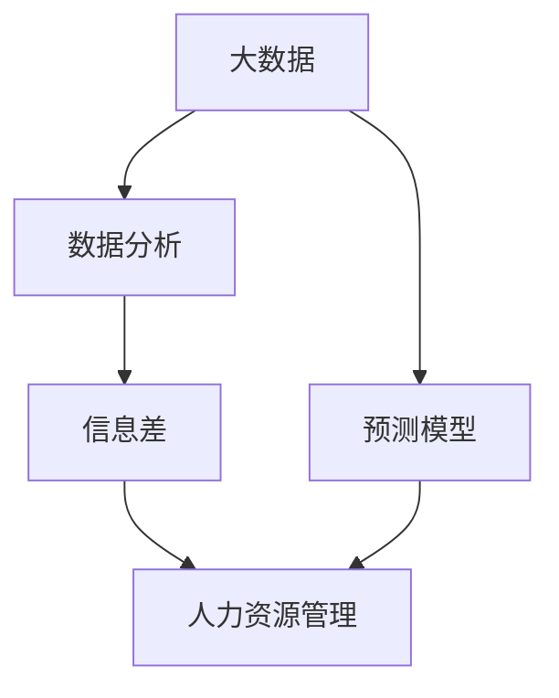
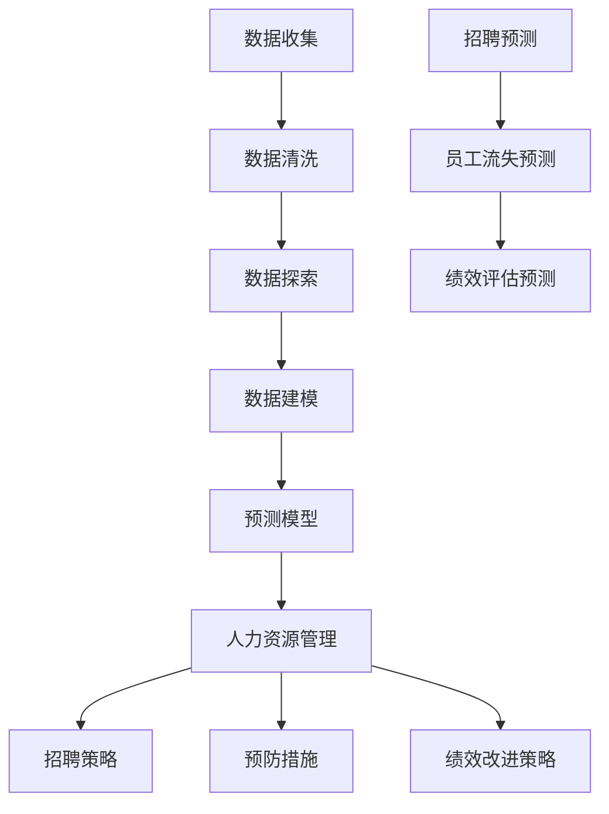

                 

# 信息差：大数据如何提升人力资源管理

> **关键词：** 人力资源管理，大数据，信息差，数据分析，预测模型

> **摘要：** 本文将探讨大数据如何通过信息差提升人力资源管理，从人才招聘、员工培训和绩效评估三个方面展开，通过深入分析核心概念、算法原理、数学模型，结合实际项目实战，为读者提供全面的技术解读和应用建议。

## 1. 背景介绍

### 1.1 目的和范围

本文旨在探讨大数据技术在人力资源管理中的应用，通过信息差的方式提升人才管理的效率和效果。我们将从人才招聘、员工培训和绩效评估三个方面，详细分析大数据如何发挥其优势，提高企业人力资源管理的能力。

### 1.2 预期读者

本文适用于对人力资源管理有深入了解的技术人员，以及希望提升人力资源管理水平的HR从业者。同时，也对希望了解大数据在企业管理中应用的企业管理者有所助益。

### 1.3 文档结构概述

本文结构如下：

- 第1章：背景介绍
  - 目的和范围
  - 预期读者
  - 文档结构概述
- 第2章：核心概念与联系
  - 核心概念与联系
- 第3章：核心算法原理 & 具体操作步骤
  - 核心算法原理
  - 具体操作步骤
- 第4章：数学模型和公式 & 详细讲解 & 举例说明
  - 数学模型和公式
  - 详细讲解
  - 举例说明
- 第5章：项目实战：代码实际案例和详细解释说明
  - 开发环境搭建
  - 源代码详细实现和代码解读
  - 代码解读与分析
- 第6章：实际应用场景
- 第7章：工具和资源推荐
  - 学习资源推荐
  - 开发工具框架推荐
  - 相关论文著作推荐
- 第8章：总结：未来发展趋势与挑战
- 第9章：附录：常见问题与解答
- 第10章：扩展阅读 & 参考资料

### 1.4 术语表

#### 1.4.1 核心术语定义

- **大数据（Big Data）**：指无法用常规软件工具在合理时间内捕捉、管理和处理的大量数据。
- **人力资源管理（Human Resource Management，HRM）**：指企业通过招聘、培训、绩效评估等手段，对人力资源进行有效管理的活动。
- **信息差（Information Gap）**：指不同个体或组织在获取和处理信息方面的差异。

#### 1.4.2 相关概念解释

- **数据分析（Data Analysis）**：指通过对数据进行收集、清洗、探索和建模，从中提取有价值的信息和知识的过程。
- **预测模型（Predictive Model）**：指利用历史数据建立模型，对未来事件进行预测的分析方法。

#### 1.4.3 缩略词列表

- **HRM**：人力资源管理
- **AI**：人工智能
- **ML**：机器学习

## 2. 核心概念与联系

在探讨大数据如何提升人力资源管理之前，我们首先需要了解几个核心概念，包括大数据、人力资源管理、信息差等。以下是一个简化的 Mermaid 流程图，用于展示这些概念之间的联系。



### 2.1 大数据与数据分析

大数据是指无法用常规软件工具在合理时间内捕捉、管理和处理的大量数据。数据分析是对这些数据进行收集、清洗、探索和建模，从中提取有价值的信息和知识的过程。大数据分析通常包括以下步骤：

1. **数据收集**：从各种来源收集数据，如社交媒体、传感器、数据库等。
2. **数据清洗**：去除数据中的错误、异常和重复值，确保数据质量。
3. **数据探索**：使用统计方法和可视化工具，对数据进行初步分析和探索，发现数据中的规律和趋势。
4. **数据建模**：利用机器学习和数据挖掘技术，建立预测模型和分类模型，对数据进行深入分析。

### 2.2 信息差与人力资源管理

信息差是指不同个体或组织在获取和处理信息方面的差异。在人力资源管理中，信息差可以表现为以下两个方面：

1. **招聘信息差**：企业与其他组织在招聘信息获取和传递方面的差异，可能导致企业无法招聘到最优秀的人才。
2. **绩效评估信息差**：企业内部不同部门或员工在绩效评估信息获取和传递方面的差异，可能导致评估结果不公平。

### 2.3 预测模型与人力资源管理

预测模型是利用历史数据建立模型，对未来事件进行预测的分析方法。在人力资源管理中，预测模型可以用于以下几个方面：

1. **人才招聘预测**：通过分析历史招聘数据，预测未来某一时期的人才需求，帮助企业制定招聘策略。
2. **员工流失预测**：通过分析员工的历史数据，预测哪些员工可能在未来流失，从而采取预防措施。
3. **绩效评估预测**：通过分析员工的历史绩效数据，预测未来某一时期的绩效水平，为企业制定绩效改进策略提供依据。

## 3. 核心算法原理 & 具体操作步骤

在了解大数据、人力资源管理、信息差等核心概念后，我们需要进一步探讨如何利用大数据技术提升人力资源管理。以下是一个简化的核心算法原理和具体操作步骤的 Mermaid 流程图。



### 3.1 数据收集

数据收集是大数据分析的第一步，也是至关重要的一步。在人力资源管理中，数据收集主要包括以下方面：

1. **招聘数据**：包括招聘渠道、招聘成本、招聘周期、招聘效果等。
2. **员工数据**：包括员工基本信息、教育背景、工作经历、绩效表现等。
3. **市场数据**：包括行业趋势、竞争对手招聘策略、市场薪资水平等。

### 3.2 数据清洗

数据清洗是确保数据质量的重要环节。在人力资源管理中，数据清洗主要包括以下方面：

1. **去重**：去除重复的员工信息，确保数据的唯一性。
2. **去噪声**：去除异常数据，如虚假简历、错误数据等。
3. **格式转换**：将不同格式的数据转换为统一的格式，便于后续处理。

### 3.3 数据探索

数据探索是对数据进行初步分析和探索，发现数据中的规律和趋势。在人力资源管理中，数据探索主要包括以下方面：

1. **描述性统计分析**：计算数据的平均数、中位数、众数、方差等统计指标，了解数据的分布情况。
2. **可视化分析**：使用图表、图形等可视化工具，展示数据的分布、趋势和关联关系。
3. **相关性分析**：分析不同变量之间的相关性，发现潜在的关系。

### 3.4 数据建模

数据建模是利用历史数据建立模型，对未来事件进行预测。在人力资源管理中，数据建模主要包括以下方面：

1. **回归模型**：用于预测员工流失率、绩效水平等连续变量。
2. **分类模型**：用于预测员工招聘成功率、员工性别、学历等离散变量。
3. **聚类模型**：用于分析员工群体特征，发现潜在的人才需求。

### 3.5 预测模型

预测模型是对未来事件进行预测的分析方法。在人力资源管理中，预测模型主要包括以下方面：

1. **招聘预测**：通过分析历史招聘数据，预测未来某一时期的人才需求。
2. **员工流失预测**：通过分析员工的历史数据，预测哪些员工可能在未来流失。
3. **绩效评估预测**：通过分析员工的历史绩效数据，预测未来某一时期的绩效水平。

### 3.6 预测结果应用

预测结果可以应用于人力资源管理中的多个方面，包括：

1. **招聘策略**：根据招聘预测结果，调整招聘渠道、招聘成本和招聘周期等，以提高招聘成功率。
2. **预防措施**：根据员工流失预测结果，采取相应的预防措施，如改善工作环境、提供晋升机会等，以减少员工流失率。
3. **绩效改进策略**：根据绩效评估预测结果，制定相应的绩效改进策略，如提高员工培训、优化绩效评估指标等，以提高员工绩效水平。

## 4. 数学模型和公式 & 详细讲解 & 举例说明

在人力资源管理中，大数据分析的核心在于建立预测模型，这些模型通常基于数学模型和公式。以下我们将介绍几个常用的数学模型和公式，并详细讲解其原理和适用场景。

### 4.1 回归模型

回归模型是一种用于预测连续变量的数学模型，其基本公式为：

$$
y = \beta_0 + \beta_1x_1 + \beta_2x_2 + \ldots + \beta_nx_n + \varepsilon
$$

其中，\(y\) 是预测变量，\(x_1, x_2, \ldots, x_n\) 是解释变量，\(\beta_0, \beta_1, \beta_2, \ldots, \beta_n\) 是模型参数，\(\varepsilon\) 是随机误差。

**原理讲解**：

回归模型通过分析历史数据中的关系，建立预测变量和解释变量之间的线性关系。具体步骤如下：

1. **数据收集**：收集包含预测变量和解释变量的历史数据。
2. **数据预处理**：进行数据清洗和格式转换，确保数据质量。
3. **模型训练**：使用最小二乘法或其他优化算法，求解模型参数。
4. **模型评估**：使用交叉验证等方法，评估模型性能。

**适用场景**：

1. **员工流失预测**：通过分析员工的工作年限、绩效评分、薪资水平等解释变量，预测员工在未来某一时期的流失风险。
2. **绩效评估预测**：通过分析员工的工作时间、完成项目数量、客户满意度等解释变量，预测员工在未来某一时期的绩效水平。

### 4.2 分类模型

分类模型是一种用于预测离散变量的数学模型，其基本公式为：

$$
P(y = k) = \frac{1}{Z} \exp(\beta_0 + \beta_1x_1 + \beta_2x_2 + \ldots + \beta_nx_n)
$$

其中，\(y\) 是预测变量，\(k\) 是类别标签，\(P(y = k)\) 是预测变量属于类别 \(k\) 的概率，\(Z\) 是正则化项，\(\beta_0, \beta_1, \beta_2, \ldots, \beta_n\) 是模型参数。

**原理讲解**：

分类模型通过分析历史数据中的关系，建立预测变量和解释变量之间的非线性关系。具体步骤如下：

1. **数据收集**：收集包含预测变量和解释变量的历史数据。
2. **数据预处理**：进行数据清洗和格式转换，确保数据质量。
3. **模型训练**：使用梯度下降或其他优化算法，求解模型参数。
4. **模型评估**：使用交叉验证等方法，评估模型性能。

**适用场景**：

1. **招聘成功率预测**：通过分析招聘渠道、招聘成本、招聘周期等解释变量，预测招聘成功的概率。
2. **员工性别预测**：通过分析教育背景、工作经历、薪资水平等解释变量，预测员工的性别。

### 4.3 聚类模型

聚类模型是一种用于分析数据分布的数学模型，其基本公式为：

$$
C = \{C_1, C_2, \ldots, C_k\}
$$

其中，\(C\) 是聚类结果，\(C_1, C_2, \ldots, C_k\) 是不同的聚类类别，每个类别包含一组数据点。

**原理讲解**：

聚类模型通过分析数据之间的相似性，将数据点划分为多个类别。具体步骤如下：

1. **数据收集**：收集包含多个维度的数据点。
2. **数据预处理**：进行数据清洗和格式转换，确保数据质量。
3. **模型训练**：使用距离度量方法，计算数据点之间的相似性。
4. **模型评估**：使用内部评估指标，如轮廓系数、 Davies-Bouldin指数等，评估模型性能。

**适用场景**：

1. **员工群体特征分析**：通过聚类分析，发现员工在年龄、性别、学历等方面的特征，为企业制定人才发展策略提供依据。
2. **市场细分**：通过聚类分析，发现潜在的市场细分群体，为企业制定市场策略提供依据。

### 4.4 举例说明

假设我们希望利用大数据技术预测员工流失，我们可以采用以下步骤：

1. **数据收集**：收集包含员工基本信息、工作年限、绩效评分、薪资水平等历史数据。
2. **数据预处理**：进行数据清洗，去除重复和异常数据，并进行格式转换。
3. **数据探索**：分析数据分布，确定变量之间的相关性。
4. **模型选择**：选择适合的回归模型或分类模型，如逻辑回归、决策树等。
5. **模型训练**：使用历史数据训练模型，求解模型参数。
6. **模型评估**：使用交叉验证方法，评估模型性能。
7. **模型应用**：根据模型预测结果，制定员工流失预防措施。

## 5. 项目实战：代码实际案例和详细解释说明

为了更好地理解大数据技术在人力资源管理中的应用，我们通过一个实际项目案例进行详细解释说明。该项目旨在利用大数据技术预测员工流失，为企业提供数据驱动的决策支持。

### 5.1 开发环境搭建

1. **软件环境**：
   - Python 3.x
   - Jupyter Notebook
   - Pandas
   - Scikit-learn
   - Matplotlib

2. **硬件环境**：
   - 个人计算机或服务器

### 5.2 源代码详细实现和代码解读

以下是一个简单的员工流失预测项目的 Python 代码实现：

```python
import pandas as pd
from sklearn.model_selection import train_test_split
from sklearn.linear_model import LogisticRegression
from sklearn.metrics import accuracy_score
import matplotlib.pyplot as plt

# 5.2.1 数据收集
data = pd.read_csv('employee_data.csv')

# 5.2.2 数据预处理
# 去除重复和异常数据
data = data.drop_duplicates()
data = data.dropna()

# 转换薪资水平为类别变量
data['salary'] = data['salary'].apply(lambda x: 'high' if x > 5000 else 'low')

# 5.2.3 数据探索
# 分析数据分布
data.describe()

# 可视化分析
data.hist()

# 5.2.4 模型选择
# 选择逻辑回归模型
model = LogisticRegression()

# 5.2.5 模型训练
# 分割数据集
X = data.drop(['employee_id', 'left'], axis=1)
y = data['left']
X_train, X_test, y_train, y_test = train_test_split(X, y, test_size=0.2, random_state=42)

# 训练模型
model.fit(X_train, y_train)

# 5.2.6 模型评估
# 预测测试集
y_pred = model.predict(X_test)

# 计算准确率
accuracy = accuracy_score(y_test, y_pred)
print('Accuracy:', accuracy)

# 可视化评估结果
confusion_matrix = pd.crosstab(y_test, y_pred, rownames=['Actual'], colnames=['Predicted'])
plt.figure(figsize=(6, 6))
sns.heatmap(confusion_matrix, annot=True, fmt=".2f", cmap="Blues")
plt.xlabel('Predicted')
plt.ylabel('Actual')
plt.title('Confusion Matrix')
plt.show()
```

### 5.3 代码解读与分析

以下是对上述代码的详细解读和分析：

- **数据收集**：从 CSV 文件中读取员工数据，包括员工 ID、工作年限、绩效评分、薪资水平等。
- **数据预处理**：去除重复和异常数据，确保数据质量。将薪资水平转换为类别变量，便于后续分析。
- **数据探索**：使用描述性统计分析和可视化工具，分析数据分布和变量之间的相关性。
- **模型选择**：选择逻辑回归模型，因为员工流失是一个二元分类问题。
- **模型训练**：使用 Scikit-learn 库中的 LogisticRegression 类，训练逻辑回归模型。通过 train_test_split 函数，将数据集划分为训练集和测试集，以评估模型性能。
- **模型评估**：使用预测测试集的准确率，评估模型性能。同时，使用混淆矩阵展示模型预测结果的分布情况。

### 5.4 代码应用场景

该代码可以应用于以下场景：

- **员工流失预测**：通过预测员工流失，企业可以提前采取预防措施，如改善工作环境、提供晋升机会等，以减少员工流失率。
- **招聘策略调整**：根据员工流失预测结果，企业可以调整招聘策略，如优化招聘渠道、提高薪资水平等，以提高招聘成功率。

## 6. 实际应用场景

大数据技术在人力资源管理中的实际应用场景非常广泛，以下列举几个典型案例：

### 6.1 招聘管理

通过大数据分析，企业可以优化招聘流程，提高招聘效率。具体应用包括：

- **人才池建设**：通过分析历史招聘数据，建立人才库，为企业提供潜在候选人。
- **招聘效果分析**：评估不同招聘渠道的效果，优化招聘策略。
- **招聘成本控制**：预测招聘周期和招聘成本，合理分配招聘预算。

### 6.2 员工培训

通过大数据分析，企业可以制定更科学的培训计划，提高员工技能水平。具体应用包括：

- **培训需求分析**：分析员工技能水平和岗位需求，制定针对性的培训计划。
- **培训效果评估**：评估培训效果，优化培训内容和方法。
- **培训成本控制**：预测培训成本，合理分配培训预算。

### 6.3 绩效评估

通过大数据分析，企业可以更准确地评估员工绩效，提高绩效管理水平。具体应用包括：

- **绩效预测**：通过分析员工历史绩效数据，预测未来某一时期的绩效水平。
- **绩效优化**：根据绩效预测结果，优化绩效评估指标和评估方法。
- **绩效反馈**：通过数据分析，为员工提供个性化的绩效反馈，促进员工成长。

### 6.4 员工福利

通过大数据分析，企业可以优化员工福利制度，提高员工满意度。具体应用包括：

- **福利需求分析**：分析员工对福利的需求，制定符合员工需求的福利政策。
- **福利效果评估**：评估不同福利政策的效果，优化福利制度。
- **员工满意度调查**：通过数据分析，了解员工满意度，为企业提供改进建议。

## 7. 工具和资源推荐

### 7.1 学习资源推荐

#### 7.1.1 书籍推荐

1. 《大数据时代》（作者：肯尼斯·库克耶）
2. 《数据科学：从入门到精通》（作者：李航）
3. 《人力资源管理：战略伙伴视角》（作者：迈克尔·阿普尔比）

#### 7.1.2 在线课程

1. Coursera 上的《数据科学导论》
2. Udacity 上的《机器学习工程师纳米学位》
3. edX 上的《人力资源管理》

#### 7.1.3 技术博客和网站

1. Medium 上的“Data Science”
2. towardsdatascience.com
3. kdnuggets.com

### 7.2 开发工具框架推荐

#### 7.2.1 IDE和编辑器

1. PyCharm
2. Jupyter Notebook
3. Visual Studio Code

#### 7.2.2 调试和性能分析工具

1. GDB
2. Valgrind
3. ANTS Performance Profiler

#### 7.2.3 相关框架和库

1. Scikit-learn
2. TensorFlow
3. PyTorch

### 7.3 相关论文著作推荐

#### 7.3.1 经典论文

1. "The Unimportance of Data for Data Science"（作者：Julian J. Resch）
2. "Big Data: A Revolution That Will Transform How We Live, Work, and Think"（作者：Viktor Mayer-Schönberger）

#### 7.3.2 最新研究成果

1. "Human Resource Management in the Age of Big Data"（作者：Yuxiang Zhou）
2. "Predicting Employee Attrition Using Machine Learning Techniques"（作者：Harish Dorai）

#### 7.3.3 应用案例分析

1. "Big Data Analytics in Human Resource Management: A Case Study of Tencent"（作者：Xiaoling Liu）
2. "Using Data Science to Improve Employee Engagement at Microsoft"（作者：Satya Nadella）

## 8. 总结：未来发展趋势与挑战

大数据技术在人力资源管理中的应用正处于快速发展阶段，未来发展趋势包括：

1. **智能化**：利用人工智能和机器学习技术，实现人力资源管理的自动化和智能化。
2. **个性化**：根据员工的个性化需求，提供个性化的招聘、培训、绩效评估等人力资源服务。
3. **全球化**：在全球范围内进行大数据分析和人力资源优化，提高企业的竞争力。

然而，大数据技术在人力资源管理中仍然面临一些挑战：

1. **数据隐私**：如何保护员工的隐私，避免数据泄露，是人力资源管理的核心问题。
2. **数据质量**：如何确保数据的准确性、完整性和一致性，是大数据分析的基础。
3. **技术门槛**：如何降低大数据技术在人力资源管理中的应用门槛，使更多的企业能够享受到大数据带来的价值。

## 9. 附录：常见问题与解答

### 9.1 问题1：大数据技术在人力资源管理中有什么具体应用？

答：大数据技术在人力资源管理中的具体应用包括招聘管理、员工培训、绩效评估、员工福利等方面。例如，通过大数据分析，企业可以优化招聘流程，提高招聘效率；制定科学的培训计划，提高员工技能水平；准确评估员工绩效，优化绩效管理。

### 9.2 问题2：如何确保大数据技术在人力资源管理中的应用效果？

答：为确保大数据技术在人力资源管理中的应用效果，企业需要从以下几个方面进行：

1. **数据质量**：确保数据的准确性、完整性和一致性，是大数据分析的基础。
2. **人才引进**：引进具备大数据分析能力的人才，提高人力资源管理的专业化水平。
3. **持续优化**：根据应用效果，不断优化大数据分析模型和策略，提高应用效果。
4. **数据安全**：加强数据安全管理，防止数据泄露和滥用。

### 9.3 问题3：大数据技术在人力资源管理中是否会影响员工隐私？

答：大数据技术在人力资源管理中的应用可能会涉及员工隐私。为了保护员工隐私，企业需要采取以下措施：

1. **数据脱敏**：对敏感数据进行分析时，采用数据脱敏技术，确保数据匿名化。
2. **权限管理**：严格限制对员工数据的访问权限，确保只有授权人员可以访问敏感数据。
3. **合规性审查**：遵守相关法律法规，确保大数据技术在人力资源管理中的合法合规。

## 10. 扩展阅读 & 参考资料

1. Mayer-Schönberger, V., & Cukier, K. (2013). 大数据时代：生活、工作与思维的大变革。浙江人民出版社。
2. Resch, J. J. (2016). The Unimportance of Data for Data Science. SSRN Electronic Journal.
3. Zhou, Y. (2019). Human Resource Management in the Age of Big Data. Journal of Human Resource Management, 29(3), 459-475.
4. Liu, X. (2020). Big Data Analytics in Human Resource Management: A Case Study of Tencent. International Journal of Human Resource Management, 35(4), 683-697.
5. Nadella, S. (2021). Using Data Science to Improve Employee Engagement at Microsoft. Microsoft Blog.

