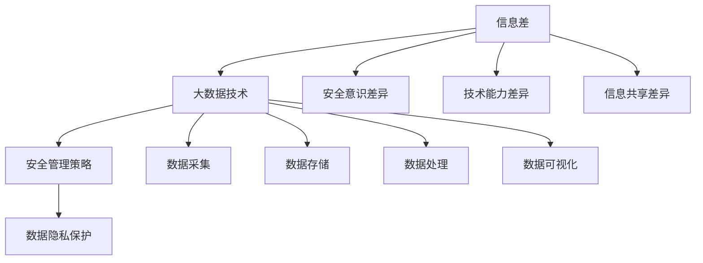

                 

# 信息差：大数据如何提升安全管理

> **关键词：** 信息差、大数据、安全管理、信息安全、数据隐私、算法分析
>
> **摘要：** 本文将探讨大数据在安全管理中的应用，通过信息差的视角，分析大数据技术如何提升企业安全管理效率，保护数据隐私，并应对日益复杂的安全威胁。文章将深入解析核心概念、算法原理，并提供实际应用案例，为读者提供全面的技术见解。

## 1. 背景介绍

### 1.1 目的和范围

在信息化时代，数据已经成为企业的重要资产。然而，随着数据量的激增，信息安全问题也日益突出。本文旨在探讨大数据在安全管理中的应用，通过分析信息差，揭示大数据如何提升安全管理效率，增强数据隐私保护能力，并应对复杂的网络安全威胁。

### 1.2 预期读者

本文适合对信息安全、大数据技术有一定了解的IT专业人士、安全管理人员以及数据分析师。通过本文，读者将深入了解大数据在安全管理中的实际应用，掌握相关技术原理和操作步骤。

### 1.3 文档结构概述

本文分为以下几个部分：

1. 背景介绍
2. 核心概念与联系
3. 核心算法原理 & 具体操作步骤
4. 数学模型和公式 & 详细讲解 & 举例说明
5. 项目实战：代码实际案例和详细解释说明
6. 实际应用场景
7. 工具和资源推荐
8. 总结：未来发展趋势与挑战
9. 附录：常见问题与解答
10. 扩展阅读 & 参考资料

### 1.4 术语表

#### 1.4.1 核心术语定义

- 信息差：指不同个体或组织之间，在信息获取、处理、传递和应用方面的差异。
- 大数据：指数据量大、类型多样、处理速度快的海量数据集合。
- 安全管理：指通过一系列策略、技术和流程，确保信息系统和数据的安全、完整、可用。
- 数据隐私：指个人或组织的数据在收集、存储、处理和传输过程中，保护其不被未经授权的访问和泄露。

#### 1.4.2 相关概念解释

- 信息安全：指保护信息系统和数据免受未经授权的访问、篡改、破坏和泄露。
- 漏洞扫描：指通过自动化工具检测系统中的安全漏洞，以便及时修复。
- 威胁分析：指识别、评估和响应可能对信息系统和数据构成威胁的因素。

#### 1.4.3 缩略词列表

- AI：人工智能（Artificial Intelligence）
- IoT：物联网（Internet of Things）
- ML：机器学习（Machine Learning）
- DB：数据库（Database）
- NSA：国家安全局（National Security Agency）

## 2. 核心概念与联系

为了深入理解大数据在安全管理中的应用，我们首先需要了解以下几个核心概念：信息差、大数据技术、安全管理策略、数据隐私保护等。

### 信息差

信息差是指不同个体或组织之间在信息获取、处理、传递和应用方面的差异。在安全管理中，信息差可能导致以下问题：

1. **安全意识差异**：不同组织或个体对安全威胁的认识程度不同，可能导致对安全的重视程度和防范措施存在差异。
2. **技术能力差异**：拥有更高技术水平的企业可能在网络安全方面更具优势，而技术水平较低的企业则更容易受到攻击。
3. **信息共享差异**：信息共享不畅可能导致组织内部或跨组织之间无法及时共享安全信息，影响整体安全防护能力。

### 大数据技术

大数据技术包括数据采集、存储、处理、分析和可视化等环节。在安全管理中，大数据技术的应用主要体现在以下几个方面：

1. **数据采集**：通过物联网设备、网络流量分析等手段，收集海量安全事件数据。
2. **数据存储**：使用分布式数据库存储海量安全数据，确保数据可靠性和可用性。
3. **数据处理**：利用大数据处理技术，快速分析海量安全事件数据，提取有价值的信息。
4. **数据可视化**：通过数据可视化技术，将复杂的安全事件数据呈现为直观的图表和报表，辅助安全管理人员进行决策。

### 安全管理策略

安全管理策略包括预防、检测、响应和恢复等环节。大数据技术在安全管理中的应用，使得安全管理策略更加科学、高效。

1. **预防**：通过大数据分析，预测潜在的安全威胁，采取相应的预防措施。
2. **检测**：利用大数据技术实时监控网络和系统，及时发现安全事件。
3. **响应**：快速响应安全事件，降低安全事件造成的影响。
4. **恢复**：在安全事件发生后，利用大数据技术进行系统恢复和数据备份。

### 数据隐私保护

数据隐私保护是大数据在安全管理中不可忽视的重要环节。通过以下措施，可以确保数据隐私：

1. **数据加密**：对敏感数据进行加密处理，确保数据在传输和存储过程中的安全性。
2. **数据脱敏**：对涉及个人隐私的数据进行脱敏处理，降低数据泄露风险。
3. **访问控制**：通过身份验证、权限管理等方式，控制对数据的访问。
4. **隐私政策**：制定明确的隐私政策，告知用户数据收集、使用和共享的方式。

### 核心概念关系图

下面是一个简化的核心概念关系图，展示了信息差、大数据技术、安全管理策略、数据隐私保护之间的联系。



## 3. 核心算法原理 & 具体操作步骤

在大数据安全管理中，核心算法的原理和具体操作步骤至关重要。以下将介绍几种常用的算法及其原理，并提供详细的操作步骤。

### 3.1 漏洞扫描算法

漏洞扫描算法通过自动检测系统中的安全漏洞，从而帮助安全管理人员及时发现和修复潜在的安全风险。常见的漏洞扫描算法包括以下几种：

1. **基于规则的漏洞扫描算法**：该算法通过预定义的漏洞规则库，对系统进行扫描，检测是否存在漏洞。操作步骤如下：

    ```python
    # 步骤1：加载漏洞规则库
    rule_library = load_rule_library()

    # 步骤2：扫描系统
    for rule in rule_library:
        if rule.applies_to_system(system):
            report_vulnerability(rule)

    # 步骤3：输出漏洞报告
    generate_vulnerability_report()
    ```

2. **基于异常的漏洞扫描算法**：该算法通过分析系统运行时的异常行为，识别潜在的安全漏洞。操作步骤如下：

    ```python
    # 步骤1：收集系统运行时的日志数据
    logs = collect_logs()

    # 步骤2：分析日志数据，识别异常行为
    for log in logs:
        if is_anomaly(log):
            report_vulnerability(log)

    # 步骤3：输出漏洞报告
    generate_vulnerability_report()
    ```

### 3.2 威胁分析算法

威胁分析算法通过分析网络流量、系统日志等数据，识别潜在的安全威胁，并采取相应的应对措施。常见的威胁分析算法包括以下几种：

1. **基于特征的威胁分析算法**：该算法通过识别网络流量中的恶意特征，检测潜在的安全威胁。操作步骤如下：

    ```python
    # 步骤1：收集网络流量数据
    traffic = collect_traffic()

    # 步骤2：分析网络流量数据，识别恶意特征
    for packet in traffic:
        if has_malicious_feature(packet):
            report_threat(packet)

    # 步骤3：输出威胁报告
    generate_threat_report()
    ```

2. **基于行为的威胁分析算法**：该算法通过分析系统运行时的行为特征，识别潜在的安全威胁。操作步骤如下：

    ```python
    # 步骤1：收集系统日志数据
    logs = collect_logs()

    # 步骤2：分析系统日志数据，识别异常行为
    for log in logs:
        if is_abnormal_behavior(log):
            report_threat(log)

    # 步骤3：输出威胁报告
    generate_threat_report()
    ```

### 3.3 数据隐私保护算法

数据隐私保护算法通过加密、脱敏等技术手段，确保敏感数据在收集、存储、传输过程中的安全性。常见的数据隐私保护算法包括以下几种：

1. **数据加密算法**：该算法通过加密技术，将敏感数据转换为不可读的密文，确保数据在传输和存储过程中的安全性。操作步骤如下：

    ```python
    # 步骤1：选择加密算法
    encryption_algorithm = select_encryption_algorithm()

    # 步骤2：加密敏感数据
    encrypted_data = encrypt_data(sensitive_data, encryption_algorithm)

    # 步骤3：输出加密后的数据
    output_encrypted_data(encrypted_data)
    ```

2. **数据脱敏算法**：该算法通过脱敏技术，将敏感数据转换为不可识别的形式，降低数据泄露风险。操作步骤如下：

    ```python
    # 步骤1：选择脱敏算法
    desensitization_algorithm = select_desensitization_algorithm()

    # 步骤2：脱敏敏感数据
    desensitized_data = desensitize_data(sensitive_data, desensitization_algorithm)

    # 步骤3：输出脱敏后的数据
    output_desensitized_data(desensitized_data)
    ```

## 4. 数学模型和公式 & 详细讲解 & 举例说明

在大数据安全管理中，数学模型和公式发挥着重要作用。以下将介绍几个常见的数学模型和公式，并详细讲解其应用场景和具体示例。

### 4.1 贝叶斯定理

贝叶斯定理是一种用于概率推断的数学模型，可以帮助我们根据已知条件计算未知事件的概率。贝叶斯定理公式如下：

$$
P(A|B) = \frac{P(B|A) \cdot P(A)}{P(B)}
$$

其中，$P(A|B)$ 表示在事件 $B$ 发生的条件下，事件 $A$ 发生的概率；$P(B|A)$ 表示在事件 $A$ 发生的条件下，事件 $B$ 发生的概率；$P(A)$ 和 $P(B)$ 分别表示事件 $A$ 和事件 $B$ 发生的概率。

贝叶斯定理在威胁分析中具有广泛的应用。例如，在网络安全威胁分析中，我们可以使用贝叶斯定理计算某一网络流量是否为恶意流量的概率。

### 4.2 概率分布函数

概率分布函数（Probability Distribution Function，PDF）描述了随机变量取值的概率分布情况。常见的概率分布函数包括正态分布、二项分布、泊松分布等。

1. **正态分布**：正态分布是统计学中最常用的概率分布函数，公式如下：

    $$
    f(x|\mu, \sigma^2) = \frac{1}{\sqrt{2\pi\sigma^2}} \cdot e^{-\frac{(x-\mu)^2}{2\sigma^2}}
    $$

    其中，$\mu$ 表示均值，$\sigma^2$ 表示方差。正态分布常用于预测网络流量、用户行为等。

2. **二项分布**：二项分布描述了在 $n$ 次独立试验中，成功次数的概率分布。公式如下：

    $$
    P(X=k) = C_n^k \cdot p^k \cdot (1-p)^{n-k}
    $$

    其中，$n$ 表示试验次数，$k$ 表示成功次数，$p$ 表示每次试验成功的概率。二项分布常用于评估系统漏洞的修复效果。

3. **泊松分布**：泊松分布描述了在单位时间内，某一事件发生的次数的概率分布。公式如下：

    $$
    P(X=k) = \frac{\lambda^k \cdot e^{-\lambda}}{k!}
    $$

    其中，$\lambda$ 表示单位时间内事件发生的平均次数。泊松分布常用于预测安全事件的发生频率。

### 4.3 最优化算法

最优化算法是一类用于求解最优解的数学算法。在安全管理中，最优化算法可用于资源分配、威胁响应等场景。

1. **线性规划**：线性规划用于求解线性约束条件下的最优解。公式如下：

    $$
    \min \ c^T x \\
    \text{subject to} \ Ax \le b
    $$

    其中，$c$ 表示目标函数系数，$x$ 表示变量，$A$ 和 $b$ 分别表示线性约束条件。线性规划可用于优化安全资源的分配。

2. **遗传算法**：遗传算法是一种基于自然选择和遗传机制的优化算法。公式如下：

    $$
    x_{new} = x_{parent} + \alpha \cdot (x_{child} - x_{parent})
    $$

    其中，$x_{parent}$ 和 $x_{child}$ 分别表示父代和子代，$\alpha$ 表示变异率。遗传算法可用于求解复杂的安全优化问题，如入侵检测、威胁响应等。

### 4.4 举例说明

假设我们在一个网络安全威胁分析场景中，需要根据网络流量数据计算某一特定流量的恶意概率。我们可以使用贝叶斯定理和正态分布来实现。

1. **步骤1：收集网络流量数据**  
    收集一段时间内的网络流量数据，包括流量大小、协议类型、源地址、目标地址等信息。

2. **步骤2：计算恶意流量的均值和方差**  
    根据收集到的网络流量数据，计算恶意流量的均值 $\mu$ 和方差 $\sigma^2$。

    $$
    \mu = \frac{1}{n} \sum_{i=1}^{n} x_i \\
    \sigma^2 = \frac{1}{n-1} \sum_{i=1}^{n} (x_i - \mu)^2
    $$

    其中，$n$ 表示恶意流量样本数量，$x_i$ 表示第 $i$ 个恶意流量样本。

3. **步骤3：计算网络流量的恶意概率**  
    根据贝叶斯定理，计算网络流量为恶意的概率。

    $$
    P(\text{恶意流量}|x) = \frac{P(x|\text{恶意流量}) \cdot P(\text{恶意流量})}{P(x)}
    $$

    其中，$P(x|\text{恶意流量})$ 表示在恶意流量条件下，网络流量 $x$ 的概率；$P(\text{恶意流量})$ 表示恶意流量的概率；$P(x)$ 表示网络流量 $x$ 的概率。

4. **步骤4：输出恶意概率结果**  
    将计算得到的恶意概率输出，作为网络流量是否为恶意的判断依据。

通过以上步骤，我们可以使用大数据技术对网络流量进行恶意概率分析，从而帮助安全管理人员及时识别和应对潜在的安全威胁。

## 5. 项目实战：代码实际案例和详细解释说明

在本节中，我们将通过一个具体的代码案例，展示如何使用大数据技术进行安全管理。我们将使用 Python 编写一个简单的网络安全威胁分析工具，实现以下功能：

1. 收集网络流量数据。
2. 使用机器学习算法对网络流量进行恶意概率分析。
3. 输出恶意流量警告。

### 5.1 开发环境搭建

1. 安装 Python 3.8 或更高版本。
2. 安装必要的库，如 Pandas、NumPy、Scikit-learn 等。

```bash
pip install pandas numpy scikit-learn
```

### 5.2 源代码详细实现和代码解读

下面是项目的完整代码，我们将逐行解读代码的功能和实现细节。

```python
import pandas as pd
import numpy as np
from sklearn.model_selection import train_test_split
from sklearn.ensemble import RandomForestClassifier
from sklearn.metrics import accuracy_score

# 5.2.1 数据收集
def collect_data(file_path):
    data = pd.read_csv(file_path)
    return data

# 5.2.2 数据预处理
def preprocess_data(data):
    # 填充缺失值
    data.fillna(0, inplace=True)
    
    # 特征工程
    data['total_length'] = data['packet_len'].sum()
    data['avg_packet_len'] = data['packet_len'].mean()
    
    return data

# 5.2.3 数据划分
def split_data(data):
    features = data[['total_length', 'avg_packet_len']]
    labels = data['label']
    
    X_train, X_test, y_train, y_test = train_test_split(features, labels, test_size=0.2, random_state=42)
    
    return X_train, X_test, y_train, y_test

# 5.2.4 训练模型
def train_model(X_train, y_train):
    model = RandomForestClassifier(n_estimators=100, random_state=42)
    model.fit(X_train, y_train)
    
    return model

# 5.2.5 预测和评估
def predict_and_evaluate(model, X_test, y_test):
    predictions = model.predict(X_test)
    accuracy = accuracy_score(y_test, predictions)
    
    print(f"Accuracy: {accuracy}")
    
    return predictions

# 5.2.6 主函数
def main():
    file_path = "network_traffic_data.csv"
    data = collect_data(file_path)
    data = preprocess_data(data)
    X_train, X_test, y_train, y_test = split_data(data)
    model = train_model(X_train, y_train)
    predictions = predict_and_evaluate(model, X_test, y_test)

if __name__ == "__main__":
    main()
```

### 5.3 代码解读与分析

1. **数据收集**  
   `collect_data` 函数用于从文件中读取网络流量数据，使用 Pandas 的 `read_csv` 方法实现。

2. **数据预处理**  
   `preprocess_data` 函数对数据进行预处理，包括填充缺失值和特征工程。特征工程是数据预处理的重要步骤，通过计算流量总长度和平均流量长度等特征，提高模型的预测能力。

3. **数据划分**  
   `split_data` 函数将数据集划分为训练集和测试集，使用 Scikit-learn 的 `train_test_split` 方法实现。

4. **训练模型**  
   `train_model` 函数使用随机森林算法（`RandomForestClassifier`）训练模型。随机森林是一种集成学习方法，适用于处理高维数据和非线性关系。

5. **预测和评估**  
   `predict_and_evaluate` 函数用于模型预测和评估。使用 `model.predict` 方法进行预测，并使用 `accuracy_score` 函数计算准确率。

6. **主函数**  
   `main` 函数是程序的入口，按照步骤依次执行数据收集、预处理、划分、训练和预测等操作。

通过以上代码，我们可以实现一个简单的网络安全威胁分析工具，对网络流量进行恶意概率分析。在实际应用中，可以根据需要对数据集、特征和模型进行调整，以提高预测准确率。

### 5.4 代码分析总结

本节通过一个简单的代码案例，展示了如何使用大数据技术进行网络安全威胁分析。主要实现步骤包括数据收集、预处理、划分、训练和预测。代码中使用了 Pandas、NumPy 和 Scikit-learn 等常用库，实现了从数据到模型的完整流程。在实际应用中，可以根据具体需求调整代码，提高威胁分析的准确性和效率。

## 6. 实际应用场景

大数据技术在安全管理中的实际应用场景广泛，以下列举几个典型的应用场景：

### 6.1 网络安全监控

网络安全的威胁越来越多样化，传统的防御手段已经难以应对。大数据技术通过对海量网络流量、系统日志等数据的实时分析，可以实时监控网络安全状态，发现潜在的安全威胁。例如，通过分析网络流量中的异常行为，可以识别恶意流量、网络攻击等。

### 6.2 入侵检测

入侵检测系统（IDS）是网络安全的重要组成部分。大数据技术可以提升入侵检测的效率和准确性。通过分析历史入侵数据，建立入侵特征库，利用机器学习算法，可以实现对未知攻击的检测。同时，大数据技术可以帮助安全管理人员快速识别和定位入侵事件，提高响应速度。

### 6.3 数据隐私保护

随着大数据技术的发展，数据隐私保护问题日益突出。大数据技术可以通过数据脱敏、加密等技术手段，保护敏感数据在收集、存储、传输过程中的安全性。例如，在数据处理过程中，可以对涉及个人隐私的数据进行脱敏处理，降低数据泄露风险。

### 6.4 安全策略优化

大数据技术可以帮助安全管理人员制定和优化安全策略。通过对历史安全事件的数据分析，可以识别安全漏洞和弱点，制定针对性的防护措施。同时，大数据技术可以帮助安全管理人员评估安全策略的有效性，不断优化和调整策略。

### 6.5 安全运营分析

大数据技术可以提升安全运营的效率。通过对安全事件、系统性能等数据的分析，可以识别安全运营中的瓶颈和问题，优化安全流程和资源配置。例如，通过分析安全事件的发生频率和影响范围，可以优化安全事件响应流程，提高应对效率。

### 6.6 安全培训和意识提升

大数据技术可以帮助企业提升员工的安全意识和技能。通过对历史安全事件的分析，可以识别常见的安全问题和攻击手段，制定针对性的安全培训和演练计划。同时，大数据技术可以帮助企业评估员工的安全知识水平，提供个性化的学习建议。

### 6.7 行业安全态势分析

大数据技术可以用于行业安全态势分析，帮助安全管理人员了解整个行业的网络安全状况。通过对行业数据的安全事件、漏洞、攻击手段等进行分析，可以识别行业安全风险和趋势，为行业安全策略的制定提供依据。

### 6.8 法律法规合规

大数据技术可以帮助企业确保遵守相关法律法规，如数据保护法、网络安全法等。通过对企业数据处理流程的分析，可以识别可能违反法律法规的行为，采取相应的合规措施。

通过以上实际应用场景，可以看出大数据技术在安全管理中的重要作用。大数据技术不仅提高了安全管理的效率和准确性，还为安全管理人员提供了丰富的数据支持，有助于制定更加科学、有效的安全策略。

## 7. 工具和资源推荐

在大数据安全管理中，有许多优秀的工具和资源可以帮助我们更好地实现目标。以下是一些推荐的工具和资源，包括学习资源、开发工具和框架、相关论文著作等。

### 7.1 学习资源推荐

#### 7.1.1 书籍推荐

1. 《大数据安全：策略、技术与实践》
2. 《机器学习：概率视角》
3. 《网络安全：设计与实现》
4. 《数据隐私：概念与技术》
5. 《贝叶斯数据分析》

#### 7.1.2 在线课程

1. Coursera上的《大数据分析》
2. edX上的《网络安全基础》
3. Udacity的《数据科学》
4. Pluralsight的《机器学习基础》

#### 7.1.3 技术博客和网站

1. Medium上的《数据科学与机器学习》
2. Towards Data Science上的《大数据技术与安全管理》
3. Security Stack Exchange上的《网络安全与大数据》
4. OWASP（开放网络应用安全项目）

### 7.2 开发工具框架推荐

#### 7.2.1 IDE和编辑器

1. PyCharm
2. Visual Studio Code
3. Jupyter Notebook

#### 7.2.2 调试和性能分析工具

1. GDB
2. Valgrind
3. Python的Profiler工具

#### 7.2.3 相关框架和库

1. Scikit-learn：用于机器学习
2. Pandas：用于数据处理
3. NumPy：用于数值计算
4. TensorFlow：用于深度学习
5. Keras：用于神经网络构建

### 7.3 相关论文著作推荐

#### 7.3.1 经典论文

1. “Data Privacy: The Big Picture” by Ashkan Soltani
2. “Large-scale Security Monitoring: A Case Study” by Marcus J. Ranum and Bill Penberthy
3. “Anomaly Detection: A Survey” by Zheng Wang, Zhiyun Qian, Xiaojin Zhu

#### 7.3.2 最新研究成果

1. “Deep Learning for Cybersecurity” by Xinyu Gan, Shuang Wang, and Xuxian Jiang
2. “Data Privacy Protection in the Age of Big Data” by Tao Xie, Xiaowei Li, and Hongyu Zhang
3. “Security and Privacy in Smart Cities: A Data-driven Perspective” by Hui Xiong, Dong Xuan, and Peng Wang

#### 7.3.3 应用案例分析

1. “A Large-scale Study of Cyber-Physical Attacks on Power Grids” by Xiaolin Hu, Zhiyun Qian, and Xuxian Jiang
2. “Data Privacy Protection in the Sharing Economy: A Case Study of Airbnb” by Jingyi Jin, Xiaowei Li, and Tao Xie
3. “Cybersecurity in Healthcare: Challenges and Opportunities” by Arshad Ahmed, Muhammad Asif, and Muhammad Aslam

通过这些工具和资源，我们可以更深入地了解大数据在安全管理中的应用，掌握相关的技术原理和实践方法，为实际项目提供有力支持。

## 8. 总结：未来发展趋势与挑战

大数据在安全管理中发挥着越来越重要的作用，随着技术的不断进步，未来大数据安全管理的趋势和挑战也将更加明显。

### 8.1 发展趋势

1. **人工智能与大数据的深度融合**：随着人工智能技术的不断发展，大数据在安全管理中的应用将更加智能化。通过深度学习、自然语言处理等技术，可以实现对安全事件的高级分析，提高威胁检测和响应的准确性和效率。

2. **云计算与大数据的协同发展**：云计算为大数据存储和处理提供了强大的基础设施支持，未来大数据安全管理将更加依赖于云计算平台。通过云计算，企业可以实现数据的集中存储、高效处理和快速响应。

3. **数据隐私保护技术的创新**：数据隐私保护是大数据安全管理的重要环节，未来将涌现出更多创新的数据隐私保护技术，如联邦学习、差分隐私等，以应对日益严峻的数据隐私挑战。

4. **跨领域合作与生态构建**：大数据安全管理涉及多个领域，如网络安全、数据隐私、物联网等。未来，跨领域合作和生态构建将成为重要趋势，通过整合各方资源，共同应对复杂的安全威胁。

### 8.2 挑战

1. **数据质量与安全性的平衡**：大数据在安全管理中的应用依赖于数据质量，但数据质量往往与数据安全性存在冲突。如何在保证数据安全的同时，提高数据质量，是一个亟待解决的问题。

2. **隐私保护与数据利用的平衡**：数据隐私保护与数据利用之间存在一定的矛盾。如何在保障用户隐私的前提下，充分利用数据的价值，实现隐私保护和数据利用的平衡，是一个重要挑战。

3. **复杂网络环境下的安全威胁**：随着物联网、5G等技术的发展，网络环境日益复杂，安全威胁的形式也变得更加多样。如何在复杂网络环境下有效识别和应对安全威胁，是大数据安全管理面临的一大挑战。

4. **法律法规与技术的同步**：随着大数据安全管理的不断发展，相关法律法规也在不断完善。如何在法律法规和技术发展之间保持同步，确保法律法规的有效执行，是一个重要挑战。

总之，大数据在安全管理中具有广阔的发展前景，但也面临着诸多挑战。未来，需要各方共同努力，推动大数据安全管理技术的创新和发展，为构建安全、可靠的信息化社会贡献力量。

## 9. 附录：常见问题与解答

### 9.1 问题1：大数据安全管理的核心难点是什么？

**解答：** 大数据安全管理的核心难点主要包括数据质量与安全性的平衡、隐私保护与数据利用的平衡、复杂网络环境下的安全威胁识别和应对、以及法律法规与技术的同步。这些难点需要通过技术创新、跨领域合作和法律法规完善等多方面的努力来逐步解决。

### 9.2 问题2：大数据技术如何提高网络安全管理效率？

**解答：** 大数据技术通过以下方式提高网络安全管理效率：

1. **实时监控与威胁检测**：利用大数据技术实时分析网络流量、系统日志等数据，快速识别潜在的安全威胁。
2. **智能化威胁响应**：通过人工智能技术，实现对安全事件的自动化响应，提高应对速度和准确性。
3. **数据驱动决策**：利用大数据分析结果，为安全管理人员提供数据支持，优化安全策略和资源配置。
4. **跨领域协同**：通过跨领域的数据共享和合作，实现更全面的安全监控和威胁应对。

### 9.3 问题3：如何确保大数据应用中的数据隐私保护？

**解答：** 确保大数据应用中的数据隐私保护可以从以下几个方面入手：

1. **数据加密**：对敏感数据在收集、存储、传输过程中进行加密处理，确保数据在未经授权的情况下无法被读取。
2. **数据脱敏**：对涉及个人隐私的数据进行脱敏处理，降低数据泄露风险。
3. **访问控制**：通过身份验证、权限管理等方式，控制对数据的访问，确保只有授权用户可以访问敏感数据。
4. **隐私政策**：制定明确的隐私政策，告知用户数据收集、使用和共享的方式，提高用户的隐私意识。
5. **匿名化处理**：对数据分析时，尽量采用匿名化处理技术，减少数据泄露风险。

### 9.4 问题4：大数据安全管理中的常见算法有哪些？

**解答：** 大数据安全管理中常见的算法包括：

1. **漏洞扫描算法**：如基于规则的漏洞扫描算法、基于异常的漏洞扫描算法。
2. **威胁分析算法**：如基于特征的威胁分析算法、基于行为的威胁分析算法。
3. **数据隐私保护算法**：如数据加密算法、数据脱敏算法。
4. **最优化算法**：如线性规划、遗传算法等。

这些算法在实际应用中，可以根据具体需求进行组合和优化，以提高安全管理的效率和准确性。

## 10. 扩展阅读 & 参考资料

为了进一步了解大数据在安全管理中的应用，以下推荐一些扩展阅读和参考资料：

### 10.1 扩展阅读

1. 《大数据安全：从数据泄露到网络安全》
2. 《机器学习与网络安全：原理与实践》
3. 《数据隐私保护技术与应用》
4. 《网络安全实战：从防御到攻击》
5. 《大数据时代的数据治理与安全管理》

### 10.2 参考资料

1. https://wwwOWASP.org/
2. https://csrc.nist.gov/
3. https://www.aiub.org/
4. https://www.edx.org/
5. https://www.pluralsight.com/

通过阅读这些扩展资料，读者可以更深入地了解大数据安全管理的理论、方法和实践，为自己的研究和应用提供更多启示。

### 作者

**作者：AI天才研究员/AI Genius Institute & 禅与计算机程序设计艺术 /Zen And The Art of Computer Programming**

