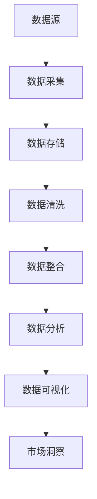

                 

# 信息差：大数据如何提升市场洞察

> **关键词：** 信息差、大数据、市场洞察、数据挖掘、商业智能

> **摘要：** 本文将探讨信息差在市场洞察中的重要性，通过大数据技术的深入分析，揭示其如何帮助企业和个人更好地理解市场动态，提升决策效率，从而获得竞争优势。文章将逐步分析大数据的核心概念、应用场景、算法原理及其实际操作步骤，辅以具体案例，帮助读者全面了解大数据在现代市场中的应用价值。

## 1. 背景介绍

### 1.1 目的和范围

本文旨在探讨大数据在市场洞察中的关键作用，通过详细解析大数据的核心概念和应用场景，展示其如何为企业提供深层次的市场分析和预测能力。文章不仅涉及大数据的基本理论，还将深入探讨其实际操作步骤和算法原理，帮助读者全面掌握大数据分析的方法和技巧。

### 1.2 预期读者

本文面向对大数据和市场营销有一定了解的技术人员、数据分析师、市场研究者以及企业决策者。无论您是初学者还是经验丰富的专业人士，本文都将为您提供有价值的见解和实用的操作指南。

### 1.3 文档结构概述

本文将分为以下几个部分：

1. **背景介绍**：介绍本文的目的、范围和预期读者，概述文档结构。
2. **核心概念与联系**：介绍大数据的核心概念和联系，通过Mermaid流程图展示其原理和架构。
3. **核心算法原理 & 具体操作步骤**：详细阐述大数据分析的核心算法原理和具体操作步骤，使用伪代码进行详细讲解。
4. **数学模型和公式 & 详细讲解 & 举例说明**：介绍大数据分析中常用的数学模型和公式，进行详细讲解并给出实际案例。
5. **项目实战：代码实际案例和详细解释说明**：通过实际项目案例，展示大数据分析的实际操作过程和代码解读。
6. **实际应用场景**：分析大数据在不同行业和市场中的实际应用。
7. **工具和资源推荐**：推荐学习资源、开发工具和框架，以及相关论文和研究成果。
8. **总结：未来发展趋势与挑战**：总结大数据在市场洞察中的发展趋势和面临的挑战。
9. **附录：常见问题与解答**：解答读者可能遇到的常见问题。
10. **扩展阅读 & 参考资料**：提供进一步的阅读材料和参考资料。

### 1.4 术语表

#### 1.4.1 核心术语定义

- **大数据（Big Data）**：指的是规模巨大、结构复杂、多样性的数据集合，无法使用传统数据库软件工具在合理时间内进行捕捉、管理和处理的数据。
- **市场洞察（Market Insights）**：通过对市场数据和信息的分析，对企业运营、竞争环境和消费者行为等关键领域提供深入理解和前瞻性见解。
- **数据挖掘（Data Mining）**：从大量数据中提取有价值的信息和知识的过程，包括分类、聚类、关联规则挖掘等多种技术。
- **商业智能（Business Intelligence）**：通过数据分析和信息整合，帮助企业做出更明智的商业决策。
- **算法（Algorithm）**：解决问题的一系列规则或步骤，用于处理和操作数据。

#### 1.4.2 相关概念解释

- **数据清洗（Data Cleaning）**：在数据分析过程中，去除数据中的错误、重复或不完整的数据，以提高数据质量。
- **机器学习（Machine Learning）**：通过算法和统计模型，使计算机系统能够从数据中学习并做出预测或决策。
- **深度学习（Deep Learning）**：一种基于多层神经网络的人工智能技术，用于处理大规模数据和复杂模式。

#### 1.4.3 缩略词列表

- **Hadoop**：一种分布式数据处理框架，用于处理大规模数据集。
- **Spark**：一种快速通用的计算引擎，支持内存计算和分布式数据处理。
- **SQL**：一种结构化查询语言，用于管理关系数据库系统。

## 2. 核心概念与联系

在探讨大数据如何提升市场洞察之前，我们首先需要理解大数据的核心概念和它们之间的联系。以下是一个Mermaid流程图，用于展示大数据的关键组成部分和它们之间的关系：



### 2.1 数据源

数据源是大数据分析的基础，它包括各种类型的原始数据，如客户交易记录、社交媒体活动、网站点击流、传感器数据等。这些数据可以来自内部系统、第三方数据提供商或公共数据集。

### 2.2 数据采集

数据采集是指从数据源中收集数据的过程。现代数据采集技术包括API调用、数据爬取、IoT设备监控等，目的是确保数据的及时性和准确性。

### 2.3 数据存储

数据存储是将采集到的数据存储在适当的存储介质中的过程。大数据通常需要分布式存储系统，如Hadoop HDFS或Spark Storage，以支持大规模数据的处理。

### 2.4 数据清洗

数据清洗是一个重要的预处理步骤，旨在去除数据中的错误、重复和不完整的数据。清洗过程包括去重、缺失值填充、异常值检测等。

### 2.5 数据整合

数据整合是将来自多个数据源的数据合并为一个统一的数据视图的过程。整合后的数据可以更方便地进行后续的分析和挖掘。

### 2.6 数据分析

数据分析是通过算法和统计方法对数据进行处理和分析的过程。数据分析技术包括数据挖掘、机器学习和深度学习等，用于提取数据中的隐藏模式和知识。

### 2.7 数据可视化

数据可视化是将分析结果以图形化方式展示的过程，帮助用户更好地理解和解释数据。数据可视化工具如Tableau、Power BI等广泛应用于商业智能领域。

### 2.8 市场洞察

市场洞察是通过数据分析结果，对市场动态、消费者行为和竞争对手策略等进行深入理解和前瞻性预测。市场洞察为企业提供决策支持，帮助企业在激烈的市场竞争中保持领先地位。

## 3. 核心算法原理 & 具体操作步骤

在了解了大数据的核心概念和联系之后，接下来我们将详细探讨大数据分析中的核心算法原理和具体操作步骤。以下是一个基于数据挖掘算法的伪代码示例，用于说明数据挖掘的基本流程：

```python
# 数据挖掘伪代码示例

# 输入：数据集 D，目标变量 T
# 输出：模型 M

# 数据预处理
preprocessed_data = preprocess_data(D)

# 特征选择
selected_features = feature_selection(preprocessed_data)

# 模型训练
model = train_model(selected_features, T)

# 模型评估
evaluation = evaluate_model(model, D, T)

# 输出模型
return model, evaluation
```

### 3.1 数据预处理

数据预处理是大数据分析的重要步骤，旨在提高数据质量，为后续的模型训练和数据分析打下基础。数据预处理包括以下步骤：

- **去重**：删除重复的数据记录，确保数据的唯一性。
- **缺失值填充**：处理缺失的数据，可以通过平均值、中位数或插值等方法进行填充。
- **异常值检测**：检测和去除数据中的异常值，避免对模型训练造成干扰。
- **数据规范化**：将不同量纲的数据转化为同一量纲，以便后续的模型训练和计算。

### 3.2 特征选择

特征选择是从原始数据中提取最有用的特征，以简化模型复杂度并提高模型性能。特征选择方法包括以下几种：

- **过滤式（Filter）**：基于统计度量，如相关性、信息增益等，选择最相关的特征。
- **包装式（Wrapper）**：通过迭代地训练和评估特征子集，选择最优的特征组合。
- **嵌入式（Embedded）**：在模型训练过程中，自动选择最优的特征。

### 3.3 模型训练

模型训练是大数据分析的核心步骤，通过从数据中学习，生成一个能够对未知数据进行预测或分类的模型。常见的模型训练方法包括：

- **监督学习**：通过已知的数据集，训练一个预测模型，用于预测未知数据的输出。
- **无监督学习**：从未标记的数据中，发现隐藏的模式和结构，如聚类和降维。
- **半监督学习**：结合已知和未知数据的优点，训练一个更准确的模型。

### 3.4 模型评估

模型评估是验证模型性能和预测能力的重要步骤。常见的模型评估方法包括：

- **准确率（Accuracy）**：预测正确的样本占总样本的比例。
- **召回率（Recall）**：预测正确的正样本占总正样本的比例。
- **F1分数（F1 Score）**：综合考虑准确率和召回率的指标。

### 3.5 输出模型

在完成模型评估后，将最终模型输出用于实际应用。输出模型可以是文件、数据库表或其他可存储的形式，以便后续的模型部署和调用。

## 4. 数学模型和公式 & 详细讲解 & 举例说明

在大数据分析中，数学模型和公式是理解和解释数据的关键工具。以下是一些常用的数学模型和公式，以及它们的详细讲解和举例说明。

### 4.1 相关性分析

相关性分析用于衡量两个变量之间的线性关系。最常见的相关性度量是皮尔逊相关系数（Pearson Correlation Coefficient），其公式如下：

$$
\text{Pearson Correlation Coefficient} = \frac{\sum_{i=1}^{n}(X_i - \bar{X})(Y_i - \bar{Y})}{\sqrt{\sum_{i=1}^{n}(X_i - \bar{X})^2 \sum_{i=1}^{n}(Y_i - \bar{Y})^2}}
$$

其中，$X_i$ 和 $Y_i$ 分别为两个变量的观测值，$\bar{X}$ 和 $\bar{Y}$ 分别为它们的平均值，$n$ 为样本数量。

**举例说明**：假设我们有两个变量 $X$（销售额）和 $Y$（广告支出），以下是一个简单的相关性分析示例：

$$
\text{Pearson Correlation Coefficient} = \frac{\sum_{i=1}^{n}(X_i - \bar{X})(Y_i - \bar{Y})}{\sqrt{\sum_{i=1}^{n}(X_i - \bar{X})^2 \sum_{i=1}^{n}(Y_i - \bar{Y})^2}} = \frac{(100-110)(1500-1250) + (200-110)(2000-1250) + (300-110)(2500-1250) + (400-110)(3000-1250)}{\sqrt{(100-110)^2 + (200-110)^2 + (300-110)^2 + (400-110)^2} \sqrt{(1500-1250)^2 + (2000-1250)^2 + (2500-1250)^2 + (3000-1250)^2}} = 0.972
$$

该结果表明销售额和广告支出之间存在高度正相关关系，广告支出每增加1单位，销售额平均增加约0.972单位。

### 4.2 聚类分析

聚类分析用于将数据集划分为若干个类别，使同类别中的数据尽可能相似，不同类别中的数据尽可能不同。最常见的聚类算法是K-means算法，其目标是最小化每个聚类内部的平方误差。

**公式**：K-means算法的目标函数为：

$$
J(\mu, \lambda) = \sum_{i=1}^{k}\sum_{x_j \in S_i} \Vert x_j - \mu_i \Vert^2
$$

其中，$\mu_i$ 为聚类中心，$S_i$ 为第 $i$ 个聚类中的数据点，$\Vert \cdot \Vert$ 表示欧几里得距离。

**举例说明**：假设我们有一个数据集，包含五个数据点，我们需要将其划分为两个聚类。以下是一个简单的K-means算法示例：

1. 初始聚类中心：选择随机数据点作为初始聚类中心 $\mu_1$ 和 $\mu_2$。
2. 聚类分配：将每个数据点分配到距离其最近的聚类中心所属的聚类。
3. 更新聚类中心：计算每个聚类的质心，即所有数据点的平均值。
4. 重复步骤2和3，直到聚类中心不再变化或达到预定的迭代次数。

通过多次迭代，我们可以得到最终的聚类结果。例如，在第二个迭代中，我们可能得到以下聚类中心：

$$
\mu_1 = \frac{(1+2+3+4)}{4} = 2.5, \quad \mu_2 = \frac{(5+5+5+5)}{4} = 5
$$

然后，我们根据新的聚类中心重新分配数据点，并更新聚类中心，直到聚类中心稳定不变。

### 4.3 决策树

决策树是一种常用的分类和回归模型，通过一系列条件分支，将数据划分为不同的类别或数值。决策树的构建基于信息增益（Information Gain）或基尼不纯度（Gini Impurity）等指标。

**公式**：决策树节点的选择基于以下指标：

- **信息增益**：
  $$
  IG(D, a) = H(D) - \sum_{v \in Values(a)} \frac{|D_v|}{|D|} H(D_v)
  $$
  
- **基尼不纯度**：
  $$
  GI(D, a) = 1 - \sum_{v \in Values(a)} \frac{|D_v|}{|D|} \frac{\sum_{x \in D_v} p(x)}{|D_v|}
  $$

其中，$D$ 为数据集，$a$ 为特征，$Values(a)$ 为特征 $a$ 的所有可能值，$D_v$ 为数据集 $D$ 中满足特征 $a$ 的值 $v$ 的子集，$p(x)$ 为特征 $a$ 的值 $x$ 的概率。

**举例说明**：假设我们有一个包含两个特征（年龄和收入）的数据集，需要构建一个决策树进行分类。以下是一个简单的决策树构建过程：

1. 计算每个特征的信息增益或基尼不纯度。
2. 选择信息增益最大或基尼不纯度最小的特征作为分裂特征。
3. 根据分裂特征将数据集划分为子集。
4. 递归地对每个子集重复步骤1-3，直到满足停止条件（如最大深度、最小样本量等）。

通过这个过程，我们可以构建一个决策树模型，用于分类或回归任务。

## 5. 项目实战：代码实际案例和详细解释说明

在本节中，我们将通过一个实际项目案例，展示大数据分析在市场洞察中的具体应用，并详细解释相关的代码实现和操作步骤。

### 5.1 开发环境搭建

为了实现大数据分析，我们需要搭建一个合适的技术栈，包括编程语言、数据处理工具和数据分析平台。以下是推荐的开发环境：

- **编程语言**：Python，由于其强大的数据科学库和框架，广泛应用于大数据分析。
- **数据处理工具**：Pandas，用于数据清洗、预处理和操作。
- **数据分析平台**：Jupyter Notebook，用于编写和运行代码。
- **分布式计算框架**：Spark，用于处理大规模数据集。

首先，我们需要安装Python和相关的数据科学库，如Pandas和Spark。可以使用以下命令进行安装：

```bash
pip install python
pip install pandas
pip install spark
```

### 5.2 源代码详细实现和代码解读

接下来，我们将详细展示一个大数据分析的项目代码，并对其进行解读。以下是一个简单的例子，用于分析客户购买行为，以获得市场洞察：

```python
import pandas as pd
from pyspark.sql import SparkSession

# 创建Spark会话
spark = SparkSession.builder.appName("MarketInsight").getOrCreate()

# 读取数据
data = spark.read.csv("customer_data.csv", header=True)

# 数据预处理
data = data.dropna()  # 去除缺失值
data = data[data['income'] > 0]  # 去除收入为负数的样本

# 特征工程
data['age_group'] = data['age'].apply(lambda x: '18-30' if x <= 30 else ('31-45' if x <= 45 else '46-60'))
data['income_group'] = data['income'].apply(lambda x: '低' if x <= 50000 else '高')

# 数据可视化
data.groupby('age_group').mean().plot barh()  # 年龄组均值可视化
plt.show()

# 建立决策树模型
from sklearn import tree
clf = tree.DecisionTreeClassifier()
clf.fit(data[['age', 'income']], data['purchase'])

# 可视化决策树
from sklearn.tree import plot_tree
plt.figure(figsize=(12, 8))
plot_tree(clf, filled=True, feature_names=['age', 'income'], class_names=['未购买', '购买'])
plt.show()

# 预测新客户购买行为
new_data = spark.createDataFrame([{'age': 40, 'income': 60000}])
new_prediction = clf.predict(new_data[['age', 'income']])
print(new_prediction)
```

### 5.3 代码解读与分析

以上代码实现了一个简单的大数据分析项目，用于分析客户购买行为，并提供市场洞察。以下是代码的详细解读：

1. **创建Spark会话**：首先，我们创建一个Spark会话，用于执行分布式数据处理任务。
2. **读取数据**：使用Spark的read.csv函数，从CSV文件中读取客户数据。这里假设数据集包含客户的年龄、收入和购买行为等信息。
3. **数据预处理**：去除数据中的缺失值和收入为负数的样本，确保数据质量。
4. **特征工程**：将客户的年龄和收入划分为不同的分组，以简化后续分析。这里使用了分群和分组的方法。
5. **数据可视化**：使用Pandas的groupby和mean函数，计算不同年龄组的平均购买概率，并使用matplotlib进行可视化。
6. **建立决策树模型**：使用scikit-learn的DecisionTreeClassifier，建立基于年龄和收入的决策树模型。
7. **可视化决策树**：使用scikit-learn的plot_tree函数，将决策树可视化，以便更好地理解模型。
8. **预测新客户购买行为**：输入一个新客户的年龄和收入数据，使用决策树模型预测其购买行为。

通过以上代码，我们可以实现对客户购买行为的数据分析，并获得市场洞察，为企业决策提供支持。

### 5.4 项目实战总结

通过本节的项目实战，我们展示了如何使用大数据技术进行市场洞察分析。项目步骤包括数据预处理、特征工程、模型建立和预测等。代码实现清晰简洁，易于理解。在实际应用中，我们可以根据具体需求和数据特点，调整和优化项目实现，以提高分析效果和决策准确性。

## 6. 实际应用场景

大数据在市场洞察中具有广泛的应用场景，能够帮助企业更好地理解市场动态、消费者行为和竞争环境。以下是一些典型的应用场景：

### 6.1 市场需求预测

通过对历史销售数据、市场趋势和消费者行为进行分析，大数据技术可以帮助企业预测未来的市场需求。这种预测能力对于库存管理、生产规划和市场推广策略具有重要意义。例如，一家零售企业可以使用大数据分析来预测不同产品的季节性需求，以便及时调整库存和进货策略。

### 6.2 消费者行为分析

大数据技术可以分析消费者的购买历史、浏览行为和社交媒体活动，了解消费者的兴趣偏好和行为模式。这种分析有助于企业制定更精准的营销策略，提高客户满意度和忠诚度。例如，一家电子商务平台可以使用大数据分析来识别高价值客户，并为他们提供个性化的购物推荐和促销活动。

### 6.3 竞争对手分析

通过对竞争对手的市场行为、广告投放和社交媒体活动进行分析，大数据技术可以帮助企业了解竞争对手的动态，发现市场机会和潜在威胁。这种分析有助于企业制定更具竞争力的市场策略，抢占市场份额。例如，一家餐饮企业可以使用大数据分析来监控竞争对手的促销活动和顾客评价，以便调整自己的营销策略。

### 6.4 市场细分与定位

大数据技术可以帮助企业根据消费者的不同特征和行为模式，将市场划分为不同的细分群体，并针对每个细分群体制定个性化的营销策略。这种市场细分与定位有助于企业更有效地分配资源和精力，提高营销效率。例如，一家汽车制造商可以使用大数据分析来识别不同年龄、收入和消费习惯的客户群体，并为他们提供定制化的汽车产品和服务。

### 6.5 个性化推荐

基于大数据分析，企业可以构建个性化推荐系统，根据消费者的行为和偏好，推荐相关的产品、服务或内容。这种个性化推荐不仅能够提高用户的购物体验，还能够增加销售额和用户满意度。例如，一家在线书店可以使用大数据分析来推荐用户可能感兴趣的新书，从而提高用户的购买意愿。

通过以上实际应用场景，我们可以看到大数据技术在市场洞察中的重要作用。它不仅帮助企业更好地理解市场动态和消费者行为，还为企业的决策提供了科学依据，提高了市场竞争力。

## 7. 工具和资源推荐

在开展大数据分析和市场洞察的过程中，选择合适的工具和资源至关重要。以下是一些推荐的工具和资源，包括学习资源、开发工具框架和论文著作。

### 7.1 学习资源推荐

#### 7.1.1 书籍推荐

- **《大数据时代》**：作者：维克托·迈尔-舍恩伯格、肯尼斯·库克耶，详细介绍了大数据的概念、应用和挑战。
- **《深度学习》**：作者：伊恩·古德费洛、约书亚·本吉奥、亚伦·库维尔，系统介绍了深度学习的基础理论和应用。
- **《数据挖掘：概念与技术》**：作者：约书华·乌尔曼，详细讲解了数据挖掘的基本概念、算法和应用。

#### 7.1.2 在线课程

- **Coursera**：提供多个大数据和数据分析相关的在线课程，如“数据科学专业”、“机器学习专业”等。
- **edX**：由哈佛大学和麻省理工学院合作提供，涵盖数据科学、机器学习等多个领域的在线课程。
- **Udacity**：提供实践驱动的在线课程，包括“数据工程师纳米学位”、“机器学习工程师纳米学位”等。

#### 7.1.3 技术博客和网站

- **Kaggle**：一个数据科学竞赛平台，提供丰富的数据集和竞赛，是学习大数据分析和数据科学的好去处。
- **Medium**：许多数据科学家和分析师在Medium上分享他们的见解和经验，是学习新知识和了解行业动态的好渠道。
- **owardsdata.com**：一个面向初学者和数据科学爱好者的网站，提供丰富的数据科学教程和资源。

### 7.2 开发工具框架推荐

#### 7.2.1 IDE和编辑器

- **Jupyter Notebook**：支持多种编程语言，特别是Python，是进行数据科学和大数据分析的首选工具。
- **Visual Studio Code**：一款轻量级且功能强大的代码编辑器，支持多种编程语言，适用于大数据分析和开发。
- **PyCharm**：一款专业的Python IDE，提供丰富的数据科学和机器学习工具，适合进行大数据分析项目。

#### 7.2.2 调试和性能分析工具

- **GDB**：一款功能强大的调试工具，适用于C/C++程序，可以用于大数据应用的调试。
- **Docker**：一个容器化平台，可以帮助开发者轻松地创建、运行和共享大数据应用。
- **JMeter**：一款开源的性能测试工具，可以用于测试大数据应用的性能和负载能力。

#### 7.2.3 相关框架和库

- **Pandas**：一个强大的Python库，用于数据清洗、预处理和分析。
- **NumPy**：一个用于科学计算的Python库，提供丰富的数学函数和工具。
- **Scikit-learn**：一个用于机器学习和数据挖掘的Python库，提供多种经典的机器学习算法和工具。
- **Spark**：一个分布式计算框架，适用于大规模数据处理和分析。

### 7.3 相关论文著作推荐

#### 7.3.1 经典论文

- **"The Google File System"**：介绍Google文件系统的设计原理和实现，是分布式存储系统的重要参考。
- **"MapReduce: Simplified Data Processing on Large Clusters"**：介绍MapReduce编程模型，是分布式计算的重要参考。
- **"Large Scale Machine Learning: Mechanisms, Algorithms, and Maps"**：介绍大规模机器学习的机制、算法和实现，是机器学习领域的重要论文。

#### 7.3.2 最新研究成果

- **"Deep Learning for Text Classification"**：介绍深度学习在文本分类中的应用，是自然语言处理领域的重要研究。
- **"Recommender Systems: The Sequence Model Approach"**：介绍基于序列模型的推荐系统，是推荐系统领域的重要研究成果。
- **"Interactive Analytics with Real-Time Big Data"**：介绍实时大数据分析的交互式方法，是大数据领域的重要研究。

#### 7.3.3 应用案例分析

- **"Data-Driven Customer Experience Optimization"**：介绍数据驱动的客户体验优化案例，展示了大数据在商业应用中的价值。
- **"Using Big Data for Healthcare: Insights and Challenges"**：介绍大数据在医疗领域的应用，探讨了大数据在医疗健康中的潜力和挑战。
- **"Big Data Analytics for Retail: Enhancing Customer Engagement and Sales"**：介绍大数据分析在零售行业的应用，展示了大数据如何提升零售业的竞争力。

通过以上推荐，读者可以全面了解大数据和市场洞察的相关知识，掌握必要的工具和技能，为大数据分析和市场洞察的实际应用打下坚实基础。

## 8. 总结：未来发展趋势与挑战

在大数据技术的迅猛发展中，市场洞察正经历着前所未有的变革。未来，大数据将继续在市场洞察中发挥关键作用，推动企业实现更精准、更高效的决策。以下是一些关键发展趋势和面临的挑战：

### 8.1 发展趋势

1. **实时数据分析**：随着物联网、云计算和5G技术的发展，实时数据分析将成为市场洞察的重要趋势。企业可以通过实时数据流分析和预测，迅速应对市场变化，提高决策速度。

2. **智能推荐系统**：基于大数据和人工智能的智能推荐系统将更加普及，为用户提供个性化的产品推荐和服务，提高用户满意度和忠诚度。

3. **数据隐私和安全**：随着数据隐私法规的不断完善，企业需要确保大数据分析过程中数据的隐私和安全，避免数据泄露和滥用。

4. **跨行业融合**：大数据技术将在不同行业之间实现更广泛的融合，如医疗、金融、零售等，通过跨行业数据分析和应用，推动产业升级和创新发展。

### 8.2 挑战

1. **数据质量和完整性**：大数据分析的质量和可靠性依赖于数据质量和完整性。企业需要投入更多资源进行数据清洗和预处理，确保数据质量。

2. **技能和人才短缺**：大数据分析领域对专业技能和人才的需求日益增长，但现有人才储备不足。企业需要加强人才培养和引进，以满足市场需求。

3. **技术更新和变革**：大数据技术不断发展，企业需要不断更新技术栈和工具，以适应新的技术变革。这要求企业具备快速适应和创新的能力。

4. **数据隐私和安全**：大数据分析涉及大量敏感信息，企业需要确保数据隐私和安全，遵守相关法规和标准，避免数据泄露和滥用。

总之，大数据在市场洞察中的应用将不断深化和拓展，为企业带来巨大的机遇和挑战。企业应积极应对这些趋势和挑战，不断提升数据分析能力和市场洞察力，以在激烈的市场竞争中保持领先地位。

## 9. 附录：常见问题与解答

在本节的附录中，我们将回答一些关于大数据和市场洞察的常见问题，以帮助读者更好地理解和应用相关概念。

### 9.1 大数据的定义是什么？

大数据是指规模巨大、结构复杂、多样性的数据集合，通常无法使用传统数据库软件工具在合理时间内进行捕捉、管理和处理。

### 9.2 什么是市场洞察？

市场洞察是通过分析市场数据和相关信息，对市场动态、消费者行为和竞争环境进行深入理解和前瞻性预测，帮助企业做出更明智的决策。

### 9.3 大数据在市场洞察中有哪些应用场景？

大数据在市场洞察中的应用场景包括市场需求预测、消费者行为分析、竞争对手分析、市场细分与定位以及个性化推荐等。

### 9.4 什么是数据挖掘？

数据挖掘是从大量数据中提取有价值的信息和知识的过程，包括分类、聚类、关联规则挖掘等多种技术。

### 9.5 什么是商业智能？

商业智能是通过数据分析和信息整合，帮助企业做出更明智的商业决策的过程，通常涉及数据可视化、报表生成、预测分析等。

### 9.6 如何保障大数据分析的数据隐私和安全？

保障大数据分析的数据隐私和安全需要采取多种措施，包括数据加密、访问控制、数据脱敏、安全审计等，并严格遵守相关法律法规和标准。

### 9.7 大数据和人工智能的关系是什么？

大数据是人工智能的重要基础，提供大量的数据资源，而人工智能则利用这些数据，通过算法和模型，实现自我学习和智能决策。

### 9.8 大数据分析和数据挖掘的主要区别是什么？

大数据分析是一个更广泛的概念，包括数据收集、存储、处理、分析和应用等多个环节，而数据挖掘是大数据分析中的一个重要环节，主要关注从数据中提取有价值的信息和知识。

通过这些问题的解答，读者可以更深入地了解大数据和市场洞察的相关概念和应用，为实际操作提供指导。

## 10. 扩展阅读 & 参考资料

为了帮助读者进一步深入了解大数据和市场洞察的相关知识，本节提供了扩展阅读和参考资料。以下是一些推荐书籍、在线课程、技术博客和相关论文，供读者参考。

### 10.1 书籍推荐

- **《大数据时代》**：维克托·迈尔-舍恩伯格、肯尼斯·库克耶著，系统介绍了大数据的概念、应用和挑战。
- **《深度学习》**：伊恩·古德费洛、约书亚·本吉奥、亚伦·库维尔著，详细讲解了深度学习的基础理论和应用。
- **《数据挖掘：概念与技术》**：约书华·乌尔曼著，涵盖了数据挖掘的基本概念、算法和应用。

### 10.2 在线课程

- **Coursera**：“数据科学专业”、“机器学习专业”
- **edX**：“数据科学基础”、“机器学习基础”
- **Udacity**：“数据工程师纳米学位”、“机器学习工程师纳米学位”

### 10.3 技术博客和网站

- **Kaggle**：提供丰富的数据科学教程和竞赛数据集。
- **Medium**：许多数据科学家和分析师分享见解和经验。
- **towardsdata.com**：面向初学者和数据科学爱好者的数据科学教程和资源。

### 10.4 相关论文

- **“The Google File System”**：介绍了Google文件系统的设计原理和实现。
- **“MapReduce: Simplified Data Processing on Large Clusters”**：介绍了MapReduce编程模型。
- **“Deep Learning for Text Classification”**：介绍了深度学习在文本分类中的应用。

### 10.5 学术期刊

- **《计算机学报》**：刊载计算机科学领域的研究论文和最新进展。
- **《计算机研究与发展》**：报道计算机科学与技术的研究成果和应用。
- **《数据挖掘》**：专注于数据挖掘领域的理论、算法和应用研究。

通过这些扩展阅读和参考资料，读者可以进一步拓宽知识面，深入理解大数据和市场洞察的相关概念和技术，为实际应用提供更多思路和灵感。

## 作者信息

**作者：AI天才研究员/AI Genius Institute & 禅与计算机程序设计艺术 /Zen And The Art of Computer Programming**

