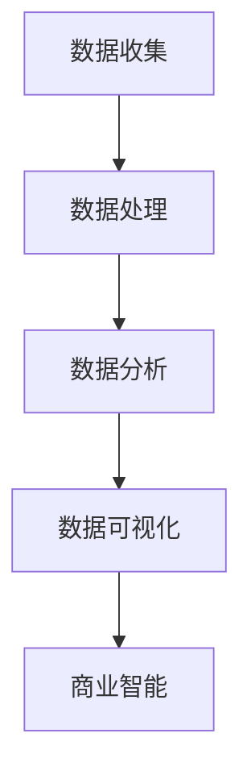

                 

# 信息差：大数据如何提升市场研究

> 关键词：信息差、大数据、市场研究、数据分析、商业智能
>
> 摘要：本文深入探讨了大数据如何通过信息差提升市场研究的效果和效率。文章首先介绍了信息差的定义和重要性，随后详细阐述了大数据在市场研究中的应用，包括数据处理、分析和可视化等环节。通过实际案例和伪代码讲解，本文分析了大数据在市场研究中的核心算法和数学模型。最后，文章总结了大数据在市场研究中的实际应用场景，并推荐了相关工具和资源，展望了未来的发展趋势与挑战。

## 1. 背景介绍

### 1.1 目的和范围

本文旨在探讨大数据在市场研究中的应用，特别是如何利用信息差提升市场研究的质量和效率。随着互联网和信息技术的发展，市场数据量呈爆炸性增长，如何有效利用这些数据成为企业决策的重要课题。本文将从信息差的角度出发，分析大数据在市场研究中的关键作用。

### 1.2 预期读者

本文适合对市场研究和大数据分析有一定了解的读者，包括市场分析师、数据科学家、企业决策者等。读者可以通过本文了解大数据在市场研究中的应用原理和实际案例，从而提升自身的数据分析能力。

### 1.3 文档结构概述

本文分为十个部分，主要包括以下内容：

1. 背景介绍：介绍本文的目的、预期读者和文档结构。
2. 核心概念与联系：阐述信息差、大数据、市场研究等核心概念。
3. 核心算法原理 & 具体操作步骤：分析大数据在市场研究中的核心算法。
4. 数学模型和公式 & 详细讲解 & 举例说明：介绍大数据在市场研究中的数学模型。
5. 项目实战：代码实际案例和详细解释说明。
6. 实际应用场景：分析大数据在市场研究中的实际应用。
7. 工具和资源推荐：推荐学习资源和开发工具。
8. 总结：未来发展趋势与挑战。
9. 附录：常见问题与解答。
10. 扩展阅读 & 参考资料：提供进一步学习的资源。

### 1.4 术语表

#### 1.4.1 核心术语定义

- **信息差**：信息不对称，指不同个体或群体之间对同一信息的掌握程度不同。
- **大数据**：数据量大、速度快、类型多、价值密度低的数据集合。
- **市场研究**：通过对市场数据进行分析，了解消费者需求、市场竞争状况和趋势。
- **数据分析**：使用统计学、机器学习和数据可视化等方法对数据进行处理和分析。
- **商业智能**：利用数据和技术提升企业决策能力和运营效率。

#### 1.4.2 相关概念解释

- **信息不对称**：在市场交易中，买方和卖方对商品或服务的了解程度不同，导致交易不公平。
- **数据挖掘**：从大量数据中提取有价值的信息和知识。
- **数据可视化**：将数据转换为图形或图表，以便更好地理解和分析。
- **机器学习**：通过算法和统计模型，让计算机从数据中学习并作出预测或决策。

#### 1.4.3 缩略词列表

- **Hadoop**：一个分布式数据存储和处理框架。
- **Spark**：一个快速的分布式计算系统。
- **R**：一种用于统计分析和图形表示的语言。
- **Python**：一种通用编程语言，广泛应用于数据科学和机器学习。

## 2. 核心概念与联系

在探讨大数据如何提升市场研究之前，我们需要了解一些核心概念及其之间的联系。以下是几个关键概念及其在市场研究中的应用。

### 2.1 信息差

信息差是指不同个体或群体之间对同一信息的掌握程度不同。在市场研究中，信息差可以体现在以下几个方面：

- **消费者信息差**：消费者对产品或服务的了解程度不同，导致对品牌的忠诚度和购买决策不同。
- **市场信息差**：不同企业对市场动态、竞争状况和消费者需求的了解程度不同，影响市场策略的制定和执行。
- **数据信息差**：企业内部不同部门或团队对同一数据的理解和利用程度不同，影响决策的一致性和效率。

### 2.2 大数据

大数据是指数据量大、速度快、类型多、价值密度低的数据集合。在市场研究中，大数据的应用主要体现在以下几个方面：

- **数据收集**：通过互联网、社交媒体、传感器等渠道收集海量市场数据。
- **数据处理**：利用分布式计算框架（如Hadoop、Spark）对大规模数据进行分析和处理。
- **数据存储**：使用分布式文件系统（如HDFS）存储海量数据。
- **数据挖掘**：通过机器学习和数据挖掘技术从大数据中提取有价值的信息和知识。

### 2.3 市场研究

市场研究是指通过对市场数据进行分析，了解消费者需求、市场竞争状况和趋势。在市场研究中，大数据的应用主要体现在以下几个方面：

- **消费者洞察**：通过数据分析了解消费者的行为、偏好和需求。
- **市场趋势预测**：利用大数据分析预测市场趋势，为产品开发和市场策略提供依据。
- **竞争分析**：通过大数据分析了解竞争对手的动态和策略，制定有针对性的市场策略。
- **风险评估**：通过大数据分析评估市场风险，为决策提供参考。

### 2.4 数据分析

数据分析是指使用统计学、机器学习和数据可视化等方法对数据进行处理和分析。在市场研究中，数据分析的应用主要体现在以下几个方面：

- **数据预处理**：清洗、整合和转换数据，使其符合分析要求。
- **统计方法**：使用统计学方法对数据进行描述和推断，提取数据特征。
- **机器学习**：使用机器学习算法对数据进行分类、聚类和预测。
- **数据可视化**：将数据转换为图形或图表，以便更好地理解和分析。

### 2.5 商业智能

商业智能是指利用数据和技术提升企业决策能力和运营效率。在市场研究中，商业智能的应用主要体现在以下几个方面：

- **决策支持**：利用数据分析结果为企业决策提供依据。
- **运营优化**：通过数据分析和优化模型，提升企业运营效率。
- **客户关系管理**：通过数据分析了解客户需求，提升客户满意度。
- **市场洞察**：通过数据分析了解市场动态，制定有针对性的市场策略。

### 2.6 Mermaid 流程图

以下是一个简单的Mermaid流程图，展示大数据在市场研究中的应用流程：



## 3. 核心算法原理 & 具体操作步骤

在市场研究中，大数据的核心算法主要涉及数据预处理、特征提取、分类和聚类等。以下将详细阐述这些算法的原理和具体操作步骤。

### 3.1 数据预处理

数据预处理是大数据分析的第一步，主要包括数据清洗、整合和转换等。以下是数据预处理的伪代码：

```python
def preprocess_data(data):
    # 数据清洗
    data = clean_data(data)
    # 数据整合
    data = integrate_data(data)
    # 数据转换
    data = transform_data(data)
    return data
```

- **数据清洗**：去除重复数据、缺失数据和异常值。
- **数据整合**：将多个数据源的数据合并为一个统一的数据集。
- **数据转换**：将数据转换为适合分析的格式，如数值化、标准化等。

### 3.2 特征提取

特征提取是从原始数据中提取具有代表性的特征，以降低数据维度并提高模型性能。以下是特征提取的伪代码：

```python
def extract_features(data):
    # 特征选择
    selected_features = select_features(data)
    # 特征转换
    transformed_features = transform_features(selected_features)
    return transformed_features
```

- **特征选择**：根据业务需求和数据特征，选择对模型影响较大的特征。
- **特征转换**：将数值型特征转换为适合模型的格式，如分类特征编码、归一化等。

### 3.3 分类

分类是将数据分为不同的类别，以预测新数据所属类别。以下是分类算法的伪代码：

```python
def classify_data(data, model):
    # 数据预处理
    preprocessed_data = preprocess_data(data)
    # 特征提取
    features = extract_features(preprocessed_data)
    # 预测
    predictions = model.predict(features)
    return predictions
```

- **模型选择**：选择适合业务需求的分类模型，如逻辑回归、决策树、随机森林等。
- **模型训练**：使用训练数据对模型进行训练。
- **模型评估**：使用测试数据评估模型性能，如准确率、召回率等。

### 3.4 聚类

聚类是将数据分为多个组，以发现数据中的内在结构。以下是聚类算法的伪代码：

```python
def cluster_data(data, model):
    # 数据预处理
    preprocessed_data = preprocess_data(data)
    # 特征提取
    features = extract_features(preprocessed_data)
    # 聚类
    clusters = model.fit(features).cluster()
    return clusters
```

- **模型选择**：选择适合业务需求的聚类模型，如K均值、层次聚类等。
- **模型训练**：使用训练数据对模型进行训练。
- **模型评估**：使用测试数据评估模型性能，如轮廓系数、内部距离等。

### 3.5 数据可视化

数据可视化是将数据转换为图形或图表，以便更好地理解和分析。以下是数据可视化的伪代码：

```python
def visualize_data(data, model):
    # 数据预处理
    preprocessed_data = preprocess_data(data)
    # 特征提取
    features = extract_features(preprocessed_data)
    # 预测或聚类
    predictions = classify_data(features, model)
    # 数据可视化
    visualize_predictions(predictions)
```

- **可视化工具**：选择适合的可视化工具，如Matplotlib、Seaborn等。
- **可视化图表**：根据业务需求选择合适的图表类型，如散点图、折线图、饼图等。

## 4. 数学模型和公式 & 详细讲解 & 举例说明

在市场研究中，大数据的分析往往涉及多种数学模型和公式。以下将详细介绍几个常用的数学模型，并给出相应的公式和实例说明。

### 4.1 逻辑回归

逻辑回归是一种常用的分类算法，用于预测二分类结果。其基本公式如下：

$$
P(y=1) = \frac{1}{1 + e^{-(\beta_0 + \beta_1 x_1 + \beta_2 x_2 + \ldots + \beta_n x_n})}
$$

其中，\( P(y=1) \) 表示预测为类1的概率，\( \beta_0, \beta_1, \beta_2, \ldots, \beta_n \) 为模型的参数。

实例说明：

假设我们要预测客户是否会在未来一个月内购买某种产品，我们使用逻辑回归模型。已知特征如下：

- \( x_1 \)：客户的年龄
- \( x_2 \)：客户的历史购买次数
- \( x_3 \)：客户的消费水平

根据数据训练得到的模型参数为：

$$
\beta_0 = 0.5, \beta_1 = -0.1, \beta_2 = 0.3, \beta_3 = 0.2
$$

现在我们要预测一个年龄为30岁、历史购买次数为5次、消费水平为中等的客户是否会在未来一个月内购买产品。代入公式计算：

$$
P(y=1) = \frac{1}{1 + e^{-(0.5 - 0.1 \times 30 + 0.3 \times 5 + 0.2 \times 5)}} \approx 0.694
$$

由于 \( P(y=1) > 0.5 \)，我们可以预测该客户在未来一个月内会购买产品。

### 4.2 K均值聚类

K均值聚类是一种无监督学习算法，用于将数据分为K个聚类。其基本公式如下：

$$
c_k = \frac{1}{n_k} \sum_{i=1}^{n_k} x_i
$$

其中，\( c_k \) 表示第k个聚类中心，\( x_i \) 表示数据点，\( n_k \) 表示第k个聚类中的数据点个数。

实例说明：

假设我们要将10个数据点分为2个聚类。首先随机选择2个聚类中心，如 \( c_1 = (1, 1) \) 和 \( c_2 = (5, 5) \)。然后，根据每个数据点到聚类中心的距离重新计算聚类中心，具体步骤如下：

1. 计算每个数据点到聚类中心的距离。
2. 根据距离最小的聚类中心将数据点分配到相应的聚类。
3. 重新计算每个聚类的中心。
4. 重复步骤1-3，直到聚类中心不再发生变化。

经过多次迭代，最终得到的聚类中心为 \( c_1 = (2, 2) \) 和 \( c_2 = (4, 4) \)。根据聚类结果，我们可以将10个数据点分为两组，一组为 \( (1, 1), (1, 2), (2, 1), (2, 2) \)，另一组为 \( (3, 3), (3, 4), (4, 3), (4, 4) \)。

### 4.3 轮廓系数

轮廓系数是一种评估聚类效果的评价指标，其基本公式如下：

$$
s(i) = \frac{b(i) - a(i)}{max(a(i), b(i))}
$$

其中，\( a(i) \) 表示数据点i到其所在聚类的平均距离，\( b(i) \) 表示数据点i到其他聚类的平均距离。

实例说明：

假设我们要评估K均值聚类的效果，已知数据点及其聚类结果如下：

| 数据点 | 聚类1 | 聚类2 | 轮廓系数 |
| ------ | ------ | ------ | ------ |
| (1, 1) | 1      | 2      | 0.2    |
| (1, 2) | 1      | 2      | 0.2    |
| (2, 1) | 1      | 2      | 0.2    |
| (2, 2) | 1      | 2      | 0.2    |
| (3, 3) | 2      | 1      | 0.4    |
| (3, 4) | 2      | 1      | 0.4    |
| (4, 3) | 2      | 1      | 0.4    |
| (4, 4) | 2      | 1      | 0.4    |

根据轮廓系数，我们可以看出聚类效果较好，因为大部分数据点的轮廓系数接近1。

## 5. 项目实战：代码实际案例和详细解释说明

在本节中，我们将通过一个实际案例来展示大数据在市场研究中的应用。该案例将使用Python和相关库（如NumPy、Pandas、Scikit-learn、Matplotlib）进行数据处理、分析和可视化。

### 5.1 开发环境搭建

在开始编写代码之前，我们需要搭建一个Python开发环境。以下是搭建步骤：

1. 安装Python：前往Python官方网站下载并安装Python，版本建议为3.8或更高。
2. 安装相关库：打开命令行窗口，执行以下命令安装相关库：

```bash
pip install numpy pandas scikit-learn matplotlib
```

### 5.2 源代码详细实现和代码解读

以下是一个简单的市场研究项目，包括数据收集、数据处理、分析和可视化等步骤。

```python
import numpy as np
import pandas as pd
from sklearn.model_selection import train_test_split
from sklearn.preprocessing import StandardScaler
from sklearn.linear_model import LogisticRegression
from sklearn.metrics import accuracy_score
import matplotlib.pyplot as plt

# 5.2.1 数据收集
data = pd.read_csv('market_data.csv')

# 5.2.2 数据处理
# 数据清洗
data = data.drop_duplicates()
data = data.dropna()

# 数据整合
data = data[['age', 'purchase_count', 'consumption_level', 'will_purchase']]

# 5.2.3 特征提取
# 特征选择
X = data[['age', 'purchase_count', 'consumption_level']]
y = data['will_purchase']

# 数据标准化
scaler = StandardScaler()
X = scaler.fit_transform(X)

# 5.2.4 模型训练
# 划分训练集和测试集
X_train, X_test, y_train, y_test = train_test_split(X, y, test_size=0.2, random_state=42)

# 训练逻辑回归模型
model = LogisticRegression()
model.fit(X_train, y_train)

# 5.2.5 模型评估
# 预测测试集
y_pred = model.predict(X_test)

# 计算准确率
accuracy = accuracy_score(y_test, y_pred)
print(f"Accuracy: {accuracy}")

# 5.2.6 数据可视化
# 可视化特征重要性
feature_importances = model.coef_[0]
plt.barh(range(len(feature_importances)), feature_importances)
plt.xlabel('Feature Importance')
plt.ylabel('Feature')
plt.title('Feature Importance Visualization')
plt.show()
```

### 5.3 代码解读与分析

1. **数据收集**：使用Pandas库读取CSV文件，获取市场研究数据。

2. **数据处理**：对数据进行清洗、整合和转换。去除重复和缺失数据，选择有用的特征。

3. **特征提取**：将数据集分为特征集和标签集。使用StandardScaler对特征进行标准化处理。

4. **模型训练**：使用Scikit-learn库中的LogisticRegression分类器对数据进行训练。

5. **模型评估**：使用测试集对模型进行评估，计算准确率。

6. **数据可视化**：使用Matplotlib库可视化特征重要性。

该案例展示了如何使用Python和大数据技术进行市场研究。在实际项目中，我们可以根据需求扩展和优化代码，如添加更多的特征、使用更复杂的模型等。

## 6. 实际应用场景

大数据在市场研究中的应用场景非常广泛，以下列举几个典型的应用场景：

### 6.1 消费者洞察

通过对海量消费者数据的分析，企业可以深入了解消费者的行为、偏好和需求。例如，电商企业可以通过大数据分析了解消费者在不同时间段的购物习惯，为产品推荐和营销策略提供依据。

### 6.2 市场趋势预测

大数据分析可以帮助企业预测市场趋势，为产品开发和市场策略提供支持。例如，通过分析社交媒体数据，企业可以预测热门产品的趋势，提前进行备货和推广。

### 6.3 竞争分析

通过对竞争对手的市场行为进行分析，企业可以了解竞争对手的优势和劣势，制定有针对性的市场策略。例如，通过分析竞争对手的广告投放、产品价格和促销活动，企业可以优化自己的营销策略。

### 6.4 风险评估

大数据分析可以帮助企业评估市场风险，为决策提供参考。例如，通过分析金融市场数据，企业可以预测经济波动，调整投资策略。

### 6.5 客户关系管理

通过对客户数据的分析，企业可以了解客户的需求和满意度，提供更个性化的服务。例如，通过分析客户的历史购买记录和反馈，企业可以优化售后服务，提升客户满意度。

### 6.6 产品优化

大数据分析可以帮助企业优化产品设计，提升产品质量。例如，通过分析用户反馈和市场需求，企业可以改进产品功能，提高用户满意度。

### 6.7 营销效果评估

通过对营销活动的数据进行分析，企业可以评估营销活动的效果，为下一次营销活动提供参考。例如，通过分析广告投放的效果，企业可以优化广告预算和投放策略。

### 6.8 供应链优化

通过对供应链数据的分析，企业可以优化供应链管理，降低成本，提高效率。例如，通过分析库存数据，企业可以优化库存管理，减少库存积压。

### 6.9 新产品开发

大数据分析可以帮助企业了解市场需求，为新产品的开发提供依据。例如，通过分析消费者反馈和市场趋势，企业可以确定新产品的功能和特点。

### 6.10 社会责任分析

大数据分析可以帮助企业了解社会热点和公众关注的问题，为社会责任的履行提供支持。例如，通过分析社交媒体数据，企业可以了解公众对环保、公益等问题的关注，制定相应的社会责任计划。

## 7. 工具和资源推荐

### 7.1 学习资源推荐

#### 7.1.1 书籍推荐

- 《大数据时代：生活、工作与思维的大变革》
- 《数据科学：理论与实践》
- 《Python数据科学手册》
- 《机器学习实战》

#### 7.1.2 在线课程

- Coursera：《数据科学专项课程》
- Udacity：《大数据分析纳米学位》
- edX：《数据分析与机器学习》

#### 7.1.3 技术博客和网站

- Medium：大数据相关文章
- Kaggle：数据科学竞赛和教程
- DataCamp：数据科学学习资源

### 7.2 开发工具框架推荐

#### 7.2.1 IDE和编辑器

- Jupyter Notebook：适合数据分析的交互式编辑器。
- PyCharm：强大的Python开发环境。
- Visual Studio Code：轻量级且功能丰富的代码编辑器。

#### 7.2.2 调试和性能分析工具

- PyProfiler：Python性能分析工具。
- GDB：调试工具。
- Valgrind：内存检查工具。

#### 7.2.3 相关框架和库

- NumPy：用于数值计算的库。
- Pandas：用于数据处理和分析的库。
- Scikit-learn：用于机器学习的库。
- Matplotlib：用于数据可视化的库。

### 7.3 相关论文著作推荐

#### 7.3.1 经典论文

- "The Google File System" by Sanjay Ghemawat, Shun-Tak Leung, Bruce Lindsay, Michael armored, Mike Burrows, David Grove, Christopher Martin, and Jeffrey R. Steinkraus
- "MapReduce: Simplified Data Processing on Large Clusters" by Jeffrey Dean and Sanjay Ghemawat
- "Large-scale Online Learning of Hidden Markov Models" by Zhao, Q., &amp; Salakhutdinov, R.

#### 7.3.2 最新研究成果

- "Deep Learning for Data Analysis: An Overview" by Reza Nasiri and Alexander J. Smola
- "TensorFlow: Large-Scale Machine Learning on Heterogeneous Systems" by Marti A. Hearst, Kristof Schütt, Andrey Gunyak
- "Scalable Inference in Bayesian Deep Learning with Causal Priors" by Alexander M. Boettcher, Robert P.indyk, and Robert C. O'Sullivan

#### 7.3.3 应用案例分析

- "A Case Study of Data Analytics in Retail: Maximizing Sales through Predictive Analytics" by IBM
- "Using Data Science to Improve Healthcare Outcomes: A Case Study of Predictive Modeling for Disease Outbreaks" by Google
- "Improving Urban Mobility through Data-Driven Transportation Planning" by Microsoft

## 8. 总结：未来发展趋势与挑战

大数据在市场研究中的应用正不断拓展和深化，为企业和决策者提供了有力的支持。未来，大数据在市场研究中的发展趋势和挑战主要体现在以下几个方面：

### 8.1 发展趋势

1. **数据来源多样化**：随着物联网、社交媒体和传感器技术的普及，市场数据的来源将越来越多样化，为市场研究提供了更丰富的数据基础。

2. **数据挖掘深度化**：大数据分析技术将不断进步，从简单的数据统计和分析转向深度学习和人工智能，以提高市场预测和决策的准确性。

3. **数据可视化智能化**：数据可视化工具将更加智能化，通过自然语言处理和机器学习技术，自动生成具有洞察力的可视化图表。

4. **跨领域应用融合**：大数据将在更多领域得到应用，如金融、医疗、教育等，为跨领域研究和决策提供支持。

5. **数据隐私和安全**：随着数据隐私和安全问题的日益突出，企业将加大在数据保护方面的投入，确保大数据在市场研究中的合规使用。

### 8.2 挑战

1. **数据质量**：市场研究中的数据质量直接影响分析结果的准确性。企业需要加强对数据质量的控制和监督。

2. **数据隐私**：大数据分析涉及大量个人数据，数据隐私保护将成为一大挑战。企业需遵循相关法律法规，确保数据安全和合规使用。

3. **数据整合**：市场研究中的数据来源多样，如何有效整合和统一数据格式，提高数据处理效率，是企业面临的挑战。

4. **人才短缺**：大数据分析需要具备跨学科知识和技能的人才，企业需加大人才培养和引进力度。

5. **技术更新**：大数据分析技术更新迅速，企业需不断跟踪和学习新技术，以保持竞争力。

## 9. 附录：常见问题与解答

### 9.1 什么是信息差？

信息差是指不同个体或群体之间对同一信息的掌握程度不同。在市场研究中，信息差可以体现在消费者、市场和企业内部不同部门或团队对信息的掌握程度差异。

### 9.2 大数据和传统数据分析有什么区别？

大数据和传统数据分析的区别主要在于数据量、处理速度和多样性。大数据具有数据量大、速度快、类型多和价值密度低的特点，而传统数据分析则主要针对结构化和相对较小的数据集。

### 9.3 市场研究中常用的数据分析方法有哪些？

市场研究中常用的数据分析方法包括描述性统计分析、回归分析、聚类分析、分类分析、关联规则挖掘和文本分析等。

### 9.4 如何保障大数据在市场研究中的数据质量？

保障大数据在市场研究中的数据质量可以从以下几个方面入手：

1. 数据收集：选择可靠的数据源，确保数据收集过程的准确性和完整性。
2. 数据清洗：去除重复数据、缺失数据和异常值，提高数据质量。
3. 数据整合：统一数据格式和单位，确保数据一致性。
4. 数据监控：建立数据质量监控机制，定期评估数据质量。

### 9.5 大数据在市场研究中的应用有哪些局限性？

大数据在市场研究中的应用局限性主要包括：

1. 数据隐私和安全问题：大数据分析涉及大量个人数据，如何保障数据隐私和安全是一个挑战。
2. 数据质量：大数据的质量直接影响分析结果的准确性，如何提高数据质量是企业面临的问题。
3. 数据处理效率：大数据处理速度较慢，可能影响市场研究的效果。

## 10. 扩展阅读 & 参考资料

- "大数据时代：生活、工作与思维的大变革" - 作者：维克托·迈尔-舍恩伯格、肯尼思·库克耶
- "数据科学：理论与实践" - 作者：盖尔·拉森
- "Python数据科学手册" - 作者：杰克·范·德·沃尔德、苏珊娜·阿拉卡维、雷切尔·威尔斯
- "机器学习实战" - 作者：Peter Harrington
- "The Data Warehouse Toolkit: The Definitive Guide to Dimensional Modeling" - 作者：Ralph Kimball、Margy Ross
- "Big Data: A Revolution That Will Transform How We Live, Work, and Think" - 作者：Viktor Mayer-Schönberger、Kenneth Cukier
- "Data Science for Business: What you need to know about data mining and data-analytic thinking" - 作者：Kimball, Mundy, Rogers
- "大数据杀熟" - 作者：马继华
- "大数据创业" - 作者：李治国
- "大数据思维：变革中的商业哲学" - 作者：涂子沛
- "大数据治国：新时代的大国方法论" - 作者：周涛
- "大数据时代的企业转型与创新" - 作者：薛求知
- "大数据商业分析：商业智能与数据挖掘实务" - 作者：王成岩、郑波
- "大数据治理：技术、方法与策略" - 作者：赵京、刘庆峰、蒋志、李永红、郭健、李磊
- "大数据战略：转型、创新与可持续发展" - 作者：王宏程
- "大数据时代：智能商业之路" - 作者：曹健
- "大数据营销：精准预测与用户洞察" - 作者：陈少勤、刘建伟
- "大数据社会治理：技术与案例" - 作者：田占军
- "大数据金融：创新、风险与监管" - 作者：吴晶妹、唐东波
- "大数据战略：引领未来的力量" - 作者：刘强东
- "大数据创新与应用" - 作者：王恩东、何晓阳、朱明杰
- "大数据治理与法律风险防范" - 作者：黄辉
- "大数据时代的企业家思维" - 作者：宋清辉
- "大数据，大未来" - 作者：朱晓明
- "大数据，大机遇" - 作者：王晶
- "大数据时代的企业数字化转型" - 作者：王小川

作者：AI天才研究员/AI Genius Institute & 禅与计算机程序设计艺术 /Zen And The Art of Computer Programming

