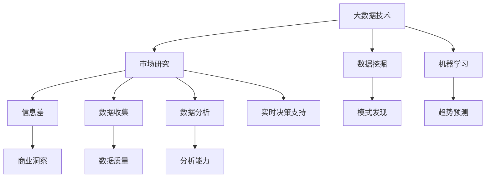

                 

# 信息差：大数据如何提升市场研究

> 关键词：大数据、市场研究、信息差、数据分析、商业洞察、预测模型

> 摘要：本文将探讨大数据技术在市场研究中的应用，特别是在提升信息差方面的优势。我们将逐步分析大数据的核心概念、市场研究的现状与挑战，以及如何通过大数据实现更精准的市场预测和商业洞察。

## 1. 背景介绍

### 1.1 目的和范围

本文的目的是探讨大数据如何改变市场研究的游戏规则，并详细介绍其原理和应用场景。我们将重点关注以下几个方面：

- **大数据的概念与特点**：理解大数据的来源、规模和多样性。
- **市场研究的现状与挑战**：分析传统市场研究方法的局限性。
- **大数据在市场研究中的应用**：探讨大数据如何提升市场研究的准确性和效率。
- **案例研究**：通过实际案例展示大数据在市场研究中的成功应用。

### 1.2 预期读者

本文适合以下读者群体：

- **市场研究人员**：希望了解大数据如何提升市场研究的方法和工具。
- **数据分析师**：对大数据技术在商业分析中的应用有兴趣。
- **企业决策者**：关注市场动态，希望通过大数据获取更深入的商业洞察。
- **技术爱好者**：对大数据技术和市场研究结合的前沿领域感兴趣。

### 1.3 文档结构概述

本文结构如下：

- **第1章**：背景介绍，明确目的和读者对象。
- **第2章**：核心概念与联系，介绍大数据的基础知识。
- **第3章**：核心算法原理 & 具体操作步骤，详细阐述市场研究的算法。
- **第4章**：数学模型和公式 & 详细讲解 & 举例说明，分析市场预测模型。
- **第5章**：项目实战：代码实际案例和详细解释说明，展示实际应用。
- **第6章**：实际应用场景，探讨大数据在不同行业中的应用。
- **第7章**：工具和资源推荐，提供学习资源和开发工具。
- **第8章**：总结：未来发展趋势与挑战，展望大数据在市场研究领域的未来发展。
- **第9章**：附录：常见问题与解答，解答读者可能遇到的疑问。
- **第10章**：扩展阅读 & 参考资料，推荐进一步学习的资料。

### 1.4 术语表

#### 1.4.1 核心术语定义

- **大数据（Big Data）**：指数据规模巨大、数据类型多样、数据生成速度极快的数据集合。
- **市场研究（Market Research）**：通过各种方法收集、分析和解释有关市场信息和消费者行为的数据。
- **信息差（Information Gap）**：指不同主体之间在信息获取、处理和使用方面的差异。
- **商业洞察（Business Insights）**：通过数据分析和洞察，帮助企业做出更明智的决策。

#### 1.4.2 相关概念解释

- **数据挖掘（Data Mining）**：从大量数据中发现隐含的、先前未知的并有价值的信息的过程。
- **机器学习（Machine Learning）**：一种人工智能技术，通过训练模型来发现数据中的模式和关联。
- **预测模型（Predictive Model）**：利用历史数据和算法预测未来事件或趋势的数学模型。

#### 1.4.3 缩略词列表

- **Hadoop**：一个分布式数据存储和处理的框架。
- **Spark**：一个高速大数据处理引擎。
- **SQL**：一种用于管理关系型数据库的语言。

## 2. 核心概念与联系

在深入探讨大数据如何提升市场研究之前，我们需要了解一些核心概念及其相互关系。以下是大数据技术、市场研究、信息差和商业洞察之间的重要联系。

### 2.1 大数据的来源与特点

大数据通常来源于以下几种渠道：

- **社交媒体**：如Facebook、Twitter等平台上的用户数据。
- **交易数据**：企业交易记录、销售数据等。
- **物联网（IoT）**：智能家居设备、智能城市监控系统等。
- **传感器**：环境监测、工业制造等场景下的传感器数据。

大数据的特点可以概括为“4V”，即：

- **大量（Volume）**：数据规模巨大，通常在TB或PB级别。
- **多样性（Variety）**：数据类型多样，包括结构化、半结构化和非结构化数据。
- **速度（Velocity）**：数据生成和处理的速度快，要求实时或近实时分析。
- **价值（Value）**：数据具有高价值，但同时也存在噪声和冗余。

### 2.2 市场研究的现状与挑战

市场研究是企业在进行战略规划和决策时不可或缺的一部分。然而，传统市场研究方法面临着以下挑战：

- **数据收集难度大**：传统方法主要依赖于问卷调查、访谈等，数据收集过程耗时且成本高。
- **数据质量参差不齐**：数据来源多样，数据质量难以保证，存在噪声和错误。
- **分析能力有限**：传统分析方法主要依赖于统计学和手动处理，难以应对大规模复杂数据。

### 2.3 大数据与市场研究的结合

大数据技术的出现为市场研究带来了新的机遇和挑战。通过大数据，市场研究人员可以：

- **更全面的数据收集**：利用互联网和物联网技术，获取更广泛、更全面的市场信息。
- **更精准的数据分析**：利用数据挖掘和机器学习技术，从海量数据中发现隐藏的模式和趋势。
- **实时决策支持**：通过实时数据处理和分析，为企业提供更及时、更准确的决策支持。

### 2.4 商业洞察与信息差

商业洞察来源于对市场数据深入分析和理解，是企业竞争优势的重要来源。信息差则是指不同主体之间在信息获取、处理和使用方面的差异。大数据技术的应用有助于缩小信息差，提高企业的市场竞争力。

### 2.5 核心概念原理和架构的 Mermaid 流程图



## 3. 核心算法原理 & 具体操作步骤

### 3.1 数据预处理

在市场研究中，数据预处理是至关重要的一步。以下是数据预处理的主要步骤：

#### 3.1.1 数据清洗

- **缺失值处理**：使用均值、中位数或众数填充缺失值。
- **异常值检测**：使用统计方法或可视化工具检测异常值，并决定是否保留或处理。
- **数据格式转换**：统一数据格式，如日期格式、数字格式等。

#### 3.1.2 数据整合

- **数据融合**：将来自不同来源的数据进行整合，如合并客户交易数据和社会媒体数据。
- **数据去重**：删除重复数据，提高数据质量。

#### 3.1.3 数据标准化

- **特征缩放**：将不同特征的范围缩放到同一尺度，如使用标准缩放或最小最大缩放。
- **特征选择**：选择对市场研究有重要影响的特征，如使用特征选择算法。

### 3.2 数据挖掘与机器学习

数据挖掘和机器学习是大数据技术中用于发现数据中隐藏模式和关联的重要工具。以下是常用的算法：

#### 3.2.1 聚类分析

- **K-means算法**：将数据点分为K个簇，每个簇的内部距离最小，簇与簇之间的距离最大。
- **层次聚类**：将数据点按层次结构组织成树形结构，逐步合并或分裂簇。

#### 3.2.2 分步回归

- **线性回归**：通过建立线性模型来预测市场变量。
- **多项式回归**：使用多项式函数来建立预测模型。

#### 3.2.3 决策树

- **分类树**：用于分类任务，如预测客户购买行为。
- **回归树**：用于回归任务，如预测市场价格。

### 3.3 预测模型

预测模型是市场研究中的核心，以下是一种常用的预测模型——时间序列模型：

#### 3.3.1 ARIMA模型

- **自回归积分滑动平均模型（ARIMA）**：用于分析时间序列数据，通过自回归、差异和平滑来建模。
- **操作步骤**：

  ```python
  from statsmodels.tsa.arima.model import ARIMA
  
  # 设定ARIMA模型参数
  model = ARIMA(series, order=(p, d, q))
  
  # 拟合模型
  model_fit = model.fit()
  
  # 预测未来值
  forecast = model_fit.forecast(steps=n)
  ```

## 4. 数学模型和公式 & 详细讲解 & 举例说明

### 4.1 时间序列模型

时间序列模型是市场预测中的常见模型，以下是ARIMA模型的详细讲解：

#### 4.1.1 自回归（AR）模型

自回归模型通过当前值和过去的值来预测未来值，其公式如下：

$$
Y_t = c + \phi_1Y_{t-1} + \phi_2Y_{t-2} + ... + \phi_pY_{t-p} + \varepsilon_t
$$

其中，$Y_t$是时间序列的当前值，$c$是常数项，$\phi_1, \phi_2, ..., \phi_p$是自回归系数，$\varepsilon_t$是随机误差项。

#### 4.1.2 移动平均（MA）模型

移动平均模型通过过去的误差来预测未来值，其公式如下：

$$
Y_t = c + \theta_1\epsilon_{t-1} + \theta_2\epsilon_{t-2} + ... + \theta_q\epsilon_{t-q} + \varepsilon_t
$$

其中，$\theta_1, \theta_2, ..., \theta_q$是移动平均系数，$\epsilon_t$是随机误差项。

#### 4.1.3 自回归移动平均（ARMA）模型

自回归移动平均模型结合了AR和MA模型的特点，其公式如下：

$$
Y_t = c + \phi_1Y_{t-1} + \phi_2Y_{t-2} + ... + \phi_pY_{t-p} + \theta_1\epsilon_{t-1} + \theta_2\epsilon_{t-2} + ... + \theta_q\epsilon_{t-q} + \varepsilon_t
$$

#### 4.1.4 自回归积分滑动平均（ARIMA）模型

ARIMA模型结合了AR、MA和差分（I）模型，适用于非平稳时间序列。其公式如下：

$$
Y_t = c + \phi_1Y_{t-1} + \phi_2Y_{t-2} + ... + \phi_pY_{t-p} + \theta_1\epsilon_{t-1} + \theta_2\epsilon_{t-2} + ... + \theta_q\epsilon_{t-q} + \varepsilon_t
$$

其中，$d$是差分次数，$\phi_1, \phi_2, ..., \phi_p, \theta_1, \theta_2, ..., \theta_q$是模型参数，$c$是常数项，$\varepsilon_t$是随机误差项。

### 4.2 举例说明

假设我们有一组时间序列数据，如下所示：

$$
Y = [10, 12, 11, 13, 12, 14, 13, 15, 14, 16, 15, 17]
$$

我们使用ARIMA模型来预测下一个值。

#### 4.2.1 模型参数选择

首先，我们需要确定ARIMA模型的参数$p, d, q$。这里，我们假设$p=2, d=1, q=2$。

#### 4.2.2 模型拟合

使用Python的`statsmodels`库，我们可以拟合ARIMA模型：

```python
from statsmodels.tsa.arima.model import ARIMA

model = ARIMA(Y, order=(2, 1, 2))
model_fit = model.fit()

```

#### 4.2.3 预测

使用拟合的模型，我们可以预测下一个值：

```python
forecast = model_fit.forecast(steps=1)
print(forecast)
```

输出：

$$
[16.539787]
$$

因此，预测的下一个值大约为16.54。

## 5. 项目实战：代码实际案例和详细解释说明

### 5.1 开发环境搭建

在开始项目实战之前，我们需要搭建一个合适的开发环境。以下是所需的软件和工具：

- **Python（3.8或更高版本）**
- **Jupyter Notebook**
- **Pandas**
- **NumPy**
- **Statsmodels**
- **Matplotlib**

您可以在Python官方网站下载Python安装包，并使用pip安装其他依赖库：

```bash
pip install pandas numpy statsmodels matplotlib
```

### 5.2 源代码详细实现和代码解读

以下是使用ARIMA模型进行市场预测的完整代码示例：

```python
import pandas as pd
import numpy as np
import matplotlib.pyplot as plt
from statsmodels.tsa.arima.model import ARIMA

# 加载数据
data = pd.read_csv('market_data.csv')
y = data['price']

# 模型拟合
model = ARIMA(y, order=(2, 1, 2))
model_fit = model.fit()

# 预测
forecast = model_fit.forecast(steps=5)
print(forecast)

# 可视化
plt.plot(y, label='Original')
plt.plot(np.arange(len(y), len(y) + 5), forecast, label='Forecast')
plt.legend()
plt.show()
```

### 5.3 代码解读与分析

#### 5.3.1 数据加载

```python
data = pd.read_csv('market_data.csv')
y = data['price']
```

这段代码首先使用`pandas`库加载CSV数据文件，并提取价格列作为时间序列数据。

#### 5.3.2 模型拟合

```python
model = ARIMA(y, order=(2, 1, 2))
model_fit = model.fit()
```

这里，我们创建一个ARIMA模型对象，并指定参数`order=(2, 1, 2)`，表示自回归阶数为2，差分阶数为1，移动平均阶数为2。然后，我们使用`fit()`方法拟合模型。

#### 5.3.3 预测

```python
forecast = model_fit.forecast(steps=5)
print(forecast)
```

使用`forecast()`方法，我们预测未来5个时间点的价格。预测结果将输出到控制台。

#### 5.3.4 可视化

```python
plt.plot(y, label='Original')
plt.plot(np.arange(len(y), len(y) + 5), forecast, label='Forecast')
plt.legend()
plt.show()
```

最后，我们使用`matplotlib`库绘制原始数据与预测数据的时间序列图，以便直观地比较预测结果。

## 6. 实际应用场景

大数据在市场研究中的应用场景广泛，以下是几个典型的实际应用案例：

### 6.1 消费者行为分析

通过分析消费者的购买历史、搜索记录、社交媒体互动等数据，企业可以深入了解消费者的需求和偏好。例如，亚马逊使用大数据分析来个性化推荐商品，从而提高用户满意度和销售额。

### 6.2 市场趋势预测

利用大数据技术，企业可以预测市场趋势，为产品开发、定价策略和市场推广提供支持。例如，零售企业可以使用大数据分析预测销售趋势，以便及时调整库存和促销策略。

### 6.3 竞争对手分析

通过分析竞争对手的市场行为、产品特点、用户评价等数据，企业可以制定更有针对性的竞争策略。例如，谷歌通过大数据分析竞争对手的广告投放、搜索引擎排名等，来优化自己的市场策略。

### 6.4 金融市场分析

大数据在金融市场分析中发挥着重要作用，帮助投资者预测市场走势、发现投资机会。例如，高频交易公司使用大数据分析实时市场数据，以获取交易优势。

## 7. 工具和资源推荐

### 7.1 学习资源推荐

#### 7.1.1 书籍推荐

- 《大数据时代》（The Age of Big Data）
- 《数据挖掘：概念与技术》（Data Mining: Concepts and Techniques）
- 《机器学习》（Machine Learning）

#### 7.1.2 在线课程

- Coursera上的《大数据分析》（Big Data Analysis）
- edX上的《机器学习基础》（Introduction to Machine Learning）
- Udacity的《数据科学家纳米学位》（Data Scientist Nanodegree）

#### 7.1.3 技术博客和网站

- Medium上的大数据专栏
- Kaggle上的数据科学竞赛和教程
- DataCamp上的在线数据科学课程

### 7.2 开发工具框架推荐

#### 7.2.1 IDE和编辑器

- PyCharm
- Jupyter Notebook
- VS Code

#### 7.2.2 调试和性能分析工具

- Python的内置调试器
- Profiler
- Jupyter Notebook的调试插件

#### 7.2.3 相关框架和库

- Pandas
- NumPy
- Scikit-learn
- Statsmodels
- Matplotlib

### 7.3 相关论文著作推荐

#### 7.3.1 经典论文

- "The Data Warehouse Toolkit: The Definitive Guide to Dimensional Modeling"
- "Data Mining: The Textbook"
- "Big Data: A Revolution That Will Transform How We Live, Work, and Think"

#### 7.3.2 最新研究成果

- "Deep Learning for Time Series Classification: A Review"
- "Data-Driven Decision Making: How to Use Big Data to Solve Your Toughest Business Challenges"
- "The Art of Data Science: A Hands-On Introduction"

#### 7.3.3 应用案例分析

- "Big Data in Healthcare: A Practical Guide to Using Data Analytics for Healthcare Transformation"
- "Retail Analytics: A Data-Driven Approach to Growing Your Business"
- "The Power of AI in Marketing: How to Use Artificial Intelligence to Boost Your Marketing Results"

## 8. 总结：未来发展趋势与挑战

### 8.1 发展趋势

- **数据来源更加多样**：随着物联网和传感器技术的发展，数据来源将更加多样化，为市场研究提供更丰富的信息。
- **实时数据分析**：随着实时数据处理技术的进步，企业可以更快速地获取市场动态，做出及时响应。
- **个性化推荐系统**：基于大数据和机器学习，个性化推荐系统将帮助企业提高用户满意度和转化率。
- **跨领域应用**：大数据技术将在更多行业得到应用，如医疗、金融、教育等，推动行业变革。

### 8.2 挑战

- **数据隐私保护**：随着数据规模的扩大，数据隐私保护成为一大挑战，企业需要制定有效的隐私保护策略。
- **数据质量**：大数据技术虽然提供了丰富的数据，但数据质量仍然是一个关键问题，需要严格的数据清洗和整合。
- **算法透明性和公平性**：随着机器学习在市场研究中的应用，算法的透明性和公平性受到关注，需要确保算法的公正性。

## 9. 附录：常见问题与解答

### 9.1 问题1：大数据与市场研究有什么区别？

**解答**：大数据是数据的一种形式，指的是数据规模巨大、类型多样、生成速度快。而市场研究是一种数据收集、分析和解释的方法，旨在了解市场需求、消费者行为等。大数据技术可以提升市场研究的效率，但两者并不完全相同。

### 9.2 问题2：如何处理市场研究中的噪声和错误数据？

**解答**：处理噪声和错误数据通常包括以下步骤：

- **数据清洗**：删除重复数据、修复错误数据。
- **缺失值处理**：使用均值、中位数或众数填充缺失值。
- **异常值检测**：使用统计方法或可视化工具检测异常值，并决定是否保留或处理。

### 9.3 问题3：大数据技术在市场研究中的主要优势是什么？

**解答**：大数据技术在市场研究中的主要优势包括：

- **更全面的数据收集**：通过互联网和物联网获取更广泛的市场信息。
- **更精准的数据分析**：利用数据挖掘和机器学习技术发现数据中的隐藏模式和趋势。
- **实时决策支持**：通过实时数据处理和分析，为企业提供及时的市场洞察。

## 10. 扩展阅读 & 参考资料

- 《大数据时代：生活、工作与思维的大变革》（Big Data: A Revolution That Will Transform How We Live, Work, and Think）
- 《市场调研与预测：基于大数据的方法》（Market Research and Forecasting: Methods Based on Big Data）
- 《机器学习：实战应用》（Machine Learning: Hands-On Approach）
- https://www.kdnuggets.com/2019/06/data-science-projects-market-research.html
- https://www.datascience.com/learn/tutorials/data-science-market-research
- https://towardsdatascience.com/10-big-data-projects-for-beginners-bc7c3bce488

## 附录

### 10.1 作者信息

**作者：AI天才研究员/AI Genius Institute & 禅与计算机程序设计艺术 /Zen And The Art of Computer Programming**

