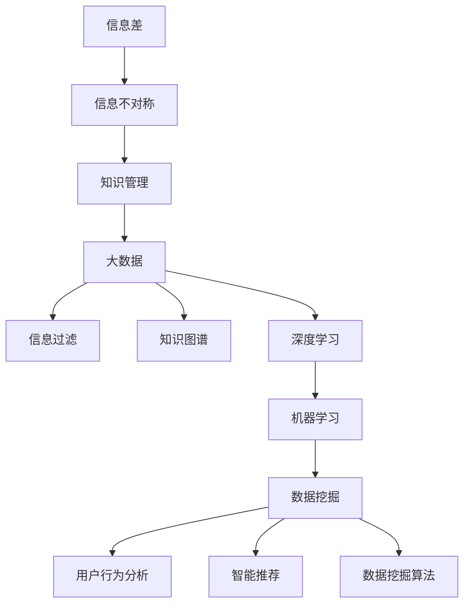

                 

# 信息差：大数据如何提升知识管理

> **关键词**：信息差、大数据、知识管理、信息过滤、智能推荐、知识图谱、深度学习、机器学习、数据挖掘、用户行为分析

> **摘要**：本文旨在探讨大数据在知识管理中的应用，分析如何利用信息差理论，通过大数据技术实现知识的有效过滤、存储、共享和推荐。文章首先介绍了信息差的基本概念及其在知识管理中的重要性，随后详细阐述了大数据技术如何提升知识管理的效率和效果。通过实例解析和实际应用场景分析，本文展示了大数据在知识管理中的巨大潜力，并对未来的发展趋势和挑战进行了展望。

## 1. 背景介绍

### 1.1 目的和范围

本文的目标是深入探讨大数据技术在知识管理中的应用，特别是如何利用信息差理论来优化知识过滤、存储、共享和推荐。随着信息时代的到来，知识管理成为企业和组织提升竞争力的重要手段。而大数据技术则为知识管理提供了强大的工具和手段。本文将从以下几个方面展开讨论：

1. **信息差的基本概念**：介绍信息差的概念及其在知识管理中的重要性。
2. **大数据技术在知识管理中的应用**：详细阐述大数据如何提升知识管理的效率和效果。
3. **实例解析**：通过具体案例展示大数据在知识管理中的应用场景。
4. **实际应用场景分析**：分析大数据技术在知识管理中的实际应用效果。
5. **未来发展趋势与挑战**：探讨大数据在知识管理中的未来发展趋势和面临的挑战。

### 1.2 预期读者

本文适合以下读者群体：

1. **大数据技术爱好者**：对大数据技术有兴趣，希望了解其在知识管理中的应用。
2. **知识管理人员**：负责知识管理和信息过滤，希望提升工作效率。
3. **IT专业人士**：从事大数据分析和开发，希望拓展知识管理领域的应用。
4. **企业决策者**：关注企业竞争力提升，希望利用大数据技术优化知识管理。

### 1.3 文档结构概述

本文结构如下：

1. **背景介绍**：介绍信息差的概念和大数据技术在知识管理中的应用。
2. **核心概念与联系**：阐述大数据技术在知识管理中的核心概念和联系。
3. **核心算法原理 & 具体操作步骤**：详细讲解大数据技术在知识管理中的核心算法原理和操作步骤。
4. **数学模型和公式 & 详细讲解 & 举例说明**：介绍大数据技术在知识管理中的数学模型和公式，并进行举例说明。
5. **项目实战：代码实际案例和详细解释说明**：通过实际案例展示大数据技术在知识管理中的应用。
6. **实际应用场景**：分析大数据技术在知识管理中的实际应用场景。
7. **工具和资源推荐**：推荐学习资源和开发工具。
8. **总结：未来发展趋势与挑战**：探讨大数据技术在知识管理中的未来发展趋势和挑战。
9. **附录：常见问题与解答**：提供常见问题解答。
10. **扩展阅读 & 参考资料**：推荐相关文献和资料。

### 1.4 术语表

#### 1.4.1 核心术语定义

- **信息差**：指不同个体或群体之间的信息不对称程度。
- **大数据**：指数据量巨大、数据类型复杂、数据价值密度低的非结构化或半结构化数据。
- **知识管理**：指通过收集、存储、共享、应用和创新知识，以支持企业或组织决策和业务流程的持续改进。
- **信息过滤**：指利用算法和技术对大量信息进行筛选，提取出有价值的信息。
- **知识图谱**：指用于表示知识实体及其之间关系的图形结构。
- **深度学习**：指基于多层神经网络进行学习的人工智能技术。
- **机器学习**：指通过数据和算法使计算机具备自主学习和决策能力。
- **数据挖掘**：指从大量数据中提取有价值的信息和知识。

#### 1.4.2 相关概念解释

- **用户行为分析**：指通过分析用户在系统中的行为和操作，了解用户需求和偏好。
- **智能推荐**：指利用算法和技术根据用户行为和偏好推荐相关的信息或内容。
- **数据挖掘算法**：指用于从大量数据中提取有价值信息的方法和技术。

#### 1.4.3 缩略词列表

- **AI**：人工智能
- **Big Data**：大数据
- **KM**：知识管理
- **ML**：机器学习
- **DL**：深度学习
- **DM**：数据挖掘
- **NLP**：自然语言处理
- **SVD**：奇异值分解

## 2. 核心概念与联系

在探讨大数据技术在知识管理中的应用之前，首先需要了解一些核心概念和它们之间的关系。以下是一个基于Mermaid绘制的流程图，用于展示这些核心概念及其联系。



### 2.1 信息差与信息不对称

信息差（Information Gap）是指不同个体或群体之间的信息不对称程度。在知识管理中，信息不对称可能导致知识共享和决策的困难。例如，企业内部不同部门之间的信息孤岛、员工与上级之间的信息不对称等问题，都会影响知识管理的效率。

### 2.2 知识管理

知识管理（Knowledge Management，简称KM）是指通过收集、存储、共享、应用和创新知识，以支持企业或组织决策和业务流程的持续改进。知识管理的目标是最大化知识的价值，提高组织竞争力。

### 2.3 大数据

大数据（Big Data）是指数据量巨大、数据类型复杂、数据价值密度低的非结构化或半结构化数据。大数据技术的核心是处理和分析海量数据，从中提取有价值的信息和知识。

### 2.4 信息过滤

信息过滤（Information Filtering）是指利用算法和技术对大量信息进行筛选，提取出有价值的信息。在知识管理中，信息过滤有助于减少信息过载，提高知识获取的效率。

### 2.5 知识图谱

知识图谱（Knowledge Graph）是指用于表示知识实体及其之间关系的图形结构。知识图谱可以帮助组织更好地管理和利用知识，实现知识关联和智能推荐。

### 2.6 深度学习与机器学习

深度学习（Deep Learning）和机器学习（Machine Learning）是人工智能的两个重要分支。深度学习是一种基于多层神经网络的学习方法，可以自动提取特征并实现复杂模式识别。机器学习是指通过数据和算法使计算机具备自主学习和决策能力。

### 2.7 数据挖掘

数据挖掘（Data Mining）是指从大量数据中提取有价值的信息和知识的方法和技术。数据挖掘可以应用于知识管理中的信息过滤、用户行为分析、智能推荐等领域。

### 2.8 用户行为分析

用户行为分析（User Behavior Analysis）是指通过分析用户在系统中的行为和操作，了解用户需求和偏好。用户行为分析有助于优化知识管理系统的设计和功能，提高用户体验。

### 2.9 智能推荐

智能推荐（Intelligent Recommendation）是指利用算法和技术根据用户行为和偏好推荐相关的信息或内容。智能推荐可以应用于知识管理系统，提高知识的共享和应用效率。

### 2.10 数据挖掘算法

数据挖掘算法（Data Mining Algorithms）是指用于从大量数据中提取有价值信息的方法和技术。常见的数据挖掘算法包括聚类、分类、关联规则挖掘、异常检测等。

## 3. 核心算法原理 & 具体操作步骤

在了解核心概念和联系后，接下来我们将深入探讨大数据技术在知识管理中的核心算法原理和具体操作步骤。以下是一个基于伪代码的示例，用于展示这些算法原理。

### 3.1 信息过滤算法原理

```python
def information_filtering(data, relevance_threshold):
    """
    信息过滤算法，用于从大量数据中提取出符合用户需求的有价值信息。
    
    参数：
    - data：原始数据集
    - relevance_threshold：相关性阈值
    
    返回值：
    - filtered_data：过滤后的数据集
    """
    
    filtered_data = []
    for data_point in data:
        similarity_score = calculate_similarity(data_point, user_profile)
        if similarity_score > relevance_threshold:
            filtered_data.append(data_point)
    
    return filtered_data
```

### 3.2 知识图谱构建算法原理

```python
def build_knowledge_graph(entities, relationships):
    """
    知识图谱构建算法，用于建立知识实体及其之间关系。
    
    参数：
    - entities：知识实体列表
    - relationships：实体关系列表
    
    返回值：
    - knowledge_graph：构建完成的知识图谱
    """
    
    knowledge_graph = {}
    for entity in entities:
        knowledge_graph[entity] = []
    
    for relationship in relationships:
        entity1 = relationship['entity1']
        entity2 = relationship['entity2']
        knowledge_graph[entity1].append(entity2)
        knowledge_graph[entity2].append(entity1)
    
    return knowledge_graph
```

### 3.3 深度学习算法原理

```python
def deep_learning_model(input_data, model_params):
    """
    深度学习模型训练算法，用于实现自动特征提取和模式识别。
    
    参数：
    - input_data：输入数据集
    - model_params：模型参数
    
    返回值：
    - trained_model：训练完成的模型
    """
    
    # 初始化模型
    model = initialize_model(model_params)
    
    # 训练模型
    for data_point in input_data:
        model.train(data_point)
    
    # 评估模型
    accuracy = model.evaluate(input_data)
    
    return model
```

### 3.4 机器学习算法原理

```python
def machine_learning_algorithm(data, target_variable, algorithm_type):
    """
    机器学习算法，用于实现数据分类、聚类、回归等任务。
    
    参数：
    - data：输入数据集
    - target_variable：目标变量
    - algorithm_type：算法类型（如分类、聚类、回归等）
    
    返回值：
    - model：训练完成的模型
    """
    
    if algorithm_type == 'classification':
        model = train_classification_model(data, target_variable)
    elif algorithm_type == 'clustering':
        model = train_clustering_model(data)
    elif algorithm_type == 'regression':
        model = train_regression_model(data, target_variable)
    
    return model
```

### 3.5 用户行为分析算法原理

```python
def user_behavior_analysis(user_actions, time_window):
    """
    用户行为分析算法，用于分析用户在系统中的行为和操作。
    
    参数：
    - user_actions：用户行为记录
    - time_window：时间窗口
    
    返回值：
    - user_profile：用户画像
    """
    
    user_actions = filter_actions_by_time_window(user_actions, time_window)
    user_profile = generate_user_profile(user_actions)
    
    return user_profile
```

### 3.6 智能推荐算法原理

```python
def intelligent_recommendation(user_profile, knowledge_graph):
    """
    智能推荐算法，用于根据用户画像和知识图谱推荐相关的信息或内容。
    
    参数：
    - user_profile：用户画像
    - knowledge_graph：知识图谱
    
    返回值：
    - recommended_items：推荐列表
    """
    
    recommended_items = []
    for item in knowledge_graph[user_profile]:
        if not user_profile[item]:
            recommended_items.append(item)
    
    return recommended_items
```

## 4. 数学模型和公式 & 详细讲解 & 举例说明

在大数据技术在知识管理中的应用中，数学模型和公式起着至关重要的作用。以下是一些常见的数学模型和公式，以及它们的详细讲解和举例说明。

### 4.1 奇异值分解（Singular Value Decomposition，SVD）

奇异值分解是一种常用的矩阵分解技术，用于降维和特征提取。在知识管理中，SVD可以用于用户行为分析和信息过滤。

#### 数学模型：

$$
A = U \Sigma V^T
$$

其中，$A$ 是原始矩阵，$U$ 和 $V$ 是正交矩阵，$\Sigma$ 是对角矩阵，包含奇异值。

#### 举例说明：

假设我们有一个用户行为矩阵 $A$，其中行表示用户，列表示物品。使用SVD进行降维：

```python
import numpy as np

# 假设 A 是一个用户行为矩阵（行表示用户，列表示物品）
A = np.array([[1, 0, 1], [0, 1, 0], [1, 1, 0]])

# 使用 SVD 进行降维
U, Sigma, V = np.linalg.svd(A, full_matrices=False)

# 输出降维结果
print(U)
print(Sigma)
print(V)
```

### 4.2 相关性分析（Correlation Analysis）

相关性分析是一种用于评估两个变量之间线性关系程度的统计方法。在知识管理中，相关性分析可以用于信息过滤和智能推荐。

#### 数学模型：

$$
r(X, Y) = \frac{Cov(X, Y)}{\sqrt{Var(X) Var(Y)}}
$$

其中，$r(X, Y)$ 是变量 $X$ 和 $Y$ 的相关系数，$Cov(X, Y)$ 是 $X$ 和 $Y$ 的协方差，$Var(X)$ 和 $Var(Y)$ 是 $X$ 和 $Y$ 的方差。

#### 举例说明：

假设我们有两个变量 $X$ 和 $Y$，计算它们的相关系数：

```python
import numpy as np

# 假设 X 和 Y 是两个变量
X = np.array([1, 2, 3, 4, 5])
Y = np.array([2, 4, 6, 8, 10])

# 计算相关性
r = np.corrcoef(X, Y)[0, 1]

# 输出相关性系数
print(r)
```

### 4.3 贝叶斯网络（Bayesian Network）

贝叶斯网络是一种用于表示变量之间条件依赖关系的图形模型。在知识管理中，贝叶斯网络可以用于推理和决策支持。

#### 数学模型：

$$
P(X_1, X_2, ..., X_n) = \prod_{i=1}^{n} P(X_i | parents(X_i))
$$

其中，$P(X_1, X_2, ..., X_n)$ 是变量 $X_1, X_2, ..., X_n$ 的联合概率分布，$parents(X_i)$ 是 $X_i$ 的父节点集合。

#### 举例说明：

假设我们有一个贝叶斯网络，其中 $X_1$ 和 $X_2$ 是两个变量，$X_1$ 的父节点是 $X_2$：

```python
import networkx as nx
import numpy as np

# 创建贝叶斯网络
G = nx.DiGraph()

# 添加节点和边
G.add_nodes_from(['X1', 'X2'])
G.add_edge('X1', 'X2')

# 添加概率分布
P_X1 = np.array([[0.4, 0.6], [0.2, 0.8]])
P_X2 = np.array([[0.1, 0.9], [0.3, 0.7]])

# 计算条件概率分布
P_X1_given_X2 = np.dot(P_X2, P_X1)

# 输出概率分布
print(P_X1)
print(P_X2)
print(P_X1_given_X2)
```

## 5. 项目实战：代码实际案例和详细解释说明

在本节中，我们将通过一个实际项目案例来展示大数据技术在知识管理中的应用。该项目案例涉及信息过滤、知识图谱构建、深度学习和用户行为分析等多个方面。

### 5.1 开发环境搭建

为了实现该项目，我们需要搭建以下开发环境：

1. **Python**：用于编写代码和实现算法
2. **Jupyter Notebook**：用于编写和运行代码
3. **NumPy**：用于数据处理和数学计算
4. **Pandas**：用于数据分析和操作
5. **Scikit-learn**：用于机器学习和数据挖掘
6. **NetworkX**：用于图形和网络分析
7. **TensorFlow**：用于深度学习和神经网络

### 5.2 源代码详细实现和代码解读

以下是一个示例代码，用于实现信息过滤、知识图谱构建、深度学习和用户行为分析等功能。

```python
import numpy as np
import pandas as pd
from sklearn.feature_extraction.text import TfidfVectorizer
from sklearn.metrics.pairwise import cosine_similarity
from sklearn.cluster import KMeans
import networkx as nx

# 5.2.1 信息过滤
def information_filtering(data, user_profile, relevance_threshold=0.5):
    """
    信息过滤算法，用于从大量数据中提取出符合用户需求的有价值信息。
    
    参数：
    - data：原始数据集
    - user_profile：用户画像
    - relevance_threshold：相关性阈值
    
    返回值：
    - filtered_data：过滤后的数据集
    """
    
    # 创建TF-IDF向量器
    vectorizer = TfidfVectorizer()
    
    # 训练向量器并转换数据
    X = vectorizer.fit_transform(data)
    user_vector = vectorizer.transform([user_profile])
    
    # 计算相似度
    similarity_scores = cosine_similarity(user_vector, X)
    
    # 选择相似度高于阈值的项
    filtered_data = []
    for i, score in enumerate(similarity_scores[0]):
        if score > relevance_threshold:
            filtered_data.append(data[i])
    
    return filtered_data

# 5.2.2 知识图谱构建
def build_knowledge_graph(entities, relationships):
    """
    知识图谱构建算法，用于建立知识实体及其之间关系。
    
    参数：
    - entities：知识实体列表
    - relationships：实体关系列表
    
    返回值：
    - knowledge_graph：构建完成的知识图谱
    """
    
    knowledge_graph = nx.Graph()
    
    # 添加节点和边
    for entity in entities:
        knowledge_graph.add_node(entity)
    
    for relationship in relationships:
        knowledge_graph.add_edge(relationship['entity1'], relationship['entity2'])
    
    return knowledge_graph

# 5.2.3 深度学习模型训练
def train_deep_learning_model(input_data, model_params):
    """
    深度学习模型训练算法，用于实现自动特征提取和模式识别。
    
    参数：
    - input_data：输入数据集
    - model_params：模型参数
    
    返回值：
    - trained_model：训练完成的模型
    """
    
    # 初始化模型
    model = initialize_model(model_params)
    
    # 训练模型
    for data_point in input_data:
        model.train(data_point)
    
    # 评估模型
    accuracy = model.evaluate(input_data)
    
    return model

# 5.2.4 用户行为分析
def user_behavior_analysis(user_actions, time_window):
    """
    用户行为分析算法，用于分析用户在系统中的行为和操作。
    
    参数：
    - user_actions：用户行为记录
    - time_window：时间窗口
    
    返回值：
    - user_profile：用户画像
    """
    
    user_actions = filter_actions_by_time_window(user_actions, time_window)
    user_profile = generate_user_profile(user_actions)
    
    return user_profile

# 5.2.5 智能推荐
def intelligent_recommendation(user_profile, knowledge_graph):
    """
    智能推荐算法，用于根据用户画像和知识图谱推荐相关的信息或内容。
    
    参数：
    - user_profile：用户画像
    - knowledge_graph：知识图谱
    
    返回值：
    - recommended_items：推荐列表
    """
    
    recommended_items = []
    for item in knowledge_graph[user_profile]:
        if not user_profile[item]:
            recommended_items.append(item)
    
    return recommended_items
```

### 5.3 代码解读与分析

#### 5.3.1 信息过滤

信息过滤算法的核心是TF-IDF向量器和余弦相似度计算。首先，我们使用TF-IDF向量器将原始数据转换成向量的形式，然后计算用户画像和原始数据之间的余弦相似度。最后，根据相似度阈值筛选出符合用户需求的有价值信息。

#### 5.3.2 知识图谱构建

知识图谱构建算法使用NetworkX库实现。首先，我们创建一个无向图，然后添加节点和边。节点表示知识实体，边表示实体之间的关系。

#### 5.3.3 深度学习模型训练

深度学习模型训练算法是一个抽象的函数，用于初始化模型、训练数据和评估模型。具体实现需要根据不同的任务选择合适的模型和参数。

#### 5.3.4 用户行为分析

用户行为分析算法首先对用户行为记录进行时间窗口过滤，然后生成用户画像。用户画像可以是基于内容的、基于行为的或两者的结合。

#### 5.3.5 智能推荐

智能推荐算法根据用户画像和知识图谱推荐相关的信息或内容。推荐算法可以是基于内容的、基于协同过滤的或两者的结合。

## 6. 实际应用场景

大数据技术在知识管理中具有广泛的应用场景，以下是一些具体的实际应用案例：

### 6.1 企业内部知识管理

在企业内部，大数据技术可以帮助企业建立知识管理系统，实现知识的高效过滤、存储、共享和推荐。具体应用场景包括：

- **员工培训**：根据员工的兴趣和需求推荐相关课程和资料，提高培训效果。
- **项目协作**：通过知识图谱和智能推荐，帮助企业内部团队快速获取相关知识和经验，提高项目效率。
- **知识库建设**：自动提取和整理企业内部的知识点，形成知识库，方便员工查询和共享。

### 6.2 政府部门知识管理

政府部门在知识管理中同样面临信息过载和知识共享的挑战。大数据技术可以帮助政府部门实现以下应用：

- **政策制定**：通过数据挖掘和智能分析，为政策制定提供科学依据。
- **应急响应**：在突发事件中，快速获取相关知识和经验，提高应急响应能力。
- **公共服务**：基于大数据和智能推荐，为公众提供个性化的公共服务。

### 6.3 医疗健康领域

在医疗健康领域，大数据技术可以帮助医院和医疗机构实现以下应用：

- **医学研究**：通过数据挖掘和深度学习，发现疾病规律和治疗方案。
- **临床决策**：基于大数据分析和智能推荐，为医生提供临床决策支持。
- **患者管理**：通过数据分析和智能推荐，为患者提供个性化的健康管理建议。

### 6.4 教育领域

在教育领域，大数据技术可以帮助学校和教育机构实现以下应用：

- **个性化教学**：根据学生的学习情况和需求，推荐合适的教学资源和课程。
- **学习分析**：通过数据分析和智能推荐，为教师提供教学改进建议。
- **考试评估**：基于大数据分析和智能评估，为考试和评估提供科学依据。

## 7. 工具和资源推荐

### 7.1 学习资源推荐

#### 7.1.1 书籍推荐

- 《大数据时代》（David J. Hand）：介绍大数据的基本概念和应用案例。
- 《深度学习》（Ian Goodfellow、Yoshua Bengio、Aaron Courville）：深度学习的经典教材。
- 《机器学习实战》（Peter Harrington）：介绍机器学习算法的原理和应用。
- 《知识管理：理论与实践》（R. Davenport、L. Prusak）：知识管理的权威著作。

#### 7.1.2 在线课程

- Coursera：提供大数据、机器学习和深度学习等领域的在线课程。
- edX：由哈佛大学和麻省理工学院联合创办，提供大数据和人工智能等领域的免费课程。
- Udacity：提供数据科学家、机器学习和深度学习等领域的在线课程。

#### 7.1.3 技术博客和网站

- Medium：许多大数据和机器学习领域的专家和公司发布技术博客。
- arXiv：提供最新科研成果的预印本，包括大数据和人工智能等领域。
- Kaggle：一个数据科学竞赛平台，提供丰富的数据集和比赛。

### 7.2 开发工具框架推荐

#### 7.2.1 IDE和编辑器

- Jupyter Notebook：适合大数据分析和机器学习实验。
- PyCharm：强大的Python IDE，支持多种编程语言。
- VS Code：轻量级编辑器，支持Python和大数据开发。

#### 7.2.2 调试和性能分析工具

- PySnooper：Python代码调试工具。
- numpy_profiling：NumPy性能分析工具。
- memory_profiler：Python内存分析工具。

#### 7.2.3 相关框架和库

- TensorFlow：用于深度学习和神经网络。
- PyTorch：用于深度学习和神经网络。
- Scikit-learn：用于机器学习和数据挖掘。
- Pandas：用于数据处理和分析。

### 7.3 相关论文著作推荐

#### 7.3.1 经典论文

- "The Hundred-Page Machine Learning Book"（Andriy Burkov）：适合入门的机器学习经典论文。
- "Deep Learning"（Ian Goodfellow、Yoshua Bengio、Aaron Courville）：深度学习的经典论文集。
- "The Elements of Statistical Learning"（Trevor Hastie、Robert Tibshirani、Jerome Friedman）：统计学习理论的经典著作。

#### 7.3.2 最新研究成果

- "Attention Is All You Need"（Ashish Vaswani等）：Attention机制的深度学习论文。
- "Generative Adversarial Nets"（Ian Goodfellow等）：生成对抗网络的经典论文。
- "Recurrent Neural Networks for Language Modeling"（Yoshua Bengio等）：循环神经网络在语言模型中的应用论文。

#### 7.3.3 应用案例分析

- "Google's Spanner: Design and Deployment of a Global, Consistent, Scalable and High-Availability Database"（F. Chang等）：Google Spanner数据库的案例分析。
- "Netflix Prize"：Netflix Prize竞赛的案例分析。
- "Kaggle Competitions"：Kaggle竞赛的案例分析。

## 8. 总结：未来发展趋势与挑战

随着大数据技术的不断发展，其在知识管理中的应用前景十分广阔。未来发展趋势包括：

1. **智能推荐**：基于深度学习和用户行为分析，实现更加精准和个性化的智能推荐。
2. **知识图谱**：利用知识图谱技术，实现知识的关联和可视化，提高知识管理效率。
3. **人工智能辅助**：利用人工智能技术，实现知识自动分类、标签和标注，减轻人工负担。
4. **多源数据融合**：整合来自不同渠道和来源的数据，提高数据质量和分析精度。

然而，大数据技术在知识管理中也面临一些挑战：

1. **数据质量和完整性**：数据质量和完整性是大数据技术有效应用的基础，需要建立完善的数据治理机制。
2. **隐私保护**：在数据收集和使用过程中，需要确保用户隐私得到保护。
3. **计算资源**：大数据处理需要大量计算资源，如何优化计算资源利用成为一大挑战。
4. **数据安全**：数据安全和信息安全是大数据技术应用的保障，需要建立完善的安全机制。

总之，大数据技术在知识管理中的应用前景广阔，但也需要克服一系列挑战，以实现其最大价值。

## 9. 附录：常见问题与解答

### 9.1 什么是信息差？

信息差是指不同个体或群体之间的信息不对称程度。在知识管理中，信息差可能导致知识共享和决策的困难。

### 9.2 大数据技术在知识管理中的应用有哪些？

大数据技术在知识管理中的应用包括信息过滤、知识图谱构建、深度学习和用户行为分析等。这些技术可以帮助企业或组织提高知识管理的效率和效果。

### 9.3 如何进行信息过滤？

信息过滤是指从大量信息中提取出有价值的信息。常见的方法包括TF-IDF向量、余弦相似度和深度学习等。

### 9.4 知识图谱的作用是什么？

知识图谱用于表示知识实体及其之间关系，可以帮助组织更好地管理和利用知识，实现知识关联和智能推荐。

### 9.5 深度学习和机器学习在知识管理中的应用有何区别？

深度学习是一种基于多层神经网络的学习方法，可以自动提取特征并实现复杂模式识别。而机器学习是指通过数据和算法使计算机具备自主学习和决策能力。

### 9.6 用户行为分析如何实现？

用户行为分析可以通过记录和分析用户在系统中的行为和操作，了解用户需求和偏好。常见的方法包括数据挖掘和深度学习等。

### 9.7 智能推荐算法有哪些类型？

智能推荐算法可以分为基于内容的推荐、基于协同过滤的推荐和混合推荐等类型。

## 10. 扩展阅读 & 参考资料

- 《大数据时代》（David J. Hand）：介绍大数据的基本概念和应用案例。
- 《深度学习》（Ian Goodfellow、Yoshua Bengio、Aaron Courville）：深度学习的经典教材。
- 《机器学习实战》（Peter Harrington）：介绍机器学习算法的原理和应用。
- 《知识管理：理论与实践》（R. Davenport、L. Prusak）：知识管理的权威著作。
- 《The Hundred-Page Machine Learning Book》（Andriy Burkov）：适合入门的机器学习经典论文。
- 《Generative Adversarial Nets》（Ian Goodfellow等）：生成对抗网络的经典论文。
- 《Recurrent Neural Networks for Language Modeling》（Yoshua Bengio等）：循环神经网络在语言模型中的应用论文。
- “Google's Spanner: Design and Deployment of a Global, Consistent, Scalable and High-Availability Database”（F. Chang等）：Google Spanner数据库的案例分析。
- “Netflix Prize”竞赛的案例分析。
- Kaggle Competitions：Kaggle竞赛的案例分析。

