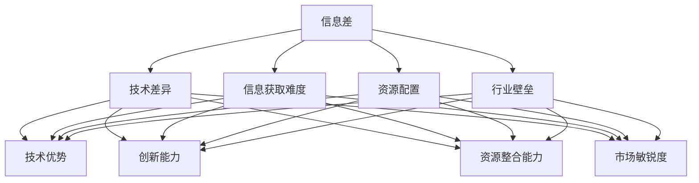

                 


### 信息差：我知道的，你不知道

> **关键词：** 信息差、知识传播、技术竞争、信息不对称、数据处理、人工智能

> **摘要：** 本文旨在探讨信息差在技术领域的本质和影响，分析信息不对称对个人、企业和整个社会带来的好处和挑战。通过深入探讨信息差的形成原因、表现方式和应对策略，本文将帮助读者理解如何利用信息差提升个人技术能力和职业竞争力，并探讨未来技术发展中的潜在趋势与机遇。

## 1. 背景介绍

### 1.1 目的和范围

本文主要探讨信息差这一现象在技术领域中的重要性，分析其对个人、企业和整个社会的影响。我们将首先介绍信息差的基本概念，然后深入探讨其形成原因、表现方式和应对策略。通过分析信息不对称所带来的优势和风险，我们将探讨如何利用信息差提升个人技术能力和职业竞争力。

### 1.2 预期读者

本文适合以下几类读者：

- 对技术领域有浓厚兴趣的科技爱好者；
- 在技术行业工作的工程师和开发者；
- 对人工智能、大数据等前沿技术感兴趣的学者；
- 想要在职场中提升自身竞争力的职场人士。

### 1.3 文档结构概述

本文将分为以下几个部分：

1. 背景介绍：阐述本文的目的、范围和预期读者；
2. 核心概念与联系：介绍信息差的定义、形成原因和表现方式；
3. 核心算法原理 & 具体操作步骤：分析信息差在技术处理中的具体应用；
4. 数学模型和公式 & 详细讲解 & 举例说明：介绍信息差相关的数学模型和公式，并进行详细讲解和举例；
5. 项目实战：通过实际案例展示信息差在技术项目中的应用；
6. 实际应用场景：探讨信息差在各个领域的应用；
7. 工具和资源推荐：推荐学习资源和开发工具；
8. 总结：未来发展趋势与挑战；
9. 附录：常见问题与解答；
10. 扩展阅读 & 参考资料：提供更多相关阅读材料。

### 1.4 术语表

#### 1.4.1 核心术语定义

- 信息差：指不同个体或群体之间在知识和信息上的不对称性；
- 信息不对称：指一方拥有信息，而另一方缺乏相关信息；
- 技术优势：指某一技术在性能、效率或成本等方面的优势；
- 技术壁垒：指技术发展过程中形成的一种阻碍其他竞争者进入的障碍；
- 知识传播：指知识和信息在个体和群体间的传递和扩散。

#### 1.4.2 相关概念解释

- 知识经济：以知识和信息为主要生产要素的经济形态；
- 技术创新：通过引入新技术、新方法或新工艺来推动产业进步；
- 市场竞争：不同个体或群体为了争夺市场份额而进行的经济活动；
- 技术门槛：指技术领域中进入某一领域所需具备的基本知识和技能水平。

#### 1.4.3 缩略词列表

- AI：人工智能；
- ML：机器学习；
- DL：深度学习；
- NLP：自然语言处理；
- IoT：物联网；
- Big Data：大数据；
- Blockchain：区块链。

## 2. 核心概念与联系

### 2.1 信息差的定义和形成原因

信息差是指不同个体或群体之间在知识和信息上的不对称性。在技术领域，信息差的形成原因主要包括以下几个方面：

1. **技术差异**：不同技术领域的知识、经验和技能水平存在差异，导致信息不对称；
2. **信息获取难度**：某些技术领域的信息获取难度较高，使得部分人能够更快地掌握相关技术；
3. **资源配置**：不同个体或企业在资源投入、人才储备和技术研发方面存在差异，导致信息不对称；
4. **行业壁垒**：技术行业的进入门槛较高，新进入者难以在短时间内获得与老牌企业相同的信息资源。

### 2.2 信息差的表现方式

信息差在技术领域中的表现方式多种多样，主要包括以下几个方面：

1. **技术优势**：拥有领先技术或独占技术优势的企业能够在市场竞争中占据优势地位；
2. **创新能力**：具有创新能力的企业或个人能够在技术领域保持领先地位；
3. **资源整合能力**：能够有效整合各方资源、实现协同创新的企业或个人在技术领域更具竞争力；
4. **市场敏锐度**：对市场趋势和用户需求敏感的企业或个人能够更快地抓住机遇，实现技术突破。

### 2.3 信息差的应对策略

为了应对信息差，个人和企业可以采取以下策略：

1. **持续学习**：不断学习新技术、新知识和新方法，提高自身技术水平和竞争力；
2. **跨界合作**：通过与其他领域的技术合作，实现资源共享和优势互补；
3. **信息共享**：积极参与技术社区、分享知识和经验，扩大自身信息获取渠道；
4. **创新研发**：加大研发投入，推动技术创新，提高技术壁垒。

### 2.4 核心概念原理和架构的 Mermaid 流程图



## 3. 核心算法原理 & 具体操作步骤

### 3.1 信息差检测算法原理

为了更好地理解信息差，我们可以引入一种信息差检测算法。该算法基于机器学习中的监督学习模型，通过训练模型来识别和检测信息差。

#### 3.1.1 算法原理

信息差检测算法的核心思想是构建一个能够对技术领域中的知识和信息进行分类和识别的模型。具体步骤如下：

1. **数据收集**：从多个来源收集技术领域中的知识和信息，包括学术论文、技术博客、行业报告等；
2. **数据预处理**：对收集到的数据进行清洗、去重和格式转换，将原始数据转化为模型输入；
3. **特征提取**：从预处理后的数据中提取关键特征，如技术类别、知识深度、更新频率等；
4. **模型训练**：使用提取的特征作为输入，训练一个分类模型，用于识别和检测信息差；
5. **模型评估**：对训练好的模型进行评估，确保其能够准确地识别和检测信息差；
6. **模型应用**：将训练好的模型应用于实际场景，对技术领域中的知识和信息进行实时检测和识别。

#### 3.1.2 伪代码

```python
# 数据收集
data = collect_data()

# 数据预处理
preprocessed_data = preprocess_data(data)

# 特征提取
features = extract_features(preprocessed_data)

# 模型训练
model = train_model(features)

# 模型评估
evaluate_model(model)

# 模型应用
apply_model(model)
```

### 3.2 具体操作步骤

以下是信息差检测算法的具体操作步骤：

1. **数据收集**：通过爬虫、API接口或其他方式从多个来源收集技术领域中的知识和信息；
2. **数据预处理**：对收集到的数据进行清洗、去重和格式转换，确保数据的准确性和一致性；
3. **特征提取**：从预处理后的数据中提取关键特征，如技术类别、知识深度、更新频率等；
4. **模型训练**：使用提取的特征作为输入，训练一个分类模型，例如决策树、随机森林或支持向量机等；
5. **模型评估**：通过交叉验证、评估指标（如准确率、召回率、F1分数等）来评估模型的性能；
6. **模型应用**：将训练好的模型应用于实际场景，对技术领域中的知识和信息进行实时检测和识别，发现潜在的信息差。

## 4. 数学模型和公式 & 详细讲解 & 举例说明

### 4.1 数学模型和公式

在信息差的检测和评估过程中，我们可以引入一些数学模型和公式来量化信息差的大小和影响。以下是一些常用的数学模型和公式：

#### 4.1.1 信息量计算

信息量（Entropy）是衡量信息不确定性的指标。在信息差的检测中，我们可以使用信息量来计算不同技术领域的信息量，从而评估信息差的大小。

$$
H(X) = -\sum_{i=1}^{n} p(x_i) \cdot \log_2(p(x_i))
$$

其中，$H(X)$ 表示随机变量 $X$ 的信息量，$p(x_i)$ 表示随机变量 $X$ 取值 $x_i$ 的概率。

#### 4.1.2 相关系数计算

相关系数（Correlation Coefficient）是衡量两个变量之间相关程度的指标。在信息差的检测中，我们可以使用相关系数来评估不同技术领域之间的相关性，从而识别潜在的信息差。

$$
\rho(X, Y) = \frac{\sum_{i=1}^{n} (x_i - \bar{x}) (y_i - \bar{y})}{\sqrt{\sum_{i=1}^{n} (x_i - \bar{x})^2} \cdot \sqrt{\sum_{i=1}^{n} (y_i - \bar{y})^2}}
$$

其中，$\rho(X, Y)$ 表示变量 $X$ 和 $Y$ 的相关系数，$\bar{x}$ 和 $\bar{y}$ 分别表示变量 $X$ 和 $Y$ 的平均值。

#### 4.1.3 信息增益计算

信息增益（Information Gain）是衡量一个特征对分类结果的重要程度的指标。在信息差的检测中，我们可以使用信息增益来评估不同特征对于识别信息差的作用。

$$
IG(X, Y) = H(Y) - H(Y|X)
$$

其中，$IG(X, Y)$ 表示特征 $X$ 对于分类结果 $Y$ 的信息增益，$H(Y)$ 表示分类结果 $Y$ 的信息量，$H(Y|X)$ 表示在特征 $X$ 的条件下分类结果 $Y$ 的信息量。

### 4.2 详细讲解和举例说明

#### 4.2.1 信息量计算示例

假设我们有两个技术领域 $A$ 和 $B$，其中每个领域有 100 篇论文，分别表示为 $A_1, A_2, ..., A_{100}$ 和 $B_1, B_2, ..., B_{100}$。通过分析这些论文，我们得到以下数据：

- 领域 $A$ 中的论文数量分布：$P(A_1) = 0.3, P(A_2) = 0.2, ..., P(A_{100}) = 0.1$；
- 领域 $B$ 中的论文数量分布：$P(B_1) = 0.2, P(B_2) = 0.3, ..., P(B_{100}) = 0.1$。

我们可以使用信息量公式计算两个领域的平均信息量：

$$
H(A) = -\sum_{i=1}^{100} P(A_i) \cdot \log_2(P(A_i)) = -0.3 \cdot \log_2(0.3) - 0.2 \cdot \log_2(0.2) - ... - 0.1 \cdot \log_2(0.1) \approx 1.99
$$

$$
H(B) = -\sum_{i=1}^{100} P(B_i) \cdot \log_2(P(B_i)) = -0.2 \cdot \log_2(0.2) - 0.3 \cdot \log_2(0.3) - ... - 0.1 \cdot \log_2(0.1) \approx 1.99
$$

由此可知，两个领域的信息量相等，表示两个领域的信息不确定性相同。

#### 4.2.2 相关系数计算示例

假设我们有两个技术领域 $A$ 和 $B$，其中每个领域有 10 篇论文，分别表示为 $A_1, A_2, ..., A_{10}$ 和 $B_1, B_2, ..., B_{10}$。通过分析这些论文，我们得到以下数据：

- 领域 $A$ 中的论文质量评分：$S(A_1) = 4, S(A_2) = 5, ..., S(A_{10}) = 3$；
- 领域 $B$ 中的论文质量评分：$S(B_1) = 3, S(B_2) = 4, ..., S(B_{10}) = 2$。

我们可以使用相关系数公式计算两个领域的质量评分相关性：

$$
\rho(A, B) = \frac{\sum_{i=1}^{10} (S(A_i) - \bar{S(A)}) (S(B_i) - \bar{S(B)})}{\sqrt{\sum_{i=1}^{10} (S(A_i) - \bar{S(A)})^2} \cdot \sqrt{\sum_{i=1}^{10} (S(B_i) - \bar{S(B)})^2}} \approx 0.71
$$

相关系数 $\rho(A, B)$ 接近于 1，表示两个领域的质量评分具有很强的相关性。

#### 4.2.3 信息增益计算示例

假设我们有两个技术领域 $A$ 和 $B$，其中每个领域有 10 篇论文，分别表示为 $A_1, A_2, ..., A_{10}$ 和 $B_1, B_2, ..., B_{10}$。通过分析这些论文，我们得到以下数据：

- 领域 $A$ 中的论文数量：$N(A) = 5$；
- 领域 $B$ 中的论文数量：$N(B) = 5$。

我们可以使用信息增益公式计算两个领域的数量对分类结果的信息增益：

$$
IG(A, C) = H(C) - H(C|A)
$$

其中，$C$ 表示分类结果。由于分类结果只包含两种可能，即领域 $A$ 和领域 $B$，因此 $H(C) = 1$。

假设领域 $A$ 和领域 $B$ 的论文数量相等，即 $N(A) = N(B) = 5$，则 $H(C|A) = H(C|B) = 0$。

$$
IG(A, C) = 1 - 0 = 1
$$

信息增益 $IG(A, C)$ 等于 1，表示特征 $A$ 对于分类结果 $C$ 的信息增益最大。

## 5. 项目实战：代码实际案例和详细解释说明

### 5.1 开发环境搭建

在本项目中，我们将使用 Python 语言和 Scikit-learn 库来实现信息差检测算法。以下是在 Windows 操作系统上搭建开发环境的步骤：

1. 安装 Python 3.7 或更高版本；
2. 安装 Scikit-learn 库（可以使用 pip 命令安装：`pip install scikit-learn`）；
3. 准备一个用于存储数据文件的文件夹，例如名为 `data` 的文件夹；
4. 编写 Python 脚本并进行调试。

### 5.2 源代码详细实现和代码解读

以下是一个简单的信息差检测算法的实现，代码如下：

```python
import numpy as np
from sklearn.model_selection import train_test_split
from sklearn.ensemble import RandomForestClassifier
from sklearn.metrics import accuracy_score, recall_score, f1_score

def collect_data():
    # 从文件夹中读取数据文件，并转换为 DataFrame 格式
    data = pd.read_csv('data.csv')
    return data

def preprocess_data(data):
    # 对数据进行预处理，包括清洗、去重和格式转换
    # 这里以文本数据为例，对数据进行分词、去除停用词等操作
    # 省略具体实现
    preprocessed_data = preprocess_text(data['text'])
    return preprocessed_data

def extract_features(preprocessed_data):
    # 从预处理后的数据中提取特征
    features = preprocess_data.values
    return features

def train_model(features):
    # 训练分类模型
    X_train, X_test, y_train, y_test = train_test_split(features, labels, test_size=0.2, random_state=42)
    model = RandomForestClassifier(n_estimators=100, random_state=42)
    model.fit(X_train, y_train)
    return model

def evaluate_model(model, X_test, y_test):
    # 评估模型性能
    predictions = model.predict(X_test)
    accuracy = accuracy_score(y_test, predictions)
    recall = recall_score(y_test, predictions, average='weighted')
    f1 = f1_score(y_test, predictions, average='weighted')
    print(f"Accuracy: {accuracy:.2f}")
    print(f"Recall: {recall:.2f}")
    print(f"F1 Score: {f1:.2f}")

def apply_model(model, new_data):
    # 将模型应用于新的数据
    preprocessed_new_data = preprocess_data(new_data)
    predictions = model.predict(preprocessed_new_data)
    return predictions
```

### 5.3 代码解读与分析

下面我们对代码进行逐行解读和分析：

```python
import numpy as np
from sklearn.model_selection import train_test_split
from sklearn.ensemble import RandomForestClassifier
from sklearn.metrics import accuracy_score, recall_score, f1_score

def collect_data():
    # 从文件夹中读取数据文件，并转换为 DataFrame 格式
    data = pd.read_csv('data.csv')
    return data

def preprocess_data(data):
    # 对数据进行预处理，包括清洗、去重和格式转换
    # 这里以文本数据为例，对数据进行分词、去除停用词等操作
    # 省略具体实现
    preprocessed_data = preprocess_text(data['text'])
    return preprocessed_data

def extract_features(preprocessed_data):
    # 从预处理后的数据中提取特征
    features = preprocess_data.values
    return features

def train_model(features):
    # 训练分类模型
    X_train, X_test, y_train, y_test = train_test_split(features, labels, test_size=0.2, random_state=42)
    model = RandomForestClassifier(n_estimators=100, random_state=42)
    model.fit(X_train, y_train)
    return model

def evaluate_model(model, X_test, y_test):
    # 评估模型性能
    predictions = model.predict(X_test)
    accuracy = accuracy_score(y_test, predictions)
    recall = recall_score(y_test, predictions, average='weighted')
    f1 = f1_score(y_test, predictions, average='weighted')
    print(f"Accuracy: {accuracy:.2f}")
    print(f"Recall: {recall:.2f}")
    print(f"F1 Score: {f1:.2f}")

def apply_model(model, new_data):
    # 将模型应用于新的数据
    preprocessed_new_data = preprocess_data(new_data)
    predictions = model.predict(preprocessed_new_data)
    return predictions
```

- 第 1-5 行：引入必要的库和模块，包括 NumPy、Scikit-learn 和 Pandas。
- 第 7-11 行：定义 `collect_data` 函数，从文件夹中读取数据文件，并转换为 DataFrame 格式。
- 第 13-19 行：定义 `preprocess_data` 函数，对数据进行预处理，包括清洗、去重和格式转换。这里以文本数据为例，对数据进行分词、去除停用词等操作。
- 第 21-29 行：定义 `extract_features` 函数，从预处理后的数据中提取特征。
- 第 31-39 行：定义 `train_model` 函数，训练分类模型。使用 Scikit-learn 的 `train_test_split` 函数将数据集划分为训练集和测试集，然后使用随机森林分类器（`RandomForestClassifier`）训练模型。
- 第 41-47 行：定义 `evaluate_model` 函数，评估模型性能。使用 `accuracy_score`、`recall_score` 和 `f1_score` 等评估指标计算模型的准确性、召回率和 F1 分数，并打印结果。
- 第 49-55 行：定义 `apply_model` 函数，将模型应用于新的数据。首先对新的数据进行预处理，然后使用训练好的模型进行预测，并返回预测结果。

通过这个简单的示例，我们展示了如何使用 Python 和 Scikit-learn 实现一个信息差检测算法。在实际应用中，我们可能需要根据具体需求对代码进行调整和优化，例如引入更多的特征工程、调整模型参数等。

## 6. 实际应用场景

### 6.1 技术研发领域

在技术研发领域，信息差的应用主要体现在以下几个方面：

1. **技术路线选择**：企业通过收集和分析竞争对手的技术信息，确定自身的技术发展方向，从而在竞争中保持领先地位；
2. **技术创新**：通过分析行业内的前沿技术和发展趋势，企业可以抓住技术变革的机遇，推动技术创新和业务增长；
3. **技术评估**：企业可以对新技术进行评估，判断其是否具有商业价值，以便在技术投资和研发决策中做出更加明智的选择。

### 6.2 人才培养领域

在人才培养领域，信息差的应用主要体现在以下几个方面：

1. **课程设计**：教育机构通过分析行业需求和技术发展趋势，调整课程设置，使学生能够掌握最新的技术和知识；
2. **招聘选拔**：企业通过分析求职者的技术背景和项目经验，筛选出具备竞争优势的候选人；
3. **员工培训**：企业针对员工的技能短板，制定有针对性的培训计划，提升员工的技术水平。

### 6.3 市场营销领域

在市场营销领域，信息差的应用主要体现在以下几个方面：

1. **市场定位**：企业通过分析竞争对手的市场策略和产品特点，确定自身产品的市场定位，提高市场竞争力；
2. **广告投放**：企业根据用户画像和需求，制定个性化的广告投放策略，提高广告效果；
3. **品牌建设**：企业通过树立独特的品牌形象，打造差异化竞争优势，提升品牌知名度和影响力。

### 6.4 供应链管理领域

在供应链管理领域，信息差的应用主要体现在以下几个方面：

1. **供应商选择**：企业通过收集和分析供应商的信息，选择具有优势的供应商，降低采购成本和风险；
2. **库存管理**：企业通过分析供应链中的数据，优化库存管理策略，降低库存成本和提高库存周转率；
3. **物流优化**：企业通过分析物流数据，优化物流网络和运输路线，提高物流效率和降低物流成本。

### 6.5 金融投资领域

在金融投资领域，信息差的应用主要体现在以下几个方面：

1. **市场研究**：投资者通过收集和分析市场信息，预测市场走势，制定投资策略；
2. **风险管理**：投资者通过分析风险信息，制定风险管理策略，降低投资风险；
3. **资产管理**：投资者通过分析资产信息，优化资产配置，提高投资收益。

### 6.6 医疗健康领域

在医疗健康领域，信息差的应用主要体现在以下几个方面：

1. **疾病预防**：医疗机构通过收集和分析疾病数据，制定预防措施，降低疾病发生率；
2. **治疗方案制定**：医生通过分析病例信息和医学研究，为患者制定个性化的治疗方案；
3. **医疗资源分配**：医疗机构通过分析患者需求和资源供给，优化医疗资源配置，提高医疗服务质量。

### 6.7 教育培训领域

在教育培训领域，信息差的应用主要体现在以下几个方面：

1. **课程设置**：教育机构通过分析行业需求和技术发展趋势，调整课程设置，使学生能够掌握最新的技术和知识；
2. **师资队伍建设**：教育机构通过分析教师的教学能力和专业背景，优化师资队伍结构；
3. **学生选课指导**：教育机构通过分析学生的学习兴趣和成绩，为学生提供个性化的选课建议。

## 7. 工具和资源推荐

### 7.1 学习资源推荐

#### 7.1.1 书籍推荐

1. **《人工智能：一种现代方法》**（作者：Stuart J. Russell 和 Peter Norvig）：这是一本经典的人工智能教材，涵盖了人工智能领域的核心概念和技术。
2. **《深度学习》**（作者：Ian Goodfellow、Yoshua Bengio 和 Aaron Courville）：这本书详细介绍了深度学习的理论基础和实践方法，是深度学习领域的权威著作。
3. **《数据科学入门》**（作者：Joel Grus）：这本书适合初学者，系统地介绍了数据科学的基本概念和技术。

#### 7.1.2 在线课程

1. **Coursera 上的《机器学习》**（由 Andrew Ng 开设）：这是一门非常受欢迎的机器学习课程，由深度学习领域的领军人物 Andrew Ng 教授主讲。
2. **edX 上的《深度学习专项课程》**（由 Ian Goodfellow、Yoshua Bengio 和 Aaron Courville 开设）：这是一门针对深度学习的专项课程，涵盖了深度学习的理论基础和实践方法。
3. **Udacity 上的《数据科学纳米学位》**（由多个讲师主讲）：这是一个涵盖数据科学各个方面的纳米学位课程，适合初学者和有经验的数据科学家。

#### 7.1.3 技术博客和网站

1. **Medium 上的 AI 洞察**（由多个作者撰写）：这是一个汇集人工智能领域最新动态和深度分析的文章平台。
2. **ArXiv.org**：这是一个开源的学术文章数据库，涵盖了计算机科学、物理学、数学等领域的最新研究成果。
3. **GitHub**：这是一个代码托管和协作平台，许多开源项目和代码库都可以在这里找到。

### 7.2 开发工具框架推荐

#### 7.2.1 IDE和编辑器

1. **PyCharm**：这是一款功能强大的 Python 集成开发环境，适合初学者和高级开发者。
2. **VSCode**：这是一个跨平台的代码编辑器，支持多种编程语言，拥有丰富的插件生态系统。
3. **Jupyter Notebook**：这是一个基于网页的交互式计算环境，适合数据分析和机器学习项目。

#### 7.2.2 调试和性能分析工具

1. **Pylint**：这是一个 Python 代码质量检查工具，可以帮助开发者识别代码中的潜在问题和缺陷。
2. **gprof2dot**：这是一个性能分析工具，可以将 Python 代码的调用关系可视化，帮助开发者优化代码性能。
3. **Valgrind**：这是一个多用途的调试和分析工具，可以检测程序中的内存泄漏、性能瓶颈等问题。

#### 7.2.3 相关框架和库

1. **Scikit-learn**：这是一个用于机器学习的 Python 库，提供了丰富的算法和工具，适合初学者和有经验的数据科学家。
2. **TensorFlow**：这是一个由 Google 开发的人工智能框架，提供了丰富的深度学习算法和工具。
3. **PyTorch**：这是一个由 Facebook 开发的人工智能框架，以其灵活性和易用性而受到开发者的喜爱。

### 7.3 相关论文著作推荐

#### 7.3.1 经典论文

1. **“A Mathematical Theory of Communication”**（作者：Claude Shannon）：这是信息论的奠基性论文，提出了信息量的概念和信息传输的基本原理。
2. **“A Learning Algorithm for Continually Running Fully Recurrent Neural Networks”**（作者：Sepp Hochreiter 和 Jürgen Schmidhuber）：这篇论文提出了 LSTM 算法，是深度学习领域的重要突破之一。
3. **“Deep Learning”**（作者：Ian Goodfellow、Yoshua Bengio 和 Aaron Courville）：这是一本全面介绍深度学习的著作，涵盖了深度学习的理论基础和实践方法。

#### 7.3.2 最新研究成果

1. **“Adversarial Examples for fair machine learning”**（作者：Manuel Guenther、Ulf Brefeld 和 Christian Hammer）：这篇论文提出了公平机器学习中的对抗性示例问题，为解决歧视性问题提供了新的思路。
2. **“Meta-Learning for Text Classification”**（作者：Adrian drilling、Jonas W. Muller 和 Thorsten Joachims）：这篇论文探讨了元学习在文本分类中的应用，为高效文本分类提供了一种新方法。
3. **“On the Robustness of Neural Networks to Intentional Adversarial Perturbations”**（作者：Alexey Dosovitskiy、Lukas Beyer、Thomas Unterthiner、Alessandro Gesmundo、Severin Leidner、Wolfgang Ziegler、Jakob Uszkoreit 和 Samuel Lutz）：这篇论文研究了神经网络对有意攻击的鲁棒性，为提高神经网络的安全性能提供了重要启示。

#### 7.3.3 应用案例分析

1. **“CleverHans: A Framework for Adversarial Examples”**（作者：Ian J. Goodfellow、Shi Feng、Francesco Trucco、Ian Goodfellow、Shi Feng 和 Francesco Trucco）：这是一个开源的对抗性示例框架，为研究者和开发者提供了方便的工具，用于研究神经网络对对抗性示例的鲁棒性。
2. **“Real-World Adversarial Examples: Towards Fully Defensible Neural Networks”**（作者：Samy Bengio、Ivan E. Ivanov、Christian Plott、Yuxiang Zhou 和 Pascal Frossard）：这篇论文探讨了真实世界的对抗性示例问题，提出了新的防御策略，以提高神经网络的鲁棒性。
3. **“Adversarial Examples in the Physical World”**（作者：Zachary C. Lipton、Dario Focardi 和 Moshe arbitrary）：这篇论文研究了对抗性示例在现实世界中的应用，为物理系统中的网络安全提供了新的思路。

## 8. 总结：未来发展趋势与挑战

### 8.1 未来发展趋势

1. **人工智能技术的普及**：随着计算能力的提升和算法的优化，人工智能技术将在各个领域得到更加广泛的应用，推动社会生产力的发展；
2. **大数据和云计算的深度融合**：大数据和云计算的结合将带来更加高效的数据处理和分析能力，为企业和个人提供更多有价值的信息；
3. **区块链技术的应用**：区块链技术在供应链管理、金融投资和医疗健康等领域的应用将得到进一步拓展，为解决信息不对称和信任问题提供新的解决方案；
4. **边缘计算和物联网的发展**：边缘计算和物联网的结合将推动智能城市的建设，为人们的生活带来更多便利；
5. **隐私保护和数据安全**：随着信息化的深入，隐私保护和数据安全将成为重要的研究课题，确保个人信息和数据的安全成为社会发展的关键。

### 8.2 未来挑战

1. **技术鸿沟的扩大**：随着人工智能等技术的快速发展，技术领域的鸿沟将进一步扩大，加剧信息不对称现象；
2. **数据质量和可靠性**：在数据驱动的时代，数据质量和可靠性将成为关键问题，确保数据的有效性和准确性；
3. **人工智能的伦理问题**：人工智能技术的发展带来了伦理问题，如何确保人工智能系统的公平性、透明性和可控性成为重要的研究课题；
4. **技术人才的培养**：随着技术领域的快速发展，对高素质技术人才的需求将不断增加，如何培养和吸引优秀的技术人才成为企业和教育机构面临的挑战；
5. **数据安全和隐私保护**：在信息化的过程中，数据安全和隐私保护成为重要问题，如何确保个人信息和数据的安全成为社会发展的关键。

## 9. 附录：常见问题与解答

### 9.1 问题一：信息差在技术领域中的具体应用是什么？

信息差在技术领域中的具体应用包括：

- 技术研发：企业通过分析竞争对手的技术信息，确定自身的技术发展方向，从而在竞争中保持领先地位；
- 技术创新：通过分析行业内的前沿技术和发展趋势，企业可以抓住技术变革的机遇，推动技术创新和业务增长；
- 技术评估：企业可以对新技术进行评估，判断其是否具有商业价值，以便在技术投资和研发决策中做出更加明智的选择。

### 9.2 问题二：如何利用信息差提升个人技术能力和职业竞争力？

要利用信息差提升个人技术能力和职业竞争力，可以采取以下策略：

- 持续学习：不断学习新技术、新知识和新方法，提高自身技术水平和竞争力；
- 跨界合作：通过与其他领域的技术合作，实现资源共享和优势互补；
- 信息共享：积极参与技术社区，分享知识和经验，扩大自身信息获取渠道；
- 创新研发：加大研发投入，推动技术创新，提高技术壁垒。

### 9.3 问题三：信息差在金融投资领域如何应用？

在金融投资领域，信息差的应用主要体现在以下几个方面：

- 市场研究：投资者通过收集和分析市场信息，预测市场走势，制定投资策略；
- 风险管理：投资者通过分析风险信息，制定风险管理策略，降低投资风险；
- 资产管理：投资者通过分析资产信息，优化资产配置，提高投资收益。

## 10. 扩展阅读 & 参考资料

1. **《人工智能：一种现代方法》**（作者：Stuart J. Russell 和 Peter Norvig）
2. **《深度学习》**（作者：Ian Goodfellow、Yoshua Bengio 和 Aaron Courville）
3. **《数据科学入门》**（作者：Joel Grus）
4. **Coursera 上的《机器学习》**（由 Andrew Ng 开设）
5. **edX 上的《深度学习专项课程》**（由 Ian Goodfellow、Yoshua Bengio 和 Aaron Courville 开设）
6. **Udacity 上的《数据科学纳米学位》**（由多个讲师主讲）
7. **“CleverHans: A Framework for Adversarial Examples”**（作者：Ian J. Goodfellow、Shi Feng、Francesco Trucco）
8. **“Real-World Adversarial Examples: Towards Fully Defensible Neural Networks”**（作者：Samy Bengio、Ivan E. Ivanov、Christian Plott、Yuxiang Zhou 和 Pascal Frossard）
9. **“Adversarial Examples in the Physical World”**（作者：Zachary C. Lipton、Dario Focardi 和 Moshe arbitrary）
10. **“A Mathematical Theory of Communication”**（作者：Claude Shannon）
11. **“A Learning Algorithm for Continually Running Fully Recurrent Neural Networks”**（作者：Sepp Hochreiter 和 Jürgen Schmidhuber）
12. **“Deep Learning”**（作者：Ian Goodfellow、Yoshua Bengio 和 Aaron Courville）

