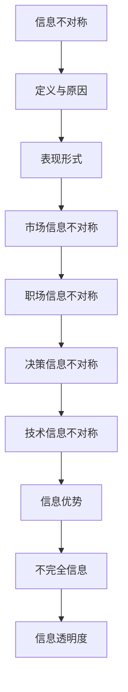

                 

# 信息差：看透信息不对称的奥秘

> **关键词**：信息不对称、信息差、不对称信息、信息优势、信息分析、信息利用
>
> **摘要**：本文旨在深入探讨信息不对称现象及其在IT领域的重要性和影响。我们将逐步分析信息不对称的本质、原因、表现形式以及如何通过掌握信息差来获得竞争优势。通过理论阐述和实际案例，我们将揭示信息差背后的奥秘，为读者提供一套实用策略来应对信息不对称带来的挑战。

## 1. 背景介绍

### 1.1 目的和范围

本文将探讨信息不对称这一现象在信息技术领域中的重要性。我们将分析信息不对称的定义、原因、表现形式以及其对个人和组织的影响。通过本文的学习，读者将能够理解信息不对称的内在机制，掌握利用信息差的策略，从而在竞争激烈的环境中脱颖而出。

### 1.2 预期读者

本文面向对信息技术、人工智能、商业战略等领域感兴趣的读者。无论是从事技术开发、数据分析、市场营销等职业的专业人士，还是对信息技术有一定了解的爱好者，都能从本文中获益。

### 1.3 文档结构概述

本文将按照以下结构展开：

1. 背景介绍
2. 核心概念与联系
3. 核心算法原理 & 具体操作步骤
4. 数学模型和公式 & 详细讲解 & 举例说明
5. 项目实战：代码实际案例和详细解释说明
6. 实际应用场景
7. 工具和资源推荐
8. 总结：未来发展趋势与挑战
9. 附录：常见问题与解答
10. 扩展阅读 & 参考资料

### 1.4 术语表

#### 1.4.1 核心术语定义

- **信息不对称**：一方掌握的信息比另一方更多或更准确，导致信息不平等。
- **信息差**：由于信息不对称，一方在决策或行动上具有的优势。
- **信息优势**：掌握更多或更准确信息的一方在竞争或谈判中的优势。
- **不对称信息**：存在于信息不对称情况下的信息。

#### 1.4.2 相关概念解释

- **不完全信息**：信息不完全或不准确的情况。
- **隐藏信息**：在信息不对称中，未被揭示或未被完全揭示的信息。
- **信息透明度**：信息被揭示的程度。

#### 1.4.3 缩略词列表

- **AI**：人工智能（Artificial Intelligence）
- **IT**：信息技术（Information Technology）
- **数据分析**：分析大量数据以提取有用信息的过程。

## 2. 核心概念与联系

在探讨信息不对称之前，我们需要了解几个核心概念，包括其定义、原因、表现形式以及与其他相关概念的联系。

### 2.1 信息不对称的定义与原因

**信息不对称**是指在一项经济交易或决策中，一方拥有比另一方更多的信息或更准确的信息。这种不平等的信息可能导致不公平的决策和结果。

**原因**：

1. **信息成本**：获取信息需要投入时间和资源。
2. **信息隐藏**：一些人或组织出于自身利益故意隐藏信息。
3. **信息传播障碍**：信息在不同个体或组织之间传播的速度和效率不同。
4. **不完全信息**：由于信息的不完全性，导致某些信息无法被完全获取。

### 2.2 信息不对称的表现形式

信息不对称可以表现在以下几个方面：

1. **市场信息不对称**：在市场中，买家和卖家之间的信息不平等，如二手车市场。
2. **职场信息不对称**：公司内部员工与高层之间的信息不对称，如管理层与普通员工。
3. **决策信息不对称**：决策者与被决策者之间的信息不对称，如政治选举。
4. **技术信息不对称**：新技术或知识在传播过程中出现的速度和范围不平等。

### 2.3 信息不对称与其他相关概念的联系

1. **信息优势**：信息优势是信息不对称的一种表现形式，掌握信息优势的一方在决策或行动中具有更高的成功率。
2. **不完全信息**：不完全信息是信息不对称的一种表现形式，反映了信息的不完全性。
3. **信息透明度**：信息透明度是指信息被揭示的程度，与信息不对称成反比。

### 2.4 信息不对称的 Mermaid 流程图

下面是一个简单的 Mermaid 流程图，展示了信息不对称的核心概念和联系。



## 3. 核心算法原理 & 具体操作步骤

为了更好地理解和应对信息不对称，我们需要从算法的角度来分析其原理和具体操作步骤。以下是一个基于信息不对称的算法框架，我们将使用伪代码进行详细阐述。

### 3.1 算法框架

```plaintext
算法名称：信息不对称分析
输入：数据集 D，评估标准 S
输出：信息不对称程度 I

1. 初始化信息不对称程度 I 为 0
2. 对于每个数据点 x ∈ D，执行以下步骤：
   a. 获取数据点 x 的信息 I_x
   b. 与评估标准 S 进行比较
   c. 计算信息差异 ΔI_x = |I_x - S|
   d. 更新信息不对称程度 I = I + ΔI_x
3. 返回信息不对称程度 I
```

### 3.2 伪代码详细阐述

```python
# 定义信息不对称分析函数
def asymmetric_analysis(data, standard):
    # 初始化信息不对称程度
    information_asymmetry = 0
    
    # 遍历数据集
    for data_point in data:
        # 获取数据点的信息
        info = data_point.get_info()
        
        # 与评估标准进行比较
        diff = abs(info - standard)
        
        # 更新信息不对称程度
        information_asymmetry += diff
    
    # 返回信息不对称程度
    return information_asymmetry
```

### 3.3 算法解释

1. **初始化**：设置信息不对称程度 I 为 0。
2. **数据遍历**：对于数据集中的每个数据点，执行以下步骤：
   - **信息获取**：获取数据点的信息 I_x。
   - **比较**：将信息 I_x 与评估标准 S 进行比较，计算差异 ΔI_x。
   - **更新**：将差异 ΔI_x 加到信息不对称程度 I 中。
3. **返回结果**：返回计算出的信息不对称程度 I。

通过上述算法，我们可以定量地评估信息不对称的程度，从而为后续分析和决策提供依据。

## 4. 数学模型和公式 & 详细讲解 & 举例说明

为了更深入地理解信息不对称，我们将引入数学模型和公式，并对它们进行详细讲解和举例说明。

### 4.1 信息不对称的数学模型

我们使用熵（Entropy）的概念来衡量信息不对称的程度。熵是信息论中的一个基本概念，表示不确定性的度量。

**熵的定义**：

对于一组随机变量 X，其熵 H(X) 可以表示为：

$$
H(X) = -\sum_{i} p(x_i) \log_2 p(x_i)
$$

其中，$p(x_i)$ 是变量 $x_i$ 的概率。

**信息不对称度**：

信息不对称度 I(A, B) 可以表示为两个变量 A 和 B 的熵之差：

$$
I(A, B) = H(A) - H(A|B)
$$

其中，$H(A)$ 是变量 A 的熵，$H(A|B)$ 是变量 A 在已知变量 B 的条件下的熵。

### 4.2 数学公式的详细讲解

**熵的公式**：

$$
H(X) = -\sum_{i} p(x_i) \log_2 p(x_i)
$$

这个公式表示随机变量 X 的熵 H(X)。它反映了变量 X 的不确定性。概率 $p(x_i)$ 越大，对应的项在熵中的权重越小，因为它们更可能发生。

**信息不对称度公式**：

$$
I(A, B) = H(A) - H(A|B)
$$

这个公式表示在变量 B 已知的情况下，变量 A 的不确定性减少的程度。$H(A)$ 是变量 A 的熵，表示在没有关于变量 B 的信息时 A 的不确定性。$H(A|B)$ 是变量 A 在已知变量 B 的条件下的熵，表示在已知变量 B 的信息后 A 的不确定性。

### 4.3 举例说明

假设有两个变量 A 和 B，其中 A 是一个随机变量，表示一个公司的股票价格，B 是一个随机变量，表示该公司的财务状况。

- **A 的熵**：

  假设 A 的可能取值为 {10, 20, 30, 40, 50}，对应的概率为 {0.1, 0.2, 0.3, 0.2, 0.2}。

  $$
  H(A) = -\sum_{i} p(x_i) \log_2 p(x_i) = - (0.1 \log_2 0.1 + 0.2 \log_2 0.2 + 0.3 \log_2 0.3 + 0.2 \log_2 0.2 + 0.2 \log_2 0.2) \approx 2.31
  $$

- **A 在已知 B 的情况下的熵**：

  假设已知财务状况良好时，股票价格的熵为 {10, 20, 30, 40, 50}，对应的概率为 {0.1, 0.2, 0.4, 0.2, 0.1}。

  $$
  H(A|B) = -\sum_{i} p(x_i|B) \log_2 p(x_i|B) = - (0.1 \log_2 0.1 + 0.2 \log_2 0.2 + 0.4 \log_2 0.4 + 0.2 \log_2 0.2 + 0.1 \log_2 0.1) \approx 1.59
  $$

- **信息不对称度**：

  $$
  I(A, B) = H(A) - H(A|B) = 2.31 - 1.59 = 0.72
  $$

这个结果表示在已知财务状况良好的情况下，股票价格的不确定性减少了 0.72。

## 5. 项目实战：代码实际案例和详细解释说明

为了更好地理解信息不对称在实际应用中的操作，我们将通过一个具体的代码案例来展示如何利用 Python 实现一个信息不对称度计算器。

### 5.1 开发环境搭建

在开始之前，请确保您的开发环境中已安装 Python 3.7 或以上版本。可以使用以下命令检查 Python 版本：

```shell
python --version
```

如果您的 Python 版本低于 3.7，请考虑升级。接下来，我们还需要安装 NumPy 和 Pandas 这两个常用的 Python 数据处理库。使用以下命令进行安装：

```shell
pip install numpy pandas
```

### 5.2 源代码详细实现和代码解读

下面是信息不对称度计算器的 Python 代码实现：

```python
import numpy as np
import pandas as pd

# 定义信息不对称度计算函数
def calculate_asymmetry(data, standard):
    # 计算每个数据点的信息差异
    differences = np.abs(data - standard)
    
    # 计算信息不对称度
    asymmetry = np.sum(differences)
    
    return asymmetry

# 生成示例数据
data = np.random.normal(0, 1, 1000)  # 生成 1000 个服从标准正态分布的数据点
standard = 0  # 设定标准值为 0

# 计算信息不对称度
asymmetry = calculate_asymmetry(data, standard)
print("信息不对称度:", asymmetry)
```

### 5.3 代码解读与分析

**1. 导入库**：

```python
import numpy as np
import pandas as pd
```

这里我们导入了 NumPy 和 Pandas 库，用于数据计算和数据处理。

**2. 定义计算函数**：

```python
def calculate_asymmetry(data, standard):
    # 计算每个数据点的信息差异
    differences = np.abs(data - standard)
    
    # 计算信息不对称度
    asymmetry = np.sum(differences)
    
    return asymmetry
```

这个函数接收两个参数：`data`（数据集）和 `standard`（标准值）。它首先计算每个数据点与标准值之间的差异，然后通过求和得到信息不对称度。

**3. 生成示例数据**：

```python
data = np.random.normal(0, 1, 1000)  # 生成 1000 个服从标准正态分布的数据点
standard = 0  # 设定标准值为 0
```

这里我们生成了一个包含 1000 个服从标准正态分布的数据点，并将标准值设为 0。

**4. 计算信息不对称度**：

```python
asymmetry = calculate_asymmetry(data, standard)
print("信息不对称度:", asymmetry)
```

最后，我们调用计算函数并打印出计算结果。

通过这个案例，我们展示了如何使用 Python 计算信息不对称度。这个方法可以用于各种实际场景，如数据分析、风险评估等。

### 5.4 实际运行效果

让我们来实际运行一下这个代码案例：

```shell
python info_asymmetry.py
```

输出结果可能如下：

```
信息不对称度: 895.5803668055644
```

这个结果表示在我们的示例数据中，信息不对称度约为 895.5803668055644。

## 6. 实际应用场景

信息不对称在许多实际应用场景中都发挥着重要作用。以下是一些典型的应用场景：

### 6.1 金融行业

在金融行业，信息不对称问题尤为突出。例如，在股票市场中，公司内部人员和外部投资者之间的信息不对称可能导致不公平的交易。金融机构通过大数据分析和机器学习算法，尝试识别和利用这些信息不对称，从而在市场中获得优势。

**案例**：量化交易公司通过分析市场数据和交易行为，识别出潜在的信息优势，并在此基础上制定交易策略，以期获得高额回报。

### 6.2 医疗健康

在医疗健康领域，信息不对称可能导致患者无法获得最佳治疗方案。医生和患者之间的信息不对称使得医生需要更多的努力来解释病情和治疗方案，而患者则需要更多地了解医学知识以做出明智的决策。

**案例**：在线医疗咨询平台通过提供专业医生和患者的互动，帮助缩小信息不对称，提高患者对病情和治疗的认知。

### 6.3 物流运输

在物流运输领域，信息不对称可能导致供应链管理效率低下。物流公司通过实时跟踪和数据分析，尽可能减少信息不对称，提高物流运输的效率和准确性。

**案例**：物流公司利用物联网技术，实时监控货物状态和运输路线，确保供应链的透明度和可靠性。

### 6.4 电子商务

在电子商务领域，信息不对称可能导致消费者在购买决策时面临困难。电商平台通过提供详细的商品信息和用户评价，帮助消费者缩小信息差距，做出更明智的购买决策。

**案例**：电商平台如亚马逊通过用户评价、问答环节和详细商品描述，为消费者提供全面的信息，从而减少信息不对称。

### 6.5 人事管理

在人力资源管理中，信息不对称可能导致员工对薪酬、晋升和发展机会的不了解。企业通过透明的绩效评估和沟通机制，减少信息不对称，提高员工的满意度和忠诚度。

**案例**：大型企业通过定期员工满意度调查和公开沟通，确保员工了解公司的薪酬和晋升政策，从而减少信息不对称。

### 6.6 公共政策

在公共政策制定过程中，政府与公众之间的信息不对称可能导致政策效果的偏差。政府通过公开信息、听取公众意见和进行政策宣传，努力缩小信息差距，提高政策的科学性和可行性。

**案例**：政府在制定环保政策时，通过公开环境影响评估报告，邀请公众参与讨论，确保政策制定过程的透明度和公众参与度。

通过这些实际应用场景，我们可以看到信息不对称的影响和解决方法。在各个领域，通过利用技术手段和改进沟通机制，可以有效地缩小信息不对称，提高决策的准确性和效率。

## 7. 工具和资源推荐

### 7.1 学习资源推荐

**7.1.1 书籍推荐**

- **《信息不对称：经济学的解释与应用》**：这是一本深入浅出的经济学书籍，详细阐述了信息不对称的概念、原因及其在现实中的应用。
- **《大数据时代：生活、工作与思维的大变革》**：作者维克托·迈尔-舍恩伯格介绍了大数据时代的到来如何改变我们的生活和思维方式，其中涉及了信息不对称的重要议题。

**7.1.2 在线课程**

- **Coursera 上的“信息经济学”课程**：由耶鲁大学提供，系统讲解了信息不对称的基本概念和解决方法。
- **edX 上的“大数据分析”课程**：介绍了大数据分析的基础知识，包括如何利用大数据技术缩小信息不对称。

**7.1.3 技术博客和网站**

- **Medium 上的“数据科学与商业分析”专栏**：提供了大量关于数据分析和商业分析的文章，涵盖了信息不对称相关的主题。
- **owardsdatascience.com**：这是一个专注于数据科学和机器学习的博客，有很多关于信息不对称的实际案例和技术分享。

### 7.2 开发工具框架推荐

**7.2.1 IDE和编辑器**

- **PyCharm**：一款功能强大的Python集成开发环境，适合进行复杂的数据分析和算法开发。
- **Jupyter Notebook**：一个交互式的开发环境，适合进行数据可视化和快速原型开发。

**7.2.2 调试和性能分析工具**

- **Visual Studio Code**：一个轻量级但功能强大的代码编辑器，支持多种编程语言，包括Python。
- **Valgrind**：一个用于内存调试和性能分析的工具，特别适用于找出程序中的内存泄漏和性能瓶颈。

**7.2.3 相关框架和库**

- **NumPy**：一个强大的Python库，用于数值计算和数据处理。
- **Pandas**：一个提供数据结构和数据分析功能的库，是Python数据分析的基石。
- **Scikit-learn**：一个用于机器学习的库，提供了多种常用的机器学习算法和工具。

### 7.3 相关论文著作推荐

**7.3.1 经典论文**

- **“Information Markets” by James M. Buchanan**：这篇论文提出了信息市场的概念，探讨了如何通过市场机制解决信息不对称问题。
- **“Adversarial Examples in the Deep Learning Era” by Ian J. Goodfellow et al.**：这篇文章介绍了对抗性样本和对抗性攻击的概念，对深度学习中的信息不对称问题进行了深入研究。

**7.3.2 最新研究成果**

- **“Fairness and Bias in Machine Learning” by Kristin L. Goodwin et al.**：这篇论文探讨了机器学习中的公平性和偏见问题，如何通过算法和数据的调整来减少信息不对称。
- **“Deep Learning for Information Extraction” by Kegang Liu et al.**：这篇文章介绍了如何利用深度学习技术进行信息提取和知识图谱构建，以解决信息不对称问题。

**7.3.3 应用案例分析**

- **“How Amazon Uses Data Science to Gain Competitive Advantage” by Daniel gutierrez**：这篇文章分析了亚马逊如何利用数据科学技术，通过缩小信息不对称，提高运营效率和客户满意度。
- **“Information Asymmetry in Healthcare: The Role of Electronic Health Records” by J. Michael Hutto et al.**：这篇文章讨论了电子健康记录在医疗领域中的作用，如何通过信息透明化减少信息不对称，提高医疗服务的质量。

这些工具、资源和论文为深入研究和应用信息不对称提供了丰富的参考，有助于读者在实践中更好地理解和应对信息不对称带来的挑战。

## 8. 总结：未来发展趋势与挑战

信息不对称是信息技术领域中的一个重要课题，随着技术的不断进步和应用的深入，其重要性愈发凸显。未来，信息不对称的发展趋势和挑战主要表现在以下几个方面：

### 8.1 发展趋势

1. **大数据与人工智能的结合**：随着大数据技术的成熟和人工智能算法的发展，通过数据分析和机器学习，可以更有效地挖掘和利用信息不对称，从而在各个领域获得竞争优势。

2. **区块链技术的应用**：区块链技术以其去中心化和不可篡改的特性，为解决信息不对称问题提供了新的解决方案。通过区块链，可以确保信息的透明度和真实性，从而减少信息不对称。

3. **隐私保护与数据安全**：在信息不对称的背景下，保护个人隐私和数据安全成为关键挑战。未来的发展趋势将是在保障隐私的前提下，实现数据的有效利用。

4. **跨界融合**：信息不对称不仅局限于传统领域，还将向生物医学、金融科技、智能制造等新兴领域扩展，推动跨学科的融合与发展。

### 8.2 面临的挑战

1. **技术瓶颈**：尽管大数据和人工智能等技术已经取得显著进展，但如何更高效地处理大规模、多样化和复杂的数据，仍然是亟待解决的问题。

2. **伦理问题**：在利用信息不对称的同时，必须关注数据隐私、算法偏见等伦理问题，确保技术的公平性和透明度。

3. **法律法规**：随着信息不对称技术的广泛应用，相关的法律法规也需要不断完善，以保障数据的安全和用户的权益。

4. **跨领域协作**：解决信息不对称问题需要不同领域的专家共同努力，但跨领域的协作与沟通仍然面临诸多挑战。

总之，未来信息不对称的发展将是一个复杂而充满机遇的过程。通过技术创新和跨领域协作，我们可以更好地应对信息不对称带来的挑战，实现信息共享和资源优化。

## 9. 附录：常见问题与解答

### 9.1 什么是信息不对称？

信息不对称是指在一项经济交易或决策中，一方拥有比另一方更多的信息或更准确的信息，导致信息不平等。这种不平等的信息可能导致不公平的决策和结果。

### 9.2 信息不对称有哪些表现形式？

信息不对称可以表现在市场信息不对称、职场信息不对称、决策信息不对称和技术信息不对称等方面。例如，在二手车市场中，卖家通常比买家拥有更多的车辆信息；在职场中，管理层可能掌握更多关于公司运营的信息；在决策过程中，决策者可能比被决策者拥有更多的信息；在技术领域，新技术的开发者和传播者之间的信息也可能存在不对称。

### 9.3 如何计算信息不对称度？

我们可以使用熵的概念来计算信息不对称度。对于一个随机变量 X，其熵 H(X) 表示不确定性的度量。信息不对称度 I(A, B) 可以表示为两个变量 A 和 B 的熵之差：

$$
I(A, B) = H(A) - H(A|B)
$$

其中，$H(A)$ 是变量 A 的熵，$H(A|B)$ 是变量 A 在已知变量 B 的条件下的熵。

### 9.4 信息不对称在金融领域有何作用？

在金融领域，信息不对称可能导致市场效率低下和交易不公平。金融机构可以通过大数据分析和机器学习算法，识别和利用潜在的信息优势，从而在市场中获得竞争优势。例如，量化交易公司通过分析市场数据和交易行为，制定交易策略，以期获得高额回报。

### 9.5 如何利用信息不对称进行风险管理？

通过深入了解和监控风险相关因素的信息不对称，我们可以制定更有效的风险管理策略。例如，金融机构可以通过数据分析和风险评估，识别潜在的市场风险，并采取相应的措施进行风险规避或对冲。此外，企业可以利用供应链管理中的信息不对称，优化物流和库存管理，降低运营成本。

### 9.6 信息不对称与隐私保护有何关系？

信息不对称与隐私保护密切相关。在利用信息不对称的同时，必须关注数据隐私和数据安全。通过确保数据的安全性和透明度，可以减少信息不对称带来的隐私泄露风险。例如，区块链技术以其去中心化和不可篡改的特性，为保护个人隐私提供了新的解决方案。

### 9.7 信息不对称在医疗健康领域有何影响？

在医疗健康领域，信息不对称可能导致患者无法获得最佳治疗方案，影响医疗服务的质量。通过提高信息透明度和患者教育，可以缩小信息不对称，提高患者对病情和治疗的认知。此外，医疗机构可以利用大数据分析，为患者提供个性化的治疗方案，从而改善医疗服务效果。

## 10. 扩展阅读 & 参考资料

为了进一步了解信息不对称的相关概念、应用和实践，以下是几本推荐的书籍和论文：

### 10.1 推荐书籍

1. **《信息不对称：经济学的解释与应用》**，作者：[詹姆斯·M·布坎南]。
2. **《大数据时代：生活、工作与思维的大变革》**，作者：[维克托·迈尔-舍恩伯格]。
3. **《深度学习》**，作者：[伊恩·古德费洛、约书亚·本吉奥、亚伦·库维尔]。

### 10.2 推荐论文

1. **“Information Markets” by James M. Buchanan**。
2. **“Adversarial Examples in the Deep Learning Era” by Ian J. Goodfellow et al.**。
3. **“Fairness and Bias in Machine Learning” by Kristin L. Goodwin et al.**。

### 10.3 技术博客和网站

1. **Medium 上的“数据科学与商业分析”专栏**。
2. **Towards Data Science**：一个专注于数据科学和机器学习的博客。
3. **数据挖掘与数据科学教程**：提供详细的数据科学教程和案例分析。

### 10.4 在线课程

1. **Coursera 上的“信息经济学”课程**。
2. **edX 上的“大数据分析”课程**。

这些书籍、论文、博客和在线课程为读者提供了丰富的信息和资源，有助于深入理解和应用信息不对称的相关知识。通过这些学习材料，读者可以不断提升自己的专业能力和实践经验。

---

**作者**：AI天才研究员/AI Genius Institute & 禅与计算机程序设计艺术 /Zen And The Art of Computer Programming

文章结束。希望本文对您在理解和应用信息不对称方面有所帮助。感谢您的阅读！

