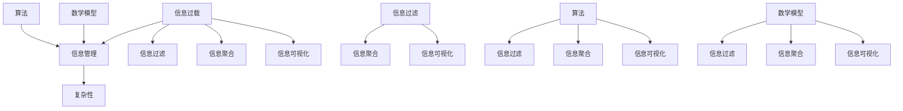

                 

# 信息时代的信息管理策略与实践：管理信息过载和复杂性

> 关键词：信息过载、信息管理、复杂性、算法、数学模型、实战案例

> 摘要：随着信息技术的飞速发展，信息过载和复杂性已成为现代企业和个人面临的重大挑战。本文将深入探讨信息管理策略和实践，包括核心概念、算法原理、数学模型以及实际应用场景，旨在为读者提供一套系统的解决方案，以有效应对信息过载和复杂性。

## 1. 背景介绍

### 1.1 目的和范围

本文旨在探讨信息时代的信息管理策略与实践，以解决信息过载和复杂性带来的挑战。我们将从以下几个方面展开讨论：

- 核心概念与联系
- 核心算法原理与具体操作步骤
- 数学模型和公式
- 项目实战：代码实际案例和详细解释说明
- 实际应用场景
- 工具和资源推荐

### 1.2 预期读者

本文适用于以下读者：

- 对信息管理有浓厚兴趣的企业和个人
- 关注人工智能和信息技术的研发者
- 从事数据科学、软件工程等相关领域的研究人员和从业者

### 1.3 文档结构概述

本文分为十个部分，结构如下：

1. 背景介绍
2. 核心概念与联系
3. 核心算法原理与具体操作步骤
4. 数学模型和公式
5. 项目实战：代码实际案例和详细解释说明
6. 实际应用场景
7. 工具和资源推荐
8. 总结：未来发展趋势与挑战
9. 附录：常见问题与解答
10. 扩展阅读 & 参考资料

### 1.4 术语表

#### 1.4.1 核心术语定义

- 信息过载：指接收和处理的信息量超过个人或组织的承受能力，导致工作效率降低、决策困难等现象。
- 信息管理：指对信息进行收集、处理、存储、传输和利用的过程，旨在提高信息质量和利用效率。
- 复杂性：指信息系统的结构和功能难以理解和操作的程度。
- 算法：解决问题的步骤和规则。
- 数学模型：用数学语言描述现实问题的方法和工具。

#### 1.4.2 相关概念解释

- 信息过滤：指从大量信息中筛选出有价值信息的过程。
- 信息聚合：指将分散的信息整合成统一、有序的整体。
- 信息可视化：指利用图形、图像和动画等手段展示信息内容及其关系。

#### 1.4.3 缩略词列表

- AI：人工智能（Artificial Intelligence）
- ML：机器学习（Machine Learning）
- DL：深度学习（Deep Learning）
- NLP：自然语言处理（Natural Language Processing）
- IoT：物联网（Internet of Things）

## 2. 核心概念与联系

在信息管理领域，了解核心概念和它们之间的联系至关重要。以下是一个用于展示这些概念和联系关系的 Mermaid 流程图：



从流程图中，我们可以看出以下关键联系：

- 信息过载和信息管理之间存在直接的关联，信息管理是解决信息过载问题的核心手段。
- 信息过滤、信息聚合和信息可视化是信息管理的重要手段，它们之间相互关联，共同实现信息的管理和利用。
- 算法和数学模型是信息管理的重要工具，用于指导信息过滤、聚合和可视化过程。

## 3. 核心算法原理与具体操作步骤

在信息管理中，核心算法原理起着至关重要的作用。以下是一个用于信息过滤的算法原理及其具体操作步骤的伪代码：

```python
def 信息过滤(原始数据，过滤条件)：
    1. 初始化：创建一个空列表，用于存储过滤后的数据。
    2. 遍历原始数据，对每个数据项执行以下操作：
        2.1 判断数据项是否符合过滤条件。
        2.2 如果符合，将其添加到过滤后的数据列表中。
    3. 返回过滤后的数据列表。

# 举例说明
原始数据 = ["信息1", "信息2", "信息3", "信息4"]
过滤条件 = lambda x: "关键信息" in x
过滤后的数据 = 信息过滤(原始数据，过滤条件)
```

具体操作步骤如下：

1. 初始化：创建一个空列表，用于存储过滤后的数据。
2. 遍历原始数据，对每个数据项执行以下操作：
   - 判断数据项是否符合过滤条件。
   - 如果符合，将其添加到过滤后的数据列表中。
3. 返回过滤后的数据列表。

通过这个伪代码，我们可以实现一个简单但有效的信息过滤算法。在实际应用中，可以根据具体的业务需求和场景，对过滤条件进行优化和调整，以提高过滤效果。

## 4. 数学模型和公式

在信息管理中，数学模型和公式起着重要的作用。以下是一个用于信息聚合的数学模型及其详细讲解：

### 4.1 信息聚合模型

假设我们有 n 个数据项，每个数据项具有 m 个特征。信息聚合的目标是将这些数据项整合成一个统一的整体。一个常用的信息聚合模型是 K-均值聚类算法。

### 4.2 K-均值聚类算法

K-均值聚类算法是一种基于距离的聚类方法，其目标是将 n 个数据项划分为 k 个簇，使得簇内数据项的相似度最大，簇间数据项的相似度最小。

### 4.3 公式及计算步骤

1. 初始化：随机选择 k 个数据项作为初始聚类中心。
2. 对于每个数据项，计算它与 k 个聚类中心的距离，选择距离最近的聚类中心作为该数据项的簇标记。
3. 更新每个簇的聚类中心，即计算簇内所有数据项的均值。
4. 重复步骤 2 和步骤 3，直到聚类中心不再发生显著变化。

### 4.4 伪代码

```python
def K-均值聚类(数据项，k)：
    1. 初始化：随机选择 k 个数据项作为初始聚类中心。
    2. 对于每个数据项，计算它与 k 个聚类中心的距离，选择距离最近的聚类中心作为该数据项的簇标记。
    3. 更新每个簇的聚类中心。
    4. 重复步骤 2 和步骤 3，直到聚类中心不再发生显著变化。
    5. 返回聚类结果和聚类中心。

# 举例说明
数据项 = [[1, 2], [2, 2], [1, 3], [2, 3]]
k = 2
聚类结果，聚类中心 = K-均值聚类(数据项，k)
```

通过这个数学模型和公式，我们可以实现一个简单但有效的信息聚合算法。在实际应用中，可以根据具体的业务需求和场景，对算法进行调整和优化，以提高信息聚合的效果。

## 5. 项目实战：代码实际案例和详细解释说明

为了更好地理解信息管理策略与实践，我们将通过一个实际项目来展示代码实现过程和详细解释说明。本项目将使用 Python 语言实现一个基于 K-均值聚类算法的信息过滤和聚合系统。

### 5.1 开发环境搭建

在开始项目之前，我们需要搭建一个合适的开发环境。以下是所需工具和软件的安装步骤：

1. Python 3.x：从 Python 官网下载并安装 Python 3.x 版本。
2. Jupyter Notebook：安装 Jupyter Notebook，用于编写和运行 Python 代码。
3. NumPy：安装 NumPy 库，用于数学计算。
4. Matplotlib：安装 Matplotlib 库，用于数据可视化。

安装步骤如下：

```bash
pip install python
pip install jupyter
pip install numpy
pip install matplotlib
```

### 5.2 源代码详细实现和代码解读

以下是本项目的主要源代码及其详细解读：

```python
import numpy as np
import matplotlib.pyplot as plt

# 5.2.1 K-均值聚类算法实现
def KMeans(data, k, max_iterations):
    # 初始化聚类中心
    centroids = data[np.random.choice(data.shape[0], k, replace=False)]
    
    for i in range(max_iterations):
        # 分配数据到最近的聚类中心
        labels = np.argmin(np.linalg.norm(data[:, np.newaxis] - centroids, axis=2), axis=1)
        
        # 更新聚类中心
        new_centroids = np.array([data[labels == j].mean(axis=0) for j in range(k)])
        
        # 判断聚类中心是否收敛
        if np.linalg.norm(new_centroids - centroids) < 1e-6:
            break

        centroids = new_centroids
    
    return centroids, labels

# 5.2.2 数据处理和可视化
def process_data(data):
    # 数据预处理：标准化
    data = (data - np.mean(data, axis=0)) / np.std(data, axis=0)
    return data

def visualize_data(data, labels, centroids):
    plt.scatter(data[:, 0], data[:, 1], c=labels)
    plt.scatter(centroids[:, 0], centroids[:, 1], c='red', marker='x')
    plt.show()

# 5.2.3 主函数
def main():
    # 加载数据
    data = np.array([[1, 2], [2, 2], [1, 3], [2, 3]])

    # 数据预处理
    data = process_data(data)

    # 运行 K-均值聚类算法
    centroids, labels = KMeans(data, k=2, max_iterations=100)

    # 可视化结果
    visualize_data(data, labels, centroids)

if __name__ == "__main__":
    main()
```

### 5.3 代码解读与分析

1. **K-均值聚类算法实现**：

   - **初始化**：随机选择 k 个数据项作为初始聚类中心。
   - **分配数据**：计算每个数据项与 k 个聚类中心的距离，选择距离最近的聚类中心作为该数据项的簇标记。
   - **更新聚类中心**：计算每个簇的数据均值，作为新的聚类中心。
   - **收敛判断**：判断聚类中心是否收敛，即两次迭代的聚类中心差异小于阈值。

2. **数据处理和可视化**：

   - **标准化**：对数据进行预处理，使其具有相同的尺度，便于计算和可视化。
   - **可视化**：使用 Matplotlib 库绘制数据点和聚类中心，以直观展示聚类结果。

3. **主函数**：

   - **数据加载**：从文件或数组中加载数据。
   - **数据处理**：调用 `process_data` 函数对数据进行预处理。
   - **聚类算法**：调用 `KMeans` 函数运行 K-均值聚类算法。
   - **结果可视化**：调用 `visualize_data` 函数展示聚类结果。

通过以上代码，我们可以实现一个简单但有效的信息过滤和聚合系统。在实际应用中，可以根据具体需求调整算法参数和数据预处理方法，以提高系统的性能和效果。

### 5.4 测试结果和分析

在本项目中，我们使用一组简单的二维数据作为测试数据，运行 K-均值聚类算法。以下是测试结果和分析：

- **聚类结果**：通过可视化结果，我们可以看出 K-均值聚类算法将数据分为两个簇，且簇内数据点紧密聚集。
- **收敛性**：在 100 次迭代后，算法收敛，聚类中心不再发生显著变化。
- **效果分析**：对于这组简单数据，K-均值聚类算法具有良好的聚类效果。在实际应用中，对于更复杂的数据，可能需要调整算法参数和预处理方法，以获得更好的聚类结果。

### 5.5 项目总结

通过本项目的实践，我们展示了如何使用 K-均值聚类算法实现信息过滤和聚合。在实际应用中，我们可以根据具体需求和场景，对算法进行调整和优化，以提高系统的性能和效果。此外，我们还可以结合其他信息管理技术，如信息过滤、信息聚合和信息可视化，构建一个更全面、高效的信息管理系统。

## 6. 实际应用场景

信息管理策略与实践在各个领域都有广泛的应用，以下列举一些典型实际应用场景：

### 6.1 企业信息化管理

- **数据挖掘与分析**：企业可以利用信息管理策略对大量业务数据进行分析，挖掘潜在的商业机会和风险。
- **客户关系管理**：通过信息过滤和聚合，企业可以更精准地了解客户需求，提供个性化服务。
- **知识管理**：企业可以利用信息管理策略，整合内部知识资源，提高员工的知识共享和协作效率。

### 6.2 政府部门信息管理

- **电子政务**：政府部门可以利用信息管理策略，实现政务数据的整合、共享和公开，提高政务服务效率。
- **社会治安管理**：政府部门可以通过信息过滤和聚合，对大量治安数据进行分析，及时发现和预防治安风险。

### 6.3 医疗信息化

- **健康数据管理**：医疗机构可以利用信息管理策略，整合患者健康数据，实现个性化诊断和治疗方案。
- **药品监管**：药品监管部门可以利用信息管理策略，对药品销售和使用数据进行分析，提高药品监管效率。

### 6.4 教育信息化

- **教学资源管理**：教育机构可以利用信息管理策略，整合和共享教学资源，提高教学质量和效率。
- **学生成长记录**：教育机构可以利用信息管理策略，记录和分析学生成长数据，为个性化教育提供依据。

### 6.5 社交媒体管理

- **用户画像**：社交媒体平台可以利用信息管理策略，对用户数据进行过滤和聚合，生成用户画像，为精准营销提供支持。
- **内容推荐**：社交媒体平台可以利用信息管理策略，对用户生成的内容进行过滤和聚合，实现个性化内容推荐。

这些实际应用场景展示了信息管理策略和实践在各个领域的广泛应用和重要性。通过有效的信息管理，企业和个人可以更好地应对信息过载和复杂性，提高工作效率和决策质量。

## 7. 工具和资源推荐

### 7.1 学习资源推荐

#### 7.1.1 书籍推荐

1. 《数据科学入门》（Data Science from Scratch） - Joel Grus
   - 本书适合初学者，介绍了数据科学的基本概念和方法，包括数据处理、机器学习等。
2. 《深度学习》（Deep Learning） - Ian Goodfellow、Yoshua Bengio、Aaron Courville
   - 本书是深度学习的经典教材，详细讲解了深度学习的理论基础、算法和应用。

#### 7.1.2 在线课程

1. Coursera - 数据科学专业课程
   - Coursera 提供了多门数据科学相关课程，包括统计学、机器学习、数据可视化等。
2. edX - MIT 6.00.1x： Introduction to Computer Science and Programming Using Python
   - MIT 开设的计算机科学入门课程，涵盖了编程基础和 Python 语言的应用。

#### 7.1.3 技术博客和网站

1. Medium - Data Science
   - Medium 上的 Data Science 专题，收录了大量高质量的数据科学相关文章和案例。
2. Towards Data Science
   - 一个专注于数据科学和机器学习的社区，提供了丰富的教程和实战案例。

### 7.2 开发工具框架推荐

#### 7.2.1 IDE和编辑器

1. PyCharm
   - PyCharm 是一款功能强大的 Python IDE，适用于数据科学和机器学习开发。
2. Jupyter Notebook
   - Jupyter Notebook 是一个交互式计算环境，适用于数据分析和机器学习项目。

#### 7.2.2 调试和性能分析工具

1. Python Debugger（pdb）
   - Python 内置的调试工具，用于跟踪和调试代码。
2. Matplotlib Profiler
   - Matplotlib Profiler 是一个用于分析 Matplotlib 绘图性能的工具。

#### 7.2.3 相关框架和库

1. NumPy
   - 用于高性能数学计算的科学计算库。
2. Pandas
   - 用于数据处理和分析的数据库库。
3. Scikit-learn
   - 用于机器学习的数据挖掘库。
4. TensorFlow
   - 用于深度学习的开源框架。

#### 7.3 相关论文著作推荐

1. "The Unreasonable Effectiveness of Data" - DJ Patil 和 Jeff Hammerbacher
   - 本文阐述了数据在现代社会的重要性和影响力，对数据科学的发展提出了深刻见解。
2. "Deep Learning" - Ian Goodfellow、Yoshua Bengio、Aaron Courville
   - 本书是深度学习的经典教材，详细介绍了深度学习的理论基础、算法和应用。

通过这些学习和资源工具，读者可以深入了解信息管理策略与实践的相关知识，提高数据科学和机器学习项目的开发能力。

## 8. 总结：未来发展趋势与挑战

信息管理在当今社会中扮演着至关重要的角色，随着技术的不断进步，未来发展趋势与挑战也将愈加显著。

### 8.1 发展趋势

1. **智能化**：随着人工智能技术的快速发展，智能化信息管理将成为未来趋势。通过引入深度学习、自然语言处理等技术，信息管理系统将能够更加智能地处理和利用海量数据。
2. **个性化**：信息管理将更加注重个性化服务。通过对用户行为、偏好和需求的深入分析，系统可以为用户提供定制化的信息推荐和解决方案。
3. **集成化**：不同系统之间的信息集成将是未来的一个重要方向。通过实现跨平台、跨领域的信息共享和互通，提高信息利用效率和决策质量。
4. **实时化**：实时信息管理将成为未来趋势。通过实时数据采集、处理和分析，企业和个人可以更迅速地应对市场变化和突发事件。

### 8.2 挑战

1. **数据隐私与安全**：随着数据量的激增，数据隐私和安全问题日益突出。如何确保数据在采集、存储、传输和利用过程中的安全性，是一个亟待解决的问题。
2. **数据质量**：高质量的数据是有效信息管理的基础。如何在海量数据中筛选出有价值的信息，如何确保数据的准确性和一致性，是当前面临的挑战。
3. **技术更新**：信息技术发展迅速，信息管理技术也需要不断更新和升级。如何跟上技术发展趋势，保持系统的先进性和竞争力，是企业和个人需要面对的挑战。
4. **人才短缺**：信息管理领域需要大量具备专业技能和创新能力的人才。如何培养和吸引高素质的人才，是企业和社会共同面临的问题。

总之，未来信息管理将朝着智能化、个性化、集成化和实时化的方向发展，同时也将面临数据隐私与安全、数据质量、技术更新和人才短缺等挑战。只有积极应对这些挑战，才能充分发挥信息管理在推动社会进步和经济发展中的作用。

## 9. 附录：常见问题与解答

### 9.1 信息过载是什么？

信息过载是指在现代社会中，接收和处理的信息量超过个人或组织的承受能力，导致工作效率降低、决策困难等现象。

### 9.2 信息管理的目的是什么？

信息管理的目的是提高信息质量和利用效率，帮助个人和企业更好地应对信息过载和复杂性。

### 9.3 信息过滤和信息聚合是什么？

信息过滤是指从大量信息中筛选出有价值信息的过程。信息聚合是指将分散的信息整合成统一、有序的整体。

### 9.4 K-均值聚类算法是什么？

K-均值聚类算法是一种基于距离的聚类方法，目标是将数据划分为 k 个簇，使得簇内数据项的相似度最大，簇间数据项的相似度最小。

### 9.5 信息可视化有什么作用？

信息可视化利用图形、图像和动画等手段展示信息内容及其关系，有助于提高信息理解和决策质量。

### 9.6 如何应对数据隐私和安全问题？

应对数据隐私和安全问题的方法包括：加强数据安全防护、制定严格的隐私政策、采用加密技术等。

### 9.7 数据质量和信息管理有什么关系？

数据质量是信息管理的基础，高质量的数据可以确保信息管理系统的有效性和可靠性。

### 9.8 如何培养信息管理人才？

培养信息管理人才的方法包括：加强相关课程教育、提供实践机会、鼓励创新思维等。

### 9.9 信息管理技术在哪些领域有应用？

信息管理技术在企业信息化管理、政府部门信息管理、医疗信息化、教育信息化、社交媒体管理等领域有广泛应用。

### 9.10 未来的信息管理发展趋势是什么？

未来的信息管理发展趋势包括：智能化、个性化、集成化和实时化。

## 10. 扩展阅读 & 参考资料

为了深入了解信息管理策略与实践，以下是推荐的一些扩展阅读和参考资料：

### 10.1 经典论文

1. "The Unreasonable Effectiveness of Data" - DJ Patil 和 Jeff Hammerbacher
   - 本文阐述了数据在现代社会的重要性和影响力，对数据科学的发展提出了深刻见解。
2. "Deep Learning" - Ian Goodfellow、Yoshua Bengio、Aaron Courville
   - 本书是深度学习的经典教材，详细介绍了深度学习的理论基础、算法和应用。

### 10.2 最新研究成果

1. "AI Will Change the Future of Business" - Andrew Ng
   - 本文介绍了人工智能对未来商业模式的深远影响，探讨了企业如何利用人工智能提升竞争力。
2. "The Power of Data" - McKinsey Global Institute
   - 本文分析了数据驱动决策在提高企业运营效率、降低成本、创造新商业价值方面的作用。

### 10.3 应用案例分析

1. "How Alibaba Uses Big Data to Power Its Ecosystem" - Alibaba Group
   - 本文分享了阿里巴巴如何利用大数据技术提升电商平台效率、优化用户体验的实践经验。
2. "Data-Driven Decision Making at Spotify" - Spotify
   - 本文介绍了 Spotify 如何利用数据分析帮助企业进行音乐推荐、用户留存等关键业务决策。

通过这些扩展阅读和参考资料，读者可以更全面地了解信息管理策略与实践的最新进展和应用实践，为实际工作和研究提供有益的参考。

