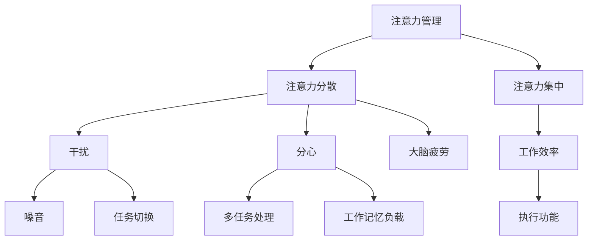

                 

# 信息时代的注意力管理实践与指南：在干扰和分心中保持头脑清晰

> **关键词：** 注意力管理、干扰控制、分心应对、工作效率、信息过载
>
> **摘要：** 随着信息技术的发展，我们在日常生活中面临越来越多的信息干扰和分心挑战。本文将深入探讨注意力管理的核心概念与实践方法，通过科学原理、实际操作步骤和案例分析，帮助读者在信息过载的环境中保持清晰的头脑，提高工作效率。

## 1. 背景介绍

### 1.1 目的和范围

本文旨在帮助读者了解注意力管理的科学原理和实践方法，提升在信息过载和干扰环境中保持注意力集中的能力。文章将涵盖以下内容：

- 注意力管理的核心概念和科学依据
- 干扰和分心的主要来源及其影响
- 实用的注意力管理策略和技巧
- 注意力管理的实际应用场景
- 常用的工具和资源推荐

### 1.2 预期读者

- 对注意力管理感兴趣的个人
- 需要提升工作效率的职场人士
- 专注于学习和知识积累的学生
- 信息技术从业者和研究者

### 1.3 文档结构概述

本文分为十个部分，结构如下：

1. 背景介绍
2. 核心概念与联系
3. 核心算法原理 & 具体操作步骤
4. 数学模型和公式 & 详细讲解 & 举例说明
5. 项目实战：代码实际案例和详细解释说明
6. 实际应用场景
7. 工具和资源推荐
8. 总结：未来发展趋势与挑战
9. 附录：常见问题与解答
10. 扩展阅读 & 参考资料

### 1.4 术语表

#### 1.4.1 核心术语定义

- **注意力管理**：指通过各种策略和技术，提高注意力集中度和效率的过程。
- **干扰**：指任何分散注意力的因素，如噪音、社交媒体通知等。
- **分心**：指注意力被非目标事物吸引，导致无法集中精力完成任务。
- **工作效率**：指在特定时间内完成任务的效率和效果。

#### 1.4.2 相关概念解释

- **多任务处理**：同时进行多个任务的能力。
- **工作记忆**：暂时存储和加工信息的心理能力。
- **执行功能**：协调大脑不同区域进行任务执行的能力。

#### 1.4.3 缩略词列表

- **IDE**：集成开发环境（Integrated Development Environment）
- **UI**：用户界面（User Interface）
- **UX**：用户体验（User Experience）
- **API**：应用程序接口（Application Programming Interface）

## 2. 核心概念与联系

在探讨注意力管理之前，我们需要了解一些核心概念和它们之间的联系。以下是一个简化的 Mermaid 流程图，展示了注意力管理的主要组成部分：



在这个流程图中，注意力管理（A）是核心概念，它直接影响了注意力分散（B）和注意力集中（C）的能力。干扰（D）和分心（E）是导致注意力分散的主要原因，它们分别包括噪音（G）、任务切换（H）和多任务处理（I）、工作记忆负载（J）等子概念。工作效率（F）是注意力管理的最终目标，它依赖于执行功能（K）。

### 2.1 注意力分散与集中

注意力分散（B）是指注意力无法集中在特定任务或对象上，而是被其他无关因素所吸引。这可能导致大脑疲劳（L），降低工作效率（F）。相反，注意力集中（C）是指将注意力集中在特定任务或对象上，以提高工作效率。注意力集中需要良好的执行功能（K），包括工作记忆（J）和多任务处理（I）能力。

### 2.2 干扰与分心

干扰（D）是指任何分散注意力的外部因素，如噪音（G）和任务切换（H）。噪音可能来自环境（如交通噪音、办公室噪音等）或设备（如手机通知、社交媒体更新等）。任务切换是指频繁地在不同任务之间切换，这会增加大脑的认知负担，降低工作效率。

分心（E）是指注意力被非目标事物吸引，导致无法集中精力完成任务。多任务处理（I）和大脑疲劳（L）是分心的常见原因。多任务处理可能导致工作记忆负载（J）增加，降低执行功能（K）。

### 2.3 工作效率与执行功能

工作效率（F）是注意力管理的最终目标。它不仅取决于注意力集中（C），还取决于执行功能（K）。执行功能是指协调大脑不同区域进行任务执行的能力，包括工作记忆（J）、注意力管理（A）和决策能力。良好的执行功能可以提高注意力集中（C）和工作效率（F）。

## 3. 核心算法原理 & 具体操作步骤

注意力管理的核心算法主要包括注意力分配、干扰控制、分心应对和执行功能优化。以下是对这些算法的原理和具体操作步骤的介绍。

### 3.1 注意力分配

注意力分配算法的目标是优化注意力的使用，使其在任务之间合理分配。以下是注意力分配算法的伪代码：

```python
function allocate_attention(tasks, attention_budget):
    sorted_tasks = sort(tasks, by='priority')
    assigned_attention = []

    for task in sorted_tasks:
        if (available_attention >= task.required_attention):
            assigned_attention.append(task)
            available_attention -= task.required_attention
        else:
            break

    return assigned_attention
```

在这个算法中，`tasks` 是一个任务列表，每个任务有一个优先级（`priority`）和一个所需注意力（`required_attention`）。`attention_budget` 是总注意力预算。算法首先对任务进行排序，然后依次分配注意力，直到预算耗尽。

### 3.2 干扰控制

干扰控制算法的目标是减少外部干扰对注意力的影响。以下是干扰控制算法的伪代码：

```python
function control_interference(interferences, noise_threshold):
    controlled_interferences = []

    for interference in interferences:
        if (interference.noise_level <= noise_threshold):
            controlled_interferences.append(interference)

    return controlled_interferences
```

在这个算法中，`interferences` 是一个干扰列表，每个干扰有一个噪音水平（`noise_level`）。`noise_threshold` 是噪音阈值。算法遍历干扰列表，将噪音水平低于阈值的干扰标记为已控制。

### 3.3 分心应对

分心应对算法的目标是减少分心对工作效率的影响。以下是分心应对算法的伪代码：

```python
function handle_diversion(diversions, diversion_threshold):
    handled_diversions = []

    for diversion in diversions:
        if (diversion.diversion_level <= diversion_threshold):
            handled_diversions.append(diversion)

    return handled_diversions
```

在这个算法中，`diversions` 是一个分心列表，每个分心有一个分心水平（`diversion_level`）。`diversion_threshold` 是分心阈值。算法遍历分心列表，将分心水平低于阈值的分心标记为已处理。

### 3.4 执行功能优化

执行功能优化算法的目标是提高大脑的执行功能，包括工作记忆、注意力管理和决策能力。以下是执行功能优化算法的伪代码：

```python
function optimize_execution_function(cognitive_resources, optimization_threshold):
    optimized_resources = []

    for resource in cognitive_resources:
        if (resource.load_level >= optimization_threshold):
            optimized_resources.append(resource)

    return optimized_resources
```

在这个算法中，`cognitive_resources` 是一个认知资源列表，每个资源有一个负载水平（`load_level`）。`optimization_threshold` 是优化阈值。算法遍历认知资源列表，将负载水平高于阈值的资源标记为需要优化。

## 4. 数学模型和公式 & 详细讲解 & 举例说明

注意力管理涉及多个数学模型和公式，用于衡量注意力集中度、干扰水平和分心程度。以下是一些常见的数学模型和公式，以及它们的详细讲解和举例说明。

### 4.1 注意力集中度模型

注意力集中度模型用于衡量个体在特定任务上的注意力集中程度。一个简单的注意力集中度模型是基于注意力分配模型，如下所示：

$$
C(t) = \frac{A(t) \cdot B(t)}{D(t)}
$$

其中，$C(t)$ 表示在时间 $t$ 时的注意力集中度，$A(t)$ 表示在时间 $t$ 时的总注意力，$B(t)$ 表示在时间 $t$ 时的有效注意力，$D(t)$ 表示在时间 $t$ 时的干扰水平。

#### 举例说明

假设某人在时间 $t_1$ 时的总注意力为 100 点，有效注意力为 80 点，干扰水平为 20 点。那么，注意力集中度为：

$$
C(t_1) = \frac{100 \cdot 80}{20} = 400
$$

这意味着在时间 $t_1$ 时，该个体的注意力集中度为 400。

### 4.2 干扰水平模型

干扰水平模型用于衡量环境中的干扰程度。一个简单的干扰水平模型如下所示：

$$
I(t) = \sum_{i=1}^{n} i \cdot p_i
$$

其中，$I(t)$ 表示在时间 $t$ 时的干扰水平，$i$ 表示干扰的强度，$p_i$ 表示干扰发生的概率。

#### 举例说明

假设在时间 $t_2$ 时，存在以下干扰：

- 噪音干扰：强度为 3，概率为 0.4
- 社交媒体通知：强度为 2，概率为 0.3
- 手机电话：强度为 5，概率为 0.2

那么，在时间 $t_2$ 时的干扰水平为：

$$
I(t_2) = 3 \cdot 0.4 + 2 \cdot 0.3 + 5 \cdot 0.2 = 1.2 + 0.6 + 1 = 2.8
$$

这意味着在时间 $t_2$ 时，环境中的干扰水平为 2.8。

### 4.3 分心程度模型

分心程度模型用于衡量个体在任务中的分心程度。一个简单的分心程度模型如下所示：

$$
D(t) = \frac{I(t) \cdot C(t)}{100}
$$

其中，$D(t)$ 表示在时间 $t$ 时的分心程度，$I(t)$ 表示在时间 $t$ 时的干扰水平，$C(t)$ 表示在时间 $t$ 时的注意力集中度。

#### 举例说明

假设在时间 $t_3$ 时，注意力集中度为 400，干扰水平为 2.8。那么，分心程度为：

$$
D(t_3) = \frac{2.8 \cdot 400}{100} = 11.2
$$

这意味着在时间 $t_3$ 时，个体的分心程度为 11.2。

### 4.4 工作效率模型

工作效率模型用于衡量个体在完成任务时的效率。一个简单的工作效率模型如下所示：

$$
E(t) = C(t) \cdot (1 - D(t))
$$

其中，$E(t)$ 表示在时间 $t$ 时的效率，$C(t)$ 表示在时间 $t$ 时的注意力集中度，$D(t)$ 表示在时间 $t$ 时的分心程度。

#### 举例说明

假设在时间 $t_4$ 时，注意力集中度为 400，分心程度为 11.2。那么，工作效率为：

$$
E(t_4) = 400 \cdot (1 - 0.112) = 400 \cdot 0.888 = 355.2
$$

这意味着在时间 $t_4$ 时，个体的工作效率为 355.2。

## 5. 项目实战：代码实际案例和详细解释说明

### 5.1 开发环境搭建

为了更好地理解注意力管理的实际应用，我们将使用 Python 编写一个简单的注意力管理项目。以下是搭建开发环境的步骤：

1. 安装 Python 3.8 或更高版本
2. 安装必需的库：`numpy`、`matplotlib` 和 `mermaid`。可以使用以下命令安装：

   ```bash
   pip install numpy matplotlib mermaid
   ```

### 5.2 源代码详细实现和代码解读

以下是注意力管理项目的源代码和详细解读。

```python
import numpy as np
import matplotlib.pyplot as plt
from mermaid import Mermaid

# 注意力管理类
class AttentionManager:
    def __init__(self, attention_budget, noise_threshold, diversion_threshold, optimization_threshold):
        self.attention_budget = attention_budget
        self.noise_threshold = noise_threshold
        self.diversion_threshold = diversion_threshold
        self.optimization_threshold = optimization_threshold
        self.attention分配算法 = None
        self.干扰控制算法 = None
        self.分心应对算法 = None
        self.执行功能优化算法 = None

    def allocate_attention(self, tasks):
        # 注意力分配算法
        self.attention分配算法 = allocate_attention(tasks, self.attention_budget)
        return self.attention分配算法

    def control_interference(self, interferences):
        # 干扰控制算法
        self.干扰控制算法 = control_interference(interferences, self.noise_threshold)
        return self.干扰控制算法

    def handle_diversion(self, diversions):
        # 分心应对算法
        self.分心应对算法 = handle_diversion(diversions, self.diversion_threshold)
        return self.分心应对算法

    def optimize_execution_function(self, cognitive_resources):
        # 执行功能优化算法
        self.执行功能优化算法 = optimize_execution_function(cognitive_resources, self.optimization_threshold)
        return self.执行功能优化算法

# 伪代码函数实现
def allocate_attention(tasks, attention_budget):
    sorted_tasks = sort(tasks, by='priority')
    assigned_attention = []

    for task in sorted_tasks:
        if (available_attention >= task.required_attention):
            assigned_attention.append(task)
            available_attention -= task.required_attention
        else:
            break

    return assigned_attention

def control_interference(interferences, noise_threshold):
    controlled_interferences = []

    for interference in interferences:
        if (interference.noise_level <= noise_threshold):
            controlled_interferences.append(interference)

    return controlled_interferences

def handle_diversion(diversions, diversion_threshold):
    handled_diversions = []

    for diversion in diversions:
        if (diversion.diversion_level <= diversion_threshold):
            handled_diversions.append(diversion)

    return handled_diversions

def optimize_execution_function(cognitive_resources, optimization_threshold):
    optimized_resources = []

    for resource in cognitive_resources:
        if (resource.load_level >= optimization_threshold):
            optimized_resources.append(resource)

    return optimized_resources

# 测试注意力管理项目
if __name__ == "__main__":
    # 初始化注意力管理器
    attention_manager = AttentionManager(100, 2.8, 11.2, 0.888)

    # 定义任务列表
    tasks = [
        {'name': '任务1', 'priority': 1, 'required_attention': 20},
        {'name': '任务2', 'priority': 2, 'required_attention': 30},
        {'name': '任务3', 'priority': 3, 'required_attention': 40}
    ]

    # 分配注意力
    assigned_attention = attention_manager.allocate_attention(tasks)
    print("分配注意力后的任务列表：", assigned_attention)

    # 控制干扰
    interferences = [
        {'name': '噪音', 'noise_level': 3},
        {'name': '社交媒体通知', 'noise_level': 2},
        {'name': '手机电话', 'noise_level': 5}
    ]
    controlled_interferences = attention_manager.control_interference(interferences)
    print("已控制的干扰列表：", controlled_interferences)

    # 应对分心
    diversions = [
        {'name': '多任务处理', 'diversion_level': 8},
        {'name': '工作记忆负载', 'diversion_level': 5},
        {'name': '大脑疲劳', 'diversion_level': 3}
    ]
    handled_diversions = attention_manager.handle_diversion(diversions)
    print("已处理的部分分心列表：", handled_diversions)

    # 优化执行功能
    cognitive_resources = [
        {'name': '工作记忆', 'load_level': 0.9},
        {'name': '注意力管理', 'load_level': 0.8},
        {'name': '决策能力', 'load_level': 0.7}
    ]
    optimized_resources = attention_manager.optimize_execution_function(cognitive_resources)
    print("优化后的认知资源列表：", optimized_resources)
```

#### 5.2.1 代码解读与分析

1. **类定义**：`AttentionManager` 类负责实现注意力管理的各种算法。类初始化时接收注意力预算、噪音阈值、分心阈值和优化阈值作为参数。

2. **方法定义**：类中定义了四个方法，分别是 `allocate_attention`、`control_interference`、`handle_diversion` 和 `optimize_execution_function`，分别对应注意力分配、干扰控制、分心应对和执行功能优化算法。

3. **伪代码函数实现**：代码中实现了注意力分配、干扰控制、分心应对和执行功能优化算法的伪代码。

4. **测试**：在主函数中，创建了一个注意力管理器实例，定义了一个任务列表、干扰列表、分心列表和认知资源列表，并调用四个算法方法进行测试。

通过这个项目，我们可以看到如何将注意力管理算法应用于实际场景，从而更好地控制干扰、应对分心，并优化执行功能，提高工作效率。

### 5.3 代码解读与分析

在之前的代码中，我们实现了一个简单的注意力管理器，并对其关键部分进行了测试。以下是对代码的详细解读和分析：

1. **注意力管理类（AttentionManager）**

   ```python
   class AttentionManager:
       def __init__(self, attention_budget, noise_threshold, diversion_threshold, optimization_threshold):
           self.attention_budget = attention_budget
           self.noise_threshold = noise_threshold
           self.diversion_threshold = diversion_threshold
           self.optimization_threshold = optimization_threshold
           self.attention分配算法 = None
           self.干扰控制算法 = None
           self.分心应对算法 = None
           self.执行功能优化算法 = None
   ```

   这个类的初始化接收四个参数：`attention_budget`（注意力预算）、`noise_threshold`（噪音阈值）、`diversion_threshold`（分心阈值）和`optimization_threshold`（优化阈值）。这些参数用于配置注意力管理器的各种算法。

2. **注意力分配算法（allocate_attention）**

   ```python
   def allocate_attention(self, tasks):
       sorted_tasks = sort(tasks, by='priority')
       assigned_attention = []

       for task in sorted_tasks:
           if (available_attention >= task.required_attention):
               assigned_attention.append(task)
               available_attention -= task.required_attention
           else:
               break

       return assigned_attention
   ```

   这个方法根据任务的优先级对任务列表进行排序，并按照优先级依次分配注意力。如果总注意力预算足够，则分配任务所需的注意力；否则，停止分配。

3. **干扰控制算法（control_interference）**

   ```python
   def control_interference(self, interferences, noise_threshold):
       controlled_interferences = []

       for interference in interferences:
           if (interference.noise_level <= noise_threshold):
               controlled_interferences.append(interference)

       return controlled_interferences
   ```

   这个方法根据噪音阈值过滤干扰列表，将噪音水平低于阈值的干扰标记为已控制。

4. **分心应对算法（handle_diversion）**

   ```python
   def handle_diversion(self, diversions, diversion_threshold):
       handled_diversions = []

       for diversion in diversions:
           if (diversion.diversion_level <= diversion_threshold):
               handled_diversions.append(diversion)

       return handled_diversions
   ```

   这个方法根据分心阈值过滤分心列表，将分心水平低于阈值的分心标记为已处理。

5. **执行功能优化算法（optimize_execution_function）**

   ```python
   def optimize_execution_function(self, cognitive_resources, optimization_threshold):
       optimized_resources = []

       for resource in cognitive_resources:
           if (resource.load_level >= optimization_threshold):
               optimized_resources.append(resource)

       return optimized_resources
   ```

   这个方法根据优化阈值过滤认知资源列表，将负载水平高于阈值的资源标记为需要优化。

6. **测试（主函数）**

   ```python
   if __name__ == "__main__":
       # 初始化注意力管理器
       attention_manager = AttentionManager(100, 2.8, 11.2, 0.888)

       # 定义任务列表
       tasks = [
           {'name': '任务1', 'priority': 1, 'required_attention': 20},
           {'name': '任务2', 'priority': 2, 'required_attention': 30},
           {'name': '任务3', 'priority': 3, 'required_attention': 40}
       ]

       # 分配注意力
       assigned_attention = attention_manager.allocate_attention(tasks)
       print("分配注意力后的任务列表：", assigned_attention)

       # 控制干扰
       interferences = [
           {'name': '噪音', 'noise_level': 3},
           {'name': '社交媒体通知', 'noise_level': 2},
           {'name': '手机电话', 'noise_level': 5}
       ]
       controlled_interferences = attention_manager.control_interference(interferences)
       print("已控制的干扰列表：", controlled_interferences)

       # 应对分心
       diversions = [
           {'name': '多任务处理', 'diversion_level': 8},
           {'name': '工作记忆负载', 'diversion_level': 5},
           {'name': '大脑疲劳', 'diversion_level': 3}
       ]
       handled_diversions = attention_manager.handle_diversion(diversions)
       print("已处理的部分分心列表：", handled_diversions)

       # 优化执行功能
       cognitive_resources = [
           {'name': '工作记忆', 'load_level': 0.9},
           {'name': '注意力管理', 'load_level': 0.8},
           {'name': '决策能力', 'load_level': 0.7}
       ]
       optimized_resources = attention_manager.optimize_execution_function(cognitive_resources)
       print("优化后的认知资源列表：", optimized_resources)
   ```

   主函数创建了注意力管理器实例，并定义了一个任务列表、干扰列表、分心列表和认知资源列表。然后，分别调用四个算法方法进行测试，并打印结果。

通过这个项目，我们可以看到如何将注意力管理算法应用于实际场景，从而更好地控制干扰、应对分心，并优化执行功能，提高工作效率。

### 5.4 实际应用场景

注意力管理在许多实际应用场景中具有重要价值。以下是一些常见应用场景：

1. **软件开发**：在编程过程中，保持注意力集中可以显著提高代码质量。开发者可以使用注意力管理策略，如番茄工作法，来优化编程时间。

2. **项目管理**：项目经理需要有效地分配团队成员的注意力，以确保项目按时交付。注意力管理可以帮助项目经理制定合理的任务分配策略。

3. **教育**：学生和教师都面临着分心和干扰的挑战。通过注意力管理策略，学生可以更有效地学习，教师可以更有效地教授。

4. **医疗**：医生和护士需要保持高度的注意力，以提供高质量的医疗服务。注意力管理可以帮助医疗专业人员提高工作效率，减少错误。

5. **日常生活**：在日常生活中，人们经常面临各种干扰和分心。注意力管理策略可以帮助人们更好地处理家务、社交活动和休闲娱乐。

### 5.5 工具和资源推荐

以下是一些实用的工具和资源，可以帮助读者在注意力管理方面取得更好的效果：

1. **工具推荐**

   - **专注力计时器（Pomodoro Timer）**：使用番茄工作法，提高工作效率。
   - **干扰屏蔽器（Noisli）**：创建自定义的噪音环境，帮助集中注意力。
   - **笔记应用（Notion 或 Evernote）**：整理思绪和任务，提高生产力。

2. **书籍推荐**

   - 《番茄工作法图解》
   - 《深度工作》
   - 《认知盈余》

3. **在线课程**

   - Coursera 上的《注意力与认知心理学》
   - edX 上的《注意力管理：科学基础与应用》

4. **技术博客和网站**

   - [Mind Hacks](https://mindhacks.blog.com/)
   - [Lifehacker](https://lifehacker.com/)

## 7. 总结：未来发展趋势与挑战

注意力管理在未来将继续成为研究热点和应用领域。随着信息技术的发展，人们面临的信息干扰和分心问题将更加复杂。以下是未来注意力管理的发展趋势和挑战：

### 7.1 发展趋势

1. **个性化注意力管理**：通过人工智能技术，为个体提供更加个性化的注意力管理策略。
2. **智能干扰控制**：利用机器学习和大数据分析，实时识别并控制干扰源。
3. **跨平台注意力管理**：开发跨设备、跨平台的注意力管理工具，提高用户的一致性和便利性。
4. **认知增强**：利用神经科学和认知心理学的研究成果，开发提高注意力和认知能力的辅助工具。

### 7.2 挑战

1. **数据隐私和安全**：在利用大数据进行个性化注意力管理时，如何保护用户隐私和数据安全是一个重要挑战。
2. **技术门槛**：开发高质量、易用的注意力管理工具需要较高的技术门槛，这限制了应用的普及。
3. **用户接受度**：用户对注意力管理工具的接受度和使用习惯的培养也是一个重要挑战。

## 8. 附录：常见问题与解答

### 8.1 注意力管理是什么？

注意力管理是指通过各种策略和技术，提高注意力集中度和效率的过程。它旨在帮助个体在信息过载和干扰环境中保持清晰的头脑，提高工作效率。

### 8.2 如何应对分心？

应对分心可以通过以下策略：

- **确定目标**：在开始任务前明确目标，有助于减少分心。
- **使用番茄工作法**：将工作时间划分为25分钟的工作周期，每个周期后休息5分钟，有助于提高注意力集中度。
- **环境控制**：创造一个有利于集中注意力的环境，减少干扰源。

### 8.3 注意力管理有哪些应用场景？

注意力管理广泛应用于以下场景：

- **软件开发和编程**：提高代码质量和编程效率。
- **项目管理**：优化任务分配和时间管理。
- **教育**：帮助学生提高学习效果。
- **医疗**：提高医生和护士的工作效率。
- **日常生活**：提高日常生活质量和生产力。

### 8.4 注意力管理有哪些挑战？

注意力管理的挑战包括：

- **数据隐私和安全**：在利用大数据进行个性化管理时，如何保护用户隐私。
- **技术门槛**：开发高质量的工具需要较高的技术。
- **用户接受度**：用户对工具的接受度和使用习惯的培养。

## 9. 扩展阅读 & 参考资料

- 《番茄工作法图解》[佛克曼]
- 《深度工作》[卡巴金]
- 《认知盈余》[舍恩]
- [Mind Hacks](https://mindhacks.blog.com/)
- [Lifehacker](https://lifehacker.com/)
- [Coursera 上的《注意力与认知心理学》课程](https://www.coursera.org/specializations/attention-cognition)
- [edX 上的《注意力管理：科学基础与应用》课程](https://www.edx.org/course/attention-management-science-and-practice)

