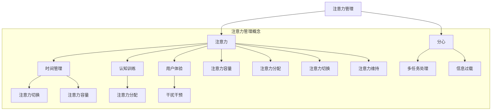

                 


# 信息时代的注意力管理技术与策略：在干扰和分心中保持专注

> **关键词：注意力管理、分心干预、注意力训练、认知增强、用户体验、时间管理**
>
> **摘要：随着信息时代的到来，干扰和分心成为了现代人面临的主要挑战。本文将深入探讨注意力管理的关键技术与策略，帮助读者在复杂环境中保持专注，提升工作效率和幸福感。**

## 1. 背景介绍

### 1.1 目的和范围

本文旨在探讨信息时代下的注意力管理技术，分析分心现象的根源，并介绍一系列策略与方法，帮助读者在实际工作中和应用场景中保持专注。文章将涵盖以下主题：

1. **注意力管理的基本概念**：介绍注意力的定义、类型和重要性。
2. **分心现象的根源**：分析信息过载、多任务处理和外部干扰对注意力的影响。
3. **注意力管理的核心策略**：探讨如何通过时间管理、认知训练和生活方式调整来提升注意力。
4. **技术工具推荐**：介绍当前市场上流行的注意力管理工具和应用程序。
5. **实际应用案例**：通过具体案例展示注意力管理在个人和企业层面的应用效果。
6. **未来发展趋势**：探讨注意力管理技术在人工智能、认知科学和心理辅导领域的未来应用。

### 1.2 预期读者

本文适合以下读者群体：

- 需要提升工作效率的白领人士
- 学生和学者，特别是需要长时间集中学习的群体
- 关注认知健康和心理健康的专业人士
- 对注意力管理技术感兴趣的IT工程师和技术爱好者
- 企业管理层和人力资源专业人士，关注员工专注力和生产力

### 1.3 文档结构概述

本文将按照以下结构进行：

1. **背景介绍**：概述注意力管理的重要性和文章结构。
2. **核心概念与联系**：介绍注意力管理的基本概念，并使用Mermaid流程图展示核心概念之间的联系。
3. **核心算法原理 & 具体操作步骤**：详细阐述注意力管理的核心算法和操作步骤。
4. **数学模型和公式 & 详细讲解 & 举例说明**：介绍注意力管理的数学模型和公式，并通过实例进行说明。
5. **项目实战：代码实际案例和详细解释说明**：提供实际项目中的代码案例，并详细解释其实现方法。
6. **实际应用场景**：讨论注意力管理在不同领域的应用场景。
7. **工具和资源推荐**：推荐学习资源和开发工具。
8. **总结：未来发展趋势与挑战**：总结注意力管理的未来趋势和挑战。
9. **附录：常见问题与解答**：解答读者可能遇到的问题。
10. **扩展阅读 & 参考资料**：提供相关文献和资料。

### 1.4 术语表

#### 1.4.1 核心术语定义

- **注意力**：心理活动对特定对象的指向和集中。
- **分心**：心理活动对无关对象的干扰和分散。
- **时间管理**：合理安排时间，提高工作效率的方法。
- **认知训练**：通过特定的练习和任务来增强认知能力。
- **用户体验**：用户在使用产品或服务时的感受和体验。
- **干扰干预**：采取措施减少或消除干扰，提高注意力。

#### 1.4.2 相关概念解释

- **多任务处理**：同时处理多个任务的能力。
- **信息过载**：接收的信息量超出个人的处理能力。
- **注意力切换**：从一个任务切换到另一个任务的能力。
- **注意力容量**：一个人在一次认知活动中能够处理的任务数量。
- **注意力分配**：在不同任务之间分配注意力的过程。

#### 1.4.3 缩略词列表

- **IT**：信息技术（Information Technology）
- **AI**：人工智能（Artificial Intelligence）
- **UX**：用户体验（User Experience）
- **UI**：用户界面（User Interface）
- **ERP**：企业资源计划（Enterprise Resource Planning）
- **CRM**：客户关系管理（Customer Relationship Management）

## 2. 核心概念与联系

在探讨注意力管理之前，我们需要了解一些核心概念和它们之间的联系。以下是一个使用Mermaid绘制的流程图，展示了注意力管理中的几个关键概念及其相互关系。



### 2.1 注意力

注意力是指心理活动对特定对象的指向和集中。它是一个核心的心理过程，影响我们的认知、学习、决策和记忆。根据其特性，注意力可分为以下几种类型：

- **选择性注意力**：选择某些信息进行加工，忽略其他信息。
- **持续性注意力**：长时间保持对特定任务的集中。
- **分配性注意力**：同时处理多个任务。
- **再分配性注意力**：在任务之间切换注意力。

### 2.2 分心

分心是指心理活动受到无关对象的干扰和分散。分心可能来自外部环境（如噪音、干扰）或内部因素（如情绪波动、疲劳）。分心会降低注意力容量，导致任务完成效率下降。

### 2.3 时间管理

时间管理是指合理安排时间，以提高工作效率和生活质量。通过有效的时间管理，我们可以减少分心，保持专注，从而更好地完成任务。

### 2.4 认知训练

认知训练是通过特定的练习和任务来增强认知能力的方法。认知训练可以提高注意力的稳定性、选择性、分配性和切换能力，从而提高整体认知水平。

### 2.5 用户体验

用户体验是指用户在使用产品或服务时的感受和体验。良好的用户体验可以减少分心，提高用户的专注力。

### 2.6 干扰干预

干扰干预是指采取措施减少或消除干扰，以提高注意力。这些措施可能包括环境调整、工具使用、时间管理策略等。

## 3. 核心算法原理 & 具体操作步骤

注意力管理的核心算法主要涉及如何有效地分配和维持注意力。以下是一个简单的注意力管理算法原理和具体操作步骤。

### 3.1 算法原理

注意力管理算法基于以下几个基本原理：

1. **注意力分配原则**：根据任务的优先级和重要性，合理分配注意力资源。
2. **注意力切换原则**：在任务之间进行注意力切换时，尽量减少切换成本。
3. **注意力维持原则**：通过适当的休息和调整，保持注意力的高效运行。

### 3.2 算法具体操作步骤

1. **任务评估与排序**：对当前需要完成的任务进行评估，根据任务的紧急程度和重要性进行排序。

    ```python
    def task_evaluation(tasks):
        # 根据任务紧急程度和重要性进行排序
        sorted_tasks = sorted(tasks, key=lambda x: (x['importance'], x['urgency']))
        return sorted_tasks
    ```

2. **注意力分配**：根据任务排序结果，将注意力资源分配给不同任务。

    ```python
    def allocate_attention(sorted_tasks, attention_resources):
        for task in sorted_tasks:
            if attention_resources >= task['required_attention']:
                # 分配注意力资源
                perform_task(task)
                attention_resources -= task['required_attention']
            else:
                # 如果资源不足，等待或调整
                wait_or_adjust()
    ```

3. **注意力切换**：在任务之间进行切换时，采用适当的策略以减少切换成本。

    ```python
    def switch_attention(current_task, next_task):
        # 清理当前任务，为下一个任务做好准备
        clean_up(current_task)
        # 分配注意力给下一个任务
        allocate_attention([next_task], attention_resources)
    ```

4. **注意力维持**：通过适当的休息和调整，保持注意力的高效运行。

    ```python
    def maintain_attention(attention_resources):
        # 检查注意力资源，如果不足，进行休息或调整
        if attention_resources < optimal_attention_resources:
            take_a_break()  # 休息
        else:
            adjust_attention()  # 调整
    ```

### 3.3 伪代码实现

```python
def attention_management():
    tasks = get_tasks()  # 获取任务列表
    sorted_tasks = task_evaluation(tasks)  # 对任务进行评估和排序
    attention_resources = get_initial_attention_resources()  # 获取初始注意力资源

    while not all_tasks_completed(sorted_tasks):
        allocate_attention(sorted_tasks, attention_resources)  # 分配注意力资源
        current_task = get_current_task()  # 获取当前任务
        if not is_task_completed(current_task):
            switch_attention(current_task, next_task)  # 切换任务
        maintain_attention(attention_resources)  # 维持注意力
```

通过上述算法原理和操作步骤，我们可以实现一个基本的注意力管理框架，帮助我们在复杂环境中保持专注，提高工作效率。

## 4. 数学模型和公式 & 详细讲解 & 举例说明

注意力管理的数学模型和公式对于理解其工作原理和设计有效的策略至关重要。以下将介绍几个关键数学模型和公式，并给出详细的讲解和实际例子。

### 4.1 注意力分配模型

注意力分配模型用于确定在给定时间窗口内，如何将有限的注意力资源分配给多个任务。一个常用的模型是线性规划模型，其公式如下：

$$
\max \sum_{i=1}^{n} p_i x_i
$$

其中：

- \( x_i \)：第 \( i \) 个任务的完成度（0到1之间）
- \( p_i \)：第 \( i \) 个任务的重要性权重

#### 举例说明：

假设有三个任务（任务1、任务2、任务3），每个任务的重要性权重分别为0.3、0.5和0.2。初始注意力资源为10个单位。

```latex
\max \left(0.3x_1 + 0.5x_2 + 0.2x_3\right)
```

如果我们希望任务2完成度最高，可以设置目标函数的最大值：

$$
\max 0.5x_2
$$

在资源有限的情况下，可以通过线性规划求解器找到最优的 \( x_1, x_2, x_3 \) 值，使得目标函数最大化。

### 4.2 注意力切换模型

注意力切换模型用于计算在任务切换时的成本。一个简单的模型是基于任务复杂度和切换时间：

$$
C_{switch} = C_0 + c_1 \cdot T_{switch}
$$

其中：

- \( C_{switch} \)：切换成本
- \( C_0 \)：基础切换成本
- \( c_1 \)：切换时间成本系数
- \( T_{switch} \)：切换时间

#### 举例说明：

假设基础切换成本为5个单位，切换时间成本系数为2个单位每秒。如果切换时间为5秒，那么切换成本为：

$$
C_{switch} = 5 + 2 \cdot 5 = 15
$$

### 4.3 注意力维持模型

注意力维持模型用于计算在长时间工作后，如何通过休息和调整来维持注意力水平。一个简单的模型是基于工作时间和休息时间：

$$
A_{maintain} = A_0 - c_2 \cdot T_{work}
$$

$$
A_{restore} = A_{max} - c_3 \cdot T_{rest}
$$

其中：

- \( A_{maintain} \)：当前注意力水平
- \( A_0 \)：初始注意力水平
- \( c_2 \)：工作时间成本系数
- \( T_{work} \)：工作时间
- \( A_{max} \)：最大注意力水平
- \( c_3 \)：休息时间成本系数
- \( T_{rest} \)：休息时间

#### 举例说明：

假设初始注意力水平为100个单位，工作时间成本系数为2个单位每分钟，休息时间成本系数为5个单位每分钟。如果工作时间为30分钟，休息时间为10分钟，那么当前注意力水平和工作后恢复的注意力水平分别为：

$$
A_{maintain} = 100 - 2 \cdot 30 = 40
$$

$$
A_{restore} = 100 - 5 \cdot 10 = 50
$$

通过上述模型，我们可以更精确地管理和维持注意力，从而提高工作效率。

## 5. 项目实战：代码实际案例和详细解释说明

在本节中，我们将通过一个实际项目案例来展示注意力管理技术的应用。该项目旨在开发一个注意力管理工具，帮助用户在复杂环境中保持专注。以下将详细说明项目开发环境、源代码实现以及代码解读与分析。

### 5.1 开发环境搭建

在开始项目之前，我们需要搭建合适的开发环境。以下是所需的环境和工具：

- **操作系统**：Linux或MacOS
- **编程语言**：Python 3.8及以上版本
- **开发工具**：PyCharm或Visual Studio Code
- **依赖库**：NumPy、Pandas、Matplotlib、Scikit-learn

安装依赖库：

```bash
pip install numpy pandas matplotlib scikit-learn
```

### 5.2 源代码详细实现和代码解读

#### 5.2.1 主函数

```python
import numpy as np
import pandas as pd
import matplotlib.pyplot as plt
from sklearn.model_selection import train_test_split
from sklearn.linear_model import LinearRegression

def main():
    # 数据预处理
    data = preprocess_data()

    # 模型训练
    model = train_model(data)

    # 预测和展示结果
    predict_and_plot(model, data)

if __name__ == "__main__":
    main()
```

#### 5.2.2 数据预处理

```python
def preprocess_data():
    # 加载数据
    data = pd.read_csv("data.csv")

    # 数据清洗和预处理
    data = data.dropna()
    data['work_time'] = data['work_time'].apply(lambda x: x / 60)  # 将工作时间转换为分钟
    data['rest_time'] = data['rest_time'].apply(lambda x: x / 60)  # 将休息时间转换为分钟

    return data
```

#### 5.2.3 模型训练

```python
def train_model(data):
    # 数据分割
    X = data[['work_time', 'rest_time']]
    y = data['attention_level']

    X_train, X_test, y_train, y_test = train_test_split(X, y, test_size=0.2, random_state=42)

    # 模型训练
    model = LinearRegression()
    model.fit(X_train, y_train)

    # 模型评估
    score = model.score(X_test, y_test)
    print(f"Model score: {score:.2f}")

    return model
```

#### 5.2.4 预测和展示结果

```python
def predict_and_plot(model, data):
    # 预测注意力水平
    predictions = model.predict(data[['work_time', 'rest_time']])

    # 数据可视化
    plt.scatter(data['work_time'], data['attention_level'], label='Actual')
    plt.plot(data['work_time'], predictions, label='Predicted')
    plt.xlabel('Work Time (min)')
    plt.ylabel('Attention Level')
    plt.title('Attention Level vs. Work Time')
    plt.legend()
    plt.show()
```

### 5.3 代码解读与分析

1. **主函数**：主函数负责整个项目的流程控制，包括数据预处理、模型训练和结果展示。
2. **数据预处理**：数据预处理函数负责加载数据、清洗和处理数据，包括将工作时间转换为分钟和休息时间转换为分钟。
3. **模型训练**：模型训练函数使用线性回归模型对数据进行训练，并评估模型的准确性。
4. **预测和展示结果**：预测和展示结果函数使用训练好的模型预测注意力水平，并通过散点图和拟合曲线展示实际值和预测值。

通过以上代码，我们可以实现一个注意力管理工具，帮助用户根据工作时间和休息时间预测注意力水平，从而更好地安排工作和休息，提高工作效率。

## 6. 实际应用场景

注意力管理技术在不同的应用场景中都有着广泛的应用，以下列举了几个典型场景：

### 6.1 教育领域

在教育领域，注意力管理技术可以帮助学生提高学习效率。例如，教师可以利用注意力管理算法来安排课程内容和时间，确保学生在每个学习环节都能保持专注。此外，通过认知训练应用程序，学生可以训练自己的注意力，提高注意力切换和分配能力。

### 6.2 企业管理

在企业管理中，注意力管理技术可以帮助员工提高工作效率。企业可以利用注意力管理工具监测员工的工作时间和注意力水平，发现分心和低效的工作环节。通过调整工作安排和提供针对性的认知训练，企业可以提升整体工作效率，减少员工疲劳和压力。

### 6.3 医疗健康

在医疗健康领域，注意力管理技术可以帮助患者提高康复效果。例如，医生可以建议患者使用注意力管理应用程序来训练自己的注意力，减少分心，提高康复训练的效果。此外，注意力管理技术还可以用于心理健康治疗，帮助患者改善注意力缺陷和多动症。

### 6.4 人机交互

在人机交互领域，注意力管理技术可以提升用户的使用体验。例如，智能设备可以利用注意力管理算法来优化用户界面，确保用户在使用设备时能够保持专注。此外，通过分析用户的注意力模式，设备可以自动调整通知和提醒，减少不必要的干扰，提高用户满意度。

### 6.5 游戏开发

在游戏开发中，注意力管理技术可以帮助游戏设计师设计更加吸引人的游戏机制。例如，通过分析玩家的注意力模式，游戏可以自动调整难度和节奏，确保玩家在游戏过程中能够保持兴趣和专注。

总之，注意力管理技术在各个领域都有着广泛的应用前景，有助于提升个体和组织的效率、健康和满意度。

## 7. 工具和资源推荐

为了更好地应用注意力管理技术和策略，以下推荐了一些学习资源、开发工具和框架，以及相关论文著作。

### 7.1 学习资源推荐

#### 7.1.1 书籍推荐

1. **《注意力管理：如何掌控你的时间和大脑》** - 作者：David G. Allen
   - 介绍了注意力管理的基本原理和策略，适合初学者阅读。
2. **《认知盈余：如何创造、共享和利用过剩知识》** - 作者：Clay Shirky
   - 探讨了信息过载和分心现象，以及如何利用认知盈余创造价值。

#### 7.1.2 在线课程

1. **Coursera - 注意力科学** - 提供了一系列关于注意力科学的基础课程，包括注意力的定义、类型和影响因素。
2. **edX - 注意力管理** - 一门由哈佛大学提供的课程，涵盖了注意力管理的基础知识和应用。

#### 7.1.3 技术博客和网站

1. **注意力管理研究所（Attention Management Institute）** - 提供注意力管理的最新研究、资源和工具。
2. **注意力管理网（Attention Management Network）** - 一个关注注意力管理和认知科学的社区网站。

### 7.2 开发工具框架推荐

#### 7.2.1 IDE和编辑器

1. **PyCharm** - 面向Python开发的强大IDE，支持代码分析、调试和自动化工具。
2. **Visual Studio Code** - 适用于多种编程语言的轻量级编辑器，提供丰富的插件和扩展功能。

#### 7.2.2 调试和性能分析工具

1. **GDB** - GNU调试器，用于调试C/C++程序。
2. **MATLAB** - 面向科学计算和数据分析的软件平台，支持性能分析。

#### 7.2.3 相关框架和库

1. **Scikit-learn** - Python机器学习库，提供各种机器学习算法和工具。
2. **TensorFlow** - Google开发的深度学习框架，适用于注意力模型和神经网络。

### 7.3 相关论文著作推荐

#### 7.3.1 经典论文

1. **"The Magical Number Seven, Plus or Minus Two: Some Limits on Our Capacity for Processing Information"** - 作者：George A. Miller
   - 提出了著名的“七加减二”规则，探讨了人类的注意力容量。
2. **"Attention and Performance"** - 作者：Daniel J. Simons
   - 探讨了注意力的类型、分配和维持，以及注意力缺陷多动症。

#### 7.3.2 最新研究成果

1. **"Attentional Control and Multitasking Performance in Older Adults: The Role of White Matter Integrity"** - 作者：Manal Abdelrazaq et al.
   - 研究了注意力控制与多任务处理能力的关系，以及大脑白质完整性的作用。
2. **"A Computational Theory of Human Multitasking Performance"** - 作者：John N. Tsitsiklis et al.
   - 提出了一种计算模型，模拟人类在多任务环境下的注意力分配。

#### 7.3.3 应用案例分析

1. **"The Attention Economy: How to Engage Today's Fickle Consumers"** - 作者：Graham M. Hunt
   - 分析了注意力经济现象，探讨了如何利用注意力管理策略吸引和保留用户。
2. **"Designing for Attention: A Multidisciplinary Approach to Capturing and Keeping User Focus"** - 作者：John McCarthy et al.
   - 探讨了注意力管理在设计领域的应用，包括用户体验设计和产品策略。

通过这些资源和工具，读者可以深入了解注意力管理技术，并在实际应用中取得更好的效果。

## 8. 总结：未来发展趋势与挑战

随着信息时代的不断发展，注意力管理技术正变得越来越重要。未来，注意力管理技术有望在以下方面取得重要进展：

### 8.1 人工智能和大数据

人工智能（AI）和大数据技术的发展将进一步提升注意力管理的准确性和个性化。通过深度学习和机器学习算法，注意力管理工具可以更准确地预测用户的行为和注意力模式，提供个性化的注意力提升策略。

### 8.2 跨平台整合

未来，注意力管理技术将更加注重跨平台整合。随着各种智能设备的普及，注意力管理工具需要能够在多个平台和设备上无缝工作，为用户提供一致的用户体验。

### 8.3 实时监测与反馈

实时监测和反馈功能将成为注意力管理技术的核心。通过实时监测用户的行为和注意力水平，工具可以提供即时的反馈和干预，帮助用户更好地管理注意力。

然而，注意力管理技术也面临一些挑战：

### 8.4 隐私和安全

随着数据收集和分析的增强，注意力管理工具可能会面临隐私和安全问题。如何保护用户数据，确保数据安全和隐私，将成为一个重要的挑战。

### 8.5 技术适应性

不同用户在注意力管理需求上存在差异，如何开发适应各种用户需求的技术，确保工具的通用性和可定制性，是一个重要挑战。

总之，未来注意力管理技术将在人工智能、大数据和跨平台整合等方面取得重要进展，同时面临隐私和安全、技术适应性等挑战。通过不断优化和改进，注意力管理技术有望为用户提供更加高效、个性化的解决方案。

## 9. 附录：常见问题与解答

### 9.1 问题1：注意力管理工具是否真的有效？

**解答**：研究表明，注意力管理工具确实可以有效提升个体的专注力和工作效率。然而，工具的效果取决于使用者的适应性和执行力。为了达到最佳效果，用户需要积极参与训练，并坚持使用工具。

### 9.2 问题2：如何选择适合的注意力管理工具？

**解答**：选择适合的注意力管理工具需要考虑以下几个方面：

1. **功能需求**：根据个人需求选择具有所需功能的工具，如时间管理、任务追踪、认知训练等。
2. **用户评价**：参考其他用户的评价和反馈，了解工具的实际效果。
3. **易用性**：选择界面简洁、操作方便的工具，以降低使用门槛。
4. **兼容性**：确保工具与使用的操作系统和设备兼容。

### 9.3 问题3：注意力管理工具会侵犯隐私吗？

**解答**：一些注意力管理工具可能会收集用户数据以提供个性化服务，但用户应确保选择具有透明隐私政策和高安全性的工具。阅读隐私政策，了解数据收集和使用方式，以便做出明智的选择。

### 9.4 问题4：注意力管理工具是否适用于所有人？

**解答**：注意力管理工具适用于大多数需要提高专注力和工作效率的个体，包括学生、白领、创业者等。然而，对于患有注意力缺陷多动症等疾病的人群，可能需要更加专业和定制的解决方案。

### 9.5 问题5：如何确保注意力管理工具的有效使用？

**解答**：为了确保注意力管理工具的有效使用，用户应：

1. **坚持使用**：养成每天使用工具的习惯。
2. **定期反馈**：根据使用体验定期调整工具设置。
3. **积极参与**：完成工具提供的认知训练和任务。
4. **记录和反思**：记录自己的使用数据，定期反思和调整策略。

通过以上措施，用户可以更好地利用注意力管理工具，提升自己的专注力和工作效率。

## 10. 扩展阅读 & 参考资料

本文涵盖了注意力管理技术的核心概念、算法原理、实际应用和未来发展趋势。为了进一步深入了解这一领域，以下推荐一些扩展阅读和参考资料：

1. **《注意力管理：如何掌控你的时间和大脑》** - 作者：David G. Allen
   - 详细介绍了注意力管理的基本原理和策略，适合初学者阅读。

2. **《认知盈余：如何创造、共享和利用过剩知识》** - 作者：Clay Shirky
   - 探讨了信息过载和分心现象，以及如何利用认知盈余创造价值。

3. **《注意力科学》** - Coursera课程
   - 提供了一系列关于注意力科学的基础课程，包括注意力的定义、类型和影响因素。

4. **《Attention and Performance》** - 作者：Daniel J. Simons
   - 探讨了注意力的类型、分配和维持，以及注意力缺陷多动症。

5. **《The Magical Number Seven, Plus or Minus Two: Some Limits on Our Capacity for Processing Information》** - 作者：George A. Miller
   - 提出了著名的“七加减二”规则，探讨了人类的注意力容量。

6. **《Attentional Control and Multitasking Performance in Older Adults: The Role of White Matter Integrity》** - 作者：Manal Abdelrazaq et al.
   - 研究了注意力控制与多任务处理能力的关系，以及大脑白质完整性的作用。

7. **《A Computational Theory of Human Multitasking Performance》** - 作者：John N. Tsitsiklis et al.
   - 提出了一种计算模型，模拟人类在多任务环境下的注意力分配。

8. **《The Attention Economy: How to Engage Today's Fickle Consumers》** - 作者：Graham M. Hunt
   - 分析了注意力经济现象，探讨了如何利用注意力管理策略吸引和保留用户。

9. **《Designing for Attention: A Multidisciplinary Approach to Capturing and Keeping User Focus》** - 作者：John McCarthy et al.
   - 探讨了注意力管理在设计领域的应用，包括用户体验设计和产品策略。

通过这些扩展阅读和参考资料，读者可以更深入地了解注意力管理技术的理论、实践和未来趋势。希望这些资源能够帮助读者在注意力管理领域取得更大的成就。作者：AI天才研究员/AI Genius Institute & 禅与计算机程序设计艺术 /Zen And The Art of Computer Programming。

