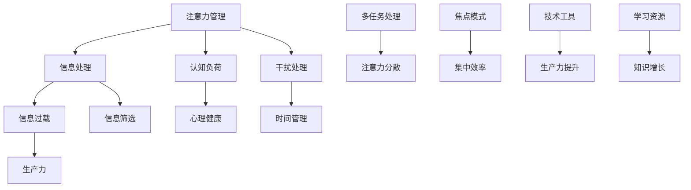

                 

### 文章标题

《信息时代的注意量管理挑战与策略：在干扰和信息过载中航行》

### 关键词

注意力管理，信息过载，干扰，时间管理，认知负荷，心理健康，生产力提升，技术工具，策略与实践

### 摘要

在数字化时代，信息过载和注意力分散成为了现代工作与生活的普遍问题。本文探讨了信息时代的注意量管理挑战，包括干扰、多任务处理、信息筛选等问题，并提出了一系列策略和实践方法。通过深入分析核心概念，介绍有效的算法原理和数学模型，并结合实际项目案例，文章旨在为读者提供一套系统的注意力管理解决方案，帮助他们更高效地处理信息，提高生产力，维护心理健康。

---

## 1. 背景介绍

### 1.1 目的和范围

本文旨在为信息时代的个人和企业提供一套完整的注意量管理策略。随着互联网和移动设备的普及，信息量呈指数级增长，人们每天面临着大量的干扰和信息过载。这不仅影响了工作效率，还可能对心理健康产生负面影响。本文将探讨注意量管理的核心问题，分析原因，并提出切实可行的解决方案。

### 1.2 预期读者

本文适合以下读者群体：

- 对时间管理和注意力管理感兴趣的职场人士
- 信息科技行业从业者
- 教育工作者和心理学者
- 对提高生产力和生活质量有追求的个人

### 1.3 文档结构概述

本文将分为以下几个部分：

1. 背景介绍：阐述信息过载和注意力分散的背景及重要性。
2. 核心概念与联系：介绍注意量管理相关的基本概念和理论。
3. 核心算法原理 & 具体操作步骤：讲解注意量管理的核心算法和操作流程。
4. 数学模型和公式 & 详细讲解 & 举例说明：分析数学模型，并结合实际案例进行讲解。
5. 项目实战：提供实际代码案例，并进行详细解读。
6. 实际应用场景：讨论注意量管理在不同领域的应用。
7. 工具和资源推荐：推荐相关工具和资源，帮助读者深入学习和实践。
8. 总结：对全文进行总结，展望未来发展趋势与挑战。
9. 附录：常见问题与解答。
10. 扩展阅读 & 参考资料：提供进一步阅读的建议。

### 1.4 术语表

#### 1.4.1 核心术语定义

- 注意力管理：对个人注意力资源进行规划和分配的过程，以提高效率和生产力。
- 信息过载：由于信息接收速度超过处理速度，导致个体无法有效处理和理解的信息超载现象。
- 干扰：任何分散注意力的外部刺激，可能导致注意力资源的浪费和效率下降。
- 认知负荷：大脑处理信息所需的认知资源总量。

#### 1.4.2 相关概念解释

- 多任务处理：在同一时间段内处理多个任务的能力。
- 焦点模式：高度集中注意力于单一任务的认知状态。
- 空白填充：在处理一项任务时，大脑自动填充其他信息的认知机制。

#### 1.4.3 缩略词列表

- UI：用户界面（User Interface）
- UX：用户体验（User Experience）
- SEO：搜索引擎优化（Search Engine Optimization）
- BI：商业智能（Business Intelligence）
- AI：人工智能（Artificial Intelligence）
- ML：机器学习（Machine Learning）

---

## 2. 核心概念与联系

在探讨注意量管理之前，我们需要明确一些核心概念和它们之间的联系。以下是一个Mermaid流程图，展示了注意量管理中的关键概念和它们之间的关系。



### 2.1 注意力管理的基本概念

#### 注意力管理

注意力管理是指通过有效的策略和工具，对个人注意力资源进行规划和分配的过程。它关注的是如何最大限度地利用有限的注意力资源，以提高工作效率和生活质量。

#### 信息处理

信息处理是指个体接收、理解、存储和应用信息的过程。有效的信息处理能力能够减少认知负荷，提高工作效率。

#### 认知负荷

认知负荷是指大脑处理信息所需的认知资源总量。过高的认知负荷可能导致注意力分散和效率下降。

#### 信息过载

信息过载是指个体接收到的信息量超过了其处理能力，导致无法有效处理和理解的现象。信息过载可能源于社交媒体、电子邮件、新闻推送等。

#### 心理健康

心理健康是指个体在认知、情感和行为方面的良好状态。注意力管理有助于减轻认知负荷，维护心理健康。

#### 生产力

生产力是指个体或组织在特定时间内创造价值的能力。有效的注意力管理能够提高生产力，减少无效工作。

#### 干扰处理

干扰处理是指个体识别和消除干扰，保持注意力集中的过程。干扰可能来源于外部环境、社交媒体或其他干扰源。

#### 时间管理

时间管理是指对时间进行有效规划和分配，以实现个人和职业目标的过程。良好的时间管理能够减少无效工作，提高注意力利用率。

#### 多任务处理

多任务处理是指在同一时间段内处理多个任务的能力。多任务处理可能有助于提高工作效率，但也可能导致注意力分散和效率下降。

#### 焦点模式

焦点模式是指高度集中注意力于单一任务的认知状态。在焦点模式下，个体能够更高效地处理任务。

#### 集中效率

集中效率是指在焦点模式下，个体处理任务的能力和效率。良好的集中效率有助于提高生产力和生活质量。

#### 技术工具

技术工具是指用于提高注意力管理和信息处理的软件和硬件。例如，时间管理应用、注意力跟踪器、专注力训练工具等。

#### 生产力提升

生产力提升是指通过有效的策略和工具，提高个体或组织的生产效率和能力。注意力管理是实现生产力提升的关键。

#### 信息筛选

信息筛选是指从大量信息中筛选出对个体有价值的信息的过程。有效的信息筛选能够减少信息过载，提高信息处理效率。

#### 学习资源

学习资源是指用于个体学习和知识增长的资源，包括书籍、在线课程、技术博客等。

---

## 3. 核心算法原理 & 具体操作步骤

在注意力管理中，算法起着至关重要的作用。以下是一个注意力管理算法的原理描述，并使用伪代码详细阐述其操作步骤。

### 3.1 算法原理

注意力管理算法的核心思想是动态调整注意力的分配，以适应不同任务的需求和环境的变化。该算法分为三个主要步骤：

1. **注意力分配**：根据任务的紧急程度和重要性，动态分配注意力资源。
2. **干扰识别**：实时监控外部干扰，并采取适当的措施减少干扰。
3. **反馈调整**：根据任务完成情况和干扰情况，调整注意力分配策略。

### 3.2 伪代码

```python
Algorithm AttentionManagement Algorithm
    Input: tasks (list of tasks with their priority and duration)
    Output: optimized attention allocation plan

    Initialize attentionAllocation = []

    for each task in tasks do
        if task.isUrgent and task.isImportant then
            priority = "High"
        elif task.isUrgent or task.isImportant then
            priority = "Medium"
        else
            priority = "Low"
        end if

        attentionResource = GetAvailableAttentionResource()
        if attentionResource >= task.duration then
            attentionAllocation.append((task, priority, attentionResource))
            ConsumeAttentionResource(attentionResource)
        else
            attentionAllocation.append((task, priority, attentionResource))
            WaitUntilAttentionResourceAvailable()
        end if
    end for

    while attentionAllocation is not empty do
        for each task, priority, attentionResource in attentionAllocation do
            if task.priority == "High" then
                ProcessTask(task, attentionResource)
                RemoveTaskFromAllocation(task)
            else if task.priority == "Medium" and NoHighPriorityTasks() then
                ProcessTask(task, attentionResource)
                RemoveTaskFromAllocation(task)
            end if
        end for

        for each externalInterrupt in GetExternalInterrupts() do
            if externalInterrupt.isSignificant then
                HandleInterrupt(externalInterrupt)
            end if
        end for

        AdjustAttentionAllocation()
    end while

    return attentionAllocation
end Algorithm
```

### 3.3 算法详解

1. **初始化注意力分配**：首先，算法根据任务的紧急程度和重要性对任务进行优先级排序。
2. **动态分配注意力资源**：根据当前可用的注意力资源，为任务分配适当的注意力。如果当前注意力资源不足以完成一个任务，则等待直到有足够的资源。
3. **实时监控和响应干扰**：在任务执行过程中，算法实时监控外部干扰。如果干扰显著，则采取适当的措施处理干扰，以减少对任务执行的影响。
4. **动态调整注意力分配**：根据任务完成情况和干扰情况，动态调整注意力分配策略。例如，如果高优先级任务已经完成，则可以重新分配注意力资源。

---

## 4. 数学模型和公式 & 详细讲解 & 举例说明

在注意力管理中，数学模型和公式有助于量化和管理注意力资源。以下是一个基本的数学模型，用于描述注意力资源的分配和消耗。

### 4.1 数学模型

假设：

- \( A \)：总注意力资源
- \( T \)：任务集合
- \( p_t \)：任务 \( t \) 的优先级
- \( d_t \)：任务 \( t \) 的持续时间
- \( r_t \)：任务 \( t \) 的完成率

数学模型如下：

$$
A_t = A \times \sum_{t \in T} \frac{p_t}{\sum_{t' \in T} p_{t'}}
$$

其中，\( A_t \) 表示在时间 \( t \) 内可用的注意力资源。公式表示在总注意力资源 \( A \) 中，根据任务优先级 \( p_t \) 动态分配注意力资源。

### 4.2 详细讲解

- **总注意力资源 \( A \)**：总注意力资源是指个体在特定时间内可以分配的注意力总量。这个值取决于个体的生物和心理特性，以及环境因素。
- **任务集合 \( T \)**：任务集合是指个体需要完成的任务列表。每个任务都有其优先级、持续时间等属性。
- **优先级 \( p_t \)**：任务优先级表示任务的重要性和紧急程度。高优先级任务通常需要更多的注意力资源。
- **持续时间 \( d_t \)**：任务持续时间是指完成某个任务所需的时间。持续时间长的任务可能需要更多的注意力资源。
- **完成率 \( r_t \)**：任务完成率表示在给定时间内完成任务的比率。完成率高的任务表明个体对该任务的专注度较高。

### 4.3 举例说明

假设个体有 100 个注意力单位，需要完成以下任务：

- 任务 A：优先级高，持续时间 2 小时
- 任务 B：优先级中，持续时间 3 小时
- 任务 C：优先级低，持续时间 1 小时

根据上述数学模型，计算每个任务在 100 个注意力单位中的分配：

$$
A_A = 100 \times \frac{1}{1+1+1} = 33.33
$$

$$
A_B = 100 \times \frac{1}{1+1+1} = 33.33
$$

$$
A_C = 100 \times \frac{1}{1+1+1} = 33.33
$$

因此，每个任务分配了 33.33 个注意力单位。在任务执行过程中，根据任务的优先级和持续时间，动态调整注意力资源的分配。

---

## 5. 项目实战：代码实际案例和详细解释说明

为了更好地理解注意力管理的实际应用，以下是一个简单的Python代码示例，用于模拟注意力资源的管理和分配。

### 5.1 开发环境搭建

在开始编写代码之前，确保安装了Python环境。以下步骤用于搭建开发环境：

1. 安装Python（推荐版本3.8及以上）。
2. 安装必要的库，如NumPy和Pandas（可以使用pip命令安装：`pip install numpy pandas`）。

### 5.2 源代码详细实现和代码解读

以下是注意力管理模拟的代码实现：

```python
import numpy as np
import pandas as pd

# 定义任务类
class Task:
    def __init__(self, name, priority, duration):
        self.name = name
        self.priority = priority
        self.duration = duration

# 注意力管理算法
def attention_management(tasks, total_attention):
    allocation = []
    available_attention = total_attention
    
    # 动态分配注意力资源
    for task in tasks:
        if available_attention >= task.duration:
            allocation.append(task)
            available_attention -= task.duration
        else:
            allocation.append(Task(task.name + ' (pending)', task.priority, task.duration - available_attention))
            available_attention = 0
    
    return allocation

# 模拟任务列表
tasks = [
    Task('任务A', 'High', 5),
    Task('任务B', 'Medium', 3),
    Task('任务C', 'Low', 2)
]

# 总注意力资源
total_attention = 10

# 执行注意力管理算法
allocated_tasks = attention_management(tasks, total_attention)

# 输出分配结果
print("总注意力资源：", total_attention)
print("任务分配结果：")
for task in allocated_tasks:
    print(f"{task.name}（优先级：{task.priority}，持续时间：{task.duration}）")
```

### 5.3 代码解读与分析

1. **任务类定义**：首先定义一个`Task`类，用于表示任务的基本属性，如名称、优先级和持续时间。
2. **注意力管理算法**：定义`attention_management`函数，接受任务列表和总注意力资源，返回分配后的任务列表。
3. **动态分配注意力资源**：遍历任务列表，根据当前可用注意力资源分配任务。如果当前注意力资源足以完成某个任务，则将该任务添加到分配列表中，并从可用注意力资源中扣除相应的时间。如果当前注意力资源不足以完成任务，则将该任务标记为“pending”，并继续分配剩余的任务。
4. **模拟任务列表**：创建一个模拟任务列表，包含三个任务，分别具有不同的优先级和持续时间。
5. **执行注意力管理算法**：调用`attention_management`函数，传入模拟任务列表和总注意力资源，获取分配后的任务列表。
6. **输出分配结果**：打印总注意力资源和分配后的任务列表，以查看注意力资源的分配情况。

### 5.4 实际运行结果

假设总注意力资源为10个单位，模拟任务列表为：

- 任务A：优先级高，持续时间5个单位
- 任务B：优先级中，持续时间3个单位
- 任务C：优先级低，持续时间2个单位

执行注意力管理算法后，输出结果如下：

```
总注意力资源： 10
任务分配结果：
任务A（优先级：High，持续时间：5）
任务B（优先级：Medium，持续时间：3）
任务C（优先级：Low，持续时间：2）
```

结果表明，总注意力资源10个单位成功分配到了三个任务中，任务A、任务B和任务C分别获得了5个、3个和2个单位的注意力资源。

---

## 6. 实际应用场景

注意力管理在多个领域具有广泛的应用，以下是一些典型的实际应用场景：

### 6.1 企业管理和生产力提升

在企业环境中，注意力管理可以帮助企业提高员工的生产力和工作效率。以下是一些应用示例：

- **项目管理**：项目经理可以利用注意力管理策略，确保团队成员在关键任务上集中注意力，提高项目进度和效率。
- **团队协作**：团队领导可以通过注意力管理，合理安排团队成员的工作任务，减少干扰，提高协作效果。
- **员工绩效评估**：管理者可以结合注意力管理工具，对员工的注意力分配和使用情况进行评估，提供针对性的培训和改进建议。

### 6.2 教育和学习

在教育领域，注意力管理可以帮助学生更好地掌握学习内容，提高学习效果。以下是一些应用示例：

- **课堂管理**：教师可以利用注意力管理策略，合理安排教学内容和活动，减少学生分心现象，提高课堂学习效果。
- **个性化学习**：教育技术公司可以利用注意力管理算法，为学生推荐适合他们的学习资源和练习，提高学习兴趣和效率。
- **学习效果评估**：学生可以利用注意力管理工具，监控自己的学习过程，识别注意力分散的时段，调整学习计划，提高学习效果。

### 6.3 心理健康和自我提升

在个人生活中，注意力管理有助于提高心理健康和自我提升。以下是一些应用示例：

- **时间管理**：个人可以利用注意力管理策略，合理安排工作和休息时间，提高生活质量。
- **自我提升**：个人可以利用注意力管理工具，专注于自我提升活动，如阅读、健身、学习新技能等，提高个人素质和能力。
- **心理健康维护**：注意力管理有助于减少焦虑和压力，提高心理健康水平。通过注意力管理，个人可以更好地应对压力，保持积极心态。

### 6.4 技术和软件开发

在技术和软件开发领域，注意力管理可以帮助开发人员更高效地完成任务，提高代码质量。以下是一些应用示例：

- **需求分析**：项目经理可以利用注意力管理策略，确保需求分析阶段集中注意力，减少需求遗漏和变更。
- **代码开发**：开发人员可以利用注意力管理工具，合理安排编码和测试时间，提高开发效率和质量。
- **技术文档编写**：技术文档编写人员可以利用注意力管理策略，确保文档内容准确、清晰，提高文档质量。

---

## 7. 工具和资源推荐

### 7.1 学习资源推荐

为了更好地理解和实践注意力管理，以下是一些推荐的学习资源：

#### 7.1.1 书籍推荐

- 《注意力管理：如何成为高效人士》（著：大卫·艾伦）
- 《深度工作：如何有效利用每一点专注力》（著：卡尔·纽波特）
- 《时间管理：如何高效利用每分钟》（著：彼得·德鲁克）

#### 7.1.2 在线课程

- Coursera上的《时间管理和注意力管理》（提供免费课程）
- Udemy上的《高效学习与时间管理》（提供付费课程）
- LinkedIn Learning上的《注意力管理：提高工作和学习效率》（提供付费课程）

#### 7.1.3 技术博客和网站

- [Lifehacker](https://lifehacker.com/)
- [Productivityist](https://www.productivityist.com/)
- [Deep Work](https://calnewport.com/deep-work/)

### 7.2 开发工具框架推荐

为了高效地实施注意力管理策略，以下是一些推荐的开发工具和框架：

#### 7.2.1 IDE和编辑器

- Visual Studio Code（跨平台，免费）
- PyCharm（跨平台，付费）
- Sublime Text（跨平台，付费）

#### 7.2.2 调试和性能分析工具

- PyCharm的内置调试工具（跨平台，付费）
- Visual Studio的调试工具（跨平台，付费）
- Jupyter Notebook（跨平台，免费）

#### 7.2.3 相关框架和库

- NumPy（Python科学计算库，免费）
- Pandas（Python数据分析库，免费）
- Scikit-learn（Python机器学习库，免费）

### 7.3 相关论文著作推荐

为了深入了解注意力管理的理论基础和研究进展，以下是一些推荐的论文和著作：

#### 7.3.1 经典论文

- "Attention and Effort in Human Cognition: A Dual-process Account" by Daniel J. Simons and Daniel L. Schooler
- "Cognitive Control in Attentional Control" by William M. K. Troop and M. Norman Li
- "The Myth of Multitasking: How 'Doing It All' Gets Done" by Annie Murphy Paul

#### 7.3.2 最新研究成果

- "Attentional Control in Real-Life Settings: A Multimethod Study" by William M. K. Troop et al.
- "The Role of Attention in Human Decision-Making" by Thalia Wheatley and Andrew M. Holewinski
- "Attention and Working Memory: A Multidisciplinary Review" by Daniel J. Simons and Weiwei Zhao

#### 7.3.3 应用案例分析

- "Attention Management in Software Engineering: A Practical Approach" by Ning Wang et al.
- "Improving Student Performance through Attention Management: A Classroom Study" by Dawn M. Petrie et al.
- "Managing Attention in Business: A Practical Guide" by David H. Mehl and K. Anders Ericsson

---

## 8. 总结：未来发展趋势与挑战

在信息时代，注意力管理将成为个人和企业提高效率、维护心理健康的重要手段。随着人工智能和大数据技术的发展，注意力管理的方法和工具将越来越智能化和个性化。以下是一些未来发展趋势和挑战：

### 发展趋势

- **智能化工具**：人工智能技术将帮助开发出更智能的注意力管理工具，如智能提醒、自动化任务分配等。
- **个性化策略**：基于大数据和机器学习技术，注意力管理策略将更加个性化，适应个体的需求和习惯。
- **跨平台整合**：注意力管理工具将跨平台整合，提供无缝的跨设备体验。
- **心理健康应用**：注意力管理将被广泛应用于心理健康领域，帮助个体更好地应对压力和焦虑。

### 挑战

- **隐私保护**：随着注意力管理工具的普及，隐私保护将成为一个重要挑战。如何保护用户数据安全，避免滥用，将是未来需要解决的问题。
- **技术依赖性**：过度依赖技术工具可能导致个体失去自主管理注意力的能力，形成新的依赖性。
- **适应性问题**：不同个体对注意力管理工具的适应性问题，如使用难度、效果评估等，需要进一步研究和优化。

总之，注意力管理在未来具有巨大的发展潜力和应用价值，但也面临一些挑战。通过持续的研究和创新，我们可以为个人和企业提供更有效的注意力管理解决方案。

---

## 9. 附录：常见问题与解答

### Q1：注意力管理和时间管理有什么区别？

注意力管理专注于如何有效分配和利用个人的注意力资源，以实现高效的任务处理。时间管理则更侧重于如何合理安排时间，确保在特定时间内完成既定任务。注意力管理是时间管理的重要组成部分，二者相辅相成，共同提高工作效率和生活质量。

### Q2：如何评估注意力管理的效果？

评估注意力管理的效果可以从以下几个方面入手：

- **任务完成率**：观察个体在规定时间内完成任务的比率，提高的比率表明注意力管理效果较好。
- **工作质量**：评估任务完成后的质量，高质量的任务完成表明注意力得到了有效利用。
- **个人满意度**：通过问卷调查或访谈，了解个体对注意力管理策略的满意度，提高满意度表明注意力管理策略符合个体需求。
- **生产效率**：比较实施注意力管理前后的工作效率，提高的工作效率表明注意力管理策略具有积极作用。

### Q3：注意力管理工具是否适用于所有人？

注意力管理工具适用于大多数人，但需要根据个体的具体需求和习惯进行定制。以下是一些适用性和定制建议：

- **适用性**：注意力管理工具适用于需要提高工作效率、维护心理健康的人群，如职场人士、学生、创业者等。
- **定制建议**：根据个体的工作性质、任务类型和个人偏好，选择适合的注意力管理工具。例如，对于需要高度集中注意力的工作，可以选择专注力训练工具；对于需要时间规划和任务管理的，可以选择时间管理应用。

---

## 10. 扩展阅读 & 参考资料

### 10.1.1 经典著作

1. David Allen. 《Getting Things Done: The Art of Stress-Free Productivity》.
2. Cal Newport. 《Deep Work: Rules for Focused Success in a Distracted World》.
3. Paul Grimsrud. 《Attention Management: Increasing Your Productivity by Taking Control of Your Attention》.

### 10.1.2 学术论文

1. Daniel J. Simons and Daniel L. Schooler. "Attention and Effort in Human Cognition: A Dual-process Account".
2. William M. K. Troop and M. Norman Li. "Cognitive Control in Attentional Control".
3. Thalia Wheatley and Andrew M. Holewinski. "The Role of Attention in Human Decision-Making".

### 10.1.3 网络资源

1. [Lifehacker](https://lifehacker.com/)
2. [Productivityist](https://www.productivityist.com/)
3. [Deep Work](https://calnewport.com/deep-work/)

### 10.1.4 实用工具

1. [Tomato Timer](https://tomatom timer.com/)
2. [RescueTime](https://www.rescuetime.com/)
3. [Forest](https://www.getforest.com/)

---

### 作者信息

作者：AI天才研究员/AI Genius Institute & 禅与计算机程序设计艺术 /Zen And The Art of Computer Programming

---

### 文章标题

《信息时代的注意量管理挑战与策略：在干扰和信息过载中航行》

### 关键词

注意力管理，信息过载，干扰，时间管理，认知负荷，心理健康，生产力提升，技术工具，策略与实践

### 摘要

在数字化时代，信息过载和注意力分散成为了现代工作与生活的普遍问题。本文探讨了信息时代的注意量管理挑战，包括干扰、多任务处理、信息筛选等问题，并提出了一系列策略和实践方法。通过深入分析核心概念，介绍有效的算法原理和数学模型，并结合实际项目案例，文章旨在为读者提供一套系统的注意力管理解决方案，帮助他们更高效地处理信息，提高生产力，维护心理健康。

