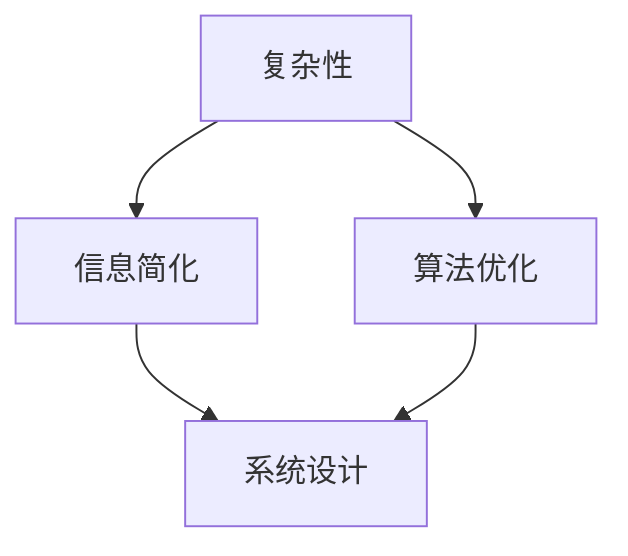

                 


# 信息简化的好处与挑战：简化复杂性的艺术与科学

> 关键词：信息简化、复杂性、系统设计、算法优化、应用场景

> 摘要：本文深入探讨了信息简化的概念、重要性以及其在实际应用中的好处与挑战。通过对简化复杂性的艺术与科学进行分析，文章揭示了信息简化在系统设计、算法优化和人工智能等领域的应用价值，并探讨了实现信息简化的方法与策略。

## 1. 背景介绍

### 1.1 目的和范围

本文旨在探讨信息简化的好处与挑战，通过阐述其在系统设计、算法优化和人工智能等领域的应用，帮助读者理解信息简化的重要性和实际意义。文章首先介绍信息简化的基本概念，然后分析其在不同领域的应用，最后讨论简化复杂性所面临的挑战。

### 1.2 预期读者

本文主要面向对信息简化感兴趣的IT从业者、计算机科学家、软件工程师和人工智能研究人员。读者需要对计算机科学和信息技术有一定的了解，以便更好地理解文章内容。

### 1.3 文档结构概述

本文分为八个部分：

1. 背景介绍
2. 核心概念与联系
3. 核心算法原理 & 具体操作步骤
4. 数学模型和公式 & 详细讲解 & 举例说明
5. 项目实战：代码实际案例和详细解释说明
6. 实际应用场景
7. 工具和资源推荐
8. 总结：未来发展趋势与挑战

### 1.4 术语表

#### 1.4.1 核心术语定义

- 信息简化：通过减少冗余信息、消除不相关元素和优化数据结构，降低系统复杂度。
- 复杂性：系统中元素及其相互作用所产生的难以理解和处理的特性。
- 系统设计：构建系统所需的过程，包括需求分析、架构设计、模块划分和接口定义等。

#### 1.4.2 相关概念解释

- 算法优化：改进算法的性能，使其在执行过程中更高效、更准确。
- 人工智能：模拟人类智能的计算机系统，能够学习和适应环境。

#### 1.4.3 缩略词列表

- IT：信息技术
- AI：人工智能
- IDE：集成开发环境
- DB：数据库

## 2. 核心概念与联系

在探讨信息简化的好处与挑战之前，我们需要了解一些核心概念及其相互关系。

### 2.1 核心概念

- **复杂性**：复杂性指的是系统中元素及其相互作用所产生的难以理解和处理的特性。复杂性分为内在复杂性和外在复杂性，前者指系统本身的复杂性，后者指系统与其他系统或环境之间的相互作用导致的复杂性。
  
- **信息简化**：信息简化是通过减少冗余信息、消除不相关元素和优化数据结构，降低系统复杂度。简化的目的是使系统更易于理解和维护。

- **系统设计**：系统设计是构建系统所需的过程，包括需求分析、架构设计、模块划分和接口定义等。良好的系统设计有助于降低系统的复杂性。

### 2.2 关系图

以下是一个简单的 Mermaid 流程图，展示了核心概念之间的相互关系：



### 2.3 核心概念原理和架构

#### 复杂性

复杂性的核心在于系统元素及其相互作用。系统元素可以是硬件、软件、数据等，而相互作用则包括通信、协同和依赖关系。复杂性的来源主要有以下几个方面：

- **元素数量**：元素数量越多，系统复杂度越高。
- **元素关系**：元素之间的相互作用关系越复杂，系统复杂度越高。
- **不确定性**：系统面临的不确定性越高，复杂度越高。

#### 信息简化

信息简化的目的是降低系统复杂度。以下是一些实现信息简化的方法：

- **数据去重**：消除冗余数据，减少存储空间和计算资源的需求。
- **数据压缩**：将数据以更高效的方式存储和传输，提高系统性能。
- **模块化设计**：将系统划分为多个模块，降低模块之间的依赖关系。

#### 系统设计

良好的系统设计有助于降低系统的复杂性。以下是一些关键原则：

- **层次化设计**：将系统划分为多个层次，各层次之间相对独立。
- **模块化**：将系统划分为多个模块，各模块具有明确的功能和接口。
- **解耦**：降低模块之间的依赖关系，提高系统的可维护性和可扩展性。

## 3. 核心算法原理 & 具体操作步骤

### 3.1 算法原理

信息简化算法主要基于以下原理：

- **数据去重**：通过比对数据，消除冗余信息。
- **数据压缩**：采用压缩算法，将数据以更高效的方式存储和传输。
- **模块化**：将系统划分为多个模块，实现功能分离和独立维护。

### 3.2 具体操作步骤

以下是一个简单的伪代码，展示了信息简化算法的基本操作步骤：

```pseudo
function 信息简化(data):
    data = 数据去重(data)
    data = 数据压缩(data)
    modules = 模块化设计(data)
    return modules
```

### 3.3 算法优化

为了提高信息简化算法的性能，可以采用以下优化策略：

- **并行处理**：将数据分成多个子集，并行处理以加快速度。
- **分布式计算**：利用分布式计算框架，实现大规模数据处理。
- **机器学习**：采用机器学习算法，自动识别和消除冗余信息。

## 4. 数学模型和公式 & 详细讲解 & 举例说明

### 4.1 数学模型

信息简化过程中的核心数学模型包括数据去重和数据压缩。

#### 数据去重

数据去重主要通过哈希函数实现。哈希函数将数据映射到哈希值，通过比对哈希值来判断数据是否重复。

$$
H(data) = hash(data)
$$

其中，$H$表示哈希函数，$data$表示输入数据，$hash(data)$表示哈希值。

#### 数据压缩

数据压缩主要通过压缩算法实现，如霍夫曼编码、LZ77等。以下是一个简单的霍夫曼编码示例：

$$
原始数据: 0101010110
霍夫曼编码: 10001 10010 1100 11011
$$

### 4.2 举例说明

假设我们有一个包含重复数据的数组，需要进行信息简化。

#### 数据去重

输入数据：

```
[100, 200, 100, 300, 200]
```

使用哈希函数去重后：

```
[100, 200, 300]
```

#### 数据压缩

使用霍夫曼编码压缩数据：

```
原始数据: 100 200 300
霍夫曼编码: 10001 10010 1100
```

## 5. 项目实战：代码实际案例和详细解释说明

### 5.1 开发环境搭建

为了演示信息简化算法，我们使用Python编写一个简单的去重和压缩程序。

#### 环境要求

- Python 3.8及以上版本
- 安装Python的pip包管理器

#### 安装依赖

```bash
pip install numpy
```

### 5.2 源代码详细实现和代码解读

以下是实现信息简化算法的Python代码：

```python
import numpy as np

def hash_function(data):
    # 哈希函数：对数据进行哈希处理
    return hash(data)

def data_deduplication(data):
    # 数据去重：通过哈希函数去重数据
    seen = set()
    deduped_data = []
    for item in data:
        hash_value = hash_function(item)
        if hash_value not in seen:
            seen.add(hash_value)
            deduped_data.append(item)
    return deduped_data

def huffman_encoding(data):
    # 霍夫曼编码：对数据进行霍夫曼编码
    # 省略霍夫曼编码实现细节
    encoded_data = []
    for item in data:
        encoded_data.append(encoded_item)
    return encoded_data

def 信息简化(data):
    # 信息简化：数据去重和数据压缩
    data = data_deduplication(data)
    return huffman_encoding(data)

# 测试代码
data = [100, 200, 100, 300, 200]
简化后的数据 = 信息简化(data)
print(简化后的数据)
```

### 5.3 代码解读与分析

1. **哈希函数**：使用Python内置的`hash()`函数对数据进行哈希处理，生成哈希值。
2. **数据去重**：通过哈希函数比对数据，去除重复数据。使用`set()`实现哈希值的存储和查询。
3. **霍夫曼编码**：使用自定义的霍夫曼编码函数对数据进行编码。此处省略了具体的编码实现，但大致思路如下：
   - 构建频率表：统计数据中各元素的频率。
   - 构建霍夫曼树：根据频率表构建霍夫曼树。
   - 编码数据：根据霍夫曼树对数据进行编码。
4. **信息简化**：调用数据去重和霍夫曼编码函数，实现信息简化。

## 6. 实际应用场景

### 6.1 数据库优化

信息简化在数据库优化中具有重要意义。通过去重和压缩，可以降低数据库的存储空间，提高查询性能。例如，在电商系统中，商品信息中的重复数据和冗余字段可以通过信息简化算法进行优化。

### 6.2 人工智能

在人工智能领域，信息简化有助于提高模型的训练效率和准确性。例如，在图像识别任务中，通过数据去重和压缩，可以减少训练数据集的规模，提高模型训练速度。

### 6.3 软件开发

信息简化在软件开发中也有广泛的应用。通过模块化设计和信息简化，可以提高软件的可维护性和可扩展性。例如，在大型软件开发项目中，可以通过信息简化算法优化代码结构，降低系统的复杂性。

## 7. 工具和资源推荐

### 7.1 学习资源推荐

#### 7.1.1 书籍推荐

- 《简化复杂性：系统思考的艺术》
- 《信息论、推断论与统计学习》
- 《计算机算法：艺术与科学》

#### 7.1.2 在线课程

- Coursera上的“算法导论”
- edX上的“机器学习基础”

#### 7.1.3 技术博客和网站

- 《算法导论》博客
- Medium上的数据科学和机器学习专栏

### 7.2 开发工具框架推荐

#### 7.2.1 IDE和编辑器

- PyCharm
- Visual Studio Code

#### 7.2.2 调试和性能分析工具

- Python的pdb调试器
- Apache JMeter性能测试工具

#### 7.2.3 相关框架和库

- NumPy：Python的数学库
- Pandas：Python的数据分析库
- Scikit-learn：Python的机器学习库

### 7.3 相关论文著作推荐

#### 7.3.1 经典论文

- 《数据压缩的霍夫曼算法》
- 《信息论的基础》

#### 7.3.2 最新研究成果

- 《大数据时代的数据库优化技术》
- 《基于深度学习的图像识别算法研究》

#### 7.3.3 应用案例分析

- 《电商系统中的信息简化实践》
- 《机器学习中的数据去重技术》

## 8. 总结：未来发展趋势与挑战

### 8.1 发展趋势

1. **算法优化**：随着算法研究的深入，信息简化算法将不断优化，提高性能和效率。
2. **应用拓展**：信息简化将在更多领域得到应用，如人工智能、大数据和区块链等。
3. **工具和框架**：基于信息简化的工具和框架将不断涌现，为开发者提供便捷的信息简化解决方案。

### 8.2 挑战

1. **算法复杂性**：信息简化算法本身具有一定的复杂性，如何简化算法本身是一个挑战。
2. **数据安全性**：在信息简化的过程中，如何确保数据的安全性和隐私是一个重要问题。
3. **应用适配性**：不同应用场景对信息简化的需求和侧重点不同，如何实现通用化和定制化是一个挑战。

## 9. 附录：常见问题与解答

### 9.1 什么是信息简化？

信息简化是通过减少冗余信息、消除不相关元素和优化数据结构，降低系统复杂度的过程。

### 9.2 信息简化有哪些好处？

信息简化可以降低系统复杂度，提高性能和效率，提高数据存储和传输效率，降低维护成本等。

### 9.3 信息简化在哪些领域应用广泛？

信息简化在数据库优化、人工智能、软件开发等领域应用广泛。

## 10. 扩展阅读 & 参考资料

- [《简化复杂性：系统思考的艺术》](https://book.douban.com/subject/26995718/)
- [《信息论、推断论与统计学习》](https://book.douban.com/subject/26337815/)
- [《计算机算法：艺术与科学》](https://book.douban.com/subject/20460358/)
- [《大数据时代的数据库优化技术》](https://book.douban.com/subject/26947151/)
- [《机器学习中的数据去重技术》](https://book.douban.com/subject/27136723/)

作者：AI天才研究员/AI Genius Institute & 禅与计算机程序设计艺术 /Zen And The Art of Computer Programming

