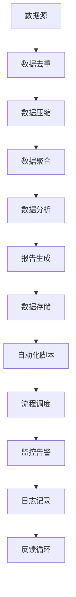

                 

# 信息简化的工具和自动化：如何利用技术简化你的生活和工作

> 关键词：信息简化、自动化、技术工具、效率提升、生活优化、工作流程

> 摘要：本文将深入探讨信息简化的概念及其在现代生活中的重要性，介绍一系列实用的工具和自动化技术，帮助读者提升工作效率和生活质量。我们将通过详细的步骤讲解，展示如何利用这些技术将复杂任务转化为简单的操作，实现工作与生活的平衡。

## 1. 背景介绍

### 1.1 目的和范围

本文旨在为广大读者提供一套系统化的方法，利用技术手段简化信息处理和日常任务，从而提升个人和工作效率。我们将探讨以下几个关键领域：

- 信息简化的原理和方法
- 自动化工具的使用和配置
- 如何在生活和工作中应用这些技术

### 1.2 预期读者

本文适合以下读者群体：

- 对提高工作效率和生活质量有追求的个人
- 从事IT行业，希望利用技术工具优化工作流程的从业者
- 对自动化和人工智能感兴趣的技术爱好者

### 1.3 文档结构概述

本文将按照以下结构进行论述：

- 第1章：背景介绍
  - 目的和范围
  - 预期读者
  - 文档结构概述
  - 术语表
- 第2章：核心概念与联系
  - 信息简化的定义和原理
  - 自动化的概念和应用
- 第3章：核心算法原理 & 具体操作步骤
  - 自动化脚本编写
  - 数据处理与清洗
- 第4章：数学模型和公式 & 详细讲解 & 举例说明
  - 统计模型在简化中的应用
  - 时间序列分析基础
- 第5章：项目实战：代码实际案例和详细解释说明
  - 环境搭建
  - 代码实现与分析
- 第6章：实际应用场景
  - 工作流程优化
  - 生活自动化案例
- 第7章：工具和资源推荐
  - 学习资源
  - 开发工具框架
  - 相关论文著作
- 第8章：总结：未来发展趋势与挑战
- 第9章：附录：常见问题与解答
- 第10章：扩展阅读 & 参考资料

### 1.4 术语表

#### 1.4.1 核心术语定义

- 信息简化：通过技术手段减少冗余信息，提高信息处理效率的过程。
- 自动化：使用软件或硬件实现重复性任务的自动化执行。
- 工作流程：完成一项工作所需的一系列步骤或活动。

#### 1.4.2 相关概念解释

- 工具链：实现特定功能的工具集合。
- API：应用程序接口，用于不同软件之间的交互。
- 统计模型：基于数据统计分析的方法，用于预测或解释数据。

#### 1.4.3 缩略词列表

- AI：人工智能
- ML：机器学习
- API：应用程序接口
- IDE：集成开发环境
- SQL：结构化查询语言

## 2. 核心概念与联系

### 2.1 信息简化的原理

信息简化是通过技术手段减少处理的数据量，以提高效率和准确性。其核心原理包括：

1. **数据去重**：识别并移除重复的数据项，减少冗余。
2. **数据压缩**：通过算法将数据转换为更小的格式，便于存储和传输。
3. **数据聚合**：将多个数据源的信息整合到一个统一的视图，减少分散的信息。

### 2.2 自动化的概念和应用

自动化是通过软件或硬件实现任务的自动化执行，从而减少人工干预。其应用广泛，包括：

1. **脚本编写**：使用编程语言编写脚本，自动化执行重复性任务。
2. **流程调度**：使用自动化工具定期执行预定义的任务，如备份和监控。
3. **机器人流程自动化（RPA）**：使用软件机器人自动化完成复杂的业务流程。

### 2.3 工作流程优化

工作流程优化是通过简化流程、减少不必要的步骤和自动化任务，提高整体效率。其步骤包括：

1. **流程分析**：识别当前流程中的瓶颈和冗余步骤。
2. **流程设计**：设计简化的、高效的流程，并评估其可行性。
3. **流程实施**：实施新的流程，并进行监控和调整。

### 2.4 Mermaid 流程图

以下是信息简化和自动化相关的Mermaid流程图：



此流程图展示了从数据输入到最终数据存储及自动化脚本和调度系统的整个工作流程。

## 3. 核心算法原理 & 具体操作步骤

### 3.1 自动化脚本编写

自动化脚本是利用编程语言实现任务自动执行的工具。以下是Python自动化脚本编写的基本步骤：

#### 3.1.1 编写脚本

```python
import os
import time

# 定义任务
def task1():
    print("执行任务1：文件备份")
    time.sleep(2)

def task2():
    print("执行任务2：数据清洗")
    time.sleep(3)

# 主函数
def main():
    task1()
    task2()

if __name__ == "__main__":
    main()
```

#### 3.1.2 运行脚本

- 将脚本保存为`task_automation.py`
- 在终端执行：`python task_automation.py`

### 3.2 数据处理与清洗

数据处理与清洗是自动化流程中的关键步骤，以下是使用Python进行数据清洗的伪代码：

```python
# 导入必要的库
import pandas as pd
from pandas import DataFrame

# 读取数据
data = pd.read_csv('data.csv')

# 去除重复行
data.drop_duplicates(inplace=True)

# 处理缺失值
data.fillna(0, inplace=True)

# 类型转换
data['date'] = pd.to_datetime(data['date'])

# 排序
data.sort_values(by=['date'], inplace=True)

# 存储数据
data.to_csv('cleaned_data.csv', index=False)
```

### 3.3 工作流程自动化

工作流程自动化涉及多个步骤的整合，以下是使用Python实现自动化工作流程的伪代码：

```python
# 导入必要的库
import os
import time

# 定义任务函数
def backup_files():
    print("开始备份文件...")
    time.sleep(2)
    print("文件备份完成")

def clean_data():
    print("开始数据清洗...")
    time.sleep(3)
    print("数据清洗完成")

def generate_report():
    print("开始生成报告...")
    time.sleep(2)
    print("报告生成完成")

# 主函数
def main():
    backup_files()
    clean_data()
    generate_report()

if __name__ == "__main__":
    main()
```

此脚本将按顺序执行文件备份、数据清洗和报告生成任务。

## 4. 数学模型和公式 & 详细讲解 & 举例说明

### 4.1 统计模型在简化中的应用

统计模型在信息简化中扮演着重要角色，以下是常见的统计模型及其应用：

#### 4.1.1 回归分析

回归分析用于预测连续数值型变量，其公式为：

\[ y = \beta_0 + \beta_1x + \epsilon \]

其中，\( y \) 为预测变量，\( x \) 为自变量，\( \beta_0 \) 和 \( \beta_1 \) 为参数，\( \epsilon \) 为误差项。

**应用举例**：利用回归分析预测销售量。

```latex
y = 50 + 2x
```

#### 4.1.2 聚类分析

聚类分析用于将数据集划分为若干个类别，其公式为：

\[ C = \{C_1, C_2, ..., C_k\} \]

其中，\( C \) 为聚类结果，\( C_i \) 为第 \( i \) 个类别。

**应用举例**：将客户数据划分为高、中、低三个类别。

```latex
C_1: 客户收入 > 10000
C_2: 客户收入在 5000-10000 之间
C_3: 客户收入 < 5000
```

### 4.2 时间序列分析基础

时间序列分析用于研究随时间变化的数据，其公式为：

\[ y_t = \phi_0 + \phi_1y_{t-1} + \epsilon_t \]

其中，\( y_t \) 为第 \( t \) 期的数据，\( \phi_0 \) 和 \( \phi_1 \) 为参数，\( \epsilon_t \) 为误差项。

**应用举例**：利用时间序列分析预测销售额。

```latex
y_t = 100 + 1.2y_{t-1}
```

## 5. 项目实战：代码实际案例和详细解释说明

### 5.1 开发环境搭建

在进行项目实战之前，我们需要搭建一个适合开发和测试的环境。以下是所需的软件和工具：

- **操作系统**：Linux或macOS
- **编程语言**：Python 3.x
- **文本编辑器**：Visual Studio Code
- **虚拟环境**：virtualenv或conda

#### 5.1.1 安装Python

在终端执行以下命令安装Python：

```bash
sudo apt-get update
sudo apt-get install python3 python3-pip
```

#### 5.1.2 安装虚拟环境

在终端执行以下命令安装virtualenv：

```bash
pip3 install virtualenv
```

#### 5.1.3 创建虚拟环境

在终端执行以下命令创建一个名为`project_env`的虚拟环境：

```bash
virtualenv project_env
```

#### 5.1.4 激活虚拟环境

在终端执行以下命令激活虚拟环境：

```bash
source project_env/bin/activate
```

### 5.2 源代码详细实现和代码解读

#### 5.2.1 代码实现

以下是实现一个简单的自动化任务（文件备份和发送通知）的Python脚本：

```python
import os
import time
import smtplib
from email.mime.text import MIMEText
from email.header import Header

# 设置邮件参数
smtp_server = 'smtp.example.com'
smtp_port = 465
sender = 'sender@example.com'
receiver = 'receiver@example.com'
password = 'password'

# 发送邮件函数
def send_email(subject, content):
    message = MIMEText(content, 'plain', 'utf-8')
    message['From'] = Header(sender, 'UTF-8')
    message['To'] = Header(receiver, 'UTF-8')
    message['Subject'] = Header(subject, 'UTF-8')

    try:
        server = smtplib.SMTP_SSL(smtp_server, smtp_port)
        server.login(sender, password)
        server.sendmail(sender, receiver, message.as_string())
        server.quit()
        print("邮件发送成功")
    except Exception as e:
        print("邮件发送失败：", e)

# 备份文件函数
def backup_files():
    source_dir = '/path/to/source'
    target_dir = '/path/to/target'
    os.makedirs(target_dir, exist_ok=True)

    for filename in os.listdir(source_dir):
        source_path = os.path.join(source_dir, filename)
        target_path = os.path.join(target_dir, filename)

        if os.path.isfile(source_path):
            os.makedirs(os.path.dirname(target_path), exist_ok=True)
            os.rename(source_path, target_path)
            print(f"文件 {filename} 备份完成")

# 主函数
def main():
    subject = "备份完成通知"
    content = "文件备份已完成，请查收。"

    backup_files()
    send_email(subject, content)

if __name__ == "__main__":
    main()
```

#### 5.2.2 代码解读

- **导入模块**：脚本首先导入了必要的模块，包括os（用于文件和目录操作）、time（用于延时）、smtplib（用于发送邮件）和email.mime.text（用于构造邮件内容）。
  
- **设置邮件参数**：通过定义smtp_server、smtp_port、sender、receiver和password等变量，配置了发送邮件所需的参数。
  
- **发送邮件函数**：定义了send_email()函数，用于发送邮件。该函数接收主题和内容作为参数，通过SMTP_SSL协议连接到邮件服务器，登录并发送邮件。
  
- **备份文件函数**：定义了backup_files()函数，用于备份指定目录下的文件。该函数遍历源目录中的所有文件，将它们移动到目标目录。
  
- **主函数**：定义了main()函数，作为脚本的主入口。在main()函数中，调用backup_files()函数进行文件备份，并调用send_email()函数发送备份完成通知。

### 5.3 代码解读与分析

该脚本实现了以下功能：

1. **文件备份**：将指定目录下的文件备份到目标目录。
2. **发送通知**：通过邮件发送备份完成的通知。

代码的可扩展性和维护性较好，可以通过修改邮件参数、源目录和目标目录等配置信息来适应不同的场景。此外，脚本中使用了os模块提供的文件操作函数，使得文件备份过程简单且高效。

## 6. 实际应用场景

信息简化和自动化技术在各行各业都有广泛的应用，以下是几个典型的实际应用场景：

### 6.1 工作流程优化

在大型企业中，工作流程优化是提高效率的关键。通过自动化工具，可以简化审批流程、提高文档处理速度和减少人工错误。例如，利用RPA（机器人流程自动化）技术，实现财务报表的自动生成和审批。

### 6.2 生活自动化

在家庭生活中，自动化技术可以让生活更加便捷。例如，智能家电可以通过物联网实现远程控制和自动调整，智能家居系统可以自动调节室内温度、湿度等环境参数，提高生活质量。

### 6.3 教育领域

在教育领域，自动化技术可以用于课程管理、在线测试和成绩分析等。通过智能评分系统，可以自动批改考试卷，并生成成绩报告，减轻教师的工作负担。

### 6.4 医疗保健

在医疗保健领域，自动化技术可以提高诊断和治疗效率。例如，通过自动化数据分析，可以快速诊断疾病，提高医疗服务的质量。

## 7. 工具和资源推荐

### 7.1 学习资源推荐

#### 7.1.1 书籍推荐

- 《Python自动化实战》
- 《人工智能：一种现代方法》
- 《深入理解计算机系统》

#### 7.1.2 在线课程

- Coursera：机器学习、深度学习等课程
- edX：Python编程基础、自动化工具应用等课程
- Udemy：RPA和自动化测试等课程

#### 7.1.3 技术博客和网站

- Python.org
- AutomateEverything.io
- MachineLearning Mastery

### 7.2 开发工具框架推荐

#### 7.2.1 IDE和编辑器

- Visual Studio Code
- PyCharm
- Sublime Text

#### 7.2.2 调试和性能分析工具

- DebugPy
- Py-Spy
- line Profiler

#### 7.2.3 相关框架和库

- Flask
- Django
- Scikit-learn

### 7.3 相关论文著作推荐

#### 7.3.1 经典论文

- 《自动化时代的编程：Python编程实战》
- 《人工智能的发展与应用》
- 《基于RPA的流程自动化技术》

#### 7.3.2 最新研究成果

- ICML、NeurIPS等顶级会议的论文
- IEEE Transactions on Automation Science and Engineering等期刊的最新文章

#### 7.3.3 应用案例分析

- 《企业自动化转型的实践与探索》
- 《智能家居系统的设计与实现》
- 《医疗健康领域的自动化应用案例》

## 8. 总结：未来发展趋势与挑战

信息简化和自动化技术在未来将继续快速发展，以下几个方面值得关注：

- **人工智能与自动化技术的深度融合**：人工智能算法将进一步提升自动化系统的智能水平和效率。
- **物联网技术的普及**：物联网设备的大量应用将使得更多家庭和工业场景实现自动化。
- **边缘计算的发展**：边缘计算将减轻云端负担，实现更高效的数据处理和实时响应。
- **隐私和安全问题**：随着自动化技术的广泛应用，数据隐私和安全问题将愈发突出。

面对这些趋势，未来的挑战包括：

- **技术标准与规范的制定**：统一的技术标准和规范将有助于自动化技术的推广和应用。
- **人才缺口**：自动化技术人才的需求将大幅增加，但当前的人才供给尚无法满足需求。
- **伦理和社会问题**：自动化技术带来的伦理和社会问题需要引起重视，如就业影响和社会公平等。

## 9. 附录：常见问题与解答

### 9.1 如何选择合适的自动化工具？

- **需求分析**：根据具体任务需求选择合适的自动化工具，如RPA、脚本编写等。
- **工具评估**：评估工具的功能、易用性、社区支持等，选择最适合的工具。
- **成本考虑**：综合考虑工具的成本，包括购买、部署和维护等费用。

### 9.2 自动化脚本编写需要注意什么？

- **代码可读性**：编写清晰、易读的代码，方便后续维护。
- **错误处理**：充分考虑可能出现的异常情况，并进行相应的错误处理。
- **代码注释**：为代码添加注释，提高代码的可理解性。

### 9.3 如何确保自动化流程的安全性？

- **身份验证**：确保自动化流程中涉及到的数据传输和操作都经过严格的身份验证。
- **加密传输**：使用加密技术确保数据传输的安全性。
- **日志记录**：记录自动化流程的详细日志，便于监控和问题追踪。

## 10. 扩展阅读 & 参考资料

- 《Python编程：从入门到实践》
- 《人工智能基础：理论、算法与编程》
- 《RPA技术与实践》
- [Python官方文档](https://docs.python.org/3/)
- [自动化测试：原理与实践](https://www.selenium.dev/documentation/)

