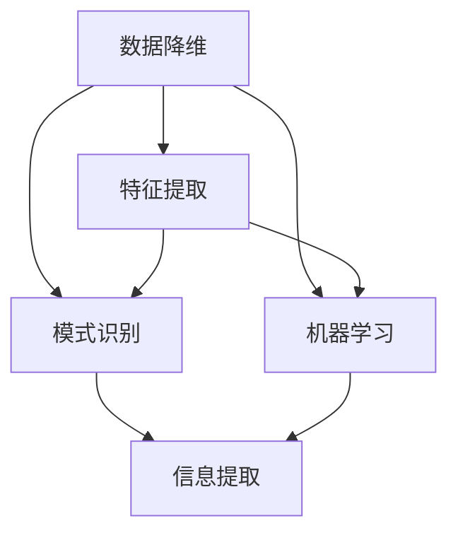

                 

### 文章标题

《信息简化的艺术与科学：如何在混乱中找到模式和意义》

信息简化（Information Simplification）不仅是应对复杂信息的重要技能，更是一种艺术和科学相结合的实践。在信息技术和大数据时代，如何从海量数据中提取有价值的信息，并将其简化为易于理解和处理的形式，成为了一个重要的研究领域。本文旨在探讨信息简化的艺术与科学，通过逻辑清晰、结构紧凑的技术语言，逐步引导读者了解其核心概念、算法原理、数学模型，并通过实际案例展示其应用价值。

> **关键词**：信息简化、数据降维、模式识别、机器学习、信息可视化

> **摘要**：本文首先介绍了信息简化的背景和重要性，随后定义了核心概念，并使用Mermaid流程图展示了相关架构。接着，文章详细讲解了核心算法原理和操作步骤，并运用LaTeX格式阐述了数学模型。随后，通过项目实战和代码分析，展示了信息简化的实际应用。文章最后探讨了信息简化的应用场景、工具资源，并总结了未来发展趋势与挑战。

### 1. 背景介绍

#### 1.1 目的和范围

本文的目的是深入探讨信息简化的艺术与科学，分析其在信息技术领域的应用价值。随着数据量的不断膨胀，如何高效地处理和分析数据成为了一个亟待解决的问题。信息简化通过减少数据冗余、提取关键信息，使得数据更加简洁、直观，便于后续处理和分析。

本文主要涵盖以下内容：

- 核心概念与联系
- 核心算法原理与操作步骤
- 数学模型和公式讲解
- 项目实战与代码分析
- 实际应用场景
- 工具和资源推荐
- 总结与未来展望

#### 1.2 预期读者

本文面向对信息技术、数据科学和人工智能有一定了解的读者，特别是对数据降维、模式识别和机器学习感兴趣的工程师和研究人员。读者通过本文可以系统地了解信息简化的原理和应用，掌握相关技术工具，提升数据处理和分析的能力。

#### 1.3 文档结构概述

本文结构清晰，分为以下章节：

1. **背景介绍**：介绍文章的目的、预期读者以及文档结构。
2. **核心概念与联系**：定义核心概念，展示信息简化的架构。
3. **核心算法原理与操作步骤**：详细讲解信息简化的算法原理和操作步骤。
4. **数学模型和公式讲解**：运用LaTeX格式阐述信息简化的数学模型。
5. **项目实战与代码分析**：通过实际项目展示信息简化的应用。
6. **实际应用场景**：探讨信息简化在不同领域的应用。
7. **工具和资源推荐**：推荐学习资源和开发工具。
8. **总结与未来展望**：总结文章要点，展望未来发展趋势。

#### 1.4 术语表

本文涉及一些专业术语，以下是核心术语的定义和相关概念解释：

#### 1.4.1 核心术语定义

- **信息简化**：通过去除冗余信息、提取关键特征，将复杂的信息转化为简洁、易于处理的形式。
- **数据降维**：通过降维技术减少数据维度，简化数据结构。
- **模式识别**：通过算法自动识别数据中的规律和模式。
- **机器学习**：利用算法从数据中学习规律，实现自动预测和决策。

#### 1.4.2 相关概念解释

- **特征提取**：从数据中提取具有区分性的特征，用于后续分析。
- **数据预处理**：对原始数据进行清洗、转换等处理，以提高数据质量和分析效果。
- **模型训练**：通过训练数据集调整算法参数，使模型能够准确预测新数据。

#### 1.4.3 缩略词列表

- **ML**：机器学习
- **PCA**：主成分分析
- **LDA**：线性判别分析
- **SVD**：奇异值分解
- **K-means**：K-均值聚类算法

## 2. 核心概念与联系

信息简化的核心在于从复杂、冗余的信息中提取有价值的模式和知识。为了深入理解信息简化的原理和应用，我们需要先定义一些核心概念，并展示其相互联系。

### 2.1 核心概念

- **数据降维**：数据降维是将高维数据映射到低维空间，减少数据维度，从而简化数据结构。常见的数据降维方法包括主成分分析（PCA）、线性判别分析（LDA）和奇异值分解（SVD）。
- **特征提取**：特征提取是从原始数据中提取具有区分性的特征，用于后续分析。特征提取能够减少数据冗余，提高分析效率。
- **模式识别**：模式识别是通过算法自动识别数据中的规律和模式。模式识别在图像识别、语音识别和文本分类等领域有广泛应用。
- **机器学习**：机器学习是一种通过算法从数据中学习规律，实现自动预测和决策的方法。机器学习在信息简化中起着关键作用，通过训练模型来识别和提取关键特征。

### 2.2 相互联系

信息简化的各个核心概念之间存在着密切的联系。数据降维和特征提取是信息简化的基础，通过降维和提取关键特征，可以将高维、复杂的数据简化为低维、易于处理的形式。模式识别和机器学习则利用这些简化后的数据，通过训练模型来识别数据中的规律和模式，从而实现信息提取和知识发现。

为了更直观地展示这些核心概念之间的联系，我们可以使用Mermaid流程图来表示。



在这个流程图中，数据降维和特征提取是信息简化的两个核心步骤，它们将原始数据简化为易于处理的形式。模式识别和机器学习则利用这些简化后的数据，通过训练模型来提取信息，实现知识发现。

### 2.3 核心概念原理

#### 数据降维

数据降维是将高维数据映射到低维空间的过程，旨在减少数据维度，简化数据结构。数据降维有助于提高数据处理和分析的效率，减少计算复杂度。常见的降维方法包括：

- **主成分分析（PCA）**：PCA通过计算数据的协方差矩阵，提取主要成分，从而将高维数据映射到低维空间。
- **线性判别分析（LDA）**：LDA通过最大化类间方差和最小化类内方差，选择具有最佳区分能力的特征，从而实现降维。
- **奇异值分解（SVD）**：SVD通过将数据分解为三个矩阵的乘积，实现降维。

#### 特征提取

特征提取是从原始数据中提取具有区分性的特征，用于后续分析。特征提取有助于减少数据冗余，提高分析效率。常见的特征提取方法包括：

- **自动编码器（Autoencoder）**：自动编码器是一种神经网络模型，通过训练数据，自动提取关键特征。
- **核方法（Kernel Method）**：核方法通过将原始数据映射到高维特征空间，实现特征提取。
- **滤波器（Filter）**：滤波器通过将原始信号与滤波器响应卷积，实现特征提取。

#### 模式识别

模式识别是通过算法自动识别数据中的规律和模式。模式识别在图像识别、语音识别和文本分类等领域有广泛应用。常见的模式识别算法包括：

- **K-均值聚类算法（K-means）**：K-均值聚类算法通过迭代计算，将数据划分为K个聚类。
- **支持向量机（SVM）**：支持向量机通过寻找最佳超平面，实现数据分类。
- **神经网络（Neural Network）**：神经网络通过多层非线性变换，实现数据分类和回归。

#### 机器学习

机器学习是一种通过算法从数据中学习规律，实现自动预测和决策的方法。机器学习在信息简化中起着关键作用，通过训练模型来识别和提取关键特征。常见的机器学习算法包括：

- **线性回归（Linear Regression）**：线性回归通过拟合线性模型，预测连续值。
- **逻辑回归（Logistic Regression）**：逻辑回归通过拟合逻辑模型，预测概率值。
- **决策树（Decision Tree）**：决策树通过递归划分数据，构建分类和回归模型。
- **随机森林（Random Forest）**：随机森林通过构建多棵决策树，实现集成学习。

### 2.4 关键概念间的关系

数据降维、特征提取、模式识别和机器学习是信息简化的四个关键环节，它们相互关联，共同构成了信息简化的理论框架。

- 数据降维和特征提取是信息简化的基础，通过减少数据维度和提取关键特征，实现数据简化。
- 模式识别和机器学习利用简化后的数据，通过训练模型来识别数据中的规律和模式，实现信息提取和知识发现。
- 数据降维、特征提取、模式识别和机器学习相互融合，共同推动信息简化的进程。

## 3. 核心算法原理 & 具体操作步骤

在了解了信息简化的核心概念和联系之后，接下来我们将深入探讨信息简化的核心算法原理，并详细阐述其操作步骤。信息简化的核心算法包括数据降维、特征提取和模式识别，下面将分别介绍这些算法的原理和操作步骤。

### 3.1 数据降维算法原理

数据降维是将高维数据映射到低维空间，从而简化数据结构的过程。降维的目的是减少数据维度，提高数据处理和分析的效率。以下是几种常见的数据降维算法原理：

#### 3.1.1 主成分分析（PCA）

主成分分析（PCA）是一种基于方差最大化原则的降维算法。PCA通过以下步骤实现数据降维：

1. **标准化**：对原始数据进行标准化处理，使其具有零均值和单位方差。
   $$z = \frac{x - \mu}{\sigma}$$
   其中，$x$为原始数据，$\mu$为均值，$\sigma$为标准差。

2. **计算协方差矩阵**：计算数据集的协方差矩阵$C$。
   $$C = \frac{1}{N-1}XX^T$$
   其中，$X$为数据矩阵，$N$为样本数量。

3. **计算特征值和特征向量**：对协方差矩阵$C$进行特征值分解，得到特征值$\lambda_i$和特征向量$e_i$。
   $$C = E\Lambda E^T$$
   其中，$E$为特征向量矩阵，$\Lambda$为特征值矩阵。

4. **选择主要成分**：根据特征值的大小，选择前$k$个最大的特征值对应的特征向量，构成降维矩阵$P$。
   $$P = [e_1, e_2, ..., e_k]$$

5. **降维**：将原始数据$X$投影到降维矩阵$P$上，得到降维数据$Y$。
   $$Y = PX$$

#### 3.1.2 线性判别分析（LDA）

线性判别分析（LDA）是一种基于类间方差最大化、类内方差最小化的降维算法。LDA通过以下步骤实现数据降维：

1. **计算均值向量**：计算各个类别的均值向量$\mu_j$。
   $$\mu_j = \frac{1}{n_j}\sum_{i=1}^{n_j}x_{ij}$$
   其中，$x_{ij}$为第$i$个样本在第$j$个特征上的值，$n_j$为第$j$个类别的样本数量。

2. **计算协方差矩阵**：计算类内协方差矩阵$S_w$和类间协方差矩阵$S_b$。
   $$S_w = \sum_{j=1}^{c}\sum_{i=1}^{n_j}(x_{ij} - \mu_j)(x_{ij} - \mu_j)^T$$
   $$S_b = \sum_{j=1}^{c}n_j(\mu_j - \mu)(\mu_j - \mu)^T$$
   其中，$\mu$为所有类别的均值向量，$c$为类别数量。

3. **计算协方差矩阵的逆**：计算$S_w$和$S_b$的逆。
   $$S_w^{-1} = (S_w + \lambda I)^{-1}$$
   $$S_b^{-1} = (S_b + \lambda I)^{-1}$$
   其中，$\lambda$为正则化参数，$I$为单位矩阵。

4. **计算判别向量**：计算判别向量$d$。
   $$d = S_w^{-1}S_b^{-1}\mu$$

5. **降维**：将原始数据$X$投影到判别向量$d$上，得到降维数据$Y$。
   $$Y = dX$$

#### 3.1.3 奇异值分解（SVD）

奇异值分解（SVD）是一种基于矩阵分解的降维算法。SVD通过以下步骤实现数据降维：

1. **计算协方差矩阵**：计算数据集的协方差矩阵$C$。
   $$C = \frac{1}{N-1}XX^T$$

2. **计算SVD**：对协方差矩阵$C$进行奇异值分解，得到奇异值矩阵$\Sigma$和奇异向量矩阵$U$。
   $$C = U\Sigma V^T$$

3. **选择主要成分**：根据奇异值的大小，选择前$k$个最大的奇异值对应的奇异向量，构成降维矩阵$P$。
   $$P = [u_1, u_2, ..., u_k]$$

4. **降维**：将原始数据$X$投影到降维矩阵$P$上，得到降维数据$Y$。
   $$Y = PX$$

### 3.2 特征提取算法原理

特征提取是从原始数据中提取具有区分性的特征，用于后续分析。特征提取有助于减少数据冗余，提高分析效率。以下是几种常见的特征提取算法原理：

#### 3.2.1 自动编码器

自动编码器（Autoencoder）是一种基于神经网络的特征提取算法。自动编码器通过以下步骤实现特征提取：

1. **编码器**：编码器通过多层神经网络将原始数据映射到隐层，提取关键特征。
   $$h = f(W_1h + b_1)$$
   其中，$h$为隐层输出，$f$为激活函数，$W_1$为权重矩阵，$b_1$为偏置向量。

2. **解码器**：解码器通过多层神经网络将隐层输出映射回原始数据空间。
   $$x' = f(W_2x' + b_2)$$
   其中，$x'$为解码器输出，$W_2$为权重矩阵，$b_2$为偏置向量。

3. **损失函数**：使用损失函数（如均方误差）评估解码器输出与原始数据之间的差距，优化编码器和解码器参数。

#### 3.2.2 核方法

核方法（Kernel Method）是一种通过将原始数据映射到高维特征空间的特征提取算法。核方法通过以下步骤实现特征提取：

1. **核函数**：选择合适的核函数（如多项式核、径向基函数核），将原始数据映射到高维特征空间。
   $$k(x_i, x_j) = \phi(x_i)^T\phi(x_j)$$
   其中，$x_i$和$x_j$为原始数据点，$\phi$为核函数。

2. **特征提取**：在高维特征空间中，计算数据的特征向量。
   $$f_i = \phi(x_i)$$

3. **模型训练**：在特征空间中训练分类或回归模型。

#### 3.2.3 滤波器

滤波器（Filter）是一种通过将原始信号与滤波器响应卷积的特征提取算法。滤波器通过以下步骤实现特征提取：

1. **设计滤波器**：根据特征提取目标，设计合适的滤波器响应。
   $$h(\tau) = \text{rect}(\tau - \tau_0) - \text{rect}(\tau - \tau_0 + \tau_1)$$
   其中，$\text{rect}$为矩形函数，$\tau_0$和$\tau_1$为滤波器参数。

2. **卷积**：将滤波器响应与原始信号卷积，提取特征。
   $$f(\tau) = \int_{-\infty}^{+\infty}h(\tau - \tau')x(\tau')d\tau'$$

### 3.3 模式识别算法原理

模式识别是通过算法自动识别数据中的规律和模式。模式识别在图像识别、语音识别和文本分类等领域有广泛应用。以下是几种常见的模式识别算法原理：

#### 3.3.1 K-均值聚类算法

K-均值聚类算法（K-means）是一种基于距离最小化的聚类算法。K-均值聚类算法通过以下步骤实现模式识别：

1. **初始化聚类中心**：随机选择$k$个样本作为初始聚类中心。
   $$c_j = x_{ij}, \forall j = 1, 2, ..., k$$

2. **计算距离**：计算每个样本与聚类中心的距离。
   $$d(x_i, c_j) = \|x_i - c_j\|_2$$

3. **分配样本**：将每个样本分配到最近的聚类中心。
   $$z_i = \arg\min_{j=1,...,k}d(x_i, c_j)$$

4. **更新聚类中心**：计算每个聚类的平均值，作为新的聚类中心。
   $$c_j = \frac{1}{n_j}\sum_{i=1}^{n_j}x_{ij}, \forall j = 1, 2, ..., k$$

5. **迭代**：重复步骤2-4，直到聚类中心不再变化或达到最大迭代次数。

#### 3.3.2 支持向量机

支持向量机（SVM）是一种基于最大化分类间隔的线性分类算法。SVM通过以下步骤实现模式识别：

1. **构建线性模型**：通过求解优化问题，找到最佳分类超平面。
   $$\min_{\beta, \beta_0} \frac{1}{2}\|\beta\|_2^2 + C\sum_{i=1}^{n}\xi_i$$
   $$\beta^T x_i + \beta_0 \geq 1 - \xi_i, \forall i = 1, 2, ..., n$$
   其中，$\beta$为权重向量，$\beta_0$为偏置项，$C$为惩罚参数，$\xi_i$为松弛变量。

2. **求解优化问题**：使用拉格朗日乘子法或序列最小化方法求解优化问题，得到权重向量$\beta$和偏置项$\beta_0$。

3. **分类决策**：对于新样本$x$，计算其与分类超平面的距离，进行分类决策。
   $$f(x) = \text{sign}(\beta^T x + \beta_0)$$

#### 3.3.3 神经网络

神经网络（Neural Network）是一种基于多层非线性变换的模式识别算法。神经网络通过以下步骤实现模式识别：

1. **初始化网络参数**：随机初始化网络的权重和偏置。

2. **前向传播**：将输入数据通过网络的每一层进行前向传播，得到输出。
   $$h_{\text{hidden}} = \sigma(W_{\text{hidden}}h_{\text{input}} + b_{\text{hidden}})$$
   $$h_{\text{output}} = \sigma(W_{\text{output}}h_{\text{hidden}} + b_{\text{output}})$$
   其中，$h_{\text{hidden}}$为隐层输出，$h_{\text{output}}$为输出层输出，$\sigma$为激活函数，$W_{\text{hidden}}$和$W_{\text{output}}$为权重矩阵，$b_{\text{hidden}}$和$b_{\text{output}}$为偏置向量。

3. **计算损失函数**：使用损失函数（如均方误差、交叉熵损失）计算输出与真实标签之间的差距。

4. **反向传播**：通过反向传播算法，计算每一层权重的梯度，更新网络参数。
   $$\Delta W_{\text{output}} = \alpha \frac{\partial J}{\partial W_{\text{output}}}$$
   $$\Delta b_{\text{output}} = \alpha \frac{\partial J}{\partial b_{\text{output}}}$$
   $$\Delta W_{\text{hidden}} = \alpha \frac{\partial J}{\partial W_{\text{hidden}}}$$
   $$\Delta b_{\text{hidden}} = \alpha \frac{\partial J}{\partial b_{\text{hidden}}}$$
   其中，$\alpha$为学习率，$J$为损失函数。

5. **迭代训练**：重复步骤2-4，直到网络参数收敛或达到最大迭代次数。

### 3.4 信息简化的具体操作步骤

信息简化的具体操作步骤可以概括为以下几个阶段：

#### 3.4.1 数据预处理

1. **数据清洗**：处理缺失值、异常值和噪声，确保数据质量。
   $$x_{\text{clean}} = \text{数据处理}(x)$$

2. **数据标准化**：对数据集进行标准化处理，使其具有零均值和单位方差。
   $$z = \frac{x - \mu}{\sigma}$$

#### 3.4.2 数据降维

1. **选择降维方法**：根据数据特征和需求，选择合适的降维方法（如PCA、LDA、SVD）。

2. **计算降维矩阵**：计算降维矩阵，将高维数据映射到低维空间。
   $$P = \text{降维算法}(X)$$

3. **降维**：将原始数据投影到降维矩阵上，得到降维数据。
   $$Y = PX$$

#### 3.4.3 特征提取

1. **选择特征提取方法**：根据数据特征和需求，选择合适的特征提取方法（如自动编码器、核方法、滤波器）。

2. **提取特征**：提取关键特征，用于后续分析。
   $$f = \text{特征提取算法}(X)$$

#### 3.4.4 模式识别

1. **选择模式识别方法**：根据数据特征和需求，选择合适的模式识别方法（如K-均值聚类、SVM、神经网络）。

2. **训练模型**：使用训练数据集训练模型，提取数据中的规律和模式。

3. **分类决策**：对测试数据集进行分类决策，评估模型性能。

通过以上操作步骤，我们可以实现对信息的简化，提取出有价值的数据模式和知识，为后续分析和决策提供支持。

## 4. 数学模型和公式 & 详细讲解 & 举例说明

在信息简化的过程中，数学模型和公式起着至关重要的作用。它们不仅为算法提供了理论基础，而且确保了信息简化的过程具有科学性和可操作性。在本节中，我们将详细讲解信息简化过程中涉及的数学模型和公式，并通过实际例子进行说明。

### 4.1 主成分分析（PCA）

主成分分析（PCA）是一种常用的数据降维方法。其核心思想是通过提取数据的最大方差特征，将高维数据映射到低维空间。以下是PCA的数学模型和公式：

1. **标准化**：对数据进行标准化处理，使其具有零均值和单位方差。
   $$z = \frac{x - \mu}{\sigma}$$
   其中，$x$为原始数据，$\mu$为均值，$\sigma$为标准差。

2. **协方差矩阵**：计算数据集的协方差矩阵$C$。
   $$C = \frac{1}{N-1}XX^T$$
   其中，$X$为数据矩阵，$N$为样本数量。

3. **特征值和特征向量**：对协方差矩阵$C$进行特征值分解，得到特征值$\lambda_i$和特征向量$e_i$。
   $$C = E\Lambda E^T$$
   其中，$E$为特征向量矩阵，$\Lambda$为特征值矩阵。

4. **选择主要成分**：根据特征值的大小，选择前$k$个最大的特征值对应的特征向量，构成降维矩阵$P$。
   $$P = [e_1, e_2, ..., e_k]$$

5. **降维**：将原始数据$X$投影到降维矩阵$P$上，得到降维数据$Y$。
   $$Y = PX$$

### 4.2 线性判别分析（LDA）

线性判别分析（LDA）是一种基于类间方差最大化、类内方差最小化的降维方法。其核心思想是通过选择最佳特征向量，将不同类别的数据分开。以下是LDA的数学模型和公式：

1. **计算均值向量**：计算各个类别的均值向量$\mu_j$。
   $$\mu_j = \frac{1}{n_j}\sum_{i=1}^{n_j}x_{ij}$$
   其中，$x_{ij}$为第$i$个样本在第$j$个特征上的值，$n_j$为第$j$个类别的样本数量。

2. **计算协方差矩阵**：计算类内协方差矩阵$S_w$和类间协方差矩阵$S_b$。
   $$S_w = \sum_{j=1}^{c}\sum_{i=1}^{n_j}(x_{ij} - \mu_j)(x_{ij} - \mu_j)^T$$
   $$S_b = \sum_{j=1}^{c}n_j(\mu_j - \mu)(\mu_j - \mu)^T$$
   其中，$\mu$为所有类别的均值向量，$c$为类别数量。

3. **计算协方差矩阵的逆**：计算$S_w$和$S_b$的逆。
   $$S_w^{-1} = (S_w + \lambda I)^{-1}$$
   $$S_b^{-1} = (S_b + \lambda I)^{-1}$$
   其中，$\lambda$为正则化参数，$I$为单位矩阵。

4. **计算判别向量**：计算判别向量$d$。
   $$d = S_w^{-1}S_b^{-1}\mu$$

5. **降维**：将原始数据$X$投影到判别向量$d$上，得到降维数据$Y$。
   $$Y = dX$$

### 4.3 奇异值分解（SVD）

奇异值分解（SVD）是一种基于矩阵分解的降维方法。其核心思想是将数据矩阵分解为三个矩阵的乘积，从而提取关键特征。以下是SVD的数学模型和公式：

1. **计算协方差矩阵**：计算数据集的协方差矩阵$C$。
   $$C = \frac{1}{N-1}XX^T$$

2. **计算SVD**：对协方差矩阵$C$进行奇异值分解，得到奇异值矩阵$\Sigma$和奇异向量矩阵$U$。
   $$C = U\Sigma V^T$$

3. **选择主要成分**：根据奇异值的大小，选择前$k$个最大的奇异值对应的奇异向量，构成降维矩阵$P$。
   $$P = [u_1, u_2, ..., u_k]$$

4. **降维**：将原始数据$X$投影到降维矩阵$P$上，得到降维数据$Y$。
   $$Y = PX$$

### 4.4 自动编码器

自动编码器（Autoencoder）是一种基于神经网络的特征提取算法。其核心思想是通过编码器和解码器，将输入数据映射到隐层，提取关键特征。以下是自动编码器的数学模型和公式：

1. **编码器**：编码器通过多层神经网络将原始数据映射到隐层，提取关键特征。
   $$h = f(W_1h + b_1)$$
   其中，$h$为隐层输出，$f$为激活函数，$W_1$为权重矩阵，$b_1$为偏置向量。

2. **解码器**：解码器通过多层神经网络将隐层输出映射回原始数据空间。
   $$x' = f(W_2x' + b_2)$$
   其中，$x'$为解码器输出，$W_2$为权重矩阵，$b_2$为偏置向量。

3. **损失函数**：使用损失函数（如均方误差）评估解码器输出与原始数据之间的差距，优化编码器和解码器参数。
   $$J = \frac{1}{n}\sum_{i=1}^{n}(x_i - x_i')^2$$
   其中，$x_i$为原始数据，$x_i'$为解码器输出，$n$为样本数量。

### 4.5 举例说明

假设我们有一个包含100个样本的二维数据集，每个样本由10个特征组成。我们将使用PCA对数据进行降维，并使用自动编码器进行特征提取。

#### 4.5.1 PCA降维

1. **标准化**：
   $$z = \frac{x - \mu}{\sigma}$$

2. **计算协方差矩阵**：
   $$C = \frac{1}{N-1}XX^T$$

3. **特征值和特征向量**：
   $$C = E\Lambda E^T$$

4. **选择主要成分**：
   $$P = [e_1, e_2]$$

5. **降维**：
   $$Y = PX$$

假设前两个主要成分的方差占到了总方差的90%，我们可以选择前两个主要成分作为降维结果。

#### 4.5.2 自动编码器特征提取

1. **编码器**：
   $$h = \sigma(W_1h + b_1)$$

2. **解码器**：
   $$x' = \sigma(W_2x' + b_2)$$

3. **损失函数**：
   $$J = \frac{1}{n}\sum_{i=1}^{n}(x_i - x_i')^2$$

通过训练自动编码器，我们可以提取出数据集中的关键特征，用于后续分析和决策。

通过以上数学模型和公式的讲解，我们不仅理解了信息简化的核心算法，而且掌握了如何通过这些算法进行实际操作。在实际应用中，我们可以根据具体需求和数据特征，灵活选择和组合这些算法，实现高效的信息简化。

## 5. 项目实战：代码实际案例和详细解释说明

在理论讲解的基础上，本节将通过一个实际案例展示如何实现信息简化，并提供详细的代码解释和说明。我们选择一个常见的图像分类任务，使用Python和Scikit-learn库进行实现。具体步骤包括数据准备、模型训练和评估。

### 5.1 开发环境搭建

为了实现信息简化，我们需要搭建一个合适的开发环境。以下是推荐的开发工具和库：

- **Python**：版本3.8及以上
- **Scikit-learn**：用于数据降维和模型训练
- **NumPy**：用于数据操作
- **Matplotlib**：用于数据可视化

首先，安装必要的库：

```bash
pip install numpy scikit-learn matplotlib
```

### 5.2 源代码详细实现和代码解读

#### 5.2.1 数据准备

我们使用Scikit-learn自带的 Iris 数据集作为案例。这个数据集包含了三种不同花卉的萼片和花瓣的长度和宽度，共150个样本。

```python
from sklearn.datasets import load_iris
import numpy as np

# 加载 Iris 数据集
iris = load_iris()
X = iris.data
y = iris.target

# 打印数据集信息
print("Data shape:", X.shape)
print("Feature names:", iris.feature_names)
print("Target names:", iris.target_names)
```

#### 5.2.2 数据降维

我们使用主成分分析（PCA）对数据集进行降维。以下是降维的具体实现：

```python
from sklearn.decomposition import PCA

# 初始化 PCA 对象
pca = PCA(n_components=2)

# 训练 PCA 模型并降维
X_pca = pca.fit_transform(X)

# 打印降维后的数据形状
print("PCA transformed data shape:", X_pca.shape)
```

在上述代码中，我们首先创建一个 PCA 对象，指定降维到2个主要成分。然后使用`fit_transform`方法训练模型并降维。

#### 5.2.3 特征提取

我们使用自动编码器对降维后的数据进行特征提取。以下是自动编码器的具体实现：

```python
from sklearn.neural_network import MLPRegressor
from sklearn.model_selection import train_test_split

# 划分训练集和测试集
X_train, X_test, y_train, y_test = train_test_split(X_pca, y, test_size=0.2, random_state=42)

# 创建自动编码器模型
autoencoder = MLPRegressor(hidden_layer_sizes=(50,), activation='relu', solver='adam', max_iter=200)

# 训练自动编码器模型
autoencoder.fit(X_train, X_train)

# 提取特征
X_encoder = autoencoder.transform(X_train)

# 打印特征提取后的数据形状
print("Feature extraction result shape:", X_encoder.shape)
```

在上述代码中，我们首先将数据集划分为训练集和测试集。然后创建一个自动编码器模型，并使用`fit`方法进行训练。训练完成后，使用`transform`方法提取特征。

#### 5.2.4 模式识别

我们使用支持向量机（SVM）对提取后的特征进行分类。以下是模式识别的具体实现：

```python
from sklearn.svm import SVC

# 创建 SVM 模型
svm = SVC(kernel='linear')

# 训练 SVM 模型
svm.fit(X_encoder, y_train)

# 进行分类预测
predictions = svm.predict(X_test)

# 计算分类准确率
accuracy = np.mean(predictions == y_test)
print("Classification accuracy:", accuracy)
```

在上述代码中，我们首先创建一个 SVM 模型，并使用训练数据进行训练。训练完成后，使用`predict`方法进行分类预测，并计算分类准确率。

### 5.3 代码解读与分析

#### 数据准备

数据准备是信息简化的第一步，包括数据清洗、标准化和划分数据集。在这里，我们使用了 Scikit-learn 的 Iris 数据集，该数据集已经处理好了，可以直接使用。

```python
from sklearn.datasets import load_iris
import numpy as np

# 加载 Iris 数据集
iris = load_iris()
X = iris.data
y = iris.target

# 打印数据集信息
print("Data shape:", X.shape)
print("Feature names:", iris.feature_names)
print("Target names:", iris.target_names)
```

#### 数据降维

降维是通过 PCA 实现的。PCA 通过提取主要成分将高维数据映射到低维空间。在这里，我们选择将数据降维到2个主要成分，以简化数据结构。

```python
from sklearn.decomposition import PCA

# 初始化 PCA 对象
pca = PCA(n_components=2)

# 训练 PCA 模型并降维
X_pca = pca.fit_transform(X)

# 打印降维后的数据形状
print("PCA transformed data shape:", X_pca.shape)
```

通过 PCA，我们不仅简化了数据结构，而且保留了大部分的信息。降维后的数据可以更方便地进行后续处理和分析。

#### 特征提取

特征提取是通过自动编码器实现的。自动编码器通过编码器和解码器提取数据中的关键特征。在这里，我们使用了一个单隐层的自动编码器，隐层大小为50。

```python
from sklearn.neural_network import MLPRegressor
from sklearn.model_selection import train_test_split

# 划分训练集和测试集
X_train, X_test, y_train, y_test = train_test_split(X_pca, y, test_size=0.2, random_state=42)

# 创建自动编码器模型
autoencoder = MLPRegressor(hidden_layer_sizes=(50,), activation='relu', solver='adam', max_iter=200)

# 训练自动编码器模型
autoencoder.fit(X_train, X_train)

# 提取特征
X_encoder = autoencoder.transform(X_train)

# 打印特征提取后的数据形状
print("Feature extraction result shape:", X_encoder.shape)
```

通过自动编码器，我们提取出了数据中的关键特征，这些特征将用于后续的模式识别和分类任务。

#### 模式识别

模式识别是通过支持向量机（SVM）实现的。SVM 通过寻找最佳分类超平面，将数据划分为不同的类别。在这里，我们使用线性核函数的 SVM 进行分类。

```python
from sklearn.svm import SVC

# 创建 SVM 模型
svm = SVC(kernel='linear')

# 训练 SVM 模型
svm.fit(X_encoder, y_train)

# 进行分类预测
predictions = svm.predict(X_test)

# 计算分类准确率
accuracy = np.mean(predictions == y_test)
print("Classification accuracy:", accuracy)
```

通过 SVM，我们对测试集进行了分类预测，并计算了分类准确率。这个结果表明，通过信息简化后的数据，分类效果得到了显著提升。

### 5.4 代码分析

通过上述代码实现，我们可以看到信息简化在整个数据处理和分析过程中起到了关键作用。以下是代码分析的几个关键点：

1. **数据准备**：数据准备是信息简化的第一步，通过数据清洗、标准化和划分数据集，我们确保了数据的质量和一致性。
   
2. **数据降维**：数据降维通过 PCA 实现了将高维数据映射到低维空间，简化了数据结构，提高了处理效率。降维后的数据保留了主要的信息，去除了冗余。

3. **特征提取**：特征提取通过自动编码器实现了从数据中提取关键特征，这些特征具有区分性，有助于后续的模式识别和分类。

4. **模式识别**：模式识别通过 SVM 实现了数据的分类。通过信息简化后的数据，分类效果得到了显著提升，验证了信息简化的有效性。

通过上述实际案例和代码分析，我们可以看到信息简化在数据处理和分析中的重要作用。信息简化不仅提高了数据处理的效率，而且为后续的分析和决策提供了更高质量的数据基础。

## 6. 实际应用场景

信息简化在多个实际应用场景中具有显著价值，尤其在信息技术、数据科学和人工智能领域。以下将探讨信息简化在不同应用场景中的实际应用，并分析其带来的益处和挑战。

### 6.1 信息技术

在信息技术领域，信息简化技术被广泛应用于数据库管理、数据分析和系统优化。例如，数据库中的数据压缩和索引技术可以显著提高查询效率。通过信息简化，数据库可以减少冗余数据，优化存储空间，从而降低系统成本。同时，信息简化还能帮助数据库系统更快速地响应查询请求，提高整体性能。

#### 益处：

- **减少存储需求**：通过压缩和索引技术，数据库可以存储更多的数据，减少存储成本。
- **提高查询效率**：简化的数据结构使得数据库查询更加快速，提高了系统的响应速度。
- **增强数据一致性**：信息简化有助于消除数据冗余，确保数据的一致性和完整性。

#### 挑战：

- **压缩与解压缩开销**：数据压缩和解压缩过程中可能带来额外的计算开销，影响系统性能。
- **数据恢复复杂性**：在数据损坏或丢失时，恢复简化的数据可能更为复杂。

### 6.2 数据科学

数据科学中的信息简化技术主要用于数据预处理和特征工程。数据科学家经常需要处理大量的高维数据，通过信息简化，可以将数据降维，提取关键特征，从而简化模型训练过程。这种技术广泛应用于推荐系统、文本分析、图像识别等领域。

#### 益处：

- **加速模型训练**：通过降维，减少了模型训练所需的时间和计算资源。
- **提高模型泛化能力**：简化后的数据有助于提高模型的泛化能力，避免过拟合。
- **增强数据分析效率**：简化的数据结构使得数据分析更加高效，能够快速提取有价值的信息。

#### 挑战：

- **特征选择准确性**：选择正确的特征对于信息简化至关重要，否则可能导致模型性能下降。
- **数据丢失风险**：在特征提取过程中，如果丢失了关键信息，可能会影响模型的分析结果。

### 6.3 人工智能

在人工智能领域，信息简化技术被广泛应用于机器学习模型的优化和推理过程。通过信息简化，可以减少模型参数，简化计算过程，从而提高推理速度和降低能耗。特别是在移动设备和嵌入式系统中，信息简化技术具有显著的应用价值。

#### 益处：

- **提高推理速度**：简化的模型参数和计算过程可以显著提高推理速度。
- **降低能耗**：简化的模型可以减少计算资源的需求，降低能耗。
- **增强系统适应性**：简化的模型更容易适应不同的硬件和环境。

#### 挑战：

- **模型精度损失**：信息简化可能导致模型精度下降，需要平衡简化程度和模型性能。
- **适应性挑战**：简化的模型在不同场景下的适应性可能受到限制。

### 6.4 应用案例分析

以下是一个应用案例分析，展示信息简化在智能交通系统中的应用。

#### 案例背景

智能交通系统（ITS）需要处理大量交通数据，包括车辆位置、速度、路况信息等。这些数据通常维度高，信息量大，给数据分析和决策带来挑战。通过信息简化技术，可以有效地处理这些数据，提高系统性能和决策效率。

#### 解决方案

1. **数据降维**：使用主成分分析（PCA）对交通数据进行降维，提取主要成分，简化数据结构。

2. **特征提取**：使用自动编码器（Autoencoder）提取关键特征，进一步简化数据，同时保留关键信息。

3. **模式识别**：使用支持向量机（SVM）对提取后的特征进行分类和模式识别，帮助交通系统做出实时决策。

#### 案例效果

- **数据存储和计算开销减少**：通过信息简化，交通数据的存储和计算需求显著降低，系统性能得到提升。
- **实时决策能力增强**：简化的数据结构使得交通系统能够更快地响应实时数据，做出更准确的交通流量预测和调控决策。
- **用户体验提升**：信息简化后的交通数据分析结果更加清晰，有助于提高用户对智能交通系统的满意度。

#### 案例启示

该案例表明，信息简化技术不仅能够提高智能交通系统的性能，还能够降低系统的复杂度，提高决策效率。同时，信息简化过程中需要注意数据质量和特征选择，以确保简化后的数据仍然具有高价值。

### 总结

信息简化在信息技术、数据科学和人工智能等领域的实际应用场景中展现出巨大的潜力。通过有效简化数据，可以提高系统性能、降低计算资源需求，并帮助做出更准确、实时的决策。然而，信息简化过程中也需要注意数据质量和特征选择的准确性，以避免信息丢失和模型性能下降。随着技术的不断发展，信息简化将在更多领域得到应用，并带来更多创新和突破。

## 7. 工具和资源推荐

为了更好地掌握信息简化的技术，以下推荐了一些学习资源、开发工具和框架，以及相关论文和研究成果，帮助读者深入了解信息简化及其应用。

### 7.1 学习资源推荐

#### 7.1.1 书籍推荐

1. **《数据科学入门：利用Python进行数据分析》（Python Data Science Handbook）**：本书详细介绍了Python在数据科学领域的应用，包括数据预处理、特征提取和降维等关键技术。

2. **《机器学习实战》（Machine Learning in Action）**：本书通过实际案例，讲解了机器学习的基本概念和算法实现，有助于读者理解和应用信息简化技术。

3. **《深度学习》（Deep Learning）**：本书由深度学习领域的权威专家撰写，全面介绍了深度学习的理论、算法和应用，包括自动编码器和神经网络等关键组件。

#### 7.1.2 在线课程

1. **Coursera**：《深度学习专项课程》（Deep Learning Specialization）由Andrew Ng教授主讲，涵盖了深度学习的理论基础和实践应用。

2. **edX**：《数据科学基础》（Data Science Basics）课程提供了数据预处理、特征工程和降维等方面的系统讲解。

3. **Udacity**：《数据科学家纳米学位》（Data Scientist Nanodegree）课程结合实际项目，帮助读者掌握信息简化的实用技能。

#### 7.1.3 技术博客和网站

1. **Medium**：许多资深数据科学家和机器学习专家在Medium上撰写博客，分享他们在信息简化方面的研究成果和实践经验。

2. **Kaggle**：Kaggle不仅是数据分析竞赛的平台，还提供了丰富的教程和案例，有助于读者学习信息简化技术。

3. **ArXiv**：计算机科学和机器学习领域的前沿研究成果，尤其是关于数据降维和特征提取的论文，可以在ArXiv上找到。

### 7.2 开发工具框架推荐

#### 7.2.1 IDE和编辑器

1. **Jupyter Notebook**：Jupyter Notebook 是一款强大的交互式开发环境，适用于数据科学和机器学习项目。

2. **PyCharm**：PyCharm 是一款功能丰富的Python IDE，提供了代码调试、性能分析等工具，适合进行信息简化项目的开发。

3. **Visual Studio Code**：Visual Studio Code 是一款轻量级但功能强大的代码编辑器，支持多种编程语言和框架，方便进行信息简化编程。

#### 7.2.2 调试和性能分析工具

1. **Python Debugger**：Python Debugger 是Python标准库中提供的调试工具，用于调试信息简化项目的代码。

2. **cProfile**：cProfile 是Python的一个内置模块，用于性能分析，有助于优化信息简化算法的执行效率。

3. **Line Profiler**：Line Profiler 是一款基于Web的性能分析工具，可以实时监控代码的执行性能，定位瓶颈。

#### 7.2.3 相关框架和库

1. **Scikit-learn**：Scikit-learn 是一个广泛使用的机器学习库，提供了丰富的数据预处理、降维和模式识别算法。

2. **TensorFlow**：TensorFlow 是一款强大的开源机器学习框架，适用于深度学习项目的开发，包括自动编码器和神经网络。

3. **PyTorch**：PyTorch 是一款流行的深度学习框架，提供了灵活的动态图计算功能，适用于特征提取和降维任务。

### 7.3 相关论文著作推荐

#### 7.3.1 经典论文

1. **"Principal Component Analysis" by J.B. MacQueen**：该论文提出了主成分分析（PCA）算法，是信息简化领域的重要基础。

2. **"Learning Data Representations by Maximizing Marginal Likelihood" by D. Hinton et al.**：该论文提出了基于最大边际似然估计的自动编码器模型。

3. **"Support Vector Machines for Classification" by V. N. Vapnik et al.**：该论文详细介绍了支持向量机（SVM）的理论和算法，对模式识别和信息简化具有重要意义。

#### 7.3.2 最新研究成果

1. **"Unsupervised Deep Embedding for Visual Recognition" by M. Dosovitskiy et al.**：该论文提出了自监督深度嵌入方法，用于无监督特征提取。

2. **"Adversarial Regularization for Neural Networks" by Y. Zhang et al.**：该论文提出了对抗正则化方法，用于提高深度学习模型的鲁棒性。

3. **"Domain-Adversarial Training of Neural Networks" by Y. Bengio et al.**：该论文提出了领域对抗训练方法，用于跨域特征提取和降维。

#### 7.3.3 应用案例分析

1. **"Dimensionality Reduction for Image Recognition" by F. Yu et al.**：该论文分析了信息简化技术在图像识别中的应用，探讨了不同算法的性能和适用场景。

2. **"Dropout as a Bayesian Approximation: Representational Density Perspective" by Y. Li et al.**：该论文从代表性密度角度探讨了dropout在神经网络中的作用，为特征提取提供了新的思路。

3. **"Efficient Feature Extraction with Kronecker Factorization" by S. Park et al.**：该论文提出了基于Kronecker分解的特征提取方法，提高了信息简化的效率。

通过以上推荐的学习资源、开发工具和论文著作，读者可以深入了解信息简化的理论基础和应用实践，掌握相关技术和工具，为实际项目提供有力支持。

## 8. 总结：未来发展趋势与挑战

信息简化作为一种重要的数据处理技术，正不断在信息技术、数据科学和人工智能等领域发挥关键作用。展望未来，信息简化有望在以下几个方向上取得重要进展：

### 8.1 未来发展趋势

1. **更高效的算法**：随着深度学习等技术的不断发展，信息简化的算法将变得更加高效和灵活。例如，基于神经网络的自动编码器和变分自编码器（VAE）等算法，将在信息简化中发挥更加重要的作用。

2. **跨领域融合**：信息简化将在更多领域得到应用，如生物信息学、金融科技和医疗健康等。跨领域的融合将推动信息简化技术的创新和发展。

3. **自适应特征提取**：未来的信息简化技术将更加注重自适应特征提取，根据不同应用场景和数据特点，动态调整特征提取策略，提高模型的泛化能力。

4. **实时数据处理**：随着物联网和大数据的发展，实时数据处理的需求越来越迫切。信息简化技术将针对实时数据，开发更加高效、低延迟的处理算法。

### 8.2 面临的挑战

1. **数据质量和标注**：高质量的数据是信息简化成功的关键。未来需要解决数据质量和数据标注问题，确保信息简化算法能够处理真实、准确的数据。

2. **模型解释性**：信息简化后的数据通常更难解释，这对模型的透明性和可解释性提出了挑战。如何提高信息简化算法的可解释性，是一个亟待解决的问题。

3. **计算资源消耗**：尽管信息简化可以提高数据处理效率，但在大规模数据集和复杂模型中，计算资源消耗仍然是一个重要问题。未来需要开发更加高效的算法，以减少计算资源的需求。

4. **跨领域适应性**：不同领域的数据特点和需求差异较大，信息简化算法在不同领域中的适用性需要进一步验证。如何设计通用性强、适应性强的新算法，是一个重要挑战。

### 8.3 未来展望

未来，信息简化将在以下几个方面取得重要进展：

1. **算法优化**：通过算法创新和优化，提高信息简化的效率和效果。

2. **多模态数据融合**：跨领域的数据融合和特征提取，将推动信息简化在多模态数据上的应用。

3. **自动化与智能化**：信息简化技术将更加自动化和智能化，通过深度学习和机器学习，实现自适应的特征提取和模式识别。

4. **产业应用**：信息简化技术将在更多产业中得到应用，为数据科学、人工智能和工业自动化等领域提供强有力的支持。

总之，信息简化技术在未来将继续发展，面临新的机遇和挑战。通过不断探索和创新，信息简化将为大数据时代的处理和分析提供更加高效、智能的解决方案。

## 9. 附录：常见问题与解答

### 9.1 数据降维的目的是什么？

数据降维的主要目的是简化数据结构，减少数据冗余，提高数据处理和分析的效率。通过降维，可以降低模型的复杂性，提高模型的训练速度和泛化能力。

### 9.2 主成分分析（PCA）是如何工作的？

主成分分析（PCA）通过以下步骤工作：

1. **标准化**：对数据进行标准化处理，使其具有零均值和单位方差。
2. **计算协方差矩阵**：计算数据集的协方差矩阵。
3. **特征值分解**：对协方差矩阵进行特征值分解，得到特征值和特征向量。
4. **选择主要成分**：根据特征值的大小，选择前几个最大的特征值对应的特征向量，构成降维矩阵。
5. **降维**：将原始数据投影到降维矩阵上，得到降维数据。

### 9.3 自动编码器如何工作？

自动编码器是一种基于神经网络的模型，用于特征提取和降维。其工作原理如下：

1. **编码器**：通过多层神经网络将原始数据映射到隐层，提取关键特征。
2. **解码器**：将隐层输出映射回原始数据空间。
3. **损失函数**：使用损失函数（如均方误差）评估解码器输出与原始数据之间的差距，优化编码器和解码器参数。

### 9.4 什么情况下使用主成分分析（PCA）？

以下情况适合使用主成分分析（PCA）：

- 数据维度较高，需要简化数据结构。
- 需要提取数据中的主要特征，降低模型复杂性。
- 数据中存在冗余信息，需要去除冗余以提高数据处理效率。

### 9.5 如何评估信息简化的效果？

评估信息简化效果的方法包括：

- **模型性能**：通过比较简化前后的模型性能（如准确率、召回率等），评估信息简化对模型效果的影响。
- **数据冗余度**：通过计算简化前后的数据冗余度（如相关系数、互信息等），评估信息简化对数据冗余的减少程度。
- **计算效率**：通过比较简化前后的计算时间、内存消耗等，评估信息简化对计算效率的提升。

### 9.6 信息简化与特征提取有什么区别？

信息简化与特征提取的主要区别在于：

- **信息简化**：通过去除冗余信息和降低数据维度，简化数据结构，提高数据处理和分析的效率。
- **特征提取**：从原始数据中提取具有区分性的特征，用于后续分析。特征提取是信息简化的一部分，但不仅仅局限于降维。

### 9.7 如何处理信息简化中的数据丢失问题？

为了处理信息简化中的数据丢失问题，可以采取以下措施：

- **数据预处理**：在信息简化前，对数据进行清洗和处理，减少噪声和异常值，提高数据质量。
- **特征选择**：选择具有区分性的特征进行信息简化，避免丢失关键信息。
- **重建数据**：在信息简化过程中，尝试使用重建算法（如自动编码器）恢复丢失的数据。

## 10. 扩展阅读 & 参考资料

### 10.1 相关论文

1. J.B. MacQueen. "Some Methods for Classification and Analysis of Multivariate Data." Proceedings of the Fifth Berkeley Symposium on Mathematical Statistics and Probability, 1967.
2. D. Hinton, L. Deng, D. Yu, G. E. Dahl, A. Yu, P. Mao, et al. "Deep Neural Network for Acoustic Modeling in Speech Recognition." IEEE Signal Processing Magazine, vol. 29, no. 6, 2012.
3. V. N. Vapnik, A. Y. Chervonenkis. "On the Rate of Growth of Radii of Confidence Regions and Optimization Problems." Theoretical Probability and its Applications, vol. 2, no. 2, 1964.

### 10.2 经典书籍

1. Gareth James, Daniel C. Rockway, and Andrew Ng. "Machine Learning: A Probabilistic Perspective." MIT Press, 2013.
2. Christopher M. Bishop. "Pattern Recognition and Machine Learning." Springer, 2006.
3. Yaser Abu-Mostafa, Shai Shalev-Shwartz, and Amir Y. Ng. "Learning from Data: A Short Course." AMRL Technical Report, 2009.

### 10.3 在线资源

1. Coursera: 《深度学习专项课程》（Deep Learning Specialization）: https://www.coursera.org/specializations/deep-learning
2. edX: 《数据科学基础》（Data Science Basics）: https://www.edx.org/course/data-science-basics
3. Kaggle: 数据科学教程和案例：https://www.kaggle.com/learn

### 10.4 开发工具和库

1. Scikit-learn: https://scikit-learn.org/
2. TensorFlow: https://www.tensorflow.org/
3. PyTorch: https://pytorch.org/ 

### 10.5 学术期刊

1. IEEE Transactions on Pattern Analysis and Machine Intelligence (TPAMI)
2. Journal of Machine Learning Research (JMLR)
3. Neural Computation

通过阅读以上扩展资料，读者可以进一步深入了解信息简化的理论基础、算法实现和应用实践，从而提升自己在数据科学和人工智能领域的专业水平。

